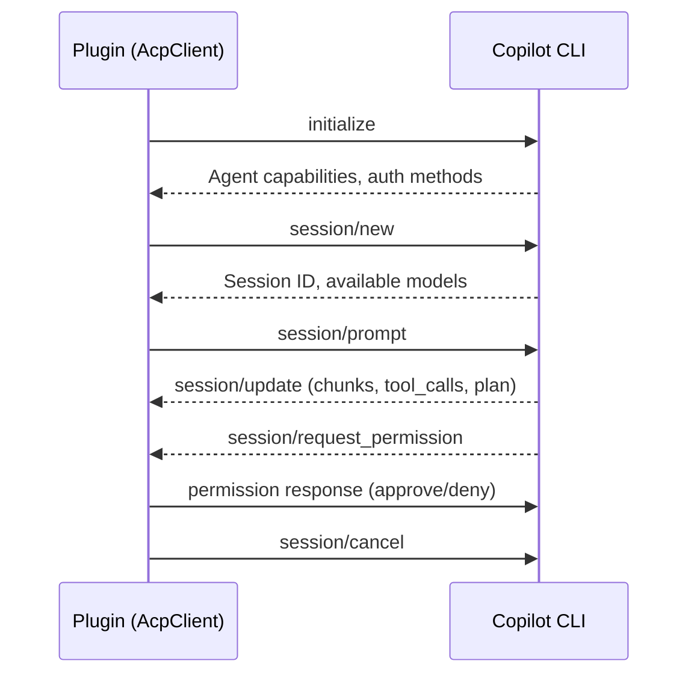
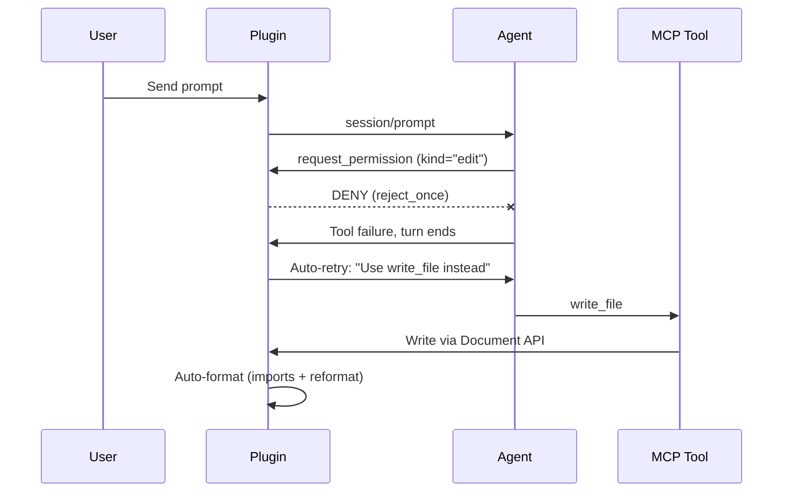
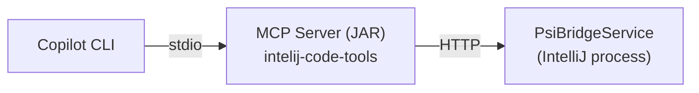

# Development Guide

## Build & Deploy

### Prerequisites

- JDK 21 (Gradle JVM pinned via `gradle.properties` → `org.gradle.java.home`)
- GitHub Copilot CLI installed and authenticated
    - **Windows**: `winget install GitHub.Copilot`
    - **Linux**: `sudo npm install -g @anthropic-ai/copilot-cli` or download from GitHub releases

> **Note:** The Gradle wrapper JAR is not checked into the repository. IntelliJ handles Gradle
> natively (no wrapper needed). For command-line builds, `gradle/actions/setup-gradle` provisions
> it in CI. To use `./gradlew` locally, run `gradle wrapper` once (requires Gradle installed via
> [SDKMAN](https://sdkman.io/) or your package manager).

### Build Plugin

```bash
# Linux
./gradlew :plugin-core:clean :plugin-core:buildPlugin

# Windows (PowerShell)
.\gradlew.bat :plugin-core:clean :plugin-core:buildPlugin
```

Output: `plugin-core/build/distributions/agentbridge-<version>.zip`

> **Note**: If `clean` fails due to locked sandbox files (Windows), omit `:plugin-core:clean`.

### Build Artifacts

The project produces two independent plugin ZIPs, each installable via **Settings → Plugins → ⚙ → Install from Disk**.

```bash
# Build all
./gradlew buildPlugin

# Build individually
./gradlew :plugin-core:buildPlugin
./gradlew :plugin-experimental:buildPlugin
```

#### 1. IDE Agent for Copilot (Main Plugin)

|               |                                                             |
|---------------|-------------------------------------------------------------|
| **Module**    | `plugin-core`                                               |
| **Plugin ID** | `com.github.catatafishen.ideagentforcopilot`                |
| **Output**    | `plugin-core/build/distributions/agentbridge-<version>.zip` |

The primary plugin. Provides the Copilot chat interface, ACP protocol integration, MCP tool bridge,
PSI bridge, settings UI, and all IDE tools. Bundles `mcp-server.jar` (stdio MCP server) in its `lib/`
directory. This is the plugin published to the JetBrains Marketplace.

**Contents:** plugin-core classes + `mcp-server.jar` + chat-ui assets + icons

#### 2. IDE Agent for Copilot (Experimental)

|               |                                                                                  |
|---------------|----------------------------------------------------------------------------------|
| **Module**    | `plugin-experimental`                                                            |
| **Plugin ID** | `com.github.catatafishen.ideagentforcopilot`                                     |
| **Output**    | `plugin-experimental/build/distributions/agentbridge-experimental-<version>.zip` |

A superset of the main plugin with experimental features (currently: macro tool integration).
Shares the same plugin ID as the main plugin — **install one or the other, not both**.
Its `plugin.xml` is generated at build time by merging plugin-core's descriptor with
`macro-extensions.xml`, and appending "(Experimental)" to the display name.

**Contents:** plugin-experimental classes + repackaged `plugin-core.jar` + `mcp-server.jar` + macro extensions

> **Note:** The experimental variant allows `INTERNAL_API_USAGES` in plugin verification
> (macro tools use internal JetBrains APIs). It is not published to the Marketplace.

#### Version Format

ZIP filenames include the version, which varies by build context:

| Context                   | Version             | Example                         |
|---------------------------|---------------------|---------------------------------|
| Local dev                 | `<base>-<git-hash>` | `agentbridge-1.5.0-a3b2c1d.zip` |
| Release (`-Prelease`)     | `<base>`            | `agentbridge-1.5.0.zip`         |
| CI (`PLUGIN_VERSION` env) | `<ci-version>`      | `agentbridge-1.5.0-rc1.zip`     |

### Deploy to IntelliJ

The plugin ZIP must be extracted into IntelliJ's plugin directory.

> **Note:** For Toolbox-managed IntelliJ on Linux, plugins are direct subfolders under
> `~/.local/share/JetBrains/IntelliJIdea<version>/` — there is **no** `plugins/` parent directory.

**Linux:**

```bash
# Find your IntelliJ plugin directory (adjust version as needed)
# Toolbox-managed: plugins are direct subfolders (no /plugins parent)
PLUGIN_DIR=~/.local/share/JetBrains/IntelliJIdea2025.3

# Stop IntelliJ if running, then install
rm -rf "$PLUGIN_DIR/plugin-core"
unzip -q plugin-core/build/distributions/agentbridge-*.zip -d "$PLUGIN_DIR"

# Launch IntelliJ
idea &  # or full path to idea.sh
```

**Windows (PowerShell):**

```powershell
$ij = Get-Process -Name "idea64" -ErrorAction SilentlyContinue
if ($ij) { Stop-Process -Id $ij.Id -Force; Start-Sleep -Seconds 5 }

Remove-Item "$env:APPDATA\JetBrains\IntelliJIdea2025.3\plugins\plugin-core" -Recurse -Force -ErrorAction SilentlyContinue
Expand-Archive "plugin-core\build\distributions\plugin-core-*.zip" `
    "$env:APPDATA\JetBrains\IntelliJIdea2025.3\plugins" -Force

Start-Process "$env:LOCALAPPDATA\JetBrains\IntelliJIdea2025.3\bin\idea64.exe"
```

### Deploy to Main IDE After Code Changes

The sandbox IDE (`runIde`) picks up changes automatically, but the **main IDE does not**.
After every code change, run these 3 commands to rebuild and deploy:

```bash
cd /path/to/agentbridge

# 1. Build the plugin zip (-x buildSearchableOptions avoids launching a conflicting IDE instance)
./gradlew :plugin-core:buildPlugin -x buildSearchableOptions --quiet

# 2. Remove the old installed plugin (stale JARs cause issues otherwise)
rm -rf ~/.local/share/JetBrains/IntelliJIdea2025.3/plugin-core

# 3. Extract the new one (zip filename includes commit hash, so always use latest)
unzip -q "$(ls -t plugin-core/build/distributions/*.zip | head -1)" -d ~/.local/share/JetBrains/IntelliJIdea2025.3/
```

Then **restart the main IDE**.

> **Key points:**
> - The plugin install path is `~/.local/share/JetBrains/IntelliJIdea2025.3/plugin-core/` — no `plugins/` subfolder (
    Toolbox-managed layout)
> - You **must** `rm -rf` the old folder first, then unzip — otherwise stale JARs remain
> - `-x buildSearchableOptions` is required because that task tries to launch an IDE instance which conflicts with the
    running one
> - The zip filename includes a commit hash (e.g. `plugin-core-0.2.0-2bb9797.zip`), so always use `ls -t ... | head -1`
    to get the latest

### Sandbox IDE (Development)

Run the plugin in a sandboxed IntelliJ instance (separate config/data, doesn't touch your main IDE):

```bash
# Linux
./gradlew :plugin-core:runIde

# Windows (PowerShell)
.\gradlew.bat :plugin-core:runIde
```

- First launch takes ~90s (Gradle configuration + dependency resolution)
- Opens a fresh IntelliJ with the plugin pre-installed
- Sandbox data stored in `plugin-core/build/idea-sandbox/`
- Open a **different project** than the one open in your main IDE to avoid conflicts

**Auto-reload (Linux only):** `autoReload = true` is configured in `build.gradle.kts`. On Linux, after code changes run
`./gradlew :plugin-core:prepareSandbox` and the plugin reloads without restarting the sandbox IDE. On Windows, file
locks prevent this — close the sandbox IDE first, then re-run `runIde`.

**Iterating on changes:**

1. Close the sandbox IDE (Windows) or leave it open (Linux)
2. `./gradlew :plugin-core:prepareSandbox` (rebuilds plugin into sandbox)
3. On Windows: `./gradlew :plugin-core:runIde` (relaunches sandbox)
4. On Linux: plugin auto-reloads in the running sandbox IDE

### Run Tests

```bash
./gradlew test                              # All tests
./gradlew :plugin-core:test                 # Plugin unit tests only
./gradlew :mcp-server:test                  # MCP server tests only
./gradlew :plugin-core:test -Dinclude.integration=true  # Include integration tests
```

## Architecture

### ACP Protocol Flow

The plugin communicates with GitHub Copilot CLI via the **Agent Client Protocol (ACP)** — JSON-RPC 2.0 over
stdin/stdout:



### Known ACP Limitations

#### ResourceReference Content Not Inlined (Copilot-specific)

The ACP `session/prompt` request supports a `prompt` array containing both `type: "resource"` blocks
(with URI, MIME type, and text content) and `type: "text"` blocks. However, GitHub Copilot surfaces
the resource references only as tagged-file metadata — the agent sees the file path and line count but
**not** the actual content.

**Current workaround:** `buildEffectivePromptWithContent()` appends the referenced file content as
plain text after the user's message. The `ResourceReference` objects are still sent in parallel so that
agents which honour structured references get typed metadata.

**Multi-agent impact:** When implementing new `AgentConfig` backends, test whether the agent surfaces
resource-reference content natively. If it does, skip the text duplication to avoid wasting context
window tokens. This check should be part of each agent's `AgentConfig` implementation.

### Permission Deny + Retry Flow

Built-in Copilot file operations are **denied** so all writes go through IntelliJ's Document API:



**Denied permission kinds**: `edit`, `create`, `read`, `execute`, `runInTerminal`  
**Auto-approved**: `other` (MCP tools)  
**Intercepted via notifications**: `view`, `grep`, `glob` (read-only built-in tools that bypass permission)

### MCP Tool Bridge



- **MCP Server** (`mcp-server/`): Standalone JAR, stdio protocol, routes tool calls to PSI bridge
- **PSI Bridge** (`PsiBridgeService`): HTTP server inside IntelliJ process, accesses PSI/VFS/Document APIs
- **Bridge file**: `~/.copilot/psi-bridge.json` contains port for HTTP connection

### Auto-Format After Write

Every file write through `write_file` triggers:

1. `PsiDocumentManager.commitAllDocuments()`
2. `OptimizeImportsProcessor`
3. `ReformatCodeProcessor`

This runs inside a single undoable command group on the EDT.

### JCEF OSR Freeze After Prolonged EDT Block

**Summary:** A prolonged EDT (Event Dispatch Thread) freeze (30+ seconds) can permanently stall
the JCEF off-screen renderer. The JS engine remains alive (`executeJs` succeeds, DOM updates),
but the visual viewport is stuck on the pre-freeze frame.

**Chain of events (first observed 2026-05-09):**

1. **Trigger:** Burst of 10+ simultaneous `read_file` MCP tool calls.
2. **Amplification:** Each `read_file` call invokes `followFileIfEnabled()`, which opens the file
   in the editor via `OpenFileDescriptor.navigate()`.
3. **VCS cascade:** Opening each file triggers IntelliJ's VCS integration — `git log` (to fetch
   revision info) and `git blame` (for gutter annotations) per file. On large repositories these
   can take 10–80 seconds *each*.
4. **EDT blocked:** The git operations cascaded, blocking EDT for 72 seconds total
   (`git log` 54s + `git log` 12s + `git blame` 80s).
5. **JCEF desynchronized:** In OSR mode, CEF delivers rendered frames to Swing via `onPaint()`
   callbacks. During the freeze, Swing couldn't process `repaint()`. After EDT unblocked, CEF
   stopped delivering new frames — it believed the last frame was acknowledged, but Swing never
   actually painted it. Without a `wasResized()` or `invalidate()` signal, no fresh frame was
   ever sent.
6. **Permanent freeze:** The panel appeared permanently frozen — the scrollbar indicated more
   content below (DOM was updated by JS), but the visual viewport was stuck and unresponsive
   to mouse events.

**Defenses implemented:**

| Defense | Class | Purpose |
|---------|-------|---------|
| `EdtFreezeRecovery` | `ui/EdtFreezeRecovery.kt` | EDT heartbeat monitor. Detects freezes >30s and triggers JCEF OSR recovery (`setWindowVisibility` toggle + `wasResized` + `invalidate`) on all registered browsers. Logs at ERROR level. |
| `followFileIfEnabled` cooldown | `psi/tools/file/FileTool.java` | 2-second cooldown between file-open navigations. When 10+ tool calls arrive in a burst, only the first opens a file; subsequent calls are throttled. Prevents cascading VCS operations. |
| `MonitorSwitchRecovery` | `ui/MonitorSwitchRecovery.kt` | Pre-existing. Recovers JCEF after monitor/display changes. Same recovery sequence, different trigger. |

**Debugging similar issues:**

1. Check `~/.cache/JetBrains/IntelliJIdea*/log/idea.log` (and rotated `idea.1.log`, `idea.2.log`)
   for `UI was frozen for Nms` from `PerformanceWatcherImpl`.
2. Look for `git log took Nms` or `git blame took Nms` from `git4idea.commands.GitHandler`.
3. Check `ActionUpdater` logs — `N ms to grab EDT` values above 100ms indicate EDT contention.
   Values above 1000ms indicate a serious freeze.
4. Thread dumps are saved to `~/.cache/JetBrains/IntelliJIdea*/log/threadDumps-freeze-*`.
   These show what was on EDT during the freeze.
5. Our `EdtFreezeRecovery` logs at ERROR level: search for `EDT was unresponsive for` to find
   automatic recovery events.
6. The `read_ide_log` MCP tool only reads the current in-memory log — for historical analysis,
   grep the rotated log files directly.

### JCEF Cursor Bridge

JCEF does **not** propagate CSS `cursor` values to the Swing host component. Setting
`cursor: grab` in CSS changes the cursor inside the Chromium renderer, but the Swing
`JComponent` that wraps the browser ignores it — the user sees the default arrow.

All cursor changes must go through a three-layer bridge:

```
CSS (visual only) → JS mouseover / event handler → _bridge.setCursor(name) → Kotlin → java.awt.Cursor
```

**Layer 1 — CSS** (`chat.css`): Declare `cursor:` as usual for web styling. This is still
needed for the in-browser rendering but has **no effect** on the actual Swing cursor.

**Layer 2 — JavaScript** (`index.ts` + component files):

- A global `mouseover` listener in `index.ts` maps element selectors to cursor names
  (e.g. `.chip-strip` → `'grab'`, `.tool-popup-resize` → `'nwse-resize'`).
- For **dynamic** cursor changes (drag-in-progress, resize-in-progress), the component must
  call `globalThis._bridge?.setCursor()` directly in its `mousedown`/`mouseup` handlers,
  because `mouseover` doesn't fire when a CSS class is toggled on the current element.

**Layer 3 — Kotlin** (`ChatConsolePanel.kt`): The `cursorQuery` handler maps string names
to `java.awt.Cursor` constants:

| Bridge value           | Java cursor        |
|------------------------|--------------------|
| `"pointer"`            | `HAND_CURSOR`      |
| `"text"`               | `TEXT_CURSOR`      |
| `"grab"`, `"grabbing"` | `MOVE_CURSOR`      |
| `"nwse-resize"`        | `SE_RESIZE_CURSOR` |
| anything else          | `DEFAULT_CURSOR`   |

**When adding a new interactive cursor:**

1. Add the CSS `cursor:` property (for in-browser rendering)
2. Add the selector to the `mouseover` handler in `index.ts`, **or** call
   `globalThis._bridge?.setCursor()` directly from the component's event handlers
3. Add the string → `java.awt.Cursor` mapping in `ChatConsolePanel.kt`

### Jewel Compose Components

IntelliJ 2024.2+ bundles [Jewel](https://github.com/JetBrains/jewel) — JetBrains' Compose for Desktop
UI toolkit. Use it for new UI components to get **IDE Compose UI Preview** support and automatic
light/dark theme integration.

#### Setup

Add both declarations to `build.gradle.kts` if not already present:

```kotlin
// plugins block
kotlin("plugin.compose") version "2.3.20"

// intellijPlatform { } dependencies block
composeUI()
```

#### Wrapping Swing with Jewel: JewelComposePanel

Jewel components can't be placed directly in Swing layouts. Wrap them with `JewelComposePanel`:

```kotlin
// The JPanel is the Swing-compatible container your existing code sees.
// JewelComposePanel provides the Compose runtime inside it.
class MyWidget : JPanel(BorderLayout()) {
    private var widgetState by mutableStateOf(MyState())

    init {
        isOpaque = false
        add(JewelComposePanel(focusOnClickInside = false) {
            MyComposable(state = widgetState)
        })
    }

    fun update(newState: MyState) {
        widgetState = newState  // triggers Compose recomposition automatically
    }
}
```

Key properties of `JewelComposePanel`:

- `focusOnClickInside = false` — prevents the panel from stealing keyboard focus on click
  (appropriate for toolbar widgets and read-only panels)
- `mutableStateOf` from `androidx.compose.runtime` wires Swing setters to Compose recomposition

#### Theme-Aware Colors

Never hardcode colors — use these helpers so components adapt to light/dark themes:

| Source                 | Code                                                                                                  |
|------------------------|-------------------------------------------------------------------------------------------------------|
| JCEF token             | `retrieveColor("Label.infoForeground", isDark = JewelTheme.isDark, default = ..., defaultDark = ...)` |
| IntelliJ AWT Color     | `myAwtColor.toComposeColor()`                                                                         |
| `ToolRenderers` colors | `ToolRenderers.SUCCESS_COLOR.toComposeColor()`                                                        |
| Jewel semantic color   | `JewelTheme.globalColors.text`                                                                        |

Always read `JewelTheme.isDark` **inside** the composable — it's a Compose state that triggers
recomposition on theme switch.

#### Preview Organization

**Co-locate `@Preview` functions with the component they preview** — this is the JetBrains/Jewel
convention. Keep them `private` (they're documentation, not API):

```kotlin
// In the same file as MyComposable:
@Preview
@Composable
private fun PreviewMyComposableIdle() {
    MyComposable(state = MyState(isRunning = false, text = "42s"))
}

@Preview
@Composable
private fun PreviewMyComposableRunning() {
    MyComposable(state = MyState(isRunning = true, text = "3s"))
}
```

Guidelines:

- **One preview per meaningful state** (idle, running, error, empty, overflow, etc.)
- **Name by component + state**: `Preview<ComponentName><State>` (e.g. `PreviewTimerStatsRunning`)
- **Use realistic sample data** — the preview is the component's visual documentation
- **Nested/full-view previews** are fully supported: any composable that takes sample data can be
  previewed, including ones that compose many sub-components together
- `@Preview` functions are compiled into production code but have zero runtime cost — no need for
  a separate source set

#### What to Migrate (and What Not To)

| Component type                             | Migrate to Jewel? | Reason                                     |
|--------------------------------------------|-------------------|--------------------------------------------|
| Custom Swing panels with show/hide         | ✅ Yes             | Compose state replaces manual visibility   |
| `JBLabel`-based display widgets            | ✅ Yes             | `Text` + `mutableStateOf` is cleaner       |
| IntelliJ `ActionToolbar`                   | ❌ No              | Actions must stay as `AnAction` subclasses |
| `EditorTextField` / `EditorImpl`           | ❌ No              | Deeply platform-integrated Swing component |
| `InlineBanner` / `EditorNotificationPanel` | ❌ No              | Already a native JB component              |

## Key Files

| File                                                    | Purpose                                     |
|---------------------------------------------------------|---------------------------------------------|
| `plugin-core/.../bridge/AcpClient.java`                 | ACP client, permission handler, retry logic |
| `plugin-core/.../psi/PsiBridgeService.java`             | 92 MCP tools via IntelliJ APIs              |
| `plugin-core/.../services/CopilotService.java`          | Service entry point, starts ACP client      |
| `plugin-core/.../ui/AgenticCopilotToolWindowContent.kt` | Main UI (Kotlin Swing)                      |
| `mcp-server/.../mcp/McpServer.java`                     | MCP stdio server, tool registrations        |

## Debugging

### Enable Debug Logging

Add to `Help > Diagnostic Tools > Debug Log Settings`:

```
#com.github.catatafishen.ideagentforcopilot
```

### Log Locations

- **Linux IDE**: `~/.local/share/JetBrains/IntelliJIdea2025.3/log/idea.log`
- **Windows IDE**: `%LOCALAPPDATA%\JetBrains\IntelliJIdea2025.3\log\idea.log`
- **Sandbox IDE**: `plugin-core/build/idea-sandbox/IU-2025.3.1.1/log/idea.log`
- **PSI bridge port**: `~/.copilot/psi-bridge.json`

### Common Issues

| Issue                             | Cause                         | Fix                           |
|-----------------------------------|-------------------------------|-------------------------------|
| "Error loading models"            | Copilot CLI not authenticated | Run `copilot auth`            |
| "RPC call failed: session.create" | ACP process died              | Check `idea.log` for stderr   |
| Agent uses built-in edit tool     | Deny+retry not working        | Check permission handler logs |
| "file changed externally" dialog  | Write bypassed Document API   | Verify `write_file` is used   |

### Platform API False Positives (`PlatformApiCompat`)

The IDE daemon shows false-positive resolution errors on certain IntelliJ Platform API calls.
This happens because the dev IDE resolves symbols against its **own** bundled platform JARs,
which differ from the target SDK configured in Gradle (`platformVersion` in `build.gradle.kts`).
The Gradle build compiles cleanly — only the IDE analyzer is affected.

**Symptoms:** Red error highlights like `Cannot resolve method 'getService'`, `Cannot resolve
method 'connect()'`, `Unknown class`, or `Incompatible types` on standard platform API calls.

**Solution:** All affected API calls are wrapped in
`PlatformApiCompat.java` (`plugin-core/.../psi/PlatformApiCompat.java`). This concentrates
all false positives in a single file. Each wrapper method has Javadoc explaining:

- What the original API call is
- Why the IDE shows a false positive
- Why it compiles and works correctly at runtime

**When you encounter a new false positive:**

1. Add a new static method to `PlatformApiCompat` with a descriptive name
2. Add Javadoc explaining the false positive (follow existing examples)
3. Replace the call site with the wrapper
4. Verify with `./gradlew :plugin-core:compileJava :plugin-core:compileKotlin --quiet`

**Known false-positive patterns:**

| Pattern                                        | Example                                                      |
|------------------------------------------------|--------------------------------------------------------------|
| `@NotNull` annotation mismatch                 | `PluginManagerCore.isPluginInstalled(PluginId)`              |
| Extension point generics                       | `ConfigurationType.CONFIGURATION_TYPE_EP.getExtensionList()` |
| `Project.getService(Class<T>)` wildcard bounds | `project.getService(someClass)`                              |
| MessageBus connect/subscribe/disconnect        | `project.getMessageBus().connect()`                          |
| JCEF adapter method signatures                 | `CefLoadHandlerAdapter`, `CefDisplayHandlerAdapter`          |
| Kotlin platform types vs Java generics         | `LafManagerListener.TOPIC`                                   |
| Git4Idea bundled plugin APIs                   | `HashImpl`, `GitRepositoryManager`, `GitLineHandler`         |
| JPS model types                                | `JavaSourceRootType`, `JavaSourceRootProperties`             |
| `ThrowableRunnable` functional interface       | `WriteAction.runAndWait()`                                   |

> **Related:** For deprecated / experimental API usages that the Plugin Verifier reports
> at CI time (and the rationale for keeping each), see
> [`docs/ACCEPTED-API-WARNINGS.md`](docs/ACCEPTED-API-WARNINGS.md).

## Dynamic Plugin Loading

The plugin declares `require-restart="false"` in `plugin.xml` and uses only dynamic-compatible
extension points (including `ProjectActivity` instead of the legacy `StartupActivity`).

### Platform limitation: "Install from Disk" always requires restart for updates

IntelliJ's `PluginInstaller.installFromDisk` (2025.3) contains this logic:

```java
Path oldFile = installedPlugin != null && !installedPlugin.isBundled()
        ? installedPlugin.getPluginPath() : null;
boolean isRestartRequired = oldFile != null
        || !DynamicPlugins.allowLoadUnloadWithoutRestart(pluginDescriptor)
        || operation.isRestartRequired();
```

The `oldFile != null` check **short-circuits** — when the plugin is already installed (i.e. an
update), `oldFile` is always non-null, so the platform never even calls
`allowLoadUnloadWithoutRestart`. Restart is unconditionally required for all disk-based updates.

This means:

- **Fresh install from disk** → can load dynamically (no restart) ✅
- **Update existing plugin from disk** → always requires restart ❌
- **Marketplace updates** → use a different code path that supports dynamic updates ✅
- **Sandbox `autoReload`** → uses `prepareSandbox` + `DynamicPlugins` API directly ✅

### What we did to support dynamic loading

1. **`require-restart="false"`** in `plugin.xml`
2. **Migrated `PsiBridgeStartup`** from Java `StartupActivity.DumbAware` (legacy, non-dynamic) to
   Kotlin `ProjectActivity` (modern, dynamic-compatible)
3. **All extension points are dynamic-compatible**: `toolWindow`, `applicationService`,
   `projectService`, `postStartupActivity` (with `ProjectActivity`), `notificationGroup`, `iconMapper`
4. **No legacy components**: no `<application-components>` or `<project-components>`
5. **No `<listeners>` section** that could block unload

### Verifying dynamic compatibility at runtime

`PsiBridgeStartup` previously included a diagnostic that called
`DynamicPlugins.allowLoadUnloadWithoutRestart()` via reflection. At runtime this returns `true`,
confirming the plugin is dynamic-compatible from the platform's perspective.

### Workarounds for development

- **Sandbox IDE**: Use `./gradlew :plugin-core:prepareSandbox` — auto-reload works without restart
- **Main IDE (CLI deploy)**: Use the `rm -rf` + `unzip` approach from
  the [Deploy](#deploy-to-main-ide-after-code-changes) section, then restart
- **Main IDE (UI install)**: Accept the restart — it's a platform limitation for disk-based updates

## Test Coverage

- **AcpProtocolRegressionTest**: 16 tests — protocol format, permission handling, deny logic
- **AcpEndToEndTest**: 33 tests — end-to-end protocol flows, streaming, tool calls
- **CopilotAcpClientTest**: 15 tests — DTOs, lifecycle, real Copilot integration
- **CopilotFreeModelIntegrationTest**: 3 tests — free model integration
- **WrapLayoutTest**: 6 tests — UI layout
- **McpServerTest**: 24 tests — all MCP tools, security (path traversal), protocol

## Contributing

### Branch Strategy

- **`master`** is protected — no direct pushes
- Create feature branches and merge through pull requests
- PRs run CI automatically (build + test + plugin verification)
- Merging to `master` triggers automatic versioning and release

### Conventional Commits

All commit messages **must** follow the [Conventional Commits](https://www.conventionalcommits.org/) specification.
The release workflow uses these to automatically determine the next semantic version.

**Format:** `<type>(<optional scope>): <description>`

| Type       | When to use                                             | Version bump |
|------------|---------------------------------------------------------|--------------|
| `feat`     | New feature or capability                               | **minor**    |
| `fix`      | Bug fix                                                 | **patch**    |
| `docs`     | Documentation only                                      | **patch**    |
| `chore`    | Build, CI, tooling, dependencies                        | **patch**    |
| `refactor` | Code change that neither fixes a bug nor adds a feature | **patch**    |
| `test`     | Adding or updating tests                                | **patch**    |
| `perf`     | Performance improvement                                 | **patch**    |
| `style`    | Formatting, whitespace (no logic change)                | **patch**    |

**Breaking changes** → **major** bump:

- Add `!` after the type: `feat!: remove legacy API`
- Or include `BREAKING CHANGE:` in the commit body

**Examples:**

```
feat: add run_inspections tool with scope filtering
fix: resolve timeout when permission dialog is pending
docs: update changelog for 0.3.0 release
chore: bump Kotlin to 2.3.10
feat!: drop support for IntelliJ 2025.1
```

### CI/CD Pipeline

| Trigger             | Workflow      | What it does                                                          |
|---------------------|---------------|-----------------------------------------------------------------------|
| Pull request opened | `ci.yml`      | Build, test (MCP + plugin), verify plugin compatibility               |
| PR merged to master | `release.yml` | Calculate next semver, tag, build release ZIP, publish GitHub Release |

---

## Removed Features (Internal API Limitations)

### Macro Tool Integration

**Removed in:** commit `49e40b8` (2026-03-06)

The plugin previously included a "Macro Tools" feature that let users expose recorded IntelliJ
macros as MCP tools. An agent could then replay macros programmatically, with before/after
diffing and action sequence reporting.

**Why removed:** The feature depended entirely on `com.intellij.ide.actionMacro` — a package
marked `@ApiStatus.Internal` by JetBrains. The plugin verifier rejects any direct usage of
these APIs, blocking Marketplace publication.

**Internal APIs that were used (no public replacements exist):**

| Purpose                       | Internal API                                      |
|-------------------------------|---------------------------------------------------|
| Get macro manager singleton   | `ActionMacroManager.getInstance()`                |
| List all recorded macros      | `ActionMacroManager.getAllMacros()`               |
| Check if recording is active  | `ActionMacroManager.isRecording()`                |
| Check if playback is active   | `ActionMacroManager.isPlaying()`                  |
| Play a macro programmatically | `ActionMacroManager.playMacro(ActionMacro)`       |
| Get a macro's name            | `ActionMacro.getName()`                           |
| Inspect action steps          | `ActionMacro.getActions()` → `ActionDescriptor[]` |
| Describe each step            | `ActionDescriptor.generateTo(StringBuffer)`       |

**Files that were removed:**

- `MacroToolHandler.java` — MCP tool handler that replayed macros with diff capture
- `MacroToolConfigurable.java` — Settings UI for enabling/configuring macro tools
- `MacroToolRegistrar.java` — Service that synced macro registrations with PsiBridgeService
- `MacroToolSettings.java` — Persistent state for macro tool configuration
- `MacroApiBridge.java` — Intermediate reflection bridge (also removed — hiding internal
  API usage behind reflection is not an acceptable workaround)

**Re-enabling:** If JetBrains publishes a public API for macro discovery and playback, the
feature can be restored. The removed commit contains the complete implementation. To recover:

```bash
git show 49e40b8^ -- \
  plugin-core/src/main/java/com/github/catatafishen/ideagentforcopilot/psi/MacroToolHandler.java \
  plugin-core/src/main/java/com/github/catatafishen/ideagentforcopilot/settings/MacroToolConfigurable.java \
  plugin-core/src/main/java/com/github/catatafishen/ideagentforcopilot/services/MacroToolRegistrar.java \
  plugin-core/src/main/java/com/github/catatafishen/ideagentforcopilot/services/MacroToolSettings.java
```

**Unofficial builds:** The macro feature is available in the `plugin-experimental` module.
This module produces a separate ZIP (`agentbridge-experimental-*.zip`) that includes
all standard plugin-core functionality plus the macro tools. It is:

- **Built on master merge** via `release.yml` and attached to GitHub releases
- **Not built during PR CI** (to avoid internal API verification failures blocking PRs)
- **Not published to JetBrains Marketplace** (would fail the verifier)

The experimental module works by:

1. Repackaging `plugin-core.jar` without its `plugin.xml`
2. Generating a merged `plugin.xml` from plugin-core's descriptor + macro extension entries
3. Compiling the 4 macro source files against plugin-core (via `compileOnly`)
4. Allowing `INTERNAL_API_USAGES` in its `verifyPlugin` configuration

To build locally: `./gradlew :plugin-experimental:buildPlugin`

**JetBrains YouTrack:** If you'd like this API made public, file a feature request at
https://youtrack.jetbrains.com/issues/IJPL requesting public API access for macro
discovery and playback (`ActionMacroManager`, `ActionMacro`).

### Ctrl+Q "Press Ctrl+Q to toggle preview" Hint (IntelliJ 2026.2 EAP)

**Status:** Not fixed — 2026.2 is still in preview. Revisit when it reaches GA.

**Symptom:** IntelliJ 2026.2 EAP adds a "Press Ctrl+Q to toggle preview" footer hint to action
popup menus in two places:

1. **Model selector dropdown** — shown when opening the model picker from the toolbar.
2. **Shortcut hints overflow popup** — shown when the `>>` chevron is clicked on the shortcut
   hints toolbar.

**What was tried (reverted in commit `fix/shortcut-hints-alignment-and-ctrl-q`):**

*Model selector (ungrouped path):*

Overrode `createActionPopup` in `ModelSelectorAction` to call
`JBPopupFactory.createActionGroupPopup` with `ActionSelectionAid.MNEMONICS` instead of delegating
to `super.createActionPopup`, which uses `SPEEDSEARCH`. The Ctrl+Q hint appears to be linked to
`SPEEDSEARCH` mode in 2026.2. The override worked for the non-grouped model list path; the grouped
path was unaffected (uses `createGroupedPopup` already).

```kotlin
// What was tried — reverted because 2026.2 is preview
override fun createActionPopup(context, component, disposeCallback): JBPopup {
    if (supportsModelGrouping()) return createGroupedPopup(disposeCallback)
    val group = createPopupActionGroup(component, context)
    val popup = JBPopupFactory.getInstance()
        .createActionGroupPopup(null, group, context, ActionSelectionAid.MNEMONICS, false)
    disposeCallback?.let { popup.addListener(object : JBPopupListener {
        override fun onClosed(e: LightweightWindowEvent) = it.run()
    }) }
    return popup
}
```

*Shortcut hints overflow popup:*

Set `templatePresentation.description = ""` in `ShortcutHintAction.init`. The hint renders only
when an action has a non-empty description. Setting it to empty suppressed the footer in 2026.2 EAP.

```kotlin
// What was tried — reverted because 2026.2 is preview
init {
    templatePresentation.text = KeyBadge.formatKeystroke(stroke) + " " + label
    templatePresentation.description = ""  // suppresses Ctrl+Q hint in overflow popup
}
```

**Why reverted:** 2026.2 is still EAP and the behavior may change before GA. Both fixes were
targeted exclusively at 2026.2 — they do not affect 2025.x or 2026.1 in any visible way, but
keeping dead workarounds for unreleased versions adds noise. Re-apply when 2026.2 reaches GA
and confirm the behavior is stable.
