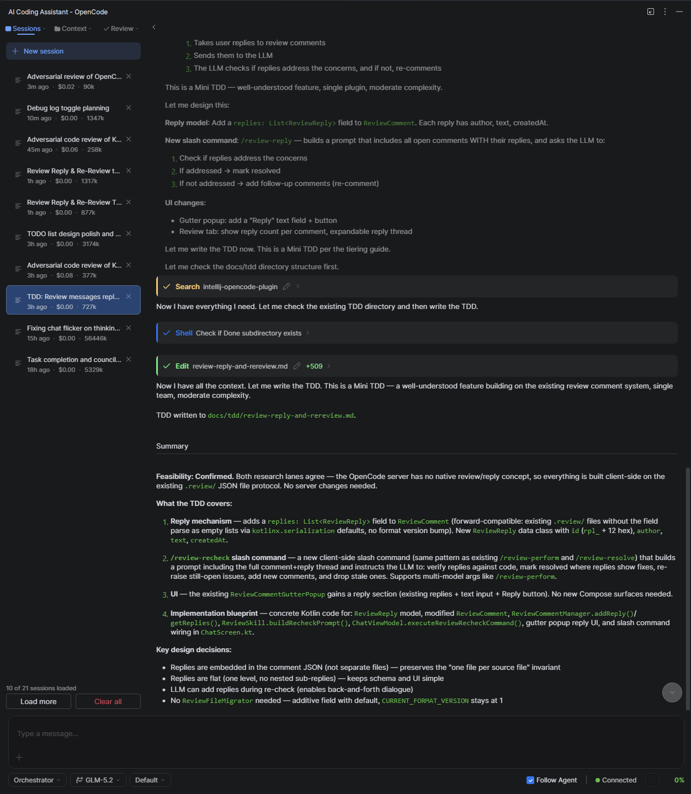
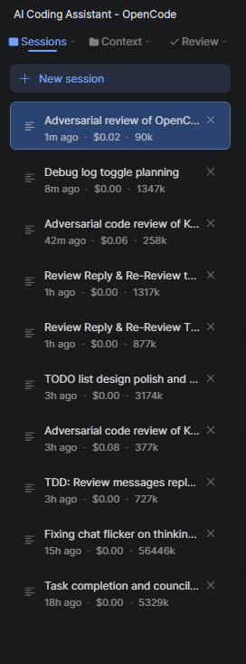
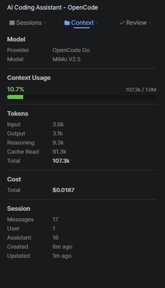
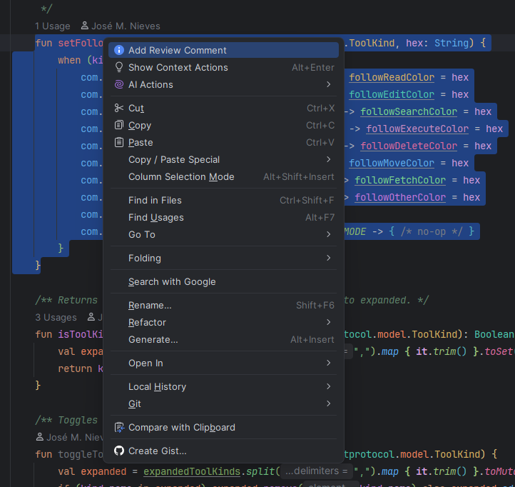
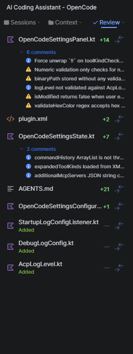
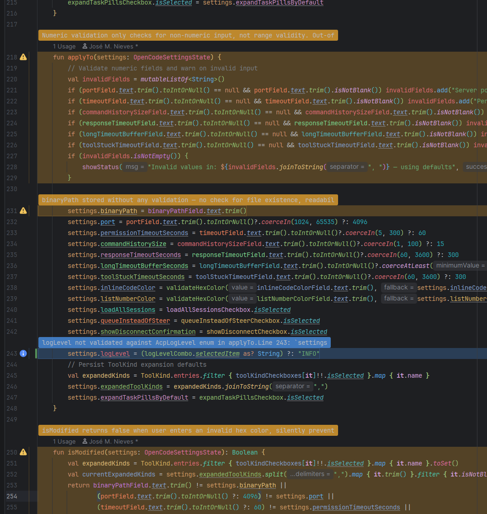
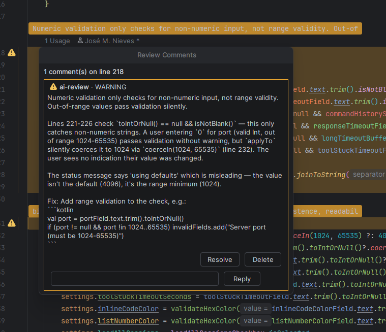

# What's this?

This is an [OpenCode](https://opencode.ai/) plugin for IntelliJ that actually integrates with the IDE instead of just wrapping the CLI.

Most OpenCode plugins I tried fell into one of two camps: a thin CLI wrapper with no real IDE integration, or a bloated plugin that pushes its own workflow and ideas on you. This one tries to stay out of the way.

The bigger problem I have with coding assistants is that they tend to take the wheel. They write code, you accept it, and you move on. That makes it easy to ship stuff you don't fully understand. This plugin focuses on review as a first-class step - you can review code OpenCode wrote inline in the editor before anything reaches GitHub or your CI. The goal is to catch mistakes early and make sure the code you commit actually meets your standards. 

<div align="center">



</div>

*The main chat interface with sessions on the left and the conversation in the middle. Tool pills and markdown responses show up inline.*

## What it does

- **AI chat inside the IDE** - Ask questions, paste code, attach files, and get answers in a side panel. Responses render markdown, code blocks, and inline tool usage.
- **Sessions** - Keep conversations organized. Each session tracks its own token usage and estimated cost.
- **Context panel** - See how much context you're using, what model is active, and a rough cost breakdown.
- **Code review** - The plugin can request reviews from the OpenCode server and show the results both in a dedicated Review tab and as inline comments in the editor gutter. You can resolve, reply to, or delete review comments directly from the editor.
- **Slash commands** - Type `/` in the input to trigger commands like `/clear` and `/cancel`, plus any commands exposed by the connected OpenCode server.
- **Tool permissions and MCP support** - Connect to MCP servers and pick which tools the agent is allowed to call.

<div align="center">



</div>

*Session list with titles, age, cost, and token usage per conversation.*

<div align="center">



</div>

*Context tab showing token breakdown, active model, and total cost.*

## Review workflow

The review feature is one of the more useful parts. There are a few commands that drive it:

- **`/review`** — asks OpenCode to look over the current change and write review comments to `.review/`.
- **`/review-perform`** — runs a stricter, adversarial review that goes deeper into potential issues.
- **`/review-perform-gaming`** — same as `/review-perform`, but tuned for game-engine-specific code.
- **`/review-resolve`** — sends all open comments to the agent and asks it to fix the code and mark them resolved.
- **`/review-recheck`** — re-runs the review with awareness of existing comments and your replies, so the agent can verify whether unresolved issues were actually fixed.

When a review finishes, you get:

- A **Review tab** that lists files, comment counts, and line change summaries.
- **Inline comments** in the editor gutter that you can resolve, reply to, delete, or add your own comments for the AI to address.
- A chat message summarizing what the review found.

You can also add your own comments by right-clicking a line and choosing **Add Review Comment**:

<div align="center">



</div>

*Right-click a line in the editor and choose "Add Review Comment" to drop in your own comment.*

<div align="center">



</div>

*Review tab listing files with comment counts and change totals.*

<div align="center">



</div>

*A single review comment in the editor gutter with resolve, delete, and reply options.*

<div align="center">



</div>

*Multiple AI review comments overlaid directly on the source code.*

## Developer notes

The review workflow stores comments as JSON files under `.review/`, one file per reviewed source path. Comments track a line range, message, severity, and status. The plugin reads these files to render the Review tab and inline gutter comments, and writes them back when comments are resolved or deleted.

Because the comments live in the repo as regular files, they can be committed alongside the code. That means a branch can carry its own review state, and another developer (or an LLM agent) can check out the branch, act on open comments, and resolve them. The OpenCode server has no native review concept, so the plugin uses the filesystem instead of adding server-side storage or new endpoints. This keeps the review protocol simple: anything that can read and write JSON files in `.review/` can participate.

## Heads up

This plugin uses [Jewel](https://github.com/JetBrains/jewel), JetBrains' Compose-based UI toolkit for IntelliJ plugins. Jewel is still evolving, so some UI details might shift or break with future IntelliJ or Jewel updates. If something looks off after an update, that's probably why.

## Requirements

- IntelliJ IDEA 2025.2 or newer.
- The `opencode` CLI installed and available on your system PATH, or configured in the plugin settings.

## Installing

Build the plugin with Gradle, then install the resulting ZIP through **Settings → Plugins → Install Plugin from Disk**.

```bash
./gradlew buildPlugin
```

The plugin ZIP will be under `build/distributions/`.

## Running from source

```bash
./gradlew runIde
```

Logs for `runIde` go to the sandbox directory, not the main IDEA log. See `AGENTS.md` in this repo for the exact path and other dev notes.
