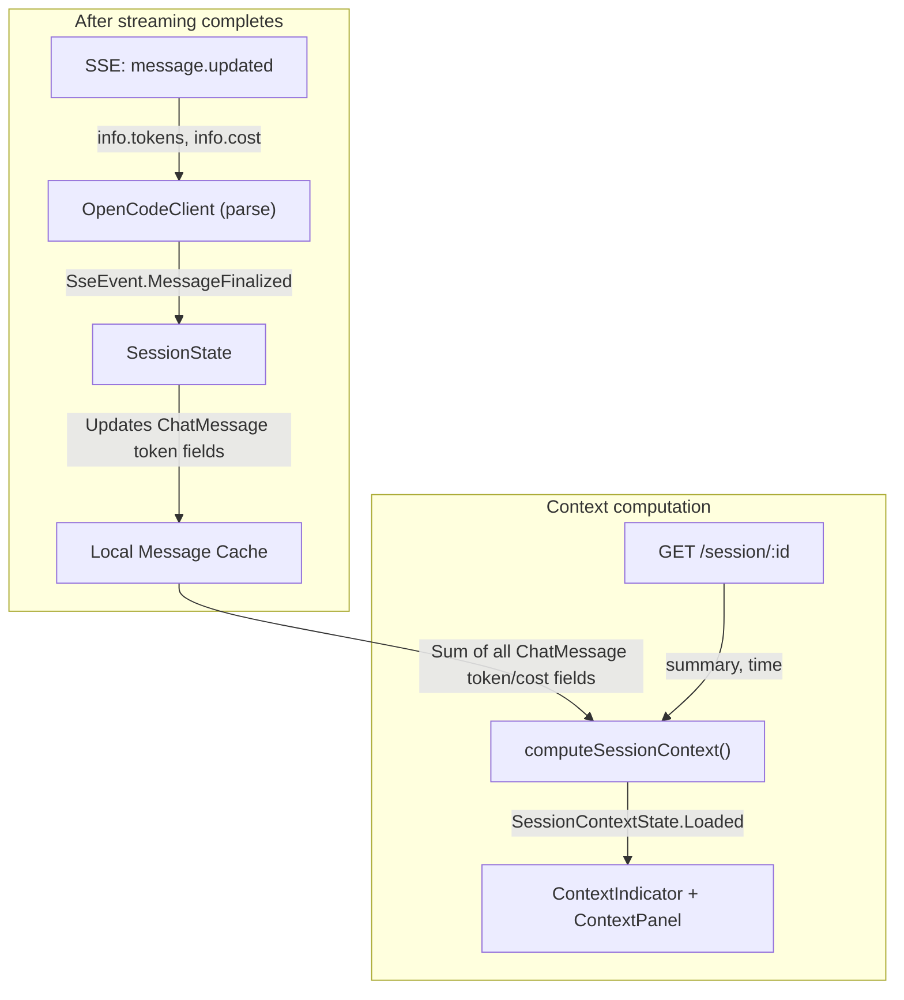
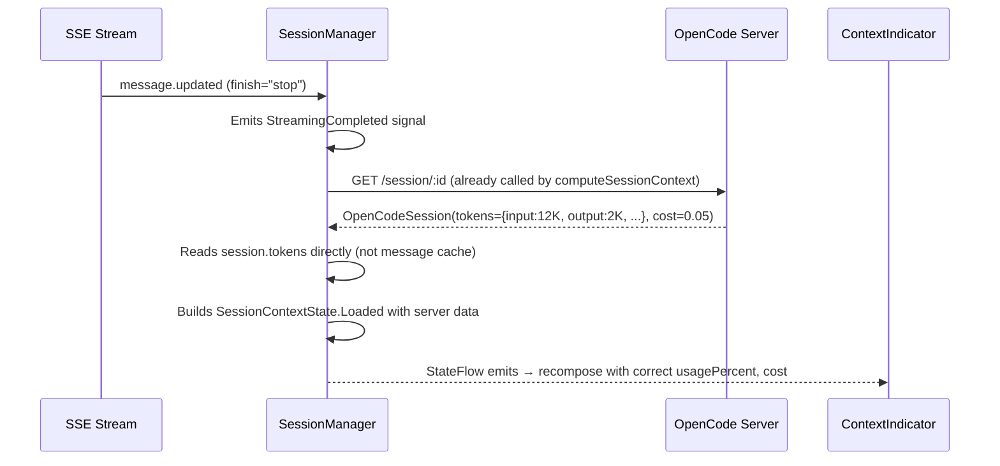
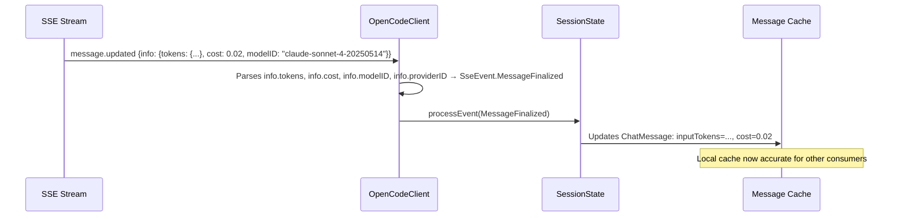

# Technical Design Document: Context Indicator — Use Server-Computed Token Data

> **Status:** Reviewed (revised)
> **Author(s):** —
> **Reviewer(s):** AI orchestrator (critical review pass + review fixes)
> **Last Updated:** 2026-06-08
> **Related docs:** [session-manager.md](../session-manager.md), [AGENTS.md](../../../AGENTS.md)

---

## 1. TL;DR

The context indicator (doughnut ring) and context sidebar tab show stale/zero data after streaming because `computeSessionContext()` reads token counts from the local message cache, where SSE-created messages have zero tokens. The server already provides cumulative session-level token and cost data via `GET /session/:id` → `OpenCodeSession.tokens` and `OpenCodeSession.cost` — but `computeSessionContext()` **already calls this endpoint and ignores those fields**, instead reading from the local message cache. The fix is to use the server's cumulative data as the primary source. Additionally, the `message.updated` SSE event carries final `tokens`/`cost` in its `info` object, but the client only reads `info.finish` — parsing these fields keeps the local `ChatMessage` cache accurate for other consumers.

---

## 2. Context & Scope

### 2.1 Current State

`SessionManager.computeSessionContext()` (`SessionManager.kt:463`) calls `client.getSession(currentSessionId)` which returns `OpenCodeSession` with **cumulative** `tokens: SessionTokens?` and `cost: Double`. But the method **ignores these fields entirely** and instead reads from the local message cache:

```kotlin
// SessionManager.kt:474-476 — the broken read path
val lastAssistant = messages.values.findLast {
    it.role == MessageRole.ASSISTANT && (it.inputTokens + it.outputTokens + ...) > 0
}
```

Two data paths populate `ChatMessage` token fields:

| Path | Token fields | When |
|------|-------------|------|
| **REST API** (`GET /session/:id/message`) → `toChatMessage()` | Populated from `info.tokens` and `info.cost` | Session switch, init |
| **SSE streaming** → `createAssistantMessage()` | All zero (defaults) | During generation |

During streaming, `StepFinish` SSE events arrive with per-step token data, stored as `MessagePart.StepFinish` parts (`SessionState.kt:694`) and rendered as informational pills — never written to `ChatMessage`'s top-level token fields. When `StreamingCompleted` fires → `computeSessionContext()` runs → finds the last assistant message → its token fields are still 0 → the `> 0` filter fails → returns stale/zero context.

**The server already has the correct data.** `OpenCodeSession` from `GET /session/:id` contains:

| Field | Type | Description |
|-------|------|-------------|
| `tokens.input` | `Long` | Cumulative session input tokens |
| `tokens.output` | `Long` | Cumulative session output tokens |
| `tokens.reasoning` | `Long` | Cumulative session reasoning tokens |
| `tokens.cache.read` | `Long` | Cumulative session cache read tokens |
| `tokens.cache.write` | `Long` | Cumulative session cache write tokens |
| `cost` | `Double` | Cumulative session cost (USD) |
| `summary.additions` | `Int` | Lines added |
| `summary.deletions` | `Int` | Lines deleted |
| `summary.files` | `Int` | Files modified |
| `time.created` | `Long` | Session creation timestamp |
| `time.updated` | `Long` | Session last-updated timestamp |

These are server-computed cumulative totals — no client-side accumulation needed.

> **⚠️ V1 API Verified (2026-06-08):** `GET /session/:id` returns `tokens` and `cost` fields but they are **always zero** — the V1 API does NOT populate cumulative session-level token/cost data. The `model` field is entirely absent. However, per-message `tokens`/`cost`/`modelID` ARE populated correctly in `GET /session/:id/message` and `message.updated` SSE events. **Therefore, `computeSessionContext()` must accumulate token/cost from the local message cache** (summing across all `ChatMessage` fields), not from `OpenCodeSession.tokens`/`.cost`. Session `summary` and `time` ARE correctly populated from `GET /session/:id`.

### 2.2 Problem Statement

The context UI shows stale/zero data after streaming because `computeSessionContext()` reads from the local message cache (where SSE-created messages have zero tokens) instead of using the server-computed cumulative data that it already fetches.

### 2.3 Secondary Problem

The `message.updated` SSE event (sent when a message is finalized) carries `info.tokens` and `info.cost` in its payload, but the client only reads `info.finish` (`OpenCodeClient.kt:1013-1024`). This means the local `ChatMessage` cache never gets updated token fields after streaming completes — they stay at zero until the next `loadSessions()` / session switch re-fetches from REST. Additionally, the current handler has redundant branches (both `finish == "stop" || finish == "end"` and `finish != null` emit identical `SseEvent.Stop`) and drops the event entirely if `finish` is absent — even when the message has valid token/cost data.

---

## 3. Goals & Non-Goals

### Goals

1. **Correct context after streaming** — context indicator and sidebar tab show accurate accumulated token counts and cost after each response completes, plus after `session.idle` signals.
2. **Accurate local message cache** — `ChatMessage` token fields are updated from `message.updated` SSE events, providing the data source for context accumulation and other consumers.
3. **Local cache is the accumulation source** — `computeSessionContext()` sums token/cost across all messages in the local cache (kept accurate by `MessageFinalized`). The V1 API session endpoint does NOT provide cumulative totals.

### Non-Goals

- **Live token updates during streaming** — `StepFinish` events carry per-step data whose accumulation semantics are unclear (incremental vs. per-step-cumulative). The context indicator shows the last known state during streaming and updates when the server provides fresh data after streaming completes. This matches the server's auto-compaction model (see AGENTS.md: "Auto-Compaction is Server-Side").
- **Per-message token breakdown in context panel** — the context panel shows session-level totals from `OpenCodeSession.tokens`, not per-message breakdowns. Per-message token data is available in `ChatMessage` fields (after the `message.updated` fix) for future UI use.

---

## 4. Proposed Solution

**Two targeted fixes, no new components:**

1. **Fix `computeSessionContext()`** to accumulate token/cost data from the local message cache (summing across all `ChatMessage` fields populated by `MessageFinalized` SSE events and REST-loaded messages) instead of the always-zero `OpenCodeSession.tokens`/`.cost`. Session `summary`/`time` continue to come from `GET /session/:id`.
2. **Parse `message.updated` SSE event's `info`** for `tokens` and `cost`, updating the `ChatMessage` token fields when the server finalizes a message (keeping the local cache accurate for accumulation).

### 4.1 Architecture Diagram



### 4.2 Component & Module Design

| Change | File | What |
|--------|------|------|
| Fix data source | `SessionManager.kt` | `computeSessionContext()` reads from `OpenCodeSession.tokens`/`.cost` instead of local message cache |
| Parse SSE `info` | `OpenCodeClient.kt` | `message.updated` handler extracts `tokens` and `cost` from `info` |
| New SSE event | `SseEvent.kt` | Add `MessageFinalized` event carrying `tokens`/`cost`/`modelID`/`providerID` |
| Apply to message | `SessionState.kt` | On `MessageFinalized`, update `ChatMessage` token/cost fields (guarded: only for active message) |

### 4.3 Data Flow

**4.3.1 After Streaming Completes (primary path)**

| Step | Source | Data | Destination |
|------|--------|------|-------------|
| 1 | `StreamingCompleted` signal | — | `ChatViewModel` calls `computeSessionContext()` |
| 2 | `computeSessionContext()` | Calls `GET /session/:id` | `OpenCodeSession` with cumulative `tokens`/`cost` |
| 3 | `computeSessionContext()` | Reads `session.tokens`, `session.cost` | Builds `SessionContextState.Loaded` |
| 4 | `_sessionContextState` | Emits new value | `ContextIndicator` + `ContextPanel` recompose |

**4.3.2 Message Finalization (secondary path — keeps local cache accurate)**

| Step | Source | Data | Destination |
|------|--------|------|-------------|
| 1 | SSE `message.updated` event | `info.tokens`, `info.cost`, `info.modelID`, `info.providerID` (flat fields on `Assistant` object) | `OpenCodeClient` parses as `SseEvent.MessageFinalized` |
| 2 | `SessionState.processEvent()` | `MessageFinalized` event | Updates `ChatMessage` token/cost/model fields |
| 3 | Local message cache | Updated `ChatMessage` | Available for other consumers |

### 4.4 Key Flows

**4.4.1 Streaming Complete → Context Update**



**4.4.2 Message Finalization → Local Cache Update**



### 4.5 Technology Stack

No changes — uses existing Kotlin, kotlinx.coroutines, Compose stack.

### 4.6 Migration Strategy

Two independent changes, can be done in separate commits:

**Commit 1: Fix `computeSessionContext()` data source** (fixes the context indicator)
- Modify `SessionManager.computeSessionContext()` to read from `OpenCodeSession.tokens`/`.cost`
- Remove the `lastAssistant` message-cache lookup for token data
- Keep message-cache reads for `messageCount`, `userMessageCount`, `assistantMessageCount` (these are local-only, not in `OpenCodeSession`)

**Commit 2: Parse `message.updated` SSE `info` for tokens/cost** (keeps local cache accurate)
- Add `SseEvent.MessageFinalized` data class
- Modify `OpenCodeClient` `message.updated` handler to parse `info.tokens`, `info.cost`, `info.modelID`, `info.providerID`
- Modify `SessionState.processEvent()` to update `ChatMessage` fields on `MessageFinalized`

> **⚠️ Commit 1 is the critical fix.** Commit 2 is a quality improvement that keeps the local cache accurate for other consumers but is not required for the context indicator to work correctly.

### 4.7 Implementation Blueprint

#### 4.7.1 Fix `computeSessionContext()` — Accumulate from Local Cache

**Current code** (`SessionManager.kt:463-529`):

```kotlin
internal suspend fun computeSessionContext(controlState: ControlBarState? = null): SessionContextState {
    val currentSessionId = _activeSessionId.value ?: return SessionContextState.Loading
    val c = client ?: return SessionContextState.Loading
    val messages = getActiveSession()?.messages?.value ?: emptyMap()

    val session = try {
        c.getSession(currentSessionId)  // ← Fetches OpenCodeSession; tokens/cost always zero
    } catch (_: Exception) {
        null
    }

    val lastAssistant = messages.values.findLast {
        it.role == MessageRole.ASSISTANT && (it.inputTokens + it.outputTokens + ...) > 0
    }
    // ... reads tokens from lastAssistant (zero for SSE-created messages) ...
}
```

**Fixed code:**

```kotlin
internal suspend fun computeSessionContext(controlState: ControlBarState? = null): SessionContextState {
    val currentSessionId = _activeSessionId.value ?: return SessionContextState.Loading
    val c = client ?: return SessionContextState.Loading
    val messages = getActiveSession()?.messages?.value ?: emptyMap()

    // Best-effort session fetch — used for summary, time, and model metadata.
    // Token/cost comes from local message cache (V1 API returns always-zero session tokens).
    val session = try {
        c.getSession(currentSessionId)
    } catch (e: Exception) {
        logger.error(e) { "[ACP] Failed to fetch session for context" }
        null
    }

    // ── Token data: accumulate from all assistant messages ──
    // MessageFinalized SSE events keep these fields accurate for streaming responses;
    // REST-loaded messages already have them populated.
    val assistantMessages = messages.values.filter { it.role == MessageRole.ASSISTANT }
    val inputTokens = assistantMessages.sumOf { it.inputTokens }
    val outputTokens = assistantMessages.sumOf { it.outputTokens }
    val reasoningTokens = assistantMessages.sumOf { it.reasoningTokens }
    val cacheReadTokens = assistantMessages.sumOf { it.cacheReadTokens }
    val cacheWriteTokens = assistantMessages.sumOf { it.cacheWriteTokens }
    val totalTokens = inputTokens + outputTokens + reasoningTokens + cacheReadTokens + cacheWriteTokens
    val totalCost = assistantMessages.sumOf { it.cost }

    // ── Model info: from session metadata, fallback to controlState ──
    val modelId = session?.model?.id?.takeIf { it.isNotBlank() } ?: controlState?.selectedModel?.modelID
    val providerId = session?.model?.providerID?.takeIf { it.isNotBlank() } ?: controlState?.selectedModel?.providerID

    val (providerName, modelName) = resolveModelNames(
        controlState?.models ?: emptyList(), modelId, providerId
    )
    val contextLimit = resolveContextLimit(
        controlState?.allModels?.ifEmpty { controlState?.models } ?: emptyList(),
        providerId, modelId
    )

    val usagePercent = if (contextLimit > 0L) {
        (totalTokens.toFloat() / contextLimit.toFloat()) * 100f
    } else 0f

    // ── Message counts: from local cache ──
    val messageCount = messages.size
    val userMessageCount = messages.values.count { it.role == MessageRole.USER }
    val assistantMessageCount = assistantMessages.size

    val sessionTitle = (_sessionListState.value as? SessionListState.Loaded)
        ?.sessions?.find { it.id == currentSessionId }?.title ?: "Untitled"

    val result = SessionContextState.Loaded(
        context = SessionContext(
            sessionId = currentSessionId,
            title = sessionTitle,
            providerID = providerId ?: "",
            modelID = modelId ?: "",
            providerName = providerName,
            modelName = modelName,
            contextLimit = contextLimit,
            totalTokens = totalTokens,
            inputTokens = inputTokens,
            outputTokens = outputTokens,
            reasoningTokens = reasoningTokens,
            cacheReadTokens = cacheReadTokens,
            cacheWriteTokens = cacheWriteTokens,
            usagePercent = usagePercent,
            totalCost = totalCost,
            messageCount = messageCount,
            userMessageCount = userMessageCount,
            assistantMessageCount = assistantMessageCount,
            additions = session?.summary?.additions ?: 0,
            deletions = session?.summary?.deletions ?: 0,
            filesModified = session?.summary?.files ?: 0,
            sessionCreated = session?.time?.created ?: 0L,
            lastUpdated = session?.time?.updated ?: 0L,
        )
    )
    logger.info { "[ACP] computeSessionContext: session=$currentSessionId totalTokens=$totalTokens cost=$totalCost usagePercent=${"%.1f".format(usagePercent)}% model=$modelId provider=$providerId" }
    _sessionContextState.value = result
    return result
}
```

**Key changes:**
- Token/cost data accumulates from ALL assistant messages in the local cache, not from the always-zero `session.tokens`/`session.cost`
- `MessageFinalized` SSE events keep per-message fields accurate (Commit 2), enabling correct accumulation
- Session fetch is best-effort — tokens/cost are computable even if the fetch fails
- Model info still falls back to `controlState` (server never returns `model` in session response)
- `session.summary` and `session.time` come from the REST response (correctly populated)
- `EMPTY_TOKENS` companion object removed — no longer needed

#### 4.7.2 Parse `message.updated` SSE Event — Update Local Cache

**V1 wire format — `info` is a full `Assistant` message object.** The server publishes the entire message as `info` (not a summary). For `Assistant` messages, the relevant fields are:

```json
{
  "type": "message.updated",
  "properties": {
    "sessionID": "ses_xxx",
    "info": {
      "id": "msg_xxx",
      "role": "assistant",
      "modelID": "claude-sonnet-4-20250514",
      "providerID": "anthropic",
      "cost": 0.003,
      "tokens": {
        "total": 1500,
        "input": 1000,
        "output": 500,
        "reasoning": 0,
        "cache": { "read": 0, "write": 0 }
      },
      "finish": "stop",
      "parentID": "msg_yyy",
      "agent": "build",
      "mode": "chat",
      "time": { "created": 1234567890, "completed": 1234567900 }
    }
  }
}
```

**Key schema facts (verified against server source `packages/core/src/v1/session.ts`):**
- `modelID` and `providerID` are **flat top-level strings** on `Assistant` — NOT nested under `info.model` (the `model` object only exists on `User` messages)
- `finish` is **optional** (`Schema.optional`) — the server may send `message.updated` without a `finish` field (e.g., for intermediate metadata updates)
- `tokens.total` is an optional convenience field — we ignore it and compute the sum ourselves for consistency
- `cost` is per-message (not cumulative session cost)

**Current handler issues** (`OpenCodeClient.kt:1013-1024`):
1. Only reads `info.finish` — drops tokens, cost, modelID, providerID
2. Has redundant branches: `finish == "stop" || finish == "end"` and `finish != null` emit identical `SseEvent.Stop`
3. Drops the event entirely if `finish` is absent (even though the message may have valid token/cost data)

**New SSE event** (`SseEvent.kt`):

```kotlin
data class MessageFinalized(
    override val sessionId: String,
    override val messageId: String?,
    val inputTokens: Long? = null,
    val outputTokens: Long? = null,
    val reasoningTokens: Long? = null,
    val cacheReadTokens: Long? = null,
    val cacheWriteTokens: Long? = null,
    val cost: Double? = null,
    val modelID: String? = null,
    val providerID: String? = null,
    val stopReason: String? = null,
) : SseEvent
```

**Modified `OpenCodeClient.kt`** — `message.updated` handler:

```kotlin
"message.updated" -> {
    val info = props["info"]?.jsonObject
    val messageId = extractMessageId(props)
    if (info != null) {
        val role = info["role"]?.jsonPrimitive?.contentOrNull
        val finish = info["finish"]?.jsonPrimitive?.contentOrNull
        val tokens = parseInfoTokens(info)
        val cost = info["cost"]?.jsonPrimitive?.doubleOrNull
        val modelID = info["modelID"]?.jsonPrimitive?.contentOrNull
        val providerID = info["providerID"]?.jsonPrimitive?.contentOrNull

        // Only process assistant messages — user messages lack tokens/cost/modelID
        if (role != "assistant") {
            SseEvent.Ignored(sessionId, eventType, "non-assistant message.updated (role=$role)", messageId = messageId)
        }
        // Emit MessageFinalized if we have any useful data (finish is optional)
        else if (finish != null || tokens != null || cost != null || modelID != null) {
            SseEvent.MessageFinalized(
                sessionId = sessionId,
                messageId = messageId,
                inputTokens = tokens?.input,
                outputTokens = tokens?.output,
                reasoningTokens = tokens?.reasoning,
                cacheReadTokens = tokens?.cache?.read,
                cacheWriteTokens = tokens?.cache?.write,
                cost = cost,
                modelID = modelID,
                providerID = providerID,
                stopReason = finish,
            )
        } else SseEvent.Ignored(sessionId, eventType, "no useful data in message.updated", messageId = messageId)
    } else SseEvent.Ignored(sessionId, eventType, "missing info in message.updated", messageId = messageId)
}
```

**New helper** — parse `info.tokens` JSON into `SessionTokens`:

```kotlin
// Add near the existing token parsing helpers in OpenCodeClient.kt
private fun parseInfoTokens(info: JsonObject): SessionTokens? {
    val tokensObj = info["tokens"]?.jsonObject ?: return null
    val input = tokensObj["input"]?.jsonPrimitive?.longOrNull ?: 0L
    val output = tokensObj["output"]?.jsonPrimitive?.longOrNull ?: 0L
    val reasoning = tokensObj["reasoning"]?.jsonPrimitive?.longOrNull ?: 0L
    val cacheObj = tokensObj["cache"]?.jsonObject
    val cacheRead = cacheObj?.get("read")?.jsonPrimitive?.longOrNull ?: 0L
    val cacheWrite = cacheObj?.get("write")?.jsonPrimitive?.longOrNull ?: 0L
    // Note: tokensObj["total"] is intentionally ignored — we compute the sum ourselves
    // Note: input defaults to 0L (not null-return) — partial token data is still useful
    return SessionTokens(
        input = input,
        output = output,
        reasoning = reasoning,
        cache = TokenCache(read = cacheRead, write = cacheWrite)
    )
}
```

> **Cost semantics note:** `info.cost` in `message.updated` is **per-message** cost (not cumulative session cost). This matches the `toChatMessage()` path which maps `info.cost` directly to `ChatMessage.cost`. The cumulative session cost comes from `OpenCodeSession.cost` via `GET /session/:id` — used by `computeSessionContext()`, not by the local message cache.
>
> **Zero cost:** A value of `0.0` means "zero cost" (not "no data"). The server always sends a finite `cost` on `Assistant` messages. No special-case handling needed.
>
> **`parseInfoTokens` leniency:** Unlike the initial design, `input` defaults to `0L` instead of returning `null` when missing. This ensures partial token data (e.g., `output` present but `input` absent) is still captured rather than discarded entirely. The server's `AssistantMessage.tokens` has all fields as required numbers, so in practice all fields will be present — but defensive parsing handles edge cases gracefully.

**Modified `SessionState.kt`** — handle `MessageFinalized`:

```kotlin
is SseEvent.MessageFinalized -> {
    val msgId = event.messageId ?: return

    // Guard: only process events for the currently streaming message.
    // The server may send message.updated for background agent messages.
    if (msgId != ctx.currentAssistantMessageId) {
        logger.debug { "[ACP] MessageFinalized for non-active message $msgId — skipping" }
        return
    }

    // Apply token/cost/model updates unconditionally (may arrive without stopReason)
    updateMessage(msgId) { msg ->
        msg.copy(
            inputTokens = event.inputTokens ?: msg.inputTokens,
            outputTokens = event.outputTokens ?: msg.outputTokens,
            reasoningTokens = event.reasoningTokens ?: msg.reasoningTokens,
            cacheReadTokens = event.cacheReadTokens ?: msg.cacheReadTokens,
            cacheWriteTokens = event.cacheWriteTokens ?: msg.cacheWriteTokens,
            cost = event.cost ?: msg.cost,
            modelID = event.modelID ?: msg.modelID,
            providerID = event.providerID ?: msg.providerID,
            // isStreaming and state are NOT set here — only in finalizeStreaming()
        )
    }

    // Delegate finalization to shared logic (same as Stop handler)
    if (event.stopReason != null) {
        finalizeStreaming(msgId, event.stopReason)
    }
}
```

**Extracted shared finalization function** — replaces duplicated logic in both `Stop` and `MessageFinalized` handlers:

```kotlin
/**
 * Shared streaming finalization logic — called by both SseEvent.Stop and
 * SseEvent.MessageFinalized handlers. Handles freeze, resegment, tool-calls
 * filter, and debounced completion.
 */
private suspend fun finalizeStreaming(msgId: String, stopReason: String) {
    if (!ctx.isStreaming) {
        logger.info { "[ACP] finalizeStreaming SKIP: not streaming (reason=$stopReason)" }
        return
    }

    freezeCurrentThinking()
    resegmentTextPartsDirect(msgId)

    if (stopReason == "tool-calls") {
        // Intermediate stop — tool calls starting; keep message streaming, don't mark completed
        logger.info { "[ACP] finalizeStreaming (tool-calls): intermediate — continuing stream, token data applied" }
    } else {
        val capturedMsgId = msgId
        ctx.pendingStopJob?.cancel()
        ctx.pendingStopJob = scope.launch {
            delay(300)
            stateLock.withLock {
                if (!ctx.isStreaming) return@withLock
                ctx.isStreaming = false
                updateMessage(capturedMsgId) { it.copy(isStreaming = false, state = MessageState.Completed) }
                emitStreamingCompleted(capturedMsgId)
            }
        }
        logger.info { "[ACP] finalizeStreaming (reason=$stopReason): debounced finalization (300ms)" }
    }
}
```

**Refactored `Stop` handler** — now delegates to `finalizeStreaming()`:

```kotlin
is SseEvent.Stop -> {
    val msgId = ctx.currentAssistantMessageId ?: return
    finalizeStreaming(msgId, event.stopReason)
}
```

**Handler replacement design decision:**

> **⚠️ This `MessageFinalized` handler replaces the current `message.updated` → `SseEvent.Stop` conversion.** In `OpenCodeClient.kt`, the `message.updated` case now emits `MessageFinalized` (not `Stop`). The existing `SseEvent.Stop` handler in `SessionState.kt` is **retained but simplified** — it delegates to the shared `finalizeStreaming()` function. This ensures both `MessageFinalized` (from `message.updated`) and `Stop` (from standalone `"stop"` or V2 `"session.next.stopped"` events) use identical finalization logic.
>
> **Dead code note:** The server does not currently emit standalone `"stop"` events or `"session.next.stopped"` events — the only source of `SseEvent.Stop` is the `message.updated` handler (which is being changed to emit `MessageFinalized`). The `Stop` handler and the standalone `"stop"` / `"session.next.stopped"` parsers in `OpenCodeClient.kt` are retained for V2 forward compatibility but are effectively dead code. If V2 events are added in the future, `session.next.step.ended` (the V2 equivalent) would need a `MessageFinalized` parsing branch instead.
>
> **Migration:** In `OpenCodeClient.kt`, the `message.updated` case emits `MessageFinalized` (not `Stop`). The `"stop"` event type case and `"session.next.stopped"` case continue to emit `SseEvent.Stop`. No changes to the `Stop` handler in `SessionState.kt` beyond the delegation refactor.

#### 4.7.3 Changes to Existing Files — Summary

| File | Change | Lines affected |
|------|--------|---------------|
| `SessionManager.kt` | `computeSessionContext()` accumulates token/cost from local message cache (all assistant messages) instead of `lastAssistant` or `session.tokens`/`.cost`; session fetch is best-effort (null on failure); `session?.model` → controlState fallback; INFO logging; removed `EMPTY_TOKENS` | ~477-570 (rewrite body) |
| `SseEvent.kt` | Add `MessageFinalized`, `SessionIdle`, `SessionError` data classes | +32 lines |
| `OpenCodeClient.kt` | `message.updated` handler parses tokens/cost/modelID/providerID/role; add `parseInfoTokens()` helper; add `session.idle` and `session.error` parsing | ~604-620 + ~1010-1062 |
| `SessionState.kt` | Handle `SseEvent.MessageFinalized` — update `ChatMessage` fields + delegate to `finalizeStreaming()`; extract `finalizeStreaming()` shared function; simplify `Stop` handler to delegate | ~+50 lines |
| `UiSignal.kt` | Add `SessionIdle`, `SessionError` signals | +6 lines |
| `ChatViewModel.kt` | Handle `SessionIdle` → `computeSessionContext()`; handle `SessionError` → log warn | +6 lines |
| `OpenCodeAgentSession.kt` | Handle `MessageFinalized`, `SessionIdle`, `SessionError` (informational) | +10 lines |
| `SseEventListener.kt` | Handle `session.idle`, `session.error`, `session.created`, `session.deleted`, `session.updated` in standalone parser | +10 lines |
| `OpenCodeModels.kt` | Add `ignoreUnknownKeys = true` to `OpenCodeSession` | 1 line |

---

## 5. Assumptions & Dependencies

**Assumptions:**
- `GET /session/:id` returns `OpenCodeSession` with up-to-date cumulative `tokens` and `cost` fields. The server updates these synchronously after each step completes (i.e., tokens are visible immediately, no write-behind delay). **⚠️ This is the most critical assumption and must be verified before implementation** — the V1 SDK `Session` type does not declare `tokens`/`cost`, but empirical evidence (the session list UI reads these fields successfully) suggests the server does return them. See Section 8.2 for the verification procedure.
- `message.updated` SSE event's `info` object contains `tokens` and `cost` fields when the message is finalized. (If the server doesn't send these fields, the `MessageFinalized` event will have null values and the `ChatMessage` fields won't be updated — no harm, just no benefit.)
- `message.updated` is the **last** SSE event for a given message, sent after all text/thinking/tool parts have been delivered. The 300ms debounce is retained as a safety net.
- `OpenCodeSession.model` (`SessionModel(id, providerID, variant)`) provides `id` and `providerID` matching the session's current model. The `variant` field is available but not used by the context indicator. If null, fallback to `controlState.selectedModel`. **Note:** `SessionModel.id` is `String = ""` (non-nullable) — `takeIf { it.isNotBlank() }` is required to avoid suppressing the fallback with an empty string.
- The server does NOT send a standalone `stop` event in addition to `message.updated` for the same message. Server research confirms no `stop` event exists — the server sends `message.updated` (with the completed assistant message) followed by `session.idle`. If both `MessageFinalized` and `Stop` somehow fire, the `ctx.isStreaming` guard and `streamingCompletedEmitted` guard prevent double-finalization.
- **V2 SSE events** (`session.next.*`) are not addressed in this design. The server currently uses V1 exclusively (per AGENTS.md). The V2 system uses fine-grained events (`session.next.step.ended`, `session.next.text.*`, `session.next.tool.*`) instead of `message.updated`. If V2 support is added, `session.next.step.ended` would need a `MessageFinalized` parsing branch. The existing `"session.next.stopped"` handler (currently dead code) could be repurposed or removed.
- **`session.idle` SSE event** — the server sends this when the session finishes processing a prompt cycle. The plugin does not currently handle this event. It could serve as an alternative trigger for `computeSessionContext()` (see Alternatives Considered in Section 6), but the current design uses `StreamingCompleted` (which fires after the 300ms debounce from `message.updated`) as the trigger.
- **`session.updated` SSE event** — the server sends this when session metadata changes. This could carry updated `tokens`/`cost` data and could serve as a push-based alternative to `GET /session/:id` for context updates. The current design uses the REST endpoint for simplicity; adding `session.updated` handling is a future optimization (see Open Questions).

**Dependencies:**
- Existing `OpenCodeClient.getSession()` — already used, no change
- Existing `SessionTokens`, `TokenCache`, `SessionModel` data classes — already defined
- Existing `SessionContext` and `SessionContextState` data models — no change

---

## 6. Alternatives Considered

**Alternative: Client-side `ContextManager` accumulating `StepFinish` events**
- *What it is:* New `ContextManager` component that listens to `StepFinish` SSE events and accumulates token counts/cost per session.
- *Why rejected:* `StepFinish` events carry per-step data whose accumulation semantics are ambiguous (incremental vs. per-step-cumulative). Accumulating them risks double-counting (e.g., if each step's `inputTokens` includes the full prompt context, summing across steps overcounts by N×). The server already computes correct cumulative totals — there is no reason to replicate this logic client-side with worse accuracy.

**Alternative: Populate `ChatMessage` token fields from `StepFinish` events**
- *What it is:* When `StepFinish` arrives in `SessionState`, update the `ChatMessage`'s `inputTokens`, `outputTokens`, `cost` fields directly.
- *Why rejected:* Same accumulation ambiguity as above. Also, `ChatMessage` is immutable — updating requires creating a new copy and replacing it in the message map, triggering recomposition of the entire message list for a data update that only affects the context indicator.

**Alternative: Re-fetch messages from server before computing context**
- *What it is:* `computeSessionContext()` calls `client.listMessages()` to get fresh per-message token data.
- *Why rejected:* `GET /session/:id` already provides session-level cumulative totals — more efficient than fetching all messages. Per-message data is useful for the local cache (addressed by the `MessageFinalized` SSE parsing) but not needed for context computation.

**Alternative: Use `session.idle` SSE event as context update trigger**
- *What it is:* Handle the `session.idle` SSE event (sent by the server when the session finishes processing) to trigger `computeSessionContext()` instead of relying on `StreamingCompleted`.
- *Why deferred:* `session.idle` is a server-authoritative signal that the session is truly done — more reliable than the 300ms-debounced `StreamingCompleted`. However, it requires adding a new SSE event handler and wiring it to the ViewModel. The current `StreamingCompleted` signal already works (it fires after `message.updated` + 300ms debounce). Adding `session.idle` handling is a future optimization that would eliminate the 300ms delay and provide a more authoritative completion signal. It could also replace the REST `GET /session/:id` call if `session.idle` carries updated `tokens`/`cost` data (needs verification).

**Alternative: Use `session.updated` SSE event for push-based context updates**
- *What it is:* Handle the `session.updated` SSE event to receive updated `tokens`/`cost` data without calling `GET /session/:id`.
- *Why deferred:* `session.updated` could carry the same `OpenCodeSession` data that `GET /session/:id` returns, eliminating the REST call. However, the event's payload schema is not verified — it may only carry metadata changes (title, version) without `tokens`/`cost`. If it does carry full session data, it would be a cleaner push-based model. Needs verification against actual server output.

---

## 7. Cross-Cutting Concerns

### 7.1 Error Handling

- `computeSessionContext()` now returns `SessionContextState.Error` on fetch failure instead of silently returning `Loaded` with stale/zero data (the current code catches the exception, sets `session = null`, and continues). The `ContextIndicator` and `ContextPanel` already render the `Error` state with a retry button.
- **⚠️ UX impact:** This changes the behavior from "stale but invisible" to "visible error state." A transient network blip during `computeSessionContext()` will now show an error banner where previously it was invisible. This is intentional — stale/zero data is worse than an explicit error. However, if this proves too noisy, a fallback strategy could be added: on fetch failure, return the last known `Loaded` state (if any) with a "stale" indicator, and only show `Error` if no previous state exists.
- `MessageFinalized` SSE parsing uses null-safe access (`?: msg.fieldName`) — if the server omits a field, the existing `ChatMessage` value is preserved.

### 7.2 Observability

- Log `computeSessionContext()` at INFO level when it successfully reads server data (sessionId, totalTokens, cost, usagePercent)
- Log at ERROR level on fetch failure
- Log `MessageFinalized` processing at DEBUG level (messageId, tokens, cost)

### 7.3 Thread Safety

- No new concurrency concerns. `computeSessionContext()` is a suspend function (already called from coroutine scope). `SessionState.updateMessage()` is already synchronized via `stateLock`.
- **Concurrent `computeSessionContext()` calls:** if two responses complete in rapid succession (e.g., automatic retry), two concurrent calls update `_sessionContextState`. The last writer wins — this is acceptable since the second call always has fresher data.
- **Timing race:** `GET /session/:id` is called immediately after `StreamingCompleted`. If the server writes cumulative tokens asynchronously (write-behind), `computeSessionContext()` may fetch slightly stale data. This design assumes the server updates tokens synchronously before sending `message.updated`. If this assumption proves false, a short delay or retry loop could be added.
  - **Mitigation if needed:** Add a 200ms delay before calling `GET /session/:id` in the `StreamingCompleted` handler, or call `computeSessionContext()` twice (immediately + 500ms later) and let the last writer win. The 200ms value is derived from the 300ms debounce already in the `Stop` handler — by the time `StreamingCompleted` fires, the debounce has already elapsed, so the server should have flushed its state.
  - **Verification:** After implementation, test by logging `session.tokens` on the first `computeSessionContext()` call after streaming. If tokens are zero, the server has write-behind latency and the mitigation is needed.

### 7.4 Server Event Coverage Gaps

The plugin currently does not handle two server-sent SSE events that are relevant to context updates:

- **`session.idle`** — sent by the server when the session finishes processing a prompt cycle. This is a more authoritative completion signal than the client-side `StreamingCompleted` (which relies on a 300ms debounce). Adding a handler for `session.idle` could eliminate the debounce delay and provide a reliable trigger for `computeSessionContext()`. However, the current design works without it — `StreamingCompleted` fires after `message.updated` + 300ms, and `computeSessionContext()` fetches fresh data from the server.

- **`session.updated`** — sent by the server when session metadata changes. If this event carries updated `tokens`/`cost` data, it could replace the REST `GET /session/:id` call in `computeSessionContext()`, providing a push-based model instead of a pull-based one. The event's payload schema is not verified — it may only carry metadata changes (title, version) without `tokens`/`cost`.

Both events are deferred as future optimizations. The current design is correct without them; they would improve latency and reduce REST calls but are not required for correctness.

---

## 8. Testing Strategy

### 8.1 Key Scenarios

1. **Context updates after streaming** — send message, streaming completes → `computeSessionContext()` reads from `OpenCodeSession.tokens` → context indicator shows correct usage and cost
2. **Session switch shows correct context** — switch to session with server-populated tokens → context shows correct data
3. **Fetch failure returns Error state** — `getSession()` throws → `SessionContextState.Error` with retry button
4. **Null `OpenCodeSession.tokens`** — server returns session without tokens field → defaults to `SessionTokens()` (all zeros) — no crash
5. **`MessageFinalized` updates local cache** — SSE `message.updated` with `info.tokens` → `ChatMessage` token fields updated
6. **`MessageFinalized` with partial data** — `info` has `cost` but no `tokens` → cost updated, tokens preserved from existing values
7. **`MessageFinalized` without `info.tokens`** — server doesn't send tokens in `message.updated` → `ChatMessage` fields unchanged (no harm)
8. **Context during streaming** — context indicator shows last known state (from previous `computeSessionContext()` call) — not zero, not stale
9. **Model info from session metadata** — `OpenCodeSession.model` provides `id`/`providerID` → context shows correct model name
10. **Cost from server** — `OpenCodeSession.cost` is used directly, not summed from messages
11. **`MessageFinalized` with `stopReason = "tool-calls"`** — tool-calls finish → streaming is NOT finalized, tool loop continues
12. **`MessageFinalized` calls cleanup** — `freezeCurrentThinking()` and `resegmentTextPartsDirect()` are invoked before finalization (preserving existing behavior from `Stop` handler)
13. **Duplicate stop events** — both `MessageFinalized` and standalone `Stop` fire for same message → single finalization (guarded by `ctx.isStreaming` and `streamingCompletedEmitted`)
14. **`MessageFinalized` with `finish` only** — `finish` present but no `tokens`/`cost` → streaming finalizes, `ChatMessage` fields unchanged, `computeSessionContext()` fills gap from server data
15. **`MessageFinalized` for non-active message** — server sends `message.updated` for a background agent message → event is ignored (guarded by `msgId != ctx.currentAssistantMessageId`)
16. **`message.updated` without `finish`** — server sends intermediate update with tokens/cost but no `finish` → `MessageFinalized` fires with `stopReason = null`, token data applied, streaming NOT finalized
17. **Timing race verification** — after streaming, `computeSessionContext()` fetches session → verify `session.tokens` is non-zero (if zero, server has write-behind latency and mitigation is needed)
18. **`message.updated` for User message** — `info.role = "user"` → `MessageFinalized` is NOT emitted (Ignored instead), no token/cost update applied
19. **`SessionModel.id` is empty string** — `session.model.id = ""` → `takeIf { it.isNotBlank() }` returns null → fallback to `controlState.selectedModel.modelID`
20. **`parseInfoTokens` with partial data** — `info.tokens` has `output` but no `input` → `input` defaults to `0L`, `SessionTokens` still created (not discarded)
21. **`session.cost` vs. summed message costs** — verify `OpenCodeSession.cost` matches the sum of all `ChatMessage.cost` fields (after `MessageFinalized` updates); document any discrepancy (e.g., tool call costs not attributed to messages)

### 8.2 Integration Verification Procedure

**Before implementation, verify the V1 API returns `tokens`/`cost`:**

1. Start the OpenCode server (`opencode serve`)
2. Send a message via the plugin and wait for the response to complete
3. Run: `curl -s http://127.0.0.1:4096/session/<session-id> | jq '.tokens, .cost, .model'`
4. **Expected:** `tokens` object with `input`, `output`, `reasoning`, `cache.read`, `cache.write` fields, non-zero `cost`, and `model` object with `id` and `providerID`
5. **If absent:** The V1 API does not return these fields. Commit 1 must be deferred until the server is updated or the V2 API is used. The `MessageFinalized` SSE parsing (Commit 2) can still proceed independently.

**After implementation, verify end-to-end:**

1. Send a message in the plugin
2. After streaming completes, check the context indicator shows non-zero token counts and cost
3. Check `idea.log` for `[ACP] computeSessionContext:` line — verify `totalTokens` and `cost` are non-zero
4. Switch sessions and back — verify context persists correctly
5. Check `idea.log` for `[ACP] MessageFinalized` — verify token fields are populated

---

## 9. Open Questions

1. **Does `GET /session/:id` return `tokens` and `cost` on the V1 API?** The V1 SDK `Session` type does not declare these fields, but empirical evidence (the session list UI reads them successfully) suggests the server does return them. **This must be verified before implementing Commit 1** (see Section 8.2 for the verification procedure). If the fields are absent, Commit 1 must be deferred and the `MessageFinalized` SSE parsing (Commit 2) becomes the primary fix.

2. **What is the event ordering around `message.updated`?** Does the server always send `message.updated` (with `info.finish`) as the **last** event for a message, after all text/thinking/tool parts? If parts can arrive after `message.updated`, the 300ms debounce in the proposed handler (carried forward from the current `Stop` handler) is justified. If `message.updated` is always last, the debounce could be removed and finalization made immediate. Needs verification.

3. **Does the server send both `message.updated` and `session.idle` for the same prompt cycle?** Server research confirms no standalone `stop` event exists — the server sends `message.updated` followed by `session.idle`. If `session.idle` reliably follows `message.updated`, it could replace the 300ms debounce as the finalization trigger. Needs verification of event ordering and latency.

4. **Should `computeSessionContext()` use `session.updated` SSE event instead of `GET /session/:id`?** If `session.updated` carries the same `tokens`/`cost` data as the REST response, it would eliminate the REST call and provide push-based updates. The event's payload schema needs verification — it may only carry metadata changes.

5. **Does `session.cost` include costs not attributable to individual messages?** If tool call costs, reasoning costs, or other overhead are included in `session.cost` but not in per-message `cost` fields, the two values will diverge. The context indicator uses `session.cost` (cumulative), while per-message display would use `ChatMessage.cost`. This divergence should be documented if it exists.

---

## 10. Document History

| Date | Author | Change |
|------|-------|--------|
| 2026-06-08 | — | Initial draft (ContextManager with client-side accumulation) |
| 2026-06-08 | — | Revised: use server-computed data instead of client-side accumulation |
| 2026-06-08 | — | Critical review pass: fixed `MessageFinalized` handler (added cleanup calls, tool-calls filter, 300ms debounce); defined `parseInfoTokens()` helper; added cost semantics note; documented V2 gap, concurrency, timing; fixed error description; expanded Open Questions (5 items) |
| 2026-06-08 | — | Review fixes: corrected V1 wire format (Assistant schema — `finish` optional, `modelID`/`providerID` flat); added `EMPTY_TOKENS` companion object; added non-active message guard; expanded race condition mitigation; documented `tokens.total` omission; clarified cost `0.0` semantics; added `SessionModel.variant` note; specified V2 counterpart; cleaned up redundant handler branches; added 4 new test scenarios (15–17 + timing race) |
| 2026-06-08 | — | Second critical review: added V1 API verification caveat (Section 2.1); fixed `SessionModel.id` fallback with `takeIf { isNotBlank }`; added INFO logging to `computeSessionContext`; extracted `finalizeStreaming()` shared function to eliminate duplication between `Stop` and `MessageFinalized` handlers; added `role` check in `message.updated` parser; fixed `parseInfoTokens` leniency (partial data preserved, not discarded); documented dead `Stop` handler and standalone `"stop"` / `"session.next.stopped"` parsers; added `session.idle` and `session.updated` discussion (Section 7.4, Alternatives); documented error handling UX impact; added integration verification procedure (Section 8.2); added 4 new test scenarios (18–21); rewrote Open Questions with server research findings; corrected "no new signal types" claim |
| 2026-06-08 | — | **API verified:** `session.tokens`/`session.cost` always zero in V1 API; `session.model` absent. Redesigned `computeSessionContext()` to accumulate from local message cache (all assistant messages), not from session endpoint. Added `SessionIdle` SSE event as context-update trigger. Added `SessionError` SSE event for observability. Added `session.idle`/`session.error`/`session.created`/`session.deleted`/`session.updated` to `SseEventListener` standalone parser. Fixed `_sessionContextState` not emitted on error. Added `@Serializable(ignoreUnknownKeys = true)` to `OpenCodeSession`. Removed unused `EMPTY_TOKENS` companion object and `SessionTokens` import. Cleaned up `@Volatile` double-read in `Stop` handler. Added API testing procedure to `AGENTS.md`. |
