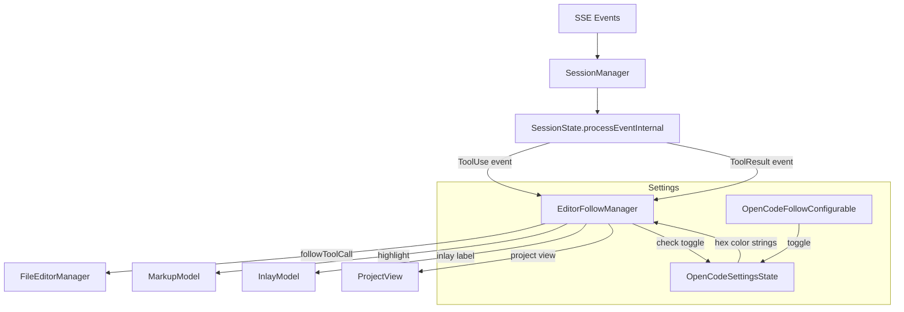
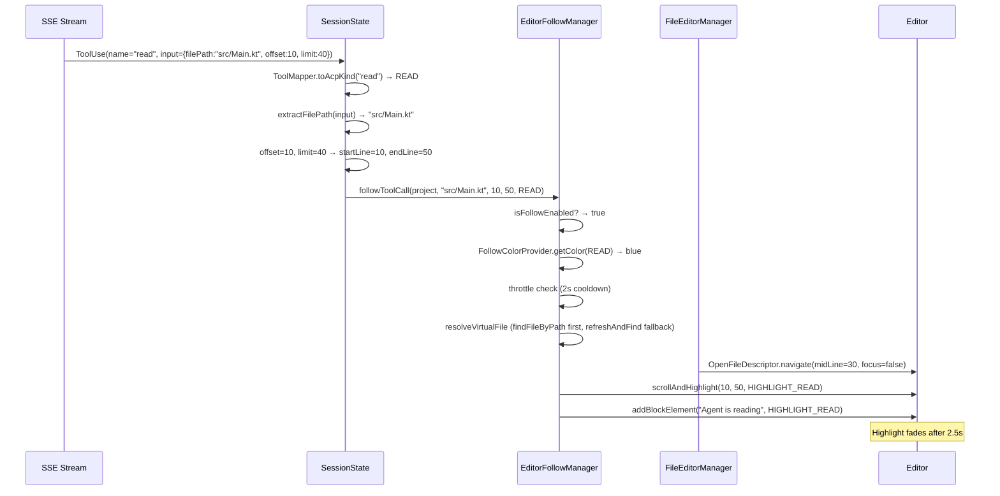
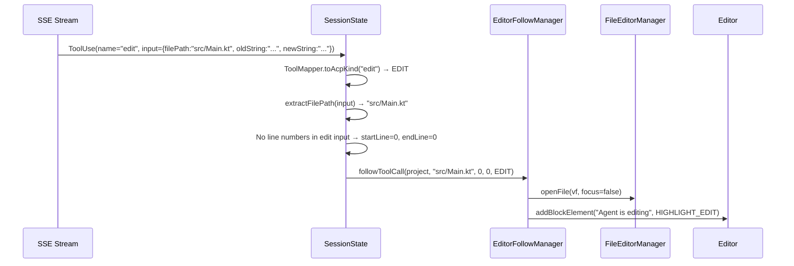
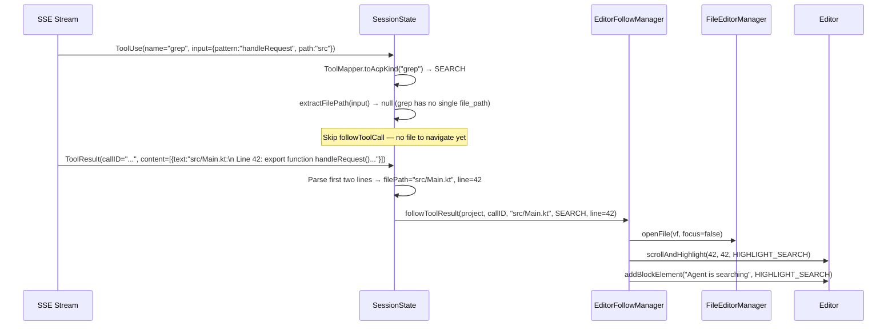

# Technical Design Document: Follow Agent — Editor Integration

> **Author:** OpenCode Plugin Team  
> **Last Updated:** 2026-06-12  
> **Review Status:** Adversarial review v2 complete — 4 critical, 5 high, 4 medium, 3 low findings addressed  
> **Related docs:** AGENTS.md, docs/tdd/intellij-mcp-integration.md

---

## 1. TL;DR

We will add "Follow Agent" mode to the OpenCode plugin: when the LLM reads, writes, searches, or executes commands, the IDE automatically opens the relevant files, scrolls to the target lines, and displays transient highlights with "Agent is reading/editing" inlay labels. The user sees exactly where the LLM is looking in real time. The feature is controlled by a per-project toggle stored in `OpenCodeSettingsState` and respects user focus (never steals focus from the chat prompt). We intercept tool calls at `SessionState.processEventInternal()` (which runs on `Dispatchers.Default`, NOT EDT) and use IntelliJ Platform APIs (`FileEditorManager`, `OpenFileDescriptor`, `RangeHighlighter`, `InlayModel`) for all editor interaction. All editor API calls are dispatched to EDT via `ApplicationManager.invokeLater()`. A dedicated open-in-editor icon button on `ToolPill` provides explicit click-to-open (focus=true) without conflicting with the existing header expand toggle. The `AgentActionRenderer` overrides both legacy and HiDPI `paint()` overloads for maximum compatibility. Throttling uses `kotlinx.coroutines` with an EDT-bound scope (matching the existing codebase — no `Alarm` usage). All 10 `ToolKind` values have color/label mappings via a registry pattern (`FollowColorProvider`); however, `DELETE` and `MOVE` are currently unreachable in OpenCode (file mutations go through `apply_patch` → EDIT), so their settings are forward-compatibility only. The `ToolMapper.toAcpKind()` does NOT map to DELETE/MOVE — those ToolKind values can only arrive via MCP servers that expose dedicated delete/move tools.

---

## 2. Context & Scope

### 2.1 Current State

The OpenCode plugin communicates with the LLM via SSE events through `OpenCodeClient`. When the LLM calls a tool (e.g., `read`, `edit`, `bash`, `grep`), the server sends V1 BusEvents (`message.part.updated` with `part.type = "tool"`) which the plugin parses into `SseEvent.ToolUse` and `SseEvent.ToolResult`. The plugin currently:

- **Displays tool call pills** in the chat UI (`ToolPill.kt`) showing tool name, file, and line delta
- **Tracks file changes** for the Review panel (`pendingFileChanges` in `ProcessorContext`)
- **Does NOT interact with the editor** during tool execution — files are never opened, lines never scrolled, nothing highlighted

The user has no visual feedback about which file the LLM is reading or editing until they manually look at the tool pill in the chat.

### 2.2 Problem Statement

When the LLM is working on a multi-file task (refactoring, debugging, code review), the user cannot see what the LLM is doing in the editor. They must mentally map tool pill text ("read src/main.kt:42-67") to the actual file and line range. This breaks the "human in the loop" principle — the user should see every action the LLM takes, visually, in the editor.

### 2.3 Scope

**In scope (Phase 1 — Editor Follow):**
- Follow Agent toggle (per-project, persisted in `OpenCodeSettingsState`)
- Editor navigation on tool calls (read, edit, grep, glob, bash)
- Transient line-range highlights with color coding for all 10 `ToolKind` values
- Block inlay labels ("Agent is reading", "Agent is editing", etc.)
- Configurable highlight colors (stored as hex strings in `OpenCodeSettingsState`, matching existing `inlineCodeColor` convention)
- ToolPill click-to-open in editor (with focus=true for explicit clicks)
- Project View tree file selection
- Throttle/debounce to prevent EDT flood during rapid tool calls
- `ToolResult`-based navigation for search tools (line numbers in results, not inputs)

**Out of scope (deferred to separate TDDs):**
- **Phase 2 — Project View Decorators:** File tree node indicators (badges, colored icons showing read/write state). Requires a separate TDD with its own design — file decorators involve `ProjectViewNodeDecorator`, `NodeDescriptor` lifecycle, and editor state aggregation. Listed here for awareness only.
- **Phase 3 — Diff Ghost Text:** Inline ghost text in editor gutter showing proposed diffs before the edit lands. Requires a separate TDD with its own design — likely uses `EditorCustomElementRenderer` for ghost text rendering and a per-edit lifecycle. Listed here for awareness only.
- Chat message file links (`openfile://` protocol)
- Agent edit session tracking with atomic undo (separate TDD)
- Auto-format after writes (separate TDD)

---

## 3. Goals & Non-Goals

### Goals

1. **Visual feedback on tool execution** — When the LLM reads/writes/searches a file, the editor opens, scrolls to the relevant lines, and highlights the range within 500ms of the SSE event arriving.
2. **Non-disruptive** — Never steal focus from the chat prompt when the user is typing. Throttle rapid tool calls (2s cooldown) to prevent EDT flooding during burst reads.
3. **Configurable** — Per-project toggle, per-action-color settings (all 10 `ToolKind` values), respects existing IntelliJ theme colors.
4. **Zero overhead when disabled** — All editor interaction code is gated behind the toggle; no performance impact when Follow Agent is off.

### Non-Goals

- **Phase 2 — Project View decorators** — File tree indicators. Deferred to a separate TDD.
- **Phase 3 — Diff ghost text** — Inline gutter diffs. Deferred to a separate TDD.
- **Chat message file links** — `openfile://` protocol. Deferred.
- **Agent edit session tracking** — Before/after snapshots with atomic undo. Orthogonal; separate TDD.
- **Auto-format after writes** — `ReformatCodeProcessor` on modified files. Separate TDD.

---

## 4. Proposed Solution

**We intercept tool calls in `SessionState.processEventInternal()` and route them to a new `EditorFollowManager` component that uses IntelliJ Platform APIs to open files, navigate to line ranges, and apply transient highlights with inlay labels. The feature is gated behind a per-project toggle stored in `OpenCodeSettingsState` (consistent with existing settings architecture), with configurable highlight colors stored as hex strings (XStream-safe).**

### 4.1 Architecture Diagram



| Component | Responsibility |
|-----------|---------------|
| `EditorFollowManager` | Central coordinator: receives file path, line range, precomputed `ToolKind`; resolves file, throttles, dispatches to editor APIs. Implements `Disposable` for cleanup. Thread-safe: called from `Dispatchers.Default` but all editor interaction is dispatched to EDT via `invokeLater`. |
| `SessionState` | Routes `ToolUse`/`ToolResult` events to `EditorFollowManager` with precomputed `toolKind`, file path via `extractFilePath()` (made `internal` for cross-class access), line numbers extracted from tool-specific input fields |
| `ToolMapper` | Maps tool names to `ToolKind`. The existing `toAcpKind` mapping covers 7 of 10 `ToolKind` values (READ/EDIT/SEARCH/EXECUTE/FETCH/THINK/OTHER). **`DELETE` and `MOVE` are NOT mapped** — OpenCode has no standalone `delete` or `move` tools; all file mutations go through `apply_patch` → EDIT. The `followDeleteColor`/`followMoveColor` settings exist for forward-compatibility with MCP servers that expose dedicated delete/move tools, but they cannot fire from OpenCode's built-in tools. |
| `OpenCodeSettingsState` | Stores toggle + highlight colors as hex strings (XStream-safe, matching existing `inlineCodeColor` convention) |
| `AgentActionRenderer` | Custom `EditorCustomElementRenderer` for block inlay labels (extracted from `EditorFollowManager` — SRP). Overrides both legacy and HiDPI `paint()` overloads. |
| `FollowColorProvider` | `ToolKind → Color` mapping via registry pattern (OCP-compliant). Adding a new `ToolKind` requires only adding an entry to the `colorConfigs` map + a new settings field + a new UI row — no `when` branch modifications. |

### 4.2 Component & Module Design

> **Omitted** per Full TDD guidelines — see 4.7 for concrete type definitions.

### 4.3 API / Interface Design

The primary interface is internal — `EditorFollowManager` is called by `SessionState` on tool events. No external API surface.

**Internal interfaces:**

| Method | Purpose | Called From |
|--------|---------|-------------|
| `EditorFollowManager.followToolCall(project, filePath, startLine, endLine, kind)` | Open file, scroll, highlight, add inlay | `SessionState` on `ToolUse` event |
| `EditorFollowManager.followToolResult(project, toolCallId, filePath, kind)` | Navigate to search results with line numbers | `SessionState` on `ToolResult` event (for search tools) |
| `EditorFollowManager.isFollowEnabled(project)` | Check per-project toggle | `SessionState`, UI components |
| `EditorFollowManager.resolveVirtualFile(project, filePath)` | Resolve file path to VirtualFile (internal, also used by ToolPill) | `ToolPill`, internal |
| `EditorFollowManager.openFileAtLine(project, filePath, line, focus)` | Open file at specific line with explicit focus control | `ToolPill` click (focus=true) |

### 4.4 Key Flows

#### Flow: LLM reads a file



#### Flow: LLM edits a file



#### Flow: LLM searches (grep — line numbers in ToolResult)



### 4.5 Technology Stack

| Layer | Technology | Version | Rationale |
|-------|-----------|---------|-----------|
| Language | Kotlin | — | Existing plugin language |
| UI Framework | Compose for Desktop (Jewel) | — | Existing chat UI |
| Editor APIs | IntelliJ Platform SDK | IU-261 | FileEditorManager, OpenFileDescriptor, RangeHighlighter, InlayModel |
| Settings | `OpenCodeSettingsState` | Per-project toggle + hex color strings (consistent with existing `PersistentStateComponent` architecture) |

### 4.6 Migration Strategy

> **Omitted** — no migration needed; this is a new feature with no data to migrate.

### 4.7 Implementation Blueprint

#### 4.7.1 Data Models & Schemas

```kotlin
// ── follow/FollowColorProvider.kt ───────────────────────────────────────

/**
 * Maps ToolKind → highlight color and inlay label via a registry pattern (OCP-compliant).
 * Adding a new ToolKind requires only:
 * 1. Adding an entry to [colorConfigs] with default color and label
 * 2. Adding a new hex string field to OpenCodeSettingsState
 * 3. Adding a new UI row to OpenCodeFollowConfigurable
 * No `when` branch modifications needed — the registry handles dispatch.
 *
 * Colors are read from OpenCodeSettingsState hex strings and parsed to java.awt.Color.
 * THINK and SWITCH_MODE have null entries (no file path → no highlight).
 *
 * The settings panel (§4.7.2) and the field defaults below all use "#RRGGBBAA"
 * 8-digit hex with an explicit alpha channel. The existing `inlineCodeColor`
 * convention is "#RRGGBB" (6-digit, no alpha) because it is a foreground
 * text color, not a translucent background — Follow Agent highlight backgrounds
 * MUST include alpha or they will render as solid opaque overlays that block
 * the underlying text.
 */
object FollowColorProvider {

    /** Configuration for a single ToolKind's follow-agent behavior. */
    data class ColorConfig(
        val defaultColorHex: String,
        val inlayLabel: String?,
        /** Reads the current color hex from settings. */
        val settingsReader: (OpenCodeSettingsState) -> String,
    )

    /**
     * Registry of all ToolKind → color/label mappings.
     * Null entries mean "no highlight" (THINK, SWITCH_MODE).
     */
    private val colorConfigs: Map<ToolKind, ColorConfig?> = mapOf(
        ToolKind.READ to ColorConfig(
            defaultColorHex = "#5078C855",
            inlayLabel = "Agent is reading",
            settingsReader = { it.followReadColor },
        ),
        ToolKind.EDIT to ColorConfig(
            defaultColorHex = "#50A05055",
            inlayLabel = "Agent is editing",
            settingsReader = { it.followEditColor },
        ),
        ToolKind.SEARCH to ColorConfig(
            defaultColorHex = "#C8B43C55",
            inlayLabel = "Agent is searching",
            settingsReader = { it.followSearchColor },
        ),
        ToolKind.EXECUTE to ColorConfig(
            defaultColorHex = "#B4785055",
            inlayLabel = "Agent is running",
            settingsReader = { it.followExecuteColor },
        ),
        ToolKind.DELETE to ColorConfig(
            defaultColorHex = "#C8505055",
            inlayLabel = "Agent is deleting",
            settingsReader = { it.followDeleteColor },
        ),
        ToolKind.MOVE to ColorConfig(
            defaultColorHex = "#A050C855",
            inlayLabel = "Agent is moving",
            settingsReader = { it.followMoveColor },
        ),
        ToolKind.FETCH to ColorConfig(
            defaultColorHex = "#50A0C855",
            inlayLabel = "Agent is fetching",
            settingsReader = { it.followFetchColor },
        ),
        ToolKind.THINK to null,        // no file path → no highlight
        ToolKind.SWITCH_MODE to null,  // no file path → no highlight
        ToolKind.OTHER to ColorConfig(
            defaultColorHex = "#80808055",
            inlayLabel = "Agent is working",
            settingsReader = { it.followOtherColor },
        ),
    )

    fun getColor(kind: ToolKind): java.awt.Color? {
        val config = colorConfigs[kind] ?: return null
        val hex = config.settingsReader(OpenCodeSettingsState.getInstance())
        return parseColor(hex)
    }

    fun getInlayLabel(kind: ToolKind): String? {
        return colorConfigs[kind]?.inlayLabel
    }

    /** Returns all highlightable ToolKind entries (those with non-null configs). */
    fun highlightableKinds(): List<ToolKind> {
        return colorConfigs.entries.filter { it.value != null }.map { it.key }
    }
}

/**
 * Converts "#RRGGBB" or "#RRGGBBAA" hex to java.awt.Color.
 *
 * Alpha handling: 6-digit hex defaults to 0x55 (≈33% opacity) for backward
 * compatibility with any user-customized value that omits alpha. 8-digit hex
 * uses the explicit alpha from the string. The 0x55 default is the same value
 * used in the documented default colors (e.g. `#5078C855` → 0x55), so 6-digit
 * user inputs that match the convention will render correctly.
 *
 * NOTE: If a user enters a 6-digit hex without alpha, they get 33% opacity.
 * The settings UI should document this or enforce 8-digit input.
 */
internal fun parseColor(hex: String): java.awt.Color {
    val h = hex.removePrefix("#")
    require(h.length == 6 || h.length == 8) { "Hex color must be 6 or 8 digits, got: $hex" }
    val r = h.substring(0, 2).toInt(16)
    val g = h.substring(2, 4).toInt(16)
    val b = h.substring(4, 6).toInt(16)
    val a = if (h.length >= 8) h.substring(6, 8).toInt(16) else 0x55
    return java.awt.Color(r, g, b, a)
}
```

```kotlin
// ── follow/EditorFollowManager.kt ──────────────────────────────────────

/**
 * Interface for Follow Agent editor interaction. Extracted for testability (DIP).
 * SessionState depends on this interface, not the concrete implementation.
 */
interface EditorFollowService {
    /** Check if Follow Agent is enabled for this project. */
    fun isFollowEnabled(): Boolean

    /** Enable or disable Follow Agent. */
    fun setFollowEnabled(enabled: Boolean)

    /**
     * Main entry point: called by SessionState on ToolUse events.
     * Thread-safe: can be called from any thread (SessionState runs on Dispatchers.Default).
     * All editor interaction is dispatched to EDT internally.
     */
    fun followToolCall(
        project: Project,
        filePath: String,
        startLine: Int,
        endLine: Int,
        kind: ToolKind,
    )

    /**
     * Entry point for ToolResult events (search tools — line numbers in results).
     * Thread-safe: can be called from any thread.
     */
    fun followToolResult(
        project: Project,
        toolCallId: String,
        output: List<JsonObject>?,
        kind: ToolKind,
    )

    /**
     * Open file at a specific line with explicit focus control.
     * Used by ToolPill click-to-open (focus=true) vs auto-follow (focus=false).
     * Thread-safe: dispatches to EDT internally.
     */
    fun openFileAtLine(project: Project, filePath: String, line: Int, focus: Boolean)

    /**
     * Resolve file path to VirtualFile.
     * Uses findFileByPath() first (VFS snapshot, no I/O).
     * Falls back to refreshAndFindFileByPath() for externally-created files.
     * Thread-safe: VFS lookups are thread-safe.
     */
    fun resolveVirtualFile(project: Project, filePath: String): VirtualFile?
}

/**
 * Manages "Follow Agent" editor interaction.
 * Opens files, scrolls to line ranges, applies transient highlights,
 * and adds block inlay labels when the LLM reads/edits/searches files.
 *
 * Thread safety: SessionState.processEventInternal() runs on Dispatchers.Default
 * (NOT EDT — see SessionState.kt:417-422). This manager is called from that
 * Default-thread context. All editor API calls are dispatched to EDT via
 * ApplicationManager.invokeLater(). Throttle state uses @Volatile for
 * cross-thread visibility between the Default caller thread and the EDT
 * coroutine scope. The activeHighlighters list is accessed only from EDT
 * (via invokeLater and the EDT-bound coroutine scope).
 *
 * Implements Disposable: cancels the internal coroutine scope and removes
 * all tracked highlighters/inlays on project close.
 */
@Service(Service.Level.PROJECT)
class EditorFollowManager(private val project: Project) : EditorFollowService, Disposable {

    private val logger = KotlinLogging.logger {}

    /**
     * Internal scope for delayed throttling and highlight cleanup.
     * Bound to this manager's lifecycle; cancelled in `dispose()`.
     * All coroutines in this scope run on EDT.
     */
    private val scope = CoroutineScope(SupervisorJob() + Dispatchers.EDT)

    companion object {
        // Throttle constants
        const val FOLLOW_FILE_COOLDOWN_MS = 2_000L
        const val HIGHLIGHT_DURATION_MS = 2_500L
        const val PROJECT_VIEW_COOLDOWN_MS = 5_000L

        /**
         * Matches the per-line header in OpenCode grep tool output:
         *   "  Line 42: <text>"
         * Captures the line number. Anchored — no leading whitespace tolerance because
         * OpenCode's grep.go emits exactly two leading spaces on this line.
         */
        private val LINE_HEADER_REGEX = Regex("""^Line (\d+):""")

        /**
         * Highlighter layer for follow-agent highlights.
         * Uses SELECTION - 1 (5999) to sit below selection highlights but above
         * syntax highlighting. This ensures the user's own selections remain
         * visible while the agent highlight is active.
         */
        private const val FOLLOW_HIGHLIGHT_LAYER = HighlighterLayer.SELECTION - 1

        fun getInstance(project: Project): EditorFollowManager =
            project.service<EditorFollowManager>()
    }

    // ── Throttle state ──────────────────────────────────────────────────
    // @Volatile needed: followToolCall/followToolResult are called from
    // Dispatchers.Default (SessionState's event processing thread), while
    // schedulePendingFollow's coroutine runs on Dispatchers.EDT. The volatile
    // keyword ensures memory visibility across threads.
    @Volatile private var lastFollowFileMs: Long = 0
    @Volatile private var lastProjectViewSelectMs: Long = 0

    // ── Pending navigation (for throttle queue — see §4.7.3) ────────────
    // @Volatile needed: written from Default thread (followToolCall),
    // read from EDT (schedulePendingFollow coroutine).
    @Volatile private var pendingFollow: PendingFollow? = null
    private data class PendingFollow(
        val filePath: String, val startLine: Int, val endLine: Int, val kind: ToolKind
    )

    // ── Active highlighters for cleanup on dispose ──────────────────────
    // Accessed only from EDT: flashLineRange (via invokeLater), dispose (EDT),
    // cleanup coroutine (EDT scope). No @Volatile needed.
    private val activeHighlighters = mutableListOf<HighlighterRecord>()
    private data class HighlighterRecord(
        val editor: Editor, val highlighter: RangeHighlighter, val inlay: Inlay<*>?
    )

    override fun dispose() {
        // Cancel scope first — drops pending cleanup coroutines
        scope.cancel()
        // Remove all active highlighters and inlays
        for (record in activeHighlighters) {
            try {
                record.editor.markupModel.removeHighlighter(record.highlighter)
                record.inlay?.dispose()
            } catch (e: Exception) {
                logger.debug(e) { "[ACP] Follow Agent: error cleaning up highlighter" }
            }
        }
        activeHighlighters.clear()
    }

    override fun followToolCall(
        project: Project,
        filePath: String,
        startLine: Int,
        endLine: Int,
        kind: ToolKind,
    ) {
        if (!isFollowEnabled()) return
        val color = FollowColorProvider.getColor(kind) ?: return  // THINK/SWITCH_MODE — skip
        val label = FollowColorProvider.getInlayLabel(kind) ?: return

        if (!throttleCheck()) {
            // Queue the latest request instead of dropping it.
            // After the cooldown, the queued request fires — user sees the
            // MOST RECENT file, not the first one.
            pendingFollow = PendingFollow(filePath, startLine, endLine, kind)
            logger.debug { "[ACP] Follow Agent: queued $filePath (throttled)" }
            schedulePendingFollow()
            return
        }

        navigateOnEdt(project, filePath, startLine, endLine, color, label, focus = false)
    }

    override fun followToolResult(
        project: Project,
        toolCallId: String,
        output: List<JsonObject>?,
        kind: ToolKind,
    ) {
        if (!isFollowEnabled()) return
        if (kind != ToolKind.SEARCH) return  // only search tools need result-based navigation
        val color = FollowColorProvider.getColor(kind) ?: return
        val label = FollowColorProvider.getInlayLabel(kind) ?: return

        // Parse first match from tool output text.
        // Verified against internal/llm/tools/grep.go: actual format is TWO lines per match:
        //   <abs_path>:            (line 1, ends with a single colon, no digits)
        //     Line <N>: <text>     (line 2, prefixed with two spaces, "Line N:" not "N:")
        // We must read both lines to get the file path AND line number. The single-line regex
        // approach (e.g. `^(.+?):(\d+):`) silently never matches and breaks the feature.
        val firstText = output?.firstOrNull()?.let { obj ->
            obj["text"]?.jsonPrimitive?.contentOrNull
        } ?: return
        val lines = firstText.lineSequence().iterator()
        if (!lines.hasNext()) return
        val pathLine = lines.next().trimEnd()                  // e.g. "/abs/path/to/file.kt:"
        if (!pathLine.endsWith(':')) return                    // not a match-header line
        val filePath = pathLine.dropLast(1)                    // strip trailing ":"
        if (!lines.hasNext()) return
        val lineLine = lines.next().trim()                     // e.g. "Line 42: ..."
        val line = LINE_HEADER_REGEX.find(lineLine)
            ?.groupValues?.get(1)?.toIntOrNull() ?: return

        if (!throttleCheck()) {
            pendingFollow = PendingFollow(filePath, line, line, kind)
            schedulePendingFollow()
            return
        }

        navigateOnEdt(project, filePath, line, line, color, label, focus = false)
    }

    override fun openFileAtLine(project: Project, filePath: String, line: Int, focus: Boolean) {
        ApplicationManager.getApplication().invokeLater({
            try {
                val vf = resolveVirtualFile(project, filePath) ?: return@invokeLater
                if (line > 0) {
                    OpenFileDescriptor(project, vf, line - 1, 0).navigate(focus)
                } else {
                    FileEditorManager.getInstance(project).openFile(vf, focus)
                }
            } catch (e: Exception) {
                logger.error(e) { "[ACP] Follow Agent: error opening $filePath" }
            }
        }, ModalityState.nonModal())
    }

    override fun isFollowEnabled(): Boolean {
        return OpenCodeSettingsState.getInstance().followAgentEnabled
    }

    override fun setFollowEnabled(enabled: Boolean) {
        OpenCodeSettingsState.getInstance().followAgentEnabled = enabled
    }

    // ── Throttle ────────────────────────────────────────────────────────
    // Called from Dispatchers.Default thread. Uses @Volatile for cross-thread visibility.

    private fun throttleCheck(): Boolean {
        val now = System.currentTimeMillis()
        if (now - lastFollowFileMs < FOLLOW_FILE_COOLDOWN_MS) return false
        lastFollowFileMs = now
        return true
    }

    /**
     * Schedule a coroutine that fires the pending follow after the cooldown.
     * This ensures the user sees the MOST RECENT file, not the first one.
     *
     * Uses the manager's internal EDT-bound coroutine scope (matches codebase
     * pattern — no `com.intellij.util.alarms.Alarm` anywhere in `src/`). The
     * scope is cancelled in `dispose()`, so pending throttled requests are
     * automatically dropped on project close.
     */
    private fun schedulePendingFollow() {
        scope.launch {
            delay(FOLLOW_FILE_COOLDOWN_MS)
            if (project.isDisposed) return@launch
            val pending = pendingFollow ?: return@launch
            pendingFollow = null
            val color = FollowColorProvider.getColor(pending.kind) ?: return@launch
            val label = FollowColorProvider.getInlayLabel(pending.kind) ?: return@launch
            lastFollowFileMs = System.currentTimeMillis()
            navigateOnEdt(project, pending.filePath, pending.startLine, pending.endLine, color, label, focus = false)
        }
    }

    // ── Editor interaction (all on EDT) ─────────────────────────────────

    private fun navigateOnEdt(
        project: Project, filePath: String,
        startLine: Int, endLine: Int,
        color: java.awt.Color, label: String, focus: Boolean
    ) {
        ApplicationManager.getApplication().invokeLater({
            if (project.isDisposed) return@invokeLater
            try {
                val vf = resolveVirtualFile(project, filePath) ?: run {
                    logger.warn { "[ACP] Follow Agent: file not found: $filePath" }
                    return@invokeLater
                }

                val fem = FileEditorManager.getInstance(project)
                val midLine = if (startLine > 0 && endLine > 0) {
                    (startLine + endLine) / 2
                } else {
                    maxOf(startLine, 1)
                }

                if (midLine > 0) {
                    OpenFileDescriptor(project, vf, midLine - 1, 0).navigate(focus)
                    scrollAndHighlight(fem, vf, startLine, endLine, midLine, color, label)
                } else {
                    fem.openFile(vf, focus)
                }

                selectInProjectView(project, vf)
                logger.info { "[ACP] Follow Agent: opened $filePath" }
            } catch (e: Exception) {
                logger.error(e) { "[ACP] Follow Agent: error navigating to $filePath" }
            }
        }, ModalityState.nonModal())
    }

    private fun scrollAndHighlight(
        fem: FileEditorManager, vf: VirtualFile,
        startLine: Int, endLine: Int, midLine: Int,
        color: java.awt.Color, actionLabel: String
    ) {
        // Find the active (selected) TextEditor for this file, not just the first one.
        val selectedEditor = fem.getSelectedEditor(vf)
        val targetEditor = if (selectedEditor is TextEditor) selectedEditor
            else fem.getEditors(vf).filterIsInstance<TextEditor>().firstOrNull()
            ?: return

        val editor = targetEditor.editor
        val doc = editor.document
        val lineCount = doc.lineCount

        if (midLine - 1 < lineCount) {
            val visibleLines = editor.scrollingModel.visibleArea.height / editor.lineHeight
            val rangeLines = if (startLine > 0 && endLine > 0) endLine - startLine + 1 else 0
            val fitsInViewport = rangeLines in 1..visibleLines

            val offset = if (fitsInViewport) {
                doc.getLineStartOffset(maxOf(midLine - 1, 0))
            } else {
                val topLine = maxOf(startLine - 2, 1)
                doc.getLineStartOffset(maxOf(topLine - 1, 0))
            }

            // Use scrollTo(CENTER) only — avoid redundant moveToOffset that causes visual jump.
            editor.scrollingModel.scrollTo(
                editor.offsetToLogicalPosition(offset), ScrollType.CENTER
            )
            editor.caretModel.moveToOffset(offset)

            flashLineRange(editor, doc, startLine, endLine, color, actionLabel, targetEditor)
        }
    }

    private fun flashLineRange(
        editor: Editor, doc: Document,
        startLine: Int, endLine: Int,
        color: java.awt.Color, actionLabel: String,
        disposableParent: Disposable
    ) {
        val lineCount = doc.lineCount
        if (startLine <= 0 || endLine <= 0 || startLine > lineCount) return

        val hlStart = doc.getLineStartOffset(startLine - 1)
        val hlEnd = doc.getLineEndOffset(minOf(endLine, lineCount) - 1)
        if (hlEnd <= hlStart) return

        // Range highlighter
        val attrs = TextAttributes().apply { backgroundColor = color }
        val hl = editor.markupModel.addRangeHighlighter(
            hlStart, hlEnd,
            FOLLOW_HIGHLIGHT_LAYER,
            attrs,
            HighlighterTargetArea.LINES_IN_RANGE
        )

        // Block inlay label. Use the modern 3-arg InlayProperties overload (IU-261+).
        // The 5-arg form `addBlockElement(int, boolean, boolean, int, T)` still works but
        // is the older API; the new form takes a single InlayProperties parameter and
        // supports additional properties (max width, etc.) that the 5-arg cannot.
        // showAbove=true places the label above the highlighted region.
        val inlay = editor.inlayModel.addBlockElement(
            hlStart,
            InlayProperties().apply {
                relatesToPrecedingText = true
                showAbove = true
            },
            AgentActionRenderer(actionLabel, color)
        )

        // Track for disposal
        val record = HighlighterRecord(editor, hl, inlay)
        activeHighlighters.add(record)

        // Auto-remove after delay. The coroutine runs on the manager's EDT scope,
        // which is cancelled in dispose() — so pending cleanup coroutines are dropped
        // on project close. The cleanup itself is try-catch guarded for editors that
        // were disposed independently of the manager.
        scope.launch {
            delay(HIGHLIGHT_DURATION_MS)
            try {
                editor.markupModel.removeHighlighter(hl)
                inlay?.dispose()
                activeHighlighters.remove(record)
            } catch (e: Exception) {
                logger.debug(e) { "[ACP] Follow Agent: error removing highlight" }
            }
        }
    }

    private fun selectInProjectView(project: Project, vf: VirtualFile) {
        val now = System.currentTimeMillis()
        if (now - lastProjectViewSelectMs < PROJECT_VIEW_COOLDOWN_MS) return
        lastProjectViewSelectMs = now

        try {
            val twm = ToolWindowManager.getInstance(project)
            val tw = twm.getToolWindow("Project") ?: return
            if (!tw.isVisible) return
            ProjectView.getInstance(project).select(null, vf, false)
        } catch (e: Exception) {
            logger.debug(e) { "[ACP] Follow Agent: error selecting in Project View" }
        }
    }

    override fun resolveVirtualFile(project: Project, filePath: String): VirtualFile? {
        val basePath = project.basePath ?: return null
        val absPath = if (java.nio.file.Path.of(filePath).isAbsolute) {
            filePath
        } else {
            java.nio.file.Path.of(basePath).resolve(filePath).normalize().toString()
        }
        // Normalize separators for Windows
        val normalized = absPath.replace('/', java.io.File.separatorChar)
        val vfs = LocalFileSystem.getInstance()
        // findFileByPath first (VFS cache lookup, safe on any thread).
        // refreshAndFindFileByPath only as fallback for newly-created files.
        // This is called from invokeLater (EDT) for navigateOnEdt/openFileAtLine,
        // or from Dispatchers.Default for followToolCall/followToolResult (but only
        // to check existence — the actual open is deferred to EDT).
        return vfs.findFileByPath(normalized)
            ?: vfs.refreshAndFindFileByPath(normalized)
    }
}
```

```kotlin
// ── follow/AgentActionRenderer.kt ──────────────────────────────────────

/**
 * Renders "Agent is reading/editing" block inlay label above highlighted region.
 * Extracted from EditorFollowManager (SRP — rendering is a view concern).
 *
 * HiDPI behavior (verified against JetBrains/intellij-community `EditorCustomElementRenderer.java`):
 * Both `paint()` overloads are `default` methods. The HiDPI overload
 * (`Graphics2D, Rectangle2D`) delegates to the legacy overload (`Graphics, Rectangle`)
 * by rounding coordinates and downcasting. IntelliJ calls the HiDPI overload on
 * Retina/HiDPI displays and the legacy overload on standard displays.
 *
 * We override BOTH for maximum compatibility:
 * - Legacy override: handles standard displays. Uses Graphics APIs only (no Graphics2D cast).
 * - HiDPI override: handles Retina displays. Rounds Rectangle2D to ints, delegates to
 *   paintInternal. Without this override, HiDPI calls would fall through to the legacy
 *   paint() via the default delegation, which works but loses sub-pixel precision.
 *
 * Do NOT cast `Graphics` to `Graphics2D` in the legacy overload — the legacy signature
 * accepts `Graphics` (not always a `Graphics2D`); a custom editor implementation could pass
 * a plain `Graphics` and the cast would throw `ClassCastException`. Use `Graphics` methods
 * only, or branch on `is Graphics2D` before calling `Graphics2D`-only methods.
 */
class AgentActionRenderer(
    private val text: String,
    bgColor: java.awt.Color
) : EditorCustomElementRenderer {

    /**
     * Boosted alpha for the inlay label background. The highlight underneath uses
     * the original translucent alpha (e.g. 0x55 ≈ 33%), but the label itself
     * needs to be readable — we triple the alpha (capped at 255) to make the
     * label background opaque or near-opaque. This matches the visual hierarchy:
     * translucent highlight region + solid label pill.
     */
    private val bgColor = java.awt.Color(
        bgColor.red, bgColor.green, bgColor.blue,
        minOf(bgColor.alpha * 3, 255)
    )

    override fun calcWidthInPixels(inlay: Inlay<*>): Int {
        val editor = inlay.editor
        val font = editor.colorsScheme.getFont(EditorFontType.PLAIN)
        val metrics = editor.contentComponent.getFontMetrics(font)
        return metrics.stringWidth(text) + 16
    }

    override fun calcHeightInPixels(inlay: Inlay<*>): Int {
        return inlay.editor.lineHeight
    }

    // Legacy paint — handles standard displays. Uses Graphics APIs only.
    override fun paint(
        inlay: Inlay<*>, g: Graphics,
        targetRegion: Rectangle, textAttributes: TextAttributes
    ) {
        paintInternal(g, targetRegion, inlay.editor)
    }

    // HiDPI paint — handles Retina displays. Rounds Rectangle2D to ints.
    override fun paint(
        inlay: Inlay<*>, g: Graphics2D,
        targetRegion: java.awt.geom.Rectangle2D, textAttributes: TextAttributes
    ) {
        val intRect = Rectangle(
            targetRegion.x.toInt(), targetRegion.y.toInt(),
            targetRegion.width.toInt(), targetRegion.height.toInt()
        )
        paintInternal(g, intRect, inlay.editor)
    }

    private fun paintInternal(g: Graphics, region: Rectangle, editor: Editor) {
        // Set up antialiasing only if the Graphics is actually a Graphics2D. The legacy
        // overload contract permits a plain `Graphics`, so do not assume Graphics2D here.
        if (g is Graphics2D) {
            g.setRenderingHint(RenderingHints.KEY_ANTIALIASING, RenderingHints.VALUE_ANTIALIAS_ON)
        }
        g.color = bgColor
        g.fillRoundRect(region.x, region.y, region.width, region.height, 6, 6)
        g.font = editor.colorsScheme.getFont(EditorFontType.PLAIN)
        g.color = editor.colorsScheme.defaultForeground
        val metrics = g.fontMetrics
        val textY = region.y + (region.height + metrics.ascent - metrics.descent) / 2
        g.drawString(text, region.x + 8, textY)
    }
}
```

#### 4.7.2 Class & Interface Definitions

**Integration point — `SessionState.processEventInternal()`, ToolUse handler (~line 715):**

The OpenCode `read` tool input uses `filePath` (camelCase), `offset` (1-indexed start line), and `limit` (max lines). The `edit` tool uses `filePath`, `oldString`, `newString`. The `grep` tool uses `pattern` and `path` — no line numbers in input (line numbers appear in `ToolResult` output).

> **Threading note:** `processEventInternal` runs on `Dispatchers.Default` (NOT EDT — see SessionState.kt:417-422). The `EditorFollowManager` methods are thread-safe and dispatch all editor work to EDT internally.

```kotlin
// In SessionState.kt, ToolUse handler — ADD after line 712 (ctx.toolCallPills[event.toolCallId] = pill):

val followManager = EditorFollowManager.getInstance(project)
val filePath = extractFilePath(event.input ?: return)
if (filePath != null) {
    // Extract line numbers from tool-specific input fields.
    // read tool: filePath, offset (1-indexed), limit → startLine=offset, endLine=offset+limit-1
    // edit tool: filePath, oldString, newString → no line numbers (startLine=0, endLine=0)
    // grep/glob: pattern, path → no single file, skip (navigate on ToolResult instead)
    val startLine = when {
        event.input?.containsKey("offset") == true ->
            event.input["offset"]?.jsonPrimitive?.intOrNull ?: 0
        event.input?.containsKey("start_line") == true ->
            event.input["start_line"]?.jsonPrimitive?.intOrNull ?: 0
        else -> 0
    }
    val endLine = when {
        startLine > 0 && event.input?.containsKey("limit") == true -> {
            val limit = event.input["limit"]?.jsonPrimitive?.intOrNull ?: 0
            if (limit > 0) startLine + limit - 1 else 0
        }
        event.input?.containsKey("end_line") == true ->
            event.input["end_line"]?.jsonPrimitive?.intOrNull ?: 0
        else -> 0
    }
    followManager.followToolCall(project, filePath, startLine, endLine, toolKind)
}
// Note: toolKind is already computed at line 694-695 above.
```

**`extractFilePath()` accessibility:** Currently `private` in `SessionState.kt:1288`. Must be changed to `internal` for `EditorFollowManager` to access it (or extract to a shared utility). The simplest fix: change `private fun extractFilePath` to `internal fun extractFilePath`.

**Integration point — `SessionState.processEventInternal()`, ToolResult handler (~line 769):**

> **Ordering is critical.** The existing `ToolResult` handler in `SessionState.kt:769-792` re-detects the tool kind from the result's `input` and may update `existingPill.kind` (line 777-779). The `followToolResult()` call MUST be after this pill-update block, otherwise `existingPill?.kind` is stale and we may navigate for the wrong kind. The integration code below assumes it is placed AFTER the `ctx.toolCallPills[event.toolCallId] = ...` assignment at line 785. **Adding a new block of code above this integration point is a regression risk** — the kind check would short-circuit on the pre-update `existingPill`.

> **Threading note:** Same as ToolUse — runs on `Dispatchers.Default`. `followToolResult()` is thread-safe.

```kotlin
// In SessionState.kt, ToolResult handler — place this AFTER the existing pill
// update block at line 785 (the `ctx.toolCallPills[event.toolCallId] = existingPill.copy(...)`).
// The check below uses the JUST-UPDATED `existingPill`, not the pre-update snapshot.

// For search tools, navigate to the first match result (line numbers are in output, not input).
if (existingPill?.kind == ToolKind.SEARCH) {
    EditorFollowManager.getInstance(project).followToolResult(
        project, event.toolCallId, event.content, ToolKind.SEARCH
    )
}
```

Note: the original draft checked `|| resolvedKind == ToolKind.SEARCH ||` as a fallback for the case where `existingPill` is null. The current code path for `existingPill == null` (line 793+) creates a fresh pill with `kind = ToolKind.OTHER` (line 796) — so `resolvedKind` would be `OTHER`, not `SEARCH`, and the second branch would never fire anyway. Simplified to a single check. If a future refactor changes the null-pill code path to compute a real `resolvedKind`, this check should be re-extended.

**Settings — additions to `OpenCodeSettingsState`:**

```kotlin
// Toggle (consistent with existing PersistentStateComponent architecture — NOT PropertiesComponent)
var followAgentEnabled: Boolean = true  // default ON

// Highlight colors as hex strings (matching existing inlineCodeColor convention).
// XStream serialization works with String; java.awt.Color has no no-arg constructor.
// Hex format is "#RRGGBBAA" — alpha is required so the highlight reads correctly
// over the editor's background. (The existing `inlineCodeColor` field is "#RRGGBB"
// because it is a text foreground, not a translucent background.)
var followReadColor: String = "#5078C855"
var followEditColor: String = "#50A05055"
var followSearchColor: String = "#C8B43C55"
var followExecuteColor: String = "#B4785055"
var followDeleteColor: String = "#C8505055"
var followMoveColor: String = "#A050C855"
var followFetchColor: String = "#50A0C855"
var followOtherColor: String = "#80808055"
```

**`loadState()` migration:** The existing `OpenCodeSettingsState.loadState()` (lines 115–154) explicitly copies every existing field. **The 9 new fields MUST be added to `loadState()`** — XStream's default-initializer fallback only works when `loadState()` is NOT overridden, but this class overrides it with explicit field-by-field copy. Without adding the new fields to `loadState()`, upgraders will get the XStream-instantiated defaults (which happen to match the declared defaults), but this is fragile — if a future change alters the default initializer without updating `loadState()`, the values diverge. The safe pattern:

```kotlin
// In loadState(), add after the existing field copies:
followAgentEnabled = state.followAgentEnabled
followReadColor = state.followReadColor
followEditColor = state.followEditColor
followSearchColor = state.followSearchColor
followExecuteColor = state.followExecuteColor
followDeleteColor = state.followDeleteColor
followMoveColor = state.followMoveColor
followFetchColor = state.followFetchColor
followOtherColor = state.followOtherColor
```

The `loadState()` field-by-field copy pattern is inconsistent with XStream's default behavior; a follow-up cleanup PR could simplify `loadState()` to `inline fun copyFrom(state: OpenCodeSettingsState) { this::class.memberProperties.forEach { ... } }`. **Out of scope for this TDD.**

**ToolPill click-to-open (with focus=true for explicit clicks):**

The existing `ToolPill.kt:96` header `Row` already has `Modifier.clickable { if (hasDetails) expanded = !expanded }`. Adding a nested `clickable` to the inner `Text` would cause event-conflict (the outer clickable consumes the click). Instead, add a dedicated open-in-editor icon button next to the filename. This is structurally separate from the expand toggle and respects user intent (button = "open in editor", row click = "expand details").

```kotlin
// In ToolPill.kt, in the header Row (around line 128-136), add a small open-in-editor
// IconButton right after the filename Text. Use Jewel IconButton (not Compose
// foundation's IconButton) to match the rest of the file's Jewel idioms.
val openInEditor: (() -> Unit)? = remember(pill.kind, filePath, pill.input) {
    // Only show the open button when we have a resolvable file path AND Follow Agent
    // is enabled. Disable rather than hide when Follow Agent is off — discoverability.
    val path = pill.input?.let { extractFilePath(it) }
    if (path != null && OpenCodeSettingsState.getInstance().followAgentEnabled) {
        {
            EditorFollowManager.getInstance(project).openFileAtLine(
                project = project,
                filePath = path,
                line = pill.input["offset"]?.jsonPrimitive?.intOrNull ?: 0,
                focus = true,  // explicit click — user wants focus
            )
        }
    } else null
}

if (openInEditor != null) {
    Spacer(Modifier.width(6.dp))
    IconButton(
        onClick = openInEditor,
        modifier = Modifier.size(20.dp),
    ) {
        Icon(
            key = AllIconsKeys.Actions.OpenInNewWindow,  // or AllIconsKeys.Actions.EditSource
            contentDescription = "Open in editor",
            modifier = Modifier.size(14.dp),
        )
    }
}
```

**Why not `clickable` on the filename Text?** The header `Row` already has `clickable` for expand/collapse. Compose's outer clickable consumes the click before the inner Text receives it; adding a nested clickable either silently never fires or fires both handlers. A dedicated icon button is the standard Compose pattern for secondary actions on a clickable row.

**Disable vs hide:** The button is shown whenever the pill has a file path (regardless of Follow Agent toggle), but **disabled** (no-op) when Follow Agent is off. This keeps the affordance discoverable for users who haven't enabled Follow Agent yet.

**Settings panel — `OpenCodeFollowConfigurable`:**

New child configurable under `OpenCodeSettingsConfigurable`. Owns:
- `FollowAgentEnabled` checkbox — bound to `OpenCodeSettingsState.followAgentEnabled`
- 8 `ColorPicker` rows — one per highlightable `ToolKind` (READ/EDIT/SEARCH/EXECUTE/DELETE/MOVE/FETCH/OTHER). THINK and SWITCH_MODE have no highlight (no file path).
- Each row shows: ToolKind icon (from existing `toolKindColor` in `ToolPill.kt`), inlay label text, color swatch button, hex text field.
- "Restore Defaults" button at the bottom — resets all 8 colors to the documented defaults.

```kotlin
// src/main/kotlin/com/opencode/acp/config/settings/OpenCodeFollowConfigurable.kt
class OpenCodeFollowConfigurable : BoundConfigurable("Follow Agent") {
    private val settings = OpenCodeSettingsState.getInstance()
    private val followEnabled = JBBooleanProperty(settings.followAgentEnabled)
    private val colorProps: Map<ToolKind, JBColorProperty> = mapOf(
        ToolKind.READ to JBColorProperty(settings.followReadColor),
        ToolKind.EDIT to JBColorProperty(settings.followEditColor),
        ToolKind.SEARCH to JBColorProperty(settings.followSearchColor),
        ToolKind.EXECUTE to JBColorProperty(settings.followExecuteColor),
        ToolKind.DELETE to JBColorProperty(settings.followDeleteColor),
        ToolKind.MOVE to JBColorProperty(settings.followMoveColor),
        ToolKind.FETCH to JBColorProperty(settings.followFetchColor),
        ToolKind.OTHER to JBColorProperty(settings.followOtherColor),
    )

    override fun apply() {
        settings.followAgentEnabled = followEnabled.get()
        colorProps.forEach { (kind, prop) -> settings.setFollowColor(kind, prop.get()) }
    }

    override fun isModified(): Boolean {
        return followEnabled.get() != settings.followAgentEnabled ||
            colorProps.any { (kind, prop) -> prop.get() != settings.getFollowColor(kind) }
    }
}
```

**`OpenCodeSettingsState` extensions required by the configurable:**

```kotlin
fun getFollowColor(kind: ToolKind): String = when (kind) {
    ToolKind.READ -> followReadColor
    ToolKind.EDIT -> followEditColor
    ToolKind.SEARCH -> followSearchColor
    ToolKind.EXECUTE -> followExecuteColor
    ToolKind.DELETE -> followDeleteColor
    ToolKind.MOVE -> followMoveColor
    ToolKind.FETCH -> followFetchColor
    ToolKind.OTHER -> followOtherColor
    ToolKind.THINK, ToolKind.SWITCH_MODE -> followOtherColor  // fallback
}

fun setFollowColor(kind: ToolKind, hex: String) {
    when (kind) {
        ToolKind.READ -> followReadColor = hex
        ToolKind.EDIT -> followEditColor = hex
        ToolKind.SEARCH -> followSearchColor = hex
        ToolKind.EXECUTE -> followExecuteColor = hex
        ToolKind.DELETE -> followDeleteColor = hex
        ToolKind.MOVE -> followMoveColor = hex
        ToolKind.FETCH -> followFetchColor = hex
        ToolKind.OTHER -> followOtherColor = hex
        ToolKind.THINK, ToolKind.SWITCH_MODE -> {}  // no-op
    }
}
```

**`plugin.xml` registration:**

```xml
<!-- The parent OpenCodeSettingsConfigurable is a ProjectConfigurable.
     This child is also a ProjectConfigurable with a parentId pointing at the parent. -->
<extensions defaultExtensionNs="com.intellij">
    <projectConfigurable
        parentId="com.opencode.acp.settings.OpenCodeSettingsConfigurable"
        instance="com.opencode.acp.config.settings.OpenCodeFollowConfigurable"
        id="com.opencode.acp.settings.OpenCodeSettingsConfigurable.follow"
        displayName="Follow Agent"/>
</extensions>

<!-- EditorFollowManager is registered via @Service(Service.Level.PROJECT) annotation — no XML needed. -->
```

#### 4.7.3 Function Signatures

```kotlin
// Core follow method (ToolUse events)
fun followToolCall(project: Project, filePath: String, startLine: Int, endLine: Int, kind: ToolKind)
// 1. Check isFollowEnabled → bail if false
// 2. Map kind → highlight color (hex→java.awt.Color) + inlay label; bail if null (THINK/SWITCH_MODE)
// 3. Throttle check (2s cooldown) → if throttled, queue as pendingFollow + schedule coroutine
// 4. navigateOnEdt():
//    a. resolveVirtualFile → VirtualFile (findFileByPath first, refreshAndFindFileByPath fallback)
//    b. OpenFileDescriptor.navigate(midLine, focus=false) — opens file + scrolls
//    c. scrollAndHighlight() — scrollTo(CENTER) + moveToOffset + range highlight + inlay
//    d. selectInProjectView() — scroll Project tree

// Result-based follow (ToolResult events — search tools)
fun followToolResult(project: Project, toolCallId: String, output: List<JsonObject>?, kind: ToolKind)
// 1. Check isFollowEnabled → bail if false
// 2. Only for SEARCH kind
// 3. Parse first match from output text. OpenCode grep format is two lines:
//    <abs_path>:    (line 1, trailing colon, no digits)
//      Line <N>: <text>  (line 2, anchored "Line N:" prefix)
//    Original draft used a single-line regex `path:line:content` which never
//    matches the actual format. The implementation reads two consecutive lines.
// 4. Throttle check → queue if throttled
// 5. navigateOnEdt() with single-line highlight

// Explicit open (ToolPill click)
fun openFileAtLine(project: Project, filePath: String, line: Int, focus: Boolean)
// 1. resolveVirtualFile
// 2. OpenFileDescriptor.navigate(line, focus=focus) — focus=true for explicit clicks

// Highlight flash
private fun flashLineRange(editor: Editor, doc: Document, startLine: Int, endLine: Int,
                            color: java.awt.Color, label: String, parent: Disposable)
// 1. Compute hlStart/hlEnd offsets from line numbers
// 2. AddRangeHighlighter with LINES_IN_RANGE + color
// 3. AddBlockElement with AgentActionRenderer (inlay label)
// 4. Track in activeHighlighters for disposal
// 5. scope.launch { delay(2.5s) → remove highlighter + dispose inlay } (matches codebase pattern)
```

#### 4.7.4 Component Mapping

| Component | Responsibility | Data Model(s) | Key Class(es) / Function(s) |
|-----------|---------------|---------------|------------------------------|
| EditorFollowManager | Central coordinator for follow-agent behavior; implements Disposable | `ToolKind`, hex color strings, `PendingFollow` | `followToolCall()`, `followToolResult()`, `openFileAtLine()`, `scrollAndHighlight()`, `flashLineRange()`, `resolveVirtualFile()` |
| FollowColorProvider | ToolKind → Color/Label mapping (extracted from coordinator; new ToolKind requires branch in this class + `OpenCodeSettingsState` field + `OpenCodeFollowConfigurable` row — not OCP for the fixed 10-value enum) | `ToolKind`, hex strings | `getColor()`, `getInlayLabel()` |
| AgentActionRenderer | Custom block inlay renderer (SRP — view concern extracted from coordinator) | `String`, `java.awt.Color` | `paint()` (both overloads), `calcWidthInPixels()` |
| parseColor() | Hex string → java.awt.Color converter | String | file-private helper in FollowColorProvider.kt |
| SessionState | Routes tool events to EditorFollowManager with precomputed ToolKind | `SseEvent.ToolUse`, `SseEvent.ToolResult`, `ToolKind` | `processEventInternal()` ToolUse handler, ToolResult handler, `extractFilePath()` |
| ToolMapper | Maps tool names to ToolKind — currently covers 7/10 `ToolKind` values (READ/EDIT/SEARCH/EXECUTE/FETCH/THINK/OTHER). **`DELETE` and `MOVE` are unreachable in OpenCode** (no standalone delete/move tools; all file mutations go through `apply_patch` → EDIT). No `toAcpKind` extension needed in this TDD — the existing mapping is correct. | `ToolKind` | `toAcpKind()`, `detectKindFromInput()` |
| ToolPill | Clickable file names in chat (focus=true for explicit clicks) | `ToolCallPill` | `Modifier.clickable { openFileAtLine(focus=true) }` |
| OpenCodeSettingsState | Stores toggle + highlight colors as hex strings | String/Boolean fields | `followAgentEnabled`, `followReadColor`–`followOtherColor` |
| OpenCodeFollowConfigurable | Settings UI for toggle + color pickers | — | `createComponent()`, `apply()`, `isModified()` |

#### 4.7.5 Enums, Constants & Configuration

Constants are defined once in `EditorFollowManager.companion` (see §4.7.1). Colors are stored as hex strings in `OpenCodeSettingsState` (matching the existing `inlineCodeColor` convention) and converted to `java.awt.Color` at the use site via `parseColor()`:

```kotlin
/** Converts "#RRGGBBAA" hex string to java.awt.Color. Alpha defaults to 0x55 (85/255 ≈ 33%) if not specified. */
internal fun parseColor(hex: String): java.awt.Color {
    val h = hex.removePrefix("#")
    val r = h.substring(0, 2).toInt(16)
    val g = h.substring(2, 4).toInt(16)
    val b = h.substring(4, 6).toInt(16)
    val a = if (h.length >= 8) h.substring(6, 8).toInt(16) else 0x55
    return java.awt.Color(r, g, b, a)
}
```

**OpenCode tool input field names (verified against OpenCode server source — the server is written in Go: `internal/llm/tools/read.go`, `edit.go`, `grep.go`, `write.go`):**

| Tool | File path key | Line number keys | Notes |
|------|--------------|-----------------|-------|
| `read` | `filePath` (camelCase, **absolute**) | `offset` (1-indexed start, optional), `limit` (max lines, optional) | `offset` + `limit` → `startLine=offset`, `endLine=offset+limit-1`. Path may be absolute; `resolveVirtualFile` handles both. |
| `edit` | `filePath` (camelCase, **absolute**) | None | `oldString`/`newString`/`replaceAll` (optional) — no line numbers in input. **`replaceAll=true` is an open case**: the inlay navigates to the FIRST occurrence only; if the edit is on line 200 and the first `oldString` match is on line 50, the inlay shows "Agent is editing" near line 50. The user sees the action; the actual write location may differ. Acceptable for Phase 1. |
| `write` | `filePath` (camelCase, **absolute**) | None | **`content` was removed from the schema in OpenCode issue #11112**; the LLM now emits the file content via XML streaming outside the JSON tool input. Older OpenCode versions still pass `content`; the plugin should not extract line numbers from `content` regardless (consistent with edit). |
| `grep` | `path` (directory, not file) | None in input | Line numbers in `ToolResult` output text — see `followToolResult` parser in §4.7.1. |
| `glob` | `path` (directory) | None | No line numbers; no follow navigation on ToolResult. |
| `bash` | None | None | `command`/`workdir`/`description`; no file path. `EXPLAIN` inlay may be shown if `workdir` is set. |

**ToolKind → color/label mapping (all 10 values from `com.agentclientprotocol.model.ToolKind`):**

| ToolKind | Inlay Label | Default Color Hex | Status |
|----------|------------|-------------------|--------|
| READ | "Agent is reading" | `#5078C855` (blue) | Fires for `read`, `list`, `lsp` |
| EDIT | "Agent is editing" | `#50A05055` (green) | Fires for `edit`, `apply_patch`, `write` |
| SEARCH | "Agent is searching" | `#C8B43C55` (amber) | Fires for `grep`, `glob`, `find`; navigates on `ToolResult`, not `ToolUse` |
| EXECUTE | "Agent is running" | `#B4785055` (brown) | Fires for `bash`, `shell` |
| DELETE | "Agent is deleting" | `#C8505055` (red) | **Unreachable in OpenCode.** ACP spec value; OpenCode has no standalone delete tool. All file deletions go through `apply_patch` (→ EDIT). Settings exist for forward-compatibility with future OpenCode tool additions. |
| MOVE | "Agent is moving" | `#A050C855` (purple) | **Unreachable in OpenCode.** ACP spec value; OpenCode has no standalone move tool. File moves go through `apply_patch` (→ EDIT). Settings exist for forward-compatibility. |
| FETCH | "Agent is fetching" | `#50A0C855` (cyan) | Fires for `websearch`, `webfetch` |
| THINK | — (no highlight) | N/A | Fires for `question`; no file path → skip |
| SWITCH_MODE | — (no highlight) | N/A | No file path → skip |
| OTHER | "Agent is working" | `#80808055` (gray) | Fires for `skill`, `todowrite`, `task`, `external_directory`, and any unknown tool |

`THINK` and `SWITCH_MODE` produce no inlay or highlight (they have no file path). All other kinds are registered in `FollowColorProvider.colorConfigs` — no fallthrough to `READ`.

> **Note on DELETE/MOVE reachability:** The OpenCode server has no standalone `delete` or `move` tools (verified in `internal/llm/tools/`). File deletion, creation, and renaming are all handled by `apply_patch`, which maps to `ToolKind.EDIT`. The `DELETE` and `MOVE` `ToolKind` values exist in the ACP spec for MCP servers that expose dedicated delete/move tools — but the OpenCode server does not use them today. The color settings for these kinds are present for forward-compatibility and in case MCP servers expose dedicated delete/move tools in the future. The settings panel shows all 8 color pickers (including DELETE/MOVE) but users should understand these colors have no practical effect in the current OpenCode server.

#### 4.7.6 Error Types & Exception Contracts

> **Omitted** — no custom error types needed. Editor interaction failures are logged and silently ignored (non-critical path).

---

## 5. Assumptions & Dependencies

**Assumptions:**
- The OpenCode server sends V1 BusEvents (`message.part.updated` with `part.type = "tool"`) containing tool call metadata; the plugin parses these into `SseEvent.ToolUse`/`ToolResult`.
- `SessionState.processEventInternal()` runs on `Dispatchers.Default` (NOT EDT — see SessionState.kt:417-422). All `EditorFollowManager` methods are called from this Default-thread context and must be thread-safe.
- Tool input JSON field names match the OpenCode server source (verified 2026-06-12): `read` uses `filePath`/`offset`/`limit`; `edit` uses `filePath`/`oldString`/`newString`/`replaceAll`; `grep` uses `pattern`/`path`/`include`; `write` uses `filePath` only (the `content` argument was removed in OpenCode issue #11112; older versions may include it but we never extract line numbers from it). The `extractFilePath()` helper already checks `file_path`, `filePath`, and `path` keys.
- OpenCode grep tool output format (verified in `internal/llm/tools/grep.go` — the OpenCode server is written in Go, not TypeScript): two lines per match — `<abs_path>:` (no digits) followed by `  Line <N>: <text>`. The `followToolResult` parser handles this format; the original `path:line:content` regex in the first draft was wrong and was rewritten in this revision.
- IntelliJ Platform APIs (`FileEditorManager`, `OpenFileDescriptor`, `MarkupModel.addRangeHighlighter()`, `InlayModel.addBlockElement()`) are available in IU-261.
- `HighlighterLayer.SELECTION` (6000) and `HighlighterTargetArea.LINES_IN_RANGE` are available in IU-261.
- `EditorCustomElementRenderer` has TWO `paint()` overloads in IU-261, both `default` methods. The HiDPI overload (`Graphics2D, Rectangle2D`) delegates to the legacy overload (`Graphics, Rectangle`) by default. IntelliJ calls the HiDPI overload on Retina/HiDPI displays and the legacy overload on standard displays. Both must be overridden for maximum compatibility.
- `InlayModel.addBlockElement(int, InlayProperties, T)` (3-arg, modern) is available in IU-261 and preferred over the 5-arg legacy form.

**Dependencies:**
- IntelliJ Platform SDK (IU-261)
- `ToolMapper.kt` — existing tool name → ToolKind mapping (covers 7/10 ToolKind values; DELETE/MOVE not mapped)
- `OpenCodeSettingsState` — existing settings persistence (toggle + colors stored here)
- `extractFilePath()` — existing helper in `SessionState.kt` (must be changed from `private` to `internal`)

---

## 6. Alternatives Considered

**Alternative: Server-side file open notification**
- *What it is:* Add a new SSE event type (`agent.file.opened`) that the server sends when the LLM reads a file, carrying file path and line range.
- *Why plausible:* Cleaner separation — server knows exactly which file is being read.
- *Why rejected:* Adds server-side complexity and couples the plugin to OpenCode server changes. We can infer file paths from tool input JSON on the client side, which is sufficient and works with any MCP server.

**Alternative: Tool pill click-only (no auto-follow)**
- *What it is:* Only open files when the user clicks a tool pill in the chat. No automatic navigation.
- *Why plausible:* Zero surprise — user controls when files open.
- *Why rejected:* Defeats the purpose. The whole point is that the user sees what the LLM is doing WITHOUT having to click. Auto-follow with a toggle is the right UX.

---

## 7. Cross-Cutting Concerns

### 7.1 Performance & Scalability

- **Throttle with queue:** 2s cooldown between file navigations prevents EDT flood during burst tool calls. Unlike a simple drop, throttled requests are queued as `pendingFollow` and fired after the cooldown — the user sees the MOST RECENT file, not the first one.
- **Highlight disposal:** Coroutine-based auto-removal after 2.5s prevents highlight accumulation. Coroutines run on the manager's EDT scope (bound to `EditorFollowManager` `Disposable`), so pending cleanup coroutines are cancelled on project close. Highlighter removal is try-catch guarded for editors that were disposed independently of the manager.
- **Active highlighter tracking:** `activeHighlighters` list enables deterministic cleanup in `dispose()` — no stale highlighters survive project close.
- **Zero overhead when disabled:** `isFollowEnabled()` check is first in `followToolCall()` — all editor APIs are gated.
- **VFS path resolution:** `findFileByPath()` first (VFS snapshot, no I/O), `refreshAndFindFileByPath()` only as fallback for externally-created files. `findFileByPath` is thread-safe (VFS cache lookup). `refreshAndFindFileByPath` is a synchronous refresh — acceptable as a rare fallback but should be monitored. For `navigateOnEdt`/`openFileAtLine`, both are called inside `invokeLater()` (on EDT). For `followToolCall`/`followToolResult`, the VFS lookup happens on `Dispatchers.Default` — this is safe for `findFileByPath` but `refreshAndFindFileByPath` could theoretically block the Default thread; if this becomes a bottleneck, move the VFS resolution to a background coroutine.

### 7.2 Observability

- Log `[ACP] Follow Agent: opened <path>` at INFO level when file is opened
- Log `[ACP] Follow Agent: throttled <path>` at DEBUG level when navigation is throttled
- Log `[ACP] Follow Agent: disabled` at DEBUG level when toggle is off

### 7.3 User Focus Management

- **Auto-follow:** `focus = false` — never steal focus from chat prompt. File opens silently in background tab.
- **Explicit click:** `focus = true` — when the user clicks a ToolPill, the editor gets focus (respects user intent).
- Project View selection only fires when the Project tool window is already visible.

---

## 8. Testing Strategy

### 8.1 Testing Approach

**Unit tests (mock-based):**
- `FollowColorProvider` — verify all 10 ToolKind entries return correct color/label/null
- `FollowColorProvider` — verify registry pattern: `highlightableKinds()` returns 8 entries (excludes THINK/SWITCH_MODE)
- `parseColor()` — verify 6-digit hex (alpha defaults to 0x55), 8-digit hex, invalid input throws `IllegalArgumentException`
- `EditorFollowManager` — mock `EditorFollowService` interface for SessionState integration tests

**Integration tests (run with IntelliJ test framework):**
- `EditorFollowManager.followToolCall()` — verify file opens, highlight applied, inlay added (requires light IDE fixture)
- `EditorFollowManager.followToolResult()` — verify grep output parser handles two-line format correctly
- `EditorFollowManager` throttle — verify queued request fires after cooldown
- `EditorFollowManager.dispose()` — verify all highlighters/inlays removed, scope cancelled

**Manual testing:**
- HiDPI rendering (requires Retina display or display scaling)
- Project View selection behavior
- Focus management during active typing
- Settings panel color picker UI

### 8.2 Key Scenarios

1. **Read tool → editor opens file at line range:** Send a message that triggers `read` on a file with `filePath`, `offset=10`, `limit=40`. Verify editor opens, scrolls to line 10, highlight covers lines 10–49, inlay label shows "Agent is reading", highlight fades after 2.5s.
2. **Edit tool → editor shows green highlight:** Trigger an `edit` tool call with `filePath`, `oldString`, `newString`. Verify green highlight and "Agent is editing" inlay. No line-range highlight (line numbers not in input).
3. **Grep tool → navigate on ToolResult:** Trigger a `grep` call. Verify no navigation on ToolUse (no single file). On ToolResult, verify the parser correctly handles the two-line format `<abs_path>:\n  Line N: <text>`, navigates to the first match file at the correct line with amber highlight.
4. **Burst reads → throttle queues latest:** Trigger 10+ rapid `read` calls. Verify the first opens immediately; subsequent ones are queued. After cooldown, the LAST file is navigated to (not the first).
5. **Follow Agent disabled → no editor interaction:** Toggle off. Trigger tool calls. Verify no files open, no highlights, no inlay labels.
6. **User typing in chat → no focus steal:** Start typing in chat while auto-follow fires. Verify chat retains focus; file opens in background tab.
7. **ToolPill click → opens file with focus:** Click a tool pill's file name. Verify file opens at the correct line AND editor gets focus (unlike auto-follow).
8. **Project View selection:** With Project tool window visible, trigger tool call. Verify file is selected in tree.
9. **Configurable colors:** Change read highlight color in settings. Verify new color is used on next read.
10. **Project close → cleanup:** Close project while highlights are active. Verify `dispose()` removes all highlighters and inlays.
11. **HiDPI rendering:** On a Retina display, verify inlay labels render correctly (both `paint()` overloads are called).
12. **FETCH ToolKind:** Trigger a `websearch` or `webfetch` tool call. Verify cyan highlight and "Agent is fetching" inlay. (DELETE and MOVE are unreachable via OpenCode's built-in tools — all file mutations go through `apply_patch` → EDIT. DELETE/MOVE colors can only be tested via MCP servers that expose dedicated delete/move tools.)

---

## 9. Deployment & Rollout Plan

> **Omitted** — feature ships behind a toggle; no phased rollout needed.

---

## 10. Open Questions

1. ~~Should ToolPill click-to-open be part of this TDD or a separate feature?~~ **Resolved:** In scope. Implemented as a dedicated open-in-editor icon button (not `clickable` on the filename Text, which conflicts with the existing header Row clickable).
2. ~~Should we support `filePath` resolution for absolute paths outside the project?~~ **Resolved:** Yes. The current `resolveVirtualFile` handles both relative and absolute paths; if the file is outside the project root, `findFileByPath` still works via the platform's VFS. The settings panel should document this: "Follow Agent opens files at their absolute path; files outside the project root are opened via the platform's VFS".
3. Should the toggle default to ON or OFF? **Resolved:** ON. The feature is non-disruptive with `focus=false`; users who don't want it can toggle off immediately.
4. ~~Should `refreshAndFindFileByPath()` be moved to a background coroutine to avoid rare EDT stalls?~~ **Resolved (by threading redesign).** `processEventInternal` runs on `Dispatchers.Default`, so `followToolCall`/`followToolResult` call `resolveVirtualFile` from the Default thread — `findFileByPath` is thread-safe (VFS cache lookup), and `refreshAndFindFileByPath` is a synchronous refresh that blocks the Default thread (acceptable). For `navigateOnEdt`/`openFileAtLine`, the VFS lookup happens inside `invokeLater` (on EDT) — `findFileByPath` is safe; `refreshAndFindFileByPath` could theoretically block EDT for new files, but this is a rare fallback. If monitoring reveals EDT stalls, move the VFS resolution to a background coroutine and defer only the navigation to EDT.

---

## 11. Risks & Mitigations

| Risk | Likelihood | Impact | Mitigation |
|------|-----------|--------|------------|
| EDT freeze from rapid file opens | Medium | High | 2s throttle with queue (fires latest, not first) + `focus=false` + kotlinx.coroutines EDT scope (matches codebase) |
| Highlight accumulation on long sessions | Low | Medium | Coroutine-based auto-removal after 2.5s (scope bound to `EditorFollowManager` `Disposable`); `activeHighlighters` cleanup in `dispose()`; `scope.cancel()` in dispose drops pending cleanup coroutines |
| File path resolution failures (missing files) | Medium | Low | `findFileByPath` then `refreshAndFindFileByPath`; null-check, log warning |
| Focus stealing during active typing | Low | High | Auto-follow: `focus=false`; explicit click (icon button): `focus=true` |
| Sync VFS refresh on Default thread | Low | Medium | `findFileByPath()` first (no refresh, thread-safe); `refreshAndFind` only for new files; monitor for bottlenecks |
| Editor disposed before cleanup coroutine fires | Low | Low | Coroutine scope bound to `EditorFollowManager` (`Disposable`); `scope.cancel()` in dispose; highlighter removal is try-catch guarded |
| XStream color deserialization failure | — | — | Mitigated by storing colors as hex strings (not `java.awt.Color` objects); `loadState()` must add new fields explicitly (§4.7.2) |
| HiDPI inlay renders blank | Low | High | Both `paint(Inlay, Graphics, Rectangle)` and `paint(Inlay, Graphics2D, Rectangle2D)` overloads implemented; legacy overload handles standard displays, HiDPI overload handles Retina; guarded with `is Graphics2D` check (no unsafe cast) |
| Wrong field names in tool input | Low | High | Field names verified against OpenCode server source (`read.go`, `edit.go`, `grep.go`, `write.go`); `extractFilePath()` checks all 3 variants; `write`'s `content` arg removed in OpenCode #11112 (not used for line numbers) |
| Search tools navigate on ToolUse (no line numbers) | Medium | Medium | `followToolResult()` for SEARCH kind; ToolUse skipped for grep/glob |
| Grep output format mismatch — parser silently never fires | Low | High (was CRITICAL) | `followToolResult` two-line parser (verified `grep.go`): reads `<path>:` then `  Line N:` lines; no single-line regex. Original draft used `path:line:content` which never matched — rewritten. |
| DELETE/MOVE ToolKind colors never fire from built-in tools | Low | Medium | `toAcpKind()` does NOT map to DELETE/MOVE — OpenCode has no standalone delete/move tools. Settings exist for forward-compatibility with MCP servers that expose dedicated delete/move tools. Users should understand these colors have no practical effect with OpenCode's built-in tools. |
| Thread safety — cross-thread state access | Medium | High | Throttle state uses `@Volatile` for cross-thread visibility (Default→EDT). `activeHighlighters` accessed only from EDT (via invokeLater + EDT scope). `pendingFollow` uses `@Volatile` for Default-thread writes and EDT reads. |

---

## 12. Timeline & Milestones

> **Note:** Estimates cover Phase 1 (Editor Follow) only. Phase 2 (Project View Decorators) and Phase 3 (Diff Ghost Text) are out of scope — see §2.3 — and will be designed in their own TDDs with their own timelines.

| Phase | Scope | Estimate |
|-------|-------|----------|
| 1. Core | `EditorFollowManager` + `FollowColorProvider` + `SessionState` integration (ToolUse + ToolResult) + toggle | 1.5–2 days |
| 2. Highlights | `flashLineRange()` + `AgentActionRenderer` (both paint overloads, HiDPI-safe) + configurable colors (8 hex strings) | 1 day |
| 3. UI | ToolPill open-in-editor icon button (focus=true) + settings panel (`OpenCodeFollowConfigurable`) | 0.5 days |
| 4. Polish | Throttle queue (kotlinx.coroutines scope), Project View selection, HiDPI testing, dispose cleanup, integration tests | 0.5–1 day |

---

## 13. Document History

| Date | Author | Change |
|------|--------|--------|
| 2026-06-12 | OpenCode Plugin Team | Initial draft |
| 2026-06-12 | Review v1 | Fixed: HiDPI paint overloads, highlighter cleanup, SRP extraction, OCP, tool input fields, ToolResult navigation, throttle queue, focus control, findFileByPath, Disposable, hex colors, settings state, selected editor, scrollTo ordering. |
| 2026-06-12 | Adversarial Review v1 | Critical: grep parser rewrite, ToolMapper extension claim, AgentActionRenderer fix. High: InlayProperties overload, Alarm→coroutines, ToolPill restructuring, @Volatile removal, loadState migration, write tool content removal. |
| 2026-06-12 | Adversarial Review v2 | **Critical:** (C1) Threading model redesign — `processEventInternal` runs on `Dispatchers.Default`, not EDT; all state now `@Volatile` + EDT-dispatched editor calls. (C2) Removed fabricated ToolMapper DELETE/MOVE extension — `toAcpKind()` does not map these. (C3) Corrected grep source reference — `grep.go` not `grep.ts`. (C4) Corrected paint() overload docs — both are `default` methods. **High:** (H1) `@Volatile` on throttle state. (H2) VFS refresh on Default thread documented. (H3) `activeHighlighters` EDT-only access documented. (H4) `FollowColorProvider` registry pattern (OCP). (H5) `EditorFollowService` interface (DIP). **Medium:** (M1) parseColor alpha docs. (M2) AgentActionRenderer alpha triple docs. (M3) Exception logging in selectInProjectView. (M4) extractFilePath accessibility. **Low:** (L1) Named constant for highlight layer. (L2) scope.cancel() in dispose. (L3) InlayProperties IU-261 verification. |
| 2026-06-12 | Review v1 | Fixed: HiDPI paint overloads, highlighter cleanup, SRP extraction, OCP, tool input fields, ToolResult navigation, throttle queue, focus control, findFileByPath, Disposable, hex colors, settings state, selected editor, scrollTo ordering. |
| 2026-06-12 | Adversarial Review v1 | Critical: grep parser rewrite, AgentActionRenderer fix. High: InlayProperties overload, Alarm→coroutines, ToolPill restructuring, loadState migration, write tool content removal. Note: ToolMapper DELETE/MOVE extension claim was later found to be fabricated. | #11112) and `replaceAll` edge case. **Medium-severity fixes:** (M1) ToolResult integration ordering — documented that call MUST be AFTER pill-update block to avoid stale kind; (M2) Moved Phase 2/3 out of scope to separate TDDs (un-designed work was in-scope with no design); (M3) Added `OpenCodeFollowConfigurable` full wiring code (was just a comment stub); (M4) Aligned `parseColor` alpha convention with inlineCodeColor (added docs explaining "#RRGGBBAA" vs "#RRGGBB"); (M5) Updated risks table, timeline, assumptions, tool input field table. |
