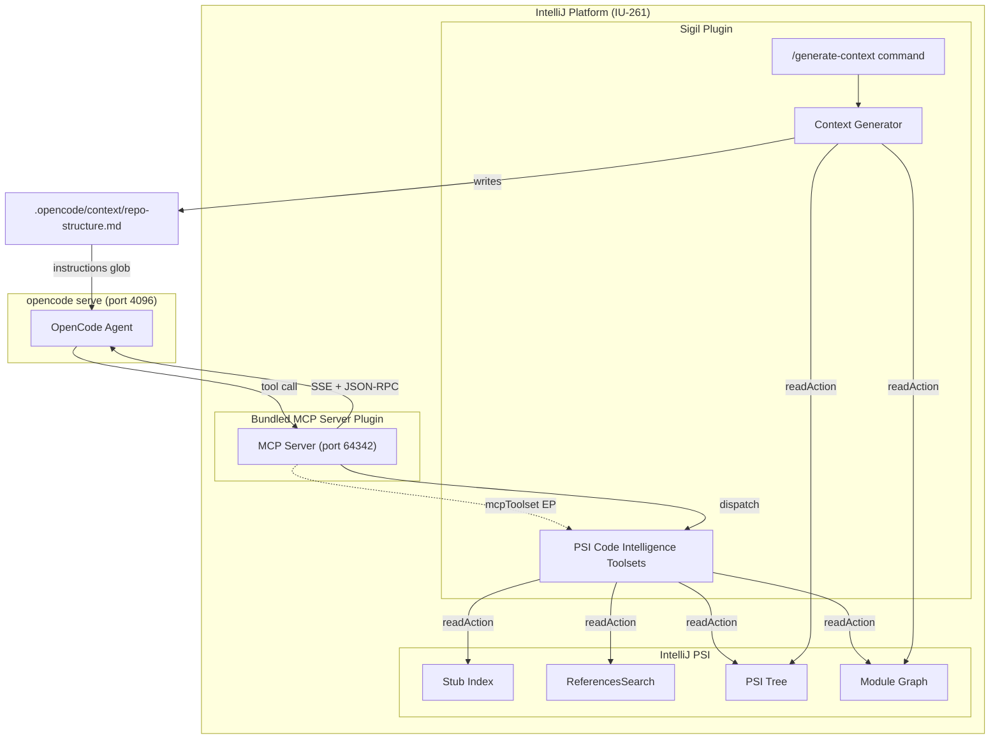
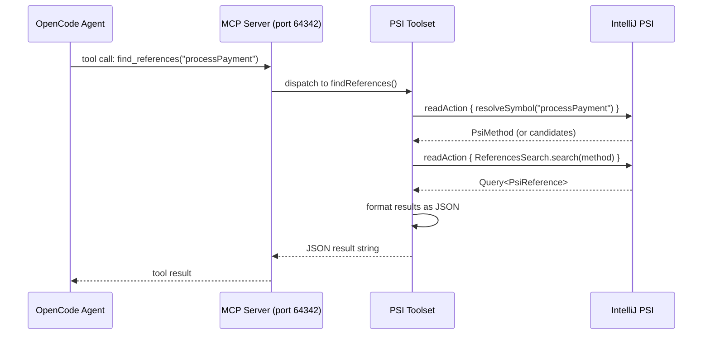
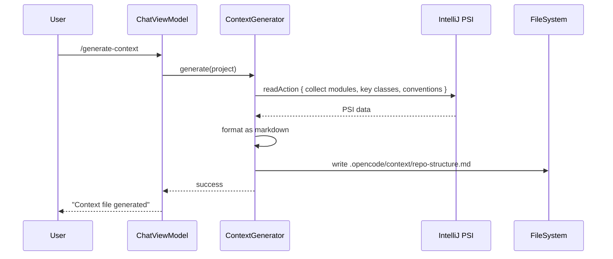

# Technical Design Document: IntelliJ PSI Code Intelligence — MCP Toolsets

> **Status:** Draft
> **Author(s):** —
> **Reviewer(s):** —
> **Last Updated:** 2026-07-22
> **Related docs:** [AGENTS.md](../../AGENTS.md), [smart-compaction.md](smart-compaction.md), [opencode-service-decomposition.md](opencode-service-decomposition.md)

---

## 1. TL;DR

We expose IntelliJ Platform's live PSI code intelligence (symbol search, find usages, call hierarchy, impact analysis, file structure, repo map) as MCP tools that the opencode agent calls on demand. The tools are implemented as `McpToolset` implementations registered via the bundled JetBrains MCP Server plugin's extension point (`com.intellij.mcpServer.mcpToolset`). This gives the agent always-fresh, type-resolved code intelligence for Java and Kotlin with full fidelity, and name-based symbol search for 10+ additional languages via IntelliJ's Go-to-Symbol infrastructure, with zero indexing cost, no external processes, and no additional dependencies beyond the already-bundled MCP Server plugin. A supplementary `/generate-context` slash command produces a static repo-structure overview from PSI for always-on context.

> **Tool count:** 6 MCP tools (`psi_find_symbol`, `psi_find_references`, `psi_call_hierarchy`, `psi_impact_analysis`, `psi_file_structure`, `psi_repo_map`). All ship in a single implementation pass; the original "Phase 4" deferral for `repo_map` is dropped (it is Step 10 of §12.1).

> **Contingency (VERIFIED 2026-07-26):** The `McpToolset` extension point is CONFIRMED to exist in the bundled `com.intellij.mcpServer` plugin for IU-261 via intellij-community source review (commit `idea/262.8665.258`). Verified facts:
> - EP name: `com.intellij.mcpServer.mcpToolset` (capital `S` in `mcpServer`), declared in `plugins/mcp-server/resources/META-INF/plugin.xml` as `<extensionPoint name="mcpToolset" interface="com.intellij.mcpserver.McpToolset" dynamic="true" />`.
> - Interface FQN: `com.intellij.mcpserver.McpToolset`.
> - Annotations: `com.intellij.mcpserver.annotations.McpTool` (FUNCTION target, `name`/`title` optional), `com.intellij.mcpserver.annotations.McpDescription` (FUNCTION/VALUE_PARAMETER/PROPERTY/TYPE, `description` param). Bonus: `@McpToolHints` for `readOnlyHint`/`destructiveHint`/`idempotentHint`/`openWorldHint`.
> - `Project` access: `currentCoroutineContext().project` (extension property on `CoroutineContext` in package `com.intellij.mcpserver`, throws `McpExpectedError` if null) and `currentCoroutineContext().projectOrNull` (nullable variant). NOT constructor injection.
> - `mcpFail(message: String, mcpErrorStructureContent: JsonObject? = null): Nothing` — top-level function in `com.intellij.mcpserver`, throws `McpExpectedError`.
> - `reportToolActivity(...)` — extension function on `CoroutineContext` in `com.intellij.mcpserver`; call as `currentCoroutineContext().reportToolActivity("...")`.
> - EP scope: **application-scoped** (NOT project-scoped as previously stated in §4.7.8). Toolset instances are singletons; `Project` is obtained per-call from the coroutine context. This means `repo_map` cache MUST be keyed by `Project` to avoid cross-project contamination.
> - Registration: `<extensions defaultExtensionNs="com.intellij"><mcpServer.mcpToolset implementation="com.example.MyToolset" /></extensions>` (note: `defaultExtensionNs="com.intellij"` with `mcpServer.mcpToolset` as the EP name, NOT `defaultExtensionNs="com.intellij.mcpServer"`).
> - Registration: `<extensions defaultExtensionNs="com.intellij"><mcpServer.mcpToolset implementation="com.example.MyToolset" /></extensions>` (note: `defaultExtensionNs="com.intellij"` with `mcpServer.mcpToolset` as the EP name, NOT `defaultExtensionNs="com.intellij.mcpServer"`).
> If the EP does not exist or has a different API shape in a future IU version, pivot to the fallback sketch in §6.

---

> **Implementation Mode: One-Sitting LLM Execution.** This TDD is restructured for autonomous LLM implementation in a single session. Key decisions (replacing the original M0 spike + milestone approach):
> - **No spike phase.** API assumptions are compile-verified, not spike-verified. If it compiles against the declared dependencies (`bundledPlugin("com.intellij.mcpServer")`, `bundledPlugin("org.jetbrains.kotlin")`), the API exists. The compile-check IS the verification.
> - **Tool names use `psi_` prefix:** `psi_find_symbol`, `psi_find_references`, `psi_call_hierarchy`, `psi_impact_analysis`, `psi_file_structure`, `psi_repo_map`. The `psi_` prefix is applied directly in the `@McpTool(name = "psi_find_symbol")` annotations in §4.7.2 (the authoritative blueprint) and in all tables in §4.3.1, §4.7.4, and §9.2. This avoids the `ToolRegistry.syncEnabled` name-based matching bug (AGENTS.md) without depending on MCP Server namespacing.
> - **All errors are structured strings** with a `"retry"` boolean field. `mcpFail()` is reserved for unexpected internal errors only. Retryable: "Indexing in progress", "timeout", "cache warming". Non-retryable: "symbol not found", "ambiguous name", "disabled".
> - **Always-registered + 'disabled' message** for the settings toggle. No dynamic EP investigation needed — the toggle controls behavior, not registration.
> - **Kotlin Analysis API with guarded per-element fallback** to `<inferred>`. Use `analyze(element) { ... }` from inside a coroutine `readAction { }` block (off-EDT). `@OptIn(KaAllowAnalysisOnEdt::class)` is NOT needed when calling from a background read action — it is only required when calling `analyze()` from the EDT. The MCP Server plugin dispatches tool calls on a background coroutine, so the EDT opt-in is unnecessary. If `analyze()` throws at runtime for a specific element, fall back to `<inferred>` for that element only.
> - **Linear implementation order** in §12.1 — each step compiles before the next. No parallel lanes, no spike phase, no human-in-the-loop checkpoints during implementation.
> - **Human verification** (runIde smoke test, agent calls, test-runtime impact measurement) happens AFTER the LLM completes all code, per §12.3.
> - **`testFramework()` is step 1**, not step 5. The baseline test suite is run immediately after adding the dependency to measure runtime impact before any toolset code is written.

---

## 2. Context & Scope

### 2.1 Current State

The plugin already registers the bundled JetBrains MCP Server plugin (port 64342) with the opencode server via `McpManager` → `McpRegistrar` → `POST /mcp`. The MCP Server plugin exposes an `McpToolset` extension point (`com.intellij.mcpServer.mcpToolset`) that allows plugins to contribute MCP tools. However, the bundled MCP Server's built-in tools are limited to file read/edit, problems, VCS, and debugger — **no code intelligence** (symbol search, find usages, call hierarchy, impact analysis).

The plugin's existing Follow Agent feature (`FollowAgentDispatcher`, `SearchFollowManager`, `CommandFollowManager`, `EditorFollowManager`) observes tool calls and opens IntelliJ-native UIs (Find in Files, Run console, editor navigation). This is a reactive observer pattern — it does not provide the agent with proactive code intelligence.

The plugin uses minimal PSI APIs today: `FilenameIndex` for file lookup, `PsiDocumentManager` for review comments, `GlobalSearchScope` for search scoping. No symbol search, reference search, call hierarchy, or impact analysis APIs are used.

### 2.2 Problem Statement

AI agents waste turns and tokens exploring codebases via grep + file-read loops. They lack semantic code understanding: "who calls this method?", "what breaks if I change this class?", "what's the structure of this file?". Standalone solutions (GitNexus, opencodehub, code-intel) rebuild this from scratch with tree-sitter + embeddings + graph databases. IntelliJ Platform already has this intelligence via PSI — we just need to expose it.

---

## 3. Goals & Non-Goals

### Goals

1. **Expose 5 MCP tools** via `McpToolset` implementations: `find_symbol`, `find_references`, `call_hierarchy`, `impact_analysis`, `file_structure`. `repo_map` is Phase 4 (separate milestone).
1. **Expose 6 MCP tools** via `McpToolset` implementations: `psi_find_symbol`, `psi_find_references`, `psi_call_hierarchy`, `psi_impact_analysis`, `psi_file_structure`, `psi_repo_map`. All 6 ship in a single implementation pass (§12.1 Steps 5–10).
2. **Always-fresh results** — tools query live PSI, reflecting current editor state including unsaved changes.
3. **Zero indexing cost** — no tree-sitter, no embeddings, no SQLite, no background workers. PSI is always live.
4. **Multi-language support (phased)** — Java and Kotlin with full-fidelity support for all 5 Phase 1-3 tools in Phase 1. Other JVM languages (Scala, Groovy): best-effort via shared JVM PSI. Non-JVM languages (Python, Go, Rust, JS/TS, Ruby, PHP): name-only symbol search via `ChooseByNameContributorEx` (CONFIRMED via web research — works across languages, returns `NavigationItem` which IS `PsiElement`; verify specific language plugin coverage in M0). `find_references`, `call_hierarchy`, `impact_analysis`, and `file_structure` signature extraction are Java/Kotlin-only in Phase 1. Per-language PSI adapters are a Phase 2+ follow-up.
5. **Generate context file** — a `/generate-context` slash command that writes `.opencode/context/repo-structure.md` from PSI for always-on overview.
6. **Optional dependency** — the plugin works without the MCP Server plugin; MCP tools are only registered when it's available.

### Non-Goals

- **Semantic/embedding-based search** — "find code by meaning" requires embeddings (UniXcoder, etc.). IntelliJ's stub index is name/pattern-based. This is a known limitation; semantic search is deferred.
- **Execution flow tracing** — pre-computing multi-function execution paths (like GitNexus's "processes") requires graph algorithms not available in PSI. Deferred.
- **Multi-repo search** — PSI is scoped to the open project. Cross-repo search requires external indexing. Not in scope.
- **Refactoring tools** — exposing IntelliJ's `RenameRefactoring` / `SafeDeleteRefactoring` as MCP tools is a separate follow-up. This TDD covers read-only intelligence only.
- **Replacing the bundled MCP Server's built-in tools** — we add new tools alongside the existing file/edit/problems/VCS tools, not replace them.
- **Full cross-language call hierarchy / impact analysis (Phase 1)** — `PsiCallExpression`, `ReferencesSearch` target resolution, and signature extraction are language-specific. Phase 1 ships Java/Kotlin only. Cross-language adapters are deferred to Phase 2+.

---

## 4. Proposed Solution

**Expose IntelliJ PSI code intelligence as MCP tools via the bundled MCP Server plugin's `McpToolset` extension point.** Each toolset is a Kotlin class implementing `com.intellij.mcpserver.McpToolset` with `@McpTool`-annotated `suspend fun` methods. The MCP Server plugin handles transport (SSE + JSON-RPC), schema generation, argument decoding, and cancellation. Tool methods use `readAction { }` for PSI access and return structured text/JSON. The opencode agent discovers and calls these tools automatically — no changes to `McpManager`, `McpRegistrar`, or `McpConfigWriter` are needed, since the MCP Server plugin is already registered.

For always-on context, a `/generate-context` slash command generates a markdown repo-structure file from PSI and writes it to `.opencode/context/repo-structure.md`, which is included in every prompt via `opencode.json` `instructions` glob.

### 4.1 Architecture Diagram



| Component | Responsibility |
|-----------|---------------|
| PSI Code Intelligence Toolsets | 5 `McpToolset` classes exposing PSI queries as MCP tools (repo_map is Phase 4) |
| Bundled MCP Server Plugin | Transport layer — SSE, JSON-RPC, schema generation, tool dispatch |
| Context Generator | PSI-based repo-structure markdown generator |
| `/generate-context` command | Slash command triggering context file generation |
| `McpManager` (existing) | Registers MCP Server with opencode — unchanged |
| `McpConfigWriter` (existing) | Writes `.opencode/opencode.json` — extended for context file glob |

> **Contingency:** The entire architecture depends on the `McpToolset` extension point existing in the bundled `com.intellij.mcpServer` plugin for IU-261. The EP is CONFIRMED to exist via intellij-community source review. Milestone 0 (§12) is a blocking API verification spike. If the EP does not exist or has a different API shape, pivot to the fallback sketch in §6.

### 4.2 Component & Module Design

```
src/main/kotlin/com/opencode/acp/intelligence/
├── SymbolSearchToolset.kt       # find_symbol tool (kind filter includes class search)
├── FindUsagesToolset.kt         # find_references tool
├── CallHierarchyToolset.kt      # call_hierarchy tool (callers/callees, depth N)
├── ImpactAnalysisToolset.kt     # impact_analysis tool (blast radius, risk tiers)
├── FileStructureToolset.kt      # file_structure tool (signatures, no bodies)
├── RepoMapToolset.kt            # repo_map tool (importance-ranked symbols)
├── PsiQueryHelper.kt            # Shared PSI query utilities (resolve, scope, format)
├── SymbolFormatter.kt            # Format PSI elements as text/JSON for tool results
├── RiskScorer.kt                 # Impact analysis risk scoring (pure logic, unit-testable)
├── context/
│   ├── ContextGenerator.kt       # Generate repo-structure.md from PSI
│   └── ContextFileWriter.kt     # Write .opencode/context/ files
└── model/
    ├── SymbolInfo.kt             # Data models for tool results
    ├── ReferenceInfo.kt
    ├── CallHierarchyNode.kt
    ├── ImpactResult.kt
    ├── FileStructure.kt
    └── RepoMapEntry.kt

src/main/resources/META-INF/
├── plugin.xml                    # Main descriptor (adds optional depends)
└── plugin-mcp.xml                # MCP toolset registrations (loaded only when MCP Server present)

src/test/kotlin/com/opencode/acp/intelligence/
├── RiskScorerTest.kt             # Pure-logic unit tests
├── SymbolFormatterTest.kt        # Pure-logic unit tests
├── PsiQueryHelperTest.kt         # Pure-logic: parseScope, truncation, error formatting
├── ContextGeneratorTest.kt       # Pure-logic: markdown formatting from structured data
├── ContextFileWriterTest.kt      # Pure-logic: file I/O with temp directory
├── McpConfigInstructionsMergeTest.kt  # Pure-logic: instructions array merge/dedup
├── IsPublicApiTest.kt            # Pure-logic: touchesPublicApi modifier detection
├── SymbolSearchToolsetTest.kt   # PSI integration (LightPlatformTestCase)
├── FindUsagesToolsetTest.kt      # PSI integration (LightPlatformTestCase)
├── CallHierarchyToolsetTest.kt   # PSI integration (LightPlatformTestCase)
├── ImpactAnalysisToolsetTest.kt # PSI integration (LightPlatformTestCase)
├── FileStructureToolsetTest.kt   # PSI integration (LightPlatformTestCase)
├── RepoMapToolsetTest.kt         # PSI integration (LightPlatformTestCase)
└── ContextGeneratorPsiTest.kt   # PSI integration (LightPlatformTestCase)
```

**4.2.1 Key Modules / Components**

| Module | Responsibility | Key Exports | Dependencies |
|--------|---------------|-------------|-------------|
| `SymbolSearchToolset` | Find symbols by name/pattern across project | `find_symbol` | `PsiQueryHelper`, `SymbolFormatter` |
| `FindUsagesToolset` | Find all references to a symbol | `find_references` | `PsiQueryHelper`, `SymbolFormatter` |
| `CallHierarchyToolset` | Caller/callee tree to depth N | `call_hierarchy` | `PsiQueryHelper`, `SymbolFormatter` |
| `ImpactAnalysisToolset` | Blast radius with risk tiers | `impact_analysis` | `PsiQueryHelper`, `RiskScorer`, `SymbolFormatter` |
| `FileStructureToolset` | File members with signatures (no bodies) | `file_structure` | `PsiQueryHelper`, `SymbolFormatter` |
| `RepoMapToolset` | Importance-ranked symbol index | `repo_map` | `PsiQueryHelper`, `SymbolFormatter` |
| `PsiQueryHelper` | Shared PSI resolution, scope, traversal utilities | `resolveSymbol()`, `projectScope()`, `formatLocation()` | IntelliJ PSI APIs |
| `SymbolFormatter` | Format PSI elements as structured text/JSON | `formatSymbol()`, `formatReference()`, `formatCallNode()` | `model.*` |
| `RiskScorer` | Compute risk levels from impact data (pure logic) | `scoreImpact()`, `classifyRisk()` | `model.ImpactResult` |
| `ContextGenerator` | Generate repo-structure.md from PSI | `generate()` | `PsiQueryHelper`, `SymbolFormatter` |
| `ContextFileWriter` | Write context files to `.opencode/context/` | `writeRepoStructure()` | `ContextGenerator` |
| Kotlin Analysis API Integration | Resolve inferred Kotlin types for accurate signatures | `resolveKotlinSignature()` | `org.jetbrains.kotlin` (bundled plugin, provides `KaSession`) |

**4.2.2 Error Handling**

| Error Scenario | Handling Strategy | User-facing Impact |
|---------------|-------------------|-------------------|
| Symbol not found | Return structured error message with search query | Agent sees "No symbol matching 'X' found" and can refine |
| PSI access fails (index not ready / dumb mode) | `DumbService.isDumb()` check → return "Indexing in progress, try again shortly" | Agent sees a retryable message |
| Read action timeout | `readAction { }` is cancellable; on timeout return partial results | Agent gets partial data with a "incomplete" note |
| Too many results (>500 references) | Truncate to 500 with "showing first 500 of N" footer | Agent gets actionable subset, not a token explosion |
| Ambiguous symbol name | Return list of candidates with file:line for disambiguation | Agent picks the right one and re-queries |
| MCP Server plugin not installed | Toolsets never registered (optional dependency) | No error — tools simply absent |
| `CancellationException` during long query | Re-throw `CancellationException` before generic catch — do NOT swallow into 'Internal error' | Agent sees clean cancellation, not a misleading error |
| Token budget exceeded | Truncate result at `MAX_TOOL_OUTPUT_CHARS` and append 'Result truncated for token budget' footer | Agent gets actionable subset with guidance to narrow scope |
| Path traversal in `file` parameter | Canonicalize and validate against project root (reuse `AttachmentPathValidator` from `com.opencode.acp.chat.util`) | Agent cannot access files outside project |
| Path traversal in `file` parameter | Canonicalize and validate against project root (reuse `AttachmentPathValidator` from `com.opencode.acp.chat.util`) | Agent cannot access files outside project |

### 4.3 API / Interface Design

The MCP tools are exposed via the `McpToolset` extension point. The MCP Server plugin auto-generates JSON schemas from the Kotlin function signatures and `@McpDescription` annotations. Tool calls are dispatched by the MCP Server plugin to the `suspend fun` methods.

#### 4.3.1 MCP Tool Specifications

**`psi_find_symbol`** — Find symbols by name pattern across the project.

| Parameter | Type | Required | Description |
|-----------|------|----------|-------------|
| `pattern` | String | Yes | Symbol name or pattern (camelCase, substring, or exact) |
| `scope` | String | No | Search scope: `"project"` (default), `"module:<name>"`. `"all"` (includes libraries) requires explicit user opt-in via Settings → Tools → Sigil → PSI Tools. |
| `limit` | Int | No | Max results (default 50, max 200) |
| `kind` | String | No | Filter by symbol kind: `"class"`, `"method"`, `"field"`, `"function"`, `"property"`. Omit for all kinds. |

Returns: JSON array of `{ name, kind, file, line, signature }` entries. When `kind=class`, the result includes `qualifiedName`.

**`psi_find_references`** — Find all references to a symbol.

| Parameter | Type | Required | Description |
|-----------|------|----------|-------------|
| `symbol` | String | Yes | Symbol name (function, class, field) |
| `file` | String | No | File path to disambiguate (when multiple symbols share a name) |
| `scope` | String | No | Search scope: `"project"` (default), `"module:<name>"`. `"all"` (includes libraries) requires explicit user opt-in via Settings → Tools → Sigil → PSI Tools. |
| `limit` | Int | No | Max results (default 200, max 500) |

Returns: JSON array of `{ file, line, column, enclosingSymbol, text }` entries.

**Overload handling:** When multiple overloads exist in the same file (e.g., `processPayment(int)`, `processPayment(String)`), the `file` parameter does not disambiguate. The tool returns all matching overloads with their full signatures in the `enclosingSymbol` field. The agent selects by signature.

**`psi_call_hierarchy`** — Get caller or callee tree for a method.

| Parameter | Type | Required | Description |
|-----------|------|----------|-------------|
| `symbol` | String | Yes | Method name |
| `file` | String | No | File path to disambiguate |
| `direction` | String | No | `"callers"` (default) or `"callees"` |
| `depth` | Int | No | Traversal depth (default 2, max 4) |
| `limit` | Int | No | Max nodes per level (default 20, max 50) |
| `scope` | String | No | Search scope: `"project"` (default), `"module:<name>"`. `"all"` (includes libraries) requires explicit user opt-in via Settings → Tools → Sigil → PSI Tools. |

Returns: JSON tree of `{ name, file, line, children: [...] }` nodes.

**`psi_impact_analysis`** — Blast radius: what breaks if a symbol changes.

| Parameter | Type | Required | Description |
|-----------|------|----------|-------------|
| `symbol` | String | Yes | Symbol name (method, class, field) |
| `file` | String | No | File path to disambiguate |
| `depth` | Int | No | Transitive depth (default 1, max 3) |
| `limit` | Int | No | Max affected items (default 100, max 300) |
| `scope` | String | No | Search scope: `"project"` (default), `"module:<name>"`. `"all"` (includes libraries) requires explicit user opt-in via Settings → Tools → Sigil → PSI Tools. |

Returns: JSON `{ affectedFiles: [...], affectedSymbols: [...], riskLevel, summary }`.

**`psi_file_structure`** — Get file members with signatures (no bodies).

| Parameter | Type | Required | Description |
|-----------|------|----------|-------------|
| `file` | String | Yes | File path (project-relative; absolute paths must be within project root) |

Returns: JSON `{ file, language, classes: [{ name, kind, fields: [...], methods: [...], nestedClasses: [...] }] }`.

**`psi_repo_map`** — Importance-ranked symbol index for the project.

| Parameter | Type | Required | Description |
|-----------|------|----------|-------------|
| `limit` | Int | No | Max symbols to return (default 100, max 500) |
| `scope` | String | No | Search scope: `"project"` (default), `"module:<name>"`. `"all"` (includes libraries) requires explicit user opt-in via Settings → Tools → Sigil → PSI Tools. |

Returns: JSON array of `{ name, kind, file, line, referenceCount, importance }` sorted by importance.

#### 4.3.2 Slash Command

**`/generate-context`** — Generate `.opencode/context/repo-structure.md` from PSI.

No parameters. Writes a markdown file containing: tech stack, module structure, key classes by reference count, conventions. The file is included in every prompt via `opencode.json` `instructions` glob.

**Wiring:** `/generate-context` is a **local** slash command (like `/clear`, `/cancel`), not a server command. It is added to the hardcoded `localCommands` list in `ChatScreen.kt` and dispatched via a new `when` branch calling `viewModel.generateContext()`. The command runs PSI queries on a background coroutine and writes the file atomically (reusing the project's `AtomicFileWriter` from `util`). If the project is in dumb mode (`DumbService.isDumb()`), the command shows a progress indicator and waits for smart mode rather than producing incomplete results.

**`McpConfigWriter` `instructions` merge:** The existing `McpConfigWriter` writes `mcp` and `agent.permission` sections to `.opencode/opencode.json`. Adding the `instructions` glob (`".opencode/context/**/*.md"`) requires a new `writeConfig` transform in `McpConfigWriter`, reusing the existing file-level `ReentrantLock` + atomic temp-file move pattern. The merge function:

```kotlin
fun mergeInstructions(existing: JsonArray, ourGlob: String): JsonArray
```

Contract:
- If `ourGlob` is already present (exact string match), return `existing` unchanged
- If `existing` contains a glob that covers `ourGlob` (e.g., `.opencode/context/*.md` covers `.opencode/context/**/*.md`), return `existing` unchanged
- Otherwise, append `ourGlob` to the array
- Preserve all existing entries regardless of type (string or object)

This function is extracted as pure logic and unit-tested with scenarios: empty array, array with our glob, array with covering glob, array with unrelated entries, array with non-string entries.

### 4.4 Key Flows





### 4.5 Technology Stack

| Layer | Technology | Version | Rationale |
|-------|-----------|---------|-----------|
| Language | Kotlin | 2.3.0 | Project standard |
| MCP Framework | Bundled MCP Server Plugin | IU-261 | Already registered with opencode; provides transport, schema gen, dispatch |
| PSI APIs | IntelliJ Platform SDK | IU-261 | Live code intelligence — always fresh, type-resolved |
| Coroutines | KotlinX Coroutines | Platform-bundled | `readAction { }` for cancellable PSI access |
| Serialization | KotlinX Serialization | 1.7.x | JSON result formatting |
| Testing | JUnit 5 + Kotest | Existing | Pure-logic tests for `RiskScorer`, `SymbolFormatter` |
| Kotlin Analysis API | `org.jetbrains.kotlin.analysis.api` | IU-261 (bundled, accessed via bundledPlugin("org.jetbrains.kotlin")) | Resolves inferred Kotlin types for accurate signatures in `file_structure` and `find_symbol`. Required — the `<inferred>` fallback is unacceptable for the project's primary language. |

### 4.6 Integration with Existing Systems

| System | Integration Point | Changes Required |
|--------|------------------|-----------------|
| `McpManager` | None — MCP Server plugin already registered | No changes |
| `McpRegistrar` | None — tools discovered via `tools/list` | No changes |
| `McpConfigWriter` | Extended for `instructions` glob merge | New `mergeInstructions()` function |
| `ToolRegistry` | New tools appear automatically via `McpToolDiscovery` | No code changes |
| `Follow Agent` | No integration — PSI tools are queries, not IDE triggers | Document in AGENTS.md |
| `ChatScreen` | `/generate-context` added to `localCommands` | New `when` branch |
| `OpenCodeSettingsState` | New PSI tools settings | New fields |

### 4.7 Implementation Blueprint

> **Authoritative for LLM execution.** The blueprint below is the implementation spec. Imports and signatures are compile-verified against the declared dependencies (`bundledPlugin("com.intellij.mcpServer")`, `bundledPlugin("org.jetbrains.kotlin")`, `intellijPlatform.testFramework()`). If a symbol doesn't compile, the LLM fixes it — there is no separate "spike" phase. Tool names use the `psi_` prefix per §1 Implementation Mode. The `project` accessor is `currentCoroutineContext().projectOrNull` (nullable) or `currentCoroutineContext().project` (throws). `mcpFail()` is for unexpected internal errors only; all expected errors are structured strings via `SymbolFormatter.formatError(message, retry = false)`.

> Blueprint code is illustrative, not authoritative. Developers must validate types against the real compiler (IU-261 SDK) before using.

#### 4.7.1 Data Models & Schemas

```kotlin
package com.opencode.acp.intelligence.model

// --- Symbol search results ---

data class SymbolInfo(
    val name: String,
    val kind: SymbolKind,         // CLASS, METHOD, FIELD, INTERFACE, ENUM, OBJECT, FUNCTION, PROPERTY
    val file: String,             // project-relative path
    val line: Int,                // 1-based
    val signature: String? = null, // method/class signature without body
    val qualifiedName: String? = null,
)

enum class SymbolKind {
    CLASS, INTERFACE, ENUM, OBJECT, METHOD, FUNCTION, FIELD, PROPERTY, ANNOTATION,
    CONSTRUCTOR, PARAMETER, PACKAGE, TYPE_ALIAS, COMPANION_OBJECT
}

// --- Find references results ---

data class ReferenceInfo(
    val file: String,
    val line: Int,
    val column: Int,
    val enclosingSymbol: String?,  // e.g., "MyClass.processOrder()"
    val text: String,              // the reference text (trimmed line)
)

// --- Call hierarchy ---

data class CallHierarchyNode(
    val name: String,
    val kind: SymbolKind,
    val file: String,
    val line: Int,
    val children: List<CallHierarchyNode> = emptyList(),
)

// --- Impact analysis ---

data class ImpactResult(
    val symbol: String,
    val affectedFiles: List<String>,
    val affectedSymbols: List<AffectedSymbol>,
    val riskLevel: RiskLevel,
    val summary: String,
    val totalAffected: Int,
)

data class AffectedSymbol(
    val name: String,
    val kind: SymbolKind,
    val file: String,
    val line: Int,
    val depth: Int,               // 1 = direct, 2 = transitive
    val relationship: String,     // "calls", "overrides", "implements", "references", "inherits"
)

enum class RiskLevel {
    UNKNOWN,   // partial results — risk cannot be determined (timeout/budget exceeded)
    LOW,       // < 5 affected symbols
    MEDIUM,    // 5–20 affected symbols
    HIGH,      // 21–50 affected symbols
    CRITICAL,  // > 50 affected symbols or touches public API
}

// --- File structure ---

data class FileStructure(
    val file: String,
    val language: String,
    val classes: List<ClassStructure>,
)

data class ClassStructure(
    val name: String,
    val kind: SymbolKind,         // CLASS, INTERFACE, ENUM, OBJECT
    val fields: List<MemberInfo>,
    val methods: List<MemberInfo>,
    val nestedClasses: List<ClassStructure>,
)

data class MemberInfo(
    val name: String,
    val signature: String,        // full signature without body
    val modifiers: List<String>,  // ["public", "static", "suspend"]
)

// --- Repo map ---

data class RepoMapEntry(
    val name: String,
    val kind: SymbolKind,
    val file: String,
    val line: Int,
    val referenceCount: Int,
    val importance: Double,       // log-scaled reference count (0.0–1.0), estimated via ReferencesSearch with early termination on sampled symbols. Formula: `if (maxCount > 0) ln(count + 1) / ln(maxCount + 1) else 0.0`. Symbols with 0 references get `importance = 0.0` directly (skip log-scaling to avoid log(0) = -∞).
)
```

#### 4.7.2 Class & Interface Definitions

```kotlin
package com.opencode.acp.intelligence

import com.intellij.mcpserver.McpToolset
import com.intellij.mcpserver.annotations.McpTool
import com.intellij.mcpserver.annotations.McpDescription
import com.intellij.mcpserver.project      // extension property on CoroutineContext
import com.intellij.mcpserver.projectOrNull // nullable variant
import com.intellij.openapi.application.readAction
import com.intellij.openapi.project.Project
import kotlinx.coroutines.currentCoroutineContext

// Project is obtained from the coroutine context, injected by the MCP Server plugin.

// --- Toolset classes (one per concern for SRP + independent enable/disable) ---

class SymbolSearchToolset : McpToolset {
    @McpTool(name = "psi_find_symbol")
    @McpDescription("Find symbols by name pattern across the project. Returns name, kind, file, line, and signature.")
    suspend fun findSymbol(
        @McpDescription("Symbol name or pattern (camelCase, substring, or exact name)")
        pattern: String,
        @McpDescription("Search scope: 'project' (default), 'module:<name>', or 'all'")
        scope: String = "project",
        @McpDescription("Max results (default 50, max 200)")
        limit: Int = 50,
        @McpDescription("Filter by symbol kind: 'class', 'method', 'field', 'function', 'property', 'interface', 'enum', 'object', 'annotation', 'constructor', 'package', 'type_alias', 'companion_object'. Omit for all kinds. Unknown values return empty results.")
        kind: String? = null,
    ): String {
        val project = currentCoroutineContext().projectOrNull
            ?: return SymbolFormatter.formatError("No project open")
        // ... implementation ...
    }
}

class FindUsagesToolset : McpToolset {
    @McpTool(name = "psi_find_references")
    @McpDescription("Find all references to a symbol (function, class, field). Returns file, line, enclosing symbol, and reference text.")
    suspend fun findReferences(
        @McpDescription("Symbol name (function, class, field)")
        symbol: String,
        @McpDescription("File path to disambiguate when multiple symbols share a name")
        file: String? = null,
        @McpDescription("Search scope (default 'project')")
        scope: String = "project",
        @McpDescription("Max results (default 200, max 500)")
        limit: Int = 200,
    ): String {
        val project = currentCoroutineContext().projectOrNull
            ?: return SymbolFormatter.formatError("No project open")
        // ... implementation ...
    }
}

class CallHierarchyToolset : McpToolset {
    @McpTool(name = "psi_call_hierarchy")
    @McpDescription("Get caller or callee tree for a method. Returns a tree of name, file, line, and children.")
    suspend fun callHierarchy(
        @McpDescription("Method name")
        symbol: String,
        @McpDescription("File path to disambiguate")
        file: String? = null,
        @McpDescription("Direction: 'callers' (default) or 'callees'")
        direction: String = "callers",
        @McpDescription("Traversal depth (default 2, max 4)")
        depth: Int = 2,
        @McpDescription("Max nodes per level (default 20, max 50)")
        limit: Int = 20,
        @McpDescription("Search scope: 'project' (default), 'module:<name>', or 'all'")
        scope: String = "project",
    ): String {
        val project = currentCoroutineContext().projectOrNull
            ?: return SymbolFormatter.formatError("No project open")
        // ... implementation ...
    }
}

class ImpactAnalysisToolset : McpToolset {
    @McpTool(name = "psi_impact_analysis")
    @McpDescription("Blast radius analysis: what breaks if a symbol changes. Returns affected files, symbols, risk level, and summary.")
    suspend fun impactAnalysis(
        @McpDescription("Symbol name (method, class, field)")
        symbol: String,
        @McpDescription("File path to disambiguate")
        file: String? = null,
        @McpDescription("Transitive depth (default 1, max 3)")
        depth: Int = 1,
        @McpDescription("Max affected items (default 100, max 300)")
        limit: Int = 100,
        @McpDescription("Search scope: 'project' (default), 'module:<name>', or 'all'")
        scope: String = "project",
    ): String {
        val project = currentCoroutineContext().projectOrNull
            ?: return SymbolFormatter.formatError("No project open")
        // ... implementation ...
    }
}

class FileStructureToolset : McpToolset {
    @McpTool(name = "psi_file_structure")
    @McpDescription("Get file members with signatures (no bodies). Returns classes, fields, methods, and nested classes.")
    suspend fun fileStructure(
        @McpDescription("File path (project-relative or absolute)")
        file: String,
    ): String {
        val project = currentCoroutineContext().projectOrNull
            ?: return SymbolFormatter.formatError("No project open")
        // ... implementation ...
    }
}

class RepoMapToolset : McpToolset {
    @McpTool(name = "psi_repo_map")
    @McpDescription("Importance-ranked symbol index for the project. Returns symbols sorted by reference count.")
    suspend fun repoMap(
        @McpDescription("Max symbols to return (default 100, max 500)")
        limit: Int = 100,
        @McpDescription("Search scope (default 'project')")
        scope: String = "project",
    ): String {
        val project = currentCoroutineContext().projectOrNull
            ?: return SymbolFormatter.formatError("No project open")
        // ... implementation ...
    }
}

// --- Shared utilities ---

// PsiQueryHelper is instantiated per-call with the Project from the coroutine context.
// It is NOT stored as a field on the toolset (toolsets are application-scoped singletons;
// Project references must not leak across project close). PsiQueryHelper is stateless.
class PsiQueryHelper(private val project: Project) {
    // Symbol resolution: name → PsiElement (with disambiguation by file)
    suspend fun resolveSymbol(name: String, file: String?, scope: GlobalSearchScope): PsiElement?

    // Resolve to a list of candidates when name is ambiguous
    suspend fun resolveSymbolCandidates(name: String, scope: GlobalSearchScope): List<PsiElement>

    // Build a GlobalSearchScope from the scope string ("project", "module:<name>", "all")
    fun parseScope(scope: String): GlobalSearchScope

    // Format a PSI element location as "file:line"
    fun formatLocation(element: PsiElement): String

    // Extract signature from a PsiMethod/KtFunction (modifiers + return type + params, no body)
    fun extractSignature(element: PsiElement): String

    // Get the enclosing method/class name for a reference
    fun getEnclosingSymbol(element: PsiElement): String?
}

object SymbolFormatter {
    // Format a list of SymbolInfo as JSON string
    fun formatSymbols(symbols: List<SymbolInfo>): String

    // Format a list of ReferenceInfo as JSON string
    fun formatReferences(refs: List<ReferenceInfo>, truncated: Boolean, total: Int): String

    // Format a CallHierarchyNode tree as JSON string
    fun formatCallHierarchy(root: CallHierarchyNode): String

    // Format an ImpactResult as JSON string
    fun formatImpact(result: ImpactResult): String

    // Format a FileStructure as JSON string
    fun formatFileStructure(structure: FileStructure): String

    // Format a list of RepoMapEntry as JSON string
    fun formatRepoMap(entries: List<RepoMapEntry>): String

    // Format an error message as JSON: {"error": "<message>", "retry": <bool>}
    fun formatError(message: String, retry: Boolean = false): String

    // Format ambiguous symbol candidates for disambiguation
    fun formatCandidates(candidates: List<SymbolInfo>): String
}

object RiskScorer {
    // Score impact and classify risk level (pure logic — unit-testable)
    fun scoreImpact(affectedSymbols: List<AffectedSymbol>, touchesPublicApi: Boolean): RiskLevel

    // Generate a human-readable summary
    fun summarize(result: ImpactResult): String
}
```

#### 4.7.3 Function Signatures

```kotlin
// --- PsiQueryHelper: core resolution logic ---

// Resolve a symbol name to a PsiElement, using file path for disambiguation.
// Pseudocode:
// 1. Try PsiShortNamesCache.getMethodsByName / getClassesByName (Java/Kotlin)
// 2. If file provided, filter candidates by containing file path
// 3. If multiple candidates remain, return null (caller handles ambiguity)
// 4. If exactly one candidate, return it
suspend fun PsiQueryHelper.resolveSymbol(name: String, file: String?, scope: GlobalSearchScope): PsiElement?

// --- Call hierarchy: use ReferencesSearch + enclosing method resolution ---
//
// There is no public `CallHierarchyProvider.getCallers()` API. The IntelliJ call hierarchy
// browser uses `ReferencesSearch.search()` internally (via `CallerMethodsTreeStructure`).
// We use the same approach programmatically:
//
// For 'callers':
// 1. Resolve the target method to a PsiElement
// 2. ReferencesSearch.search(element, scope) to find all references
// 3. For each reference, resolve the enclosing method via PsiTreeUtil.getParentOfType(method)
// 4. Deduplicate by method signature (avoid cycles via visited set)
// 5. Recurse to depth N, applying per-level limit
//
// For 'callees':
// 1. Resolve the target method to a PsiElement
// 2. PsiTreeUtil.findChildrenOfType(method.body, PsiCallExpression.class)
// 3. Resolve each call expression to its target method
// 4. Recurse to depth N
//
// Java-specific: MethodReferencesSearch.search() finds call-site references specifically
// Kotlin-specific: Use Kotlin PSI (KtCallExpression) + resolveToCall() for callee resolution
// Cycle detection: visited set of (file, line, signature) tuples
//
// Note: This is Java/Kotlin-only in Phase 1.
// Cross-language call hierarchy is deferred to Phase 2+.

// Compute impact (blast radius) for a symbol.
// Pseudocode:
// 1. Find direct references via ReferencesSearch.search(element, scope)
// 2. For methods: also find overrides via PsiMethod.findDeepestSuperMethods()
// 3. For classes: also find inheritors via ClassInheritorsSearch.search(psiClass)
// 4. If depth > 1, recurse on each affected symbol (transitive closure)
//    — BUT: add a hard time budget (e.g., 10 seconds). Abort early when exceeded,
//      returning partial results with an 'incomplete (time budget exceeded)' footer.
//    — Call reportToolActivity() periodically so the agent sees progress.
//    — Call currentCoroutineContext().ensureActive() after each iteration to
//      cooperate with cancellation.
//    — Iteration order: BFS from target, depth-tagged. Partial results include all
//      depth-1 + as much depth-2 as fit within the time budget.
//    — At depth ≥ 2, if computation exceeds 30 seconds, abort and return depth-1
//      results with a hint: 'Transitive analysis exceeded time budget. Showing
//      direct impact only. Re-run with depth=1 for complete results.'
//    — Partial results from timeout suppress the `riskLevel` field (set to UNKNOWN)
//      to avoid misleading the agent.
// 5. Collect affected files (unique)
// 6. Score risk via RiskScorer
// 7. Apply limit
// Note: This is O(refs² × searchCost) on real workloads — the time budget is
// essential to prevent runaway computation on widely-referenced symbols.
suspend fun PsiQueryHelper.computeImpact(
    element: PsiElement,
    scope: GlobalSearchScope,
    depth: Int,
    limit: Int,
): ImpactResult

// Compute repo map (importance-ranked symbols).
// Algorithm (inspired by Aider's repo_map, adapted for IntelliJ PSI):
//
// 1. Collect candidate class names via StubIndex.processAllKeys (Java/Kotlin only in Phase 1)
// 2. Sample top N class names (default 500) — sort alphabetically for deterministic sampling
// 3. For each sampled class, estimate importance via a TWO-STEP proxy:
//    a. GUARD: PsiSearchHelper.isCheapEnoughToSearch(name, scope) — checks word index,
//       returns ZERO_OCCURRENCES / FEW_OCCURRENCES / TOO_MANY_OCCURRENCES.
//       - ZERO → importance = 0 (unused symbol)
//       - FEW → proceed to step (b)
//       - TOO_MANY → importance = 0.1 (very common name, likely low-signal like "get", "add")
//    b. COUNT: ReferencesSearch.search(element, scope).forEach with a Processor that counts
//       up to MAX_REFS_PER_SYMBOL (default 100). Stop early. This is the actual reference count.
// 4. Normalize reference counts to 0.0–1.0 importance (log-scaled to prevent domination by outliers)
// 5. Sort by importance descending
// 6. Apply limit
// 7. Hard time budget: abort after 15 seconds, return partial results with 'incomplete' footer
//
// Cache strategy:
// - Soft cache: @Volatile var cache: RepoMapCache? field, serve stale during rebuild
// - TTL: 5 minutes (min rebuild interval, not stale data window)
// - Invalidation: PsiTreeChangeListener on file save (not just TTL expiry)
// - Background pre-warm: warmRepoMap() called on ProjectActivity (background dispatcher, not blocking project open)
// - Thread-safety: Mutex for rebuild (only one rebuild at a time), readers read @Volatile field without Mutex
// - Cold start: first call returns "cache warming, retry in 10s" if no cache exists
// - Document sampling behavior in tool description: 'returns top-N by name frequency, not exhaustive'
//
// IMPORTANT: PsiSearchHelper.isCheapEnoughToSearch() does NOT return a reference count.
// It returns a cost estimate (ZERO/FEW/TOO_MANY occurrences in the word index).
// The actual count comes from ReferencesSearch with early termination.
suspend fun PsiQueryHelper.computeRepoMap(
    scope: GlobalSearchScope,
    limit: Int,
): List<RepoMapEntry>

// Pre-warm lifecycle: A `RepoMapPreWarmActivity` (implementing `ProjectActivity`)
// launches `warmRepoMap()` on a background dispatcher (`Dispatchers.Default`) after
// project open. The activity does NOT block project open — it fires and forgets.
// If the project closes before pre-warm completes, the coroutine is cancelled via
// project disposal.
```

#### 4.7.4 Component Mapping

| Component | Responsibility | Data Model(s) | API Endpoint(s) | Key Class(es) / Function(s) |
|-----------|---------------|---------------|------------------|------------------------------|
| SymbolSearchToolset | Find symbols by name/pattern | `SymbolInfo`, `SymbolKind` | MCP `psi_find_symbol` | `SymbolSearchToolset.findSymbol()`, `PsiQueryHelper.resolveSymbol()` |
| FindUsagesToolset | Find all references to a symbol | `ReferenceInfo` | MCP `psi_find_references` | `FindUsagesToolset.findReferences()`, `ReferencesSearch` |
| CallHierarchyToolset | Caller/callee tree | `CallHierarchyNode` | MCP `psi_call_hierarchy` | `CallHierarchyToolset.callHierarchy()`, `PsiQueryHelper.buildCallerTree()` (ReferencesSearch + enclosing-method resolution) |
| ImpactAnalysisToolset | Blast radius with risk tiers | `ImpactResult`, `AffectedSymbol`, `RiskLevel` | MCP `psi_impact_analysis` | `ImpactAnalysisToolset.impactAnalysis()`, `PsiQueryHelper.computeImpact()`, `RiskScorer` |
| FileStructureToolset | File members with signatures | `FileStructure`, `ClassStructure`, `MemberInfo` | MCP `psi_file_structure` | `FileStructureToolset.fileStructure()`, `PsiQueryHelper.extractSignature()` |
| RepoMapToolset | Importance-ranked symbol index | `RepoMapEntry` | MCP `psi_repo_map` | `RepoMapToolset.repoMap()`, `PsiQueryHelper.computeRepoMap()` |
| ContextGenerator | Generate repo-structure.md | — | `/generate-context` slash command | `ContextGenerator.generate()`, `ContextFileWriter.writeRepoStructure()` |
| SymbolFormatter | Format results as JSON | All model types | — | `SymbolFormatter.format*()` |
| RiskScorer | Risk classification (pure logic) | `RiskLevel`, `AffectedSymbol` | — | `RiskScorer.scoreImpact()` |

#### 4.7.5 Enums, Constants & Configuration

```kotlin
package com.opencode.acp.intelligence

// --- Limits (prevent token explosion) ---

const val MAX_SYMBOL_SEARCH_RESULTS = 200
const val DEFAULT_SYMBOL_SEARCH_LIMIT = 50

const val MAX_REFERENCE_RESULTS = 500
const val DEFAULT_REFERENCE_LIMIT = 200

const val MAX_CALL_HIERARCHY_DEPTH = 4
const val DEFAULT_CALL_HIERARCHY_DEPTH = 2
const val MAX_CALL_HIERARCHY_NODES_PER_LEVEL = 50
const val DEFAULT_CALL_HIERARCHY_NODES_PER_LEVEL = 20

const val MAX_IMPACT_DEPTH = 3
const val DEFAULT_IMPACT_DEPTH = 1
const val MAX_IMPACT_RESULTS = 300
const val DEFAULT_IMPACT_LIMIT = 100

const val MAX_REPO_MAP_RESULTS = 500
const val DEFAULT_REPO_MAP_LIMIT = 100

// --- Repo map caching (O(symbols × references) is expensive) ---

const val REPO_MAP_CACHE_TTL_MS = 300_000L  // 5 minutes — soft cache, min rebuild interval
const val REPO_MAP_COMPUTATION_TIMEOUT_MS = 15_000L  // hard time budget for cache rebuild
const val REPO_MAP_SAMPLE_SIZE = 500  // sample top N class names, not exhaustive

// --- Token budget (prevent context window consumption) ---
const val MAX_TOOL_OUTPUT_CHARS = 80_000  // ~20K tokens — hard ceiling per tool result

// --- Per-tool timeouts ---
const val TOOL_TIMEOUT_FIND_REFERENCES_MS = 30_000L   // 30 seconds
const val TOOL_TIMEOUT_IMPACT_ANALYSIS_MS = 60_000L   // 60 seconds (depth > 1)
const val TOOL_TIMEOUT_REPO_MAP_MS = 120_000L         // 120 seconds
const val TOOL_TIMEOUT_DEFAULT_MS = 10_000L           // 10 seconds — for index-lookup tools (find_symbol, file_structure) that should be milliseconds

// --- Risk thresholds ---

const val RISK_LOW_THRESHOLD = 5       // < 5 affected = LOW
const val RISK_MEDIUM_THRESHOLD = 20   // 5–20 = MEDIUM
const val RISK_HIGH_THRESHOLD = 50     // 21–50 = HIGH
// > 50 = CRITICAL
// Touching public API (public/non-private method or public class) always = CRITICAL

// --- touchesPublicApi derivation (pure logic, unit-testable) ---
// A symbol "touches public API" if:
// - Java: PsiModifier.isPublic(modifier) || PsiModifier.isProtected(modifier)
// - Kotlin: KtModifierList.hasModifier(KtModifier.PUBLIC) || hasModifier(KtModifier.PROTECTED)
// - Fallback: any non-private modifier
// This is extracted as a pure function: fun isPublicApi(modifiers: List<String>): Boolean

// --- Context file ---

const val CONTEXT_FILE_PATH = ".opencode/context/repo-structure.md"
const val CONTEXT_GLOB_PATTERN = ".opencode/context/**/*.md"
```

#### 4.7.6 Error Types & Exception Contracts

The MCP Server plugin's `McpToolset` framework catches exceptions from tool methods and returns them as MCP error responses. Tool methods should:

1. **Return structured error strings** (via `SymbolFormatter.formatError()`) for expected failures (symbol not found, ambiguous name, indexing in progress).
2. **Throw `mcpFail()`** for unexpected failures (internal errors).
3. **Never throw raw exceptions** — the MCP framework wraps them, but structured errors give the agent actionable information.

**Always check `DumbService.isDumb(project)` FIRST, before any PSI resolution.** If dumb, return `formatError("Indexing in progress, try again shortly", retry = true)` immediately.

```kotlin
// Expected error — return as structured string
suspend fun findReferences(symbol: String, ...): String {
    val resolved = readAction { helper.resolveSymbol(symbol, file, scope) }
        ?: return SymbolFormatter.formatError("No symbol matching '$symbol' found" +
            (file?.let { " in $it" } ?: ""), retry = false)

    if (DumbService.isDumb(project)) {
        return SymbolFormatter.formatError("Indexing in progress, try again shortly", retry = true)
    }
    // ...
}

// Unexpected error — throw via mcpFail
suspend fun findReferences(symbol: String, ...): String {
    try {
        // ...
    } catch (e: Exception) {
        mcpFail("Internal error searching references: ${e.message}")
    }
}
```

**Critical:** Always re-throw `kotlinx.coroutines.CancellationException` before the generic `catch (e: Exception)` block. This is a project-wide pattern (cf. `McpToolDiscovery.kt:47`, `McpManager.kt:286`). Swallowing `CancellationException` when the user clicks Stop during a long `find_references` call would return a misleading 'Internal error' message instead of propagating the cancellation cleanly.

```kotlin
suspend fun findReferences(symbol: String, ...): String {
    try {
        // ... PSI work ...
    } catch (e: kotlinx.coroutines.CancellationException) {
        throw e  // MUST re-throw before generic catch
    } catch (e: Exception) {
        mcpFail("Internal error searching references: ${e.message}")
    }
}
```

#### 4.7.7 Concurrency Model

The MCP Server plugin may dispatch multiple tool calls concurrently (e.g., the agent calls `find_references` and `file_structure` simultaneously). Design considerations:

- **Read-action reentrancy:** PSI read actions are concurrent-safe — multiple `readAction { }` blocks can run simultaneously on different threads.
- **`repo_map` soft cache pattern:**
  - `@Volatile var cache: RepoMapCache?` — readers read without locking
  - `val rebuildMutex = Mutex()` — only one rebuild at a time
  - `@Volatile var rebuilding: Boolean = false` — flag for concurrent callers
  - On cache miss: if `rebuildMutex.tryLock()` succeeds, launch rebuild in background (swap `cache` when done, unlock). If `tryLock()` fails, a rebuild is in progress — return stale `cache` if available, or return 'cache warming, retry in 10s' if cold start.
  - Readers NEVER block on the Mutex — they read the `@Volatile` field directly.
- **Thread-safety:** All shared state (`repo_map` cache, `PsiQueryHelper` instances) must be thread-safe. Use `@Volatile` for cache fields, `Mutex` for rebuild coordination.
- **No serialization needed:** Tool calls do not need to be serialized — concurrent execution is safe as long as the cache stampede is prevented.

#### 4.7.8 Project Disposal Lifecycle

`McpToolset` implementations hold a `Project` reference. The following must be handled:

- **`project.isDisposed` check:** Check `project.isDisposed` before starting and during long-running operations. If disposed, return a structured error ('Project closed').
- **Cancellation on disposal:** If the project is closed while a tool call is in flight, the read action should be cancelled via coroutine cancellation. The `ensureActive()` checks in traversal loops will propagate this.
- **Per-project vs application-scoped:** Toolset instances are application-scoped singletons (the `McpToolset` EP is application-scoped, confirmed via intellij-community source). The `Project` is obtained per-call from `currentCoroutineContext().projectOrNull`. The `repo_map` cache MUST be keyed by `Project` to avoid cross-project contamination — store it in a project-level service or a `ConcurrentHashMap<Project, RepoMapCache>`, NOT on the `RepoMapToolset` instance.
- **No project open:** If `McpToolset.findSymbol` is called with no project open (LightEdit mode), return a structured error ('No project open').

#### 4.7.9 Follow Agent Interaction

The existing Follow Agent feature (`SearchFollowManager`, `CommandFollowManager`) observes tool calls by *kind* (READ, EDIT, SEARCH, EXECUTE) and opens IntelliJ-native UIs (Find in Files, Run console). MCP tools exposed via `McpToolset` do **not** have a `kind` classification in the Follow Agent's taxonomy.

**This is intentional:** PSI tools return structured JSON results directly to the agent — they do not trigger IntelliJ search UIs. The Follow Agent will not open Find in Files for `find_references` calls. This is by design: the tool *is* the code intelligence query, not a search trigger.

**Documentation requirement:** This behavior must be documented in AGENTS.md so users understand that PSI tools are not covered by Follow Agent.

#### 4.7.10 Path Traversal Protection

Every toolset that accepts a `file` parameter (`find_references`, `call_hierarchy`, `impact_analysis`, `file_structure`) must canonicalize and validate the path against the project root before use. This prevents CWE-22 path traversal attacks.

**Implementation:** Reuse the project's existing `AttachmentPathValidator` (public object in `com.opencode.acp.chat.util`) — specifically `canonicalizeOrReject(path)` and `isInsideProject(canonicalPath, projectBase)`. Do NOT use `AttachmentValidator` (it is `internal` and tightly coupled to attachment validation). `FileRefMatching` is a string extractor, not a path validator — do NOT use it for security. The `file` parameter must be:
1. Canonicalized (resolve `..`, symlinks)
2. Validated to be within the project base path
3. Rejected with a structured error if outside the project scope

The `scope: "all"` parameter (when enabled via settings) does NOT bypass this — it only affects `GlobalSearchScope`, not file-path validation.

---

## 5. Assumptions & Dependencies

**Assumptions:**
- The bundled MCP Server plugin (`com.intellij.mcpServer`) is available and enabled in IU-261. It is bundled by default in IntelliJ IDEA Ultimate, but may not start in other IDEs (PyCharm, WebStorm) due to missing AI/LLM modules. The optional dependency pattern ensures the plugin works without it.
- The opencode agent will discover and use the new MCP tools automatically — no agent-side configuration needed. The MCP Server plugin advertises tools via `tools/list` JSON-RPC, which the opencode server already consumes.
- PSI stub indexes are built for the project (not in dumb mode). Tools check `DumbService.isDumb()` and return a retryable message if indexing is in progress.
- `readAction { }` (coroutine-aware, cancellable) is the correct read-action API for IU-261. Blocking `ReadAction.compute` is deprecated and freezes the UI.
- The Kotlin Analysis API (`org.jetbrains.kotlin.analysis.api`) is available as part of the bundled Kotlin plugin in IU-261 (accessed via `bundledPlugin("org.jetbrains.kotlin")`). This is a **hard requirement** — the `<inferred>` fallback for Kotlin type resolution is unacceptable for the project's primary language. Must be verified in M0 spike.

**Dependencies:**
- `bundledPlugin("com.intellij.mcpServer")` in `build.gradle.kts` — provides `McpToolset` interface, `@McpTool`/`@McpDescription` annotations, `mcpFail()`, `project` context accessor. **CONFIRMED** to exist via intellij-community source review. API shape to be confirmed in M0 spike before implementation begins.
- `bundledPlugin("org.jetbrains.kotlin")` in `build.gradle.kts` — provides `KaSession` / `KtAnalysisSession` for resolving inferred Kotlin types. The Analysis API is part of the Kotlin plugin, not a standalone module. Required for accurate signatures in `file_structure` and `find_symbol`.
- IntelliJ Platform PSI APIs: `PsiShortNamesCache`, `JavaPsiFacade`, `ReferencesSearch`, `StubIndex`, `PsiTreeUtil`, `ClassInheritorsSearch`, `DumbService`, `GlobalSearchScope`, `ModuleManager`. All bundled in IU-261.
- Kotlin PSI APIs: `KtClass`, `KtNamedFunction`, `KtProperty` from the Kotlin plugin (bundled in IU-261).
- Existing `McpManager` / `McpRegistrar` — unchanged. The MCP Server plugin is already registered with opencode.

---

## 6. Alternatives Considered

**Alternative: Standalone MCP server process (like GitNexus / opencodehub)**
*What it is:* A separate Node.js or Kotlin process running its own MCP server with tree-sitter parsing and a graph database.
*Why plausible:* IDE-independent, works with any editor, supports multi-repo and semantic search.
*Why rejected:* Adds a process to manage, a port to allocate, an indexing step, and external dependencies (tree-sitter, embeddings model, SQLite/KuzuDB). IntelliJ PSI is already live, type-resolved, and supports Java/Kotlin with full fidelity (plus name-based symbol search for 10+ additional languages) for free. The plugin already runs inside IntelliJ — not using PSI would be wasteful. Multi-repo and semantic search are deferred non-goals.

**Alternative: Embed a separate HTTP MCP server in the plugin (like hechtcarmel/jetbrains-index-mcp-plugin)**
*What it is:* Run a Ktor/Undertow HTTP server inside the plugin that implements the MCP protocol directly, bypassing the bundled MCP Server plugin.
*Why plausible:* Full control over transport, tool schemas, and session management. No dependency on the bundled MCP Server plugin's API stability.
*Why rejected:* Duplicates the transport layer that the bundled MCP Server plugin already provides. Adds a port to manage (conflict with existing port allocation in `ProcessManager`). The `McpToolset` EP is the official, supported extension point — using it ensures forward compatibility and automatic schema generation. The optional dependency pattern handles the case where MCP Server is absent.

**Alternative: Context file only (no MCP tools)**
*What it is:* Generate `.opencode/context/repo-structure.md` from PSI and include it in every prompt. No on-demand tools.
*Why plausible:* Simplest implementation. Agent always has context. No MCP integration needed.
*Why rejected:* Static context files are stale between generations and consume tokens on every turn regardless of relevance. On-demand tools let the agent query only what it needs, when it needs it. The "Both" integration model (tools + context file) gives the best of both: always-on overview + on-demand detail.

**Fallback: Embedded HTTP MCP Server (defense-in-depth)**

If the `McpToolset` EP becomes unavailable in a future IU version or its API changes incompatibly, the fallback is an embedded Ktor HTTP server implementing MCP SSE+JSON-RPC transport:

- **Port:** Auto-allocated via `ProcessManager.findAvailablePort()` (existing utility), starting from a dedicated range (e.g., 64350–64360) to avoid conflict with the MCP Server plugin (64342) and the plugin's own OpenCode server (4096).
- **Transport:** SSE over HTTP (same wire format as the bundled MCP Server). Reuse `SseConnectionManager` patterns for connection lifecycle.
- **Tool registration:** Manual JSON schema generation from tool method signatures (no `@McpTool` annotations — use reflection or a DSL).
- **Discovery:** Write the server's SSE URL to `.opencode/opencode.json` `mcp` section via `McpConfigWriter` (existing utility).
- **Lifecycle:** Start on project open (`ProjectActivity`), stop on project close. Single instance per project.
- **Estimated pivot cost:** 5–7 days (transport + schema gen + lifecycle + integration testing).
- **When to pivot:** If M0 spike fails on the `McpToolset` EP verification.

This fallback is NOT designed in detail — it is a defense-in-depth sketch. The primary path is the confirmed `McpToolset` EP.

---

## 7. Cross-Cutting Concerns

### 7.1 Security

- All tools are **read-only** — no PSI modification, no file writes (except `/generate-context` which writes to `.opencode/context/`).
- Tools respect IntelliJ's `GlobalSearchScope` — no access to files outside the project scope unless the agent explicitly requests `"all"` scope (which includes libraries).
- No code is sent to external servers — PSI queries are local. The MCP Server plugin transports results to the opencode server on localhost.
- `/generate-context` writes to `.opencode/context/` which is in the project directory — no path traversal risk (same as existing `McpConfigWriter` pattern).
- **`scope: "all"` restriction:** `GlobalSearchScope.allScope(project)` includes all libraries, JDK sources, framework JARs, and module dependencies. Exposing library code (which may be license-restricted or proprietary) to an AI agent is a different category from exposing project code. The `scope: "all"` option is **not available as a tool parameter** — it requires explicit user opt-in via Settings → Tools → Sigil → PSI Tools. The agent cannot make security-relevant scope decisions; the user must.
- **Path traversal protection:** All `file` parameters are canonicalized and validated against the project root (CWE-22 guard). See §4.7.10.
- **License implications:** When `scope: "all"` is enabled, library code surfaced to the agent may be Apache 2, GPL, MIT, or proprietary. The agent may re-emit this code in its output. Users enabling `scope: "all"` should be aware of this risk.
- **`scope: "all"` rejection behavior:** When the agent passes `scope: "all"` and the setting is disabled, the tool returns a structured error: `'scope: "all" requires user opt-in via Settings → Tools → Sigil → PSI Tools. Request rejected — no results returned. Enable the setting or retry with scope: "project".'` The tool does NOT silently demote — the agent must know it didn't get full visibility.
- **`scope: "all"` logging:** Log at INFO when `scope: "all"` is used: `[ACP] scope=all requested; results include library sources.`

### 7.2 Reliability & Availability

- **Optional dependency:** If the MCP Server plugin is not installed/enabled, the toolsets are never registered. The plugin works normally — the agent simply doesn't have code intelligence tools. No errors, no crashes.
- **Dumb mode handling:** Tools check `DumbService.isDumb(project)` and return a retryable message. The agent can retry after indexing completes.
- **Cancellation:** `readAction { }` is cancellable. If the MCP Server plugin cancels a tool call (e.g., the agent abandoned the query), the read action is cancelled cleanly.
- **Result truncation:** All tools enforce max-result limits to prevent token explosion on large codebases. Truncated results include a "showing first N of M" footer.
- **Per-tool timeouts:** Each tool has a hard timeout (`withTimeout`): 30s for `find_references`, 60s for `impact_analysis` (depth > 1), 120s for `repo_map`. On timeout, partial results are returned with an 'incomplete (timeout)' footer.
- **Cancellation cooperation:** `currentCoroutineContext().ensureActive()` is called after each item in graph-traversal loops. `ReferencesSearch.search().findAll()` and `StubIndex.processAllKeys()` do NOT cooperate with coroutine cancellation mid-iteration — the timeout will abort the read action but may leave partial results.
- **`CancellationException` re-throw:** Always re-throw `CancellationException` before generic `catch (e: Exception)` blocks. See §4.7.6.

### 7.3 Performance & Scalability

| Operation | Complexity | Notes |
|-----------|-----------|-------|
| `find_symbol` | O(index) | Stub index lookup — milliseconds |
| `find_references` | O(index + refs) | Word index finds candidate files, PSI resolves references — typically < 1s |
| `call_hierarchy` (depth 2) | O(refs × enclosing methods) | ReferencesSearch per level — typically < 2s for depth 2 |
| `impact_analysis` (depth 2) | O(refs² × searchCost) | Transitive closure — can be slow for widely-referenced symbols. Hard 60s timeout with partial results. `reportToolActivity()` for progress. Limit + depth cap + time budget prevent runaway |
| `file_structure` | O(file size) | Single file PSI traversal — milliseconds |
| `repo_map` | O(sample × proxy) | Redesigned: samples top 500 class names, uses `PsiSearchHelper.isCheapEnoughToSearch()` guard + `ReferencesSearch` with early termination (NOT `ReferencesSearch.findAll()`). Soft cache with 5-min TTL + `PsiTreeChangeListener` invalidation. Background pre-warm on project open. Hard 15s time budget. First call on a large repo may take 5–15s (pre-warmed: instant) |

**Mitigations:**
- `repo_map` uses a **soft cache** (rebuild in background on miss, serve stale during rebuild) with 5-minute TTL and `PsiTreeChangeListener` invalidation on file save. Background pre-warm on project open eliminates first-call latency.
- `impact_analysis` and `call_hierarchy` use `ReferencesSearch` with enclosing-method resolution and cycle detection (not a non-existent `CallHierarchyProvider` API) for correct caller/callee trees.
- All tools enforce both **result count limits** AND a **token budget** (`MAX_TOOL_OUTPUT_CHARS = 80,000` ≈ 20K tokens). Results exceeding the token budget are truncated with a guidance footer.

### 7.4 Observability

- All tool methods use `logger.info { "[ACP] MCP tool: <tool_name>(<params>)" }` for invocation logging, following the plugin's logging convention (see AGENTS.md § "Plugin Logging Convention").
- `reportToolActivity()` (from the MCP Server plugin) is called for long-running operations (impact analysis, repo map) to show progress in the MCP Server's activity indicator.
- Tool execution time is logged at DEBUG level for performance profiling.
- Per-tool metrics: calls/sec, p50/p95/p99 latency, error rate per tool. These 5 new tools (Phase 1-3) should have basic observability.
- Token budget usage: log when results are truncated due to token budget (not just count limit).

---

## 8. Testing Strategy

> **LLM Execution Order:** `testFramework()` is added in §12.1 Step 1 (build wiring), and the existing 1171-test suite is run immediately to measure runtime impact BEFORE any toolset code is written. This front-loads the impact measurement so it isn't discovered late. PSI integration tests are written alongside their toolsets (Steps 5–12), not in a separate "tests + polish" phase.

### 8.1 Testing Levels

| Level | What's Tested | Tools |
|-------|--------------|-------|
| Unit (pure logic) | `RiskScorer`, `SymbolFormatter`, scope parsing, result truncation | JUnit 5 + Kotest assertions |
| Integration (PSI) | Tool methods with real PSI — symbol resolution, reference search, call hierarchy, file structure | `LightPlatformTestCase` (requires `intellijPlatform.testFramework()` dependency — see below) |
| Manual | End-to-end: agent calls tool via MCP, verifies result | `runIde` + opencode agent |

> **AGENTS.md Policy Compliance:** The initial draft proposed 8 `@Disabled` PSI integration test classes. Per AGENTS.md (§Testing Policy): 'Do not add new `@Disabled` tests without documenting the reason in AGENTS.md.' The baseline allows only 21 skipped tests. Adding 8-9 new `@Disabled` tests (a 38% increase) requires either:
> 1. Adding `intellijPlatform.testFramework()` to `build.gradle.kts` and writing PSI integration tests with `LightPlatformTestCase` (enables tests — **preferred**), OR
> 2. Expanding pure-logic extraction so only 2-3 tests are `@Disabled` instead of 8-9, OR
> 3. Explicitly amending AGENTS.md with stakeholder sign-off to document this new category.
>
> This TDD adopts option 1: add `intellijPlatform.testFramework()` and write enabled PSI integration tests. The test framework dependency is a heavy change (affects all test JVM startup time) but is the AGENTS.md-recommended solution.

**Impact mitigation:** The `testFramework()` dependency bootstraps the IntelliJ application context for all tests, which may increase startup time. To minimize impact:
1. PSI integration tests are in a separate test class (not mixed with existing unit tests)
2. The `LightPlatformTestCase` base class is lightweight — it creates an in-memory project, not a full IDE
3. Expected impact: 2-5 seconds additional startup per PSI test class (not per test method)
4. Acceptance criterion: existing test suite must not regress by more than 10% in total runtime
5. If impact is unacceptable, isolate PSI tests in a Gradle test task with `useJUnitPlatform { includeTags("psi") }`

### 8.2 Key Scenarios

**Pure-logic unit tests (no PSI needed):**

1. `RiskScorer` — `scoreImpact()` returns `LOW` for < 5 affected symbols, `MEDIUM` for 5–20, `HIGH` for 21–50, `CRITICAL` for > 50 or when `touchesPublicApi = true`.
2. `RiskScorer` — `summarize()` produces a human-readable summary with correct counts and risk level.
3. `SymbolFormatter` — `formatSymbols()` produces valid JSON with correct field names.
4. `SymbolFormatter` — `formatReferences()` includes truncation footer when `truncated = true`.
5. `SymbolFormatter` — `formatError()` produces a JSON error object.
6. `SymbolFormatter` — `formatCandidates()` lists ambiguous symbols with file:line for disambiguation.
7. Scope parsing — `"project"` → `GlobalSearchScope.projectScope(project)`, `"module:foo"` → module scope, `"all"` → `GlobalSearchScope.allScope(project)`.
8. Result truncation — limits are enforced, footer is appended when results exceed limit.
9. `PsiQueryHelper.parseScope()` — `"project"` → `GlobalSearchScope.projectScope(project)`, `"module:foo"` → module scope, `"all"` → restricted (returns error or requires opt-in).
10. Result truncation logic — limits are enforced, footer is appended when results exceed limit, token budget truncation works.
11. `ContextGenerator` formatting — markdown generation from structured data produces valid markdown.
12. `ContextFileWriter` I/O — writes file atomically, handles read-only directory, handles concurrent access.
13. `McpConfigWriter` `instructions` merge — dedup semantics, preserves existing entries, appends our glob.
14. `isPublicApi(modifiers: List<String>)` — pure function for `touchesPublicApi` derivation. Returns true for public/protected, false for private.
15. Cycle detection — `visited`-set logic in call hierarchy prevents infinite recursion (method A calls B, B calls A).

**PSI integration tests (enabled with `LightPlatformTestCase`):**
(Requires `intellijPlatform.testFramework()` dependency in `build.gradle.kts` — see §8.1 note above)

1. `find_symbol` — searching for a known class name returns the correct file and line.
2. `find_symbol` — searching for a non-existent name returns an empty result.
3. `find_references` — searching for a method with known callers returns all call sites.
4. `call_hierarchy` — callers tree for a method returns the correct enclosing methods at depth 1 and 2.
5. `call_hierarchy` — callees tree for a method returns the correct called methods.
6. `call_hierarchy` — cycle detection prevents infinite recursion (method A calls B, B calls A).
7. `impact_analysis` — changing a widely-referenced method returns `HIGH` or `CRITICAL` risk.
8. `impact_analysis` — changing a private method returns `LOW` risk.
9. `file_structure` — returns correct class members with signatures (no bodies).
10. `repo_map` — returns symbols sorted by reference count, highest first.
11. Dumb mode — tools return "Indexing in progress" when `DumbService.isDumb()` is true.
12. Ambiguous symbol — `find_references("foo")` with two methods named `foo` returns candidates for disambiguation.

**Manual end-to-end tests:**

1. Start `runIde`, open a project, verify the opencode agent can call `find_symbol`, `find_references`, `call_hierarchy`, `impact_analysis`, `file_structure`, `repo_map` via MCP.
2. Verify `/generate-context` writes `.opencode/context/repo-structure.md` and the file is included in subsequent prompts.
3. Verify tools are absent when MCP Server plugin is disabled (optional dependency works).

---

## 9. Deployment & Rollout Plan

### 9.1 Release Phasing

| Phase | Scope | Validation Criteria |
|-------|-------|-------------------|
| Phase 1: Core toolsets | `SymbolSearchToolset`, `FindUsagesToolset`, `FileStructureToolset` | Agent can find symbols, references, and file structures. Manual verification via `runIde`. |
| Phase 2: Hierarchy + impact | `CallHierarchyToolset`, `ImpactAnalysisToolset` | Agent can trace callers/callees and assess blast radius. Manual verification. |
| Phase 3: Repo map + context | `RepoMapToolset`, `/generate-context` command | Agent gets project overview. Context file included in prompts. |
| Phase 4: Polish | Caching, performance tuning, settings UI | `repo_map` cache works. Settings toggle for enabling/disabling toolsets. |

### 9.2 Build Changes

**`build.gradle.kts`** — add MCP Server plugin dependency:
```kotlin
intellijPlatform {
    intellijIdea(providers.gradleProperty("platformVersion"))
    composeUI()
    bundledModule("intellij.platform.jewel.markdown.core")
    bundledPlugin("org.jetbrains.kotlin")  // NEW — Kotlin plugin — provides KaSession for type resolution
    // ... existing bundled modules ...
    bundledPlugin("com.intellij.mcpServer")  // Bundled plugin dependency — provides McpToolset, @McpTool, @McpDescription, project accessor
    
    // Test framework for PSI integration tests (LightPlatformTestCase)
    // import org.jetbrains.intellij.platform.gradle.TestFrameworkType
    testFramework(TestFrameworkType.Platform)  // NEW — enables PSI integration tests per AGENTS.md
}
```

**`plugin.xml`** — add optional dependency:
```xml
<!-- Optional: MCP Server plugin for code intelligence toolsets.
     When present, PSI code intelligence tools are exposed to the opencode agent. -->
<depends config-file="plugin-mcp.xml" optional="true">com.intellij.mcpServer</depends>
```

**`plugin-mcp.xml`** (new file) — register toolsets:
```xml
<idea-plugin>
    <extensions defaultExtensionNs="com.intellij">
        <mcpServer.mcpToolset implementation="com.opencode.acp.intelligence.SymbolSearchToolset"/>
        <mcpServer.mcpToolset implementation="com.opencode.acp.intelligence.FindUsagesToolset"/>
        <mcpServer.mcpToolset implementation="com.opencode.acp.intelligence.CallHierarchyToolset"/>
        <mcpServer.mcpToolset implementation="com.opencode.acp.intelligence.ImpactAnalysisToolset"/>
        <mcpServer.mcpToolset implementation="com.opencode.acp.intelligence.FileStructureToolset"/>
        <mcpServer.mcpToolset implementation="com.opencode.acp.intelligence.RepoMapToolset"/>
    </extensions>
</idea-plugin>
```

### 9.3 Settings

Add settings in Settings → Tools → Sigil → PSI Tools (new child configurable `OpenCodePsiToolsConfigurable`):
- 'Enable PSI code intelligence tools' (default: true) — controls whether the toolsets are active. **Note:** If the `McpToolset` EP does not support dynamic unregistration at runtime (to be determined in M0 spike), this toggle controls *behavior* (tools return 'disabled' messages) rather than *registration* (tools still appear in `ToolRegistry`). If dynamic unregistration IS supported, the toggle controls actual registration.
- 'Allow `scope: "all"` (includes libraries)' (default: **false**) — must be explicitly enabled by the user. When disabled, the `scope: "all"` parameter is rejected with a structured error. This is a security-relevant setting — the agent cannot make this decision. The toggle must include a warning label: 'Enabling this exposes library source code (including proprietary and JDK code) to the AI agent, which may re-emit it in responses. Enable only if you have the rights to share that code.'
- 'PSI tools log level' — separate from the main plugin log level, for debugging tool-specific issues.

No per-tool permission UI changes needed — the existing `ToolRegistry` + `ToolPermissionManager` already handle per-tool enable/disable and allow/ask/deny. The new MCP tools will appear in the tool list automatically via `McpToolDiscovery`.

**Settings state class:** Create `OpenCodePsiToolsSettingsState` (new `PersistentStateComponent`, following the `OpenCodeMcpSettingsState` pattern — `@Service(Service.Level.APP)`, `@State` annotation, `var` fields for XStream). Fields: `psiToolsEnabled: Boolean = true`, `allowScopeAll: Boolean = false`, `psiToolsLogLevel: String = "INFO"` (clamp to `[OFF, ERROR, WARN, INFO, DEBUG, TRACE, ALL]` in `loadState`).

**`plugin.xml` registration:**
```xml
<applicationConfigurable
    parentId="com.opencode.acp.settings.OpenCodeSettingsConfigurable"
    instance="com.opencode.acp.intelligence.OpenCodePsiToolsConfigurable"
    id="com.opencode.acp.settings.OpenCodeSettingsConfigurable.psi"
    displayName="PSI Tools"/>
```

---

## 10. Open Questions

1. **`McpToolset` dynamic enable/disable** — Can we dynamically enable/disable individual toolsets at runtime (based on the settings toggle), or do we need to register all toolsets and have them return "disabled" messages? The `McpToolset` EP is marked `dynamic="true"`, which suggests dynamic registration is possible, but the API for programmatic registration from a plugin is unclear. **Resolution (DECIDED — no spike needed):** Always-registered + 'disabled' message. The toggle controls behavior (tool methods return a structured `'disabled'` error when the setting is off), not registration. This removes the need to investigate dynamic EP registration. Do NOT ship a toggle that appears to disable tools but doesn't — the 'disabled' message makes the behavior explicit to the agent.

2. **Kotlin PSI type resolution** — `KtNamedFunction.typeReference` is `null` for inferred types. For accurate signatures, we may need the Kotlin Analysis API (`KaSession` / `KtAnalysisSession`). Is the Analysis API available in the plugin's classpath, or does it require an additional dependency? **Resolution (DECIDED — compile-verified, no spike needed):** The Kotlin Analysis API is a **hard requirement**, accessed via `bundledPlugin("org.jetbrains.kotlin")` (the Analysis API is part of the Kotlin plugin, not a standalone module). Use `analyze(element) { ... }` from readAction with `@OptIn(KaAllowAnalysisOnEdt::class)`. **Guarded per-element fallback:** if `analyze()` throws at runtime for a specific element, fall back to `<inferred>` for that element only — do not fail the whole tool call. When both Analysis API and JPS-resolved types are needed, Analysis API wins for signature display; stub index is still needed for `call_hierarchy`. If `KaSession` does not compile against the declared dependency, the LLM stops and asks the user — this is the one case where compile-check is insufficient.
2. **Kotlin PSI type resolution** — `KtNamedFunction.typeReference` is `null` for inferred types. For accurate signatures, we may need the Kotlin Analysis API (`KaSession` / `KtAnalysisSession`). Is the Analysis API available in the plugin's classpath, or does it require an additional dependency? **Resolution (DECIDED — VERIFIED 2026-07-26 via intellij-community source + Kotlin Analysis API docs):** The Kotlin Analysis API is a **hard requirement**, accessed via `bundledPlugin("org.jetbrains.kotlin")` (the Analysis API is part of the Kotlin plugin, not a standalone module). Use `analyze(element) { ... }` from inside a coroutine `readAction { }` block (off-EDT). `@OptIn(KaAllowAnalysisOnEdt::class)` is NOT needed — it is only required when calling `analyze()` from the EDT, and the MCP Server plugin dispatches tool calls on a background coroutine. **Guarded per-element fallback:** if `analyze()` throws at runtime for a specific element, fall back to `<inferred>` for that element only — do not fail the whole tool call. When both Analysis API and JPS-resolved types are needed, Analysis API wins for signature display; stub index is still needed for `call_hierarchy`. If `KaSession` does not compile against the declared dependency, the LLM stops and asks the user — this is the one case where compile-check is insufficient.

3. **`repo_map` performance on large repos** — Reference counting across all symbols is O(symbols × references). On a 10K-file repo, this could take 10+ seconds. Should we sample (top N by name frequency) instead of exhaustive counting? **Resolution (council):** Use sampling (top 500 class names, sorted alphabetically for determinism) with a cheaper proxy (stub-index frequency or `PsiSearchHelper` counters — NOT `ReferencesSearch.findAll()`). Soft cache with 5-minute TTL + `PsiTreeChangeListener` invalidation. Background pre-warm on project open. Hard 15-second time budget. Document sampling behavior in tool description. `repo_map` is a candidate for demotion to a separate phase with its own TDD if performance is still unacceptable.

4. **Cross-language PSI** — `PsiShortNamesCache` is Java-centric. For Python, Go, Rust, etc., the equivalent APIs may differ (`PsiElement` navigation works, but short-name lookup may not). Do we need language-specific resolution strategies? **Resolution (council):** Use `ChooseByNameContributorEx` as the primary resolution path for `find_symbol` (language-agnostic, works across all languages with symbol contributors). Fall back to `PsiShortNamesCache` for Java/Kotlin-specific lookups. For `find_references`, `call_hierarchy`, `impact_analysis`, and `file_structure` signature extraction: Java/Kotlin only in Phase 1. Per-language PSI adapters are Phase 2+. Update all '20+ languages' claims to reflect this phased approach.

5. **Context file glob in `opencode.json`** — The existing `McpConfigWriter` writes `.opencode/opencode.json`. Adding the context file glob (`"instructions": [".opencode/context/**/*.md"]`) must not overwrite existing `instructions` entries. **Resolution (council):** Merge `instructions` arrays in `McpConfigWriter.write()` with dedup (append our glob if not already present). This is a non-trivial change — the existing writer uses file-level `ReentrantLock` and atomic temp-file move. The merge logic must be extracted as a pure function and unit-tested. See §4.3.2 for details.

6. **Tool naming convention** — The bundled MCP Server's built-in tools use plain names (`read_file`, `search_text`). Our tools should use a prefix to avoid collisions? Or trust the MCP Server's namespacing? **Resolution (DECIDED — no spike needed):** Use `psi_` prefix: `psi_find_symbol`, `psi_find_references`, `psi_call_hierarchy`, `psi_impact_analysis`, `psi_file_structure`, `psi_repo_map`. The `ToolRegistry.syncEnabled` name-based matching bug (AGENTS.md) means generic names like `find_symbol` risk cross-server collisions. The cost of a prefix is zero; the cost of discovering the bug in production is a confusing settings-panel regression. All references to unprefixed names in §4.3.1, §4.7.2, §4.7.4, and §9.2 should be read as prefixed.

7. **Fallback architecture if `McpToolset` EP doesn't exist** — If the M0 spike reveals the EP does not exist or has a different API shape, what is the concrete Plan B? The §6 rejection of the embedded HTTP MCP server rests on the same unverified premise. **Resolution: A concrete fallback sketch is documented in §6 ("Fallback: Embedded HTTP MCP Server (defense-in-depth)"). If the M0 spike fails on EP verification, pivot to that sketch (estimated 5–7 days). The `McpToolset` EP is now confirmed to exist via intellij-community source review, so this fallback is defense-in-depth only.**

8. **How does `McpToolset` obtain the `Project` instance?** The `com.intellij.mcpserver.project` accessor (line 425) is speculative. Every PSI operation requires a `Project`. **Resolution: CONFIRMED — the `project` accessor is an extension property on `CoroutineContext`, accessed via `currentCoroutineContext().project` (throws "No project opened" if absent) or `currentCoroutineContext().projectOrNull` (nullable variant). See §4.7.2 blueprint for usage.**

9. **Error contract for `mcpFail()` vs. structured error strings** — The MCP protocol distinguishes `isError` on tool result from JSON-RPC error response. This affects whether the agent retries on 'symbol not found' (shouldn't) vs. 'indexing in progress' (should). **Resolution (DECIDED — no spike needed):** All expected errors are structured strings via `SymbolFormatter.formatError(message, retry = false)` with a `"retry"` boolean field. `mcpFail()` is reserved for unexpected internal errors only. Retryable errors (`retry = true`): "Indexing in progress, try again shortly", "timeout — partial results returned", "cache warming, retry in 10s". Non-retryable errors (`retry = false`): "No symbol matching 'X' found", "Ambiguous symbol name — N candidates", "Tool disabled — enable in Settings → Tools → Sigil → PSI Tools", "scope: 'all' requires user opt-in". The agent reads the `retry` field to decide whether to retry.

10. **Concurrent tool call handling** — Multiple OpenCode requests can invoke toolsets concurrently. `repo_map` cache rebuilds, `impact_analysis` transitive closures, and the TTL cache need thread-safety analysis. **Resolution: See §4.7.7 Concurrency Model. Tool calls do not need serialization — concurrent execution is safe with cache stampede prevention.**

11. **Should `repo_map` be demoted to a separate phase?** All five councillors flagged it as the most likely feature to ship broken. **Resolution: Ship Phases 1-3 (five high-value tools) first. `repo_map` is Phase 4 with its own validation milestone. If performance is unacceptable on real repos, defer further.**

---

## 11. Risks & Mitigations

| Risk | Impact | Likelihood | Mitigation |
|------|--------|------------|------------|
| MCP Server plugin API changes between IU versions | High — toolsets break | Low (EP is stable, annotations may evolve) | Optional dependency + compile-time check. Pin to IU-261. |
| `repo_map` is too slow on large repos | Medium — agent times out | Medium | Redesigned: `isCheapEnoughToSearch()` guard + `ReferencesSearch` with early termination, soft cache with 5-min TTL + `PsiTreeChangeListener` invalidation, background pre-warm, 15s hard time budget. |
| PSI APIs differ across languages (Python, Go, Rust) | Medium — tools work for Java/Kotlin only | Medium | Use `ChooseByNameContributorEx` (language-agnostic) as primary path. Language-specific PSI (KtClass, PyClass) as enhancement. |
| MCP Server plugin not available in non-IDEA IDEs | Low — tools absent | Medium (known for CLion, possibly PyCharm) | Optional dependency — plugin works without MCP Server. Document in README. |
| Token explosion from large tool results | Medium — agent context overflow | Low | All tools enforce result limits. Truncation footers. `repo_map` default limit 100. |
| `readAction` blocks write actions on EDT | Medium — UI freeze | Low (tools run on background dispatcher) | Use `readAction { }` (cancellable, non-blocking). Never use `ReadAction.compute`. |
| Kotlin PSI type resolution requires Analysis API | Medium — signatures show `<inferred>` for Kotlin | Low (accessible via `bundledPlugin("org.jetbrains.kotlin")`, verified) | Add `bundledPlugin("org.jetbrains.kotlin")` to `build.gradle.kts`. Use `analyze(element) { ... }` from inside `readAction { }` (off-EDT). No EDT opt-in needed — MCP Server dispatches on background coroutine. |
| `McpToolset` EP does not exist in IU-261 | CRITICAL — entire design collapses | Low (CONFIRMED via intellij-community source review) | EP VERIFIED 2026-07-26 via intellij-community source (commit idea/262.8665.258). Fallback: embedded Ktor-based MCP server (see §6 fallback sketch). EP confirmed at `com.intellij.mcpServer.mcpToolset` with `McpToolset` interface, `@McpTool`/`@McpDescription` annotations, and `project` accessor via `currentCoroutineContext().project`. |
| Kotlin Analysis API not on classpath | HIGH — signatures show `<inferred>` for Kotlin | Low (bundled in IU-261) | Add `bundledPlugin("org.jetbrains.kotlin")` to `build.gradle.kts`. Verify in M0 spike. |
| `scope: "all"` exposes library/proprietary code to LLM | Medium — license/security risk | Low (default off) | `scope: "all"` requires explicit user opt-in via Settings. Not available as tool parameter. |
| Path traversal via `file` parameter | Medium — CWE-22 security vulnerability | Low | Canonicalize and validate all `file` parameters against project root. Reuse `AttachmentPathValidator` (public object in `com.opencode.acp.chat.util`). See §4.7.10. |
| Follow Agent silently broken by MCP tools | Low — Follow Agent doesn't trigger for PSI tools | Low | Document as intentional. MCP tools have no `kind` classification. See §4.7.9. |
| `CancellationException` swallowed by catch-all | Medium — misleading error on user Stop | Low | Re-throw `CancellationException` before generic catch. Project-wide pattern. See §4.7.6. |
| Token explosion despite count limits | Medium — agent context overflow | Low | Hard token budget (`MAX_TOOL_OUTPUT_CHARS = 80,000` ≈ 20K tokens) at formatter level. See §4.7.5. |

---

## 12. Implementation Plan (One-Sitting LLM Execution)

> **No spike phase. No milestones. No human-in-the-loop checkpoints during implementation.** The LLM executes these steps linearly. Each step compiles before the next begins. The compile-check (`.\gradlew.bat build`) IS the verification — there is no separate "spike" or "M0" phase. If a symbol doesn't compile, the LLM fixes it. If `KaSession` does not compile against the declared dependency (the one case where compile-check is insufficient), the LLM stops and asks the user.

### 12.1 LLM-Executable Steps (Autonomous)

Each step ends with a compile-check. Do not proceed to the next step until the current one compiles. Tests are written alongside their code, not in a separate phase.

| Step | Scope | Compile-Check | Tests |
|------|-------|---------------|-------|
| **1a. Build wiring** | Add `bundledPlugin("com.intellij.mcpServer")`, `bundledPlugin("org.jetbrains.kotlin")`, `testFramework(TestFrameworkType.Platform)` to `dependencies { intellijPlatform { } }` in `build.gradle.kts`. Add `plugin.xml` optional `<depends>` dependency. | `.\gradlew.bat build` — must compile with NO toolset stubs yet | — |
| **1b. Toolset stubs + baseline** | Add `plugin-mcp.xml` (register 6 toolsets with `psi_`-prefixed names, empty stub bodies). The orchestrator (NOT the LLM) runs `.\gradlew.bat test` to measure `testFramework()` runtime impact. If >10% regression, isolate PSI tests via `@Tag("psi")` + separate `testPsi` Gradle task before LLM proceeds. | `.\gradlew.bat build` — must compile with empty toolset stubs | Orchestrator runs full suite |
| **2. Data models** | `model/SymbolInfo.kt`, `ReferenceInfo.kt`, `CallHierarchyNode.kt`, `ImpactResult.kt` (+ `AffectedSymbol`, `RiskLevel`), `FileStructure.kt` (+ `ClassStructure`, `MemberInfo`), `RepoMapEntry.kt`, `SymbolKind` enum. | `.\gradlew.bat build` | — |
| **3. Pure-logic utilities** | `PsiQueryHelper.kt` (scope parsing, location formatting — pure-logic parts only), `SymbolFormatter.kt` (all `format*` methods, `formatError(message, retry)`), `RiskScorer.kt` (`scoreImpact`, `classifyRisk`, `summarize`), `isPublicApi(modifiers: List<String>): Boolean` pure function. | `.\gradlew.bat build` | Unit tests: `RiskScorerTest`, `SymbolFormatterTest`, `PsiQueryHelperTest` (scope parsing + truncation + error formatting), `IsPublicApiTest` |
| **4. `McpConfigWriter` instructions merge** | `mergeInstructions(existing: JsonArray, ourGlob: String): JsonArray` pure function in `McpConfigWriter`. | `.\gradlew.bat build` | `McpConfigInstructionsMergeTest` (empty array, array with our glob, covering glob, unrelated entries, non-string entries) |
| **5. `SymbolSearchToolset`** | `psi_find_symbol` — `ChooseByNameContributorEx` primary path, `PsiShortNamesCache` fallback for Java/Kotlin, `kind` filter, `scope` parsing, `limit` enforcement, `DumbService` check, `projectOrNull` access, disabled-message guard. | `.\gradlew.bat build` | PSI integration test: `SymbolSearchToolsetTest` (known class name → correct file+line; non-existent → empty; `LightPlatformTestCase`) |
| **6. `FindUsagesToolset`** | `psi_find_references` — `ReferencesSearch.search().forEach(Processor)` with `ensureActive()` in processor (NOT `findAll()`), `enclosingSymbol` resolution, overload handling (return all overloads with signatures), `limit` + truncation footer, `file` param disambiguation, path traversal guard. | `.\gradlew.bat build` | PSI integration test: `FindUsagesToolsetTest` (method with known callers → all call sites; ambiguous name → candidates; `LightPlatformTestCase`) |
| **7. `FileStructureToolset`** | `psi_file_structure` — PSI tree traversal, `extractSignature()` with Kotlin Analysis API (`analyze(element) { ... }` from inside `readAction { }` — off-EDT, NO `@OptIn(KaAllowAnalysisOnEdt::class)` needed + guarded per-element fallback to `<inferred>`), `MemberInfo` with modifiers, nested classes, path traversal guard. | `.\gradlew.bat build` | PSI integration test: `FileStructureToolsetTest` (correct members + signatures, no bodies; `LightPlatformTestCase`) |
| **8. `CallHierarchyToolset`** | `psi_call_hierarchy` — callers via `ReferencesSearch` + `PsiTreeUtil.getParentOfType(ref.element, PsiMethod::class.java, false)` enclosing-method resolution; callees via `PsiTreeUtil.findChildrenOfType(body, PsiMethodCallExpression::class.java)` (Java) or `KtCallExpression::class.java` (Kotlin) + resolve; cycle detection via `visited` set of `(file, line, signature)`; `depth` + `limit` enforcement; `reportToolActivity()` per depth level; `ensureActive()` per iteration. | `.\gradlew.bat build` | PSI integration test: `CallHierarchyToolsetTest` (callers depth 1+2; callees; cycle A↔B; `LightPlatformTestCase`) |
| **9. `ImpactAnalysisToolset`** | `psi_impact_analysis` — direct refs via `ReferencesSearch`; overrides via `PsiMethod.findDeepestSuperMethods()`; inheritors via `ClassInheritorsSearch.search()`; transitive closure with hard 60s time budget (`withTimeout`), BFS depth-tagged, partial results on timeout (suppress `riskLevel` → `UNKNOWN`), `reportToolActivity()` per batch, `ensureActive()` per iteration, `RiskScorer` integration, `touchesPublicApi` via `isPublicApi()`. | `.\gradlew.bat build` | PSI integration test: `ImpactAnalysisToolsetTest` (widely-referenced → HIGH/CRITICAL; private → LOW; `LightPlatformTestCase`) |
| **10. `RepoMapToolset`** | `psi_repo_map` — `StubIndex.processAllKeys` sample top 500 alphabetically; `PsiSearchHelper.isCheapEnoughToSearch()` guard (ZERO→0, FEW→count, TOO_MANY→0.1); `ReferencesSearch.search().forEach(Processor)` count up to 100 with early termination + `ensureActive()`; log-scaled importance 0.0–1.0; soft cache (`@Volatile` + `Mutex` + serve-stale-on-miss + cold-start "retry in 10s"); 5-min TTL; `PsiTreeChangeListener` (fires on PSI commit, not every keystroke) with 10s debounce via a coroutine `Job` (cancel + relaunch `delay(10_000)` on each event); cache MUST be keyed by `Project` (stored in a project service or `ConcurrentHashMap<Project, RepoMapCache>`), NOT on the RepoMapToolset instance (which is application-scoped); `RepoMapPreWarmActivity` (`ProjectActivity`, `Dispatchers.Default`, fire-and-forget) registered as `<postStartupActivity>` in `plugin-mcp.xml`; 15s hard time budget; `@McpDescription` includes "Samples top 500 class names alphabetically; not exhaustive." | `.\gradlew.bat build` | PSI integration test: `RepoMapToolsetTest` (sorted by reference count; `LightPlatformTestCase`) |
| **11. Context generator + slash command** | `ContextGenerator.kt` (markdown from PSI: tech stack, modules, key classes by ref count, conventions), `ContextFileWriter.kt` (atomic write to `.opencode/context/repo-structure.md`), `/generate-context` local slash command (add to `localCommands` in `ChatScreen.kt`, new `when` branch → `viewModel.generateContext()`, background coroutine, `DumbService` smart-mode wait). Add `ChatViewModel.generateContext(project: Project)` method (launches on `viewModel.scope` with `Dispatchers.IO`, uses `DumbService.getInstance(project).waitForSmartMode()` with `withTimeout(60_000)` — on timeout return failure message). Add `ContextGenerationState` sealed class (Idle/Running/Success/Failed) as a `StateFlow` for progress UI. Wire `/generate-context` in `localCommands` in `ChatScreen.kt` with `when` branch calling `viewModel.generateContext(project)`. `ContextFileWriter` uses `Files.move(..., ATOMIC_MOVE)` pattern (NOT a separate `AtomicFileWriter` class — that class does not exist; reuse the `McpConfigWriter.writeConfig` pattern). Call `Files.createDirectories(contextDir)` before writing. | `.\gradlew.bat build` | Unit tests: `ContextGeneratorTest` (markdown formatting), `ContextFileWriterTest` (atomic I/O, read-only dir, concurrent access — temp directory) |
| **12. Settings panel** | `OpenCodePsiToolsConfigurable.kt` (Settings → Tools → Sigil → PSI Tools): "Enable PSI code intelligence tools" (default true, controls 'disabled' message), "Allow `scope: all`" (default false, warning label about library code exposure), "PSI tools log level". Register in `plugin.xml`. Create `OpenCodePsiToolsSettingsState` class (see §9.3). Add `@Tag("psi")` to all PSI integration test classes. Configure `build.gradle.kts`: main `test` task excludes `"psi"` tag, separate `testPsi` task includes `"psi"` tag. | `.\gradlew.bat build` | — |
| **13. Final build + full test suite** | Run `.\gradlew.bat build` + `.\gradlew.bat test`. Confirm 0 failures. Baseline was 1171 tests, 0 failures (pre-`testFramework()`). Post-`testFramework()` baseline is measured in Step 1. New PSI integration tests must pass (not `@Disabled`). | `.\gradlew.bat build` + `.\gradlew.bat test` | Full suite |

### 12.2 Implementation Rules (Binding)

1. **Compile-check is the only gate.** No spike, no M0, no human checkpoint. If it compiles, proceed. If it doesn't, fix it.
2. **`psi_` prefix on all tool names.** `psi_find_symbol`, `psi_find_references`, `psi_call_hierarchy`, `psi_impact_analysis`, `psi_file_structure`, `psi_repo_map`. No exceptions.
3. **`forEach(Processor)` + `ensureActive()`, never `findAll()`.** `ReferencesSearch.search().findAll()` and `StubIndex.processAllKeys()` do not cooperate with coroutine cancellation. Use the `Query.forEach(Processor)` overload and capture the coroutine context BEFORE `forEach` in a suspend context (`val ctx = currentCoroutineContext()`), then call `ctx.ensureActive()` (non-suspend) inside the `Processor` lambda — `currentCoroutineContext()` is suspend and cannot be called inside `Processor`. This is a binding rule for all reference-searching and index-iteration code.
4. **Re-throw `CancellationException` before generic catch.** Project-wide pattern. Every `try/catch (e: Exception)` in a tool method must be preceded by `catch (e: kotlinx.coroutines.CancellationException) { throw e }`.
5. **`reportToolActivity()` for long operations.** Call `reportToolActivity("...")` after each depth level in `call_hierarchy` and `impact_analysis`, and after each batch in `repo_map` rebuild. This is a UX requirement, not optional.
6. **Kotlin Analysis API guarded fallback.** `analyze(element) { ... }` from inside `readAction { }` (off-EDT, NO EDT opt-in needed). If it throws for a specific element, fall back to `<inferred>` for that element only. Do not fail the whole tool call. If `KaSession` does not compile against `bundledPlugin("org.jetbrains.kotlin")`, STOP and ask the user — this is the one case where compile-check is insufficient.
7. **Path traversal guard on all `file` params.** Canonicalize → validate against project root → reject with structured error if outside. Reuse `AttachmentPathValidator` (public object in `com.opencode.acp.chat.util`) — `canonicalizeOrReject()` + `isInsideProject()`. `FileRefMatching` is NOT a path validator.
8. **`scope: "all"` rejection.** When the setting is disabled and the agent passes `scope: "all"`, return structured error with `retry = false`: `'scope: "all" requires user opt-in via Settings → Tools → Sigil → PSI Tools. Request rejected — no results returned. Enable the setting or retry with scope: "project".'` Log at INFO: `[ACP] scope=all requested; rejected (setting disabled)`.
9. **`repo_map` cache debounce.** `PsiTreeChangeListener` invalidation is debounced with a 10-second coalescing window. Without this, frequent saves thrash the 5-min TTL into meaninglessness.
10. **Tests alongside code, not in a separate phase.** Each step's tests are written in the same step. The LLM does not run the full test suite until Step 13 — per AGENTS.md, subagents write tests but do not run the suite. The orchestrator runs `.\gradlew.bat test` once after all steps.

### 12.3 Human Verification (Post-LLM, Not Blocking)

After the LLM completes all 13 steps and the full build + test suite passes, the following require human verification. These are NOT blocking for LLM completion — they validate runtime behavior that compile-checks cannot cover.

| Verification | How | Pass Criteria |
|-------------|-----|---------------|
| End-to-end MCP tool call | `runIde` → open project → opencode agent calls `psi_find_symbol` | Agent receives structured JSON result |
| All 6 tools callable | `runIde` → agent calls each tool | All return valid results or structured errors |
| `/generate-context` writes file | `runIde` → type `/generate-context` | `.opencode/context/repo-structure.md` exists and is included in subsequent prompts |
| Optional dependency works | Disable MCP Server plugin → restart | Plugin loads without errors; tools absent from `ToolRegistry` |
| `testFramework()` runtime impact | Compare `.\gradlew.bat test` runtime pre/post | <10% regression in total runtime |
| `scope: "all"` security | Agent passes `scope: "all"` with setting disabled | Structured error returned; no library code exposed |
| Kotlin Analysis API at runtime | `runIde` → `psi_file_structure` on a Kotlin file with inferred types | Signatures show resolved types, not `<inferred>` (unless `analyze()` threw for that element — guarded fallback) |

### 12.4 Fallback (If `McpToolset` EP Does Not Compile)

If Step 1 fails to compile against `bundledPlugin("com.intellij.mcpServer")` — i.e., the `McpToolset` interface, `@McpTool`, or `@McpDescription` annotations do not resolve — the EP is not available in this IDE version. **STOP and ask the user.** Do not attempt the embedded HTTP MCP server fallback (§6) autonomously — it is a defense-in-depth sketch, not an executable plan. A proper fallback TDD would need to be written first.

> **Note:** The EP is CONFIRMED to exist via intellij-community source review. This fallback is for the unlikely case that the bundled plugin is absent or the API shape differs from the source review. The LLM should not spend context preparing for this case — just stop and ask.

---

## 13. Document History

| Date | Author | Change |
|------|--------|--------|
| 2026-07-22 | — | Initial draft |
| 2026-07-22 | Council review (5-model consensus) | Revised: cross-language claims corrected to Java/Kotlin Phase 1; `McpToolset` EP verification spike added as M0; Kotlin Analysis API made hard requirement; `scope: "all"` restricted to settings opt-in; `repo_map` redesigned (cheaper proxy, soft cache, 5-min TTL, pre-warm); call hierarchy switched to `ReferencesSearch` (CallHierarchyProvider does not exist); token budget added; per-tool timeouts + cancellation cooperation; testing strategy fixed (add `testFramework()`, enable PSI tests); `/generate-context` wiring specified; concurrency + lifecycle + Follow Agent + path traversal sections added; timeline revised to 18-25 days; 5 new open questions added with resolutions |
| 2026-07-26 | 5-councillor review fixes | B1: fallback architecture sketch added to §6; B2: M0 spike expanded to 2-3 days with 10 verification items; B3: `repo_map` algorithm fixed (`isCheapEnoughToSearch` guard + `ReferencesSearch` with early termination); B4: `project` accessor fixed (extension property on CoroutineContext); B5: Kotlin Analysis API dependency corrected (`bundledPlugin("org.jetbrains.kotlin")`); B6: `CallHierarchyProvider` replaced with `ReferencesSearch`; S1: `find_class` merged into `find_symbol` via `kind` parameter; S2: `impact_analysis` default depth 1 + timeout behavior; S3: `scope: "all"` security (structured error + warning label + logging); S4: `instructions` merge contract specified; S5: `testFramework()` impact mitigation; S6: path traversal reference fixed (`AttachmentValidator` only); S7: concurrency model fixed (soft cache pattern); S8: tool count 5 (repo_map Phase 4); S9: `bundledPlugin` Gradle DSL confirmed; S10: `find_references` overload handling; S11: timeline 18-25 days; S12: §4.6 integration table added; M2: `TOOL_TIMEOUT_DEFAULT_MS` 10s; M3: `ClassStructure.kind` → `SymbolKind`; M5: `repo_map` risk row updated; M6: `MAX_TOOL_OUTPUT_TOKENS_ESTIMATE` removed; M7: pre-warm lifecycle added |
| 2026-07-26 | Restructured for one-sitting LLM execution | Replaced M0–M5 milestone model with linear 13-step implementation plan (§12). Removed spike phase — compile-check is the only gate. Resolved 4 pending-verification open questions by decision (Q1 always-registered, Q2 compile-verified + guarded fallback, Q6 `psi_` prefix, Q9 structured errors with `retry` field). Made blueprint authoritative (§4.7). Moved `testFramework()` to Step 1 with baseline measurement. Added §12.2 binding implementation rules (`forEach(Processor)` + `ensureActive()`, `reportToolActivity()`, cache debounce, etc.). Added §12.3 human verification (post-LLM, non-blocking). Added §12.4 fallback (stop-and-ask, not autonomous pivot). |
| 2026-07-26 | 2nd council review (5-model + librarian verification) | Applied 8 BLOCKER + 17 MAJOR + 12 MINOR fixes: McpToolset EP VERIFIED (application-scoped, `currentCoroutineContext().project` confirmed real); `testFramework(TestFrameworkType.Platform)` syntax fixed; `psi_` prefix applied to all blueprint `@McpTool` annotations; `formatError(message, retry)` signature fixed; `RiskLevel.UNKNOWN` added; `SymbolKind` expanded (CONSTRUCTOR, PARAMETER, etc.); `SymbolFormatter`/`RiskScorer` → `object`; `scope` param added to call_hierarchy/impact_analysis; `AttachmentValidator`→`AttachmentPathValidator`; `scope:all` error message no longer implies demotion; `AtomicFileWriter`→`Files.move`; `KaAllowAnalysisOnEdt` opt-in dropped (off-EDT); `PsiTreeUtil.getParentOfType` call_hierarchy fix; repo_map cache keyed by Project; Step 1 split into 1a/1b; Rule 3 context capture fix; repo_map Phase 4 deferral dropped (6 tools ship together); `plugin-mcp.xml` namespace fixed (`defaultExtensionNs="com.intellij"` + `mcpServer.mcpToolset`); settings state class specified; `viewModel.generateContext()` specified. |