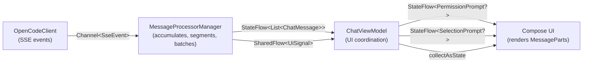
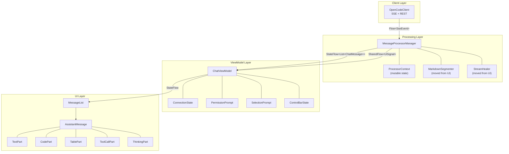
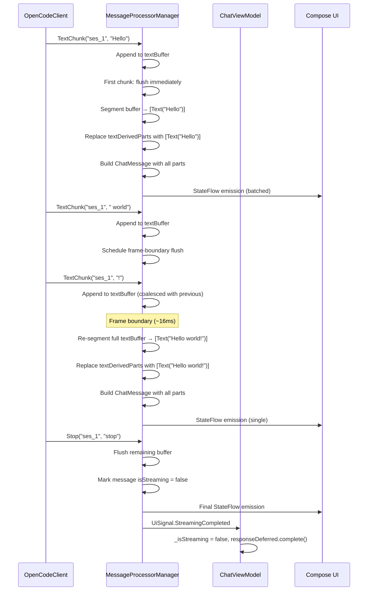
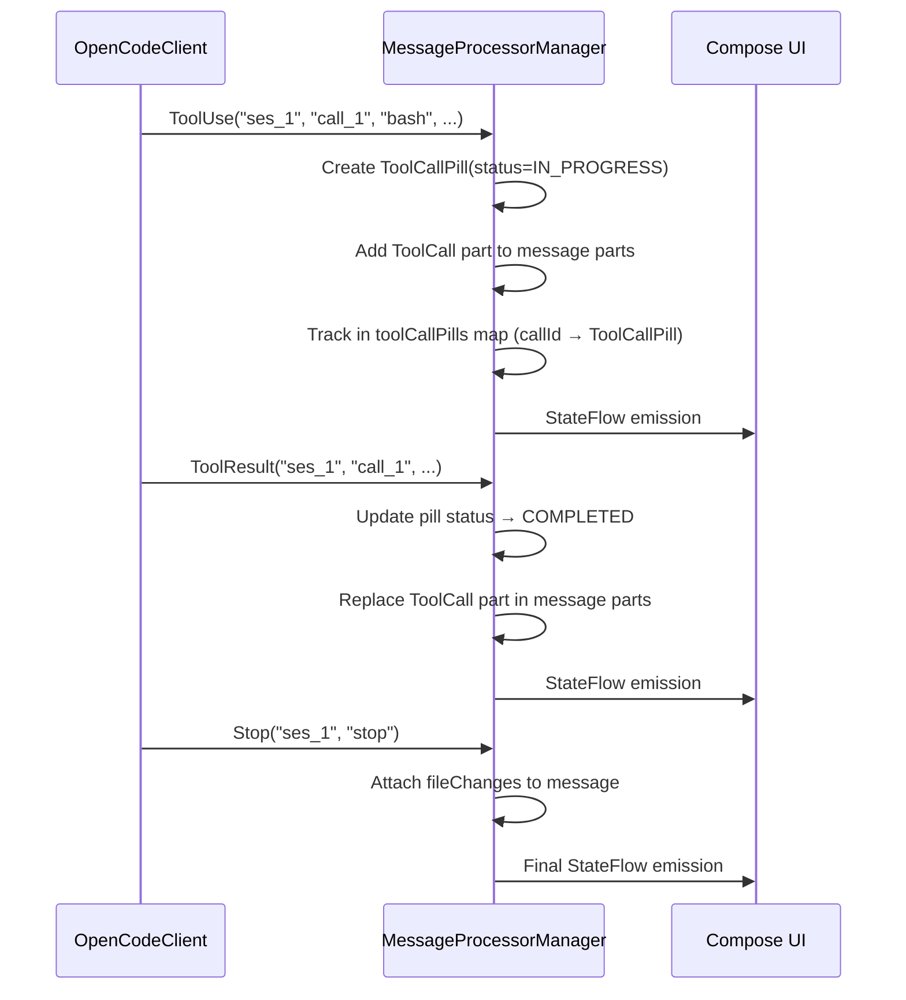
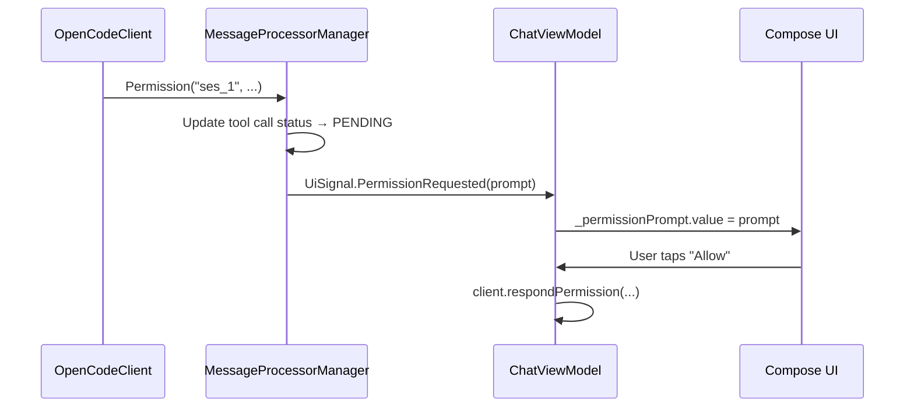

# Technical Design Document: MessageProcessorManagerManager

> **Status:** Draft
> **Author(s):** —
> **Reviewer(s):** —
> **Last Updated:** 2026-06-05
> **Related docs:** [AGENTS.md](../../../AGENTS.md)

---

## 1. TL;DR

We are extracting message assembly logic from the 1586-line `ChatViewModel` god object into a dedicated `MessageProcessorManagerManager` class. The processor will own all mutable streaming state (text accumulation, tool call tracking, markdown segmentation) and emit display-ready `List<ChatMessage>` where each message contains typed `MessagePart` objects instead of raw markdown strings. The ViewModel shrinks to UI coordination only. The UI no longer parses markdown — it receives pre-segmented parts and renders each with a dedicated composable.

---

## 2. Context & Scope

### 2.1 Current State

`ChatViewModel` is a god object that handles everything:

- SSE event dispatch (170-line `handleSseEvent` `when` block)
- Text accumulation (`appendTextToMessage`, `replaceTextInMessage`)
- Thinking content accumulation (`appendThinkingContent`, `replaceThinkingInMessage`)
- Tool call state tracking (`toolCallIndex`, `addToolCallPill`, `updateToolCallStatus`)
- File change tracking (`pendingFileChanges` map)
- Streaming lifecycle (`activeAssistantMessageId`, `markStreamingComplete`, `responseDeferred`)
- Permission/selection prompt state (`_permissionPrompt`, `_selectionPrompt`)
- Message list + FIFO eviction (`_messages`, `messageIndex`, `addMessage`)
- UI state (connection, control bar, sidebar)
- User actions (send, cancel, respond to prompts)
- SSE subscription management
- Session switching and initialization
- Command history
- Context indicator computation

Every `TextChunk` SSE event triggers `_messages.value = list.copy()` — a full list copy + StateFlow emission + Compose recomposition. Fast-streaming models can emit dozens of chunks per second, each causing a full recomposition pass that re-parses markdown via `MarkdownSegmenter`, re-runs `StreamHealer`, and re-renders the entire message list.

The UI (`MessageList.kt`, `AssistantMessage`) receives `ChatMessage` with a raw `content: String` field containing markdown, and must parse it on every recomposition via `MarkdownSegmenter.segmentHealed()` (streaming) or `MarkdownSegmenter.segment()` (complete). This means:

1. Markdown parsing runs on every frame during streaming
2. The UI knows about markdown semantics (code fences, tables, healing)
3. Adding a new content type requires modifying both the ViewModel (accumulation logic) and the UI (rendering logic)

### 2.2 Problem Statement

The ViewModel conflates three concerns that should be separate: **message assembly** (accumulating streaming chunks into display-ready content), **UI coordination** (managing connection state, prompts, user actions), and **rendering logic** (deciding how to display each piece of content). This makes the ViewModel hard to test, hard to modify, and causes excessive recompositions during streaming.

---

## 3. Goals & Non-Goals

### Goals

1. **Extract message assembly into `MessageProcessorManager`** — all SSE event handling that mutates message content moves out of the ViewModel.
2. **Introduce `MessagePart` sealed interface** — `ChatMessage.content: String` is replaced by `ChatMessage.parts: List<MessagePart>`, where each part is a typed data structure (`Text`, `Code`, `Table`, `ToolCall`, `Thinking`, `FileChange`, `Error`, `SubagentRef`).
3. **Batch StateFlow emissions** — at most one `_messages.value = ...` per frame (~16ms) during streaming, instead of one per SSE chunk.
4. **Remove markdown parsing from the UI** — `MarkdownSegmenter` and `StreamHealer` move into the processor. The UI receives pre-segmented parts and renders each with a dedicated composable.
5. **Reduce ViewModel to UI coordination only** — connection state, prompts, user actions, session management.
6. **Make message assembly independently testable** — unit tests for the processor that don't need Compose, SSE, or IntelliJ platform.

### Non-Goals

- **Replacing Jewel's `Markdown` composable for text rendering** — `MessagePart.Text` will temporarily contain a markdown string rendered by Jewel. A future phase can replace this with structured `TextBlock` composables, but that is out of scope.
- **Changing the SSE wire format or server API** — we consume what `opencode serve` emits. No server changes.
- **Changing the `OpenCodeClient` SSE parsing layer** — `SseEvent` types and `parseSseEvent()` remain as-is. The processor consumes `SseEvent` objects.
- **Adding new message part types beyond what currently exists** — no new content types. The refactor maps existing content (text, code, tables, tool calls, thinking, file changes, errors, subagent refs) to `MessagePart` variants.
- **Changing the `ToolPill`, `ThinkingPill`, `FileChangesList`, or `ChatFencedCodeBlock` composables** — they receive the same data, just from `MessagePart` instead of `ChatMessage` fields.

---

## 4. Proposed Solution

**The `MessageProcessorManager` is the markdown boundary.** It receives raw SSE events via an internal `Channel<SseEvent>`, accumulates text in a `StringBuilder`, segments markdown into typed `MessagePart` objects, and emits display-ready `List<ChatMessage>` to a single `StateFlow`. Nothing crosses this boundary as a markdown string — the UI only sees `MessagePart` variants.

**Thread safety model:** The SSE collection coroutine runs on Ktor's I/O dispatcher (NOT `Dispatchers.EDT`). The processor uses an internal `Channel<SseEvent>(Channel.UNLIMITED)` as a thread-safe event queue. The SSE coroutine calls `eventChannel.trySend(event)` (never blocks). A separate EDT-based coroutine consumes events from this channel and calls `processEvent(event)` — all `ProcessorContext` mutation and `flushToMessages()` happen on EDT. This guarantees single-threaded access to mutable state without requiring the SSE coroutine to be on EDT.

The processor batches emissions to at most one per frame. During streaming, it maintains a mutable `ProcessorContext` (text buffer, tool call map, file changes) and flushes to the `StateFlow` on frame boundaries. On `Stop`, it flushes immediately and marks the message complete.

The ViewModel observes the processor's `messages` StateFlow and `signals` SharedFlow, and handles only UI coordination: connection state, permission/selection prompts, user actions, session lifecycle.



### 4.1 Architecture Diagram



### 4.2 Component & Module Design

**4.2.1 Key Modules**

| Module | Responsibility | Key Exports | Dependencies |
|--------|---------------|-------------|-------------|
| `chat/processor/MessageProcessorManager.kt` | SSE event → message assembly, batching, markdown segmentation | `MessageProcessorManager` class, `messages` StateFlow, `signals` SharedFlow | `SseEvent`, `MarkdownSegmenter`, `StreamHealer`, `ChatMessage`, `MessagePart`, `Channel<SseEvent>` |
| `chat/model/MessagePart.kt` | Typed message part definitions | `MessagePart` sealed interface and variants | `ToolCallPill`, `ChatFileChange`, `SubagentRef` |
| `chat/processor/ProcessorContext.kt` | Mutable accumulation state for a single streaming turn | `ProcessorContext` class (not data class) | `MessagePart`, `ToolCallPill` |
| `chat/viewmodel/ChatViewModel.kt` | UI coordination only — connection, prompts, user actions, session lifecycle | `ChatViewModel` class, all UI StateFlows | `MessageProcessorManager`, `OpenCodeClient` |
| `chat/ui/compose/MessageList.kt` | Renders `List<ChatMessage>` by dispatching on `MessagePart` type | `MessageList`, `AssistantMessage` composables | `MessagePart`, Jewel `Markdown` |

**4.2.2 Events & Signals**

| Signal | Type | Producer | Consumers | Payload | Trigger |
|--------|------|----------|-----------|---------|---------|
| `UiSignal.StreamingStarted` | `SharedFlow` (fire-and-forget) | MessageProcessorManager | ChatViewModel | `messageId: String` | First `TextChunk` or `ThinkingChunk` received |
| `UiSignal.StreamingCompleted` | `SharedFlow` (fire-and-forget) | MessageProcessorManager | ChatViewModel | `messageId: String, fileChanges: List<ChatFileChange>` | `SseEvent.Stop` processed, or `completeStreaming()`/`abortStreaming()` called. **Guarded:** emitted at most once per turn via `streamingCompletedEmitted` flag — prevents double-emission when `completeStreaming()` is called after `Stop`. |
| `UiSignal.Error` | `SharedFlow` (fire-and-forget) | MessageProcessorManager | ChatViewModel | `messageId: String, message: String` | `SseEvent.Error` processed |
| `UiSignal.FileChanged` | `SharedFlow` (fire-and-forget) | MessageProcessorManager | ChatViewModel | `Unit` | File path extracted from `ToolKind.EDIT` input |
| `UiSignal.TodoUpdated` | `SharedFlow` (fire-and-forget) | MessageProcessorManager | ChatViewModel | `todos: List<TodoItem>` | `SseEvent.TodoUpdated` received |
| `UiSignal.SessionCreated` | `SharedFlow` (fire-and-forget) | MessageProcessorManager | ChatViewModel | `sessionId: String` | `SseEvent.SessionCreated` received |
| `UiSignal.PermissionRequested` | `SharedFlow` (fire-and-forget) | MessageProcessorManager | ChatViewModel | `PermissionPrompt` | `SseEvent.Permission` processed |
| `UiSignal.SelectionRequested` | `SharedFlow` (fire-and-forget) | MessageProcessorManager | ChatViewModel | `SelectionPrompt` | `SseEvent.QuestionAsked` processed |
| `PermissionPrompt` | `StateFlow` (stateful, guaranteed delivery) | ChatViewModel (set by signal handler) | Compose UI | `PermissionPrompt?` | ViewModel receives `UiSignal.PermissionRequested` |
| `SelectionPrompt` | `StateFlow` (stateful, guaranteed delivery) | ChatViewModel (set by signal handler) | Compose UI | `SelectionPrompt?` | ViewModel receives `UiSignal.SelectionRequested` |

**Why StateFlow for prompts:** `SharedFlow` does not re-emit to late subscribers. If a `PermissionRequested` signal fires before the Compose UI subscribes, the prompt is lost. `StateFlow` always has a current value, guaranteeing delivery. The processor emits `UiSignal.PermissionRequested` via `SharedFlow` as a notification; the ViewModel then sets `_permissionPrompt.value = prompt` (its own `MutableStateFlow<PermissionPrompt?>`), which the Compose UI collects. This two-step approach keeps the processor pure (no UI state) while guaranteeing prompt delivery via StateFlow.

**4.2.3 State Management**

| Component | State Held | Lifetime | Persistence |
|-----------|-----------|----------|-------------|
| `ProcessorContext` | `textBuffer`, `thinkingBuffer`, `toolCallPills`, `toolCallIndex`, `pendingFileChanges`, `firstTextChunkReceived`, `userEchoStripped`, `streamingStartedEmitted`, `streamingCompletedEmitted`, `activeMessageId`, `lastUserText`, `errorMessage`, `isStreaming`, `modelID`, `providerID` | Duration of one streaming turn (cleared on `Stop` or session switch) | In-memory only |
| `MessageProcessorManager` | `_messages` StateFlow, `messageIndex` map, `activeMessageId` | Duration of the session (cleared on session switch) | In-memory only |
| `ChatViewModel` | `_connectionState`, `_permissionPrompt`, `_selectionPrompt`, `_controlState`, `_isStreaming`, `_sessionListState`, etc. | Duration of the plugin session | Some persisted via `OpenCodeSettingsState` |

### 4.3 API / Interface Design

**`MessageProcessorManager` public API:**

```kotlin
class MessageProcessorManager(private val scope: CoroutineScope) {

    /** Display-ready messages. Updated at most once per frame during streaming. */
    val messages: StateFlow<List<ChatMessage>>

    /** Signals for UI coordination (streaming lifecycle, prompts, file changes). */
    val signals: SharedFlow<UiSignal>

    /** Enqueue an SSE event for processing. Thread-safe — called from SSE coroutine (any thread).
     *  Events are buffered in an internal Channel<SseEvent> and processed on EDT. */
    fun process(event: SseEvent)

    /** Create a placeholder assistant message for a new turn.
     *  Adds the message to _messages, sets ctx.activeMessageId, stores modelID/providerID.
     *  MUST be called before the first SSE event arrives (i.e., before process() is called).
     *  Returns the message ID. */
    fun createAssistantMessage(modelID: String?, providerID: String?): String

    /** Mark the current streaming turn as complete. Flushes remaining buffer.
     *  Verifies messageId == ctx.activeMessageId; no-op if mismatch.
     *  Callers observe the StateFlow for the final message — no return value needed. */
    fun completeStreaming(messageId: String)

    /** Abort in-flight streaming due to SSE stream drop or session switch.
     *  Appends MessagePart.Error, marks streaming complete, completes responseDeferred.
     *  Equivalent of ChatViewModel.abortInFlightResponse(). */
    fun abortStreaming(reason: String)

    /** Reset all state for a session switch. Cancels any pending flush. */
    fun resetSessionState()

    /** Add a message directly (for loading history from REST API). */
    fun addMessage(message: ChatMessage)

    /** Inject subagent references into an existing message.
     *  Removes existing Subagent parts, adds new ones, emits StateFlow. */
    fun injectSubagentRefs(messageId: String, refs: List<SubagentRef>)

    /** Update tool call status (for permission responses that change pill state). */
    fun updateToolCallStatus(toolCallId: String, status: ToolCallStatus, output: List<JsonObject>? = null)

    /** Set the last user message text for echo stripping.
     *  MUST be called before process() begins (i.e., in sendMessage() before SSE events arrive). */
    fun setLastUserText(text: String?)

    /** Cancel all coroutines. Call on plugin disposal to prevent leaks. */
    fun close()
}
```

**`UiSignal` sealed interface:**

```kotlin
sealed interface UiSignal {
    data class StreamingStarted(val messageId: String) : UiSignal
    data class StreamingCompleted(val messageId: String, val fileChanges: List<ChatFileChange>) : UiSignal
    data class PermissionRequested(val prompt: PermissionPrompt) : UiSignal
    data class SelectionRequested(val prompt: SelectionPrompt) : UiSignal
    data class Error(val messageId: String, val message: String) : UiSignal
}
```

**Note on signal delivery:** `PermissionRequested` and `SelectionRequested` are emitted via `SharedFlow<UiSignal>` as notifications from the processor. The ViewModel receives these and sets its own `MutableStateFlow<PermissionPrompt?>` / `MutableStateFlow<SelectionPrompt?>`, which the Compose UI collects. This ensures guaranteed delivery via StateFlow while keeping the processor stateless with respect to UI prompts. The ViewModel's `_permissionPrompt` and `_selectionPrompt` StateFlows are the source of truth for the UI — the SharedFlow signal is just the trigger to set them.

### 4.4 Key Flows

**4.4.1 Streaming Text (Happy Path)**



**4.4.2 Tool Call Lifecycle**



**4.4.3 Permission Prompt**



### 4.5 Technology Stack

| Layer | Technology | Notes |
|-------|-----------|-------|
| Language | Kotlin | Existing codebase |
| UI Framework | Jetbrains Compose for Desktop (Jewel) | Existing — no change |
| Markdown Rendering | Jewel `Markdown` composable | Used for `MessagePart.Text` rendering only |
| Markdown Segmentation | `MarkdownSegmenter` (moved from UI to processor) | Existing logic, relocated |
| Stream Healing | `StreamHealer` (moved from UI to processor) | Existing logic, relocated |
| Coroutines | Kotlinx Coroutines | `MutableStateFlow`, `SharedFlow`, `Channel` |

### 4.6 Implementation Blueprint

#### 4.6.1 Data Models & Schemas

```kotlin
// ── MessagePart.kt ──────────────────────────────────────────────

package com.opencode.acp.chat.model

import com.agentclientprotocol.model.ToolCallStatus
import com.agentclientprotocol.model.ToolKind
import kotlinx.serialization.json.JsonObject

/**
 * A typed, display-ready segment of message content.
 * The MessageProcessorManager decides what each part is — the UI just renders it.
 */
sealed interface MessagePart {
    /** Markdown text content. Rendered via Jewel's Markdown composable.
     *  The processor has already segmented and healed this text.
     *  A future phase may replace the markdown string with structured TextBlocks. */
    data class Text(val content: String) : MessagePart

    /** Fenced code block. Language identifier and source code. */
    data class Code(val language: String, val content: String) : MessagePart

    /** Markdown table. Raw markdown is preserved for rendering; parsed fields available for direct rendering. */
    data class Table(
        val rawMarkdown: String,
        val headers: List<String>,
        val rows: List<List<String>>,
        val alignments: List<ParsedTable.ColumnAlignment>
    ) : MessagePart

    /** Tool call pill. Uses ToolCallPill (a UI-presentable data class) directly
     *  for simplicity in this phase. A future refactor may introduce a domain-level
     *  ToolCallData class and decouple the processor from UI types. */
    data class ToolCall(val pill: ToolCallPill) : MessagePart

    /** Thinking/reasoning content. Always rendered before text content. */
    data class Thinking(val content: String) : MessagePart

    /** File change from a tool call. */
    data class FileChange(val change: ChatFileChange) : MessagePart

    /** Error message appended to a response. */
    data class Error(val message: String) : MessagePart

    /** Reference to a subagent/child session. */
    data class Subagent(val ref: com.opencode.acp.chat.model.SubagentRef) : MessagePart
}

// ColumnAlignment is defined in ParsedTable.ColumnAlignment (MarkdownSegmenter.kt).
// MessagePart.Table.alignments reuses this existing type — no duplicate enum.

// ── Updated ChatMessage ──────────────────────────────────────────

data class ChatMessage(
    val id: String,
    val role: MessageRole,
    val parts: List<MessagePart>,       // ← replaces content, toolCalls, thinkingContent, fileChanges, subagentRefs
    val timestamp: Long,
    val isStreaming: Boolean = false,
    // Attached files from user message (unchanged)
    val attachedFiles: List<AttachedFile> = emptyList(),
    // Model/token info (unchanged)
    val modelID: String? = null,
    val providerID: String? = null,
    val inputTokens: Long = 0,
    val outputTokens: Long = 0,
    val reasoningTokens: Long = 0,
    val cacheReadTokens: Long = 0,
    val cacheWriteTokens: Long = 0,
    val cost: Double = 0.0,
)
```

**Rendering order:** `AssistantMessage` renders parts in a fixed order regardless of their position in the list: `Thinking` parts first, then `ToolCall` parts, then `Text`/`Code`/`Table` parts (in list order), then `FileChange` parts, then `Subagent` parts, then `Error` parts. This preserves the current UI layout where thinking and tool calls appear above text content.

**History loading:** When loading messages from the REST API (`GET /session/:id`), the `toChatMessage()` converter must run `MarkdownSegmenter.segment()` on the content string to produce `List<MessagePart>`. This is a hard requirement — without it, history renders as blank messages.

**`TextReplace` handling:** When a `TextReplace` event arrives (full accumulated text, not a delta), the processor must discard all text-derived parts (`Text`, `Code`, `Table`) from the current message, replace the text buffer with the new text, and re-segment. Non-text parts (`ToolCall`, `Thinking`, `FileChange`, `Subagent`, `Error`) are preserved. This requires tracking which parts are text-derived vs. non-text-derived.

#### 4.6.2 Class & Interface Definitions

```kotlin
// ── ProcessorContext.kt ──────────────────────────────────────────

package com.opencode.acp.chat.processor

/**
 * Mutable accumulation state for a single streaming turn.
 * Owned by MessageProcessorManager. NOT a data class — mutable fields must not be
 * shared via copy(). Use resetTurnState() for per-turn cleanup, reset() for full session reset.
 *
 *  Thread safety: all mutation happens on Dispatchers.EDT via the internal
 *  event processing coroutine. The SSE coroutine never touches ProcessorContext
 *  directly — it sends events to eventChannel, which is consumed on EDT.
 */
class ProcessorContext {
    /** Accumulates raw text from TextChunk events before segmentation. */
    val textBuffer: StringBuilder = StringBuilder()
    /** Accumulates thinking/reasoning text. Plain text, NOT markdown — StreamHealer is NOT applied. */
    val thinkingBuffer: StringBuilder = StringBuilder()
    /** Tool call pills keyed by callId. LinkedHashMap preserves insertion order for rendering. */
    val toolCallPills: LinkedHashMap<String, ToolCallPill> = linkedMapOf()
    /** Maps toolCallId → messageId for cross-message tool result/permission routing.
     *  Needed because ToolResult/Permission events reference toolCallId, not messageId.
     *  Preserved across turns (not cleared by resetTurnState) — only cleared on session switch. */
    val toolCallIndex: MutableMap<String, String> = mutableMapOf()
    /** File changes collected from tool calls for the current active message. */
    val pendingFileChanges: MutableList<ChatFileChange> = mutableListOf()
    /** Whether the first non-empty text chunk has been received.
     *  Only flipped when text.isNotBlank() — empty chunks are ignored. */
    var firstTextChunkReceived: Boolean = false
    /** Whether user echo text has been stripped from the response. */
    var userEchoStripped: Boolean = false
    /** Whether UiSignal.StreamingStarted has been emitted for this turn.
     *  Prevents double-emission when the first chunks arrive. */
    var streamingStartedEmitted: Boolean = false
    /** Whether UiSignal.StreamingCompleted has been emitted for this turn.
     *  Prevents double-emission when completeStreaming() is called after Stop. */
    var streamingCompletedEmitted: Boolean = false
    /** The ID of the currently-streaming assistant message. */
    var activeMessageId: String? = null
    /** The last user message text, for echo stripping.
     *  Set by setLastUserText() before process() begins.
     *  Preserved across turns (not cleared by resetTurnState) — only cleared on session switch. */
    var lastUserText: String? = null
    /** Error message collected during this streaming turn, if any. */
    var errorMessage: String? = null
    /** Whether the message is currently streaming. */
    var isStreaming: Boolean = false
    /** Model ID for the current streaming turn. */
    var modelID: String? = null
    /** Provider ID for the current streaming turn. */
    var providerID: String? = null

    /** Reset turn-specific state for a new streaming turn.
     *  Preserves [toolCallIndex] (needed for cross-message tool result/permission routing)
     *  and [lastUserText] (set separately via setLastUserText).
     *  Called at the start of createAssistantMessage(). */
    fun resetTurnState() {
        textBuffer.clear()
        thinkingBuffer.clear()
        toolCallPills.clear()
        pendingFileChanges.clear()
        firstTextChunkReceived = false
        userEchoStripped = false
        streamingStartedEmitted = false
        streamingCompletedEmitted = false
        activeMessageId = null
        errorMessage = null
        isStreaming = false
        modelID = null
        providerID = null
    }

    /** Reset ALL state including toolCallIndex and lastUserText.
     *  Called on session switch (full reset). */
    fun reset() {
        resetTurnState()
        toolCallIndex.clear()
        lastUserText = null
    }
}
```

**Key design decisions:**

1. **`ProcessorContext` is a regular class, not a data class.** This prevents accidental `copy()` usage that would share mutable state. The `reset()` method clears every field explicitly, preventing cross-turn state leakage.

2. **`toolCallPills` uses `callId → ToolCallPill` instead of `callId → Int` (position index).** Position indices become stale when text-derived parts are replaced on each flush. Using the pill object directly avoids this entirely.

3. **Thread safety via `Channel<SseEvent>` event queue.** The SSE collection coroutine runs on Ktor's I/O dispatcher, NOT `Dispatchers.EDT`. The processor uses an internal `Channel<SseEvent>(Channel.UNLIMITED)` as a thread-safe event queue. The SSE coroutine calls `eventChannel.trySend(event)` (never blocks). A separate EDT-based coroutine consumes events and calls `processEvent()` — all `ProcessorContext` mutation happens on EDT. This guarantees single-threaded access to mutable state without requiring the SSE coroutine to be on EDT.

4. **Batching uses `Channel.CONFLATED` instead of `delay(16)`.** A conflated channel coalesces multiple send signals into one receive, ensuring at most one flush per processing cycle. The flush coroutine collects from this channel on `Dispatchers.EDT` (IntelliJ's main thread dispatcher, not `Dispatchers.Main`), aligning with Compose's frame cycle. This avoids the `withFrameNanos` dependency (which requires a Compose coroutine context) and the drift problems of `delay(16)`.

4. **`flushToMessages()` re-segments the full `textBuffer` on every flush.** This replaces all text-derived parts (`Text`, `Code`, `Table`) with fresh segments. Non-text parts (`ToolCall`, `Thinking`, `FileChange`, `Subagent`, `Error`) are preserved from the previous message state. This avoids the duplicate-segment bug that would occur if segments were appended incrementally.

5. **`TextReplace` events clear the text buffer and re-segment.** All text-derived parts are discarded and rebuilt from the replacement text. Non-text parts are preserved.

7. **`setLastUserText()` calling sequence.** The ViewModel calls `setLastUserText(text)` in `sendMessage()` BEFORE calling `process()` with the first SSE event. This ensures `ctx.lastUserText` is set before any `TextChunk` arrives. If `resetSessionState()` is called between `setLastUserText()` and the first `TextChunk`, `lastUserText` is cleared — this is correct because the new session shouldn't echo-strip from the old session's user text.

```kotlin
// ── UiSignal.kt ──────────────────────────────────────────────────

package com.opencode.acp.chat.processor

sealed interface UiSignal {
    data class StreamingStarted(val messageId: String) : UiSignal
    data class StreamingCompleted(val messageId: String, val fileChanges: List<ChatFileChange>) : UiSignal
    data class PermissionRequested(val prompt: PermissionPrompt) : UiSignal
    data class SelectionRequested(val prompt: SelectionPrompt) : UiSignal
    data class FileChanged(val unit: Unit = Unit) : UiSignal
    data class TodoUpdated(val todos: List<TodoItem>) : UiSignal
    data class SessionCreated(val sessionId: String) : UiSignal
    data class Error(val messageId: String, val message: String) : UiSignal
}
```

#### 4.6.3 Function Signatures

**`MessageProcessorManager.process(event: SseEvent)`**

Pseudocode:
```
1. If event is TodoUpdated, QuestionAsked, SessionCreated, UserMessage:
   - TodoUpdated: emit UiSignal.TodoUpdated(todos) — ViewModel sets _todoItems
   - QuestionAsked: emit UiSignal.SelectionRequested
   - SessionCreated: emit UiSignal.SessionCreated — ViewModel handles loadSessions
   - UserMessage: no-op (informational only, not added to messages)
   - Return
2. If event is Plan or MessageComplete:
   - Plan: no-op (the server sends plan events for future use; no UI action needed)
   - MessageComplete: no-op (the Stop event handles streaming completion)
   - Return
3. If ctx.activeMessageId == null: drop event, return
4. Switch on event type:
   - TextChunk:
     a. If !ctx.firstTextChunkReceived AND text.isNotBlank():
        - Set ctx.firstTextChunkReceived = true
        - If ctx.lastUserText != null and text.startsWith(ctx.lastUserText, ignoreCase = true):
          - Strip echo: text = text.substring(ctx.lastUserText.length)
          - Set ctx.userEchoStripped = true
     b. Append text to ctx.textBuffer
     c. Send to flushChannel
   - TextReplace:
     a. Clear ctx.textBuffer, set to replacement text
     b. Reset ctx.userEchoStripped = false (replacement text includes echo; re-evaluate)
     c. If ctx.lastUserText != null and text.startsWith(ctx.lastUserText, ignoreCase = true):
        - Strip echo: ctx.textBuffer.delete(0, ctx.lastUserText.length)
        - Set ctx.userEchoStripped = true
     d. Send to flushChannel
   - ThinkingChunk: append to ctx.thinkingBuffer (plain text, no healing), send to flushChannel
   - ThinkingReplace: clear ctx.thinkingBuffer, set new text, send to flushChannel
   - ToolUse:
     a. Dedup: if event.callId in ctx.toolCallPills, return (skip duplicate from input.started + called pair)
     b. Create ToolCallPill(callId=event.callId, name=event.toolName, kind=ToolMapper.toAcpKind(event.toolName), status=IN_PROGRESS, input=event.input)
     c. Add to ctx.toolCallPills[event.callId] = pill
     d. Add to ctx.toolCallIndex[event.callId] = ctx.activeMessageId
     e. If event.toolKind == ToolKind.EDIT and event.input contains file paths:
        - Extract filePath from event.input (see extractFilePath() logic)
        - Add ChatFileChange(filePath, ...) to ctx.pendingFileChanges
        - emit UiSignal.FileChanged (triggers review panel refresh)
     f. Emit StateFlow
   - ToolResult:
     a. Look up pill in ctx.toolCallPills[event.callId]
     b. If not found: log warning, return
     c. Update pill status → COMPLETED/FAILED based on event.state
     d. Set pill.output = event.content (tool JSON output)
     e. Emit StateFlow
   - Permission:
     a. Look up pill in ctx.toolCallPills[event.callId] (or ctx.toolCallIndex for cross-message)
     b. Update pill status → PENDING
     c. emit UiSignal.PermissionRequested(prompt)
        ViewModel starts permissionTimeoutJob (auto-dismiss after timeout)
   - Stop:
     a. Flush remaining buffer (isStreaming still true → StreamHealer runs)
     b. Set ctx.isStreaming = false
     c. Mark message complete
     d. emit UiSignal.StreamingCompleted(ctx.activeMessageId, ctx.pendingFileChanges.toList())
        ViewModel completes responseDeferred, calls computeSessionContext(), fetchTodos(), loadSessions()
   - Error:
     a. Set ctx.errorMessage = event.message
     b. Set ctx.isStreaming = false
     c. Flush (to emit final message with Error part)
     d. emit UiSignal.Error(ctx.activeMessageId, event.message)
        ViewModel completes responseDeferred
```

**`MessageProcessorManager.flushToMessages()`**

Pseudocode:
```
1. If textBuffer is not empty:
   a. If message is streaming: apply StreamHealer.heal() to textBuffer
      (Note: StreamHealer is applied BEFORE checking isStreaming=false, so the final
       flush after Stop still heals. The Stop handler sets isStreaming=false AFTER the flush.)
   b. Segment textBuffer via MarkdownSegmenter.segment() (or segmentHealed() during streaming)
   c. Map segments to MessagePart variants: TEXT→Text, CODE→Code, TABLE→Table
   d. Store result as newTextDerivedParts
   e. Else (textBuffer empty): newTextDerivedParts = emptyList()
2. If thinkingBuffer is not empty:
   a. Create thinkingPart = MessagePart.Thinking(thinkingBuffer.toString())
      (Note: thinking/reasoning is plain text, NOT markdown. StreamHealer is NOT applied
       to thinkingBuffer — it would corrupt reasoning tokens by injecting spurious
       close-backticks or bold markers.)
   b. Else: thinkingPart = null
3. Assemble the complete parts list in rendering-independent order:
   a. parts = emptyList
   b. If thinkingPart != null: parts += thinkingPart
   c. For each pill in ctx.toolCallPills.values (in insertion order — LinkedHashMap guarantees this):
      parts += MessagePart.ToolCall(pill)
   d. parts += newTextDerivedParts  (Text/Code/Table in segment order)
   e. For each change in ctx.pendingFileChanges: parts += MessagePart.FileChange(change)
   f. For each ref in ctx.subagentRefs: parts += MessagePart.Subagent(ref)
   g. If ctx.errorMessage != null: parts += MessagePart.Error(ctx.errorMessage)
4. Build updated ChatMessage with ALL fields:
   ChatMessage(
     id = ctx.activeMessageId,
     role = MessageRole.ASSISTANT,
     parts = parts,
     timestamp = existingMessage.timestamp,  // preserve from placeholder
     isStreaming = ctx.isStreaming,
     attachedFiles = existingMessage.attachedFiles,  // preserve (empty for assistant)
     modelID = existingMessage.modelID,  // preserve from createAssistantMessage()
     providerID = existingMessage.providerID,  // preserve from createAssistantMessage()
     inputTokens = existingMessage.inputTokens,  // preserve (updated on Stop)
     outputTokens = existingMessage.outputTokens,  // preserve (updated on Stop)
     reasoningTokens = existingMessage.reasoningTokens,
     cacheReadTokens = existingMessage.cacheReadTokens,
     cacheWriteTokens = existingMessage.cacheWriteTokens,
     cost = existingMessage.cost,
   )
5. Update _messages[messageIndex[id]] = updatedMessage
6. (StateFlow emission triggers Compose recomposition)
```

**Important:** The `parts` list order is a storage detail, not a rendering directive. `AssistantMessage` applies a **fixed rendering order** regardless of list position:
1. All `Thinking` parts (thinking indicator)
2. All `ToolCall` parts (tool pills)
3. All `Text`, `Code`, `Table` parts (in their segment order within the list)
4. All `FileChange` parts (file change cards)
5. All `Subagent` parts (subagent links)
6. All `Error` parts (error messages)

**This is a deliberate design change from the current code.** The current `AssistantMessage` renders: ToolCall → Thinking → FileChange → Subagent → Text. The new order moves Thinking above ToolCall and Text above FileChange, which is a more logical reading order (thinking first, then actions, then results, then text output). **This should be gated behind a feature flag** (`MessageProcessorManager.useNewRenderingOrder`) so it can be toggled back to the old order if user testing reveals regressions. The flag controls which `when` branch `AssistantMessage` uses for part ordering.

Tool calls render in a fixed group above text content. They do **not** interleave with text at their arrival position — there is no mechanism to track a tool call's position relative to surrounding text because `toolCallPills` is a map keyed by `callId`, not a position-indexed structure. This matches current behavior where all tool pills appear above text.

**`MessageProcessorManager.scheduleFlush()`**

Pseudocode:
```
1. If first chunk (not yet flushed): flush immediately for responsiveness
2. Otherwise: send Unit to flushChannel (conflated — coalesces multiple signals)
3. The flush coroutine (running on Dispatchers.EDT) collects from flushChannel
   and calls flushToMessages() on each receive
```

#### 4.6.4 Component Mapping

| Component | Responsibility | Data Model(s) | Key Class(es) |
|-----------|---------------|---------------|---------------|
| `MessageProcessorManager` | SSE event → message assembly, batching, segmentation | `ProcessorContext`, `MessagePart`, `ChatMessage` | `MessageProcessorManager.process()`, `MessageProcessorManager.flushToMessages()` |
| `ChatViewModel` | UI coordination, connection, prompts, user actions | `ConnectionState`, `PermissionPrompt`, `SelectionPrompt`, `ControlBarState` | `ChatViewModel.sendMessage()`, `ChatViewModel.respondPermission()` |
| `MessageList` | Render message list | `ChatMessage` | `MessageList()`, `MessageItem()` |
| `AssistantMessage` | Dispatch on `MessagePart` type (fixed rendering order) | `MessagePart` | `AssistantMessage()` |
| `MarkdownSegmenter` | Segment raw markdown into TEXT/CODE/TABLE | `MarkdownSegment` | `MarkdownSegmenter.segment()`, `MarkdownSegmenter.segmentHealed()` |
| `StreamHealer` | Heal incomplete markdown during streaming | — | `StreamHealer.heal()` |

#### 4.6.5 Enums, Constants & Configuration

```kotlin
object ProcessorConstants {
    /** Maximum number of messages retained in the list before FIFO eviction.
     *  References ChatConstants.MAX_MESSAGE_HISTORY to avoid duplication. */
    const val MAX_MESSAGE_HISTORY = ChatConstants.MAX_MESSAGE_HISTORY  // 500

    /** Channel buffer capacity for flush coalescing. CONFLATED means only the latest signal is kept. */
    // Using Channel.CONFLATED instead of a numeric capacity.
}

// ColumnAlignment for Table parts — reuse existing ParsedTable.ColumnAlignment
// from MarkdownSegmenter.kt instead of defining a duplicate enum.
// MessagePart.Table.alignments uses the existing type.
```

#### 4.6.6 Error Types & Exception Contracts

The processor uses Kotlin's standard exception model. Errors are represented as `MessagePart.Error` in the message parts list, not as thrown exceptions. This ensures the UI always has something to display.

| Error Scenario | Handling | User-Facing Impact |
|---------------|----------|-------------------|
| SSE stream drops | `ChatViewModel.triggerReconnect()` handles reconnection; processor appends `MessagePart.Error` | "Connection lost" error message in chat |
| Unknown SSE event type | Dropped silently (logged via `debugLog`). Future server event types should be added to the `when` block, not silently dropped forever. | No visible impact — but log entries will indicate unhandled events |
| Markdown segmentation failure | Fallback: treat entire buffer as `MessagePart.Text` | Content renders as plain text instead of rich markdown |
| Tool call with unknown `callId` in `ToolResult` | Lookup in `toolCallPills`; if not found, skip update and log | Tool pill stays in IN_PROGRESS state |
| `TextReplace` after partial `TextChunk` accumulation | Clear text buffer, discard all text-derived parts, re-segment from replacement text | Correct — full-state replacement is the intended behavior |

---

## 5. Assumptions & Dependencies

**Assumptions:**
- The OpenCode server continues to emit V1 BusEvents with the current wire format. V2 SyncEvent support is retained but not the primary path.
- Jewel's `Markdown` composable remains available for rendering `MessagePart.Text` content. A future phase may replace it with custom composables.
- `MarkdownSegmenter` and `StreamHealer` logic is correct and does not need behavioral changes during the refactor — only relocation.
- The processor uses `Dispatchers.EDT` (from `com.intellij.openapi.application.EDT`, NOT `kotlinx.coroutines.Dispatchers.Main`) for all ProcessorContext mutation and flush operations. The SSE collection coroutine runs on Ktor's I/O dispatcher and sends events to the processor via `Channel<SseEvent>`. This ensures thread safety for `ProcessorContext` access and proper batching.

**Dependencies:**
- Kotlin Coroutines (`StateFlow`, `SharedFlow`, `Channel`)
- Jewel Markdown library (for `MessagePart.Text` rendering)
- Existing `MarkdownSegmenter` and `StreamHealer` (relocated, not rewritten)
- Existing `SseEvent` types (unchanged)
- Existing `ParsedTable.ColumnAlignment` (reused, not duplicated)

---

## 6. Risks & Mitigations

| Risk | Likelihood | Impact | Mitigation |
|------|-----------|--------|-----------|
| **Incremental segmentation produces duplicate parts** | High if unaddressed | Critical | `flushToMessages()` re-segments the full `textBuffer` on every flush and **replaces** all text-derived parts, not appends. Non-text parts (`ToolCall`, `Thinking`, etc.) are preserved from the previous state. |
| **`TextReplace` events invalidate prior segmentation** | High if unaddressed | Critical | On `TextReplace`, the processor clears the text buffer, discards all text-derived parts, and re-segments from the replacement text. Non-text parts are preserved. |
| **`toolCallPills` indexed by position becomes stale** | High if unaddressed | Critical | `toolCallPills` uses `callId → ToolCallPill` (not `callId → Int` position). Pills are looked up by ID and updated in-place, avoiding index invalidation. |
| **Thread safety between SSE coroutine and flush coroutine** | High if unaddressed | Critical | The SSE collection coroutine runs on Ktor's I/O dispatcher. The processor uses an internal `Channel<SseEvent>(Channel.UNLIMITED)` as a thread-safe event queue. The SSE coroutine calls `eventChannel.trySend(event)`. A separate EDT-based coroutine consumes events and calls `processEvent()` — all `ProcessorContext` mutation happens on EDT. No cross-thread access to mutable state. |
| **`Channel.CONFLATED` batching drops flush signals** | Low | Low | Conflated channels keep only the latest signal. If multiple `TextChunk` events arrive between flushes, only one flush runs — which is exactly the desired batching behavior. |
| **`SharedFlow` can lose `StreamingStarted` signal** | Medium | Medium | `StreamingStarted` is informational (the ViewModel also sets `_isStreaming = true` directly). If lost, the ViewModel still knows streaming started from the StateFlow update. For `PermissionRequested` and `SelectionRequested`, the processor emits via `SharedFlow<UiSignal>`, and the ViewModel immediately sets its own `MutableStateFlow<PermissionPrompt?>` or `MutableStateFlow<SelectionPrompt?>`. The StateFlow guarantees delivery to the UI even if the SharedFlow signal was missed. |
| **`MessagePart.Thinking` rendering order** | Medium | Medium | `AssistantMessage` renders `Thinking` parts before text content (fixed order), matching current behavior. The flat `parts` list does not determine rendering order. |
| **History loading produces blank messages** | High if unaddressed | Critical | `toChatMessage()` must run `MarkdownSegmenter.segment()` on history content to produce `List<MessagePart>`. This is a hard requirement, not an open question. |
| **`responseDeferred` correlation with `StreamingCompleted`** | Medium | High | `StreamingCompleted` includes `messageId`. The ViewModel matches it to the outstanding `CompletableDeferred` by message ID. |
| **`ProcessorContext.reset()` misses a field** | Medium | High | `ProcessorContext` is a regular class (not data class) with an explicit `reset()` method that clears every field. Missing a field causes cross-turn state leakage. The `reset()` method must be tested thoroughly. |
| **Jewel `Markdown` behaves differently with pre-segmented text** | Medium | Medium | `MessagePart.Text` contains a markdown string that may be a fragment (e.g., a single paragraph). Jewel should handle this, but we need to test edge cases like lists that span multiple `Text` parts. |
| **Tool call deduplication** | Medium | Medium | The server sends both `session.next.tool.input.started` and `session.next.tool.called` for the same tool call. The processor deduplicates by `callId` — if the `callId` already exists in `toolCallPills`, the event is skipped. |
| **`flushJob` not cancelled on session reset** | Medium | High | `resetSessionState()` cancels `flushJob`, drains the `flushChannel` of any stale signal, and restarts the flush coroutine. This prevents stale flushes from overwriting the new session's messages. |
| **`Channel.CONFLATED` stale signal after session reset** | Medium | High | After cancelling `flushJob` in `resetSessionState()`, the conflated channel may still contain a pending signal from the previous session. `resetSessionState()` drains the channel by calling `flushChannel.tryReceive()` in a loop before restarting the flush coroutine. |
| **Rendering order change: Thinking moves above ToolCall** | Low | Medium | The new rendering order (Thinking → ToolCall → Text → FileChange → Subagent → Error) differs from the current order (ToolCall → Thinking → FileChange → Subagent → Text). This is an intentional improvement — thinking should appear before the actions it informed. The `AssistantMessage` composable enforces this order regardless of `parts` list position. |
| **`completeStreaming()` returns `ChatMessage?` redundantly** | Low | Low | Changed to return `Unit`. Callers observe the StateFlow for the final message. The return value was an artifact of the old design where the ViewModel needed direct access to the message object. |
| **`MarkdownSegmenter.parseTable()` called twice per table** | Medium | Low | During streaming, `parseTable()` runs once in the processor (to produce `MessagePart.Table` with headers/rows/alignments). `ChatTable` composable may call it again if it renders from `rawMarkdown`. If profiling shows this is costly, `ChatTable` can be updated to use the pre-parsed fields instead of re-parsing `rawMarkdown`. |

---

## 7. Cross-Cutting Concerns

### 7.1 Performance

The primary performance win is **batching StateFlow emissions**. Currently, every `TextChunk` causes a full `_messages.value = list.copy()` + Compose recomposition. With conflated-channel batching, we emit at most once per main-thread processing cycle, reducing recompositions by 10-100x during streaming.

The `MarkdownSegmenter` currently runs on every recomposition in `AssistantMessage`. After the refactor, it runs once in the processor during `flushToMessages()`. The UI receives pre-segmented `MessagePart` objects and skips segmentation entirely.

**Re-segmentation cost:** `flushToMessages()` re-segments the full `textBuffer` on every flush. For a 10,000-token response, this means segmenting ~40KB of text ~60 times per second. `MarkdownSegmenter` is a linear-time state machine — O(n) where n is buffer length. Total cost is O(n × flushes/sec). For typical streaming speeds (20-60 chunks/sec, ~16ms flush interval), this is acceptable. **For very long responses (100K+ tokens, ~400KB),** the final flushes re-segment the entire buffer on the EDT. If profiling shows frame drops during long streaming responses, an incremental segmentation strategy (tracking the last-segmented offset and only segmenting new text) can be added as a future optimization.

### 7.2 Testing

The `MessageProcessorManager` is independently unit-testable. Tests can:
1. Create a `MessageProcessorManager` with `TestScope`
2. Call `process(SseEvent.TextChunk(...))` directly
3. Assert on `messages.value` (the StateFlow)
4. Assert on `signals` (the SharedFlow)
5. Verify batching by advancing the test dispatcher

No Compose, no IntelliJ platform, no SSE connection needed.

**Critical test scenarios beyond the basic list:**
- `TextReplace` after partial `TextChunk` accumulation: verify text-derived parts are replaced, non-text parts preserved
- `ToolUse` deduplication: two events with same `callId`, only one pill created
- Concurrent `process()` and `resetSessionState()`: verify no stale data leaks
- `flushToMessages()` after `resetSessionState()`: verify empty context, no crash
- `completeStreaming()` without prior `createAssistantMessage()`: verify graceful no-op
- History loading via `addMessage()`: verify `MarkdownSegmenter` produces correct parts
- `MessagePart.Thinking` arrives before text: verify rendering order (thinking first)
- `SseEvent.Stop` after `SseEvent.Error`: verify streaming completes correctly

### 7.3 Backward Compatibility

`ChatMessage` changes from `content: String` to `parts: List<MessagePart>`. This is a **breaking contract change** — every call site that reads `content` must be updated. The migration is done in a single phase (no dual-field period) to avoid the complexity and performance cost of maintaining both fields.

Call sites that need the raw markdown text (e.g., for copying to clipboard) can compute it from parts:
```kotlin
/** Reconstruct full markdown including code blocks and tables.
 *  Used for clipboard copy and context display. O(n) but only called on demand. */
val ChatMessage.fullMarkdownContent: String
    get() = parts.joinToString("\n\n") { part ->
        when (part) {
            is MessagePart.Text -> part.content
            is MessagePart.Code -> "```${part.language}\n${part.content}\n```"
            is MessagePart.Table -> part.rawMarkdown
            is MessagePart.Thinking -> part.content
            is MessagePart.Error -> "**Error:** ${part.message}"
            else -> "" // ToolCall, FileChange, Subagent don't have markdown representation
        }
    }.trim()
```

This is an O(n) computation but is only needed for specific features (clipboard copy, context display), not on every recomposition. **Note:** `computeSessionContext()` does NOT use message content — it reads token fields and message counts. The `fullMarkdownContent` extension is only needed for clipboard copy.

### 7.4 Migration Inventory: `content: String` → `parts: List<MessagePart>`

Removing `ChatMessage.content: String` and related fields (`toolCalls`, `thinkingContent`, `fileChanges`, `subagentRefs`) requires updating every call site. Key consumers:

| Call Site | Current Usage | Migration |
|-----------|--------------|-----------|
| `MessageList.kt:158,220,300` | Reads `message.content` to pass to `MarkdownSegmenter.segment()` | Read `message.parts` directly; no segmentation needed |
| `MessageList.kt:158` (UserMessage) | Reads `message.content` for user message text | Read `message.parts.filterIsInstance<MessagePart.Text>().firstOrNull()?.content` |
| `ChatViewModel.computeSessionContext()` | Reads token fields and message counts (NOT `message.content`) | No change needed — `computeSessionContext()` doesn't read `content` |
| `ChatViewModel.appendTextToMessage()` | Appends text to `content` field | Replaced by `ProcessorContext.textBuffer.append()` |
| `ChatViewModel.replaceTextInMessage()` | Replaces `content` field | Replaced by `ProcessorContext.textBuffer` clear+set |
| `ChatViewModel.toChatMessage()` | Builds `ChatMessage` from REST API data | Must segment `content` → `parts` via `MarkdownSegmenter.segment()`, map `tool_use` → `ToolCall`, map `thinking`/`reasoning` → `Thinking`, map `errorSuffix` → `Error`, handle `fileNote` (`📎 filename`) as `Text` part |
| `ChatViewModel.sendMessage()` | Creates user `ChatMessage` with `content = text` | Creates user `ChatMessage` with `parts = listOf(MessagePart.Text(text))` |
| `ChatViewModel.abortInFlightResponse()` | Appends error to active message, completes deferred | Call `processor.abortStreaming(reason)` |
| `AssistantMessage` composable | Reads `content`, `toolCalls`, `thinkingContent`, `fileChanges`, `subagentRefs` separately | Dispatch on `parts` by type using fixed rendering order |
| `ChatFencedCodeBlock` | Receives code string from segmented content | Receives `MessagePart.Code` directly |
| `ChatTable` | Receives raw markdown from segmented content | Receives `MessagePart.Table` directly (use pre-parsed fields, not `rawMarkdown`) |
| `ToolPill` | Receives `ToolCallPill` from `toolCalls` list | Receives `MessagePart.ToolCall.pill` |
| `ThinkingPill` | Receives `thinkingContent: String` | Receives `MessagePart.Thinking.content` |
| `FileChangesList` | Receives `fileChanges: List<ChatFileChange>` | Receives `MessagePart.FileChange.change` |
| `ReviewPanel.kt`, `SessionSidebar.kt` | Collects `_fileChangeSignal` for immediate refresh | Collects `UiSignal.FileChanged` from processor signals |
| `SelectionPrompt` | Unchanged (not part of message) | No change |

### 7.5 History Loading: `OpenCodePart` → `MessagePart` Mapping

When loading messages from the REST API (`GET /session/:id`), the `toChatMessage()` converter must map each `OpenCodePart` to the corresponding `MessagePart`. The REST API returns parts within each message with the following types:

| `OpenCodePart` Type | Fields | `MessagePart` Mapping |
|---------------------|--------|----------------------|
| `text` | `content: String` | Run `MarkdownSegmenter.segment(content)` → produces `Text`, `Code`, `Table` parts |
| `tool_use` | `id`, `name`, `input`, `state`, `output` | `MessagePart.ToolCall(ToolCallPill(...))` with status mapped from server state |
| `thinking` | `content: String` | `MessagePart.Thinking(content)` |
| `reasoning` | `content: String` | `MessagePart.Thinking(content)` (alias for thinking) |

Text content must be segmented (not wrapped in a single `MessagePart.Text`), otherwise code blocks and tables in history render as plain text.

### 7.6 User Message Construction

When the user sends a message (`ChatViewModel.sendMessage()`), the new `ChatMessage` is constructed with `parts: List<MessagePart>` instead of `content: String`. User messages are always plain text (no code blocks or tool calls), so the construction is:

```kotlin
ChatMessage(
    id = generateId(),
    role = MessageRole.USER,
    parts = listOf(MessagePart.Text(text)),
    timestamp = System.currentTimeMillis(),
    attachedFiles = attachedFiles,
)
```

User input text is NOT passed through `MarkdownSegmenter` — it's always a single `MessagePart.Text`. Code blocks typed by the user are sent as raw text to the server and appear in the user message as a single `Text` part.

---

## 8. Testing Strategy

### 8.1 Testing Levels

| Level | What's Tested | Tools |
|-------|--------------|-------|
| Unit | `MessageProcessorManager` event handling, batching, segmentation, state management | JUnit, `TestScope`, `Turbine` (for SharedFlow testing) |
| Integration | `MessageProcessorManager` + `ChatViewModel` wiring, SSE event flow | JUnit, `TestScope` |
| UI | `AssistantMessage` rendering of each `MessagePart` type | Compose UI tests |
| Manual | Streaming UX, tool calls, permissions, errors, session switching | Manual QA in sandbox IDE |

### 8.2 Key Scenarios

| Scenario | What to Test | Expected Outcome |
|----------|-------------|-----------------|
| Streaming text accumulation | Send multiple `TextChunk` events, verify batching | `messages.value` updates at most once per flush cycle, text is accumulated correctly |
| `TextReplace` after `TextChunk` | Send `TextChunk` events then `TextReplace` | Text-derived parts are replaced, non-text parts preserved |
| Code block segmentation | Send text containing `` ```kotlin\nfun main() {}\n``` `` | `MessagePart.Code("kotlin", "fun main() {}")` appears in parts |
| Table segmentation | Send text containing a markdown table | `MessagePart.Table(...)` appears with correct headers, rows, alignments |
| Stream healing | Send `TextChunk` with unclosed backticks during streaming | Healed text produces valid `MessagePart.Text` or `MessagePart.Code` |
| User echo stripping | Send `TextChunk` that starts with the user's message text | Echo text is stripped from the first chunk |
| Tool call lifecycle | Send `ToolUse` → `ToolResult` events | `MessagePart.ToolCall` transitions from IN_PROGRESS to COMPLETED |
| Tool call deduplication | Send two `ToolUse` events with same `callId` | Only one `ToolCallPill` created |
| Stop event | Send `Stop` after streaming text | `isStreaming = false`, `UiSignal.StreamingCompleted` emitted |
| Session reset | Call `resetSessionState()` mid-stream | All buffers cleared, `messages` reset to empty, `flushJob` cancelled |
| FIFO eviction | Add >500 messages | Oldest messages evicted, `messageIndex` rebuilt correctly |
| Error event | Send `SseEvent.Error` | `MessagePart.Error` appended, streaming marked complete |
| History loading | Call `addMessage()` with REST API message | `MarkdownSegmenter` produces correct `List<MessagePart>` |
| Rendering order | Message with Thinking + ToolCall + Text parts | Thinking renders first, then tool calls, then text content |
| `flushJob` cancellation | Call `resetSessionState()` while flush is pending | No stale data overwrites new session's messages |
| `Channel.CONFLATED` stale signal | Call `resetSessionState()` then start new session | Stale signal from previous session is drained; no phantom flush |
| `completeStreaming()` | Call after `Stop` event | `isStreaming = false`, StateFlow emits final message, `UiSignal.StreamingCompleted` emitted |
| `ThinkingBuffer` healing | Send `ThinkingChunk` with unclosed bold during streaming | Thinking is plain text — no healing applied, renders as-is |
| `TextReplace` echo strip | Send `TextChunk` (echo stripped), then `TextReplace` with echo text | Echo text is re-evaluated and stripped from replacement text |
| `abortStreaming()` | Call `abortStreaming("Stream dropped")` mid-stream | Error part appended, streaming marked complete, `UiSignal.Error` emitted |
| `close()` | Call `close()` after plugin disposal | All coroutines cancelled, eventChannel closed, no leaks |
| `createAssistantMessage()` | Call before first SSE event | Message added to `_messages`, `ctx.activeMessageId` set, modelID/providerID stored |
| `toolCallIndex` routing | Send `ToolResult` with callId from prior message | Pill found via `toolCallIndex`, status updated correctly |
| File path extraction | Send `ToolUse` with `ToolKind.EDIT` and file paths | `pendingFileChanges` populated, `UiSignal.FileChanged` emitted |
| `completeStreaming()` wrong ID | Call with mismatched messageId | No-op, no crash |
| Permission timeout | Receive `Permission` event | `UiSignal.PermissionRequested` emitted, ViewModel starts timeout job |

---

## 9. Open Questions

> All questions have been resolved. This section is retained for reference only.

1. **`MessagePart.Text` content:** ~~Should `Text` parts contain the raw markdown string (rendered by Jewel) or structured `TextBlock` objects (rendered by custom composables)?~~ **Resolved:** Start with markdown strings. Evaluate custom composables in a future phase.

2. **`TodoUpdated` and `SessionCreated` events:** ~~Should they stay in the ViewModel or move to the processor?~~ **Resolved (updated in third review):** The processor handles these SSE events and emits `UiSignal.TodoUpdated` / `UiSignal.SessionCreated`. The ViewModel consumes the signals and updates its own state (`_todoItems`, `loadSessions()`). This keeps the processor as the single SSE event boundary — all events enter via `process()`, non-message events are passed through as signals. The ViewModel remains the owner of UI state (it sets `_todoItems.value`, calls `loadSessions()`), but the processor owns event reception. Note: `fetchTodos()` (REST) also writes to `_todoItems` — this dual-path is acceptable since REST is a fallback for init/session-switch, while SSE is the live update path.

3. **`responseDeferred` correlation:** ~~The ViewModel uses `CompletableDeferred<Unit>` to suspend `sendMessage()` until the `Stop` event. After the refactor, the processor emits `UiSignal.StreamingCompleted(messageId)`. The ViewModel must match this to the outstanding deferred by message ID.~~ **Resolved:** The ViewModel uses a single `CompletableDeferred<Unit>?` (since only one streaming turn is active at a time). When `UiSignal.StreamingCompleted(messageId)` arrives, the ViewModel completes the deferred. No map is needed — the single deferred is sufficient.

4. **Signal delivery guarantees:** ~~`SharedFlow` does not re-emit to late subscribers. For stateful signals like `PermissionRequested` and `SelectionRequested`, use `StateFlow` (which always has a current value) instead of `SharedFlow`.~~ **Resolved:** The processor emits `UiSignal.PermissionRequested` and `UiSignal.SelectionRequested` via `SharedFlow` as notifications. The ViewModel receives these and sets its own `MutableStateFlow<PermissionPrompt?>` / `MutableStateFlow<SelectionPrompt?>`, which the Compose UI collects. This two-step approach keeps the processor stateless while guaranteeing delivery via StateFlow.

---

## 10. Document History

| Date | Author | Changes |
|------|--------|---------|
| 2026-06-05 | — | Initial draft |
| 2026-06-05 | — | Adversarial review synthesis: fixed incremental segmentation (replace not append), fixed toolCallPills (map not index), fixed TextReplace handling, fixed thread safety (Dispatchers.Main), fixed batching (Channel.CONFLATED), fixed ProcessorContext (class not data class, explicit reset), fixed rendering order (fixed not list-order), added history loading as hard requirement, added tool call deduplication, added responseDeferred correlation, added critical test scenarios, removed phased rollout (single implementation), removed alternatives section |
| 2026-06-05 | — | Second adversarial review synthesis: (1) Specified flushToMessages() assembly algorithm explicitly (step-by-step: segment buffer, build parts list in fixed order, not position-based insertion), (2) Removed misleading "insert ToolCall at correct positions" — tool calls render in a fixed group above text, not interleaved, (3) Acknowledged rendering order change as deliberate: Thinking→ToolCall→Text (was ToolCall→Thinking→Text), (4) Split signal delivery: SharedFlow for fire-and-forget events, StateFlow for prompts in ViewModel, (5) Clarified ToolUse dedup: processor deduplicates by callId, skips known callIds, (6) Added echo stripping to process() pseudocode with firstTextChunkReceived and userEchoStripped flags, (7) Removed duplicate ColumnAlignment enum — uses ParsedTable.ColumnAlignment, (8) Noted ToolCallPill layer violation as acceptable debt, (9) Added StreamHealer for thinkingBuffer during streaming, (10) TextReplace re-evaluates echo stripping (resets userEchoStripped=false), (11) Added call-site inventory for content→parts migration, (12) Defined OpenCodePart→MessagePart mapping for history loading, (13) Changed completeStreaming() return type to Unit, (14) Specified flushJob lifecycle (init block launches coroutine on Dispatchers.EDT), (15) Changed pendingFileChanges to MutableList (not map), (16) Added explicit no-op handlers for Plan and MessageComplete, (17) Fixed Channel.CONFLATED stale signal after resetSessionState() (drain channel), (18) Changed Dispatchers.Main→Dispatchers.EDT throughout, (19) Noted user message construction wraps text in MessagePart.Text, (20) Added subagentRefs, errorMessage, isStreaming to ProcessorContext |
| 2026-06-05 | — | Resolved all open questions: (1) MessagePart.Text uses raw markdown strings (Jewel renders them), (2) TodoUpdated and SessionCreated stay in ViewModel, (3) responseDeferred keyed by message ID completed on StreamingCompleted, (4) SharedFlow for signals, StateFlow for prompts in ViewModel (resolved earlier) |
| 2026-06-05 | — | Third adversarial review synthesis + rename to MessageProcessorManager: (1) Fixed thread safety: added Channel<SseEvent> event queue between SSE coroutine (Ktor I/O) and EDT-based processor — all ProcessorContext mutation now happens on EDT via event processing coroutine, (2) Resolved TodoUpdated ownership: processor emits UiSignal.TodoUpdated, ViewModel sets _todoItems, (3) Added ToolUse dedup check to pseudocode: skip if callId already in toolCallPills, (4) Added file path extraction to ToolUse handler: extractFilePath() for ToolKind.EDIT, populate pendingFileChanges, emit UiSignal.FileChanged, (5) Added toolCallIndex (toolCallId→messageId) to ProcessorContext for cross-message tool result/permission routing, (6) Fixed markdownContent extension: renamed to fullMarkdownContent, includes Code/Table/Thinking/Error parts, (7) Added ignoreCase=true to echo stripping, added text.isNotBlank() guard for firstTextChunkReceived, (8) Removed StreamHealer from thinkingBuffer — reasoning is plain text, not markdown, (9) Added close() method to cancel coroutines on plugin disposal, (10) Added abortStreaming(reason) method — equivalent of abortInFlightResponse(), (11) Specified createAssistantMessage() behavior: adds to _messages, sets ctx.activeMessageId, stores modelID/providerID, (12) Fixed final flush healing: Stop handler sets isStreaming=false AFTER flush, not before, (13) Added ToolMapper.toAcpKind() to ToolUse handler for correct tool kind/icon, (14) Added StreamingCompleted handler details: ViewModel calls computeSessionContext(), fetchTodos(), loadSessions(), (15) Added permissionTimeoutJob preservation note, (16) Specified Dispatchers.EDT import: com.intellij.openapi.application.EDT, not Dispatchers.Main, (17) Deduplicated MAX_MESSAGE_HISTORY: references ChatConstants, (18) Fixed injectSubagentRefs: removes existing Subagent parts, adds new ones, emits StateFlow, (19) Added completeStreaming() messageId verification, (20) Specified MessagePart.Error format: plain text (not markdown), UI renders "Error:" prefix, (21) Expanded flushToMessages() step 4 with all ChatMessage fields, (22) Documented setLastUserText() calling sequence: must be called before process() begins, (23) Added rendering order feature flag: MessageProcessorManager.useNewRenderingOrder, (24) Added UiSignal.FileChanged, UiSignal.TodoUpdated, UiSignal.SessionCreated to signals, (25) Fixed responseDeferred: single CompletableDeferred (not keyed by message ID), (26) Fixed migration inventory: removed fabricated computeSessionContext entry, added UserMessage composable, added abortInFlightResponse, fixed ChatScreen→ChatViewModel.sendMessage(), (27) Added abortStreaming() method for SSE stream drop handling, (28) Fixed resetSessionState(): simplified channel drain, restarts both event processing and flush coroutines, (29) Added permission handler note: ViewModel starts permissionTimeoutJob on PermissionRequested signal, (30) Added ToolResult.output propagation: pill.output = event.content |


---

## 11. Amendmant: Message Part Type Coverage

> Extracted to dedicated TDD: [part-type-coverage.md](part-type-coverage.md)

This section covers all 12 OpenCode message part types, the reasoning routing bug, patch implementation, subtask interaction model, and visual component specifications.
