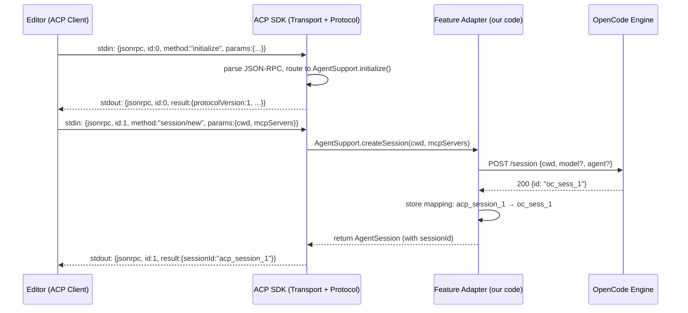
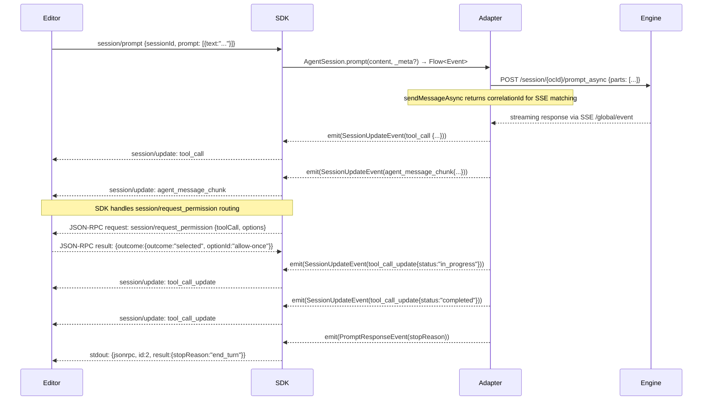
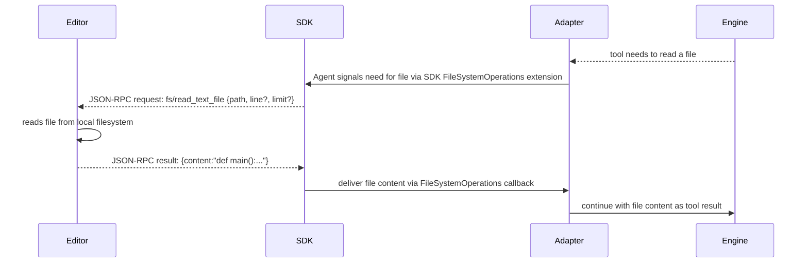
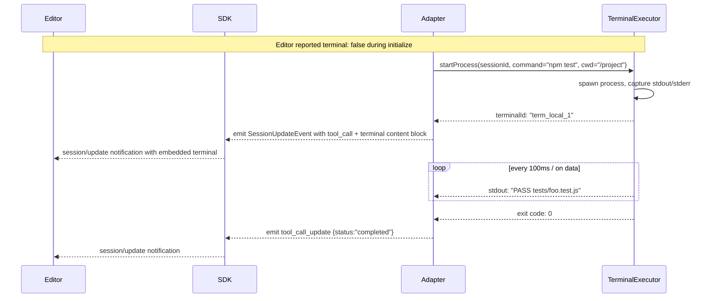

# Technical Design Document: OpenCode ACP Server

> **Status:** Draft
> **Last Updated:** 2026-06-01
> **Related docs:**
> - [ACP Protocol v1](https://agentclientprotocol.com/protocol/v1/overview)
> - [ACP Kotlin SDK](https://github.com/agentclientprotocol/kotlin-sdk)
> - [ACP Kotlin SDK README](https://github.com/agentclientprotocol/kotlin-sdk/blob/master/README.md)
> - [OpenCode Server API](https://opencode.ai/docs/server/)

---

## 1. TL;DR

Build a standalone ACP server that exposes every OpenCode feature through the Agent Client Protocol v1. The server uses the official **`com.agentclientprotocol:acp`** Kotlin SDK for all ACP transport, protocol, and type definitions. Our code is limited to a **Feature Adapter Layer** that maps ACP semantics to OpenCode engine operations via its HTTP REST API and SSE event stream. This eliminates ~60% of the code compared to building from scratch, diverting effort instead to the hardest part: the SSE→ACP event translation, session lifecycle bridging, and permission mapping.

---

## 2. Context & Scope

### 2.1 Current State

OpenCode currently supports ACP as a **client** via `opencode acp`, which starts an ACP subprocess that editors (Zed, JetBrains, Neovim) connect to. However, this built-in ACP mode does not expose the full feature set available through the OpenCode TUI or HTTP server:

- Custom tool definitions from `.opencode/tools/`
- Slash commands
- The full agent system (subagents, mode switching)
- Permissions/policy system
- LSP integration
- Comprehensive session management (fork, revert, share, summarize)
- MCP server management

The `opencode serve` HTTP server provides all these features through its REST API, but editors cannot natively consume REST APIs — they speak ACP (JSON-RPC over stdio).

### 2.2 Problem Statement

OpenCode users who want to use it through ACP-compatible editors cannot access the full set of OpenCode features. An ACP server that comprehensively wraps OpenCode's capabilities would:

1. Give users full OpenCode functionality from any ACP-compatible editor
2. Allow editors to leverage OpenCode's built-in tools, custom tools, MCP servers, agents, and commands
3. Provide a clean, protocol-standard interface that editors already support
4. Enable the IntelliJ IDEA plugin to delegate to OpenCode via ACP instead of building redundant integrations

---

## 3. Goals & Non-Goals

### Goals

- Implement an ACP v1 **Agent** using the `com.agentclientprotocol:acp` SDK that supports all baseline and optional ACP methods
- Support ACP v1 **content types**: text, image, audio, resource, resource_link, tool calls, tool call updates, terminal embedding
- Implement ACP v1 **Client callbacks**: `session/request_permission`, `fs/read_text_file`, `fs/write_text_file`, `terminal/*` methods
- Expose every OpenCode built-in tool as an ACP tool, mapped to standard ACP tool kinds (read, edit, execute, search, etc.)
- Support OpenCode custom tools (from `.opencode/tools/`) as dynamic ACP tools
- Support MCP server configuration passed through ACP session setup
- Implement agent plan reporting via ACP `session/update` with `plan` notifications
- Support session mode switching via ACP `session/set_mode` and `config_options_update` notifications
- Enable OpenCode permissions/policy system through ACP `session/request_permission`
- Expose slash commands via ACP `available_commands_update` notifications
- Implement full session lifecycle: create, load, resume, close, list
- Achieve <500ms P99 for initialization, <100ms for non-model ACP method calls (excluding OpenCode HTTP round-trips)
- Support dual-transport mode: stdio for editor subprocess, and an embedded transport for IntelliJ plugin integration
- Expose OpenCode fork/share/summarize/revert/unrevert operations as custom `_`-prefixed ACP methods

### Non-Goals

- ACP v2 support (pre-v2 protocol only; v2 will be addressed in a follow-up)
- Built-in TUI — the server runs headless; the connecting editor provides the UI
- Replacing `opencode acp` — this server coexists as an alternative bridge
- Direct LLM provider integration — delegates to OpenCode's engine for all model interactions
- Real-time collaboration features
- WebSocket transport for ACP — initial implementation uses stdio + embedded transport only
- Building the ACP protocol stack from scratch — all protocol types, transport, and method routing come from the SDK

---

## 4. Proposed Solution

A layered ACP server built on the `com.agentclientprotocol:acp` Kotlin SDK. The server implements the `AgentSupport` and `AgentSession` SDK interfaces to bridge ACP method calls to OpenCode's HTTP REST API. The SDK handles all JSON-RPC framing, transport I/O, message correlation, protocol version negotiation, capability advertisement, and spec-compliant type serialization — our code translates ACP semantics to OpenCode engine operations.

Tools are not separately advertised via ACP — they are defined in OpenCode's configuration and injected into the LLM's tool definitions at the model level. The server's role is to relay tool call requests (from the LLM via OpenCode) back to the editor as ACP `tool_call` notifications, and relay permission requests through ACP `session/request_permission`.

### 4.1 Architecture Diagram

```
┌─────────────────────────────────────────────────────────────────────┐
│                        ACP Client (Editor)                          │
│  Zed / JetBrains / Neovim / VS Code                                 │
│  ┌──────────────────────────────────────────────────────────────┐   │
│  │  JSON-RPC 2.0 over stdio (or embedded IPC for IntelliJ)      │   │
│  └──────────────────────────────────────────────────────────────┘   │
└──────────────────────────┬──────────────────────────────────────────┘
                           │ ACP (JSON-RPC over configurable transport)
                           ▼
┌─────────────────────────────────────────────────────────────────────┐
│                      com.agentclientprotocol:acp SDK                 │
│                                                                     │
│  ┌─────────────────────┐  ┌──────────────────┐                     │
│  │  Transport Layer    │  │  Protocol Layer   │                     │
│  │  - StdioTransport   │  │  - Message        │                     │
│  │  - (Custom impl)    │──│    correlation    │                     │
│  │  - Backpressure     │  │  - JSON-RPC 2.0   │                     │
│  │  - Message framing  │  │    framing        │                     │
│  └─────────────────────┘  │  - Capability     │                     │
│                           │    negotiation    │                     │
│                           │  - Auth handling   │                     │
│                           │  - session/request │                     │
│                           │    _permission     │                     │
│                           │    routing         │                     │
│                           └────────┬─────────┘                     │
│                                    │ AgentSupport / AgentSession    │
└────────────────────────────────────┼────────────────────────────────┘
                                     │
┌────────────────────────────────────┼────────────────────────────────┐
│  ┌─────────────────────────────────┴─────────────────────────────┐  │
│  │                Feature Adapter Layer (our code)                │  │
│  │                                                                │  │
│  │  ┌──────────────┐  ┌──────────────┐  ┌──────────────────────┐ │  │
│  │  │ OpenCodeClient│  │ ContentMapper│  │ PermissionBridge     │ │  │
│  │  │ (HTTP to      │  │ (ACP↔OpenCode│  │ (OpenCode perm→ACP   │ │  │
│  │  │  OpenCode)    │  │  part conv)  │  │  permission options) │ │  │
│  │  └──────────────┘  └──────────────┘  └──────────────────────┘ │  │
│  │  ┌──────────────┐  ┌──────────────┐  ┌──────────────────────┐ │  │
│  │  │ SessionID    │  │ ToolMapper   │  │ TerminalExecutor     │ │  │
│  │  │ Map          │  │ (OpenCode    │  │ (local process       │ │  │
│  │  │ (ACP↔OpenCode│  │  tool→ACP    │  │  fallback)           │ │  │
│  │  │  session IDs)│  │  tool kind)  │  │                      │ │  │
│  │  └──────────────┘  └──────────────┘  └──────────────────────┘ │  │
│  │  ┌──────────────┐  ┌──────────────┐                           │  │
│  │  │ PlanAdapter  │  │ CommandMapper│                           │  │
│  │  │ (OpenCode    │  │ (OpenCode /  │                           │  │
│  │  │  plan→ACP    │  │  →ACP slash  │                           │  │
│  │  │  plan)       │  │  commands)   │                           │  │
│  │  └──────────────┘  └──────────────┘                           │  │
│  └────────────────────────────────────────────────────────────────┘  │
└────────────────────────────────────┬─────────────────────────────────┘
                                     │ HTTP REST + SSE
                                     ▼
┌─────────────────────────────────────────────────────────────────────┐
│                    OpenCode Engine                                  │
│  ┌──────────┐  ┌──────────┐  ┌──────────┐  ┌────────────────────┐  │
│  │ Session  │  │ Provider │  │ Tool     │  │ MCP Server         │  │
│  │ Manager  │  │ Manager  │  │ Registry │  │ Manager            │  │
│  └──────────┘  └──────────┘  └──────────┘  └────────────────────┘  │
│  ┌──────────┐  ┌──────────┐  ┌──────────┐  ┌────────────────────┐  │
│  │ Config   │  │ File Ops │  │ LSP/Fmt  │  │ Event Bus (SSE)    │  │
│  │ Manager  │  │ Manager  │  │ Manager  │  │                    │  │
│  └──────────┘  └──────────┘  └──────────┘  └────────────────────┘  │
└─────────────────────────────────────────────────────────────────────┘
```

**Component Responsibilities:**

| Component | Responsibility | Source |
|-----------|---------------|--------|
| ACP Transport Layer | JSON-RPC 2.0 framing, stdio I/O, backpressure management, message correlation | SDK (`com.agentclientprotocol:acp`) |
| ACP Protocol Layer | Version negotiation, capability advertisement, method routing, auth, session lifecycle, `session/request_permission` routing | SDK (via `AgentSupport`/`AgentSession` interfaces) |
| ACP Data Models | All ACP types: `ContentBlock`, `SessionUpdate`, `AgentCapabilities`, `PermissionOption`, tool kinds, error codes | SDK (`com.agentclientprotocol:acp-model`) |
| Feature Adapter Layer | Maps ACP semantics to OpenCode engine operations via HTTP REST API | Our code |
| OpenCode Engine | The existing OpenCode HTTP server (`opencode serve`) providing all core functionality | — |

### 4.2 Component & Module Design

```
src/
├── main/kotlin/com/opencode/acp/
│   ├── Main.kt                       # Entry point, CLI arg parsing, wires SDK Agent + our support
│   ├── OpenCodeAgentSupport.kt       # Implements SDK's AgentSupport interface + custom method routing
│   ├── OpenCodeAgentSession.kt       # Implements SDK's AgentSession interface (prompt, cancel, sessionId)
│   ├── SseEvent.kt                   # Sealed interface: OpenCode SSE event type hierarchy
│   ├── adapter/
│   │   ├── OpenCodeClient.kt         # HTTP client for opencode serve REST API (Ktor HttpClient)
│   │   ├── ContentMapper.kt          # ACP ContentBlock ↔ OpenCode Part conversion
│   │   ├── PermissionBridge.kt       # OpenCode perm. system → ACP PermissionOption list
│   │   ├── ToolMapper.kt             # OpenCode tool name → ACP standard tool kind mapping
│   │   ├── PlanAdapter.kt            # OpenCode agent plan → ACP plan notification
│   │   ├── CommandMapper.kt          # OpenCode slash commands → ACP AvailableCommand
│   │   └── TerminalExecutor.kt       # Local process execution for terminal fallback
│   ├── session/
│   │   ├── SessionIdMap.kt           # Thread-safe ACP↔OpenCode session ID mapping
│   │   └── SessionPersistence.kt     # Session serialization for load/resume
│   ├── event/
│   │   └── SseEventListener.kt       # Listens to OpenCode SSE events, feeds AgentSession
│   ├── config/
│   │   ├── ConfigLoader.kt           # Reads opencode.json config
│   │   └── ToolLoader.kt             # Discovers custom tools from .opencode/tools/
│   └── transport/
│       └── EmbeddedTransport.kt      # In-process Transport impl using coroutine channels + kotlinx.io adapters
└── test/kotlin/com/opencode/acp/
    ├── adapter/
    ├── session/
    └── e2e/
```

**Key Modules:**

| Module | Responsibility | Key Classes | Dependencies |
|--------|---------------|-------------|-------------|
| SDK (external) | ACP transport, protocol, and type system — all standard ACP concerns | `Agent`, `AgentSupport`, `AgentSession`, `Protocol`, `StdioTransport`, `ContentBlock`, `SessionUpdate`, `PermissionOption`, `FileSystemOperations` | `com.agentclientprotocol:acp:0.3.0-SNAPSHOT` |
| adapter | OpenCode engine integration via REST API, local terminal execution | `OpenCodeClient`, `ContentMapper`, `PermissionBridge`, `ToolMapper`, `TerminalExecutor` | SDK types, session, event |
| session | ACP↔OpenCode session ID mapping, state management | `SessionIdMap`, `SessionPersistence` | SDK types |
| event | SSE stream consumption, typed event hierarchy | `SseEvent` (sealed interface), `SseEventListener` | adapter, SDK types |
| config | OpenCode config parsing, tool discovery | `ConfigLoader`, `ToolLoader` | — |
| transport | Custom Transport impl for IntelliJ plugin IPC | `EmbeddedTransport` | SDK Transport interface, kotlinx.io |

### 4.3 API / Interface Design

**ACP Agent Methods (implemented by our server via SDK AgentSupport/AgentSession + custom routing):**

| Method | Required/Optional | Description | Route |
|--------|-------------------|-------------|-------|
| `initialize` | Required | Protocol version + capability negotiation | SDK `AgentSupport.initialize()` |
| `authenticate` | Required (if auth configured) | Authenticate via SDK auth model | SDK built-in |
| `session/new` | Required | Create new session with cwd + MCP servers | SDK → `AgentSupport.createSession()` |
| `session/prompt` | Required | Send user prompt, receive streaming response | SDK → `AgentSession.prompt()` |
| `session/load` | Optional | Resume previous session with full history replay | SDK → `AgentSupport.loadSession()` |
| `session/resume` | Optional | Resume session without history replay | SDK built-in (if supported) |
| `session/close` | Optional | Close active session and free resources | SDK built-in |
| `session/list` | Optional | Discover existing sessions | SDK built-in |
| `session/set_mode` | Optional | Switch between agent operating modes | SDK built-in |
| `logout` | Optional | End authenticated state | SDK built-in |
| `session/cancel` | Notification | Cancel ongoing prompt turn | SDK → `AgentSession.cancel()` |
| `_fork` | Custom | Fork OpenCode session at a message | Custom routing via `MethodHandler` fallback |
| `_share` | Custom | Share an OpenCode session | Custom routing via `MethodHandler` fallback |
| `_unshare` | Custom | Unshare an OpenCode session | Custom routing via `MethodHandler` fallback |
| `_summarize` | Custom | Summarize an OpenCode session | Custom routing via `MethodHandler` fallback |
| `_revert` | Custom | Revert a message in a session | Custom routing via `MethodHandler` fallback |
| `_unrevert` | Custom | Restore reverted messages | Custom routing via `MethodHandler` fallback |

> **Custom method routing:** The SDK's `Agent` class may not directly support `_`-prefixed methods. If not, we register a fallback handler via the SDK's `Protocol` layer that intercepts unrecognized methods matching `_*` and routes them to our `OpenCodeAgentSupport`. This mechanism must be verified against the actual SDK's extension API — specifically whether `Protocol` or `Agent` exposes a method dispatch hook for unrecognized methods.

**ACP Client Methods (our server calls these on the editor):**

| Method | Required/Optional | Description |
|--------|-------------------|-------------|
| `session/request_permission` | Required | Request user approval for tool calls |
| `fs/read_text_file` | Optional | Read file from editor's filesystem |
| `fs/write_text_file` | Optional | Write file to editor's filesystem |
| `terminal/create` | Optional | Create a new terminal in the editor |
| `terminal/input` | Optional | Send stdin input to a running terminal process |
| `terminal/output` | Optional | Get terminal output |
| `terminal/release` | Optional | Release a terminal |
| `terminal/wait_for_exit` | Optional | Wait for terminal command to finish |
| `terminal/kill` | Optional | Kill terminal command |

> **Terminal vs local execution:** Two terminal models. When the editor supports ACP terminal methods, the server delegates to the editor (including `terminal/input` for interactive commands). When the editor does not support terminals (no `terminal` capability), the server falls back to local process execution via `TerminalExecutor`, which spawns processes directly and streams output through `tool_call` content with embedded terminal blocks.

**ACP Notifications (our server sends these):**

| Notification | Description |
|-------------|-------------|
| `session/update` with `agent_message_chunk` | Stream text from model |
| `session/update` with `user_message_chunk` | Replay user messages (during session load) |
| `session/update` with `thought` | Stream model reasoning/thoughts |
| `session/update` with `tool_call` | Report tool call |
| `session/update` with `tool_call_update` | Report tool call progress/completion |
| `session/update` with `plan` | Report agent execution plan |
| `session/update` with `available_commands_update` | Advertise available slash commands |
| `session/update` with `config_options_update` | Report configuration options |
| `session/update` with `current_mode_update` | Report agent mode change |
| `session/update` with `session_info_update` | Update session metadata (title, etc.) |

**OpenCode HTTP API Surface (consumed by our server):**

> **Note:** These endpoints are documented based on the OpenCode server's REST API and must be verified against a running `opencode serve` instance. The actual OpenAPI spec is the authoritative source. Path parameters use OpenAPI-style `{param}` notation here; actual implementation uses Ktor-style format.

| Method | Path | Purpose |
|--------|------|---------|
| `GET` | `/global/health` | Check server health |
| `POST` | `/session` | Create new OpenCode session |
| `POST` | `/session/{id}/message` | Send message and wait for response |
| `POST` | `/session/{id}/prompt_async` | Send message asynchronously |
| `GET` | `/session/{id}/message` | List messages in session |
| `GET` | `/session/{id}/message/{msgId}` | Get message details |
| `POST` | `/session/{id}/abort` | Abort running session |
| `POST` | `/session/{id}/fork` | Fork session at a message |
| `DELETE` | `/session/{id}` | Delete session |
| `POST` | `/session/{id}/command` | Execute slash command |
| `POST` | `/session/{id}/shell` | Run shell command |
| `POST` | `/session/{id}/permissions/{permId}` | Respond to permission request |
| `GET` | `/global/event` | SSE event stream (global) |
| `GET` | `/session/{id}/share` | Share session |
| `DELETE` | `/session/{id}/share` | Unshare session |
| `POST` | `/session/{id}/summarize` | Summarize session |
| `POST` | `/session/{id}/revert` | Revert a message |
| `POST` | `/session/{id}/unrevert` | Restore reverted messages |
| `POST` | `/session/{id}/init` | Analyze app and create AGENTS.md |
| `GET` | `/config` | Get config |
| `PATCH` | `/config` | Update config |
| `GET` | `/agent` | List available agents |
| `GET` | `/command` | List available commands |
| `GET` | `/experimental/tool/{provider}/{model}` | List tools with schemas |
| `GET` | `/find?pattern=...` | Search file contents |
| `GET` | `/find/file?query=...` | Find files by name |
| `GET` | `/find/symbol?query=...` | Find symbols |
| `GET` | `/file/content?path=...` | Read file |
| `GET` | `/file/status` | Get tracked file status |
| `GET` | `/mcp` | List MCP server status |
| `POST` | `/mcp` | Add MCP server dynamically |
| `GET` | `/provider` | List LLM providers |
| `GET` | `/provider/{id}` | Get provider details |
| `POST` | `/provider/{id}/auth` | Initiate OAuth flow |
| `POST` | `/instance/dispose` | Dispose server instance |
| `GET` | `/lsp` | LSP integration status |
| `GET` | `/formatter` | Get formatter configuration |

### 4.4 Key Flows

**Flow 1: Initialization + Session Creation (Happy Path)**



**Flow 2: Prompt Turn with Tool Calls and Permission**



> **Permission handling:** The SDK routes `session/request_permission` to the editor directly (it's a standard ACP client callback). Our `PermissionBridge` translates OpenCode's permission responses into the SDK's `PermissionOption[]` format when the agent session constructs the permission request. The SDK handles the JSON-RPC round-trip to the editor.

**Flow 3: File Read via ACP Client Filesystem**



**Flow 4: Local Terminal Execution (Fallback When Editor Lacks Terminal Support)**



### 4.5 Technology Stack

| Layer | Technology | Version | Rationale |
|-------|-----------|---------|-----------|
| Language | Java/Kotlin | 21 / 2.2.20+ | Matches IntelliJ plugin target; SDK requires Kotlin 2.2.20+ |
| ACP SDK | `com.agentclientprotocol:acp` | 0.3.0-SNAPSHOT | Official ACP v1 Kotlin SDK — provides spec-compliant types, transport, protocol |
| HTTP Client | Ktor Client (`io.ktor:ktor-client-cio`) | 3.x | Coroutine-native HTTP for OpenCode REST API calls |
| Concurrency | Kotlin Coroutines | 1.9.x+ | Asynchronous I/O for stdio, SSE, and HTTP in parallel |
| Logging | SLF4J + Logback | 2.x | Structured logging for debugging ACP protocol issues |
| Metrics | Micrometer | 1.14.x | Call counts, latencies, error rates (not SLF4J MDC — MDC is for log context only) |
| Testing | JUnit 5 + Kotest | Latest | Unit + integration testing |
| SSE Parsing | Custom + Ktor | — | Parse OpenCode Server-Sent Events stream |
| Config | opencode.json parser | — | Parse OpenCode configuration format |
| Process management | Java `ProcessBuilder` + PlatformManager | 21 | Local terminal process spawning with Win/POSIX abstraction |

> **SDK version note:** Version 0.3.0-SNAPSHOT is pre-1.0 — API may change. Pin the exact version in `gradle/libs.versions.toml` and review SDK changelog before upgrading. If the SDK releases breaking changes, our adapter types should be isolated behind internal interfaces.

### 4.6 Implementation Blueprint

#### 4.6.1 SDK Agent Implementation

The SDK provides these interfaces (verified against the actual SDK README):

```kotlin
// From com.agentclientprotocol:acp — actual signatures (verified against SDK README sample)
interface AgentSupport {
    suspend fun initialize(clientInfo: ClientInfo): AgentInfo
    suspend fun createSession(sessionParameters: SessionParameters): AgentSession
    suspend fun loadSession(sessionId: SessionId, sessionParameters: SessionParameters): AgentSession
}

interface AgentSession {
    val sessionId: SessionId  // REQUIRED by SDK — the TDD must include this
    suspend fun prompt(content: List<ContentBlock>, _meta: JsonElement? = null): Flow<Event>
    suspend fun cancel()
}
```

Our implementation:

```kotlin
class OpenCodeAgentSupport(
    private val openCodeClient: OpenCodeClient,
    private val sessionIdMap: SessionIdMap,
    private val sessionPersistence: SessionPersistence,
    private val config: AcpServerConfig
) : AgentSupport {
    override suspend fun initialize(clientInfo: ClientInfo): AgentInfo {
        return AgentInfo(
            protocolVersion = LATEST_PROTOCOL_VERSION,
            capabilities = AgentCapabilities(
                loadSession = true,
                promptCapabilities = PromptCapabilities(
                    image = true,
                    audio = false,
                    embeddedContext = true
                ),
                mcpCapabilities = McpCapabilities(http = true, sse = false),
                sessionCapabilities = SessionCapabilities(
                    close = emptyMap(),
                    resume = null
                )
            )
        )
    }

    override suspend fun createSession(params: SessionParameters): AgentSession {
        val ocSession = openCodeClient.createSession(params.cwd, params.model, params.agent)
        val acpSessionId = SessionId("acp_${ocSession.id}")
        sessionIdMap.put(acpSessionId.value, ocSession.id)
        return OpenCodeAgentSession(
            sessionId = acpSessionId,
            openCodeSessionId = ocSession.id,
            openCodeClient = openCodeClient,
            contentMapper = ContentMapper(),
            permissionBridge = PermissionBridge(),
            terminalExecutor = TerminalExecutor(scope),
            scope = scope
        )
    }

    override suspend fun loadSession(sessionId: SessionId, params: SessionParameters): AgentSession {
        // loadSession is constrained by OpenCode's lack of session resumption.
        // OpenCode sessions are ephemeral — we cannot resume an old session's LLM context.
        // Instead, we create a fresh OpenCode session and replay the conversation
        // history via session/update user_message_chunk/agent_message_chunk notifications.
        val stored = sessionPersistence.load(sessionId.value)
            ?: throw SessionNotFoundException("Session $sessionId not found")
        val ocSession = openCodeClient.createSession(params.cwd, params.model, params.agent)
        sessionIdMap.put(sessionId.value, ocSession.id)
        // NOTE: The new OpenCode session has no LLM context from the original conversation.
        // The ACP protocol requires history replay for session/load, which is purely
        // cosmetic for the editor UI — the underlying LLM has no memory of prior turns.
        return OpenCodeAgentSession(
            sessionId = sessionId,
            openCodeSessionId = ocSession.id,
            openCodeClient = openCodeClient,
            contentMapper = ContentMapper(),
            permissionBridge = PermissionBridge(),
            terminalExecutor = TerminalExecutor(scope),
            scope = scope,
            replayMessages = stored.messages  // passed to prompt() for initial replay
        )
    }
}

class OpenCodeAgentSession(
    override val sessionId: SessionId,  // SDK-required property
    private val openCodeSessionId: String,
    private val openCodeClient: OpenCodeClient,
    private val contentMapper: ContentMapper,
    private val permissionBridge: PermissionBridge,
    private val terminalExecutor: TerminalExecutor,
    private val scope: CoroutineScope,
    private val replayMessages: List<StoredMessage> = emptyList()
) : AgentSession {
    private val promptJob = CompletableDeferred<Job>()  // tracks active prompt flow

    override suspend fun prompt(
        content: List<ContentBlock>,
        _meta: JsonElement?
    ): Flow<Event> = flow {
        val job = coroutineContext[Job] ?: error("No job in flow context")
        promptJob.complete(job)

        // Handle _meta if present — may contain mode overrides, etc.
        _meta?.let { handleMeta(it) }

        // If loading a session, replay stored messages first
        if (replayMessages.isNotEmpty()) {
            replayMessages.forEach { msg ->
                when (msg.role) {
                    "user" -> emit(Event.SessionUpdateEvent(
                        SessionUpdate.UserMessageChunk(msg.content)
                    ))
                    "assistant" -> emit(Event.SessionUpdateEvent(
                        SessionUpdate.AgentMessageChunk(msg.content)
                    ))
                }
            }
            // Respond to load after replay
            emit(Event.PromptResponseEvent(PromptResponse(StopReason.END_TURN)))
            return@flow
        }

        try {
            // 1. Convert ContentBlocks → OpenCodeParts
            val parts = content.map { contentMapper.toOpenCodePart(it) }

            // 2. Send async to OpenCode, get correlation ID for SSE matching
            val correlationId = openCodeClient.sendMessageAsync(openCodeSessionId, parts)

            // 3. Subscribe to SSE events — filter by correlationId if the global stream
            //    interleaves events from multiple simultaneous prompts
            val sseListener = SseEventListener(
                openCodeClient,
                sessionId = openCodeSessionId,
                correlationId = correlationId,
                scope = this@flow.coroutineContext
            )

            sseListener.events.collect { sseEvent ->
                when (sseEvent) {
                    is SseEvent.TextChunk -> emit(Event.SessionUpdateEvent(
                        SessionUpdate.AgentMessageChunk(ContentBlock.Text(sseEvent.text))
                    ))
                    is SseEvent.ToolUse -> {
                        val kind = ToolMapper.toAcpKind(sseEvent.toolName)
                        emit(Event.SessionUpdateEvent(
                            SessionUpdate.ToolCall(
                                toolCallId = sseEvent.toolCallId,
                                title = sseEvent.title ?: sseEvent.toolName,
                                kind = kind,
                                status = ToolCallStatus.PENDING
                            )
                        ))
                    }
                    is SseEvent.ToolResult -> emit(Event.SessionUpdateEvent(
                        SessionUpdate.ToolCallUpdate(
                            toolCallId = sseEvent.toolCallId,
                            status = if (sseEvent.isError) ToolCallStatus.FAILED
                                     else ToolCallStatus.COMPLETED,
                            content = sseEvent.content?.mapNotNull {
                                try { contentMapper.toContentBlock(it) }
                                catch (e: Exception) { null }
                            }
                        )
                    ))
                    is SseEvent.Plan -> emit(Event.SessionUpdateEvent(
                        SessionUpdate.Plan(PlanAdapter.toPlanEntries(sseEvent.entries))
                    ))
                    is SseEvent.Stop -> {
                        // Map OpenCode stop reason to ACP StopReason
                        val reason = when (sseEvent.stopReason) {
                            "end_turn" -> StopReason.END_TURN
                            "max_tokens" -> StopReason.MAX_TOKENS
                            "max_turn_requests" -> StopReason.MAX_TURN_REQUESTS
                            "refusal" -> StopReason.REFUSAL
                            "cancelled" -> StopReason.CANCELLED
                            else -> StopReason.END_TURN
                        }
                        emit(Event.PromptResponseEvent(PromptResponse(reason)))
                        return@collect
                    }
                    is SseEvent.Permission -> {
                        // PermissionBridge translates OpenCode permission info
                        // into ACP PermissionOption list. The SDK handles the actual
                        // session/request_permission round-trip to the editor.
                        val options = permissionBridge.toPermissionOptions(sseEvent)
                        // In the current design, permission is handled via the SDK's
                        // AgentSession callback mechanism — this may be a no-op if
                        // the SDK routes request_permission automatically.
                    }
                    is SseEvent.Error -> {
                        emit(Event.PromptResponseEvent(
                            PromptResponse(StopReason.END_TURN)
                        ))
                        return@collect
                    }
                }
            }
        } catch (e: CancellationException) {
            // Flow was cancelled (e.g., session/cancel) — clean exit
            emit(Event.PromptResponseEvent(PromptResponse(StopReason.CANCELLED)))
        } catch (e: Exception) {
            logger.error(e) { "Prompt processing failed" }
            emit(Event.PromptResponseEvent(PromptResponse(StopReason.END_TURN)))
        }
    }

    override suspend fun cancel() {
        // 1. Abort the OpenCode session
        try { openCodeClient.abortSession(openCodeSessionId) } catch (_: Exception) {}
        // 2. Cancel the prompt flow coroutine
        promptJob.getCompleted().cancel()
        // 3. Clean up any running terminals for this session
        terminalExecutor.releaseAllForSession(openCodeSessionId)
    }

    private fun handleMeta(meta: JsonElement) {
        // _meta from editor may contain mode override, model selection, etc.
        // Route to session config update if applicable
    }
}
```

**Custom method routing (`_fork`, `_share`, etc.):**

```kotlin
// Custom _-prefixed methods require a fallback handler in the SDK's dispatch layer.
// This is pending verification of the SDK's extension API — if Agent/Protocol
// doesn't expose an unrecognized-method hook, we may need to subclass Protocol
// or register a catch-all MethodHandler.

suspend fun routeCustomMethod(method: String, params: JsonElement?, requestId: JsonRpcId) {
    when (method) {
        "_fork" -> handleFork(params, requestId)
        "_share" -> handleShare(params, requestId)
        "_unshare" -> handleUnshare(params, requestId)
        "_summarize" -> handleSummarize(params, requestId)
        "_revert" -> handleRevert(params, requestId)
        "_unrevert" -> handleUnrevert(params, requestId)
        else -> throw MethodNotFoundException(method)
    }
}
```

#### 4.6.2 SSE Event Type Hierarchy

```kotlin
// OpenCode SSE event types — must be verified against actual /global/event stream
// These are inferred from the OpenCode engine's expected output format.

sealed interface SseEvent {
    /** Text content from the model (streaming). */
    data class TextChunk(
        val sessionId: String,
        val text: String
    ) : SseEvent

    /** Tool requested by the LLM. */
    data class ToolUse(
        val sessionId: String,
        val toolCallId: String,
        val toolName: String,
        val title: String? = null,
        val input: JsonObject? = null
    ) : SseEvent

    /** Tool execution result. */
    data class ToolResult(
        val sessionId: String,
        val toolCallId: String,
        val isError: Boolean = false,
        val content: List<JsonObject>? = null
    ) : SseEvent

    /** Agent execution plan. */
    data class Plan(
        val sessionId: String,
        val entries: List<PlanEntry>
    ) : SseEvent

    /** Turn completed with stop reason. */
    data class Stop(
        val sessionId: String,
        val stopReason: String
    ) : SseEvent

    /** Permission check requested by OpenCode. */
    data class Permission(
        val sessionId: String,
        val toolCallId: String,
        val action: String,
        val description: String? = null
    ) : SseEvent

    /** Error event from OpenCode. */
    data class Error(
        val sessionId: String,
        val message: String,
        val code: Int? = null
    ) : SseEvent
}

// SSE parsing logic (in SseEventListener):
// Reads raw SSE lines from /global/event, parses event: / data: pairs,
// and dispatches to the typed hierarchy above. Uses correlationId to
// filter events for the current prompt turn when multiple prompts
// are active simultaneously.
```

#### 4.6.3 OpenCode Client HTTP Types

```kotlin
// Maps OpenCode REST API responses to ACP server types
// (generated from OpenAPI spec when available; verified against running instance)

data class OpenCodeSession(
    val id: String,
    val title: String?,
    val createdAt: String?,
    val updatedAt: String?
)

data class OpenCodeMessage(
    val info: MessageInfo,
    val parts: List<OpenCodePart>
)

data class MessageInfo(
    val id: String,
    val role: String,
    val createdAt: String?,
    val error: MessageError? = null,
    val structuredOutput: JsonElement? = null
)

data class MessageError(
    val name: String,
    val message: String,
    val retries: Int? = null
)

sealed interface OpenCodePart {
    data class Text(val type: String = "text", val text: String) : OpenCodePart
    data class ToolUse(val type: String = "tool_use", val toolUse: ToolUseData) : OpenCodePart
    data class ToolResult(val type: String = "tool_result", val toolResult: ToolResultData) : OpenCodePart
    // Note: Image, Audio, ResourceLink are not representable in current OpenCodePart.
    // ContentMapper throws UnsupportedContentException for these types.
}

data class ToolUseData(val id: String, val name: String, val input: JsonObject)

data class ToolResultData(
    val toolUseId: String,
    val content: List<OpenCodePart>,
    val isError: Boolean = false
)

/** Persisted session message. Serialized with kotlinx.serialization. */
@Serializable
data class StoredMessage(
    val role: String, // "user" | "assistant" | "system"
    val content: ContentBlock, // SDK type — requires SDK's serial module config
    val timestamp: Long = System.currentTimeMillis()
)
```

#### 4.6.4 Adapter Classes

```kotlin
/**
 * HTTP client wrapping the OpenCode serve REST API.
 * Uses Ktor HttpClient with CIO engine for coroutine-native I/O.
 * All calls authenticated via Bearer token if OPENCODE_SERVER_PASSWORD is set.
 */
class OpenCodeClient(
    private val baseUrl: String,
    private val httpClient: io.ktor.client.HttpClient,  // Ktor HttpClient, not JDK's
    authToken: String?
) {
    private val authHeader: io.ktor.http.HttpHeaders? = authToken?.let {
        // Ktor auth interceptor or request-level header injection
    }

    suspend fun createSession(cwd: String, model: String? = null, agent: String? = null): OpenCodeSession
    suspend fun sendMessageAsync(sessionId: String, parts: List<OpenCodePart>): String // returns correlationId
    suspend fun abortSession(sessionId: String): Boolean
    suspend fun listSessions(): List<OpenCodeSession>
    suspend fun deleteSession(sessionId: String): Boolean
    suspend fun listMessages(sessionId: String, limit: Int? = null): List<OpenCodeMessage>
    suspend fun listAgents(): List<AgentInfo>
    suspend fun listCommands(): List<CommandInfo>
    suspend fun executeCommand(sessionId: String, command: String, args: String): OpenCodeMessage
    suspend fun respondPermission(sessionId: String, permissionId: String, response: String, remember: Boolean?)
    suspend fun getConfig(): ConfigData
    suspend fun subscribeGlobalEvents(): Flow<SseEvent>  // wraps /global/event SSE stream
    suspend fun forkSession(sessionId: String, messageId: String?): OpenCodeSession
    suspend fun shareSession(sessionId: String): OpenCodeSession
    suspend fun unshareSession(sessionId: String): OpenCodeSession
    suspend fun summarizeSession(sessionId: String): Boolean
    suspend fun revertMessage(sessionId: String, messageId: String, partId: String?): Boolean
    suspend fun unrevertMessages(sessionId: String): Boolean
}

/**
 * Converts between ACP ContentBlock and OpenCode message parts.
 * Not all ACP content types have OpenCode equivalents — unsupported
 * types throw UnsupportedContentException.
 *
 * Mapping:
 *   ContentBlock.Text         <-> OpenCodePart.Text
 *   ContentBlock.ToolUse      <-> OpenCodePart.ToolUse
 *   ContentBlock.ToolResult   <-> OpenCodePart.ToolResult
 *   ContentBlock.Image        ->  Unsupported (OpenCodePart has no Image)
 *   ContentBlock.Audio        ->  Unsupported
 *   ContentBlock.Resource     ->  Unsupported
 *   ContentBlock.ResourceLink ->  Unsupported
 */
class ContentMapper {
    fun toOpenCodePart(block: ContentBlock): OpenCodePart
    fun toContentBlock(part: OpenCodePart): ContentBlock
}

class UnsupportedContentException(type: String) :
    Exception("Content type $type cannot be mapped to OpenCode")

/**
 * Translates OpenCode permission info into ACP PermissionOption list.
 * The SDK routes session/request_permission to the editor; this bridge
 * determines what options are offered based on the OpenCode permission type.
 */
class PermissionBridge {
    fun toPermissionOptions(ssePermission: SseEvent.Permission): List<PermissionOption> {
        return listOf(
            PermissionOption("allow-once", "Allow once", PermissionOptionKind.ALLOW_ONCE),
            PermissionOption("reject-once", "Reject", PermissionOptionKind.REJECT_ONCE),
            PermissionOption("allow-always", "Always allow", PermissionOptionKind.ALLOW_ALWAYS)
        )
    }
}

/**
 * Maps OpenCode tool names to ACP standard tool kinds.
 *
 * OpenCode tool → ACP kind:
 *   bash, shell        → execute
 *   edit, apply_patch  → edit
 *   write              → edit
 *   read, list         → read
 *   grep, glob, find   → search
 *   websearch, webfetch → fetch
 *   question           → think
 *   lsp                → read
 *   task, external_directory → other
 *   skill, todowrite   → other
 *   (anything else)    → other
 */
object ToolMapper {
    private val toolToKind = mapOf(
        "bash" to "execute", "shell" to "execute",
        "edit" to "edit", "apply_patch" to "edit", "write" to "edit",
        "read" to "read", "list" to "read",
        "grep" to "search", "glob" to "search", "find" to "search",
        "websearch" to "fetch", "webfetch" to "fetch",
        "question" to "think",
        "lsp" to "read",
        "skill" to "other", "todowrite" to "other",
        "task" to "other", "external_directory" to "other"
    )

    fun toAcpKind(openCodeToolName: String): String =
        toolToKind[openCodeToolName] ?: "other"
}
```

**PlanAdapter, CommandMapper, TerminalExecutor:**

```kotlin
object PlanAdapter {
    fun toPlanEntries(entries: List<JsonObject>): List<PlanEntry> {
        // Parse OpenCode plan entries into ACP PlanEntry
        // Both priority and status are required (ACP spec)
    }
}

class CommandMapper {
    fun toAvailableCommands(openCodeCommands: List<OpenCodeCommand>): List<AvailableCommand>
}

/**
 * Local process execution for terminal fallback.
 * Used when the ACP client (editor) does not support terminal capability.
 *
 * Platform abstraction: On POSIX, signals are available. On Windows,
 * ProcessBuilder.destroy() is used instead (no signal support).
 */
class TerminalExecutor(
    private val scope: CoroutineScope
) {
    private val processes = ConcurrentHashMap<String, Process>()
    private val terminalsBySession = ConcurrentHashMap<String, MutableSet<String>>()

    suspend fun createLocalTerminal(
        sessionId: String,
        command: String,
        args: List<String>?,
        env: Map<String, String>?,
        cwd: String?,
        outputByteLimit: Long?
    ): String

    suspend fun sendInput(terminalId: String, input: String)  // stdin injection
    fun outputStream(sessionId: String): Flow<TerminalOutputChunk>
    suspend fun killLocalTerminal(sessionId: String, terminalId: String)
    suspend fun releaseLocalTerminal(sessionId: String, terminalId: String)
    fun releaseAllForSession(sessionId: String)  // cleanup hook for session/close
}

data class TerminalOutputChunk(
    val terminalId: String,
    val text: String,
    val isStderr: Boolean = false
)
```

#### 4.6.5 Session State Management

```kotlin
/**
 * Thread-safe session ID mapping. ACP session IDs are our own generated IDs
 * (prefixed "acp_"). OpenCode session IDs are from the HTTP API.
 * All mutations are protected by ConcurrentHashMap — individual mappings
 * are value objects (Pair<String, String>) and never mutated in place.
 */
class SessionIdMap {
    private val acpToOc = ConcurrentHashMap<String, String>()
    private val ocToAcp = ConcurrentHashMap<String, String>()

    fun put(acpId: String, ocId: String) {
        acpToOc[acpId] = ocId
        ocToAcp[ocId] = acpId
    }

    fun getOpenCodeId(acpId: String): String? = acpToOc[acpId]
    fun getAcpId(ocId: String): String? = ocToAcp[ocId]
    fun remove(acpId: String) { ocToAcp.remove(acpToOc.remove(acpId)) }
    fun list(): List<String> = acpToOc.keys.toList()
}
```

**SessionPersistence:**

```kotlin
/**
 * Session serialization for load/resume.
 * Serializes StoredMessage list containing SDK ContentBlock types.
 * Uses SDK's kotlinx.serialization config — verify class discriminator
 * strategy matches the SDK's ContentBlock serialization.
 */
class SessionPersistence(private val dir: Path) {
    suspend fun save(sessionId: String, messages: List<StoredMessage>)
    suspend fun load(sessionId: String): List<StoredMessage>?
    suspend fun delete(sessionId: String)
}
```

#### 4.6.6 Configuration

```kotlin
object AcpDefaults {
    const val DEFAULT_OPENCODE_HOST = "127.0.0.1"
    const val DEFAULT_OPENCODE_PORT = 4096
    const val SESSION_PERSISTENCE_DIR = "session-store"
    const val MAX_CONCURRENT_SESSIONS = 50
    const val SSE_RECONNECT_DELAY_MS = 1000L
    const val TERMINAL_OUTPUT_BYTE_LIMIT = 1_048_576L // 1MB default
    const val SESSION_LOAD_TIMEOUT_MS = 30_000L
}

data class AcpServerConfig(
    val openCodeHost: String = AcpDefaults.DEFAULT_OPENCODE_HOST,
    val openCodePort: Int = AcpDefaults.DEFAULT_OPENCODE_PORT,
    val openCodePassword: String? = null,
    val openCodeLaunch: Boolean = true,  // TODO: implement auto-launch or remove
    val openCodeBinaryPath: String? = null,
    val sessionPersistenceDir: String = AcpDefaults.SESSION_PERSISTENCE_DIR,
    val maxConcurrentSessions: Int = AcpDefaults.MAX_CONCURRENT_SESSIONS,
    val transport: TransportMode = TransportMode.STDIO
) {
    init {
        require(openCodePort in 0..65535) { "Invalid port: $openCodePort" }
        require(maxConcurrentSessions > 0) { "maxConcurrentSessions must be > 0" }
    }
}

enum class TransportMode {
    STDIO,
    EMBEDDED
}
```

#### 4.6.7 Error Types

```kotlin
// OpenCode bridge errors — codes -32100 to -32199
// ACP protocol errors and JSON-RPC errors are handled by the SDK.

class OpenCodeConnectionFailed(host: String, port: Int, cause: Throwable) :
    Exception("Cannot connect to OpenCode engine at $host:$port: ${cause.message}")

class OpenCodeApiError(statusCode: Int, body: String) :
    Exception("OpenCode API error $statusCode: $body")

class OpenCodeTimeout(timeoutMs: Long) :
    Exception("OpenCode request timed out after ${timeoutMs}ms")

class SessionNotFoundException(sessionId: String) :
    Exception("Session not found: $sessionId")

class TerminalNotFoundException(terminalId: String) :
    Exception("Terminal not found: $terminalId")

class MethodNotFoundException(method: String) :
    Exception("Custom method not found: $method")

class UnsupportedContentException(type: String) :
    Exception("Content type not supported: $type")
```

#### 4.6.8 Main Entry Point

```kotlin
fun main(): Unit = runBlocking {
    try {
        // 1. Parse config
        val config = AcpServerConfig.parse(args)

        // 2. Connect to OpenCode engine (with health check)
        val httpClient = io.ktor.client.HttpClient(CIO) { /* config */ }
        val openCodeClient = OpenCodeClient(
            "http://${config.openCodeHost}:${config.openCodePort}",
            httpClient,
            config.openCodePassword
        )
        require(openCodeClient.healthCheck()) { "OpenCode engine not reachable" }

        // 3. Create transport
        val transport = when (config.transport) {
            TransportMode.STDIO -> StdioTransport(
                parentScope = this,
                input = System.`in`.asSource().buffered(),
                output = System.out.asSink().buffered()
            )
            TransportMode.EMBEDDED -> EmbeddedTransport(/* channel-based IPC */)
        }

        // 4. Create SDK Protocol
        val protocol = Protocol(this, transport)

        // 5. Register agent
        val agent = Agent(
            protocol = protocol,
            agentSupport = OpenCodeAgentSupport(openCodeClient, ...),
            remoteSideExtensions = listOf(FileSystemOperations)  // SDK handles fs/* methods
        )

        // 6. Start listening
        protocol.start()
    } catch (e: Exception) {
        System.err.println("Fatal: ${e.message}")
        e.printStackTrace()
        exitProcess(1)
    }
}
```

---

## 5. Assumptions & Dependencies

**Assumptions:**
- The `com.agentclientprotocol:acp` SDK correctly implements the ACP v1 spec (verified by running SDK unit tests)
- The OpenCode HTTP server (`opencode serve`) is running and accessible at a known host:port
- OpenCode's `/global/event` SSE stream carries sufficient session/event type/payload information per event
- The ACP-compatible editor handles `session/request_permission` UI (permission dialog)
- File paths from the editor are absolute (per ACP spec requirement)
- A single server process handles one editor connection (stdio per process); multiple editor instances each spawn a separate server
- For embedded transport (IntelliJ plugin mode), we implement the SDK's `Transport` interface using kotlinx.io `Source`/`Sink` adapters over coroutine channels
- The OpenCode REST API is versioned; the server pins against a specific version

**Dependencies:**
- OpenCode binary (`opencode`) must be installed to provide the engine backend
- `com.agentclientprotocol:acp:0.3.0-SNAPSHOT` (Kotlin 2.2.20+, JDK 21) — verify compatibility with project's Kotlin version
- Kotlin/Java 21 runtime
- `io.ktor:ktor-client-cio` for HTTP calls to OpenCode
- `io.micrometer:micrometer-core` for metrics (not SLF4J MDC)
- Network access to `localhost:4096` (default) for the OpenCode HTTP API
- For session persistence: write access to session-store directory
- For local terminal fallback: standard POSIX/Windows process execution permissions; platform-dependent signal handling

---

## 6. Alternatives Considered

**Alternative 0: Build from Scratch (Without SDK) — REJECTED**
- *What it is:* Hand-roll all JSON-RPC framing, transport, protocol handlers, and ACP data models.
- *Why rejected:* Requires ~60% redundant code. Adversarial review found 12 critical protocol violations in hand-rolled types (wrong image format, wrong permission model, wrong notification discriminators). The SDK eliminates these because it's the reference implementation maintained by the ACP maintainers.

**Alternative 1: Extend `opencode acp` In-Process**
- *What it is:* Extend the existing `opencode acp` command natively.
- *Why rejected:* Ties the server to OpenCode's Node.js/TypeScript implementation. The IntelliJ plugin is Java/Kotlin-based. Limits deployment flexibility.

**Alternative 2: ACP Proxy Generated from OpenAPI Spec**
- *What it is:* Auto-generate ACP method handlers from the OpenAPI 3.1 spec.
- *Why rejected:* The semantic gap between REST and ACP's bidirectional streaming is too wide for automatic generation.

**Alternative 3: Direct LLM Integration (Bypass OpenCode)**
- *What it is:* Call LLM providers directly instead of delegating to OpenCode.
- *Why rejected:* Rebuilds OpenCode from scratch.

**Alternative 4: Terminal via HTTP Shell API Only**
- *What it is:* Handle terminals through `POST /session/{id}/shell` returning batch results.
- *Why rejected:* ACP terminals require real-time output streaming.

---

## 7. Cross-Cutting Concerns

### 7.1 Security

- **Editor authentication:** The SDK handles ACP `authenticate` with spec-compliant `AuthMethod` types. When `OPENCODE_SERVER_PASSWORD` is set, the server advertises an auth method and validates during `authenticate`.
- **stdin isolation:** For stdio transport, there is no network exposure for the ACP channel. For embedded transport (IntelliJ plugin), the channel runs in-process — see IntelliJ's security model for plugin isolation.
- **Permission system:** All sensitive tool executions go through the OpenCode permission system. The `PermissionBridge` translates OpenCode permission checks into ACP `PermissionOption` types. The SDK handles the `session/request_permission` JSON-RPC round-trip.
- **Credential handling:** LLM API keys managed by OpenCode's config — never passed through ACP.
- **Error sanitization:** Error responses sanitize file paths and credentials. The SDK handles JSON-RPC error envelope formatting.

### 7.2 Reliability & Availability

- **Graceful degradation:** If OpenCode becomes unreachable, the adapter returns errors. Reconnection with exponential backoff (100ms, 500ms, 2s, 5s max).
- **Session recovery:** Sessions persisted to disk. On restart, `session/load` replays conversation history (note: LLM context from prior session is lost — OpenCode sessions are ephemeral).
- **Idle timeout:** Stale sessions (no prompt for 30 minutes) automatically closed.
- **SSE reconnection:** Auto-reconnect with 1-second delay if the stream drops.
- **Local process cleanup:** `TerminalExecutor` tracks processes by session ID, kills on session close and JVM shutdown.

### 7.3 Performance & Scalability

- **Expected load:** Single editor connection per server process.
- **Latency targets:** Non-model methods <100ms (SDK handles these in-process). Prompt turn latency dominated by LLM inference + HTTP round-trips.
- **Memory:** Each session stores message history in memory. SDK's types are efficient Kotlin data classes.
- **Concurrency:** Kotlin coroutines for concurrent stdio reads, SSE processing, and HTTP requests.
- **Backpressure:** SDK's transport layer handles backpressure for the notification stream.

### 7.4 Observability

- **Metrics:** Call counts, latencies (P50/P95/P99), error rates via **Micrometer** counters and timers. Not SLF4J MDC — that's for log context, not metrics.
- **Logging:** SDK provides structured logging hooks. Our code logs SSE events, OpenCode API calls, session lifecycle.
- **Health:** SDK handles `initialize` with capability information.

### 7.5 Environment & Configuration

- **Configuration sources:**
  1. CLI args (`--opencode-host`, `--opencode-port`, `--opencode-password`, `--persistence-dir`, `--transport`)
  2. Environment variables (`OPENCODE_HOST`, `OPENCODE_PORT`, `OPENCODE_SERVER_PASSWORD`)
  3. OpenCode config file (`opencode.json`) for tool and agent definitions
- **Session persistence:** Stored as JSON files in `{persistenceDir}/{sessionId}.json`. Serialization format must match the SDK's `ContentBlock` polymorphic serializer configuration.

### 7.6 Tool & MCP Integration

- **Tool discovery:** Tools are not advertised via ACP. OpenCode configures tools at the model level. The server relays tool calls to the editor as ACP `tool_call` notifications, mapping OpenCode tool names to ACP standard tool kinds via `ToolMapper`.
- **Custom tools:** `.opencode/tools/` tools are automatically available in OpenCode's tool registry.
- **MCP servers:** MCP configurations from `session/new` forwarded to OpenCode via REST API. The SDK passes MCP server config as `SessionParameters.mcpServers`.
- **LSP integration:** LSP operations performed by OpenCode directly.
- **File system operations:** The SDK's `FileSystemOperations` extension handles `fs/read_text_file` and `fs/write_text_file` routing to the editor. No custom `FileSystemAdapter` class is needed — the SDK provides this via `remoteSideExtensions`.

---

## 8. Testing Strategy

### 8.1 Testing Levels

| Level | Scope | Tools |
|-------|-------|-------|
| Unit | ContentMapper, ToolMapper, PlanAdapter, CommandMapper, PermissionBridge, SessionIdMap, SseEvent parsing | JUnit 5 + Kotest |
| Integration | AgentSession + AgentSupport against a mock OpenCode engine | WireMock + SDK test fixtures (`acp-ktor-test`) |
| E2E | Full flow: SDK client ↔ our server ↔ real OpenCode engine | Custom test harness |

### 8.2 Key Scenarios

1. **Initialize + Session New + Prompt + Tool Call + End Turn** — Full happy path (validates SDK integration)
2. **Session Load with History Replay** — Verify stored messages replayed as user_message_chunk/agent_message_chunk (validates adapter persistence + replay logic)
3. **Session Cancel Mid-Tool** — Send cancel while tool running; verify canceled flow and cleanup (validates cancel() + SSE cleanup)
4. **Permission Request Flow** — OpenCode permission-triggering tool; verify PermissionBridge produces correct PermissionOption list; verify SDK routes request_permission to editor (validates permission bridge + SDK integration)
5. **File Read via Client Filesystem** — Tool execution requests file read; verify FileSystemOperations callback (validates SDK extension)
6. **Terminal (ACP Client-side)** — Create terminal via SDK's editor terminal methods (validates SDK terminal)
7. **Local Terminal Fallback** — Editor doesn't support terminals; verify local process spawn + output streaming + cleanup on session close (validates TerminalExecutor lifecycle)
8. **Custom Method Routing** — `_fork`, `_share`, `_summarize`; verify routing to OpenCode API (validates custom method dispatch)
9. **SSE Event Mapping** — Inject known SSE event lines; verify correct ACP Event emission (validates SseEventListener parsing + correlation)
10. **Unsupported Content Handling** — Send ContentBlock.Image to ContentMapper; verify UnsupportedContentException (validates error boundary)
11. **Session Persistence Round-trip** — Create, persist, restart, load; verify history replay (validates SessionPersistence serialization format)
12. **ToolMapper Mapping** — All 16 OpenCode tool names mapped to correct ACP kinds (validates mapping table)

---

## 9. Deployment & Rollout Plan

### 9.1 Release Phasing

| Phase | Scope | Validation Criteria |
|-------|-------|-------------------|
| 1. Core Bridge | Wire SDK AgentSupport/AgentSession, basic prompt turn, stdio transport | ACP Echo client test passes |
| 2. Tool Support | All OpenCode tools → ACP tool_call notifications, ToolMapper mapping | Full tool execution works with Zed |
| 3. Permission Bridge + SSE Mapping | PermissionBridge + SseEventListener + event correlation | All permission outcomes work; SSE stream parsed correctly |
| 4. Advanced Sessions | session/load, session/list, session/close, custom _methods, SessionPersistence | Session lifecycle across server restart |
| 5. Full Feature Parity | Agent modes, slash commands, MCP servers, local terminal fallback, embedded transport, TerminalExecutor | Feature matrix complete, IntelliJ plugin integration verified |

### 9.2 Distribution

The ACP server is distributed as part of the IntelliJ IDEA plugin, supporting two modes:

1. **Subprocess mode (stdio):** Plugin launches the ACP server as a child process. The plugin communicates via a custom `Transport` implementation that bridges coroutine channels to the SDK's `Source`/`Sink` I/O interface (requires kotlinx.io adapters).
2. **Standalone mode:** Server runs as a standalone process via CLI. Editors connect over stdio.

**Embedded transport design sketch:**

```kotlin
// IntelliJ plugin side:
// val (readChannel, writeChannel) = Channel<ByteArray>(Channel.UNLIMITED)
// val transport = IntelliJTransport(channelPair)
// Protocol(scope, transport).start()

// IntelliJTransport implements Transport by:
// - wrapping a ByteWriteChannel as kotlinx.io Sink
// - wrapping a ByteReadChannel as kotlinx.io Source
// The SDK's StdioTransport uses the same Source/Sink pattern,
// so the embedded transport follows the same contract.
```

---

## 10. Open Questions

1. Does the SDK support custom `_`-prefixed method routing? If not, can we register a fallback handler via `Protocol`?
2. How should session persistence handle the polymorphic `ContentBlock` serialization — what class discriminator does the SDK use?
3. Should `openCodeLaunch` be implemented (auto-launch opencode serve) or removed?
4. Is `/global/event` the correct SSE endpoint, or do we need `/session/{id}/event` for per-session streams?
5. Does `sendMessageAsync` return a correlation token we can use for SSE event matching?

---

## 11. Risks & Mitigations

| Risk | Impact | Likelihood | Mitigation |
|------|--------|------------|------------|
| OpenCode REST API changes break adapter | High | Medium | Pin OpenCode version; CI against latest nightly; version adapter endpoint expectations |
| SSE event format changes or new event types | High | Medium | Defensive parsing with fallback; log warnings for unrecognized events; SseEvent sealed interface allows new subtypes |
| SDK API breaking changes | Medium | Medium | Pin exact SDK version; isolate SDK types behind our adapter; track SDK changelog; note: 0.3.0-SNAPSHOT is pre-1.0 |
| Memory leak from long-lived sessions | Medium | Low | Session idle timeout; max session limit; periodic cleanup; session close hook kills SSE listener |
| Coroutine cancellation leaks resources | Medium | Low | Structured concurrency with parent job per session; cancel() cancels prompt flow + SSE + terminal processes |
| Terminal child process orphaned on crash | Medium | Low | JVM shutdown hook + session close hook + per-session process tracking in ConcurrentHashMap |
| `loadSession` cannot restore LLM context | High | High (architectural) | Accept limitation — OpenCode sessions are ephemeral. Replay history for editor UI only. Document behavior clearly. |
| SDK doesn't support custom `_` methods | High | Medium | Prototype routing during Phase 1; fallback: implement separate JSON-RPC dispatch layer for custom methods |

---

## 12. Timeline & Milestones

> **Note:** Timeline assumes the SDK version is verified and compatible. Add 1 week if SDK needs updating or custom method routing requires a workaround.

| Milestone | Estimated Effort | Dependencies |
|-----------|-----------------|--------------|
| SDK verification + AgentSupport/AgentSession skeleton | 3 days | Verify SDK version, interface signatures, extension API |
| Basic prompt turn (text only) | 3 days | SDK skeleton |
| SSE event mapping + SseEvent type definition | 4 days | Basic prompt turn, verified OpenCode SSE format |
| Tool mapping + tool_call notifications | 2 days | SSE mapping |
| Permission bridge + SDK permission flow | 2 days | Tool mapping |
| Session load/resume/close/list + persistence | 3 days | Permission bridge |
| Agent modes + slash commands | 2 days | Session management |
| MCP server integration + custom `_` methods | 3 days | Session management; SDK custom method verification |
| Local terminal fallback | 3 days | Transport layer |
| E2E testing + CI setup | 3 days | All handlers |
| IntelliJ plugin integration (embedded transport) | 4 days | ACP server binary |
| **Total** | **~32 days** | |

---

## 13. Document History

| Version | Date | Author | Changes |
|---------|------|--------|---------|
| 0.1 | 2026-06-01 | — | Initial draft |
| 0.2 | 2026-06-01 | — | Updated after adversarial review: added terminal fallback, embedded transport, custom `_`-methods, backpressure |
| 0.3 | 2026-06-01 | — | **SDK rewrite:** Replaced all hand-rolled ACP types with `com.agentclientprotocol:acp` SDK. Removed ~500 lines of ACP types, ~200 lines of transport/protocol code. |
| 0.4 | 2026-06-01 | — | **Adversarial review fix round:** Fixed SDK version to `0.3.0-SNAPSHOT` (was fabricated `0.20.1`). Added missing `sessionId` property to `AgentSession`. Defined `SseEvent` sealed interface with 8 event types. Replaced `McpServerConfig`/`StoredMessage` orphaned types with SDK equivalents. Made `SessionIdMap` thread-safe with `ConcurrentHashMap` (removed mutable `var` fields from value objects). Resolved permission flow contradiction — SDK routes `request_permission`, `PermissionBridge` generates option lists. Added real `StopReason` mapping from OpenCode events. Added custom method routing mechanism with `routeCustomMethod()` dispatcher. Added `terminal/input` to method table and `TerminalExecutor`. Added `ContentMapper` error handling for unsupported content types. Added explicit `ToolMapper` mapping table for all 16 OpenCode tools. Added `FileSystemOperations` note (SDK handles fs/* routing). Fixed OpenCode API table: added `unshare`, `unrevert`, `/global/event`, `/provider`, `/instance/dispose`, `/lsp`, `/formatter` endpoints. Fixed technology stack: Ktor HttpClient (not JDK), Micrometer for metrics (not MDC), Kotlin 2.2.20+ requirement. Fixed `sendMessageAsync` to return `String` correlationId. Fixed `cancel()` to cancel prompt flow + cleanup terminals. Added try/catch error handling to `prompt()` flow. Added `SessionPersistence` serialization format note. Added embedded transport design sketch. Updated timeline from 27 to 32 days. |
