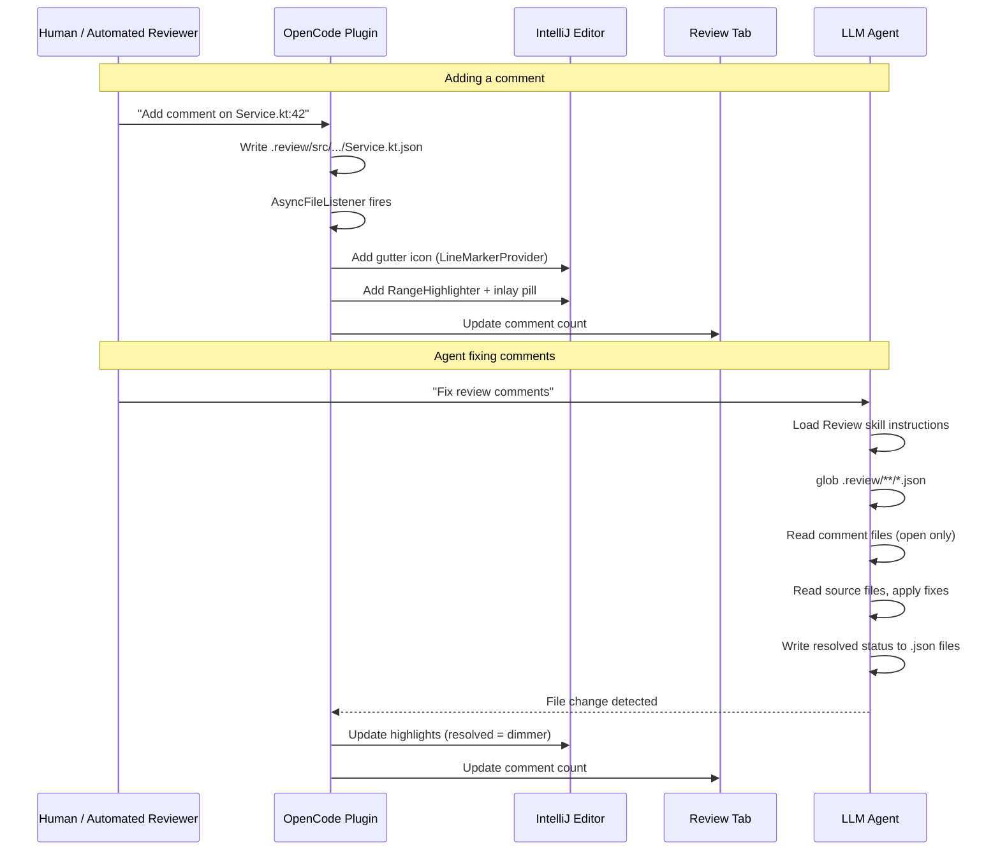

# Technical Design Document: Review Comments

> **Status:** Draft (post-adversarial-review revision)
> **Last Updated:** 2026-06-17
> **Related docs:** [Review Tab TDD](Done/review-tab.md), [Follow Agent TDD](follow-agent-editor-integration.md)

---

## 1. TL;DR

Add a review comments system to the OpenCode IntelliJ plugin. Users and automated AI reviewers can attach comments to specific lines of source files. Comments are stored as one JSON file per reviewed source file in a `.review/` directory that mirrors the project source tree — git-trackable, no server, and directly readable/writable by LLM agents. The plugin renders comments as gutter icons (`LineMarkerProvider`) and persistent line highlights (`RangeHighlighter` + inlay pills via `EditorCustomElementRenderer` — reusing the Follow Agent infrastructure). The existing Review tab shows which files have open comments with counts. An OpenCode skill teaches the LLM agent to read comment files, apply fixes, and mark comments resolved.

> **Phase scope note:** Diff-viewer annotation is **deferred to Phase 2**. Phase 1 covers file-editor annotations, Review tab counts, and the LLM skill only. The diff-viewer design (§4.3 Dual Anchoring, §4.7.2.I `ReviewCommentDiffExtension`) is retained as a forward-looking specification with the known API issues documented inline for when it is picked up. See §11 Phase Plan.

---

## 2. Context & Scope

### 2.1 Current State

The plugin has three relevant subsystems:

1. **Review Tab** (`ReviewPanel.kt`): Shows VCS-changed files with line deltas. Pure git diff — no comment/annotation storage. Already has `AsyncFileListener` for live file change detection.

2. **Follow Agent** (`EditorFollowManager.kt`, `AgentActionRenderer.kt`): Transient editor highlights when the LLM reads/edits files. Uses `RangeHighlighter` + `InlayModel.addBlockElement()` + `EditorCustomElementRenderer` with a 5-second fade. Shows "Agent is reading" / "Agent is editing" pills above code.

3. **Chat System**: LLM session management, message streaming, tool call execution. No mechanism for persisting or surfacing review comments.

The plugin has zero support for:
- Persistent annotations attached to specific lines of source files
- A storage protocol that survives IDE restarts and is portable (git-trackable)
- An agent-facing API for discovering and resolving review comments

### 2.2 Problem Statement

AI-assisted code generation produces changes that need human review — and conversely, humans leave review feedback that the AI should be able to read and act on. Currently there is no bridge: review comments live in the user's head, in a separate tool, or are lost after the chat session ends. The LLM cannot discover, read, or resolve review feedback programmatically.

The core loop we want to enable:

```
Human (or automated reviewer) adds comment on line 42 of Service.kt
  → comment is stored as .review/src/main/kotlin/Service.kt.json
  → plugin highlights the line in the editor + shows comment in review tab
  → user asks LLM: "fix the review comments"
  → LLM reads .review/**, applies fixes, marks resolved
  → plugin updates highlights to show resolved state
```

---

## 3. Goals & Non-Goals

### Goals

1. **Persist review comments as git-trackable JSON files** — one `.json` file per reviewed source file, stored in `.review/` mirroring the project source tree. Comments survive IDE restarts, are shareable via git, and directly readable/writable by any LLM agent.
2. **Display comments in the editor (Phase 1)** — gutter icons (via `LineMarkerProvider`) on commented lines, persistent line highlights (via `RangeHighlighter`), and inline text pills (via `EditorCustomElementRenderer`). Reuse the Follow Agent rendering pipeline.
3. **Show comment state in the Review tab** — indicate which files have open comments and how many, with a collapsible comment list section.
4. **Enable LLM to read and resolve comments** — via an OpenCode skill that instructs the agent on the `.review/` file format and resolution workflow.
5. **Live update on file changes** — the plugin watches `.review/` with `AsyncFileListener` (already used in `ReviewPanel.kt`) and updates editor highlights and the review tab immediately.

### Non-Goals

- **Diff-viewer annotations** (deferred to Phase 2 — see §11)
- Inline comment editing from the editor gutter (phase 2) — initially, comments are added via the chat/review flow
- Multi-user review workflows (assignments, @mentions, approval chains)
- Comments on non-modified lines (the user/files from the session)
- Storing comments server-side in OpenCode's backend — the `.review/` directory is the entire protocol

---

## 4. Proposed Solution

Store review comments as one JSON file per source file in a `.review/` directory that mirrors the project source tree. The plugin watches this directory via `AsyncFileListener` and renders comments as editor highlights (reusing the existing Follow Agent `RangeHighlighter` + `Inlay` + `EditorCustomElementRenderer` pipeline) and gutter icons (via a new `LineMarkerProvider`). The existing Review tab is extended to show which files have open comments. An OpenCode skill encodes the file format and resolution workflow for the LLM agent.

### 4.3 API / Interface Design

The `.review/` directory IS the API. No HTTP endpoints, no database schema.

**File layout:**
```
.review/
  src/main/kotlin/
    Service.kt.json
    Config.kt.json
  src/main/resources/
    app.yaml.json
```

**JSON schema (per reviewed source file):**

```json
{
  "formatVersion": 1,
  "etag": "a1b2c3d4",
  "comments": [
    {
      "id": "cmt_a3f1c2d4",
      "startLine": 42,
      "endLine": 45,
      "comment": "N+1 query in loop — use JOIN FETCH or batch loading",
      "severity": "warning",
      "status": "open",
      "author": "ai-review",
      "createdAt": "2026-06-16T10:30:00Z",
      "revision": "abc123def456",
      "revisionLabel": "HEAD~3",
      "resolvedAt": null,
      "resolution": null
    }
  ]
}
```

| Field | Type | Description |
|-------|------|-------------|
| `formatVersion` | int | Schema version (currently 1) |
| `etag` | string | Opaque version token for optimistic concurrency (auto-generated) |
| `comments[].id` | string | Unique ID (`cmt_` + 12 hex chars) |
| `comments[].startLine` | int | 1-based start line in current file (validated ≥ 1) |
| `comments[].endLine` | int | 1-based end line in current file (validated ≥ `startLine`) |
| `comments[].comment` | string | The review comment body |
| `comments[].severity` | string | `"info"`, `"warning"`, or `"error"` (validated on read) |
| `comments[].status` | string | `"open"`, `"resolved"`, or `"deleted"` |
| `comments[].author` | string | Who wrote it (`"user"`, `"ai-review"`, `"ai-<agent-name>"`) |
| `comments[].createdAt` | string | ISO 8601 timestamp (UTC, second precision) |
| `comments[].revision` | string | Git commit hash when the comment was made (anchors to diff); `null` or omitted if no VCS |
| `comments[].revisionLabel` | string | Human-readable label, e.g. `"HEAD~3"`, `"Working"`, or `null` |
| `comments[].resolvedAt` | string | Null if open/deleted; ISO 8601 (UTC, second precision) when resolved |
| `comments[].resolution` | string | Null if open/deleted; e.g., `"Fixed by using JOIN FETCH"` |

**File naming:** The `.json` extension is appended to the source file path. A file at `src/main/kotlin/Service.kt` becomes `.review/src/main/kotlin/Service.kt.json`. This makes the mapping bijective and obvious.

**Absence means no comments:** If no `.json` file exists for a source file, there are no comments on it. No sentinel or index file needed.

#### Dual Anchoring: File + Diff

> **Phase note:** The diff-viewer surface below is **Phase 2**. Phase 1 implements only the File-editor surface. The diff-viewer design is retained here as a forward-looking spec; the `ReviewCommentDiffExtension` class and its `DiffExtension` registration are NOT included in Phase 1's `plugin.xml`. The known API pitfalls (file-path extraction from `ContentDiffRequest`, null `editor.project` in transient diff editors) are documented inline so the Phase 2 implementer doesn't repeat them.

Every comment is anchored to **both** the current file state and the VCS diff state. The anchoring surfaces differ because IntelliJ's `DiffManager` API does not have a public annotation mechanism for arbitrary comment pills on diff lines — see the approach below.

| Surface | How the comment appears | Anchored by | Mechanism |
|---------|------------------------|-------------|-----------|
| **File editor** (normal view) — **Phase 1** | Gutter icon + line highlight + inlay pill | `startLine` / `endLine` in current file | `LineMarkerProvider` + `RangeHighlighter` + `EditorCustomElementRenderer` (see §4.7.2-K) |
| **Diff viewer** (opened from Review tab) — **Phase 2** | Highlights + gutter icons on the **after-side** editor inside the diff viewer | `startLine` in the diff's right panel | A `DiffExtension` registered via the `com.intellij.diff.DiffExtension` extension point receives `onViewerCreated(viewer, context, request)` once the viewer is fully constructed (no timing race). **Project must come from `context.project`, NOT `editor.project`** (transient diff editors frequently have a null project). **File path must be resolved from the diff content's `VirtualFile`** (e.g., via `DiffUtil.getVirtualFile(content)` or user-data on the `DiffRequest`), NOT from `ContentDiffRequest.contentTitles` — those are display labels ("Working", "Local Changes"), not file paths, so an index lookup against them always returns empty. |
| **LLM agent** (reads via file protocol) | Reads `.json` directly — sees `startLine` + `revision` + full comment text | Both — agent cross-references file lines with git history | Standard file read tool |

**Diff annotation approach (Phase 2 — design retained, NOT implemented in Phase 1):**

IntelliJ's `DiffManager`/`DiffViewer` has no public API for rendering arbitrary annotation pills on diff lines, and calling `DiffManager.getDiffViewer()` immediately after `showDiff()` is unreliable — the viewer is created asynchronously and may not yet exist. The correct extension point is `DiffExtension`, which is called once the viewer is fully constructed.

The approach (when Phase 2 is implemented):

1. `openDiffForPath()` opens the diff normally via `DiffManager.getInstance().showDiff()`. The file's relative path is stored on the `DiffRequest` user data (`DiffRequest.putUserData(REVIEW_PATH_KEY, relativePath)`) so the `DiffExtension` can recover it without guessing from display titles.
2. A `ReviewCommentDiffExtension` (registered via `com.intellij.diff.DiffExtension`) receives `onViewerCreated(viewer, context, request)` once the viewer is fully constructed — no timing race, no null viewer. **The `Project` is read from `context.project`, NOT `editor.project`** — transient diff editors frequently have a null project association.
3. Inside `onViewerCreated`, check the viewer type:
   - `TwosideTextDiffViewer` → call `viewer.getEditor(Side.RIGHT)` for the after editor (returns `EditorEx`)
   - `UnifiedDiffViewer` → call `viewer.getEditor()` (single editor)
   - `SimpleOnesideDiffViewer` → call `viewer.getEditor()` (single editor)
   - Other viewer types → skip (no editor to annotate)
4. Recover the file path from the `DiffRequest` user data (set in step 1). **Do NOT use `(request as? ContentDiffRequest)?.contentTitles?.lastOrNull()`** — `contentTitles` returns display labels ("Working", "Local Changes"), not file paths, so an index lookup against them always returns empty. If the user-data key is absent, fall back to extracting the `VirtualFile` from the right-side diff content via `DiffUtil.getVirtualFile(content)` and computing the relative path from `project.basePath`.
5. Apply the same `EditorHighlightSupport.addHighlight()` and gutter icons to the resolved editor, using the comment's `startLine` and `endLine`.
6. Check `revision` — if the diff's current file hash matches, show comments; if not, skip (the content being diffed may not correspond to the commented version). Computing file hashes is delegated to `GitService` (a Phase 2 addition); Phase 2 must document the hash source before relying on `revision`.
7. Register cleanup against the viewer (which implements `Disposable`): `Disposer.register(viewer) { handle.dispose() }` — `DiffExtension` has no `onViewerDisposed` hook, so cleanup is via the viewer's own disposal.

This approach reuses the same rendering code path as file-editor annotations, avoiding a separate diff-annotation API. The comments appear on the right (after) panel of two-sided diffs. Diff annotations are intentionally rendered on the after-side only, since that's what the LLM will edit.

**Phase 1 scope reminder:** None of the above is built in Phase 1. The `ReviewCommentDiffExtension` class and its `<diff.DiffExtension>` registration are omitted from the Phase 1 `plugin.xml` (§4.7.2-L). The notes above exist so the Phase 2 implementer avoids the four API pitfalls identified during review: (a) display-titles are not paths, (b) `editor.project` is unreliable in diff viewers, (c) `getDiffViewer()` races viewer construction, (d) file-hash-based `revision` matching requires a hash source that doesn't exist yet.

**How it works in practice:**

1. Human or agent adds a comment on line 42. The plugin records:
   - `startLine`: 42 (1-based in JSON; `LineCommentMap` converts to 0-based for PSI/Document lookups — see §4.7.1)
   - `revision`: `abc123def` (the git commit the file was at when the comment was made — may be `null` for non-git projects; hash source wiring is a Phase 2 dependency for the diff `revision` check)

2. When viewing the current file in the editor (**Phase 1**):
   - `EditorFactoryListener` (registered programmatically in `ReviewCommentManager.init`) fires on file open → `EditorLifecycleHook.editorCreated` → `EditorHighlightSupport.addHighlights` applies all open comment highlights for that file
   - `ReviewCommentLineMarkerProvider.collectSlowLineMarkers` (batched) emits the gutter icon at line 42
   - Highlights and icons appear at line 42

3. When opening the diff from the Review tab (**Phase 2** — not built in Phase 1):
   - `openDiffForPath()` stashes the relative source path on the `DiffRequest` user data (`REVIEW_PATH_KEY`) before calling `DiffManager.getInstance().showDiff()`
   - The diff opens normally
   - `ReviewCommentDiffExtension.onViewerCreated()` fires once the viewer is fully constructed (no timing race)
   - The `Project` is read from `context.project` (NOT `editor.project`, which is null in transient diff editors)
   - The file path is recovered from `DiffRequest.getUserData(REVIEW_PATH_KEY)` (NOT `ContentDiffRequest.contentTitles`, which are display labels)
   - For `TwosideTextDiffViewer`, `viewer.getEditor(Side.RIGHT)` returns the after editor; comments are applied there
   - If the `revision` doesn't match HEAD, comments still appear at their `startLine` — they may be stale, but the user can cross-reference with the diff content

4. When the user edits the file, a `DocumentListener` (registered in `EditorLifecycleHook.registerLineShiftWatcher`, parented to the editor) clears and re-applies highlights for lines that shifted — this prevents stale highlights from pointing to wrong code. See §7.2 for details.

5. When the LLM reads comments to fix them:
   - The agent sees `startLine: 42` and navigates there in the file
   - The agent fixes the issue and updates `status` + `resolution`

**Line drift detection (replaces "tolerance"):** A `DocumentListener` is registered per-editor in `EditorLifecycleHook` (see §4.7.2-H). When text is inserted or deleted above a comment's `startLine`, the highlight is invalidated and the comment is marked as potentially stale in the UI (e.g., a dimmed/warning icon instead of a full highlight). The comment's `revision` field preserves the original code context. This replaces the previous "acceptable for MVP" stance — stale highlights pointing to wrong code are worse than no highlights.

### 4.4 Comment Creation Channels

Comments enter the system through three channels. All converge on the same file format — the writer is irrelevant to the consumer.

#### Channel A: AI Agent (chat-driven)

The user asks the LLM agent to review code and add comments:

```
User: "Review my changes and add comments on issues you find"
→ Agent reads VCS-changed files
→ Agent writes .review/src/.../Service.kt.json via file tool
→ Plugin AsyncFileListener fires → gutter icon + highlight appear
```

This is the most common path for automated review. The agent writes directly to `.review/` — no plugin API needed.

#### Channel B: Plugin UI (human-driven)

The plugin provides three UI entry points, all calling `ReviewCommentService.addComment()`:

| Trigger | Location | UX |
|---------|----------|-----|
| Right-click gutter line number | Editor gutter | "Add Review Comment" context menu item → dialog with comment text + severity |
| Chat message | Input area | User types natural language comment → agent writes the file (channel A) |
| Right-click changed file | Review tab | "Add Comment" context menu → dialog with file path pre-filled |

The gutter action is the primary human path:
1. User right-clicks the gutter area on line 42 of `Service.kt`
2. Context menu shows **"Add Review Comment"** (keyboard shortcut: configurable)
3. Dialog opens with pre-filled file path + line range
4. User enters comment text, selects severity, hits submit
5. Plugin writes `.review/src/main/kotlin/Service.kt.json` atomically (write to `.tmp`, rename)
6. AsyncFileListener fires → highlights appear immediately

#### Channel C: External / CI (automated tooling)

Any process writes a valid `.json` file to `.review/`:

```bash
# Example: a CI lint script
cat > .review/src/main/kotlin/Service.kt.json <<EOF
{
  "formatVersion": 1,
  "comments": [{
    "id": "cmt_ci_001",
    "startLine": 42,
    "comment": "Cyclomatic complexity exceeds threshold (15 > 10)",
    "severity": "warning",
    "status": "open",
    "author": "ci-lint"
  }]
}
EOF
```

The plugin picks this up via `AsyncFileListener` — no restart, no API call. This is the extension point for pipeline integrations (linters, automated code review bots, pre-commit hooks).

### 4.5 Key Flows



### 4.6 Technology Stack

| Layer | Technology | Version | Rationale |
|-------|-----------|---------|-----------|
| Language | Kotlin | 21 (JVM target) | Existing plugin language |
| Editor API | IntelliJ Platform SDK | 2026.1 (build 261.*) | Existing platform |
| Storage | JSON files on disk | — | Portable, git-trackable, agent-readable |
| Serialization | `kotlinx.serialization` | Already in project | Existing dependency |
| Editor highlights | `RangeHighlighter` + `InlayModel` + `EditorCustomElementRenderer` | — | Reuse Follow Agent pipeline |
| Gutter icons | `LineMarkerProvider` extension point | — | Standard IntelliJ API |
| File watching | `AsyncFileListener` | — | Already used in `ReviewPanel.kt` |
| Agent protocol | OpenCode skill + `.review/` file protocol | — | No server needed |

### 4.7 Implementation Blueprint

#### 4.7.1 Data Models

```kotlin
// ReviewModels.kt — extend the existing file

/** A single review comment attached to a range of lines in a source file. */
@Serializable
data class ReviewComment(
    val id: String,
    val startLine: Int,
    val endLine: Int,
    val comment: String,
    val severity: ReviewSeverity = ReviewSeverity.WARNING,
    val status: ReviewStatus = ReviewStatus.OPEN,
    val author: String = "user",
    val createdAt: String = Instant.now().truncatedTo(ChronoUnit.SECONDS).toString(),
    val revision: String? = null,
    val revisionLabel: String? = null,
    val resolvedAt: String? = null,
    val resolution: String? = null,
) {
    /** Validate constraints that must hold before write. */
    fun validate(): Boolean =
        id.isNotBlank() && startLine >= 1 && endLine >= startLine && comment.isNotBlank()
}

@Serializable
enum class ReviewSeverity { INFO, WARNING, ERROR }

@Serializable
enum class ReviewStatus { OPEN, RESOLVED, DELETED }

/** Wrapper for one JSON file — one per reviewed source file.
 *  The `etag` field supports optimistic concurrency: a random opaque token
 *  regenerated on every write. Writers must read the current etag, modify,
 *  then write — if the etag on disk differs from the read value, the write
 *  is retried (re-read, merge, re-write up to 3 attempts). */
@Serializable
data class ReviewFile(
    val formatVersion: Int = 1,
    val etag: String = generateEtag(),
    val comments: List<ReviewComment> = emptyList(),
) {
    companion object {
        fun generateEtag(): String = java.util.UUID.randomUUID().toString().take(8)
    }
}

/** In-memory index: file path → its review comments (loaded from .review/).
 *  Built by [ReviewCommentFileWatcher] and [ReviewCommentManager.loadAll].
 *  Total open count is computed on construction and is authoritative —
 *  no redundant field elsewhere.
 *
 *  IMMUTABILITY CONTRACT: this data class is strictly immutable. Every
 *  mutating operation returns a NEW [ReviewIndex] with a NEW map instance
 *  (never mutates the existing map). This is required because
 *  [ReviewCommentLineMarkerProvider] reads `commentsByFile` on the EDT
 *  while [ReviewCommentFileWatcher] / [ReviewCommentManager.updateFile]
 *  swap the index on a background dispatcher. `StateFlow.value` swap is
 *  atomic for the reference, but the *contents* of the old map must
 *  remain stable for any in-progress EDT iteration — hence copy-on-write. */
data class ReviewIndex(
    val commentsByFile: Map<String, List<ReviewComment>> = emptyMap(),
    val totalOpen: Int = 0,
) {
    /** Get all comments for a file. */
    fun forFile(path: String): List<ReviewComment> =
        commentsByFile[path].orEmpty()

    /** Get only OPEN comments for a file. */
    fun openForFile(path: String): List<ReviewComment> =
        forFile(path).filter { it.status == ReviewStatus.OPEN }

    /** Build a NEW index with [sourcePath] set to [file]'s comments
     *  (or removed if file is null/empty). Copy-on-write: allocates a
     *  fresh map so concurrent EDT readers keep seeing the old snapshot. */
    fun withFile(sourcePath: String, file: ReviewFile?): ReviewIndex {
        val newMap = commentsByFile.toMutableMap()  // shallow copy of the map
        if (file == null || file.comments.isEmpty()) {
            newMap.remove(sourcePath)
        } else {
            // Store an immutable List copy so callers can't mutate it.
            newMap[sourcePath] = file.comments.toList()
        }
        return ReviewIndex(
            commentsByFile = newMap,
            totalOpen = newMap.values.flatten().count { it.status == ReviewStatus.OPEN },
        )
    }
}
```

> **Note on the existing `ReviewState`:** The existing sealed interface (`ReviewState.Loading`, `ReviewState.Loaded`, `ReviewState.Empty`, `ReviewState.Error`) is extended with an optional `commentsByFile` field in `ReviewState.Loaded`, rather than creating a parallel hierarchy. See the existing `ReviewModels.kt` for the base definition. No new sealed interface is introduced.

#### 4.7.2 Class & Interface Definitions

The God-object `ReviewCommentService` from the previous draft is decomposed into five focused components, coordinated by a lightweight `ReviewCommentManager` facade. The goal is testability, single responsibility, and clean dependency injection.

##### Architecture Overview

```
┌──────────────────────────────────────────────────────────────────┐
│                     ReviewCommentManager                         │
│  (facade — the ONLY public API surface consumers import)         │
│  Owns lifecycle: init → register listeners → coordinate updates  │
│  Owns: ReviewStateFlow (current index, thread-safe via StateFlow)│
├──────────────────────────────────────────────────────────────────┤
│  Delegates to:                                                    │
│  ┌──────────────┐  ┌───────────────┐  ┌───────────────┐          │
│  │ ReviewComment │  │ReviewComment │  │ReviewComment  │          │
│  │ Repository    │  │   Parser     │  │FileWatcher    │          │
│  │ (file I/O +   │  │ (JSON serde) │  │(AsyncFileListener│       │
│  │  per-path     │  │              │  │ + self-write   │          │
│  │  Mutex)       │  │              │  │ suppression)   │          │
│  └──────────────┘  └───────────────┘  └───────────────┘          │
│  ┌──────────────────┐  ┌──────────────────────────────────┐      │
│  │EditorLifecycle   │  │EditorHighlightSupport            │      │
│  │Hook + LineMap    │  │(shared with EditorFollowManager) │      │
│  │(RangeHighlighter │  │(RangeHighlighter + Inlay helpers)│      │
│  │ + Inlay + drift) │  │                                  │      │
│  └──────────────────┘  └──────────────────────────────────┘      │
└──────────────────────────────────────────────────────────────────┘

State flow: ReviewCommentManager holds a MutableStateFlow<ReviewIndex>
             (the single source of truth — no parallel @Volatile var).
             LineMarkerProvider reads .value synchronously on EDT;
             FileWatcher and addComment() write to it.
```

**Key principles:**
- All JSON file writes go through `ReviewCommentRepository` which combines etag-based optimistic concurrency with a **per-path Mutex** to close the TOCTOU window (read-etag → modify → rename cannot interleave for the same path).
- The current index lives in a single `MutableStateFlow<ReviewIndex>` — `StateFlow.value` is thread-safe for synchronous EDT reads (the `LineMarkerProvider` path) and eliminates the duplicate `@Volatile var` + `SharedFlow` redundancy of the previous draft. `ReviewIndex` is strictly immutable; `withFile()` returns a new instance with a new map.
- `ReviewCommentFileWatcher` is its own class (not an anonymous `AsyncFileListener` inside the manager) so file-watching concerns are testable in isolation and don't bloat the manager. It suppresses self-writes (events on files the manager just wrote) to avoid a write→VFS-event→re-read→write feedback loop.
- `EditorHighlightSupport` is the shared utility extracted from `EditorFollowManager` so both transient (Follow Agent) and persistent (Review Comments) highlights share the same `RangeHighlighter` + `Inlay` creation code.
- All editor/file listeners (`EditorFactoryListener`, `BulkFileListener`) are registered **programmatically** in `ReviewCommentManager.init`, not via `<projectListeners>`/`<applicationListeners>` — IntelliJ's XML listener extension points cannot inject the `ReviewCommentManager` collaborator their constructors require (this was a startup-crash in the previous draft).

##### A. ReviewCommentParser — JSON deserialization

```kotlin
/** Handles JSON parsing with lenient settings and validation.
 *  Uses kotlinx.serialization with ignoreUnknownKeys = true
 *  so that unknown fields from future schema versions don't crash.
 *
 *  Implementable as a class (not a Kotlin `object` singleton) so it can
 *  be injected and substituted with a fake in tests. The default
 *  constructor takes no collaborators; ReviewCommentManager constructs
 *  one instance and delegates to it. */
class ReviewCommentParser {
    private val json = Json {
        ignoreUnknownKeys = true
        isLenient = true    // tolerate trailing commas
        encodeDefaults = false
    }

    fun parseReviewFile(content: String): ReviewFile =
        json.decodeFromString<ReviewFile>(content)

    fun serializeReviewFile(file: ReviewFile): String =
        json.encodeToString(file)

    /** Validate comment fields before writing. Silently drops comments
     *  with invalid line numbers — logs a warning. */
    fun validateComment(comment: ReviewComment): Boolean = comment.validate()
}
```

##### B. ReviewCommentRepository — file I/O with optimistic concurrency

```kotlin
/** Low-level file I/O for .review/ files. Read-modify-write uses
 *  etag-based optimistic concurrency PLUS a per-path Mutex to close the
 *  TOCTOU window between "etag matches" and "rename .tmp → final".
 *
 *  Concurrency model:
 *  - The etag field detects a *prior* concurrent write (read-etag phase).
 *  - The per-path Mutex serializes the read-modify-write so that two
 *    updateFile() calls for the same source path cannot interleave their
 *    .tmp-write and rename steps. Without the Mutex, caller A could pass
 *    its etag check, then caller B writes+renames (new etag), then caller A
 *    renames its already-written .tmp over B's file — silent data loss.
 *  - The Mutex does NOT protect against external writers (other IDE
 *    instances, the LLM agent editing .json directly, CI). External
 *    writers that bypass the etag protocol accept last-writer-wins
 *    semantics (documented in §5 Assumptions). The plugin's own writes
 *    are fully serialized per path.
 *
 *  Null safety: project.basePath is nullable (default project, remote dev,
 *  lightweight test projects). All operations short-circuit with null
 *  when basePath is absent — no `!!` assertions. */
class ReviewCommentRepository(project: Project) {

    /** Base path: <project-root>/.review/ — null when project has no base path.
     *  Captured from `project.basePath` at construction time; the `project`
     *  reference itself is not retained (it's only needed for initialization,
     *  so it's a plain constructor parameter, not a `val` property). */
    private val reviewRoot: Path? = project.basePath?.let { Path.of(it, ".review") }

    /** Per-source-path Mutex serializes read-modify-write to close the
     *  etag TOCTOU window for plugin-internal concurrent writes. */
    private val fileLocks = ConcurrentHashMap<String, Mutex>()
    private fun lockFor(sourcePath: String): Mutex =
        fileLocks.computeIfAbsent(sourcePath) { Mutex() }

    /** Map source path → .review/ JSON file path. Returns null if the
     *  project has no base path (no .review/ directory is usable). */
    fun jsonPathFor(sourcePath: String): Path? {
        val root = reviewRoot ?: return null
        val p = root.resolve(sourcePath)
        return p.parent.resolve("${p.fileName}.json")
    }

    /** Read a single JSON file. Returns null if file doesn't exist or
     *  the project has no base path. */
    suspend fun readFile(sourcePath: String): ReviewFile?

    /** Write with atomic rename: write to .tmp, then rename.
     *  Checks that the on-disk etag matches the expected etag before writing.
     *  Returns true on success, false if etag mismatch (caller retries).
     *  The .tmp suffix is always `.json.tmp` so the startup cleanup glob
     *  `.review/**/*.json.tmp` catches every orphan. */
    suspend fun writeFile(sourcePath: String, file: ReviewFile, expectedEtag: String): Boolean

    /** Read-modify-write with etag retry loop AND per-path Mutex.
     *  [modifier] receives the current [ReviewFile] (or null if absent)
     *  and returns the modified file (or null to skip write).
     *  The per-path Mutex is held across the entire read-modify-write so
     *  two concurrent updateFile() calls for the same source path cannot
     *  interleave their etag check and rename. Retries up to 3 times on
     *  etag mismatch (external writer raced us), then throws
     *  [ConcurrentModificationException].
     *  Returns the resulting [ReviewFile] written to disk (or null if the
     *  modifier returned null and skipped the write). */
    suspend fun updateFile(
        sourcePath: String,
        modifier: suspend (ReviewFile?) -> ReviewFile?,
    ): ReviewFile? = lockFor(sourcePath).withLock {
        // ... read → modifier → write (with etag check) → retry on mismatch ...
    }

    /** Delete the JSON file for a source path. */
    suspend fun deleteFile(sourcePath: String)

    /** List all .json files under .review/. Returns empty if no base path. */
    suspend fun listAllFiles(): List<Path>

    /** Move a .review JSON file when the source file is renamed/moved.
     *  No-op if the old .review/ file does not exist. Batches of moves
     *  (e.g. rename-package refactoring) should call this per file — the
     *  caller is responsible for deduplicating against any
     *  RefactoringElementListener-driven move already done (see §4.7.2-J). */
    suspend fun moveFile(oldSourcePath: String, newSourcePath: String) {
        val oldJson = jsonPathFor(oldSourcePath) ?: return
        val newJson = jsonPathFor(newSourcePath) ?: return
        if (oldJson.exists()) {
            newJson.parent?.createDirectories()
            oldJson.moveTo(newJson, overwrite = true)
        }
    }
}
```

##### C. ReviewIndex — defined in §4.7.1

The `ReviewIndex` data class is defined alongside `ReviewComment`/`ReviewFile` in §4.7.1 (with its immutability contract and `withFile` copy-on-write helper). It is not redefined here. Section §4.7.1 is the single source of truth for the index type.

##### D. ReviewStateHolder — single StateFlow (replaces ReviewCommentNotifier)

> **Change from previous draft:** The previous draft had both `@Volatile var index` on `ReviewCommentManager` AND a `MutableSharedFlow<ReviewIndex>(replay = 1, extraBufferCapacity = 8)` on `ReviewCommentNotifier`. That is redundant — `StateFlow` is the idiomatic Kotlin coroutines holder for "current value" state and provides thread-safe synchronous `.value` reads (which `LineMarkerProvider` needs on EDT) plus collector-side reactivity. The arbitrary `extraBufferCapacity = 8` is gone; `StateFlow` has its own buffering semantics. `ReviewCommentNotifier` is removed entirely.

```kotlin
/** Holds the current [ReviewIndex] in a [MutableStateFlow].
 *  - Synchronous, thread-safe reads via [.value] — used by
 *    [ReviewCommentLineMarkerProvider] on EDT (no dispatcher switch, no
 *    await). StateFlow.value is atomic.
 *  - Reactive updates via [.state] (a read-only StateFlow) for collectors
 *    that need to react to changes (Review tab UI, editor highlight
 *    re-application). Collectors receive emissions on the emitter's
 *    dispatcher; UI collectors must switch to EDT before touching editors.
 *  - Replaces the previous draft's @Volatile var + SharedFlow pair. */
class ReviewStateHolder(initial: ReviewIndex = ReviewIndex()) {
    private val _state = MutableStateFlow(initial)

    /** Read-only StateFlow for collectors. */
    val state: StateFlow<ReviewIndex> = _state.asStateFlow()

    /** Synchronous current-value read. Thread-safe. */
    val value: ReviewIndex get() = _state.value

    /** Atomically swap the current index. */
    fun set(index: ReviewIndex) { _state.value = index }
}
```

##### E. EditorHighlightSupport — shared infrastructure (replaces duplication)

```kotlin
/** Shared utility extracted from EditorFollowManager.
 *  Both Follow Agent (transient highlights) and Review Comments
 *  (persistent highlights) use this for RangeHighlighter + Inlay creation.
 *
 *  Highlight tracking: highlights are tracked per-editor in an internal
 *  map so cleanup can be done by editor key (matching the pattern in
 *  EditorFollowManager.activeHighlighters). The previous draft had a
 *  single clearAll(disposable) signature which was ambiguous about
 *  whether it cleared "all highlights parented by this Disposable" or
 *  "all highlights in this editor" — the two are different operations. */
object EditorHighlightSupport {

    /** Add a persistent line range highlight with a block inlay label.
     *  [disposable] controls lifecycle — when disposed, both highlighter
     *  and inlay are cleaned up automatically. Returns an opaque handle
     *  for later targeted removal. */
    fun addHighlight(
        editor: Editor,
        startLine: Int,
        endLine: Int,
        color: Color,
        label: String,
        disposable: Disposable,
    ): HighlightHandle

    /** Convenience: apply highlights for a list of comments to an editor.
     *  Maps each comment's severity to a color and creates one [HighlightHandle]
     *  per comment. Returns the list of handles (for later targeted removal). */
    fun addHighlights(
        editor: Editor,
        comments: List<ReviewComment>,
        disposable: Disposable,
    ): List<HighlightHandle>

    /** Remove a specific highlight by handle. */
    fun removeHighlight(handle: HighlightHandle)

    /** Remove ALL highlights previously added to [editor] via this object.
     *  Editor-keyed cleanup — matches the EditorFollowManager.activeHighlighters
     *  pattern. Use this in EditorLifecycleHook.editorReleased. */
    fun clearForEditor(editor: Editor)

    /** Remove all highlights parented by [disposable]. Disposable-keyed
     *  cleanup — use this on service dispose to release every highlight
     *  created under that parent regardless of editor. */
    fun clearAll(disposable: Disposable)
}
```

`HighlightHandle` is an opaque handle for a highlight+inlay pair, used for targeted removal (defined alongside the object). The internal tracking structure is a `Map<Editor, MutableList<HighlightHandle>>` plus a `Map<Disposable, MutableList<HighlightHandle>>`, populated by `addHighlight`/`addHighlights` and drained by `clearForEditor`/`clearAll` respectively.

##### F. EditorFollowManager migration note

`EditorFollowManager.flashLineRange()` and `addInlayOnly()` are refactored to delegate to `EditorHighlightSupport`. The transient-5-second-cleanup behavior becomes a wrapper:

```kotlin
// EditorFollowManager — after refactor (signature unchanged; body delegates)
fun flashLineRange(editor: Editor, doc: Document, startLine: Int, endLine: Int,
                   color: Color, actionLabel: String, disposableParent: Disposable) {
    val handle = EditorHighlightSupport.addHighlight(editor, startLine, endLine, color, actionLabel, disposable = scope)
    scope.launch {
        delay(HIGHLIGHT_DURATION_MS)
        EditorHighlightSupport.removeHighlight(handle)
    }
}
```

(The signature above mirrors the existing `EditorFollowManager.flashLineRange` parameters; only the body changes to delegate to `EditorHighlightSupport`.)

This eliminates the duplicated `HighlighterRecord`/`activeHighlighters`/cleanup-coroutine pattern that the previous draft re-implemented in `ReviewCommentEditorManager`.

##### G. ReviewCommentManager — orchestrator facade (project service)

> **God-object reduction (M1):** The previous draft inlined an anonymous `AsyncFileListener` and the rename `BulkFileListener` inside the manager. Those are now extracted into `ReviewCommentFileWatcher` (its own class, §G2 below) so file-watching is testable in isolation and the manager's surface area shrinks. The manager still owns construction + disposal of its collaborators; it just delegates the *work*.

```kotlin
/** Project-scoped service — the single public entry point for all
 *  review comment operations. Coordinates Repository, Parser,
 *  ReviewStateHolder, ReviewCommentFileWatcher, EditorLifecycleHook,
 *  and EditorHighlightSupport.
 *
 *  State: the current index lives in [stateHolder] (a single
 *  MutableStateFlow<ReviewIndex>). There is NO separate @Volatile var —
 *  StateFlow.value is the atomic source of truth, readable synchronously
 *  from EDT (LineMarkerProvider) and writable from background dispatchers.
 *
 *  Dispatchers: the manager scope uses Dispatchers.Default (matching the
 *  codebase convention for project services — EditorFollowManager uses EDT
 *  because it edits editors; OpenCodeService uses Default). File I/O
 *  inside ReviewCommentRepository switches to Dispatchers.IO via
 *  withContext { } for the actual blocking calls. The previous draft used
 *  Dispatchers.IO for the whole scope, which made updateIndex() run on IO
 *  while it calls refreshGutterIcons() → ApplicationManager.invokeLater —
 *  mixing concerns on the wrong dispatcher. */
@Service(Service.Level.PROJECT)
class ReviewCommentManager(private val project: Project) : Disposable {

    private val repository = ReviewCommentRepository(project)
    private val parser = ReviewCommentParser()
    private val stateHolder = ReviewStateHolder()

    /** File watcher — extracted into its own class (§G2). Suppresses
     *  self-writes to avoid the write→VFS-event→re-read feedback loop. */
    private val fileWatcher = ReviewCommentFileWatcher(project, repository, parser, ::onExternalFileChange, ::markSelfWrite)

    /** Editor lifecycle — constructed with `this` (the manager, which is
     *  Disposable) as the parent. Registered programmatically below — NOT
     *  via <projectListeners> (the XML extension point cannot inject the
     *  manager reference the constructor needs). */
    private val editorLifecycle = EditorLifecycleHook(project, this)

    /** Coroutine scope — Dispatchers.Default for orchestration; the
     *  repository uses withContext(Dispatchers.IO) for blocking I/O. */
    private val scope = CoroutineScope(SupervisorJob() + Dispatchers.Default)

    /** Read-only StateFlow for collectors (Review tab UI, editor highlight
     *  re-application). UI collectors must switch to EDT before touching
     *  editors. */
    val commentChanges: StateFlow<ReviewIndex> = stateHolder.state

    /** Synchronous current-value read — thread-safe. Used by
     *  ReviewCommentLineMarkerProvider on EDT (no dispatcher switch). */
    fun getIndex(): ReviewIndex = stateHolder.value

    /** Pre-built line→comments map for a file path (O(1) lookup per line).
     *  Delegates to [EditorLifecycleHook]. Used by [ReviewCommentLineMarkerProvider]
     *  to avoid O(N) filter scans per PsiElement. Returns an empty map if the
     *  file has no comments or no editor is open for it. */
    fun lineMapForFile(path: String): LineCommentMap = editorLifecycle.lineMapForFile(path)

    // ── Programmatic listener registration (replaces <projectListeners>/
    //     <applicationListeners> that crashed in the previous draft) ──

    init {
        // EditorFactoryListener — project-scoped, parent = this manager.
        // The previous draft ALSO registered this via <projectListeners>,
        // which would have double-registered AND crashed because the
        // platform cannot inject ReviewCommentManager into the constructor.
        // We register ONLY here, programmatically.
        EditorFactory.getInstance().addEditorFactoryListener(editorLifecycle, this)

        // BulkFileListener for external file moves — project-scoped via
        // messageBus.connect(this). The previous draft registered this via
        // <applicationListeners>, which cannot inject Project/Repository.
        val connection = project.messageBus.connect(this)
        connection.subscribe(VirtualFileManager.VFS_CHANGES, fileWatcher.bulkMoveListener)
    }

    // ── Self-write suppression (M9: VFS feedback loop) ─────────────────

    /** Paths recently written by THIS manager, with a short TTL. The file
     *  watcher skips VFS events for these paths so a plugin write doesn't
     *  trigger a re-read → re-emit → re-write cycle. Drained by a periodic
     *  cleanup job on [scope]. */
    private val recentSelfWrites = ConcurrentHashMap.newKeySet<String>()

    /** Called by repository writeFile() after a successful write, before
     *  the rename. Records the path so the AsyncFileListener ignores the
     *  resulting VFS event. */
    private fun markSelfWrite(sourcePath: String) {
        recentSelfWrites.add(sourcePath)
        scope.launch { delay(SELF_WRITE_SUPPRESS_MS); recentSelfWrites.remove(sourcePath) }
    }

    /** Called by the file watcher on a VFS event for a .review/ file.
     *  Returns true if the event should be suppressed (the path was
     *  written by this manager recently). */
    private fun isSelfWrite(sourcePath: String): Boolean = sourcePath in recentSelfWrites

    // ── Index updates ─────────────────────────────────────────────────

    /** Called by ReviewCommentFileWatcher when an EXTERNAL process (LLM
     *  agent, CI, another IDE instance) writes a .review/ file. Re-reads
     *  just that file, merges into the index, and refreshes the daemon. */
    private suspend fun onExternalFileChange(sourcePath: String) {
        if (isSelfWrite(sourcePath)) return  // M9: feedback-loop guard
        val file = repository.readFile(sourcePath) ?: return
        val newIndex = stateHolder.value.withFile(sourcePath, file)
        updateIndex(newIndex)
    }

    /** Atomically swap the index, notify subscribers, and force the daemon
     *  to re-run [ReviewCommentLineMarkerProvider] so gutter icons update.
     *  Safe to call from any dispatcher; the daemon restart is invoked on
     *  EDT via [Application.invokeLater] if not already on EDT. */
    private fun updateIndex(newIndex: ReviewIndex) {
        stateHolder.set(newIndex)
        refreshGutterIcons()
    }

    /** Force the daemon code analyzer to re-run line markers so gutter
     *  icons reflect the new comment state. Uses the per-file overload to
     *  avoid re-highlighting unrelated files. Must run on EDT (the daemon
     *  silently skips restart when called inside a write action).
     *
     *  API NOTE (C9): IntelliJ 2026.1 has only `restart(PsiFile)` — there
     *  is NO `restart(PsiFile, String)` overload. The previous draft used
     *  the 2-arg form, which is a compile error. */
    private fun refreshGutterIcons() {
        val file = currentEditorFile() ?: return
        val app = ApplicationManager.getApplication()
        if (app.isDispatchThread) {
            DaemonCodeAnalyzer.getInstance(project).restart(file)
        } else {
            app.invokeLater { DaemonCodeAnalyzer.getInstance(project).restart(file) }
        }
    }

    // ── Public API ───────────────────────────────────────────────────

    /** Load the full index from disk (called from ReviewCommentStartupActivity
     *  on project open). Safe to run on Dispatchers.Default; file I/O
     *  inside repository switches to Dispatchers.IO via withContext. */
    suspend fun loadAll() {
        val files = repository.listAllFiles()
        var newIndex = ReviewIndex()
        for (path in files) {
            val sourcePath = resolveSourcePath(path) ?: continue
            val file = repository.readFile(sourcePath) ?: continue
            newIndex = newIndex.withFile(sourcePath, file)
        }
        updateIndex(newIndex)
    }

    /** Add a comment. Uses optimistic concurrency + per-path Mutex internally.
     *  Updates the in-memory index DIRECTLY (not via VFS reactivity) so the
     *  caller sees the new state on the next getIndex() — no eventual-consistency
     *  surprise. The VFS event from the write is suppressed by [markSelfWrite]. */
    suspend fun addComment(sourcePath: String, comment: ReviewComment) {
        require(comment.validate()) { "Invalid comment: $comment" }
        val written = repository.updateFile(sourcePath) { existing ->
            val file = existing ?: ReviewFile()
            ReviewFile(etag = ReviewFile.generateEtag(), comments = file.comments + comment)
        }
        markSelfWrite(sourcePath)
        // Update the index directly from the file we just wrote (no VFS round-trip).
        if (written != null) {
            updateIndex(stateHolder.value.withFile(sourcePath, written))
        }
    }

    /** Delete a comment (soft-delete — sets status=DELETED). */
    suspend fun deleteComment(sourcePath: String, commentId: String) {
        val written = repository.updateFile(sourcePath) { existing ->
            existing?.copy(
                etag = ReviewFile.generateEtag(),
                comments = existing.comments.map {
                    if (it.id == commentId) it.copy(status = ReviewStatus.DELETED) else it
                }
            )
        }
        markSelfWrite(sourcePath)
        if (written != null) updateIndex(stateHolder.value.withFile(sourcePath, written))
    }

    /** Update a comment's status (open → resolved, etc.). */
    suspend fun updateCommentStatus(
        sourcePath: String,
        commentId: String,
        status: ReviewStatus,
        resolution: String?,
    ) {
        val written = repository.updateFile(sourcePath) { existing ->
            existing?.copy(
                etag = ReviewFile.generateEtag(),
                comments = existing.comments.map {
                    if (it.id == commentId) it.copy(status = status, resolution = resolution,
                        resolvedAt = if (status == ReviewStatus.RESOLVED)
                            Instant.now().truncatedTo(ChronoUnit.SECONDS).toString() else null)
                    else it
                }
            )
        }
        markSelfWrite(sourcePath)
        if (written != null) updateIndex(stateHolder.value.withFile(sourcePath, written))
    }

    /** Resolve all open comments on a file. */
    suspend fun resolveAll(sourcePath: String, resolution: String) {
        val now = Instant.now().truncatedTo(ChronoUnit.SECONDS).toString()
        val written = repository.updateFile(sourcePath) { existing ->
            existing?.copy(
                etag = ReviewFile.generateEtag(),
                comments = existing.comments.map {
                    if (it.status == ReviewStatus.OPEN)
                        it.copy(status = ReviewStatus.RESOLVED, resolution = resolution, resolvedAt = now)
                    else it
                }
            )
        }
        markSelfWrite(sourcePath)
        if (written != null) updateIndex(stateHolder.value.withFile(sourcePath, written))
    }

    // ── Disposal (M7) ────────────────────────────────────────────────

    override fun dispose() {
        // Order matters: cancel scope first (drops pending self-write
        // cleanup jobs + file-watcher coroutines), then dispose the
        // collaborators that registered listeners with `this` as parent.
        // EditorFactoryListener + messageBus connection are auto-removed
        // because they were registered with `this` as parent Disposable.
        scope.cancel()
        Disposer.dispose(editorLifecycle)
        // EditorHighlightSupport.clearAll(this) — drained by the Disposable
        // parent semantics; no explicit call needed because addHighlight
        // was called with `this` (or editorLifecycle) as parent.
        recentSelfWrites.clear()
    }

    companion object {
        const val SELF_WRITE_SUPPRESS_MS = 2_000L

        fun getInstance(project: Project): ReviewCommentManager =
            project.service<ReviewCommentManager>()
    }
}
```

##### G2. ReviewCommentFileWatcher — AsyncFileListener (extracted from the manager)

```kotlin
/** Watches .review/ for changes and re-reads the changed file into the
 *  index. Extracted from ReviewCommentManager (M1) so file-watching is
 *  testable in isolation and the manager's responsibilities shrink.
 *
 *  Self-write suppression (M9): the manager calls [onExternalFileChange]
 *  for every VFS event on a .review/ file, but [onExternalFileChange]
 *  internally consults [isSelfWrite] (a callback to the manager) and skips
 *  events for paths the manager wrote recently. This closes the
 *  write→VFS-event→re-read feedback loop without coupling the watcher
 *  to the manager's internals.
 *
 *  BulkFileListener for file moves is also exposed here (the manager
 *  subscribes it via project.messageBus.connect). Keeping both listeners
 *  in one class means all "react to .review/ filesystem changes" logic
 *  lives in one place. */
class ReviewCommentFileWatcher(
    private val project: Project,
    private val repository: ReviewCommentRepository,
    private val parser: ReviewCommentParser,
    private val onExternalFileChange: suspend (String) -> Unit,
    private val isSelfWrite: (String) -> Boolean,
) {
    /** AsyncFileListener — fires on any VFS change under .review/.
     *  Filters to .json (ignores .json.tmp orphan cleanup) and skips
     *  self-writes. Delegates the actual re-read to [onExternalFileChange]
     *  on a background coroutine so the VFS thread isn't blocked. */
    val asyncListener = object : AsyncFileListener {
        override fun prepareChange(events: List<VFileEvent>): AsyncFileListener.ChangeApplier? {
            val reviewEvents = events.filter { ev ->
                val path = ev.file?.path ?: return@filter false
                path.startsWith(reviewRootPrefix()) && path.endsWith(".json")
                        && !path.endsWith(".json.tmp")
            }
            if (reviewEvents.isEmpty()) return null
            return object : AsyncFileListener.ChangeApplier {
                override fun afterVfsChange() {
                    for (ev in reviewEvents) {
                        val sourcePath = resolveSourcePath(ev.file ?: continue) ?: continue
                        if (isSelfWrite(sourcePath)) continue
                        // Launch on the manager's scope via a callback would
                        // be cleaner; here we use Application scope as a
                        // stable entry point. The actual re-read switches
                        // to Dispatchers.IO inside repository.readFile.
                        ApplicationManager.getApplication().coroutineScope.launch {
                            onExternalFileChange(sourcePath)
                        }
                    }
                }
            }
        }
    }

    /** BulkFileListener — catches external moves/renames of source files
     *  (Git operations, OS moves, VFS refresh) so the .review/ mirror
     *  file follows the source file. Programmatic registration is done
     *  by ReviewCommentManager.init via project.messageBus.connect(this).
     *  Works in dumb mode (no PSI needed). */
    val bulkMoveListener = object : BulkFileListener {
        override fun after(events: List<VFileEvent>) {
            for (event in events) {
                when (event) {
                    is VFileMoveEvent -> {
                        val oldPath = relativePath(event.oldParent, event.file.name) ?: continue
                        val newPath = relativePath(event.file.parent, event.file.name) ?: continue
                        if (!isUnderReviewRoot(oldPath)) continue
                        scope.launch { repository.moveFile(oldPath, newPath) }
                    }
                    is VFilePropertyChangeEvent -> {
                        if (event.propertyName == VirtualFile.PROP_NAME) {
                            val parent = event.file.parent
                            val oldPath = relativePath(parent, event.oldValue.toString()) ?: continue
                            val newPath = relativePath(parent, event.newValue.toString()) ?: continue
                            scope.launch { repository.moveFile(oldPath, newPath) }
                        }
                    }
                }
            }
        }
    }

    private val scope = CoroutineScope(SupervisorJob() + Dispatchers.Default)

    private fun reviewRootPrefix(): String =
        project.basePath?.let { "$it/.review/" } ?: ""

    private fun isUnderReviewRoot(path: String): Boolean = path.startsWith(reviewRootPrefix())

    private fun relativePath(parent: VirtualFile?, name: String): String? {
        val base = project.basePath ?: return null
        val parentRel = parent?.path?.removePrefix(base.replace('\\', '/'))
            ?.removePrefix("/") ?: return null
        return "$parentRel/$name"
    }

    private fun resolveSourcePath(reviewFile: VirtualFile): String? {
        val base = project.basePath ?: return null
        val rel = reviewFile.path.removePrefix("$base/.review/")
        return rel.removeSuffix(".json")
    }
}
```

> **Note on `ApplicationManager.getApplication().coroutineScope`:** the watcher uses the application's coroutine scope for the re-read launch so it isn't tied to the watcher's own lifecycle (which is shorter than the manager's). The actual disk I/O switches to `Dispatchers.IO` inside `repository.readFile`. An alternative is to pass a `CoroutineScope` from the manager into the watcher constructor — that is acceptable too and is left as an implementation-time decision.

##### H. EditorLifecycleHook — editor open/close + DocumentListener

```kotlin
/** Subscribes to EditorFactory events to apply/remove comment highlights
 *  when editors are opened or closed. Also registers a DocumentListener
 *  per editor to detect line shifts and invalidate stale highlights.
 *
 *  Registration: the manager constructs this hook and registers it
 *  programmatically via EditorFactory.getInstance().addEditorFactoryListener(this, manager)
 *  in ReviewCommentManager.init (NOT via <projectListeners>, which cannot
 *  inject the manager reference). The hook's parent Disposable is the
 *  manager itself, so the listener is auto-removed when the manager is
 *  disposed.
 *
 *  Performance: on editor open, builds a [LineCommentMap] (Map<Int, List<ReviewComment>>)
 *  by expanding each comment's `startLine..endLine` range to individual line keys.
 *  This O(1) lookup map is exposed via [lineMapForFile] and consumed by
 *  [ReviewCommentLineMarkerProvider] so the provider avoids O(N) filter scans
 *  per PsiElement. The map is rebuilt when the file's .review/ JSON changes.
 *
 *  DocumentListener lifecycle (M7): the document listener is registered
 *  with the EDITOR (which implements Disposable) as parent — NOT with this
 *  hook. When the editor is released, the editor's document (and its
 *  listeners) are disposed automatically, so there's no slow accumulation
 *  of dead DocumentListeners for the lifetime of the project. The previous
 *  draft registered them with `this` (the project-scoped hook), which
 *  meant closed editors' DocumentListeners survived until project close. */
class EditorLifecycleHook(
    private val project: Project,
    private val manager: ReviewCommentManager,
) : Disposable {

    /** Per-editor line→comments map, keyed by relative source path. */
    private val lineMaps = java.util.concurrent.ConcurrentHashMap<String, LineCommentMap>()

    /** Get the pre-built line map for a file path. Returns an empty map if
     *  no comments exist for that file. Safe to call from EDT (LineMarkerProvider). */
    fun lineMapForFile(path: String): LineCommentMap =
        lineMaps[path] ?: LineCommentMap.EMPTY

    /** Compute the project-relative path for a VirtualFile using the
     *  codebase convention (project.basePath string arithmetic, NOT the
     *  deprecated project.baseDir / VfsUtil.getRelativePath). Returns null
     *  if the project has no base path or the file is outside it. */
    private fun relativePath(vf: VirtualFile): String? {
        val base = project.basePath ?: return null
        val baseNorm = base.replace('\\', '/')
        val fileNorm = vf.path.replace('\\', '/')
        if (!fileNorm.startsWith("$baseNorm/")) return null
        return fileNorm.removePrefix("$baseNorm/")
    }

    private val editorListener = object : EditorFactoryListener {
        override fun editorCreated(event: EditorFactoryEvent) {
            val editor = event.editor
            if (editor.project != project) return
            val vf = editor.virtualFile ?: return
            val path = relativePath(vf) ?: return
            val comments = manager.getIndex().openForFile(path)
            if (comments.isNotEmpty()) {
                lineMaps[path] = LineCommentMap.build(comments)
                EditorHighlightSupport.addHighlights(editor, comments, this@EditorLifecycleHook)
                registerLineShiftWatcher(editor, path, comments)
            }
        }

        override fun editorReleased(event: EditorFactoryEvent) {
            val vf = event.editor.virtualFile ?: return
            val path = relativePath(vf) ?: return
            lineMaps.remove(path)
            // C6: editor-keyed cleanup — clears every highlight previously
            // added to this editor (NOT a Disposable-keyed clearAll).
            EditorHighlightSupport.clearForEditor(event.editor)
        }
    }

    /** Called by ReviewCommentManager when the index changes for a file —
     *  rebuilds the line map and re-applies highlights for the open editor. */
    fun onFileCommentsChanged(path: String, comments: List<ReviewComment>) {
        val editor = findOpenEditor(path)
        if (comments.isEmpty()) {
            lineMaps.remove(path)
        } else {
            lineMaps[path] = LineCommentMap.build(comments)
        }
        if (editor != null) {
            EditorHighlightSupport.clearForEditor(editor)
            if (comments.isNotEmpty()) {
                EditorHighlightSupport.addHighlights(editor, comments, this)
            }
        }
    }

    override fun dispose() {
        // EditorFactory listener auto-removed via Disposable contract
        // (parent = ReviewCommentManager, which is disposed by the platform).
        // DocumentListeners were registered with their own Editor as parent,
        // so they were already cleaned up when each editor was released —
        // nothing to do here.
    }

    private fun registerLineShiftWatcher(editor: Editor, path: String, comments: List<ReviewComment>) {
        // M7: parent = editor (implements Disposable), so the listener is
        // removed automatically when the editor is released. NOT this hook.
        editor.document.addDocumentListener(object : DocumentListener {
            override fun documentChanged(event: DocumentEvent) {
                // Compute the number of lines inserted/deleted by this event.
                // If lines above a comment's startLine were inserted or deleted,
                // invalidate that comment's highlight (mark as stale).
                // Implementation uses Document.getLineNumber(offset) to map
                // the edit offset to a line number, then checks whether any
                // comment's startLine is >= that line number.
                val changedLine = editor.document.getLineNumber(event.offset)
                val linesDelta = countLineDelta(event)
                comments.forEach { c ->
                    if (c.startLine > changedLine || c.endLine > changedLine) {
                        // Lines above this comment shifted — invalidate.
                        // Actual line-number update can be derived from linesDelta,
                        // but the comment's revision field is the source of truth
                        // for whether the highlight is still valid.
                        // TODO(phase1-impl): mark `c` as stale in the UI (dimmed icon)
                        //   and re-derive the effective line via `c.startLine + linesDelta`.
                        invalidateStaleHighlight(path, c, linesDelta)
                    }
                }
            }
        }, editor)  // <-- parent = editor, NOT this hook
    }
}
```

> **Note:** The previous draft had an `init { EditorFactory.getInstance().addEditorFactoryListener(editorListener, this) }` block here. That is removed — registration is now done by `ReviewCommentManager.init` (which has the proper parent Disposable and avoids the double-registration that would have occurred if both the XML `<projectListeners>` AND the `init` block had worked).

```

/** Immutable map: line number (0-based) → list of open comments on that line.
 *  Built by expanding each comment's [startLine..endLine] range.
 *
 *  Line-number convention (m5): JSON stores startLine/endLine as 1-based.
 *  This map's keys are 0-based (matching Document.getLineNumber(offset)
 *  and PSI offsets used by ReviewCommentLineMarkerProvider). UI surfaces
 *  that display line numbers to the user (tooltips, the Review tab) MUST
 *  convert back to 1-based by adding 1 — the gutter icon tooltip in
 *  ReviewCommentLineMarkerProvider uses `${line + 1}` for display. */
class LineCommentMap private constructor(
    private val map: Map<Int, List<ReviewComment>>,
) {
    /** O(1) lookup: comments on a given 0-based line number. */
    fun forLine(line: Int): List<ReviewComment> = map[line] ?: emptyList()

    val isEmpty: Boolean get() = map.isEmpty()

    companion object {
        val EMPTY = LineCommentMap(emptyMap())

        fun build(comments: List<ReviewComment>): LineCommentMap {
            val map = java.util.TreeMap<Int, MutableList<ReviewComment>>()
            for (c in comments) {
                // startLine/endLine are 1-based in JSON; convert to 0-based for PSI offsets
                for (line in (c.startLine - 1) until c.endLine) {
                    map.getOrPut(line) { mutableListOf() }.add(c)
                }
            }
            return LineCommentMap(map.mapValues { it.value.toList() })
        }
    }
}
```

##### I. ReviewCommentDiffExtension — diff annotation via DiffExtension (Phase 2 — design retained, NOT registered in Phase 1)

> **Phase 2 only.** This class is **not registered** in Phase 1's `plugin.xml` (§4.7.2-L omits `<diff.DiffExtension>`). The code below is the **corrected** design — the previous draft's version used `ContentDiffRequest.contentTitles` (display labels, not file paths — always failed index lookup) and `editor.project` (null in transient diff editors). Both pitfalls are fixed here so the Phase 2 implementer can copy this directly.

```kotlin
/** DiffExtension registered via the com.intellij.diff.DiffExtension extension
 *  point. Fires [onViewerCreated] once the diff viewer is fully constructed —
 *  no timing race with asynchronously-created viewers.
 *
 *  PHASE 2 — not registered in Phase 1's plugin.xml. */
class ReviewCommentDiffExtension : DiffExtension() {

    override fun onViewerCreated(
        viewer: FrameDiffTool.DiffViewer,
        context: DiffContext,
        request: DiffRequest,
    ) {
        // Resolve the editor based on viewer type
        val editor: Editor? = when (viewer) {
            is TwosideTextDiffViewer -> viewer.getEditor(Side.RIGHT)   // after-side editor
            is UnifiedDiffViewer -> viewer.getEditor()                 // single merged editor
            is SimpleOnesideDiffViewer -> viewer.getEditor()           // one-sided
            else -> null  // unknown viewer type — skip
        }
        if (editor == null) return

        // M2: Project must come from context.project, NOT editor.project.
        // Transient diff editors frequently have a null project association;
        // DiffContext always carries the project that opened the diff.
        val project = context.project ?: return

        // C5: File path must NOT be read from ContentDiffRequest.contentTitles
        // (those are display labels like "Working" / "Local Changes"). The
        // caller that opened the diff (openDiffForPath in ReviewPanel) must
        // stash the relative source path on the DiffRequest's user data;
        // we recover it here. Fallback: extract the VirtualFile from the
        // right-side diff content via DiffUtil and compute the relative path.
        val filePath = request.getUserData(REVIEW_PATH_KEY)
            ?: extractRelativePathFromContent(viewer, project)
            ?: return

        val comments = ReviewCommentManager.getInstance(project).getIndex().openForFile(filePath)
        if (comments.isEmpty()) return

        // Apply highlights to the resolved editor. The viewer implements
        // Disposable, so registering cleanup against it ensures the
        // highlights are removed when the diff viewer is disposed.
        EditorHighlightSupport.addHighlights(editor, comments, viewer)

        // Optional: filter by revision — if the diff's current content hash
        // doesn't match the comment's revision, the comments may be stale.
        // Phase 2 must wire GitService.computeFileHash() before relying on
        // this check; for now, show comments so the user can cross-reference.
    }

    private fun extractRelativePathFromContent(
        viewer: FrameDiffTool.DiffViewer,
        project: Project,
    ): String? {
        // Fallback when the DiffRequest user data is absent (e.g., diff opened
        // outside the Review tab). Extract the VirtualFile from the right-side
        // content and compute the project-relative path.
        val content = (viewer as? TwosideTextDiffViewer)?.let { DiffUtil.getContent(it, Side.RIGHT) }
            ?: (viewer as? UnifiedDiffViewer)?.let { DiffUtil.getContent(it) }
            ?: return null
        val vf = DiffUtil.getVirtualFile(content) ?: return null
        val base = project.basePath ?: return null
        val baseNorm = base.replace('\\', '/')
        val fileNorm = vf.path.replace('\\', '/')
        if (!fileNorm.startsWith("$baseNorm/")) return null
        return fileNorm.removePrefix("$baseNorm/")
    }

    companion object {
        val REVIEW_PATH_KEY = com.intellij.openapi.util.Key.create<String>("opencode.review.diff-path")
    }
}
```

**Key differences from the previous draft's `ReviewCommentDiffHelper`:**
- Registered as a `DiffExtension` (fires `onViewerCreated` after viewer construction) instead of being called manually after `DiffManager.showDiff()` — eliminates the timing race where `getDiffViewer()` returned `null`.
- Uses `TwosideTextDiffViewer.getEditor(Side.RIGHT)` (the correct API) instead of the non-existent `FileDiffViewer.getEditor(true)`.
- Handles all viewer types (`TwosideTextDiffViewer`, `UnifiedDiffViewer`, `SimpleOnesideDiffViewer`) with graceful fallback for unknown types.
- **Project from `context.project`** (M2) — not `editor.project`, which is null in transient diff editors.
- **File path from `DiffRequest` user data or `DiffUtil.getVirtualFile`** (C5) — not `ContentDiffRequest.contentTitles`, which are display labels.
- Cleanup is via `Disposer` registration against the viewer (which implements `Disposable`) — `DiffExtension` has no `onViewerDisposed` hook.

##### J. File rename/move tracking — BulkFileListener only (M3: single approach)

> **Decision (M3):** The previous draft registered BOTH `RefactoringElementListenerProvider` AND `BulkFileListener`. IDE-initiated refactorings fire VFS events (which `BulkFileListener` receives), so both listeners fire for the same rename — producing **duplicate `.review/` moves**. The single chosen approach is `BulkFileListener` because:
> 1. It catches **both** IDE refactorings and external moves (Git, OS, VFS refresh) — `RefactoringElementListenerProvider` only catches IDE refactorings.
> 2. It works in **dumb mode** (no PSI required) — `RefactoringElementListenerProvider` requires PSI and skips during indexing.
> 3. It naturally handles **directory moves** (M4): when a package/directory is renamed, VFS fires one `VFileMoveEvent` per child file, so the `.review/` mirror for each reviewed file moves correctly. `RefactoringElementListenerProvider`'s `getListener` returned null for `PsiDirectory`, leaving directory-level moves unhandled.
> 4. It is registered **programmatically** (via `project.messageBus.connect(this).subscribe(VFS_CHANGES, …)` in `ReviewCommentManager.init`) — not via `<applicationListeners>`, which cannot inject `Project`/`Repository` (C2). The previous draft's `<applicationListeners>` registration would have crashed at startup.
>
> `RefactoringElementListenerProvider`'s one advantage was structured undo support via `undoElementMovedOrRenamed`. The `BulkFileListener` path recovers the old path from `VFileMoveEvent.oldParent` / `VFilePropertyChangeEvent.oldValue`, which is sufficient for undo (undo is itself a VFS move event with the original path as the new destination).

The `BulkFileListener` lives inside `ReviewCommentFileWatcher` (§4.7.2-G2) as `bulkMoveListener`. The watcher's `after()` implementation is reproduced here for clarity:

```kotlin
/** BulkFileListener — catches file moves/renames from ALL sources (IDE
 *  refactoring, Git operations, OS moves, VFS refresh). Registered
 *  programmatically by ReviewCommentManager.init via
 *  project.messageBus.connect(this).subscribe(VFS_CHANGES, this).
 *  Works in dumb mode (no PSI needed). Handles directory moves naturally
 *  (VFS fires one event per child file). */
val bulkMoveListener = object : BulkFileListener {
    override fun after(events: List<VFileEvent>) {
        for (event in events) {
            when (event) {
                is VFileMoveEvent -> {
                    val oldPath = relativePath(event.oldParent, event.file.name) ?: continue
                    val newPath = relativePath(event.file.parent, event.file.name) ?: continue
                    if (!isUnderReviewRoot(oldPath)) continue
                    scope.launch { repository.moveFile(oldPath, newPath) }
                }
                is VFilePropertyChangeEvent -> {
                    if (event.propertyName == VirtualFile.PROP_NAME) {
                        val parent = event.file.parent
                        val oldPath = relativePath(parent, event.oldValue.toString()) ?: continue
                        val newPath = relativePath(parent, event.newValue.toString()) ?: continue
                        scope.launch { repository.moveFile(oldPath, newPath) }
                    }
                }
            }
        }
    }
}

/** Compute a project-relative path from a parent VirtualFile + name,
 *  using project.basePath string arithmetic (NOT the deprecated
 *  project.baseDir / VfsUtil.getRelativePath). Returns null if the
 *  project has no base path or the parent is outside it. */
private fun relativePath(parent: VirtualFile?, name: String): String? {
    val base = project.basePath ?: return null
    val baseNorm = base.replace('\\', '/')
    val parentPath = parent?.path?.replace('\\', '/') ?: return null
    if (!parentPath.startsWith("$baseNorm/")) return null
    val parentRel = parentPath.removePrefix("$baseNorm/")
    return "$parentRel/$name"
}
```

**`moveFile` implementation on `ReviewCommentRepository` (already shown in §4.7.2-B, reproduced for §J context):**

```kotlin
suspend fun moveFile(oldSourcePath: String, newSourcePath: String) {
    val oldJson = jsonPathFor(oldSourcePath) ?: return  // null if no base path
    val newJson = jsonPathFor(newSourcePath) ?: return
    if (oldJson.exists()) {
        newJson.parent?.createDirectories()
        oldJson.moveTo(newJson, overwrite = true)
    }
}
```

**Historical comparison (for reference — only BulkFileListener is registered in Phase 1):**

| Aspect | `RefactoringElementListenerProvider` (NOT used) | `BulkFileListener` (VFS), used |
|--------|--------------------------------------|--------------------------|
| Catches IDE refactorings (Rename, Move) | ✅ | ✅ (refactoring fires VFS changes) |
| Catches external moves (Git, OS) | ❌ | ✅ |
| Provides old path for undo | ✅ (`oldQualifiedName`) | ✅ (`VFilePropertyChangeEvent.oldValue`, `VFileMoveEvent.oldParent`) |
| Works in dumb mode | ❌ (requires PSI) | ✅ |
| Handles directory moves | ❌ (returned null for `PsiDirectory`) | ✅ (VFS fires per child) |
| Registration | extension point | programmatic (project-scoped, disposed with manager) |
| Duplicate-move risk with both registered | N/A | N/A (only this one is registered) |

> **Note:** The previous draft's `RefactoringElementListenerProvider` extension point registration (`<refactoring.elementListenerProvider>`) is **removed** from `plugin.xml` (§4.7.2-L) since `BulkFileListener` covers its use cases. The extension point infrastructure remains in the platform; if a future phase needs structured refactoring metadata beyond what VFS events provide, it can be re-added without conflict (as long as a dedup guard prevents the double-move).

##### K. ReviewCommentLineMarkerProvider — gutter icons

```kotlin
/** Provides gutter icons for lines that have open review comments.
 *  Implements [DumbAware] so it runs during indexing (the comment index is
 *  file-system-based, not index-dependent — safe to use in dumb mode).
 *
 *  PERFORMANCE STRATEGY (M5): the previous draft used the synchronous
 *  [getLineMarkerInfo] path, which is invoked once per leaf PSI element.
 *  A typical Kotlin/Java file has hundreds of leaf elements (identifiers,
 *  keywords, operators), so even with the "3-layer early exit" the
 *  per-leaf relative-path computation + lineMap lookup ran hundreds of
 *  times per file even when no comments existed on that file's lines.
 *
 *  This provider instead uses [collectSlowLineMarkers], which receives
 *  ALL elements of a file in ONE batched call. We do a single per-file
 *  setup pass (compute relative path once, fetch the LineCommentMap once,
 *  build a per-line → PsiElement index once), then emit one aggregated
 *  marker per commented line. Cost drops from O(leafCount × map lookup)
 *  to O(leafCount + commentedLineCount).
 *
 *  A per-file [hasCommentsCache] (ConcurrentHashMap<String, Boolean>)
 *  short-circuits files with no comments in O(1) before any path
 *  arithmetic. The cache is invalidated by ReviewCommentManager.updateIndex
 *  via a callback (lineMapsChanged) — see ReviewCommentManager.lineMapForFile
 *  for the source of truth. */
class ReviewCommentLineMarkerProvider : LineMarkerProvider, DumbAware {

    /** Per-relative-path "has any open comments?" cache. Avoids recomputing
     *  the relative path and consulting the LineCommentMap for files with
     *  no comments. Invalidated when ReviewCommentManager updates the index. */
    private val hasCommentsCache = java.util.concurrent.ConcurrentHashMap<String, Boolean>()

    /** Called by ReviewCommentManager when the index changes, so the
     *  hasCommentsCache is invalidated for any path whose open-comment
     *  count changed. The manager invokes this on its scope. */
    fun onIndexChanged(changedPaths: Set<String>) {
        for (p in changedPaths) hasCommentsCache.remove(p)
    }

    /** Batched path — one call per file, receives all elements. */
    override fun collectSlowLineMarkers(
        elements: MutableList<PsiElement>,
        result: MutableCollection<LineMarkerInfo<*>>,
    ) {
        if (elements.isEmpty()) return
        val firstFile = elements.first().containingFile ?: return
        val project = firstFile.project ?: return
        val vFile = firstFile.virtualFile ?: return

        // Early exit 1: no review comments exist anywhere in the project.
        // StateFlow.value read is atomic and thread-safe on EDT.
        val manager = ReviewCommentManager.getInstance(project)
        if (manager.getIndex().totalOpen == 0) return

        // Resolve relative path ONCE per file (codebase convention —
        // project.basePath string arithmetic, NOT deprecated project.baseDir).
        val base = project.basePath ?: return
        val baseNorm = base.replace('\\', '/')
        val fileNorm = vFile.path.replace('\\', '/')
        if (!fileNorm.startsWith("$baseNorm/")) return
        val path = fileNorm.removePrefix("$baseNorm/")

        // Early exit 2 (cached): this file has no open comments.
        if (hasCommentsCache[path] == false) return

        // Fetch the pre-built line map (built by EditorLifecycleHook).
        val lineMap = manager.lineMapForFile(path)
        if (lineMap.isEmpty) {
            hasCommentsCache[path] = false
            return
        }
        hasCommentsCache[path] = true

        val document = firstFile.viewProvider.document ?: return

        // Build a per-line → first-leaf-PsiElement index in one pass over
        // the elements. We only need ONE PsiElement per commented line
        // (the gutter icon anchors to the line, not to a specific token).
        // Picking the first leaf on each commented line avoids duplicate
        // markers and lets us emit a single aggregated marker per line.
        val lineToFirstElement = HashMap<Int, PsiElement>()
        for (e in elements) {
            if (e.firstChild != null) continue  // leaf only
            val line = document.getLineNumber(e.textRange.startOffset)
            if (lineMap.forLine(line).isNotEmpty()) {
                // Keep the first element we see on this commented line.
                lineToFirstElement.putIfAbsent(line, e)
            }
        }
        if (lineToFirstElement.isEmpty()) return

        // Emit one aggregated marker per commented line.
        for ((line, anchor) in lineToFirstElement) {
            val lineComments = lineMap.forLine(line)
            if (lineComments.isEmpty()) continue

            val highestSeverity = lineComments.maxOf { it.severity }
            val icon = when (highestSeverity) {
                ReviewSeverity.ERROR -> ReviewIcons.ERROR_MARKER
                ReviewSeverity.WARNING -> ReviewIcons.WARNING_MARKER
                ReviewSeverity.INFO -> ReviewIcons.INFO_MARKER
            }
            // m5: display line numbers as 1-based (LineCommentMap keys are 0-based).
            val tooltip = buildString {
                append("${lineComments.size} review comment(s) on line ${line + 1}:")
                lineComments.forEachIndexed { i, c ->
                    append("\n  ${i + 1}. [${c.severity}] ${c.comment.take(100)}")
                }
            }
            result += LineMarkerInfo(
                anchor, anchor.textRange, icon,
                { tooltip }, /* navHandler = */ null,
                GutterIconRenderer.Alignment.CENTER,
                { "Review comment" }
            )
        }
    }

    /** Synchronous path — NOT used. Kept as a no-op because the platform
     *  requires the method to be overridden if [collectSlowLineMarkers] is
     *  the active path. Returning null here is correct: all markers come
     *  from [collectSlowLineMarkers]. */
    override fun getLineMarkerInfo(element: PsiElement): LineMarkerInfo<*>? = null
}
```

##### L. Extension point registration in `plugin.xml`

> **Phase 1 registrations only.** The diff-viewer surface (Phase 2) is omitted — `<diff.DiffExtension>` is intentionally absent. The two listeners that previously caused startup crashes (`<projectListeners>` for `EditorLifecycleHook`, `<applicationListeners>` for `ReviewCommentFileMoveListener`) are removed; both are now registered **programmatically** inside `ReviewCommentManager.init` (§4.7.2-G) because their constructors need collaborators the platform cannot inject.

```xml
<extensions defaultExtensionNs="com.intellij">

    <!-- Project service — orchestrator facade. The service is constructed
         lazily on first getInstance() call; ReviewCommentStartupActivity
         (below) forces construction + loadAll() on project open. -->
    <projectService serviceImplementation="com.opencode.acp.review.ReviewCommentManager"/>

    <!-- Startup activity — triggers ReviewCommentManager.loadAll() on
         project open so the index is populated before the user opens
         any file. Without this, the lazy service would never load. -->
    <postStartupActivity
        implementation="com.opencode.acp.review.ReviewCommentStartupActivity"/>

    <!-- Gutter icons for commented lines. No language filter (applies to all
         languages) — the provider short-circuits when no comments exist.
         The class implements DumbAware so it runs during indexing (the
         comment index is file-system-based, not PSI-index-dependent).
         Uses the batched collectSlowLineMarkers path (one call per file,
         not one per leaf element) for performance — see §4.7.2-K. -->
    <codeInsight.lineMarkerProvider
        implementationClass="com.opencode.acp.review.ReviewCommentLineMarkerProvider"/>

    <!-- File rename/move tracking: handled entirely by a BulkFileListener
         registered programmatically in ReviewCommentManager.init (see
         §4.7.2-G2). No <refactoring.elementListenerProvider> here — the
         BulkFileListener covers IDE refactorings, external moves, dumb
         mode, and directory moves; the RefactoringElementListenerProvider
         path was removed to avoid duplicate .review/ moves (see §4.7.2-J). -->

</extensions>
```

**Registration notes:**
- `codeInsight.lineMarkerProvider` — the class implements `DumbAware`, so it runs during indexing (the comment index is file-system-based, not PSI-index-dependent). The provider uses the batched `collectSlowLineMarkers` path (one call per file, not one per leaf element) for performance — see §4.7.2-K.
- **No `<refactoring.elementListenerProvider>` registration** — file rename/move tracking is handled entirely by a `BulkFileListener` registered programmatically in `ReviewCommentManager.init` (§4.7.2-G2). The `BulkFileListener` covers IDE refactorings (which fire VFS events), external moves, dumb mode, and directory moves. See §4.7.2-J for the rationale.
- **No `<diff.DiffExtension>` registration in Phase 1** — diff-viewer annotation is Phase 2 (see §4.3 and §11).
- **No `<projectListeners>` for `EditorLifecycleHook`** — IntelliJ's `<projectListeners>` requires a no-arg or `Project`-only constructor and cannot inject `ReviewCommentManager`. `EditorLifecycleHook` is instantiated and registered programmatically in `ReviewCommentManager.init` (§4.7.2-G), passing `this` as the manager and `this` (the project service, which is `Disposable`) as the parent disposable. This matches the existing codebase pattern in `ReviewPanel.kt:122` (`VirtualFileManager.getInstance().addAsyncFileListener(vfsListener, project)`).
- **No `<applicationListeners>` for `ReviewCommentFileMoveListener`** — application-level listeners must have a no-arg or `Application`-only constructor and cannot accept `Project`/`Repository`. The `BulkFileListener` is registered programmatically in `ReviewCommentManager.init` via `project.messageBus.connect(this).subscribe(VirtualFileManager.VFS_CHANGES, fileWatcher.bulkMoveListener)`, scoped to the project and disposed with `ReviewCommentManager`. See §4.7.2-G and §4.7.2-J.

##### M. `ReviewCommentStartupActivity` — triggers index load on project open

```kotlin
/** ProjectActivity registered via <postStartupActivity> in plugin.xml.
 *  Forces construction of the lazy ReviewCommentManager service and
 *  triggers loadAll() so the .review/ index is populated before the
 *  user opens any file. Runs on a background coroutine (the platform
 *  invokes postStartupActivity on a background thread). */
class ReviewCommentStartupActivity : ProjectActivity {
    override suspend fun execute(project: Project) {
        // Construction triggers init { } which registers listeners.
        // loadAll() is the actual disk scan; safe to call from a
        // background coroutine since ReviewCommentManager.scope uses
        // Dispatchers.Default (see §4.7.2-G).
        ReviewCommentManager.getInstance(project).loadAll()
    }
}
```

---

## 5. Assumptions & Dependencies

**Assumptions:**
- The `.review/` directory is in the project root and NOT gitignored by default (commit it — comments travel with code).
- Comments are written by the plugin, by the human directly editing `.json` files, or by the LLM agent. Writers that bypass the etag + per-path Mutex protocol (e.g., directly editing `.json` files) accept last-writer-wins semantics; the plugin side always uses etag-based CAS + per-path Mutex.
- `EditorFollowManager.flashLineRange()` and `addInlayOnly()` are refactored to delegate to `EditorHighlightSupport` (described in §4.7.2-E). This decomposition has no behavior change for the Follow Agent feature — the 5-second auto-cleanup is preserved as a wrapper.
- IntelliJ `TwosideTextDiffViewer.getEditor(Side.RIGHT)` is accessible via the `DiffExtension.onViewerCreated` hook for diff-side annotations. **Phase 2 only** — not used in Phase 1. If this API is unavailable in future platform versions, diff annotations degrade gracefully (no highlights in diff viewer — file editor highlights still work). The `DiffExtension` fires `onViewerCreated` only after the viewer is fully constructed, eliminating the timing race present in the previous draft's `DiffManager.getDiffViewer()` approach.
- `DaemonCodeAnalyzer.getInstance(project).restart(PsiFile)` is the mechanism to force `LineMarkerProvider` gutter icons to repaint after an external data change. There is no lighter-weight public API — `LineMarkersPass` is internal. The per-file `restart(PsiFile)` overload avoids re-highlighting unrelated files. **Note:** IntelliJ 2026.1 has only the single-arg `restart(PsiFile)` overload — the previous draft's 2-arg `restart(PsiFile, String)` does not exist and would be a compile error. Must be called on EDT (not inside a write action, or the restart is silently skipped).

**Dependencies:**
- `kotlinx.serialization` — already in the project for JSON parsing
- IntelliJ `LineMarkerProvider` extension point — part of platform, no additional module needed
- `AsyncFileListener` — already in use by `ReviewPanel.kt`
- `EditorFactoryListener` — registered **programmatically** in `ReviewCommentManager.init` (NOT via `<projectListeners>`, which cannot inject the `ReviewCommentManager` collaborator)
- `BulkFileListener` topic — part of platform VFS; registered **programmatically** via `project.messageBus.connect(this).subscribe(VFS_CHANGES, …)` in `ReviewCommentManager.init` (NOT via `<applicationListeners>`, which cannot inject `Project`/`Repository`)
- `DaemonCodeAnalyzer` — part of platform analysis-api module
- `postStartupActivity` extension point — part of platform, used by `ReviewCommentStartupActivity` to trigger `loadAll()`
- `DiffExtension` extension point (`com.intellij.diff.DiffExtension`) — part of platform diff-api module (**Phase 2 only** — not registered in Phase 1's `plugin.xml`)
- No new Gradle dependencies — all APIs are platform-bundled

---

## 6. Alternatives Considered

**Alternative: SQLite database for comment storage**
- *What it is:* Store all comments in a `.review/comments.db` SQLite file, accessed via JDBC.
- *Why plausible:* Single file, transactional writes, efficient querying (filter by file, status, author).
- *Why rejected:* The LLM agent cannot read SQLite without a driver or API. We would need to either (a) expose a REST/MCP API for the agent, or (b) bundle a SQLite reader in the agent's context. Both add server infrastructure and break the simplicity of "the file system is the API." JSON files are directly readable by any text-processing tool. For the expected scale (<1000 comments per project), file-system operations are fast enough.

**Alternative: One JSON file per comment (Remata-style)**
- *What it is:* Store each comment as its own file: `.review/comments/cmt_a3f1c2d4.json`.
- *Why plausible:* Independent writes — no merge conflicts when resolving multiple comments on the same file simultaneously. Each comment has its own git diff.
- *Why rejected:* The LLM works per-file, not per-comment. To see all comments on `Service.kt`, the agent must glob+scan N files (2N+1 file ops) instead of reading one file (3 ops). UUID filenames provide zero semantic discoverability. The mirror-directory approach is self-documenting and maps to the agent's natural workflow.

---

## 7. Cross-Cutting Concerns

### 7.1 Reliability

The `.review/` directory is the source of truth. If the plugin crashes, the comments survive on disk. If the IDE crashes, the plugin re-reads `.review/` on `ReviewCommentManager.loadAll()` (called from a `ProjectActivity` on project open). There is no in-memory-only state.

**Atomic writes:** Every file write goes through `ReviewCommentRepository` which uses the atomic-rename pattern: write to `.review/.../Service.kt.json.tmp`, then rename to `.review/.../Service.kt.json`. This prevents partial writes from being read by the agent or the plugin's `AsyncFileListener`. On startup, any `.tmp` files are cleaned up — those older than 5 minutes are deleted (they are assumed to be from a crashed write); newer `.tmp` files are also removed since they represent incomplete writes that never completed the rename step. The `.tmp` suffix is always `.json.tmp` so the cleanup glob is `.review/**/*.json.tmp`.

**Schema migration (formatVersion):** The `formatVersion` field in each `ReviewFile` enables future schema evolution. When a new format version is introduced:
1. The plugin reads the file with the old parser (using `ignoreUnknownKeys = true` so new fields from a newer writer don't crash the old reader)
2. A `ReviewFileMigrator` interface transforms the old format to the current version in memory
3. The next write persists the migrated format with the new `formatVersion`
4. If `formatVersion` is **higher** than the plugin supports (plugin is older than the file), the file is skipped with a warning — the plugin does not down-migrate. This avoids data loss from an older plugin silently dropping unknown fields on rewrite.
5. If `formatVersion` is missing (version 0 or absent), the file is treated as `formatVersion: 1` (the current version). This handles files written by external tools (Channel C) that omit the field.

```kotlin
/** Migrates ReviewFile from older format versions to the current one.
 *  Registered in a list so multiple migrators can chain (v1→v2, v2→v3, ...). */
interface ReviewFileMigrator {
    val fromVersion: Int
    val toVersion: Int
    fun migrate(file: ReviewFile): ReviewFile
}

// Plugin startup: check formatVersion on read, migrate if needed
fun loadWithMigration(content: String): ReviewFile? {
    val parsed = ReviewCommentParser.parseReviewFile(content)
    if (parsed.formatVersion > CURRENT_FORMAT_VERSION) {
        // File is from a newer plugin version — skip to avoid data loss
        logger.warn { "[ACP] Skipping .review/ file with unsupported formatVersion ${parsed.formatVersion} (max supported: $CURRENT_FORMAT_VERSION)" }
        return null
    }
    return migrators.fold(parsed) { file, migrator ->
        if (file.formatVersion == migrator.fromVersion) migrator.migrate(file) else file
    }
}
```

**Optimistic concurrency for read-modify-write:** The `etag` field (a random 8-char hex token) on `ReviewFile` enables a CAS (compare-and-swap) pattern, **combined with a per-path Mutex** to close the TOCTOU window:

1. **Acquire per-path Mutex** (`ReviewCommentRepository.fileLocks[sourcePath]`) — serializes plugin-internal concurrent `updateFile` calls for the same path so their etag-check + rename cannot interleave.
2. Reader reads `ReviewFile` + records its `etag`
3. Modifier makes changes in memory (pure function, no side effects)
4. Writer attempts to write with the recorded `etag`
5. `ReviewCommentRepository.writeFile()` checks that the on-disk `etag` still matches the expected value
6. On match: writes the new file with a new `etag`
7. On mismatch (an **external** writer raced us — the Mutex only serializes plugin-internal writes; external writers like the LLM agent editing `.json` directly bypass the Mutex): re-reads the current file, re-applies the modifier's changes, re-attempts up to 3 times with 100ms exponential backoff, then throws `ConcurrentModificationException`
8. **Release per-path Mutex.**

This protects against the LLM agent and plugin UI concurrently modifying the same `.json` file. The retry is safe because the modifier function is pure (no side effects). The per-path Mutex prevents the previous draft's TOCTOU race where two plugin writes could both pass an etag check and one would silently overwrite the other's data via a stale `.tmp` rename. External writers that bypass both the Mutex and the etag protocol accept last-writer-wins semantics (documented in §5).

**JSON parsing robustness:** `ReviewCommentParser` uses `Json { ignoreUnknownKeys = true; isLenient = true }`. Unknown fields from future schema versions are silently ignored. Trailing commas are tolerated. If a `.json` file is entirely unparseable (e.g., truncated by a crash), it is moved to `.review/broken/<filename>.json` and a warning is logged — the plugin continues with the remaining files rather than crashing.

**Comment validation:** Each `ReviewComment` is validated via `validate()`. Comments with `startLine < 1`, `endLine < startLine`, blank `id`, blank `comment`, or unknown `severity`/`status` values are logged and skipped rather than propagated. This protects against malformed writes from external tools (Channel C) or buggy agent output.

### 7.2 Performance

- **`.review/` scan:** Scanned once on project open via `ReviewCommentManager.loadAll()` (triggered by `ReviewCommentStartupActivity`, §4.7.2-M). For 200 JSON files, scan time is <50ms on `Dispatchers.Default` (file I/O switches to `Dispatchers.IO` inside repository methods via `withContext`). Thereafter, `ReviewCommentFileWatcher.asyncListener` triggers incremental re-parsing of only the changed file — not a full directory re-scan. The `ReviewIndex.withFile()` method updates the map for a single path without rebuilding the entire structure (copy-on-write, see §4.7.1).

- **`LineMarkerProvider` (M5):** Uses the **batched** `collectSlowLineMarkers` path — one call per file receives all elements, not one `getLineMarkerInfo` call per leaf element. A typical Kotlin/Java file has hundreds of leaf elements (identifiers, keywords, operators); the previous draft's per-leaf `getLineMarkerInfo` approach ran the relative-path computation + line map lookup hundreds of times per file. The batched approach does a single per-file setup pass (compute relative path once, fetch the `LineCommentMap` once, build a per-line → first-leaf-PsiElement index once), then emits one aggregated marker per commented line. Cost drops from O(leafCount × map lookup) to O(leafCount + commentedLineCount).
  - A `ConcurrentHashMap<String, Boolean>` `hasCommentsCache` short-circuits files with no comments in O(1) before any path arithmetic. The cache is invalidated by `ReviewCommentManager.updateIndex` via `ReviewCommentLineMarkerProvider.onIndexChanged(changedPaths)`.
  - The provider implements `DumbAware` so it runs during indexing (the comment index is file-system-based, not PSI-index-dependent).
  - Line numbers are computed via `Document.getLineNumber(offset)` (the standard API). UI surfaces display 1-based line numbers (LineCommentMap keys are 0-based; the tooltip uses `${line + 1}`).

- **Editor highlights:** Applied once on `EditorFactoryEvent.editorCreated`. A `DocumentListener` (parented to the editor, not the project-scoped hook — see §4.7.2-H) invalidates highlights incrementally without full re-apply. No per-frame cost — highlights are static UI elements, not animations.

- **Incremental index update:** When a single `.json` file changes, only that file is re-parsed and the index is updated via `ReviewIndex.withFile()` — O(C) where C is the number of comments in the changed file, not O(N) over all files. The `StateFlow<ReviewIndex>` swap is atomic; EDT readers keep seeing the old immutable snapshot until the swap.

- **Self-write suppression (M9):** `ReviewCommentManager.recentSelfWrites` (a `ConcurrentHashMap.newKeySet()` with a 2-second TTL) prevents the write→VFS-event→re-read feedback loop. Plugin writes mark the path; the file watcher skips events for recently-written paths.

### 7.3 Observability

All comment operations (add, resolve, file write errors) are logged at `info` level with the `[ACP]` prefix, following the project's logging convention in `AGENTS.md`.

---

## 8. Testing Strategy

### 8.1 Key Scenarios

| Scenario | What to test | How |
|----------|-------------|-----|
| **Comment round-trip** | Write a comment via `ReviewCommentManager.addComment()`, read it back via `loadAll()`, verify fields match | Unit test: `ReviewCommentRepository` + `ReviewCommentParser` against temp directory |
| **Optimistic concurrency (etag)** | Two concurrent `updateFile` calls on the same `.json` file — verify exactly one succeeds and no data is lost | Unit test with `CoroutineScope` + `CompletableDeferred` orchestration |
| **Etag retry succeeds** | Three concurrent writes — verify all succeed via retry loop and final file contains all comments | Unit test with controlled etag-mismatch fixture |
| **Malformed JSON recovery** | Write an unparseable `.json` file, trigger `AsyncFileListener` — verify file is moved to `.review/broken/` and plugin continues | Integration test with temp VFS |
| **Comment validation** | Write a comment with `startLine: 0` — verify `validate()` returns false and comment is not persisted | Unit test |
| **Schema migration (formatVersion)** | Write a `ReviewFile` with `formatVersion: 2` while plugin supports only v1 — verify file is skipped with a warning (not down-migrated). Write a v0 (missing field) file — verify it's treated as v1 and migrated on next write | Unit test: `ReviewFileMigrator` chain |
| **LineCommentMap O(1) lookup** | Build a `LineCommentMap` from 10 comments spanning various line ranges — verify `forLine(line)` returns the correct subset in O(1) (no linear scan) | Unit test |
| **Editor highlights on open** | Open a file with comments in the editor — verify `RangeHighlighter` count matches open comment count | Integration test: `EditorFactoryListener` + `EditorHighlightSupport` |
| **Line marker gutter icon** | Open a file with a comment on line 42 — verify `LineMarkerInfo` exists for the leaf `PsiElement` at line 42 (uses `Document.getLineNumber`, not a non-existent extension) | Integration test: `ReviewCommentLineMarkerProvider` with `PsiFile` test fixture, verify `DumbAware` runs in dumb mode |
| **AsyncFileListener triggers incremental update** | Create a `.json` file in `.review/` via external write — verify `ReviewCommentManager.commentChanges` emits within 300ms and `DaemonCodeAnalyzer.restart(file)` (single-arg — no 2-arg overload exists in 2026.1) is called so gutter icons update. Also verify a plugin-initiated write does NOT trigger a redundant re-read (self-write suppression via `recentSelfWrites`) | Integration test with temp VFS + `StateFlow` test |
| **Review tab shows comment count** | `ReviewState.Loaded` has correct `commentsByFile` — verify the UI renders open comment counts per file | Compose UI test with `ReviewPanel` composable |
| **Line drift invalidation** | Insert a line above a commented line — verify the `DocumentListener` (parented to the editor, not the project-scoped hook) marks the highlight as stale within one frame | Integration test: `Editor` + `Document.insertString()` |
| **Diff viewer annotations** | **Phase 2 — not tested in Phase 1.** The `ReviewCommentDiffExtension` is not registered in Phase 1's `plugin.xml`. When Phase 2 adds it, the test must verify: `onViewerCreated` fires, the file path is recovered from `DiffRequest` user data (NOT `ContentDiffRequest.contentTitles`, which are display labels), the `Project` is read from `context.project` (NOT `editor.project`, which is null in transient diff editors), and `TwosideTextDiffViewer.getEditor(Side.RIGHT)` receives highlights | Integration test with `DiffManager` + `TwosideTextDiffViewer` mock (Phase 2) |
| **File rename moves .review file** | Rename `Service.kt` to `NewService.kt` — verify `.review/.../Service.kt.json` is moved to `.review/.../NewService.kt.json` via the `BulkFileListener` only (no `RefactoringElementListenerProvider` registered in Phase 1). Also verify a directory rename moves every child's `.review/` file (VFS fires one event per child) | Integration test with `VFileMoveEvent` + `VFilePropertyChangeEvent` |
| **Self-write suppression** | Call `ReviewCommentManager.addComment()`, then externally write a second `.review/` file — verify the external write triggers a re-read but the plugin write does not (within the 2-second TTL) | Integration test with `recentSelfWrites` + `ConcurrentHashMap` |
| **Delete comment (soft-delete)** | Delete a comment — verify JSON file has `status: "deleted"` and comment no longer appears in `openForFile()` | Unit test |
| **LineMarkerProvider batched path** | Open a file with 5 comments on lines 10, 20, 30, 40, 50 and 200 leaf elements — verify exactly 5 `LineMarkerInfo`s are emitted (one per commented line) and the per-file `hasCommentsCache` short-circuits a subsequent open of a file with no comments | Integration test: `ReviewCommentLineMarkerProvider.collectSlowLineMarkers` with `PsiFile` test fixture |
| **LLM skill correctness** | The skill file accurately describes the JSON schema and resolution workflow | Manual review of `SKILL.md` |
| **Atomic write safety** | Kill the process mid-write of a `.json` file, verify `.tmp` file is cleaned on next startup and no data loss | Manual test with orchestrator script |

---

## 9. Open Questions (Resolved)

The following were open in the initial draft and are now resolved:

1. **`.review/` in `.gitignore`?** Committed — the plugin adds a project-startup check: if `.review/` exists and `.gitignore` explicitly ignores it, the plugin shows a non-blocking warning. The user can silence it in settings.

2. **File rename handling?** Handled by a single `BulkFileListener` (§4.7.2-J), registered programmatically in `ReviewCommentManager.init` (NOT via `<applicationListeners>`, which cannot inject `Project`/`Repository`). Covers IDE rename refactoring (Shift+F6, which fires VFS events), external moves (Git, OS), dumb mode, and directory moves. The previous draft's dual `RefactoringElementListenerProvider` + `BulkFileListener` registration was removed to avoid duplicate `.review/` moves.

3. **Markdown in comments?** Yes — the `comment` field supports CommonMark (bold, italic, code, links). The inlay pill shows plain text (first line only, truncated to 80 chars). The review tab renders full markdown via Jewel's `Markdown` composable. The `StreamHealer` (existing plugin utility) is not needed since comments are written atomically, not streamed.

4. **LLM skill discovery?** **Slash command `/review`** — the definitive mechanism:
   - The skill file lives at `.opencode/skills/review/SKILL.md`
   - `/review` is registered as a local slash command in `ChatViewModel.fetchAvailableCommands()` (same pattern as `/clear`, `/cancel`)
   - On invocation, `/review` injects the skill instructions into the prompt and optionally performs a one-time glob of `.review/**/*.json` to prime the context
   - Auto-load (scanning for `.review/` on session start) is considered but rejected as overly aggressive — the user may not want the agent to act on existing comments without explicit invocation
   - The plugin registers the slash command via `ReviewSkillRegistrar` during `ReviewCommentManager` initialization

5. **Same-session conflict resolution?** The etag-based optimistic concurrency + per-path Mutex (§7.1) handles this. Both the plugin UI and the agent (writing via file system) go through the same CAS protocol: read, modify, CAS-write. The per-path Mutex serializes plugin-internal concurrent writes for the same path. If the agent doesn't implement etag checks (it writes files directly), the plugin's read-modify-write operations detect the mismatch via the `etag` field and retry. The last-writer-wins scenario only applies when the agent bypasses the protocol entirely, which is acceptable — subsequent agent invocations will see the merged state.

---

## 11. Phase Plan

### Phase 1 (this TDD's implementation scope)

- `.review/` file protocol + `ReviewCommentRepository` (with per-path Mutex)
- `ReviewCommentParser`, `ReviewStateHolder` (StateFlow), `ReviewIndex` (immutable, copy-on-write)
- `ReviewCommentFileWatcher` (AsyncFileListener with self-write suppression + BulkFileListener for moves)
- `ReviewCommentManager` (orchestrator facade, `Dispatchers.Default` scope, programmatic listener registration)
- `EditorLifecycleHook` (editor-keyed highlight cleanup, editor-parented DocumentListeners, programmatic `EditorFactoryListener` registration)
- `EditorHighlightSupport` (shared with `EditorFollowManager`; `clearForEditor` + `clearAll(disposable)`)
- `ReviewCommentLineMarkerProvider` (batched `collectSlowLineMarkers` path, `hasCommentsCache`, `DumbAware`)
- `ReviewCommentStartupActivity` (`<postStartupActivity>` triggers `loadAll()`)
- Review tab extension to show open comment counts per file
- OpenCode `/review` skill + slash command registration

### Phase 2 (deferred — designed but not built)

- **Diff-viewer annotation** via `ReviewCommentDiffExtension` (`DiffExtension` extension point). The design in §4.3 and the four API pitfalls are documented inline so the Phase 2 implementer avoids them: (a) `ContentDiffRequest.contentTitles` are display labels, not file paths — use `DiffRequest` user data or `DiffUtil.getVirtualFile`; (b) `editor.project` is null in transient diff editors — use `context.project`; (c) `DiffManager.getDiffViewer()` races viewer construction — use `DiffExtension.onViewerCreated`; (d) `revision` field hash matching requires a hash source (`GitService` extension) that doesn't exist yet.
- **Inline comment editing from the editor gutter** (right-click → "Add Review Comment" dialog was originally Phase 1 but is deferred to Phase 2 to keep Phase 1 focused on the agent-driven flow via Channel A in §4.4).

### Phase 3+ (out of scope)

- Multi-user review workflows (assignments, @mentions, approval chains)
- Server-side comment storage
- Comments on non-modified lines

---

## 12. Document History

| Date | Author | Change |
|------|--------|--------|
| 2026-06-16 | -      | Initial draft — Mini TDD |
| 2026-06-16 | -      | Fixed 10 issues from multi-model council review: (1) Replaced timing-fragile `DiffManager.getDiffViewer()` with `DiffExtension.onViewerCreated()` — no race; (2) Used `TwosideTextDiffViewer.getEditor(Side.RIGHT)` instead of non-existent `FileDiffViewer.getEditor(true)`; (3) Fixed `RefactoringElementListenerProvider` API — `getListener(element): RefactoringElementListener?` not `getRefactoringListeners(): List<RefactoringListener>`; added `BulkFileListener` for external moves + undo support; (4) Replaced non-existent `textRangeToLineNumber` with `Document.getLineNumber(offset)`; (5) Added `@Volatile` to `ReviewCommentManager.index` for thread safety; (6) Added `DaemonCodeAnalyzer.restart(PsiFile, reason)` call on index change so gutter icons repaint; (7) `LineMarkerProvider` implements `DumbAware` and uses pre-built `LineCommentMap` O(1) lookup instead of O(N) `filter` scan; aggregates multiple comments per line with highest-severity icon; (8) Simplified `updateFile` return type from unusual generic `<T> where T : ReviewFile?` to `ReviewFile?`; (9) Added `formatVersion` migration strategy with `ReviewFileMigrator` interface; (10) Fixed `plugin.xml` extension point registrations (`refactoring.elementListenerProvider`, `diff.DiffExtension`, `<projectListeners>` for `EditorFactoryListener`, `<applicationListeners>` for `BulkFileListener`) |
| 2026-06-17 | -      | Fixed 30 issues from adversarial multi-model council review (10 CRITICAL, 9 MAJOR, 11 MINOR): **CRITICAL** — (C1) removed `<projectListeners>` for `EditorLifecycleHook` (constructor can't be injected by XML) + removed double-registration `init` block, now registered programmatically in `ReviewCommentManager.init`; (C2) removed `<applicationListeners>` for `ReviewCommentFileMoveListener` (can't inject `Project`/`Repository`), now registered programmatically via `project.messageBus.connect`; (C3) replaced all `project.baseDir` (deprecated) with `project.basePath` string arithmetic matching the codebase convention; (C4) replaced `project.basePath!!` with null-safe handling in `ReviewCommentRepository`; (C5) documented that `ContentDiffRequest.contentTitles` are display labels not file paths — Phase 2 must use `DiffRequest` user data or `DiffUtil.getVirtualFile`; (C6) split `EditorHighlightSupport.clearAll` into `clearForEditor(editor)` + `clearAll(disposable)`; (C7) added per-path `Mutex` in `ReviewCommentRepository.fileLocks` to close the etag TOCTOU window; (C8) made `ReviewIndex` strictly immutable with copy-on-write `withFile` + immutability contract doc; (C9) fixed `DaemonCodeAnalyzer.restart(file, "reason")` (2-arg doesn't exist in 2026.1) → `restart(file)` single-arg; (C10) switched `ReviewCommentManager` scope from `Dispatchers.IO` to `Dispatchers.Default` (matches codebase convention), repository uses `withContext(Dispatchers.IO)`. **MAJOR** — (M1) extracted `ReviewCommentFileWatcher` from `ReviewCommentManager` (God Object reduction); (M2) documented `context.project` for diff (Phase 2); (M3) chose `BulkFileListener`-only for rename/move (removed `RefactoringElementListenerProvider` to avoid duplicate moves); (M4) `BulkFileListener` naturally handles directory moves (VFS fires per child); (M5) switched `LineMarkerProvider` to batched `collectSlowLineMarkers` + `hasCommentsCache` (was per-leaf `getLineMarkerInfo`); (M6) replaced `ReviewCommentNotifier` (`SharedFlow` replay=1, buffer=8) with `ReviewStateHolder` (`MutableStateFlow` — idiomatic for state, eliminates `@Volatile` redundancy); (M7) `DocumentListener` parented to `Editor` (was `EditorLifecycleHook` — leaked until project close) + `ReviewCommentManager.dispose()` now `Disposer.dispose(editorLifecycle)`; (M8) added `ReviewCommentStartupActivity` (`<postStartupActivity>`) so `loadAll()` runs on project open; (M9) added `recentSelfWrites` self-write suppression to prevent write→VFS-event→re-read feedback loop + direct in-memory index update in `addComment`/`deleteComment`/`updateCommentStatus`/`resolveAll` (no eventual-consistency surprise). **MINOR** — (m1) fixed section numbering; (m2) documented `revision` hash source as a Phase 2 dependency; (m3) `ReviewSeverity` enum validation on read; (m4) `ReviewCommentParser` from `object` singleton to injectable class; (m5) documented 0-based/1-based line-number convention for tooltip display; (m6) `.review/broken/` creation + recovery notes; (m10) deferred diff-viewer annotation to Phase 2 with documented API pitfalls; (m11) `BulkFileListener` filters to source roots. Added §11 Phase Plan. Renumbered §10→§9 (Open Questions) and §13→§12 (Document History). |

