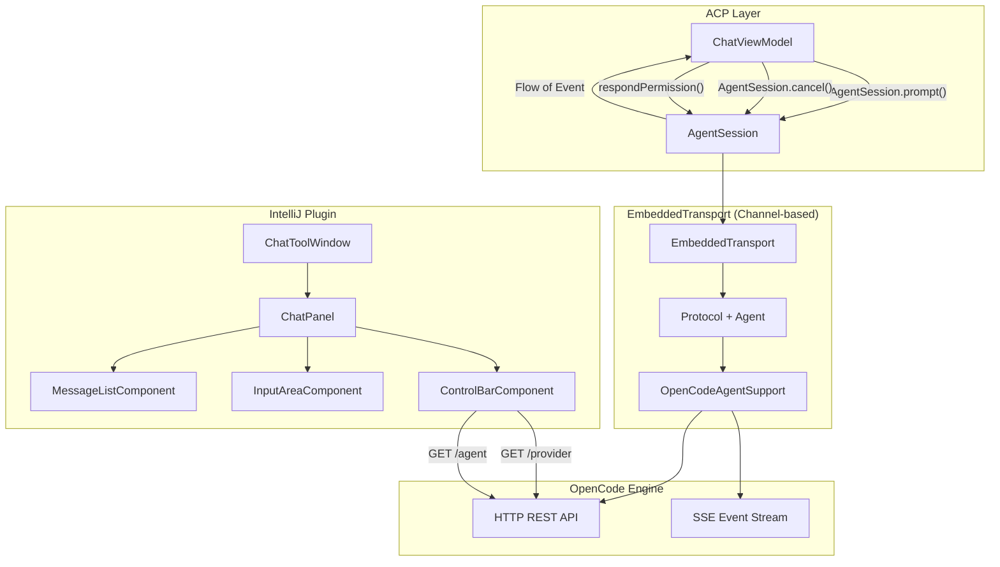

# Technical Design Document: Chat Interface

> **Status:** Draft
> **Last Updated:** 2026-06-02
> **Related docs:**
> - [OpenCode ACP Server TDD](./opencode-acp-server.md)
> - [OpenCode Server API](https://opencode.ai/docs/server/)
> - [ACP Protocol v1](https://agentclientprotocol.com/protocol/v1/overview)

---

## 1. TL;DR

Build a Swing-based chat interface for the IntelliJ plugin that connects to the OpenCode ACP server via `EmbeddedTransport`. The UI uses a per-message component architecture: each message gets its own `JEditorPane` for completed HTML, while tool pills and permission prompts are separate Swing components in a vertical `BoxLayout`. Streaming uses a plain text buffer that renders markdown-to-HTML only when the message completes, avoiding O(n²) re-parsing. A bottom control bar lets users select agent, model, and thinking effort. All Swing mutations are dispatched to the EDT via `Dispatchers.EDT`.

---

## 2. Context & Scope

### 2.1 Current State

The ACP server (`opencode-acp-server.md`) is complete and handles all protocol-level communication with OpenCode. The `EmbeddedTransport` provides an in-process channel-based bridge for IntelliJ plugin integration. However, there is no UI — the plugin is a headless ACP agent that requires an external editor to display messages.

### 2.2 Problem Statement

IntelliJ users need a native chat interface within the IDE to interact with OpenCode agents. The interface must support the full ACP message lifecycle: sending prompts, displaying streaming responses, showing tool call status, handling permission requests (via ACP `session/request_permission` JSON-RPC callbacks), and controlling session parameters (agent, model, thinking effort).

---

## 3. Goals & Non-Goals

### Goals

- Provide a Swing-based chat panel in an IntelliJ Tool Window
- Render user and assistant messages with full markdown support
- Display tool call pills with status indicators (pending → completed/failed)
- Show thinking/reasoning content from `SessionUpdate.Thought` events
- Support inline permission prompts responding via ACP `session/request_permission`
- Agent, model, and thinking effort selectors in a bottom control bar
- Single active session per tool window instance
- Proper EDT threading for all Swing mutations
- Incremental message updates (no full-list replacement during streaming)
- `Disposable` lifecycle management for all components

### Non-Goals

- Multiple concurrent sessions in tabs (v2)
- Image content display (v1 is text-only)
- Editor gutter actions or notification balloons (tool window only)
- Expandable tool pill input/output detail view (v1 shows status + tooltip only)

---

## 4. Proposed Solution

A per-message component architecture: each chat message is a `JEditorPane` (for completed markdown HTML) placed inside a vertical `BoxLayout` panel. Tool pills, thinking indicators, and permission prompts are separate Swing `JComponent` instances — not HTML elements. Streaming accumulates raw text in a buffer; markdown-to-HTML rendering happens only when the message completes (or on explicit flush). This avoids O(n²) re-parsing during streaming and makes tool pill updates trivial (just update the pill component's state).

### 4.1 Architecture Diagram



| Component | Responsibility |
|-----------|---------------|
| ChatToolWindow | Tool Window factory, creates `ChatPanel` with `Disposable` lifecycle |
| ChatPanel | Main container, EDT dispatch, disposable (registers with parent) |
| MessageListComponent | `JPanel` with `BoxLayout.Y_AXIS` — one child per message/pill |
| InputAreaComponent | Multi-line text input with Enter-to-send, Shift+Enter for newline |
| ControlBarComponent | Agent, model, thinking effort selectors |
| ChatViewModel | Bridge UI ↔ ACP `AgentSession`, manages state on `Dispatchers.Default` |

### 4.2 Component & Module Design

> **Omitted** per Mini TDD guidelines. See 4.7 for data/class definitions.

### 4.3 API / Interface Design

The chat interface communicates with OpenCode through the ACP protocol layer:

**ACP Protocol (via EmbeddedTransport → AgentSession):**
- `AgentSupport.initialize()` — plugin registers with ACP
- `AgentSupport.createSession()` — new chat session
- `AgentSession.prompt(content, meta)` — send user message, receive `Flow<Event>`
  - `meta` JSON can include `{"variant": "high"}` for thinking effort
- `AgentSession.cancel()` — abort current generation
- `session/request_permission` — ACP routes permission requests to UI, UI responds via protocol

**OpenCode REST API (via OpenCodeClient, used only for metadata):**
- `GET /provider` — list providers and their models (cached at application level)
- `GET /agent` — list available agents (cached at application level)

**`GET /provider` Response Shape (verified against OpenCode source):**
```json
{
  "all": [
    {
      "id": "anthropic",
      "name": "Anthropic",
      "env": ["ANTHROPIC_API_KEY"],
      "models": {
        "claude-sonnet-4-5-20250929": {
          "id": "claude-sonnet-4-5-20250929",
          "name": "Claude Sonnet 4.5",
          "reasoning": true,
          "tool_call": true,
          "attachment": false,
          "temperature": true,
          "release_date": "2025-09-29",
          "cost": { "input": 3.0, "output": 15.0 },
          "limit": { "context": 200000, "output": 8192 }
        }
      }
    }
  ],
  "default": { "anthropic": "claude-sonnet-4-5-20250929" },
  "connected": ["anthropic", "openai"]
}
```

> **Note:** Permission responses go through the ACP protocol, NOT directly to the OpenCode REST API.

**Thinking Effort:** Passed as `variant` field in the `_meta` JSON of `AgentSession.prompt()`. Per-message (not per-session). Values: `"none"`, `"low"`, `"medium"`, `"high"`. The OpenCode engine maps this to provider-specific parameters.

> **Implementation note:** `OpenCodeClient.sendMessageAsync()` must be extended to accept a `variant` parameter. This is a prerequisite for the thinking effort feature.

**Sub-agent/Task Events:** Sub-agent activity arrives as regular `tool_use`/`tool_result` SSE pairs through the parent session. The `task` tool includes metadata with `session_id` and `summary`. No distinct SSE event type exists for sub-agents — they are represented as tool calls with `ToolKind.OTHER`.

**Thought Events:** `SessionUpdate.Thought` events stream model reasoning content. The UI renders this in a collapsible thinking pill within the assistant message.

### 4.4 Key Flows

> **Omitted** per Mini TDD guidelines.

### 4.5 Technology Stack

| Layer | Technology | Version | Rationale |
|-------|-----------|---------|-----------|
| Language | Kotlin | 2.1.20 | Project standard |
| UI Framework | Swing | — | IntelliJ native, user preference |
| Look & Feel | IntelliJ Platform LaF | — | Managed by IntelliJ — no additional LaF dependency needed |
| Markdown | Flexmark | 0.64.8 | Mature Java markdown renderer (see 4.5.1 for classloader notes) |
| Code Highlighting | RSyntaxTextArea | 3.4.0 | Tool output code blocks (detached popups only, not in message list) |
| Build | Gradle | — | Project standard |
| ACP | EmbeddedTransport | — | In-process channel-based ACP bridge |
| ACP SDK | `com.agentclientprotocol:acp` | 0.3.0-SNAPSHOT | Matches server TDD |

> **FlatLaf not needed:** IntelliJ already manages the Look & Feel. Adding FlatLaf would conflict with IntelliJ's LaF management.

#### 4.5.1 Flexmark Classloader Notes

Flexmark has transitive dependencies that can conflict with IntelliJ's `PluginClassLoader`:
- `org.jetbrains:annotations` — IntelliJ bundles its own version
- `junit:junit` — test dependency leaked into compile scope (fixed in Flexmark 0.61.0+)

**Mitigation:** Use `flexmark` core + only the extensions needed, NOT `flexmark-all`. Explicitly exclude transitive deps:

```kotlin
implementation("com.vladsch.flexmark:flexmark:0.64.8") {
    exclude(group = "org.jetbrains", module = "annotations")
    exclude(group = "junit", module = "junit")
}
implementation("com.vladsch.flexmark:flexmark-ext-gfm-strikethrough:0.64.8") {
    exclude(group = "org.jetbrains", module = "annotations")
}
implementation("com.vladsch.flexmark:flexmark-ext-tables:0.64.8") {
    exclude(group = "org.jetbrains", module = "annotations")
}
```

### 4.6 Migration Strategy

> **Omitted** per Mini TDD guidelines.

### 4.7 Implementation Blueprint

#### 4.7.1 Data Models & Schemas

```kotlin
// --- Chat UI Models ---

/** Display model for a single message in the chat list. */
data class ChatMessage(
    val id: String,               // UUID, stable identifier
    val role: MessageRole,
    val content: String,          // accumulated raw markdown text
    val renderedHtml: String? = null,  // rendered HTML (null while streaming)
    val timestamp: Long,
    val toolCalls: List<ToolCallPill> = emptyList(),
    val thinkingContent: String = "",
    val isStreaming: Boolean = false
)

enum class MessageRole { USER, ASSISTANT }

/** Display model for a tool call pill. */
data class ToolCallPill(
    val toolCallId: String,       // ACP ToolCallId.value — stable identifier
    val toolName: String,
    val title: String,
    val kind: ToolKind,           // from ACP SDK
    val status: ToolCallStatus    // from ACP SDK: PENDING, COMPLETED, FAILED
)

/** Display model for a permission prompt inline in chat. */
data class PermissionPrompt(
    val permissionId: String,     // ACP permission ID for response routing
    val toolCallId: String,
    val toolName: String,
    val description: String?,
    val options: List<PermissionOption>,  // from ACP SDK
    val expiresAt: Long? = null   // timeout timestamp (epoch ms)
)

/** Bottom bar state. */
data class ControlBarState(
    val agents: List<OpenCodeAgentInfo>,
    val selectedAgent: OpenCodeAgentInfo? = null,
    val models: List<ProviderModel>,
    val selectedModel: ProviderModel? = null,
    val thinkingEffort: ThinkingEffort = ThinkingEffort.DEFAULT
)

/** Agent info from OpenCode REST API (distinct from ACP SDK AgentInfo). */
data class OpenCodeAgentInfo(
    val id: String,
    val name: String,
    val description: String? = null
)

/** Provider info from GET /provider. */
data class ProviderInfo(
    val id: String,
    val name: String,
    val models: Map<String, ModelInfo>
)

/** Model info nested inside a provider from GET /provider. */
data class ModelInfo(
    val id: String,
    val name: String,
    val reasoning: Boolean = false,
    val toolCall: Boolean = false,
    val contextLimit: Int = 0,
    val outputLimit: Int = 0
)

/** Flattened model selection for the control bar. */
data class ProviderModel(
    val providerID: String,
    val modelID: String,
    val displayName: String,
    val reasoning: Boolean = false
)

enum class ThinkingEffort(val label: String, val variant: String?) {
    NONE("None", "none"),
    LOW("Low", "low"),
    MEDIUM("Medium", "medium"),
    HIGH("High", "high"),
    DEFAULT("Default", null)
}

/** Connection state for the chat panel. */
enum class ConnectionState {
    DISCONNECTED,
    CONNECTING,
    CONNECTED,
    RECONNECTING,
    ERROR
}

/** Permission response options (strongly typed, not strings). */
enum class PermissionResponse(val optionId: String) {
    ALLOW_ONCE("allow-once"),
    REJECT_ONCE("reject-once"),
    ALLOW_ALWAYS("allow-always")
}
```

#### 4.7.2 Class & Interface Definitions

```kotlin
// --- Tool Window ---

class ChatToolWindowFactory : ToolWindowFactory {
    override fun createToolWindowContent(project: Project, toolWindow: ToolWindow) {
        val panel = ChatPanel(project, toolWindow.disposable)
        toolWindow.contentManager.addContent(
            ContentFactory.getInstance().createContent(panel, "", false)
        )
    }
}

// --- Chat Panel (main UI container) ---

class ChatPanel(
    private val project: Project,
    parentDisposable: Disposable
) : JPanel(BorderLayout()), Disposable {
    private val scope = CoroutineScope(SupervisorJob() + Dispatchers.EDT)
    private val viewModel: ChatViewModel
    private val messageList: MessageListComponent
    private val inputArea: InputAreaComponent
    private val controlBar: ControlBarComponent
    private val connectionBanner: ConnectionBannerComponent

    init {
        Disposer.register(parentDisposable, this)

        // Wire EDT dispatch: ViewModel flows → Swing updates
        scope.launch {
            viewModel.messages.collect { messages ->
                messageList.syncMessages(messages)
            }
        }
        scope.launch {
            viewModel.connectionState.collect { state ->
                connectionBanner.updateState(state)
                inputArea.setEnabled(state == ConnectionState.CONNECTED)
            }
        }
        scope.launch {
            viewModel.controlState.collect { state ->
                controlBar.updateState(state)
            }
        }

        // Assemble layout
        add(connectionBanner, BorderLayout.NORTH)
        add(messageList, BorderLayout.CENTER)
        add(inputArea, BorderLayout.SOUTH)
        add(controlBar, BorderLayout.PAGE_END)
    }

    override fun dispose() {
        scope.cancel()
        viewModel.dispose()
    }
}

// --- Message List ---

/**
 * JPanel with BoxLayout.Y_AXIS. Each message is a child component:
 * - USER message: styled JLabel
 * - ASSISTANT message: JEditorPane (markdown HTML)
 * - Tool pill: JPanel with icon + label
 * - Thinking pill: collapsible JPanel with content
 * - Permission prompt: JPanel with Allow/Reject buttons
 *
 * syncMessages() compares the current children against the desired state
 * and appends/replaces only the changed components.
 */
class MessageListComponent : JPanel() {
    private val messageComponents = mutableMapOf<String, JComponent>()  // messageId → component
    private val scrollPane = JBScrollPane(this)

    /** Get the scrollable wrapper (used by ChatPanel layout). */
    valScrollPane: JBScrollPane get() = scrollPane

    /**
     * Sync displayed messages with the model. Appends new messages,
     * updates streaming messages, removes evicted messages.
     * Runs on EDT (collected from StateFlow via invokeLater).
     */
    fun syncMessages(messages: List<ChatMessage>) {
        // 1. Remove components for messages no longer in the list
        val currentIds = messages.map { it.id }.toSet()
        messageComponents.keys.filter { it !in currentIds }.forEach { id ->
            messageComponents.remove(id)?.let { remove(it) }
        }
        // 2. For each message in order, create or update component
        messages.forEach { msg ->
            val existing = messageComponents[msg.id]
            if (existing == null) {
                // New message — create component
                val component = createMessageComponent(msg)
                messageComponents[msg.id] = component
                add(component)
            } else {
                // Existing message — update if streaming
                if (msg.isStreaming) {
                    updateStreamingMessage(existing, msg)
                }
            }
        }
        revalidate()
        repaint()
    }

    private fun createMessageComponent(message: ChatMessage): JComponent = when (message.role) {
        MessageRole.USER -> createUserMessageComponent(message)
        MessageRole.ASSISTANT -> createAssistantMessageComponent(message)
    }

    private fun createUserMessageComponent(message: ChatMessage): JComponent {
        // Styled JLabel with right-aligned background
        val label = JBLabel("<html><div style='...'>${escapeHtml(message.content)}</div></html>")
        // ... styling
        return label
    }

    private fun createAssistantMessageComponent(message: ChatMessage): JComponent {
        val panel = JPanel()
        panel.layout = BoxLayout(panel, BoxLayout.Y_AXIS)

        // Tool pills (above the text)
        message.toolCalls.forEach { pill ->
            panel.add(createToolPillComponent(pill))
        }

        // Thinking pill (if content exists)
        if (message.thinkingContent.isNotEmpty()) {
            panel.add(createThinkingPillComponent(message.thinkingContent))
        }

        // Message text (JEditorPane with rendered HTML)
        val editorPane = JEditorPane().apply {
            isEditable = false
            contentType = "text/html"
            text = message.renderedHtml ?: renderMarkdownToHtml(message.content)
        }
        panel.add(editorPane)

        return panel
    }

    private fun createToolPillComponent(pill: ToolCallPill): JComponent {
        val panel = JPanel(BorderLayout())
        val icon = ToolStatusDisplay.icon(pill.status)
        val label = JBLabel("${ToolStatusDisplay.label(pill.kind)}: ${pill.title}", icon, SwingConstants.LEFT)
        panel.add(label, BorderLayout.CENTER)
        panel.border = JBEmptyBorder(2, 8, 2, 8)
        // Tooltip with tool name
        panel.toolTipText = "Tool: ${pill.toolName} (${pill.status})"
        return panel
    }

    private fun createThinkingPillComponent(content: String): JComponent {
        val collapsible = CollapsiblePanel("Thinking...", content)
        return collapsible
    }

    private fun updateStreamingMessage(component: JComponent, message: ChatMessage) {
        // For streaming: the JEditorPane text is updated with accumulated markdown
        // rendered to HTML. This is a setText() call, but only on the streaming
        // message (at most 1 at a time), and the HTML is short during streaming.
        val editorPane = findEditorPane(component) ?: return
        editorPane.text = renderMarkdownToHtml(message.content)
    }

    private fun findEditorPane(component: JComponent): JEditorPane? {
        // Walk component tree to find JEditorPane
        // ...
        return null
    }
}

// --- Input Area ---

class InputAreaComponent(
    private val onSend: (String) -> Unit,
    private val onCancel: () -> Unit
) : JPanel(BorderLayout()) {
    private val textArea: JBTextArea = JBTextArea(3, 50)
    private val sendButton: ActionButton
    private val cancelButton: ActionButton

    init {
        // Enter → send, Shift+Enter → newline
        textArea.inputMap.put(KeyStroke.getKeyStroke(KeyEvent.VK_ENTER, 0), "send")
        textArea.actionMap.put("send", object : AbstractAction() {
            override fun actionPerformed(e: ActionEvent) {
                val text = textArea.text.trim()
                if (text.isNotEmpty()) {
                    onSend(text)
                    textArea.text = ""
                }
            }
        })
        textArea.inputMap.put(KeyStroke.getKeyStroke(KeyEvent.VK_ENTER, InputEvent.SHIFT_DOWN_MASK), "newline")
        textArea.actionMap.put("newline", object : AbstractAction() {
            override fun actionPerformed(e: ActionEvent) {
                textArea.insert("\n", textArea.caretPosition)
            }
        })

        // Escape → cancel
        textArea.inputMap.put(KeyStroke.getKeyStroke(KeyEvent.VK_ESCAPE, 0), "cancel")
        textArea.actionMap.put("cancel", object : AbstractAction() {
            override fun actionPerformed(e: ActionEvent) = onCancel()
        })

        sendButton = ActionButton(/* send icon */, { onSend(textArea.text.trim()) }, "Send")
        cancelButton = ActionButton(/* cancel icon */, { onCancel() }, "Cancel")
        cancelButton.isVisible = false

        add(JBScrollPane(textArea), BorderLayout.CENTER)
        val buttonPanel = JPanel()
        buttonPanel.add(sendButton)
        buttonPanel.add(cancelButton)
        add(buttonPanel, BorderLayout.EAST)
    }

    fun clear() { textArea.text = "" }
    fun setEnabled(enabled: Boolean) { textArea.isEnabled = enabled; sendButton.isEnabled = enabled }
    fun showCancelMode(isStreaming: Boolean) {
        sendButton.isVisible = !isStreaming
        cancelButton.isVisible = isStreaming
    }
}

// --- Control Bar ---

class ControlBarComponent(
    private val onAgentChanged: (OpenCodeAgentInfo) -> Unit,
    private val onModelChanged: (ProviderModel) -> Unit,
    private val onThinkingChanged: (ThinkingEffort) -> Unit
) : JPanel(FlowLayout(FlowLayout.LEFT)) {
    private val agentCombo: JBComboBox<OpenCodeAgentInfo>
    private val modelCombo: JBComboBox<ProviderModel>
    private val thinkingCombo: JBComboBox<ThinkingEffort>

    init {
        agentCombo = JBComboBox()
        agentCombo.renderer = object : ListCellRenderer<OpenCodeAgentInfo> {
            override fun getListCellRendererComponent(
                list: JList<out OpenCodeAgentInfo>, value: OpenCodeAgentInfo?,
                index: Int, isSelected: Boolean, cellHasFocus: Boolean
            ): Component = JBLabel(value?.name ?: "Select Agent")
        }
        agentCombo.addActionListener {
            (agentCombo.selectedItem as? OpenCodeAgentInfo)?.let(onAgentChanged)
        }

        modelCombo = JBComboBox()
        modelCombo.renderer = object : ListCellRenderer<ProviderModel> {
            override fun getListCellRendererComponent(
                list: JList<out ProviderModel>, value: ProviderModel?,
                index: Int, isSelected: Boolean, cellHasFocus: Boolean
            ): Component = JBLabel(value?.displayName ?: "Select Model")
        }
        modelCombo.addActionListener {
            (modelCombo.selectedItem as? ProviderModel)?.let(onModelChanged)
        }

        thinkingCombo = JBComboBox(ThinkingEffort.entries.toTypedArray())
        thinkingCombo.renderer = object : ListCellRenderer<ThinkingEffort> {
            override fun getListCellRendererComponent(
                list: JList<out ThinkingEffort>, value: ThinkingEffort?,
                index: Int, isSelected: Boolean, cellHasFocus: Boolean
            ): Component = JBLabel(value?.label ?: "Default")
        }
        thinkingCombo.addActionListener {
            (thinkingCombo.selectedItem as? ThinkingEffort)?.let(onThinkingChanged)
        }

        add(JBLabel("Agent:")); add(agentCombo)
        add(JBLabel("Model:")); add(modelCombo)
        add(JBLabel("Thinking:")); add(thinkingCombo)
    }

    fun updateState(state: ControlBarState) {
        // Update combo models without triggering action listeners
        agentCombo.model = DefaultComboBoxModel(state.agents.toTypedArray())
        agentCombo.selectedItem = state.selectedAgent
        modelCombo.model = DefaultComboBoxModel(state.models.toTypedArray())
        modelCombo.selectedItem = state.selectedModel
        thinkingCombo.selectedItem = state.thinkingEffort
        // Disable thinking combo if model doesn't support reasoning
        thinkingCombo.isEnabled = state.selectedModel?.reasoning == true
    }
}

// --- Connection Banner ---

class ConnectionBannerComponent(
    private val onRetry: () -> Unit
) : JPanel(BorderLayout()) {
    private val label = JBLabel()
    private val retryButton = ActionButton(/* retry icon */, { onRetry() }, "Retry")

    init {
        isVisible = false
        add(label, BorderLayout.CENTER)
        add(retryButton, BorderLayout.EAST)
    }

    fun updateState(state: ConnectionState) {
        when (state) {
            ConnectionState.DISCONNECTED -> {
                isVisible = true
                label.text = "Not connected to OpenCode"
                retryButton.isVisible = true
            }
            ConnectionState.CONNECTING -> {
                isVisible = true
                label.text = "Connecting..."
                retryButton.isVisible = false
            }
            ConnectionState.CONNECTED -> { isVisible = false }
            ConnectionState.RECONNECTING -> {
                isVisible = true
                label.text = "Reconnecting..."
                retryButton.isVisible = false
            }
            ConnectionState.ERROR -> {
                isVisible = true
                label.text = "Connection failed"
                retryButton.isVisible = true
            }
        }
    }
}

// --- Chat ViewModel ---

class ChatViewModel(
    private val project: Project,
    private val scope: CoroutineScope
) : Disposable {

    // --- State ---
    private val _messages = MutableStateFlow<List<ChatMessage>>(emptyList())
    val messages: StateFlow<List<ChatMessage>> = _messages.asStateFlow()

    private val _connectionState = MutableStateFlow(ConnectionState.DISCONNECTED)
    val connectionState: StateFlow<ConnectionState> = _connectionState.asStateFlow()

    private val _controlState = MutableStateFlow(ControlBarState())
    val controlState: StateFlow<ControlBarState> = _controlState.asStateFlow()

    private val _isStreaming = MutableStateFlow(false)
    val isStreaming: StateFlow<Boolean> = _isStreaming.asStateFlow()

    // --- Internal ---
    private var agentSession: AgentSession? = null
    private val toolCallIndex = mutableMapOf<String, String>()  // toolCallId → messageId (stable)
    private val messageIndex = mutableMapOf<String, Int>()       // messageId → position in list

    // --- Lifecycle ---

    suspend fun initialize() {
        _connectionState.value = ConnectionState.CONNECTING
        try {
            // 1. Health check via OpenCodeClient
            // 2. Load agents and models
            val agents = openCodeClient.listAgents()
            val providers = openCodeClient.listProviders()
            val models = providers.flatMap { provider ->
                provider.models.values.map { model ->
                    ProviderModel(
                        providerID = provider.id,
                        modelID = model.id,
                        displayName = "${provider.name} / ${model.name}",
                        reasoning = model.reasoning
                    )
                }
            }
            _controlState.value = ControlBarState(
                agents = agents.map { OpenCodeAgentInfo(it.id, it.name, it.description) },
                models = models,
                selectedModel = models.firstOrNull()
            )

            // 3. Create ACP session
            val session = agentSupport.createSession(SessionCreationParameters(cwd = project.basePath ?: "."))
            agentSession = session
            _connectionState.value = ConnectionState.CONNECTED
        } catch (e: Exception) {
            _connectionState.value = ConnectionState.ERROR
        }
    }

    suspend fun sendMessage(text: String) {
        val session = agentSession ?: return
        val variant = _controlState.value.thinkingEffort.variant

        // Add user message to list
        val userMsg = ChatMessage(
            id = generateId(),
            role = MessageRole.USER,
            content = text,
            timestamp = System.currentTimeMillis()
        )
        addMessage(userMsg)

        // Create streaming assistant message
        val assistantMsg = ChatMessage(
            id = generateId(),
            role = MessageRole.ASSISTANT,
            content = "",
            isStreaming = true
        )
        addMessage(assistantMsg)

        _isStreaming.value = true

        // Build meta JSON with variant if set
        val meta: JsonElement? = variant?.let {
            buildJsonObject { put("variant", it) }
        }

        // Send via ACP
        val content = listOf(ContentBlock.Text(text = text))
        try {
            session.prompt(content, meta).collect { event ->
                handleEvent(event, assistantMsg.id)
            }
        } catch (e: CancellationException) {
            markStreamingComplete(assistantMsg.id, cancelled = true)
        } finally {
            _isStreaming.value = false
        }
    }

    suspend fun cancel() {
        agentSession?.cancel()
        _isStreaming.value = false
    }

    suspend fun respondPermission(permissionId: String, response: PermissionResponse) {
        agentSession?.respondPermission(permissionId, response.optionId)
    }

    override fun dispose() {
        agentSession?.cancel()
        agentSession = null
    }

    // --- Event Handling ---

    private suspend fun handleEvent(event: Event, assistantMessageId: String) {
        when (event) {
            is Event.SessionUpdateEvent -> handleSessionUpdate(event.update, assistantMessageId)
            is Event.PromptResponseEvent -> handlePromptResponse(event.response, assistantMessageId)
        }
    }

    private suspend fun handleSessionUpdate(update: SessionUpdate, assistantMessageId: String) {
        when (update) {
            is SessionUpdate.AgentMessageChunk -> {
                val text = (update.content as? ContentBlock.Text)?.text ?: return
                appendTextToMessage(assistantMessageId, text)
            }
            is SessionUpdate.UserMessageChunk -> {
                // Session load replay — insert user message
                val text = (update.content as? ContentBlock.Text)?.text ?: return
                val userMsg = ChatMessage(
                    id = generateId(),
                    role = MessageRole.USER,
                    content = text,
                    timestamp = System.currentTimeMillis()
                )
                addMessage(userMsg)
            }
            is SessionUpdate.ToolCall -> {
                val pill = ToolCallPill(
                    toolCallId = update.toolCallId.value,
                    toolName = update.title ?: "tool",
                    title = update.title ?: "tool",
                    kind = update.kind,
                    status = ToolCallStatus.PENDING
                )
                toolCallIndex[pill.toolCallId] = assistantMessageId
                addToolCallPill(assistantMessageId, pill)
            }
            is SessionUpdate.ToolCallUpdate -> {
                val messageId = toolCallIndex[update.toolCallId.value] ?: return
                updateToolCallStatus(messageId, update.toolCallId.value, update.status)
            }
            is SessionUpdate.Thought -> {
                val text = (update.content as? ContentBlock.Text)?.text ?: return
                appendThinkingContent(assistantMessageId, text)
            }
            is SessionUpdate.PlanUpdate -> { /* plan display — v2 */ }
            is SessionUpdate.AvailableCommandsUpdate -> { /* command autocomplete — v2 */ }
            is SessionUpdate.ConfigOptionsUpdate -> { /* config display — v2 */ }
            is SessionUpdate.CurrentModeUpdate -> { /* mode indicator — v2 */ }
            is SessionUpdate.SessionInfoUpdate -> { /* session title — v2 */ }
        }
    }

    private fun handlePromptResponse(response: PromptResponse, assistantMessageId: String) {
        markStreamingComplete(assistantMessageId)
        when (response.stopReason) {
            StopReason.MAX_TOKENS -> { /* truncation warning */ }
            StopReason.REFUSAL -> { /* refusal message */ }
            StopReason.CANCELLED -> { /* cancelled indicator */ }
            StopReason.END_TURN -> { /* normal completion */ }
            StopReason.MAX_TURN_REQUESTS -> { /* max turns warning */ }
        }
    }

    // --- State Mutations (run on Dispatchers.Default) ---

    private fun addMessage(message: ChatMessage) {
        _messages.value = _messages.value + message
        messageIndex[message.id] = _messages.value.size - 1
        // Enforce FIFO eviction
        if (_messages.value.size > ChatConstants.MAX_MESSAGE_HISTORY) {
            val (evicted, remaining) = _messages.value.partition { msg ->
                _messages.value.indexOf(msg) < _messages.value.size - ChatConstants.MAX_MESSAGE_HISTORY
            }
            evicted.forEach { messageIndex.remove(it.id) }
            _messages.value = remaining
            // Rebuild messageIndex
            messageIndex.clear()
            _messages.value.forEachIndexed { i, msg -> messageIndex[msg.id] = i }
        }
    }

    private fun appendTextToMessage(messageId: String, text: String) {
        val messages = _messages.value.toMutableList()
        val index = messageIndex[messageId] ?: return
        val msg = messages[index]
        messages[index] = msg.copy(content = msg.content + text)
        _messages.value = messages
    }

    private fun markStreamingComplete(messageId: String, cancelled: Boolean = false) {
        val messages = _messages.value.toMutableList()
        val index = messageIndex[messageId] ?: return
        val msg = messages[index]
        messages[index] = msg.copy(
            isStreaming = false,
            renderedHtml = renderMarkdownToHtml(msg.content)
        )
        _messages.value = messages
    }

    private fun addToolCallPill(messageId: String, pill: ToolCallPill) {
        val messages = _messages.value.toMutableList()
        val index = messageIndex[messageId] ?: return
        val msg = messages[index]
        messages[index] = msg.copy(toolCalls = msg.toolCalls + pill)
        _messages.value = messages
    }

    private fun updateToolCallStatus(messageId: String, toolCallId: String, status: ToolCallStatus) {
        val messages = _messages.value.toMutableList()
        val index = messageIndex[messageId] ?: return
        val msg = messages[index]
        val updatedPills = msg.toolCalls.map { pill ->
            if (pill.toolCallId == toolCallId) pill.copy(status = status) else pill
        }
        messages[index] = msg.copy(toolCalls = updatedPills)
        _messages.value = messages
    }

    private fun appendThinkingContent(messageId: String, text: String) {
        val messages = _messages.value.toMutableList()
        val index = messageIndex[messageId] ?: return
        val msg = messages[index]
        messages[index] = msg.copy(thinkingContent = msg.thinkingContent + text)
        _messages.value = messages
    }

    // --- Helpers ---

    private fun generateId(): String = UUID.randomUUID().toString()
}
```

#### 4.7.3 Function Signatures

```kotlin
/** Renders markdown to sanitized HTML. Disables raw HTML to prevent XSS. */
fun renderMarkdownToHtml(markdown: String): String {
    val parser = Parser.builder()
        .allowRawHtml(false)      // Security: disable raw HTML in markdown
        .build()
    val renderer = HtmlRenderer.builder()
        .escapeHtml(true)
        .build()
    val document = parser.parse(markdown)
    return renderer.render(document)
}

/** Escape HTML for user message display. */
fun escapeHtml(text: String): String = text
    .replace("&", "&amp;")
    .replace("<", "&lt;")
    .replace(">", "&gt;")
    .replace("\"", "&quot;")
```

#### 4.7.4 Component Mapping

| Component | Responsibility | Data Model(s) | Key Class(es) |
|-----------|---------------|---------------|---------------|
| Tool Window | Register chat panel with Disposable lifecycle | — | `ChatToolWindowFactory` |
| Chat Panel | Main container, EDT dispatch, disposable (registers with parent) | `ChatMessage`, `ConnectionState` | `ChatPanel` |
| Message List | Per-message components in BoxLayout, syncs with model | `ChatMessage`, `ToolCallPill` | `MessageListComponent` |
| Input Area | Text input with Enter-to-send, Shift+Enter newline, Escape cancel | — | `InputAreaComponent` |
| Control Bar | Agent/model/thinking selectors (cached data) | `ControlBarState`, `ProviderModel` | `ControlBarComponent` |
| Connection Banner | Show connection status + retry | `ConnectionState` | `ConnectionBannerComponent` |
| ViewModel | Bridge UI ↔ ACP AgentSession, state management | — | `ChatViewModel` |

#### 4.7.5 Enums, Constants & Configuration

```kotlin
object ChatConstants {
    const val TOOL_WINDOW_ID = "OpenCodeChat"
    const val MAX_MESSAGE_HISTORY = 500
    const val THINKING_INDICATOR_DELAY_MS = 300L
    const val PERMISSION_TIMEOUT_MS = 60_000L
    const val RECONNECT_DELAY_MS = 1_000L
    const val RECONNECT_MAX_DELAY_MS = 30_000L
}

object ToolStatusDisplay {
    fun icon(status: ToolCallStatus): Icon = when (status) {
        ToolCallStatus.PENDING -> AllIcons.Process.StepPending
        ToolCallStatus.COMPLETED -> AllIcons.Process.StepPassed
        ToolCallStatus.FAILED -> AllIcons.Process.StepFailed
    }

    fun label(kind: ToolKind): String = when (kind) {
        ToolKind.EXECUTE -> "Running"
        ToolKind.EDIT -> "Editing"
        ToolKind.READ -> "Reading"
        ToolKind.SEARCH -> "Searching"
        ToolKind.FETCH -> "Fetching"
        ToolKind.THINK -> "Thinking"
        ToolKind.OTHER -> "Processing"
    }
}

/** EDT dispatcher for Swing mutations. */
val Dispatchers.EDT: CoroutineDispatcher = object : CoroutineDispatcher() {
    override fun dispatch(context: CoroutineContext, block: Runnable) {
        SwingUtilities.invokeLater(block)
    }
}
```

#### 4.7.6 Error Types & Exception Contracts

```kotlin
sealed class ChatError(val message: String) {
    object SessionNotInitialized : ChatError("Session not initialized.")
    object NotConnected : ChatError("Cannot connect to OpenCode engine.")
    class SendFailed(val cause: Throwable) : ChatError(
        "Failed to send message: ${cause.message ?: cause.javaClass.simpleName}"
    )
    class PermissionTimeout(val permissionId: String) : ChatError("Permission request timed out.")
    object GenerationAborted : ChatError("Generation was cancelled by user.")
}
```

---

## 5. Assumptions & Dependencies

**Assumptions:**
- OpenCode engine is running and reachable (health check passes)
- `GET /provider` endpoint returns provider and model information (response shape verified)
- `variant` field in `_meta` JSON of `AgentSession.prompt()` is supported for thinking effort
- ACP `EmbeddedTransport` can be used in-process (existing code verified)
- IntelliJ platform provides `ToolWindowFactory`, `JBScrollPane`, `JEditorPane` APIs
- ACP SDK version `0.3.0-SNAPSHOT` matches server TDD
- Session auto-creates on tool window open (with `ConnectionState` feedback)

**Dependencies:**
- `com.agentclientprotocol:acp:0.3.0-SNAPSHOT` — ACP SDK
- `com.vladsch.flexmark:flexmark:0.64.8` — Markdown core (exclude transitive deps)
- `com.vladsch.flexmark:flexmark-ext-gfm-strikethrough:0.64.8` — Strikethrough support
- `com.vladsch.flexmark:flexmark-ext-tables:0.64.8` — Table support
- `com.fifesoft:rsyntaxtextarea:3.4.0` — Code syntax highlighting (detached popups only)
- IntelliJ Platform SDK — Tool Window, UI components, `AllIcons`

---

## 6. Alternatives Considered

**Alternative: Compose Multiplatform (Jewel)**
- *What it is:* Use JetBrains Jewel for a modern declarative UI.
- *Why rejected:* Requires IntelliJ 2025.1+, heavier dependency, Swing interop issues.

**Alternative: JCEF (Web-based UI)**
- *What it is:* Embed a Chromium browser and render a React-based chat UI.
- *Why rejected:* Heavier memory footprint, not native IntelliJ feel.

**Alternative: Single JEditorPane with HTML Document**
- *What it is:* One JEditorPane, incremental HTML insert via `HTMLEditorKit.insertHTML()`.
- *Why rejected:* `HTMLEditorKit.insertHTML()` triggers full DOM parse + View rebuild on every chunk. O(n²) during streaming. No API to update DOM elements by ID for tool pills. Worse than JBList for streaming.

---

## 7. Cross-Cutting Concerns

### 7.1 Security

- Markdown rendered with `allowRawHtml(false)` to prevent XSS via `<script>` or `` tags
- Permission responses use strongly typed `PermissionResponse` enum, not raw strings
- Auth tokens passed through `OpenCodeClient`, never exposed in UI

### 7.2 Reliability & Availability

- `ConnectionState` enum tracks connection lifecycle with visual feedback
- Exponential backoff reconnection with `RECONNECT_DELAY_MS` → `RECONNECT_MAX_DELAY_MS`
- `ConnectionBannerComponent` shows status + retry button on disconnection

### 7.3 Performance & Scalability

- Per-message components: only the streaming message gets `setText()` during streaming
- Completed messages are immutable `JEditorPane` instances — no re-rendering
- `toolCallIndex` maps `toolCallId → messageId` (stable UUID), not indices — survives FIFO eviction
- `messageIndex` maps `messageId → list position`, rebuilt on eviction
- `MAX_MESSAGE_HISTORY = 500` with FIFO eviction (oldest messages removed from both data and UI)

### 7.4 Observability

- Log ACP events at DEBUG level
- Log UI errors at ERROR level
- Log connection state transitions at INFO level

---

## 8. Testing Strategy

### 8.1 Testing Levels

| Level | What's Tested | Tools |
|-------|--------------|-------|
| Unit | ViewModel state transitions, event processing | JUnit 5 + kotlinx-coroutines-test |
| Integration | ACP event → UI state mapping | IntelliJ test framework + mocked AgentSession |
| UI | Message rendering, permission prompts | IntelliJ `IdeGuiTestCase` |

### 8.2 Key Scenarios

| Scenario | Validation |
|----------|-----------|
| Send message and receive streaming response | Message appears, text streams in, tool pills update |
| Tool call lifecycle | Pill transitions: pending → completed/failed |
| Thinking content display | Thought events render in collapsible pill |
| Permission prompt | Inline prompt appears, user clicks allow, ACP response sent |
| Model/agent switching | Selector changes apply to next message via `_meta` |
| Thinking effort selection | `variant` field included in prompt `_meta` JSON |
| Cancel generation | Stop button aborts, streaming stops, pills show final status |
| Connection failure | Banner shows error, retry button works, input disabled |
| Reconnection | Banner shows "Reconnecting...", exponential backoff |
| Long message list | Smooth scrolling with 200+ messages, oldest evicted at 500 |
| Session load replay | Messages appear incrementally, user messages included |
| User scrolls up during streaming | Auto-scroll suppressed |
| Enter to send, Shift+Enter for newline | Correct keybinding behavior |
| Permission timeout | Auto-dismiss with timeout message |
| Disposal | Tool window close properly cancels coroutines and sessions |
| XSS prevention | Raw HTML in markdown is escaped, not rendered |

---

## 9. Deployment & Rollout Plan

> **Omitted** per Mini TDD guidelines.

---

## 10. Resolved Design Decisions

| Decision | Resolution |
|----------|-----------|
| Session lifecycle | Auto-create on tool window open, with `ConnectionState` feedback |
| Message persistence | Use existing `SessionPersistence` from server TDD |
| Thinking effort plumbing | Pass `variant` in `_meta` JSON of `AgentSession.prompt()` |
| Message rendering | Per-message JEditorPane (not single HTML Document) |
| Tool pill rendering | Separate Swing components (not HTML elements) |
| Streaming strategy | Accumulate text, render HTML only on message completion |

---

## 11. Document History

| Date | Author | Change |
|------|--------|--------|
| 2026-06-02 | — | Initial draft |
| 2026-06-02 | — | Round 1 fixes: EDT threading, permission flow, Thought events, ConnectionState, Disposable, keyboard shortcuts, error rendering |
| 2026-06-02 | — | Verified GET /provider, removed FlatLaf, addressed Flexmark classloader, resolved open questions |
| 2026-06-02 | — | Round 2 fixes: Replaced single JEditorPane with per-message component architecture, added missing ViewModel methods, fixed toolCallIndex to use stable UUIDs, fixed Dispatchers.EDT syntax, added PermissionResponse enum, wired controlState collector, fixed Disposable registration, disabled raw HTML in markdown |
