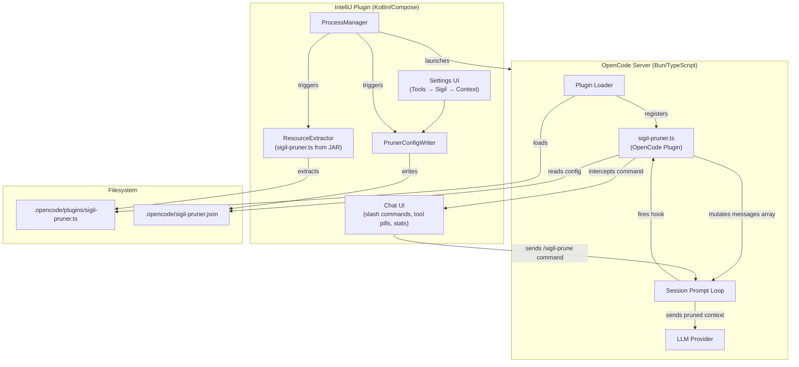
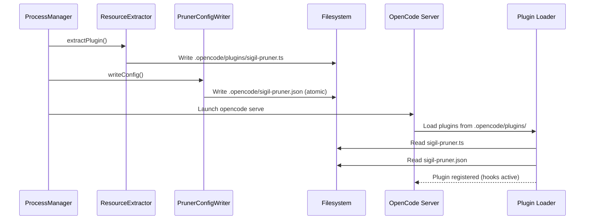
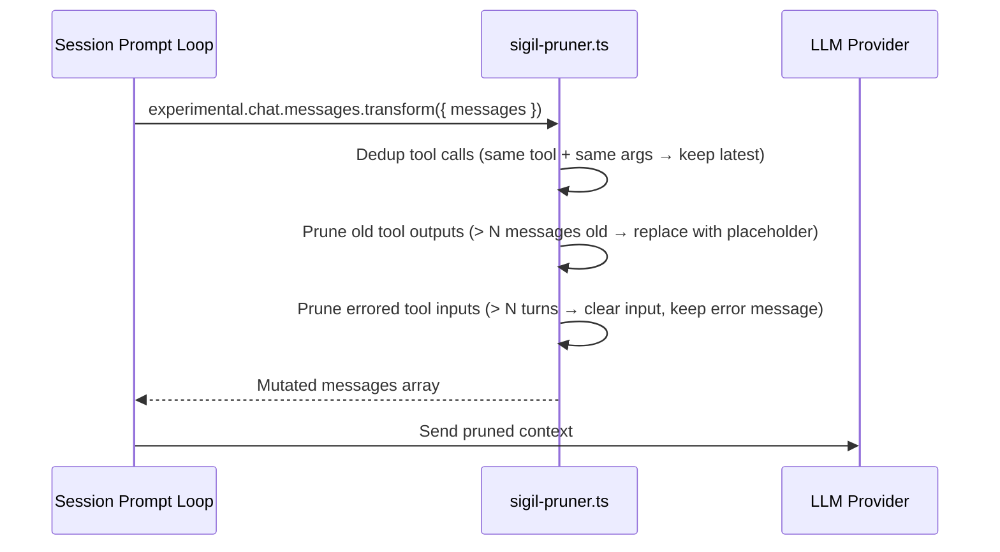
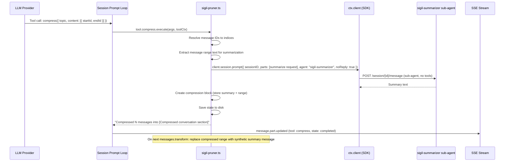

# Technical Design Document: Sigil Context Pruner

> **Status:** Implemented (Phases 1-3 + council review fixes applied)
> **Author(s):** —
> **Reviewer(s):** —
> **Last Updated:** 2026-06-27
> **Related docs:** [smart-compaction.md](smart-compaction.md), [context-manager.md](Done/context-manager.md), [intellij-mcp-integration.md](Done/intellij-mcp-integration.md), [AGENTS.md](../../AGENTS.md)

### Known Limitations

- **Cross-platform state path:** The TS plugin persists session state to `~/.local/share/opencode/storage/plugin/sigil-pruner/{sessionId}.json`. The directory name `.local/share` is a Linux/XDG convention — on macOS and Windows the actual resolved path (via `os.homedir()`) is different but functional. The path works on all platforms because `os.homedir()` is cross-platform, but the directory naming is Linux-specific.
- **Session ID sanitization:** The TS plugin now sanitizes session IDs before using them in file paths (replacing non-alphanumeric characters with `_`). Server-generated IDs (e.g., `ses_abc123`) are safe by default, but this provides defense-in-depth against unexpected ID formats.
- **Background compaction disabled:** The `BackgroundCompactor` class is retained as dead code. The server's `POST /session/{id}/summarize` performs actual compaction (not a preview), so auto-triggering would compact sessions immediately on load. Manual compaction (`/compact` command, "Compact Now" button) is the correct path.

---

## 1. TL;DR

The plugin's existing client-side context management (ToolOutputTruncator, FileReadCache, BackgroundCompactor) only affects the local UI cache — it does NOT reduce what the LLM sees, because the OpenCode server assembles full context from its own session history. To achieve real token savings, pruning must happen server-side via OpenCode's `experimental.chat.messages.transform` hook, which fires before every LLM call and gives mutable access to the message array.

This TDD proposes shipping a **TypeScript OpenCode plugin** (`sigil-pruner.ts`) from within our IntelliJ plugin. The Kotlin side manages lifecycle (extracts the `.ts` file to `.opencode/plugins/` before launching `opencode serve`), settings (writes `.opencode/sigil-pruner.json`), and UI (slash commands, stats display, tool pill rendering). The TypeScript side registers the server-side hooks that do the actual pruning. This mirrors the existing `McpConfigWriter` pattern of writing config files before `ProcessManager` launches the binary.

---

## 2. Context & Scope

### 2.1 Current State

**Client-side preprocessing (no token savings):**
- `ToolOutputTruncator` — truncates tool results > N chars in the local UI cache. The server still sends full outputs to the LLM.
- `FileReadCache` — detects duplicate file reads locally. The server still includes all reads in context.
- `BackgroundCompactor` — **DISABLED** (see AGENTS.md "Smart Compaction & Context Management" section). The server's `POST /session/{id}/summarize` performs actual compaction, not a preview. Auto-triggering it compacted sessions on load. **Do NOT re-enable the auto-trigger** — there is no server API to pre-compute a summary without side effects. This TDD's server-side `compress` tool is the correct alternative (in-memory mutation, no `/summarize` call).

**Server-side auto-compaction:**
- The server checks `compaction.isOverflow()` after each assistant response (`packages/opencode/src/session/overflow.ts`). If token usage exceeds the usable limit, it creates a compaction task with `auto: true`.
- This is a black box — users lose context without warning or control. The plugin has no influence over what gets compacted.

**OpenCode plugin system (Phase 0 verified):**
- `opencode serve` loads plugins from `.opencode/plugins/`, `~/.config/opencode/plugins/`, and npm packages listed in `opencode.json` under the `plugin` key.
- Local file plugins are loaded via `await import(entry)` (Bun dynamic import). No sandbox, no globals injected. The module's default export must be an object with a `server()` function.
- Plugins register hooks via an async function that returns a `Hooks` object.
- The `experimental.chat.messages.transform` hook receives `(input: {}, output: { messages: { info: Message.Info; parts: Part[] }[] })` and can mutate the array in place — whatever the array contains when the hook returns is what the LLM sees. **Confirmed dispatched** in `packages/opencode/src/session/prompt.ts` (~line 1053) before every LLM call, after tool resolution and system-reminder wrapping. The same array reference is passed to each hook; in-place mutations are visible to the caller.
- The `experimental.chat.system.transform` hook **IS dispatched** (not dead code as originally suspected) — in `packages/opencode/src/session/llm/request.ts:67-71` during LLM request preparation, and `packages/opencode/src/agent/agent.ts:374` during agent generation. It receives `(input: { sessionID?, model }, output: { system: string[] })` and mutates the system prompt string array. Fires AFTER `messages.transform`.
- The `command.execute.before` hook **IS dispatched** in `prompt.ts` after template expansion, before `prompt()`. Receives `(input: { command, sessionID, arguments }, output: { parts: Part[] })`. Can modify `output.parts` but CANNOT prevent execution or change the command name. The command MUST be registered first (via `config` hook) or `Command.get()` fails before the hook fires.
- The `config` hook mutates `opencodeConfig` in place; adding `opencodeConfig.command[name]` makes commands appear in `GET /command` responses. Confirmed by real-world plugins (DCP, oh-my-opencode-slim, opencode-model-router, mem0).
- Session history is never modified by plugins — transformations are in-memory, per-LLM-call.

**Existing patterns we reuse:**
- `McpConfigWriter` writes `.opencode/opencode.json` atomically before `ProcessManager.initialize()` launches the binary.
- `OpenCodeContextConfigurable` is the Settings → Tools → Sigil → Context panel.
- `ChatScreen.kt` merges local + server slash commands for the palette.
- `ToolPill` composable renders tool calls from SSE events.

### 2.2 Problem Statement

The plugin has no way to reduce the context the LLM actually sees. All existing "pruning" is client-side cosmetic — it makes the UI cleaner but doesn't save tokens or delay auto-compaction. Users hit the server's auto-compaction black box with no control over what gets summarized or when.

---

## 3. Goals & Non-Goals

### Goals

1. **Real token savings** — reduce the context window usage the LLM sees by pruning stale tool outputs, deduplicating repeated tool calls, and replacing old conversation ranges with summaries.
2. **LLM-driven compression** — expose a `compress` tool the model can call autonomously to summarize completed conversation sections, with the model deciding when and what to compress based on task completion. The `compress` tool makes a **separate LLM call** (via `client.session.prompt()` with a dedicated sub-agent) to generate high-quality summaries, rather than relying on the calling model to provide the summary in tool arguments.
3. **User control** — provide `/sigil-prune` slash commands for manual pruning (sweep, stats, compress) and a settings toggle to enable/disable the entire system.
4. **Zero AGPL contamination** — ship our own TypeScript plugin, not DCP or any AGPL-licensed code.
5. **Self-contained** — the `.ts` plugin must NOT depend on npm packages (no `@opencode-ai/plugin`, no zod). It uses plain JSON Schema for tool argument definitions and inline TypeScript interfaces for hook types.

### Non-Goals

- **Replacing server auto-compaction** — the server's overflow-based compaction remains the safety net. Our pruner delays it, not replaces it.
- **Persisting compression summaries to session history** — the `compress` tool transforms the in-memory message array only. It does NOT call `POST /session/{id}/summarize` (which performs actual server-side compaction and would race with our in-memory view).
- **Multi-version OpenCode compatibility** — we pin one OpenCode binary version (we already launch our own via `ProcessManager`). Version bumps are a migration task.
- **Bundling DCP** — we build our own plugin. DCP is a reference implementation, not a dependency.

---

## 4. Proposed Solution

**The Sigil Context Pruner is a two-part system: a self-contained TypeScript OpenCode plugin that runs server-side and a Kotlin management layer that runs in the IntelliJ plugin.** The TypeScript plugin registers `experimental.chat.messages.transform` (deterministic pruning before every LLM call), a `compress` tool (LLM-driven compression via a sub-agent LLM call), `command.execute.before` (slash command interception), and a `config` hook (command registration for palette visibility). The Kotlin layer extracts the `.ts` file from the JAR, writes config, and provides UI controls. Communication is one-directional for config (Kotlin writes file, TS reads file) and command-based for stats (slash commands return text output the existing chat UI already renders).

**Self-containment constraint (Phase 0 verified):** The `.ts` plugin is a local file plugin loaded from `.opencode/plugins/`. It has NO npm dependencies — no `@opencode-ai/plugin`, no zod. Tool argument schemas use plain JSON Schema objects (OpenCode's `fromPlugin()` in `tool/registry.ts` detects non-zod args via `isZodType` and takes the `legacyJsonSchema` path). Hook types are defined as inline TypeScript interfaces (structural typing works without the `@opencode-ai/plugin` package). The `tool()` helper is NOT used — tools are returned as plain objects with `{ description, args, execute }` shape.

### 4.1 Architecture Diagram



| Component | Responsibility |
|-----------|---------------|
| ResourceExtractor | Extracts `sigil-pruner.ts` from JAR resources to `.opencode/plugins/` before server launch |
| PrunerConfigWriter | Writes `.opencode/sigil-pruner.json` atomically from settings state |
| sigil-pruner.ts | TypeScript OpenCode plugin — registers hooks, performs pruning, handles commands |
| PromptLoop | OpenCode's session prompt loop — fires `experimental.chat.messages.transform` before LLM calls |
| Chat UI | Existing slash command palette + tool pill rendering — no new UI infrastructure needed |

### 4.2 Component & Module Design

```
src/main/resources/
└── opencode-plugins/
    └── sigil-pruner.ts          # TypeScript plugin (bundled in JAR)

src/main/kotlin/com/opencode/acp/
├── chat/processor/
│   └── PrunerConfigWriter.kt    # Writes .opencode/sigil-pruner.json
├── chat/processor/
│   └── PrunerResourceExtractor.kt  # Extracts .ts from JAR to .opencode/plugins/
└── config/settings/
    └── OpenCodeContextConfigurable.kt  # Extended with pruner settings
```

**4.2.1 Key Modules**

| Module | Responsibility | Key Exports | Dependencies |
|--------|---------------|-------------|-------------|
| `sigil-pruner.ts` | Server-side pruning plugin | `default` (object with `server()` function) | None (self-contained, no npm imports) |
| `PrunerConfigWriter` | Atomic config file writer | `writeConfig()`, `clearConfig()` | `OpenCodeSettingsState` |
| `PrunerResourceExtractor` | JAR resource extraction | `extractPlugin()`, `removePlugin()` | `ProcessManager` (launch timing) |
| `OpenCodeContextConfigurable` | Settings UI | Extended with pruner toggles | `OpenCodeSettingsState` |

**4.2.2 Events & Messages**

No new SSE event types. The pruner plugin consumes existing events (`message.part.updated` for `compress` tool timing) and the IntelliJ plugin sees `compress` tool calls as regular `message.part.updated` events with `part.tool === "compress"`.

**4.2.3 State Management**

| Component | State Held | Lifetime | Persistence |
|-----------|-----------|----------|-------------|
| sigil-pruner.ts | Per-session pruning state (dedup map, compression blocks, stats) | Session-scoped, cleared on session switch | `~/.local/share/opencode/storage/plugin/sigil-pruner/{sessionId}.json` |
| PrunerConfigWriter | None (stateless writer) | — | Config file on disk |
| IntelliJ settings | Pruner enabled flag, thresholds | IDE lifetime | `OpenCodeSettingsState` (XStream) |

**4.2.4 Error Handling**

| Error Scenario | Handling Strategy | User-facing Impact |
|---------------|-------------------|-------------------|
| Hook signature changed (OpenCode version mismatch) | TS plugin wraps registration in try/catch, logs error, disables itself | Pruning silently disabled; server continues normally |
| Config file missing or invalid | TS plugin uses defaults | Pruning runs with default settings |
| `compress` tool fails (LLM error, invalid range) | Tool returns error string to LLM | LLM sees error in tool output, can retry |
| Resource extraction fails (disk full, permissions) | `ProcessManager` logs warning, continues without pruner | Pruning unavailable; server runs normally |
| State persistence fails (disk full, permissions, path missing) | TS plugin logs warning, continues with in-memory state only (no disk reload on restart) | Pruning state lost on server restart; pruning continues for current session |
| State file corrupt (JSON parse error on load) | TS plugin catches parse error, starts fresh state, logs warning | Pruning resets (dedup map cleared, compression blocks lost) |

### 4.3 API / Interface Design

**No HTTP endpoints.** The pruner is a server-side plugin with no REST surface. Communication is via:

1. **Config file** (`.opencode/sigil-pruner.json`) — Kotlin writes, TypeScript reads (one-directional)
2. **Heartbeat file** (`.opencode/sigil-pruner.heartbeat`) — TypeScript writes timestamp, Kotlin reads (separate file to avoid race with config writes)
3. **Slash commands** (`/sigil-prune <subcommand>`) — registered via `config` hook (for palette visibility in `GET /command`), intercepted via `command.execute.before` hook (which replaces `output.parts` with pruner-specific content). The command MUST be registered first or `Command.get()` fails before the hook fires.
4. **Tool calls** (`compress` tool) — appear as regular tool call SSE events, rendered by existing `ToolPill`

**Config file schema (`.opencode/sigil-pruner.json`):**

```json
{
  "enabled": true,
  "pluginApiVersion": 1,
  "deterministic": {
    "dedupEnabled": true,
    "pruneOldToolOutputs": true,
    "maxToolOutputMessages": 20,
    "pruneErroredToolInputs": true,
    "erroredToolTurns": 4
  },
  "compress": {
    "enabled": true,
    "mode": "range",
    "protectedTools": ["task", "skill", "todowrite", "todoread", "write", "edit"]
  }
}
```

**Slash commands:**

| Command | Description | Handled By |
|---------|-------------|------------|
| `/sigil-prune stats` | Show pruning statistics (tokens saved, messages compressed) | TS plugin `command.execute.before` (replaces `output.parts`) |
| `/sigil-prune sweep [N]` | Prune all tool outputs since last user message (or last N) | TS plugin `command.execute.before` (replaces `output.parts`) |
| `/sigil-prune compress [focus]` | Trigger one compression pass | TS plugin `command.execute.before` (replaces `output.parts`) |

These are registered via the `config` hook (`opencodeConfig.command["sigil-prune"] = { template: "", description: "..." }`) so they appear in `GET /command` and the slash palette. The TS plugin intercepts them via `command.execute.before`, which fires after template expansion but before `prompt()` — the hook replaces `output.parts` with pruner-specific content (stats text, sweep action result, compress trigger). The command MUST be registered first or `Command.get("sigil-prune")` fails before the hook fires.

**Note:** `command.execute.before` can modify `output.parts` but CANNOT prevent execution entirely. After the hook returns, `prompt()` always runs with the (modified) parts. For stats/sweep, the hook sets parts to a text part containing the result; the prompt loop sends it to the LLM which effectively echoes it. For compress, the hook sets parts to trigger the compress flow.

### 4.4 Key Flows

**Flow 1: Server launch with pruner enabled**



**Flow 2: Deterministic pruning before LLM call**



**Flow 3: LLM-driven compression (separate LLM call via sub-agent)**



**Recursion guard:** The `sigil-summarizer` sub-agent is registered via the `config` hook with NO tools (or only safe read-only tools). This prevents the compress tool from being visible to the sub-prompt, avoiding infinite recursion. The sub-agent has a single system prompt instructing it to produce concise technical summaries.

### 4.5 Technology Stack

| Layer | Technology | Version | Rationale |
|-------|-----------|---------|-----------|
| TypeScript plugin | TypeScript | ESNext | Required by OpenCode plugin system (Bun runtime) |
| Plugin types | Inline TS interfaces | — | Self-contained: no `@opencode-ai/plugin` import (structural typing works without the package) |
| Tool argument schemas | Plain JSON Schema objects | — | Self-contained: no zod dependency. OpenCode's `fromPlugin()` detects non-zod args via `isZodType` and takes the `legacyJsonSchema` path. |
| LLM calls from tool `execute` | `ctx.client.session.prompt()` | OpenCode SDK client | Captured in closure from `PluginInput` during plugin init; targets a dedicated `sigil-summarizer` sub-agent to avoid recursion |
| Kotlin management | Kotlin | project version | Existing codebase language |
| Config format | JSON | — | Simple, no comments needed, atomic write |

### 4.6 Migration Strategy

Not applicable — this is a new feature, not a replacement.

### 4.7 Implementation Blueprint

> Blueprint code is illustrative, not authoritative. Developers must validate types against a real compiler.

#### 4.7.1 Data Models & Schemas

**TypeScript (sigil-pruner.ts) — inline types (no `@opencode-ai/plugin` import):**

```typescript
// ── OpenCode message/part types (inlined, structurally compatible) ──
// Source: packages/opencode/src/session/message.ts
// These are NOT imported from @opencode-ai/plugin — they are inlined
// so the plugin is self-contained. TypeScript structural typing makes
// them compatible with the real types at runtime.

interface MessageInfo {
  id: string
  role: "user" | "assistant"
  parts: Part[]
  metadata: {
    time: { created: number; completed?: number }
    error?: { name: string; data: { message: string } }
    sessionID: string
    tool: Record<string, {
      title: string
      snapshot?: string
      time: { start: number; end: number }
    }>
    assistant?: {
      system: string[]
      modelID: string
      providerID: string
      path: { cwd: string; root: string }
      cost: number
      summary?: boolean
      tokens: {
        input: number
        output: number
        reasoning: number
        cache: { read: number; write: number }
      }
    }
    snapshot?: string
  }
}

type Part =
  | { type: "text"; text: string }
  | { type: "reasoning"; text: string; providerMetadata?: Record<string, unknown> }
  | { type: "tool-invocation"; toolInvocation: ToolInvocation }
  | { type: "source-url"; sourceId: string; url: string; title?: string; providerMetadata?: Record<string, unknown> }
  | { type: "file"; mediaType: string; url: string; filename?: string }
  | { type: "step-start" }

type ToolInvocation =
  | { state: "call"; step?: number; toolCallId: string; toolName: string; args: unknown }
  | { state: "partial-call"; step?: number; toolCallId: string; toolName: string; args: unknown }
  | { state: "result"; step?: number; toolCallId: string; toolName: string; args: unknown; result: string }

interface MessageWithParts {
  info: MessageInfo
  parts: Part[]
}

// ── Config (read from .opencode/sigil-pruner.json) ──
interface PrunerConfig {
  enabled: boolean
  pluginApiVersion: number
  deterministic: {
    dedupEnabled: boolean
    pruneOldToolOutputs: boolean
    maxToolOutputMessages: number      // prune tool outputs older than N messages
    pruneErroredToolInputs: boolean
    erroredToolTurns: number           // prune errored tool inputs after N turns
  }
  compress: {
    enabled: boolean
    mode: "range" | "message"
    protectedTools: string[]           // tools never pruned (task, skill, write, edit, etc.)
  }
}

const DEFAULT_CONFIG: PrunerConfig = {
  enabled: true,
  pluginApiVersion: 1,
  deterministic: {
    dedupEnabled: true,
    pruneOldToolOutputs: true,
    maxToolOutputMessages: 20,
    pruneErroredToolInputs: true,
    erroredToolTurns: 4,
  },
  compress: {
    enabled: true,
    mode: "range",
    protectedTools: ["task", "skill", "todowrite", "todoread", "write", "edit"],
  },
}

// ── Per-session state (in-memory, persisted to disk) ──
interface SessionState {
  sessionId: string
  messageRefs: Map<string, string>        // messageId → m0001, m0002, ...
  compressionBlocks: CompressionBlock[]     // active compression ranges
  dedupSignatures: Map<string, string>     // toolSignature → callID (latest)
  stats: PrunerStats
  lastHeartbeatMs: number                   // for IntelliJ-side liveness check
}

interface CompressionBlock {
  id: string                                // "b1", "b2", ...
  anchorMessageId: string                  // where the synthetic summary is injected
  startMessageRef: string                  // "m0001" or "b1" (nested)
  endMessageRef: string
  topic: string
  summary: string
  createdAtMs: number
}

interface PrunerStats {
  toolOutputsPruned: number
  toolInputsPruned: number
  messagesCompressed: number
  estimatedTokensSaved: number
}
```

**Kotlin (config writer):**

```kotlin
// PrunerConfigWriter.kt
data class PrunerConfig(
    val enabled: Boolean,
    val pluginApiVersion: Int = 1,
    val deterministic: DeterministicConfig,
    val compress: CompressConfig,
) {
    data class DeterministicConfig(
        val dedupEnabled: Boolean,
        val pruneOldToolOutputs: Boolean,
        val maxToolOutputMessages: Int,
        val pruneErroredToolInputs: Boolean,
        val erroredToolTurns: Int,
    )
    data class CompressConfig(
        val enabled: Boolean,
        val mode: String,  // "range" | "message"
        val protectedTools: List<String>,
    )
}

object PrunerConfigWriter {
    fun writeConfig(project: Project, config: PrunerConfig) { /* atomic write */ }
    fun clearConfig(project: Project) { /* delete file */ }
}
```

#### 4.7.2 Class & Interface Definitions

**TypeScript plugin entry point (self-contained, no npm imports):**

```typescript
// sigil-pruner.ts — NO imports from @opencode-ai/plugin or zod.
// Types are inlined (see §4.7.1). Structural typing makes them compatible.

interface PluginInput {
  client: { session: { prompt: (params: any) => Promise<any> } }  // OpenCode SDK client (minimal shape)
  project: unknown
  directory: string
  worktree: string
  serverUrl: URL
  $: unknown  // BunShell
}

interface PluginResult {
  "experimental.chat.messages.transform"?: (input: {}, output: { messages: MessageWithParts[] }) => Promise<void>
  "experimental.chat.system.transform"?: (input: { sessionID?: string; model: unknown }, output: { system: string[] }) => Promise<void>
  "command.execute.before"?: (input: { command: string; sessionID: string; arguments: string }, output: { parts: Part[] }) => Promise<void>
  config?: (opencodeConfig: any) => Promise<void>
  tool?: Record<string, { description: string; args: Record<string, unknown>; execute: (args: unknown, context: any) => Promise<unknown> }>
  event?: (event: any) => Promise<void>
}

const server = async (ctx: PluginInput): Promise<PluginResult> => {
  const config = loadConfig()  // reads .opencode/sigil-pruner.json
  if (!config.enabled) return {}

  const state = createSessionState()
  const client = ctx.client  // capture for use in tool execute (closure)

  try {
    return {
      // Core pruning hook — fires before every LLM call
      "experimental.chat.messages.transform": createMessageTransformHandler(config, state),

      // Optional: inject pruning-awareness guidance into system prompt
      "experimental.chat.system.transform": createSystemTransformHandler(config),

      // Slash command interception (replaces output.parts)
      "command.execute.before": createCommandHandler(config, state),

      // Register /sigil-prune command + sigil-summarizer sub-agent
      config: createConfigHook(config),

      // LLM-callable compression tool (plain object, no tool() helper, no zod)
      tool: config.compress.enabled ? {
        compress: createCompressTool(config, state, client),
      } : undefined,

      // Track compression timing
      event: createEventHandler(state),
    }
  } catch (e) {
    console.error("[sigil-pruner] Failed to register hooks:", e)
    return {}  // Empty hooks — pruner is disabled, server continues normally
  }
}

export default { server }
```

**Kotlin management classes:**

```kotlin
// PrunerResourceExtractor.kt
object PrunerResourceExtractor {
    fun extractPlugin(projectBasePath: String): Boolean
    fun removePlugin(projectBasePath: String)
    fun isPluginPresent(projectBasePath): Boolean
}

// PrunerConfigWriter.kt
object PrunerConfigWriter {
    fun writeConfig(project: Project, config: PrunerConfig)
    fun clearConfig(project: Project)
    private fun atomicWrite(path: Path, content: String)  // temp + rename
}
```

#### 4.7.3 Function Signatures

**TypeScript — core pruning pipeline:**

```typescript
// Main message transform handler — the heart of the pruner
function createMessageTransformHandler(
  config: PrunerConfig,
  state: SessionState,
): (input: {}, output: { messages: MessageWithParts[] }) => Promise<void> {
  return async (_input, output) => {
    const messages = output.messages
    if (!messages || messages.length === 0) return

    // 1. Assign stable message refs (m0001, m0002, ...)
    assignMessageRefs(state, messages)

    // 2. Reconcile compression blocks with live messages
    syncCompressionBlocks(state, messages)

    // 3. Build tool call cache for dedup
    syncToolCache(state, messages)

    // 4. Apply deterministic pruning
    if (config.deterministic.dedupEnabled) {
      deduplicateToolCalls(state, messages)
    }
    if (config.deterministic.pruneOldToolOutputs) {
      pruneOldToolOutputs(state, messages, config.deterministic.maxToolOutputMessages)
    }
    if (config.deterministic.pruneErroredToolInputs) {
      pruneErroredToolInputs(state, messages, config.deterministic.erroredToolTurns)
    }

    // 5. Apply compression (replace compressed ranges with synthetic summaries)
    applyCompressionBlocks(state, messages)

    // 6. Update heartbeat
    state.lastHeartbeatMs = Date.now()
  }
}

// Dedup: same tool + same args → keep latest, prune older outputs
function deduplicateToolCalls(state: SessionState, messages: MessageWithParts[]): void
// Pseudocode:
// 1. For each tool-invocation part (state: "call" or "result"), compute signature:
//    `${toolInvocation.toolName}::${JSON.stringify(toolInvocation.args)}`
// 2. If signature seen before, mark older callID for pruning
// 3. Replace older tool result output with "[Output removed — superseded by newer call]"

// Prune old tool outputs: replace outputs older than N messages with placeholder
function pruneOldToolOutputs(state: SessionState, messages: MessageWithParts[], maxAge: number): void
// Pseudocode:
// 1. For each message with a tool-invocation part (state: "result"),
//    find its message index
// 2. If (messages.length - index) > maxAge AND toolInvocation.toolName not in protectedTools:
//    Replace toolInvocation.result with "[Output pruned — was <tool>, ~<N> tokens]"

// Prune errored tool inputs: clear input strings after N turns
function pruneErroredToolInputs(state: SessionState, messages: MessageWithParts[], turns: number): void
// Pseudocode:
// 1. For each errored tool call (metadata.error present), count turns since error
// 2. If turns > erroredToolTurns: replace all string values in toolInvocation.args
//    with "[input removed due to failed tool call]"
// 3. Preserve the error message text (metadata.error.data.message)

// Apply compression: replace compressed ranges with synthetic summary messages
function applyCompressionBlocks(state: SessionState, messages: MessageWithParts[]): void
// Pseudocode:
// 1. For each active compression block:
//    a. Find anchor message position
//    b. Remove all messages in the compressed range
//    c. Insert synthetic user message with summary text at anchor position
// 2. Synthetic message format: "[Compressed conversation section]\n<summary>\n<sigil-block-id>bN</sigil-block-id>"
```

**TypeScript — compress tool (plain JSON Schema, separate LLM call via sub-agent):**

```typescript
function createCompressTool(
  config: PrunerConfig,
  state: SessionState,
  client: PluginInput["client"],  // captured from plugin init closure
) {
  return {
    description:
      "Summarize old conversation messages to free up context. " +
      "Call this when a task section is complete and the verbatim " +
      "conversation is no longer needed. The tool generates a " +
      "high-quality summary via a dedicated sub-agent.",
    // Plain JSON Schema args — NO zod, NO tool() helper.
    // OpenCode's fromPlugin() detects non-zod args (no "_zod" property)
    // and takes the legacyJsonSchema path.
    args: {
      topic: {
        type: "string",
        description: "Short label (3-5 words) for the compressed section",
      },
      content: {
        type: "array",
        description: "One or more ranges to compress",
        items: {
          type: "object",
          properties: {
            startId: { type: "string", description: "Message ref (m0001) or block ref (b1) marking start" },
            endId: { type: "string", description: "Message ref or block ref marking end" },
          },
          required: ["startId", "endId"],
        },
      },
    },
    async execute(args: unknown, context: any) {
      // args is unvalidated unknown (no zod safeParse) — cast manually
      const { topic, content } = args as { topic: string; content: Array<{ startId: string; endId: string }> }

      context.metadata({ title: `Compressing: ${topic}` })

      const summaries: string[] = []
      for (const range of content) {
        // 1. Resolve startId/endId to message indices
        // 2. Extract message range text for summarization
        const rangeText = extractRangeText(state, range.startId, range.endId)

        // 3. Make a separate LLM call via the sub-agent (recursion guard:
        //    sigil-summarizer has no tools, so compress is not visible)
        const summaryResponse = await client.session.prompt({
          sessionID: context.sessionID,
          parts: [{ type: "text", text: `Summarize this conversation section concisely, preserving key decisions, file paths, and code snippets:\n\n${rangeText}` }],
          agent: "sigil-summarizer",
          noReply: true,
        })
        const summary = extractSummaryText(summaryResponse)
        summaries.push(summary)

        // 4. Create compression block
        createCompressionBlock(state, range.startId, range.endId, topic, summary)
      }

      // 5. Append protected tool outputs to each summary
      // 6. Save state to disk
      state.stats.messagesCompressed += content.length
      await saveSessionState(state)

      return `Compressed ${content.length} message range(s) into [Compressed conversation section].`
    },
  }
}
```

**Kotlin — resource extraction:**

```kotlin
// PrunerResourceExtractor.kt
object PrunerResourceExtractor {
    /**
     * Extracts sigil-pruner.ts from JAR resources to .opencode/plugins/.
     * Overwrites if version mismatch (header comment contains version).
     * Returns true if extraction succeeded.
     */
    fun extractPlugin(projectBasePath: String): Boolean {
        val targetDir = Path.of(projectBasePath, ".opencode", "plugins")
        Files.createDirectories(targetDir)

        val target = targetDir.resolve("sigil-pruner.ts")
        val resource = javaClass.getResourceAsStream("/opencode-plugins/sigil-pruner.ts")
            ?: return false

        // Check if existing file has same version (header comment)
        if (Files.exists(target)) {
            val existing = Files.readString(target).take(200)
            val resourceContent = resource.readAllBytes().decodeToString()
            val existingVersion = extractVersionMarker(existing)
            val resourceVersion = extractVersionMarker(resourceContent)
            if (existingVersion != null && existingVersion == resourceVersion) {
                return true  // Already up to date
            }
        }

        // Atomic write: temp file + rename
        val temp = target.resolveSibling("sigil-pruner.ts.tmp")
        Files.copy(resource, temp, StandardCopyOption.REPLACE_EXISTING)
        Files.move(temp, target, StandardCopyOption.REPLACE_EXISTING,
            StandardCopyOption.ATOMIC_MOVE)
        return true
    }

    fun removePlugin(projectBasePath: String) {
        Path.of(projectBasePath, ".opencode", "plugins", "sigil-pruner.ts")
            .takeIf { Files.exists(it) }
            ?.let { Files.delete(it) }
    }

    /** Extracts version from a header comment like `// sigil-pruner v1.2.3`. */
    private fun extractVersionMarker(content: String): String? {
        val match = Regex("""//\s*sigil-pruner\s+v([\d.]+)""").find(content)
        return match?.groupValues?.getOrNull(1)
    }
}
```

#### 4.7.4 Component Mapping

| Component | Responsibility | Data Model(s) | API Endpoint(s) | Key Class(es) / Function(s) |
|-----------|---------------|---------------|------------------|------------------------------|
| sigil-pruner.ts | Server-side pruning + compression | `SessionState`, `CompressionBlock`, `PrunerStats` | — (hooks only) | `createMessageTransformHandler()`, `createCompressTool()`, `createCommandHandler()` |
| PrunerConfigWriter | Write config file from settings | `PrunerConfig` | — | `PrunerConfigWriter.writeConfig()` |
| PrunerResourceExtractor | Extract .ts from JAR | — | — | `PrunerResourceExtractor.extractPlugin()` |
| OpenCodeContextConfigurable | Settings UI | `OpenCodeSettingsState` | — | Extended with pruner toggles |
| ProcessManager | Launch timing | — | — | Extended to call extractor + config writer before launch |

#### 4.7.5 Enums, Constants & Configuration

**TypeScript constants:**

```typescript
// Pruner constants
const PRUNER_API_VERSION = 1
const PRUNER_CONFIG_PATH = ".opencode/sigil-pruner.json"
const PRUNER_STATE_DIR = `${require("os").homedir()}/.local/share/opencode/storage/plugin/sigil-pruner`
const PRUNER_PLACEHOLDER_OUTPUT = "[Output pruned — was {tool}, ~{tokens} tokens]"
const PRUNER_PLACEHOLDER_SUPERSEDED = "[Output removed — superseded by newer call]"
const PRUNER_PLACEHOLDER_ERRORED_INPUT = "[input removed due to failed tool call]"
const COMPRESSED_BLOCK_HEADER = "[Compressed conversation section]"
```

**Kotlin settings (added to `OpenCodeSettingsState.kt`):**

```kotlin
// ── Context Pruner settings (Tools → Sigil → Context) ──
/** When on, the sigil-pruner.ts plugin is extracted and loaded by the OpenCode server. */
var enableContextPruner: Boolean = false
/** Prune tool outputs older than N messages. */
var prunerMaxToolOutputMessages: Int = 20
/** Prune errored tool inputs after N turns. */
var prunerErroredToolTurns: Int = 4
/** Enable LLM-driven compression (compress tool). */
var prunerCompressEnabled: Boolean = true
/** Compression mode: "range" or "message". */
var prunerCompressMode: String = "range"
```

**Settings clamping (in `loadState`):**

```kotlin
enableContextPruner = state.enableContextPruner
prunerMaxToolOutputMessages = state.prunerMaxToolOutputMessages.coerceIn(5, 100)
prunerErroredToolTurns = state.prunerErroredToolTurns.coerceIn(1, 20)
prunerCompressEnabled = state.prunerCompressEnabled
prunerCompressMode = state.prunerCompressMode.takeIf { it in listOf("range", "message") } ?: "range"
```

#### 4.7.6 Error Types & Exception Contracts

**TypeScript (defensive registration):**

```typescript
// Plugin registration wrapped in try/catch — a hook signature mismatch
// disables the pruner, not the OpenCode process
try {
  return {
    "experimental.chat.messages.transform": createMessageTransformHandler(config, state),
    // ... other hooks
  }
} catch (e) {
  console.error("[sigil-pruner] Failed to register hooks:", e)
  return {}  // Empty hooks — pruner is disabled, server continues normally
}
```

**Kotlin (extraction failure):**

```kotlin
// ProcessManager — if extraction fails, continue without pruner
val extracted = PrunerResourceExtractor.extractPlugin(projectBasePath)
if (!extracted) {
    logger.warn { "[ACP] Failed to extract sigil-pruner.ts — pruning unavailable" }
}
// Continue with server launch regardless
```

---

## 5. Assumptions & Dependencies

**Assumptions (Phase 0 + Phase 2 verified):**
- `opencode serve` loads plugins from `.opencode/plugins/` via `await import(entry)` (Bun dynamic import). **VERIFIED.** Plugin system is in core `AppLayer`, not TUI-specific.
- `experimental.chat.messages.transform` is dispatched before every LLM call and `output.messages` is mutable (same array reference passed to each hook). **VERIFIED** in `packages/opencode/src/session/prompt.ts` (~line 1053).
- `experimental.chat.system.transform` IS dispatched (not dead code). **VERIFIED** in `packages/opencode/src/session/llm/request.ts:67-71` and `agent/agent.ts:374`. Fires AFTER `messages.transform`. Optional use for guidance injection.
- `command.execute.before` IS dispatched in `prompt.ts` after template expansion, before `prompt()`. **VERIFIED.** Can modify `output.parts` but CANNOT prevent execution. Command MUST be registered first via `config` hook.
- `config` hook mutations to `opencodeConfig.command` appear in `GET /command`. **VERIFIED** by real-world plugins (DCP, oh-my-opencode-slim, opencode-model-router, mem0).
- `zod` is NOT available to local file plugins. **VERIFIED.** The `tool()` helper imports zod and fails without it. However, OpenCode's `fromPlugin()` in `tool/registry.ts` accepts plain JSON Schema args (detects non-zod via `isZodType`, takes `legacyJsonSchema` path). Tools are returned as plain objects with `{ description, args, execute }` — no `tool()` helper needed.
- LLM calls from a tool's `execute` are possible via `ctx.client.session.prompt()` (captured in closure from `PluginInput`). **VERIFIED.** The client is NOT in `ToolContext` — must be closure-captured. Using `session.prompt()` triggers the full prompt loop; a dedicated sub-agent (`sigil-summarizer`) with no tools prevents recursion. DCP does NOT make LLM calls from its compress tool (it uses model-provided summaries) — our approach differs by using a sub-agent for higher-quality summaries.
- The OpenCode binary version is pinned by `ProcessManager` (we launch our own instance).

**Dependencies:**
- OpenCode server with plugin support (current version used by the plugin).
- Bun runtime (bundled with OpenCode — executes the `.ts` file via dynamic import).
- NO npm dependencies for the `.ts` plugin (self-contained).

---

## 6. Alternatives Considered

**Alternative: Use DCP directly (install `@tarquinen/opencode-dcp`)**
- *What it is:* Install the existing DCP plugin via `opencode plugin @tarquinen/opencode-dcp@latest --global`.
- *Why plausible:* Zero development effort, mature feature set, proven to work.
- *Why rejected:* AGPL-3.0 license — we cannot bundle or auto-install AGPL code without contaminating our plugin's license. Also, we want control over the pruning logic and integration with our settings UI.

**Alternative: Client-side message transformation via REST**
- *What it is:* Fetch messages via `GET /session/:id/message`, transform them client-side, and send a modified context to the server.
- *Why plausible:* No TypeScript plugin needed — everything stays in Kotlin.
- *Why rejected:* The server does not accept client-modified context. `POST /session/:id/message` accepts new message parts, not a transformed context array. There is no API to override the context the server assembles. The only way to influence what the LLM sees is server-side via the plugin hook.

**Alternative: HTTP-based plugin (separate microservice)**
- *What it is:* Run a separate HTTP server that the OpenCode plugin calls via fetch.
- *Why plausible:* Could be written in Kotlin/JVM, reusing existing code.
- *Why rejected:* Adds a process to manage, a port to allocate, and a network hop. The plugin hook runs synchronously in the prompt loop — an HTTP call adds latency to every LLM request. The TypeScript plugin runs in-process with zero network overhead.

---

## 7. Cross-Cutting Concerns

### 7.1 Security

The `.ts` file is written by our trusted IntelliJ plugin to `.opencode/plugins/`, which is already a trusted directory (contains `opencode.json` with MCP configs that can execute arbitrary code). The TS plugin runs with the user's permissions in the OpenCode process — identical trust model to any other plugin. **Integrity verification:** The JAR should embed a SHA-256 hash of the `.ts` file, and `PrunerResourceExtractor` should verify it after extraction and log a warning if the file was modified externally.

**TOCTOU mitigation:** Config and plugin files are written atomically (temp + rename). The config file's `pluginApiVersion` field indicates API compatibility (not a checksum — it is a plain integer). For integrity validation, the JAR should embed a SHA-256 hash of the `.ts` file and `PrunerResourceExtractor` should verify it after extraction.

### 7.2 Reliability & Availability

- **Hook failure does not crash the server.** All hook handlers are wrapped in try/catch. A pruner error logs a warning and returns the unmodified message array.
- **Config file missing → defaults.** The TS plugin reads config with fallback to `DEFAULT_CONFIG`.
- **Plugin file missing → no pruning.** If extraction fails, the server runs without the pruner. No crash, no error — just no pruning.
- **Heartbeat detection (Phase 3):** The TS plugin writes a timestamp to a **separate heartbeat file** (`.opencode/sigil-pruner.heartbeat`) on each `messages.transform` invocation — NOT to the config file, to avoid racing with Kotlin's config writes. The IntelliJ plugin can check staleness to detect if the hook stopped firing (version mismatch).

### 7.3 Performance & Scalability

- The `messages.transform` hook runs synchronously before every LLM call. Pruning must be fast — O(n) in message count, no network calls. Disk I/O is limited to the heartbeat timestamp write (a few bytes to a separate file, Phase 3 only); state persistence is async/batched and off the hot path.
- Dedup signature computation is O(n) in tool calls per message.
- Compression block application is O(blocks × messages) — bounded by the number of active blocks (typically < 10).

### 7.4 Observability

- TS plugin logs to stdout (visible in `opencode serve` console / `ProcessManager` output).
- `/sigil-prune stats` command returns pruning statistics as chat message text.
- IntelliJ plugin can read the heartbeat timestamp from the config file to detect if the pruner is active.

---

## 8. Testing Strategy

### 8.1 Testing Levels

| Level | What's Tested | Tools |
|-------|--------------|-------|
| Unit (TypeScript) | Pruning functions (dedup, prune old, prune errored, apply compression) | Bun test runner |
| Unit (Kotlin) | Config writer, resource extractor, settings clamping | Existing Kotlin test setup |
| Integration | Plugin loads, hook fires, messages are pruned | Manual: run `opencode serve` with plugin, send messages, verify LLM receives pruned context via debug logging |
| End-to-end | Full flow: enable in settings → server launches → pruning active → compress tool works → stats command works | Manual: run plugin in IDE, interact with chat |

### 8.2 Key Scenarios

1. **Dedup:** Two identical `read_file` calls → only latest output kept, older replaced with superseded placeholder.
2. **Old tool output pruning:** 25 messages in session, `maxToolOutputMessages=20` → tool outputs in messages 1-5 are pruned.
3. **Errored tool input pruning:** Tool errored 5 turns ago, `erroredToolTurns=4` → input strings replaced, error message preserved.
4. **Compress tool:** LLM calls `compress({ topic, content: [{ startId: "m0003", endId: "m0010" }] })` → sub-agent generates summary → messages 3-10 replaced with synthetic summary message on next transform.
5. **Nested compression:** Compress range m0001-m0020, then compress range m0001-m0030 → first block's summary is nested inside the second.
6. **Protected tools:** `task`, `write`, `edit` tool outputs are never pruned even when old.
7. **Plugin disabled:** `enabled: false` in config → no hooks registered, server runs normally.
8. **Config file missing:** TS plugin uses defaults, pruning active with default settings.
9. **Plugin file missing:** Server launches without pruner, no errors in chat UI.
10. **Recursion guard:** `compress` tool calls `session.prompt()` targeting `sigil-summarizer` agent → compress tool is NOT visible to the sub-prompt (no infinite recursion).
11. **Command interception:** `/sigil-prune stats` → `command.execute.before` replaces `output.parts` with stats text → prompt loop sends it to LLM → stats appear in chat.

---

## 9. Deployment & Rollout Plan

### 9.1 Release Phasing

| Phase | Scope | Validation Criteria | Status |
|-------|-------|-------------------|--------|
| Phase 0 | Verification (no code) | Confirm `system.transform` dispatch, zod availability, command registration, `messages.transform` shape, LLM call from execute | ✅ Complete (2026-06-27) |
| Phase 1 | Deterministic pruning MVP | Tool outputs pruned, dedup works, settings toggle functional | Pending |
| Phase 2 | LLM-driven compression | `compress` tool callable via sub-agent, `/sigil-prune` commands work, tool pills render | Pending |
| Phase 3 | Polish | Heartbeat detection, protected tools, version compatibility checks | Pending |

### 9.2 Feature Flags

The `enableContextPruner` setting (default: `false`) is the feature flag. When disabled:
- `PrunerResourceExtractor.removePlugin()` deletes the `.ts` file.
- `PrunerConfigWriter.clearConfig()` deletes the config file.
- The server launches without the pruner — zero behavior change.

---

## 10. Resolved Questions (Phase 0 + Phase 2)

All questions below were investigated and resolved. Findings are incorporated into the design.

1. **Is `zod` available to local file plugins?** **RESOLVED: NO.** The `tool()` helper imports zod and fails without it. However, OpenCode's `fromPlugin()` accepts plain JSON Schema args (non-zod detected via `isZodType`, takes `legacyJsonSchema` path). Tools are returned as plain objects with `{ description, args, execute }` — no `tool()` helper, no zod. The plugin is fully self-contained.

2. **Is `experimental.chat.system.transform` actually dispatched?** **RESOLVED: YES.** Dispatched in `request.ts:67-71` (LLM request prep) and `agent.ts:374` (agent generation). Fires AFTER `messages.transform`. Optional use for injecting pruning-awareness guidance into the system prompt.

3. **How are slash commands registered for the palette?** **RESOLVED: `config` hook works.** Adding `opencodeConfig.command[name]` in the `config` hook makes commands appear in `GET /command` and the slash palette. Confirmed by DCP, oh-my-opencode-slim, opencode-model-router, mem0. The `command.execute.before` hook then intercepts execution and replaces `output.parts`.

4. **What is the exact `messages.transform` output shape?** **RESOLVED.** Hook signature: `(input: {}, output: { messages: { info: Message.Info, parts: Part[] }[] }) => Promise<void>`. `Message.Info` has `id`, `role`, `parts`, `metadata` (with `time`, `error?`, `sessionID`, `tool: Record<string, {...}>`, `assistant?` holding tokens/cost/model). `Part` is a 6-variant discriminated union: `text`, `reasoning`, `tool-invocation` (with `ToolInvocation` sub-union: `call`/`partial-call`/`result`), `source-url`, `file`, `step-start`. Array is mutable in-place. Types are inlined in the plugin (no `@opencode-ai/plugin` import).

5. **Should the `compress` tool use a separate LLM call?** **RESOLVED: YES — separate LLM call via sub-agent.** The `compress` tool's `execute` captures `ctx.client` from the plugin init closure and calls `client.session.prompt()` targeting a `sigil-summarizer` sub-agent (registered via `config` hook with no tools, preventing recursion). Tool args simplify to `{ topic, content: [{ startId, endId }] }` (no `summary` field — the sub-agent generates it). Higher-quality summaries at the cost of one extra LLM call per compression.

---

## 11. Risks & Mitigations

| Risk | Likelihood | Impact | Mitigation |
|------|-----------|--------|------------|
| `experimental.chat.messages.transform` removed/changed in future OpenCode | Medium | High (pruner stops working) | Pin binary version; version handshake in config; defensive try/catch registration |
| `compress` tool's `session.prompt()` call causes infinite recursion | Medium | High (infinite loop, token explosion) | Dedicated `sigil-summarizer` sub-agent registered with NO tools via `config` hook; compress tool not visible to sub-prompt; recursion depth guard in execute |
| `compress` tool calls `POST /session/{id}/summarize` by mistake | Medium | Critical (session compacted unexpectedly) | **Design rule: compress tool NEVER calls /summarize.** It only mutates the in-memory array. Enforcement: (1) the `compress` tool's `execute` function must not import or reference the summarize endpoint; (2) a unit test asserts no HTTP calls are made from the compress tool; (3) code review checkpoint. |
| Pruning corrupts message array (wrong indices, missing messages) | Medium | High (LLM sees broken context) | Protected tools list; comprehensive unit tests; defensive bounds checking |
| `command.execute.before` cannot prevent execution (hook is void-return) | Low | Low (prompt runs with modified parts) | Hook replaces `output.parts` with pruner-specific content; the prompt loop sends it to the LLM which effectively echoes the result |
| TS plugin file modified by user | Low | Low (pruning behaves differently) | Header comment "Auto-generated by Sigil — do not edit"; overwrite on version mismatch |
| Performance regression from hook overhead | Low | Medium (slower LLM calls) | O(n) algorithms, no network/disk on hot path (LLM call is in compress tool only, not in messages.transform), async state persistence |

---

## 12. Timeline & Milestones

| Milestone | Estimated Effort | Dependencies |
|-----------|-----------------|--------------|
| Phase 0: Verification | 1 day | None |
| Phase 1: Deterministic pruning MVP | 2-3 days | Phase 0 complete |
| Phase 2: LLM-driven compression | 3-4 days | Phase 1 complete |
| Phase 3: Polish | 2-3 days | Phase 2 complete |

---

## 13. Document History

| Date | Author | Change |
|------|--------|--------|
| 2026-06-26 | — | Initial draft |
| 2026-06-27 | — | Phase 0 + Phase 2 verification: resolved all 5 open questions. Updated data models to real `Message.Info`/`Part` shapes. Removed zod/`@opencode-ai/plugin` dependency (self-contained plugin). Added `command.execute.before` interception design. Changed compress tool to use sub-agent LLM call (separate from calling model). Updated risks, assumptions, and testing scenarios. |