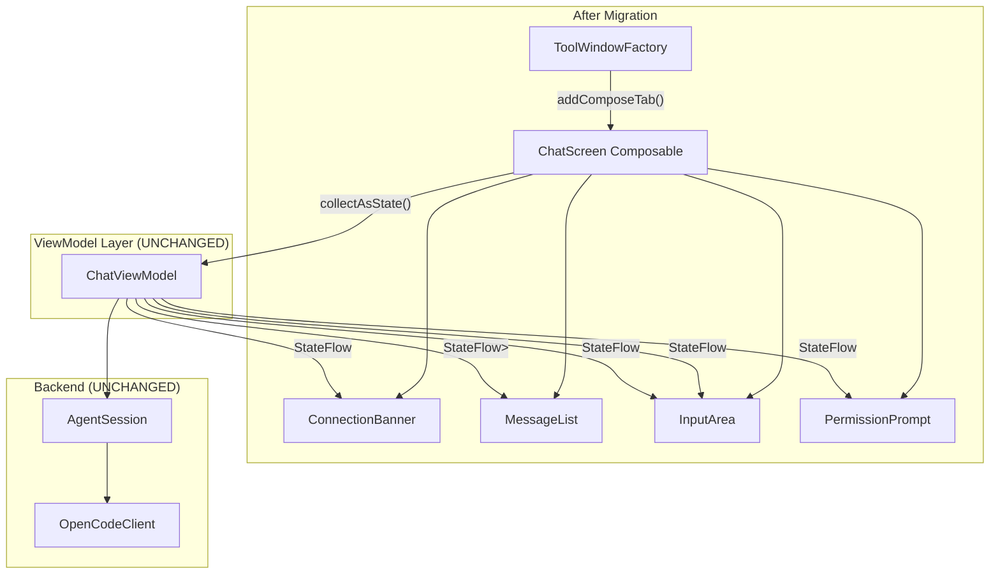

# Technical Design Document: Jewel/Compose UI Migration

> **Status:** Draft (Post-Adversarial Review)
> **Last Updated:** 2026-06-02
> **Related docs:**
> - [Chat Interface TDD](./chat-interface.md)
> - [Chat Display Revamp TDD](./chat-display-revamp.md)
> - [Jewel GitHub](https://github.com/JetBrains/jewel)
> - [Jewel Release Notes](https://github.com/JetBrains/intellij-community/blob/master/platform/jewel/RELEASE%20NOTES.md)

---

## 1. TL;DR

Migrate the IntelliJ chat plugin's UI from raw Swing to JetBrains Jewel (Compose for Desktop). Jewel is bundled in IntelliJ Platform 2025.1+ and provides declarative, theme-aware UI components that automatically match the IDE's Darcula/NewUI appearance. This eliminates the manual theming pain (custom painting, `BasicComboBoxUI` hacks, `JBUI.Borders` workarounds) that has plagued the Swing implementation. The migration replaces 5 Swing `JPanel`-based components with composable functions, while preserving the existing `ChatViewModel` architecture (StateFlow-based, coroutine-driven). A phased approach lets us migrate one component at a time with `SwingPanel` interop as a bridge.

**Post-Review Changes:** This revision addresses 7 critical and 13 major issues identified by a 4-model adversarial review. Key fixes: corrected Jewel API references, replaced `Column` with `LazyColumn` for message list, fixed `SwingPanel` factory recreation, added coroutine scope management, and redesigned the model favorites dropdown strategy.

---

## 2. Context & Scope

### 2.1 Current State

The chat interface is built with raw Swing components (`JPanel`, `JBTextArea`, `JButton`, `ComboBox`, `JBScrollPane`) wrapped in IntelliJ Platform helpers (`JBUI.Borders`, `JBColor`, `ChatColors`). Five Swing components exist:

| Component | Lines | Complexity |
|-----------|-------|-----------|
| `ChatPanel.kt` | 101 | Wiring layer — connects ViewModel to UI components |
| `InputAreaComponent.kt` | 511 | High — text area, send/cancel buttons, 3 combo boxes, star favorites, custom borders |
| `MessageListComponent.kt` | 212 | Medium — message list, HTML rendering, tool pills, thinking indicators |
| `ConnectionBannerComponent.kt` | 57 | Low — status banner with retry button |
| `PermissionPromptComponent.kt` | 89 | Low — permission dialog with Allow/Reject buttons |

**Pain points with Swing:**
- Rounded corners require custom `Border` implementations (`RoundedLineBorder`, `CircleBorder`)
- Combo box styling requires `BasicComboBoxUI` reflection hacks for star click detection
- Inconsistent closed-face heights across 3 combo boxes (different renderer types)
- Theme-aware colors require manual `ChatColors` object with 20+ color functions
- No declarative state management — every `revalidate()`/`repaint()` call is manual
- `BasicComboBoxUI` reflection for popup list access is fragile across IDE versions

### 2.2 Problem Statement

The Swing UI approach has become a maintenance burden. Each visual change requires custom painting code, HiDPI-aware scaling, and manual theme integration. Jewel/Compose provides a declarative alternative where components are automatically theme-aware, rounded corners are trivial (via `Modifier.clip(RoundedCornerShape(...))`), and state management is built into the Compose runtime via recomposition.

---

## 3. Goals & Non-Goals

### Goals

- Replace all 5 Swing UI components with Jewel/Compose composables
- Automatic IntelliJ theme integration (Darcula, NewUI, Light, High Contrast) via `SwingBridgeTheme`
- Rounded corners, pill selectors, circular buttons via Compose modifiers (no custom painting)
- Preserve existing `ChatViewModel` architecture (StateFlow-based, no changes to ViewModel layer)
- Phased migration: one component at a time with Swing interop as bridge
- Zero regression in functionality (messages, streaming, tool pills, permissions, selectors)

### Non-Goals

- Rewrite `ChatViewModel` or the ACP layer — ViewModel stays as-is
- Add new features during migration (image support, multi-tab, etc.)
- Support IntelliJ versions before 2025.1 (Jewel requires IJP 251+)
- Remove `ChatColors.kt` during migration — it's still needed for HTML rendering via `SwingPanel`
- Migrate to Compose for Android or other platforms — this is IntelliJ-only

---

## 4. Proposed Solution

**Migrate the UI layer from Swing to Jewel/Compose, one component at a time, using `SwingPanel` and `JewelComposePanel` as interop bridges during the transition. The `ChatViewModel` and all backend logic remain unchanged — only the rendering layer is replaced.**

The migration order is: ConnectionBanner → PermissionPrompt → InputArea → MessageList → ChatPanel (wiring). This order starts with the simplest components and ends with the most complex, allowing us to learn Jewel patterns on easy components first.

### 4.1 Architecture Diagram



| Component | Responsibility |
|-----------|---------------|
| `ToolWindowFactory` | Creates tool window, calls `addComposeTab()` (which includes `SwingBridgeTheme` internally) |
| `ChatScreen` | Top-level composable — collects all StateFlows, passes state to children, manages `CoroutineScope` |
| `ConnectionBanner` | Shows connection status (disconnected/connecting/error) with retry |
| `MessageList` | Scrollable list of messages with `LazyColumn` for virtualization |
| `InputArea` | Text area with send/cancel buttons, agent/model/thinking selectors |
| `PermissionPrompt` | Inline permission dialog with Allow/Reject/Always Allow buttons |
| `ChatViewModel` | **UNCHANGED** — bridge between UI and ACP AgentSession |

### 4.2 Component & Module Design

> **Omitted** per Mini TDD guidelines. See 4.7 for concrete type definitions.

### 4.3 API / Interface Design

The ViewModel's public API remains unchanged. Jewel composables observe StateFlows via `collectAsState()`:

```kotlin
// ChatViewModel state flows (UNCHANGED)
val messages: StateFlow<List<ChatMessage>>
val connectionState: StateFlow<ConnectionState>
val controlState: StateFlow<ControlBarState>
val isStreaming: StateFlow<Boolean>
val permissionPrompt: StateFlow<PermissionPrompt?>

// ViewModel methods (UNCHANGED)
suspend fun initialize(projectBasePath: String)
suspend fun sendMessage(text: String)
suspend fun cancel()
suspend fun respondPermission(response: PermissionResponse)
fun selectAgent(agent: OpenCodeAgentInfo)
fun selectModel(model: ProviderModel)
fun selectThinkingEffort(effort: ThinkingEffort)
```

The UI only observes state and calls ViewModel methods — no new API surface is introduced.

### 4.4 Key Flows

> **Omitted** per Mini TDD guidelines.

### 4.5 Technology Stack

| Layer | Technology | Version | Rationale |
|-------|-----------|---------|-----------|
| Language | Kotlin | 2.3.0 | Project standard |
| UI Framework | Jewel (Compose for Desktop) | Bundled in IJP 2026.1 | Bundled, theme-aware, declarative |
| Compose Runtime | Compose Multiplatform | 1.10.0 (matching IJP) | Required by Jewel |
| Rendering | Skiko (Skia wrapper) | Bundled | GPU-accelerated Compose rendering |
| Theme Bridge | SwingBridgeTheme | Bundled | Automatic IntelliJ theme integration |
| Build Plugin | org.jetbrains.intellij.platform | 2.16.0 | Project standard |
| Build Plugin | org.jetbrains.compose | 1.10.0 | Required for Compose compiler |

### 4.6 Migration Strategy

**Phased approach — one component at a time:**

| Phase | Component | Complexity | Swing Interop |
|-------|-----------|-----------|---------------|
| 1 | `ConnectionBanner` | Low | `JewelComposePanel` wraps composable |
| 2 | `PermissionPrompt` | Low | `JewelComposePanel` wraps composable |
| 3 | `InputArea` | High | `JewelComposePanel` wraps composable |
| 4 | `MessageList` | Medium | `SwingPanel` embeds EditorTextField for code blocks |
| 5 | `ChatPanel` (wiring) | Low | Replace `JPanel` layout with Compose `Column` |

**Interop during migration:**
- `toolWindow.addComposeTab()` — recommended for tool windows, handles all bridging including `SwingBridgeTheme` and `enableNewSwingCompositing()`
- `JewelComposePanel` — wraps Compose content in a `JComponent` for Swing containers (Phase 1-4)
- `SwingPanel` — embeds Swing components inside Compose (for EditorTextField code blocks)

**Rollback:** Each phase is independent. If a phase fails, revert that component to Swing while keeping other migrated components.

**Important:** `addComposeTab()` already wraps content in `SwingBridgeTheme` internally. Do NOT add an explicit `SwingBridgeTheme {}` wrapper — this causes double-theming.

### 4.7 Implementation Blueprint

#### 4.7.1 Data Models & Schemas

No changes to existing data models. All models in `ChatModels.kt` remain as-is:

```kotlin
// UNCHANGED — these models are shared between Swing and Compose UIs
data class ChatMessage(
    val id: String,
    val role: MessageRole,
    val content: String,
    val renderedHtml: String? = null,
    val timestamp: Long,
    val toolCalls: List<ToolCallPill> = emptyList(),
    val thinkingContent: String = "",
    val isStreaming: Boolean = false
)

data class ControlBarState(
    val agents: List<OpenCodeAgentInfo> = emptyList(),
    val selectedAgent: OpenCodeAgentInfo? = null,
    val models: List<ProviderModel> = emptyList(),
    val selectedModel: ProviderModel? = null,
    val thinkingEffort: ThinkingEffort = ThinkingEffort.DEFAULT
)

data class PermissionPrompt(
    val permissionId: String,
    val toolCallId: String,
    val toolName: String,
    val description: String?
)

enum class ConnectionState { DISCONNECTED, CONNECTING, CONNECTED, RECONNECTING, ERROR }
enum class PermissionResponse(val optionId: String) { ALLOW_ONCE("allow-once"), REJECT_ONCE("reject-once"), ALLOW_ALWAYS("allow-always") }
enum class ThinkingEffort(val label: String, val variant: String?) { NONE("None", "none"), LOW("Low", "low"), MEDIUM("Medium", "medium"), HIGH("High", "high"), DEFAULT("Default", null) }
```

#### 4.7.2 Class & Interface Definitions

**New Composable files (replacing Swing components):**

```
src/main/kotlin/com/opencode/acp/chat/ui/compose/
├── ChatScreen.kt           // Top-level composable (replaces ChatPanel.kt)
├── ConnectionBanner.kt     // Connection status banner
├── InputArea.kt            // Input area with selectors
├── MessageList.kt          // Scrollable message list (LazyColumn)
├── PermissionPrompt.kt     // Permission dialog
├── MessageItem.kt          // Single message composable
├── ToolPill.kt             // Tool call pill composable
├── ThinkingIndicator.kt    // Thinking/loading indicator
└── Selectors.kt            // Agent/Model/Thinking selector composables
```

**ChatScreen composable (replaces ChatPanel.kt):**

```kotlin
@Composable
fun ChatScreen(
    viewModel: ChatViewModel,
    project: Project
) {
    val messages by viewModel.messages.collectAsState()
    val connectionState by viewModel.connectionState.collectAsState()
    val controlState by viewModel.controlState.collectAsState()
    val isStreaming by viewModel.isStreaming.collectAsState()
    val permissionPrompt by viewModel.permissionPrompt.collectAsState()
    val scope = rememberCoroutineScope()

    Column(Modifier.fillMaxSize()) {
        // Connection banner (shows/hides based on state)
        ConnectionBanner(
            state = connectionState,
            onRetry = { scope.launch { viewModel.initialize(project.basePath ?: ".") } }
        )

        // Message list (fills remaining space)
        MessageList(
            messages = messages,
            modifier = Modifier.weight(1f).fillMaxWidth(),
            project = project
        )

        // Permission prompt (shows/hides based on state)
        permissionPrompt?.let { prompt ->
            PermissionPrompt(
                prompt = prompt,
                onRespond = { response ->
                    scope.launch { viewModel.respondPermission(response) }
                }
            )
        }

        // Input area (always visible at bottom, disabled when disconnected or permission active)
        val inputEnabled = connectionState == ConnectionState.CONNECTED && permissionPrompt == null
        InputArea(
            enabled = inputEnabled,
            isStreaming = isStreaming,
            controlState = controlState,
            onSend = { text -> scope.launch { viewModel.sendMessage(text) } },
            onCancel = { scope.launch { viewModel.cancel() } },
            onAgentChanged = { viewModel.selectAgent(it) },
            onModelChanged = { viewModel.selectModel(it) },
            onThinkingChanged = { viewModel.selectThinkingEffort(it) }
        )
    }
}
```

**InputArea composable (replaces InputAreaComponent.kt):**

```kotlin
@OptIn(ExperimentalComposeUiApi::class)
@Composable
fun InputArea(
    enabled: Boolean,
    isStreaming: Boolean,
    controlState: ControlBarState,
    onSend: (String) -> Unit,
    onCancel: () -> Unit,
    onAgentChanged: (OpenCodeAgentInfo) -> Unit,
    onModelChanged: (ProviderModel) -> Unit,
    onThinkingChanged: (ThinkingEffort) -> Unit
) {
    val textState = rememberTextFieldState("")
    val focusRequester = remember { FocusRequester() }

    // Auto-focus on composition
    LaunchedEffect(Unit) {
        focusRequester.requestFocus()
    }

    Column(
        modifier = Modifier.fillMaxWidth().padding(8.dp),
        verticalArrangement = Arrangement.spacedBy(4.dp)
    ) {
        // Text area + send/cancel buttons
        Row(
            modifier = Modifier.fillMaxWidth(),
            horizontalArrangement = Arrangement.spacedBy(4.dp),
            verticalAlignment = Alignment.CenterVertically
        ) {
            // Attach button (circular)
            IconButton(onClick = { /* TODO */ }, modifier = Modifier.size(28.dp)) {
                Icon(AllIconsKeys.General.Add, contentDescription = "Attach")
            }

            // Text area with keyboard shortcuts
            TextArea(
                state = textState,
                modifier = Modifier.weight(1f).heightIn(min = 40.dp)
                    .focusRequester(focusRequester)
                    .onPreviewKeyEvent { event ->
                        if (event.type == KeyEventType.KeyDown) {
                            when {
                                // Enter → send (no Shift)
                                event.key == Key.Enter && !event.isShiftPressed -> {
                                    val text = textState.text.toString().trim()
                                    if (text.isNotEmpty()) {
                                        onSend(text)
                                        textState.edit { replace(0, length, "") }
                                    }
                                    true
                                }
                                // Shift+Enter → newline (default behavior)
                                event.key == Key.Enter && event.isShiftPressed -> false
                                // Escape → cancel
                                event.key == Key.Escape -> {
                                    onCancel()
                                    true
                                }
                                else -> false
                            }
                        } else false
                    },
                enabled = enabled,
                placeholder = { Text("Type a message...") }
            )

            // Send / Cancel button (circular)
            if (isStreaming) {
                IconButton(onClick = onCancel, modifier = Modifier.size(32.dp)) {
                    Icon(AllIconsKeys.Actions.Suspend, contentDescription = "Cancel")
                }
            } else {
                IconButton(
                    onClick = {
                        val text = textState.text.toString().trim()
                        if (text.isNotEmpty()) {
                            onSend(text)
                            textState.edit { replace(0, length, "") }
                        }
                    },
                    modifier = Modifier.size(32.dp),
                    enabled = enabled
                ) {
                    Icon(AllIconsKeys.Actions.MoveUp, contentDescription = "Send")
                }
            }
        }

        // Selector row: Agent ✦ Model ✦ Thinking
        Row(
            modifier = Modifier.fillMaxWidth(),
            horizontalArrangement = Arrangement.spacedBy(6.dp),
            verticalAlignment = Alignment.CenterVertically
        ) {
            AgentSelector(controlState, onAgentChanged)
            Text("✦", color = JewelTheme.globalColors.text.info, fontSize = 12.sp)
            ModelSelector(controlState, onModelChanged)
            ThinkingSelector(controlState, onThinkingChanged)
        }
    }
}
```

**MessageList composable (replaces MessageListComponent.kt):**

```kotlin
@Composable
fun MessageList(
    messages: List<ChatMessage>,
    modifier: Modifier = Modifier,
    project: Project? = null
) {
    val listState = rememberLazyListState()

    // Auto-scroll to bottom when new messages arrive
    LaunchedEffect(messages.size) {
        if (messages.isNotEmpty()) {
            listState.animateScrollToItem(messages.size - 1)
        }
    }

    LazyColumn(
        state = listState,
        modifier = modifier.padding(8.dp),
        verticalArrangement = Arrangement.spacedBy(6.dp)
    ) {
        items(messages, key = { it.id }) { message ->
            MessageItem(message, project)
        }
    }
}

@Composable
fun MessageItem(message: ChatMessage, project: Project? = null) {
    when (message.role) {
        MessageRole.USER -> UserMessage(message)
        MessageRole.ASSISTANT -> AssistantMessage(message, project)
    }
}

@Composable
fun UserMessage(message: ChatMessage) {
    Row(
        modifier = Modifier.fillMaxWidth(),
        horizontalArrangement = Arrangement.End
    ) {
        Box(
            modifier = Modifier
                .clip(RoundedCornerShape(8.dp))
                .background(JewelTheme.globalColors.background)
                .padding(horizontal = 12.dp, vertical = 6.dp)
        ) {
            Text(message.content)
        }
    }
}

@Composable
fun AssistantMessage(message: ChatMessage, project: Project? = null) {
    Column(modifier = Modifier.fillMaxWidth()) {
        // Tool pills
        message.toolCalls.forEach { pill ->
            ToolPill(pill)
        }

        // Thinking content
        if (message.thinkingContent.isNotEmpty()) {
            ThinkingPill(message.thinkingContent)
        }

        // Message content (rendered HTML for completed, plain text for streaming)
        if (message.isStreaming && message.content.isBlank()) {
            ThinkingIndicator()
        } else if (message.isStreaming) {
            // Streaming: render as plain text to avoid expensive HTML re-parsing
            Text(
                message.content,
                modifier = Modifier.padding(horizontal = 12.dp, vertical = 4.dp)
            )
        } else {
            // Completed: render as HTML via SwingPanel
            val html = remember(message.id, message.renderedHtml, message.content) {
                message.renderedHtml
                    ?: ChatColors.buildThemedHtml(renderMarkdownToHtml(message.content))
            }
            SwingPanel(
                modifier = Modifier.fillMaxWidth().padding(horizontal = 12.dp, vertical = 4.dp),
                factory = { createHtmlPane(html) },
                update = { pane -> pane.text = html }
            )
        }
    }
}
```

**ConnectionBanner composable (replaces ConnectionBannerComponent.kt):**

```kotlin
@Composable
fun ConnectionBanner(
    state: ConnectionState,
    onRetry: () -> Unit
) {
    if (state == ConnectionState.CONNECTED) return

    when (state) {
        ConnectionState.DISCONNECTED -> InformationBanner(
            text = "Not connected to OpenCode",
            linkActions = {
                Link("Retry", onClick = onRetry)
            }
        )
        ConnectionState.CONNECTING -> InformationBanner(text = "Connecting...")
        ConnectionState.RECONNECTING -> InformationBanner(text = "Reconnecting...")
        ConnectionState.ERROR -> ErrorBanner(
            text = "Connection failed",
            linkActions = {
                Link("Retry", onClick = onRetry)
            }
        )
        else -> { /* CONNECTED — already returned above */ }
    }
}
```

**PermissionPrompt composable (replaces PermissionPromptComponent.kt):**

```kotlin
@Composable
fun PermissionPrompt(
    prompt: PermissionPrompt,
    onRespond: (PermissionResponse) -> Unit
) {
    Column(
        modifier = Modifier.fillMaxWidth()
            .border(1.dp, JewelTheme.globalColors.border)
            .padding(8.dp),
        verticalArrangement = Arrangement.spacedBy(4.dp)
    ) {
        Row(horizontalArrangement = Arrangement.spacedBy(8.dp)) {
            Icon(AllIconsKeys.Actions.Lightning, contentDescription = null)
            Column {
                Text(prompt.toolName, fontWeight = FontWeight.Bold)
                Text(prompt.description ?: "This tool requires permission.")
            }
        }
        Row(horizontalArrangement = Arrangement.spacedBy(4.dp), modifier = Modifier.fillMaxWidth()) {
            Spacer(Modifier.weight(1f))
            OutlinedButton(onClick = { onRespond(PermissionResponse.ALLOW_ONCE) }) {
                Text("Allow Once")
            }
            OutlinedButton(onClick = { onRespond(PermissionResponse.REJECT_ONCE) }) {
                Text("Reject")
            }
            DefaultButton(onClick = { onRespond(PermissionResponse.ALLOW_ALWAYS) }) {
                Text("Always Allow")
            }
        }
    }
}
```

#### 4.7.3 Function Signatures

> **Omitted** per Mini TDD guidelines. See 4.7.2 for composable signatures.

#### 4.7.4 Component Mapping

| Swing Component | Compose Replacement | File | Key Differences |
|----------------|--------------------|----|----------------|
| `ChatPanel` (JPanel + BoxLayout) | `ChatScreen` (Composable) | `ChatScreen.kt` | Declarative layout, `rememberCoroutineScope()` for suspend calls |
| `ConnectionBannerComponent` | `ConnectionBanner` | `ConnectionBanner.kt` | Uses Jewel `InformationBanner`/`ErrorBanner` |
| `InputAreaComponent` | `InputArea` | `InputArea.kt` | `TextFieldState` + `onPreviewKeyEvent` for keyboard shortcuts |
| `MessageListComponent` | `MessageList` + `MessageItem` | `MessageList.kt`, `MessageItem.kt` | `LazyColumn` for virtualization, `SwingPanel` with `update` block |
| `PermissionPromptComponent` | `PermissionPrompt` | `PermissionPrompt.kt` | Uses Jewel `DefaultButton`/`OutlinedButton` |
| `ChatColors` (20+ color functions) | JewelTheme automatic + `ChatColors` for HTML | — | Still needed for `buildThemedHtml()` in `SwingPanel` |
| `RoundedLineBorder` / `CircleBorder` | `Modifier.clip(RoundedCornerShape(...))` | — | No custom painting needed |
| `BasicComboBoxUI` reflection | Custom composable dropdown | — | Model selector needs custom implementation |

#### 4.7.5 Enums, Constants & Configuration

> **Omitted** per Mini TDD guidelines. No new enums or constants introduced.

#### 4.7.6 Error Types & Exception Contracts

> **Omitted** per Mini TDD guidelines.

---

## 5. Assumptions & Dependencies

**Assumptions:**
- Target IDE is IntelliJ 2026.1+ (IJP 261+) where Jewel is bundled
- JetBrains Runtime is used (required by Jewel)
- `ChatViewModel` architecture is preserved unchanged
- HTML rendering in messages continues to use `JEditorPane` via `SwingPanel` (Jewel doesn't have a built-in HTML renderer)
- `EditorTextField` for code blocks continues to use `SwingPanel` (IntelliJ's Editor API is Swing-based)
- `ChatColors.kt` remains for `buildThemedHtml()` — Jewel's `SwingBridgeTheme` doesn't auto-theme HTML content

**Dependencies:**
- Jewel bundled modules: `intellij.platform.jewel.foundation`, `intellij.platform.jewel.ui`, `intellij.platform.jewel.ideLafBridge`
- Compose Multiplatform runtime (bundled with Jewel)
- Skiko native library (bundled with Compose)
- JetBrains Runtime (required for Jewel)

---

## 6. Alternatives Considered

**Alternative: JCEF (Java Chromium Embedded Framework)**
- *What it is:* Embed a full Chromium browser in the tool window, build the UI in HTML/CSS/JS
- *Why plausible:* Full CSS3 support (rounded corners, flexbox, animations), familiar web dev workflow, plugin already has JCEF infrastructure
- *Why rejected:* ~200MB memory overhead per browser instance, browser initialization delay, not all IDEs have JCEF enabled, theme integration requires manual CSS per theme, loses native IDE feel

**Alternative: Continue with Swing + Platform Utilities**
- *What it is:* Keep the current Swing approach, use more IntelliJ Platform helpers (Kotlin UI DSL, `BorderLayoutPanel`, etc.)
- *Why plausible:* Zero external dependencies, guaranteed compatibility, no new learning curve
- *Why rejected:* Rounded corners and custom styling still require manual painting, combo box styling remains painful, theme integration requires ongoing manual effort, doesn't solve the fundamental maintainability problem

---

## 7. Cross-Cutting Concerns

### 7.1 Performance & Scalability

- **Memory:** Jewel adds ~10-20MB overhead (Compose runtime + Skiko native library). Acceptable for a chat tool window.
- **Startup:** First Compose composition is slower than Swing. Subsequent recompositions are fast and granular.
- **Infinite animations caveat:** `CircularProgressIndicator` and `IndeterminateHorizontalProgressBar` use infinite animations that may have performance issues with the Swing rendering pipeline (`compose.swing.render.on.graphics=true`). This is a known JBR-dependent issue.
- **HTML rendering:** Messages with rich HTML continue to use `SwingPanel` with `JEditorPane`. This is a deliberate compromise — Jewel doesn't have a built-in HTML renderer, and `JEditorPane` is proven and performant for read-only content.
- **Message list virtualization:** `LazyColumn` ensures only visible messages are composed, preventing performance degradation with long chat histories.

### 7.2 Reliability & Availability

- **API stability:** Jewel APIs are still evolving. Binary compatibility is not guaranteed across releases. Mitigation: pin to the exact Jewel/Compose version bundled with the target IJP version.
- **Non-standard themes:** IntelliJ themes using custom Swing UI implementations (not `.theme.json`) are not supported by `SwingBridgeTheme`. Mitigation: this affects a small minority of themes; standard themes work perfectly.
- **Rollback:** Each migration phase is independent. If a phase introduces regressions, revert that component to Swing while keeping other migrated components.

### 7.3 Observability

- No new logging or metrics required for the UI migration
- Existing `ChatViewModel` logging remains unchanged
- Compose recomposition debugging can be enabled via `LayoutInspector` in debug builds

---

## 8. Testing Strategy

### 8.1 Testing Levels

| Level | What's Tested | Tools |
|-------|--------------|-------|
| Visual regression | UI appearance matches reference design | Manual testing in IDE sandbox |
| Functional | All existing functionality preserved | Manual testing + existing unit tests |
| Theme compatibility | UI works in Darcula, NewUI, Light, High Contrast | Manual testing across themes |
| HiDPI | UI scales correctly on high-DPI displays | Manual testing with IDE zoom levels |

### 8.2 Key Scenarios

1. **Send message and receive streaming response** — text area accepts input, messages appear in list, streaming updates correctly
2. **Tool call display** — tool pills show correct status (pending → completed/failed), thinking indicators show during processing
3. **Permission prompt** — Allow/Reject/Always Allow buttons respond correctly, prompt disappears after response
4. **Agent/Model/Thinking selectors** — dropdowns show correct options, selection updates ViewModel state
5. **Connection states** — banner shows/hides correctly for disconnected/connecting/connected/error states
6. **Star favorites** — model dropdown shows favorites section, star toggle works
7. **Theme switching** — UI updates automatically when switching between IntelliJ themes
8. **HiDPI scaling** — all elements scale correctly at 100%, 125%, 150%, 200% zoom

---

## 9. Deployment & Rollout Plan

### 9.1 Release Phasing

| Phase | Scope | Validation Criteria |
|-------|-------|-------------------|
| Phase 1 | ConnectionBanner migrated | Banner shows/hides correctly for all connection states |
| Phase 2 | PermissionPrompt migrated | Allow/Reject/Always Allow work correctly |
| Phase 3 | InputArea migrated | Text input, send/cancel, all 3 selectors work |
| Phase 4 | MessageList migrated | Messages display correctly, scrolling works, tool pills render |
| Phase 5 | ChatPanel (wiring) migrated | Full chat flow works end-to-end |

### 9.2 Feature Flags

No feature flags needed. Migration is per-component, and each phase can be reverted independently.

---

## 10. Open Questions

1. **Jewel version pinning:** Use bundled version automatically (no explicit pinning). The IJP Gradle plugin handles version matching.
2. **EditorTextField for code blocks:** Continue using `SwingPanel` with `EditorTextField`, or investigate Jewel's markdown module? `SwingPanel` is proven but adds Swing dependency.
3. **Markdown rendering:** Continue using `Flexmark` + `JEditorPane` via `SwingPanel`, or investigate Jewel's markdown module (`intellij.platform.jewel.markdown.core`)? Jewel's markdown may have different rendering behavior.
4. **Model favorites redesign:** The current star-favorites dropdown cannot be replicated with Jewel's `Dropdown`/`ListComboBox`. Options: (a) keep Swing combo via `SwingPanel`, (b) redesign as a separate favorites button outside the dropdown, (c) build a custom composable from primitives. Recommend option (a) for Phase 3, with option (b) as a follow-up.

---

## 11. Risks & Mitigations

| Risk | Impact | Mitigation |
|------|--------|-----------|
| Jewel API changes between IDE versions | High — code may break on IDE upgrade | Pin to bundled version, use only stable APIs, test on target IDE |
| Performance regression from Compose overhead | Medium — slower startup, higher memory | Benchmark before/after, accept trade-off if <20MB overhead |
| HTML rendering differences | Medium — messages may look different | Continue using `JEditorPane` via `SwingPanel` for HTML content |
| Learning curve for Compose paradigm | Medium — slower development initially | Start with simple components (ConnectionBanner), learn patterns before tackling complex ones |
| Swing interop z-ordering issues | Low — `enableNewSwingCompositing()` may not fix all cases | `addComposeTab()` calls this automatically; test thoroughly |
| Model favorites dropdown impossible with Jewel | High — star-toggle feature lost | Keep Swing combo via `SwingPanel` for Phase 3, redesign in follow-up |
| `SwingPanel` height calculation | Medium — JEditorPane has dynamic height | Use `IntrinsicSize.Min` or `BoxWithConstraints` wrapper |

---

## 12. Timeline & Milestones

> **[Needs input]** — timeline depends on team capacity and priorities.

Estimated effort per phase:
- Phase 1 (ConnectionBanner): 2–3 hours
- Phase 2 (PermissionPrompt): 3–4 hours
- Phase 3 (InputArea): 12–16 hours (includes keyboard shortcuts, focus management, selector redesign)
- Phase 4 (MessageList): 8–12 hours (includes LazyColumn, auto-scroll, SwingPanel interop, MarkdownSegmenter)
- Phase 5 (ChatPanel wiring): 3–4 hours
- **Total: ~28–39 hours**

---

## 13. Document History

| Date | Author | Changes |
|------|--------|---------|
| 2026-06-02 | — | Initial draft |
| 2026-06-02 | — | Post-adversarial-review: Fixed API references, added LazyColumn, fixed SwingPanel factory, added coroutine scope, addressed star favorites gap, updated estimates |

---

## Appendix: Jewel Dependency Setup

### `build.gradle.kts` additions

```kotlin
plugins {
    // Existing
    id("org.jetbrains.intellij.platform") version("2.16.0")
    kotlin("jvm") version "2.3.0"
    kotlin("plugin.serialization") version "2.3.0"

    // NEW: Compose plugin (must match IJP's CMP version)
    id("org.jetbrains.compose") version "1.10.0"
}

dependencies {
    // Existing dependencies (unchanged)
    // ...

    intellijPlatform {
        intellijIdea(providers.gradleProperty("platformVersion"))
        bundledPlugin("com.intellij.java")

        // NEW: Jewel/Compose bundled modules
        composeUI()  // Adds Compose + Skiko bundledModules
        bundledModule("intellij.platform.jewel.foundation")
        bundledModule("intellij.platform.jewel.ui")
        bundledModule("intellij.platform.jewel.ideLafBridge")
        bundledModule("intellij.platform.jewel.markdown.core")
        bundledModule("intellij.platform.jewel.markdown.ideLafBridgeStyling")
    }
}
```

### `plugin.xml` additions

```xml
<idea-plugin>
    <!-- Existing dependencies -->
    <depends>com.intellij.modules.platform</depends>
    <depends>com.intellij.java</depends>

    <!-- NEW: Compose/Jewel module dependencies -->
    <depends>org.jetbrains.libraries.compose.foundation.desktop</depends>
    <depends>org.jetbrains.libraries.compose.runtime.desktop</depends>
    <depends>org.jetbrains.libraries.skiko</depends>
</idea-plugin>
```

> **Note:** Jewel modules are loaded via `bundledModule()` in Gradle, not via `<depends>` in `plugin.xml`. Only Compose/Skiko runtime modules need `plugin.xml` entries.

### ToolWindowFactory setup

```kotlin
import org.jetbrains.jewel.bridge.addComposeTab

class OpenCodeToolWindowFactory : ToolWindowFactory, DumbAware {
    override fun createToolWindowContent(project: Project, toolWindow: ToolWindow) {
        val scope = edtScope()
        val viewModel = ChatViewModel(scope)

        // addComposeTab() automatically handles:
        // - SwingBridgeTheme wrapping
        // - enableNewSwingCompositing()
        // - JewelComposePanel creation
        toolWindow.addComposeTab("Chat") {
            ChatScreen(viewModel, project)
        }

        // Register disposable for ViewModel cleanup
        Disposer.register(toolWindow.contentManager, object : Disposable {
            override fun dispose() {
                scope.cancel()
                viewModel.close()
            }
        })

        // Auto-connect on tool window open
        scope.launch {
            viewModel.initialize(project.basePath ?: ".")
        }
    }
}
```
