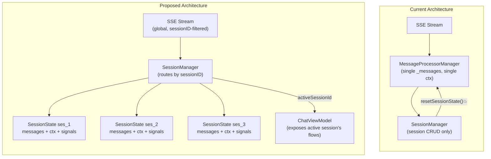
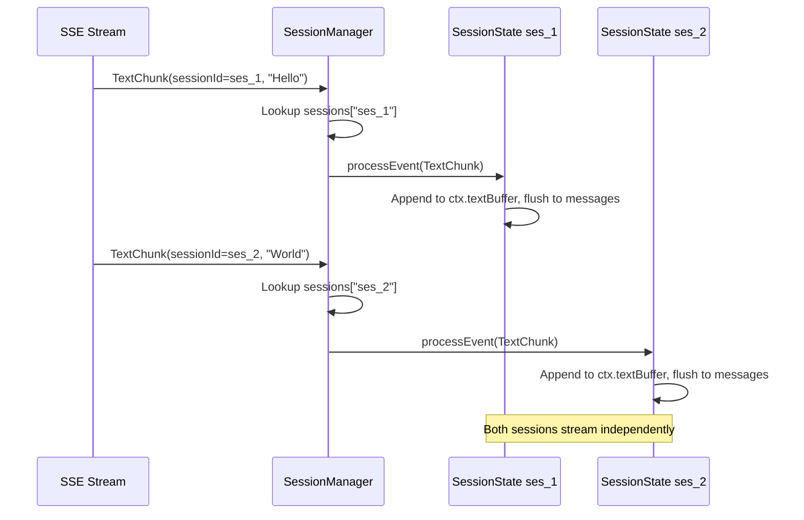
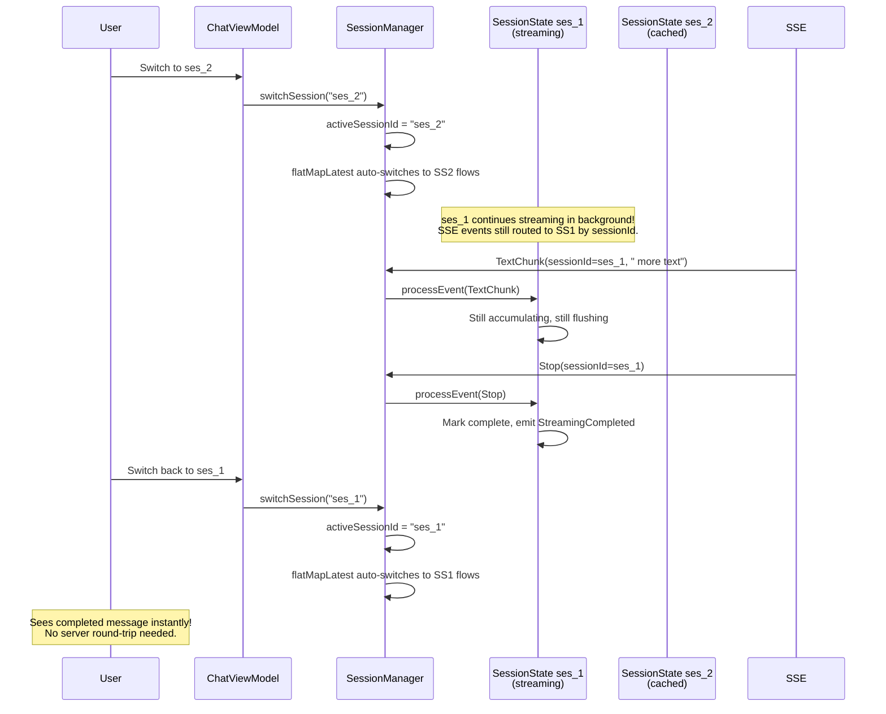
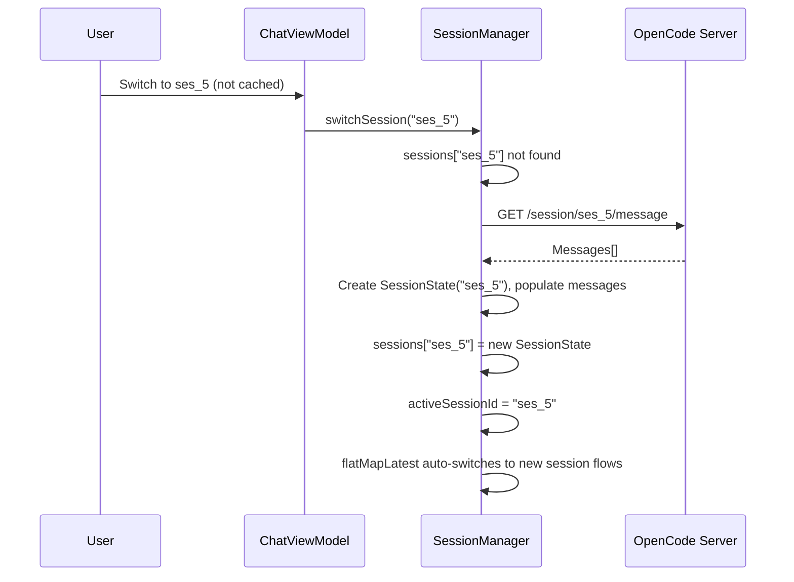
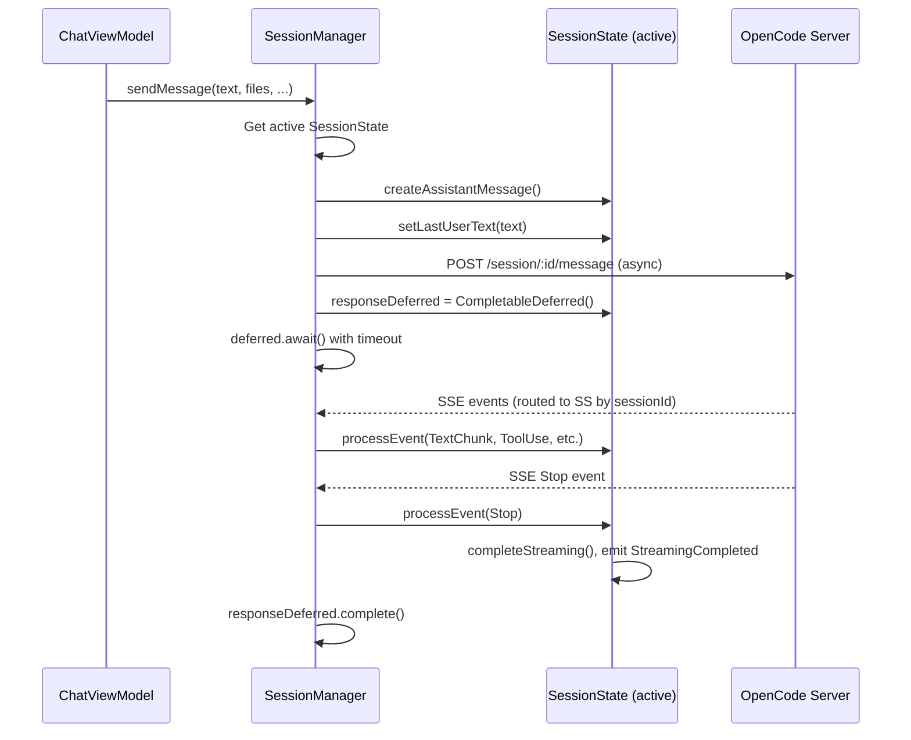
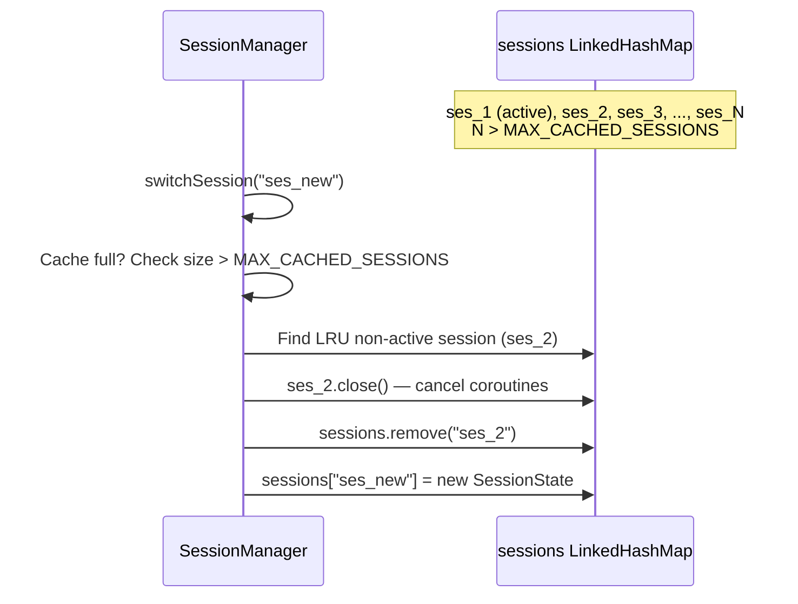

# Technical Design Document: SessionManager (Per-Session State Refactor)

> **Status:** Draft
> **Author(s):** —
> **Reviewer(s):** —
> **Last Updated:** 2026-06-07
> **Related docs:** [message-processor.md](./message-processor.md), [chat-sessions-sidebar.md](./chat-sessions-sidebar.md), [AGENTS.md](../../AGENTS.md)

---

## 1. TL;DR

Refactor `MessageProcessorManager` from a single-session design (one global `_messages` map, one `ProcessorContext`, nuclear wipe on switch) to a per-session architecture where each session owns its own message map and processor context. Rename to `SessionManager`. The goal: switching sessions while generation is in progress should be seamless — the old session continues generating in the background, and switching back shows its messages with streaming intact. The OpenCode server already supports concurrent sessions natively; the plugin just needs to stop destroying state on switch.

---

## 2. Context & Scope

### 2.1 Current State

`MessageProcessorManager` (862 lines) holds all mutable streaming state as **global singletons**:

- `_messages: MutableStateFlow<LinkedHashMap<String, ChatMessage>>` — single flat map for all sessions
- `ctx: ProcessorContext` — single instance for text accumulation, tool tracking, thinking state
- `eventChannel: Channel<SseEvent>(1024)` — single event queue
- `eventProcessingJob: Job?` — single consumer coroutine

`SessionManager` (369 lines) handles session lifecycle but delegates all message state to the processor. `switchSession()` calls `processor.resetSessionState()` which **destroys everything**:

1. Drains the event channel (drops all pending SSE events)
2. Cancels the event processing coroutine
3. Wipes `_messages` to an empty `LinkedHashMap`
4. Resets `ctx` (clears text buffers, tool state, thinking state)
5. Restarts coroutines

Then it fetches messages from the server for the new session and repopulates.

**What breaks when switching during generation:**
- In-flight streaming message is destroyed
- `isStreaming` stays `true` forever (no `StreamingCompleted` signal will fire)
- Server continues generating but SSE events are discarded
- Tool call state, thinking buffers, file changes — all lost
- Switching back requires a full server round-trip to reload messages

### 2.2 Problem Statement

The plugin treats sessions as a UI-layer concept with no support from the processing layer. Switching sessions is a destructive operation that tears down all state and rebuilds from scratch. This makes it impossible to switch sessions during generation without losing work, and forces expensive server round-trips on every switch even for sessions that were recently viewed.

### 2.3 OpenCode Server Session Model

The OpenCode server fully supports concurrent sessions. Key API endpoints:

| Method | Path | Purpose |
|--------|------|---------|
| `GET /session` | List all sessions | Returns `Session[]` |
| `POST /session` | Create session | body: `{ parentID?, title? }` |
| `GET /session/:id/message` | Get session messages | Returns messages with parts |
| `POST /session/:id/message` | Send message | body: `{ parts }` |
| `POST /session/:id/abort` | Abort running session | Returns `boolean` |
| `GET /event` | Global SSE stream | Events include `sessionID` for filtering |

SSE events are emitted globally with a `sessionID` field. The plugin already filters events by `sessionID` in `startSseSubscription()`. This means a single SSE connection can serve multiple sessions — events are routed by `sessionID`.

The server tracks session status independently (`GET /session/status` returns per-session `busy`/`idle`/`retry` states). Multiple sessions can be actively generating simultaneously.

---

## 3. Goals & Non-Goals

### Goals

1. **Per-session message state** — each session owns its own `LinkedHashMap<String, ChatMessage>`. Switching sessions swaps the active view, not destroys state.
2. **Per-session processor context** — each session owns its own `ProcessorContext` (text buffers, tool state, thinking state). In-flight generation continues uninterrupted when switching away.
3. **Seamless session switching** — switching sessions during generation does NOT stop generation. The old session's SSE events continue being processed in the background. Switching back shows the session exactly as it was (with streaming progress).
4. **Rename `MessageProcessorManager` to `SessionManager`** — the new name reflects its role as the owner of session state, not just message processing.
5. **Single SSE connection** — one global SSE subscription routes events to the correct per-session context by `sessionID`. No per-session HTTP connections.
6. **Cache-aware switching** — switching to a recently-viewed session uses cached messages (no server round-trip). Only fetch from server if the session is not in cache.

### Non-Goals

- **Background generation notifications** — no toast/banner when a background session completes. The user sees the result when they switch back. (Can be added later.)
- **Aborting background sessions** — no UI to abort a session you're not viewing. The user can switch back and cancel. (Can be added later.)
- **Per-session SSE connections** — a single global SSE stream with `sessionID` filtering is sufficient. Per-session connections add complexity with no benefit.
- **Persisting message cache to disk** — messages are in-memory only. On plugin restart, messages are fetched from the server. (Can be added later.)
- **Changing the `OpenCodeClient` or SSE parsing layer** — no server API changes.

---

## 4. Proposed Solution

**Replace the single `_messages` map and single `ProcessorContext` with a `LinkedHashMap<String, SessionState>` where each `SessionState` owns its own message map, processor context, and streaming lifecycle. The renamed `SessionManager` routes SSE events to the correct `SessionState` by `sessionID`. Switching sessions is a pointer swap — `activeSessionId = targetId`.**

The current `SessionManager` (session CRUD, list state, todos) merges into the new `SessionManager` or remains as a lightweight coordinator. The renamed `MessageProcessorManager` becomes the single source of truth for all per-session state.

### 4.1 Architecture Diagram



### 4.2 Component & Module Design

**4.2.1 Key Modules**

| Module | Responsibility | Key Exports | Dependencies |
|--------|---------------|-------------|-------------|
| `chat/processor/SessionManager.kt` | Owns all per-session state, routes SSE events, manages active session | `SessionManager` class, `activeMessages` StateFlow, `activeSignals` SharedFlow | `SessionState`, `SseEvent`, `OpenCodeClient` |
| `chat/processor/SessionState.kt` | Per-session message map + processor context + streaming lifecycle | `SessionState` class | `ProcessorContext`, `ChatMessage`, `UiSignal` |
| `chat/processor/ProcessorContext.kt` | Mutable accumulation state for a single streaming turn (unchanged) | `ProcessorContext` class | `MessagePart`, `ToolCallPill` |
| `chat/service/OpenCodeService.kt` | Coordinator — wires SessionManager to ConnectionManager and ViewModel | `OpenCodeService` class | `SessionManager`, `OpenCodeConnectionManager` |
| `chat/viewmodel/ChatViewModel.kt` | UI coordination — observes active session's flows | `ChatViewModel` class | `SessionManager` (via OpenCodeService) |

**4.2.2 State Ownership**

| Component | State Held | Lifetime | Persistence |
|-----------|-----------|----------|-------------|
| `SessionManager` | `sessions: LinkedHashMap<String, SessionState>`, `sessionsLock: ReentrantLock`, `switchMutex: Mutex`, `activeSessionId: String?`, `sseJob: Job?`, `globalSignals: SharedFlow<UiSignal>`, `_allSessionSignals: MutableSharedFlow<Pair<String, UiSignal>>` | Plugin lifetime | In-memory only |
| `SessionState` | `messages: LinkedHashMap<String, ChatMessage>`, `ctx: ProcessorContext`, `signals: MutableSharedFlow<UiSignal>`, `pendingPermission: StateFlow<PermissionPrompt?>`, `pendingSelection: StateFlow<SelectionPrompt?>`, `eventChannel: Channel<SseEvent>`, `eventProcessingJob: Job?`, `resegmentJob: Job?`, `signalForwardJob: Job?`, `responseDeferred: CompletableDeferred<Unit>?`, `firstTextSegmented: Boolean`, `closed: Boolean`, `hasPendingPermission: Boolean` | Session lifetime (until evicted from cache) | In-memory only |
| `ProcessorContext` | `textBuffer`, `thinkingBuffer`, `toolCallPills`, `toolCallIndex`, `pendingFileChanges`, `activeMessageId`, `isStreaming` (mutated on EDT, read by eviction on Default — benign data race), etc. | Single streaming turn (reset between turns) | In-memory only |

**4.2.3 Events & Signals**

| Signal | Type | Scope | Trigger |
|--------|------|-------|---------|
| `UiSignal.StreamingStarted` | `SharedFlow` per `SessionState` | Per-session | First text/thinking chunk for a turn |
| `UiSignal.StreamingCompleted` | `SharedFlow` per `SessionState` | Per-session | `Stop` event or `completeStreaming()` |
| `UiSignal.PermissionRequested` | `SharedFlow` per `SessionState` | Per-session | `Permission` SSE event |
| `UiSignal.SelectionRequested` | `SharedFlow` per `SessionState` | Per-session | `QuestionAsked` SSE event |
| `UiSignal.Error` | `SharedFlow` per `SessionState` | Per-session | `Error` SSE event |
| `UiSignal.TodoUpdated` | `SharedFlow` per `SessionState` | Per-session | `TodoUpdated` SSE event |
| `UiSignal.FileChanged` | `SharedFlow` per `SessionState` | Per-session | `ToolUse` with file edit |
| `UiSignal.SessionCreated` | `SharedFlow` global (`_globalSignals`) | Global | `SessionCreated` SSE event |

**Key change:** Signals are now per-session. The ViewModel collects from a **stable `activeSignals` flow** produced by `flatMapLatest` on `_activeSessionId`. When the active session changes, `flatMapLatest` automatically cancels the old subscription and starts collecting from the new session's signals — no manual re-subscription needed.

### 4.3 API / Interface Design

**`SessionManager` public API:**

```kotlin
class SessionManager(private val scope: CoroutineScope) {

    // ── Active Session Flows (exposed to ViewModel) ──

    /** Messages for the currently active session. UI observes this.
     *  Uses flatMapLatest on _activeSessionId so that when the active session
     *  changes, the upstream automatically switches to the new session's messages.
     *  Compose collectAsState() works correctly because the StateFlow reference
     *  is stable — only its value changes, not the instance. */
    val activeMessages: StateFlow<Map<String, ChatMessage>>

    /** Signals for the currently active session. ViewModel collects this.
     *  Uses flatMapLatest on _activeSessionId for the same reason as activeMessages.
     *  When the active session changes, the old signal collection is cancelled
     *  and the new session's signals are collected automatically. */
    val activeSignals: SharedFlow<UiSignal>

    /** The currently active session ID. */
    val activeSessionId: StateFlow<String?>

    /** Global signals for cross-session events (SessionCreated, etc.)
     *  that don't belong to a specific SessionState. ViewModel collects
     *  this separately from activeSignals. */
    val globalSignals: SharedFlow<UiSignal>

    // ── Session Lifecycle ──

    /** Switch the active session. Does NOT destroy any session's state.
     *  If targetId is already in cache, swaps the active pointer instantly.
     *  If not in cache, fetches messages from server and creates a new SessionState.
     *  If the old session was mid-stream, its generation continues in the background.
     *  Serialized by switchMutex to prevent concurrent switches from interleaving. */
    suspend fun switchSession(targetSessionId: String)

    /** Create a new session on the server and switch to it. */
    suspend fun createAndSwitchSession(title: String? = null)

    /** Load/reload the session list from the server. */
    suspend fun loadSessions()

    /** Archive (delete) a session. Removes from cache if present.
     *  If the archived session was the active session, switches to another cached
     *  session or sets activeSessionId to null. */
    suspend fun archiveSession(targetSessionId: String)

    // ── Message Operations (delegate to active SessionState) ──

    /** Process an SSE event. Routes to the correct SessionState by event.sessionId.
     *  Suspend function because sessionsLock.withLock is used for thread-safe map access. */
    suspend fun processEvent(event: SseEvent)

    /** Create a placeholder assistant message in the active session. */
    fun createAssistantMessage(modelID: String?, providerID: String?, serverMessageId: String? = null): String

    /** Mark streaming complete for a message in the active session. */
    fun completeStreaming(messageId: String)

    /** Abort in-flight streaming in the active session. */
    fun abortStreaming(reason: String)

    /** Add a message to the active session (for history loading). */
    fun addMessage(message: ChatMessage)

    /** Update tool call status in the active session. */
    fun updateToolCallStatus(toolCallId: String, status: ToolCallStatus, output: List<JsonObject>? = null)

    /** Set tool part state in the active session. */
    fun setToolPartState(toolCallId: String, state: PartState)

    /** Update server message ID in the active session. */
    fun updateServerMessageId(messageId: String, serverMessageId: String)

    /** Set last user text for echo stripping in the active session. */
    fun setLastUserText(text: String?)

    /** Inject subagent refs into a message in the active session. */
    fun injectSubagentRefs(messageId: String, refs: List<SubagentRef>)

    /** Route tool part state update to a specific session (for PermissionManager). */
    fun setToolPartStateForSession(sessionId: String, toolCallId: String, state: PartState)

    /** Route tool call status update to a specific session (for PermissionManager). */
    fun updateToolCallStatusForSession(sessionId: String, toolCallId: String, status: ToolCallStatus, output: List<JsonObject>? = null)

    /** Global merged signal flow from ALL cached sessions. OpenCodeService collects
     *  this to complete per-session responseDeferred on StreamingCompleted. */
    val allSessionSignals: Flow<Pair<String, UiSignal>>

    /** Get the currently active SessionState. Returns null if no session is active.
     *  Uses ReentrantLock (not Mutex) because callers are non-suspend functions.
     *  Internal visibility for OpenCodeService access. */
    internal fun getActiveSession(): SessionState?

    /** Get a specific session by ID (for PermissionManager routing, signal collection). */
    suspend fun getSession(sessionId: String): SessionState?

    // ── Session List State ──

    val sessionListState: StateFlow<SessionListState>
    val childSessionMap: StateFlow<Map<String, List<SessionItem>>>
    val todoItems: StateFlow<List<TodoItem>>
    val sessionContextState: StateFlow<SessionContextState>

    /** Compute session context for the active session. */
    suspend fun computeSessionContext(controlState: ControlBarState? = null): SessionContextState

    /** Fetch todos for the active session. */
    suspend fun fetchTodos()

    /** Clean up. Cancels all coroutines, closes all session states. */
    fun close()
}
```

**`SessionState` internal API:**

```kotlin
class SessionState(
    val sessionId: String,
    private val scope: CoroutineScope,
    private val sessionManager: SessionManager
) {
    /** Messages for this session. */
    val messages: StateFlow<Map<String, ChatMessage>>

    /** UI signals for this session. Uses replay = 0 to avoid stale signal replay. */
    val signals: SharedFlow<UiSignal>

    /** Persistent permission prompt state. Survives across session switches.
     *  The ViewModel reads this on session switch to restore prompt UI. */
    val pendingPermission: StateFlow<PermissionPrompt?>

    /** Persistent selection prompt state. Survives across session switches.
     *  The ViewModel reads this on session switch to restore prompt UI. */
    val pendingSelection: StateFlow<SelectionPrompt?>

    /** Process an SSE event for this session. Must be suspend because
     *  [eventChannel.send] may apply backpressure. Never drops events. */
    suspend fun processEvent(event: SseEvent) {
        if (closed) return
        lastAccessTime = System.currentTimeMillis()
        try {
            eventChannel.send(event)  // Backpressure-safe: suspends if channel full
        } catch (_: ClosedSendChannelException) {
            // Session was closed between the @Volatile check and the send — safe to drop
        }
    }
```

### 4.4 Key Flows

**4.4.1 SSE Event Routing**



**4.4.2 Session Switch During Generation**



**4.4.3 New Session (Not in Cache)**



**4.4.4 Send Message**



**4.4.5 Cache Eviction**



### 4.4.6 Signal Collection — Background Session Completion

The current architecture has one `processor.signals` SharedFlow and one global `responseDeferred`. In the new architecture, signals are per-session. **A critical design requirement:** `OpenCodeService` must collect from **all** session signal flows, not just `activeSignals`. If the service only collects `activeSignals`, background sessions' `StreamingCompleted` signals are missed, and their `responseDeferred` hangs until timeout.

**Solution:** `OpenCodeService` launches a global signal collector that monitors ALL cached sessions:

```kotlin
// In OpenCodeService:
private fun startGlobalSignalCollection() {
    signalCollectionJob?.cancel()
    signalCollectionJob = scope.launch {
        sessionManager.allSessionSignals.collect { (sessionId, signal) ->
            when (signal) {
                is UiSignal.StreamingCompleted -> {
                    val session = sessionManager.getSession(sessionId)
                    session?.responseDeferred?.complete(Unit)
                    session?.responseDeferred = null
                }
                else -> { /* other signals handled by ViewModel via activeSignals */ }
            }
        }
    }
}
```

`SessionManager` exposes `allSessionSignals: Flow<Pair<String, UiSignal>>` which dynamically adds/removes collectors as sessions are cached/evicted. Each `SessionState` forwards its signals to a global merged flow on initialization.

### 4.4.7 Permission & Selection Prompt Routing

`PermissionManager.respondPermission()` currently receives only a `toolCallId`. In a multi-session world, a permission response must be routed to the **session that emitted the permission**, not the currently active session.

**How background-session permission prompts reach the UI:**

1. SSE `Permission` event arrives for session B (a background session).
2. `SessionManager.processEvent()` routes it to B's `SessionState`.
3. B's `SessionState` emits `PermissionRequested` signal on its `_signals` flow AND sets `_pendingPermission.value = prompt`.
4. The signal is forwarded to `_allSessionSignals` (global merged flow).
5. **The ViewModel does NOT see the signal yet** — `activeSignals` is only collecting from the active session (A).
6. When the user switches to session B, `flatMapLatest` switches `activeSignals` to B's flow.
7. B's `_signals` is a `SharedFlow` with `replay = 0` — the `PermissionRequested` signal is NOT replayed.
8. **But the ViewModel reads `B.pendingPermission.value` on session switch** — this is a `StateFlow` that always has the current value. If it's non-null, the ViewModel sets `_permissionPrompt.value = prompt` and starts the timeout.

**Why `StateFlow` for prompts instead of `SharedFlow(replay = 1)`:**
- `SharedFlow(replay = 1)` replays the most recent signal to new subscribers, but this causes stale signal replay for ALL signal types — `FileChanged` triggers unnecessary file refresh, `Error` shows stale errors, `StreamingCompleted` fires `_isStreaming = false` redundantly. This is a known problem documented in multiple sources (myhappyplace.dev, StackOverflow).
- `StateFlow<PermissionPrompt?>` models prompt state explicitly — it's either present or absent. No stale replay, no spurious side effects. The ViewModel reads it synchronously on session switch.
- The `_signals` flow (replay = 0) is still used for real-time signal delivery to the active session's collector. The `StateFlow` is the persistent state that survives across switches.

**Permission timeout behavior:**
- When the ViewModel receives a `PermissionRequested` (via `activeSignals`), it starts a timeout.
- When the user switches sessions, `flatMapLatest` cancels the old upstream collection. The old session's `PermissionRequested` signal is no longer being collected.
- When switching back, the ViewModel reads `session.pendingPermission.value` — if non-null, it restores the prompt and restarts the timeout.
- This is correct — the timeout restarts fresh each time the user views the session with the pending prompt.

**Required changes to data models:**

```kotlin
// ChatModels.kt — add sessionId to prompts
data class PermissionPrompt(
    val sessionId: String,        // NEW — which session requested this
    val permissionId: String,
    val toolCallId: String,
    val toolName: String,
    val description: String,
    val patterns: List<String>
)

data class SelectionPrompt(
    val sessionId: String,        // NEW — which session requested this
    val promptId: String,
    val question: String,
    val subtitle: String?,
    val options: List<SelectionOption>,
    val allowCustomInput: Boolean,
    val multiSelect: Boolean
)
```

**Routing in PermissionManager:**

```kotlin
class PermissionManager(
    private val scope: CoroutineScope,
    private val clientProvider: () -> OpenCodeClient?,
    private val sessionManager: SessionManager,
) {
    suspend fun respondPermission(permissionId: String, toolCallId: String, sessionId: String, response: PermissionResponse) {
        val client = clientProvider() ?: return
        try {
            client.respondPermission(permissionId = permissionId, response = response.optionId)
            when (response) {
                PermissionResponse.REJECT_ONCE ->
                    sessionManager.setToolPartStateForSession(sessionId, toolCallId, PartState.Rejected)
                PermissionResponse.ALLOW_ONCE,
                PermissionResponse.ALLOW_ALWAYS ->
                    sessionManager.updateToolCallStatusForSession(sessionId, toolCallId, ToolCallStatus.IN_PROGRESS)
            }
        } catch (_: Exception) {
            // Network error — keep prompt open for retry
        }
    }
}
```

`SessionManager` adds `setToolPartStateForSession(sessionId, toolCallId, state)` and `updateToolCallStatusForSession(sessionId, toolCallId, status)` which route to the specific session by ID, bypassing `getActiveSession()`.

### 4.4.8 `sendMutex` — Global or Per-Session?

Currently `sendMutex` serializes ALL sends globally. In the per-session architecture, this is still correct for v1: it prevents a user from sending a second message to any session while another is in flight. If we later want concurrent sends to *different* sessions, `sendMutex` can be changed to a `Map<String, Mutex>` keyed by session ID. For v1, keep the global mutex to avoid the complexity of per-session send coordination with `responseDeferred`.

### 4.4.9 SSE Reconnection — Background Session State Recovery

When the SSE stream drops and reconnects (handled by `OpenCodeConnectionManager.triggerReconnect()`), events that were missed during the disconnection are lost. For the active session, this is handled by the existing reconnection logic. But for **background sessions** that were generating when the stream dropped, the `Stop` event may have been missed, leaving `isStreaming = true` and `responseDeferred` hanging until the 5-minute timeout.

**The current architecture** handles this by calling `resetSessionState()` on reconnect, which wipes everything and re-fetches. In the per-session architecture, this nuclear approach is wrong — it destroys all cached session state.

**Solution:** On SSE reconnection, `OpenCodeService` must check the status of all cached sessions that have `isStreaming == true`:

```kotlin
// In OpenCodeService, after SSE reconnection succeeds:
private suspend fun recoverBackgroundSessions() {
    val streamingSessions = sessionManager.sessionsLock.withLock {
        sessionManager.sessions.values.filter { it.isStreaming }
    }
    for (session in streamingSessions) {
        // Check if the session is still generating on the server
        val status = client?.getSessionStatus(session.sessionId) ?: continue
        if (!status.busy) {
            // Session completed while we were disconnected — finalize it
            session.completeStreaming(session.ctx.activeMessageId ?: continue)
            session.responseDeferred?.complete(Unit)
            session.responseDeferred = null
        }
    }
}
```

**Key detail:** The OpenCode server exposes `GET /session/status` (or equivalent) that returns per-session `busy`/`idle` state. If the server doesn't have a per-session status endpoint, an alternative is to re-fetch messages for each streaming session and check if the last assistant message is complete.

**If no server status endpoint exists:** Re-fetch messages for each streaming session via `GET /session/:id/message`. If the last assistant message has a `Stop` part (or no `isStreaming` indicator), the session completed while disconnected. This is more expensive but works without a dedicated status endpoint.

### 4.4.10 `switchSession()` Serialization

The current `SessionManager.switchSession()` uses `switchMutex` (a coroutine `Mutex`) to serialize session switches. The TDD's new `SessionManager.switchSession()` doesn't mention any mutex. Without serialization, two concurrent `switchSession()` calls could interleave `ensureSessionCached()` and `_activeSessionId.value = targetId`, leading to inconsistent state (e.g., both calls create SessionStates for different sessions, but only one becomes active).

**Decision:** Keep a `switchMutex` in the new `SessionManager`. Use `Mutex` (not `ReentrantLock`) because `switchSession()` is already a suspend function. The mutex serializes the full switch operation (ensure cached → set active → compute context → fetch todos), preventing interleaving.

### 4.4.11 `activeMessages` and `activeSignals` — `SharingStarted.Eagerly` Required

Both `activeMessages` and `activeSignals` use `flatMapLatest` + `stateIn`/`shareIn`. The `SharingStarted` strategy must be `Eagerly`, not `WhileSubscribed(5000)`:

- **`WhileSubscribed(5000)`** resets to `initialValue` (emptyMap()) when there are no subscribers for 5 seconds. The ViewModel reads `activeMessages.value` synchronously in some code paths (e.g., `computeSessionContext()`). After the tool window is closed for >5s, `.value` returns `emptyMap()` until the upstream restarts — causing a brief flash of empty chat on reopen.
- **`Eagerly`** keeps the flow permanently warm. The memory cost is negligible (one StateFlow subscription per active session). The upstream `flatMapLatest` runs as long as the `SessionManager`'s scope is active.

This is confirmed by the Android documentation and community best practices: "if `.value` must be fresh or initialized without an active collector, use `SharingStarted.Eagerly`."

### 4.5 Technology Stack

| Layer | Technology | Notes |
|-------|-----------|-------|
| Language | Kotlin | Existing codebase |
| Coroutines | Kotlinx Coroutines | `StateFlow`, `SharedFlow`, `Channel`, `Mutex` |
| JVM Locking | `java.util.concurrent.locks.ReentrantLock` | For `sessionsLock` — allows non-suspend access to `getActiveSession()` |
| UI Framework | JetBrains Compose for Desktop (Jewel) | Existing — no change |
| Networking | Ktor HttpClient via `OpenCodeClient` | Existing — no change |

### 4.6 Migration Strategy

This is a refactor of the processing layer. No data migration needed — messages are always fetched from the server. The migration is purely code-level:

1. **Extract `SessionState`** from `MessageProcessorManager` — move `_messages`, `ctx`, `eventChannel`, `eventProcessingJob`, `resegmentJob`, `signals`, `firstTextSegmented` into a new `SessionState` class. Add `closed` flag (protected by `stateLock`), `hasPendingPermission` tracking, `_pendingPermission`/`_pendingSelection` StateFlows for persistent prompt state (replacing the flawed `replay = 1` approach on `_signals`), and `setPendingPermissionPrompt()`/`setPendingSelectionPrompt()`/`clearPendingSelection()` methods.
2. **Rename `MessageProcessorManager` to `SessionManager`** — add `sessions: LinkedHashMap<String, SessionState>`, `activeSessionId`, SSE routing logic, `sessionsLock: ReentrantLock` for thread-safe `sessions` access. Use `flatMapLatest` on `_activeSessionId` to produce `activeMessages` and `activeSignals` (not getter delegation). **CRITICAL:** Use `SharingStarted.Eagerly` (not `WhileSubscribed(5000)`) for both `stateIn` and `shareIn` — the ViewModel reads `.value` synchronously and must not see stale `emptyMap()`. Add `switchMutex` (coroutine `Mutex`) to serialize session switches. Add `evictIfNeeded(excludeSessionId)` that removes sessions from the map under lock but closes them outside the lock.
3. **Merge old `SessionManager` into new `SessionManager`** — session list state, todos, session context, `switchSession()`, `createAndSwitchSession()`, `archiveSession()`, `loadSessions()` all move into the renamed class. Remove `onBeforeReset`/`onAfterSseSetup` callbacks — they become unnecessary since the global SSE subscription already routes all events. Remove `resubscribeSse()` from `switchSession()` — the global subscription handles all sessions. **Note:** The current `OpenCodeConnectionManager.subscribeSession()` already uses a global SSE subscription (`client.subscribeGlobalEvents()`) with a per-session filter. The change is removing the filter, not adding a global subscription.
4. **Refactor `PermissionManager`** — currently takes `processor: MessageProcessorManager` and calls `processor.setToolPartState()` / `processor.updateToolCallStatus()`. Change to take `sessionManager: SessionManager` and add `sessionId` to `PermissionPrompt` / `SelectionPrompt` so permission responses route to the correct session, not just the active one. Add `setToolPartStateForSession(sessionId, ...)` and `updateToolCallStatusForSession(sessionId, ...)` on `SessionManager`.
5. **Update `OpenCodeService`** — wire the new `SessionManager` to `ConnectionManager` and `ChatViewModel`. Change `handleSseEvent()` from `processor.process(event)` to `sessionManager.processEvent(event)` (now suspend). Change `sendMessageInternal()` to route through `SessionManager`. Change `computeSessionContext()` to read `getActiveSession()?.messages?.value` instead of `processor.messages.value`. Change SSE subscription from per-session to global (remove `subscribeSession()` filter, use `subscribeGlobalEvents()` directly). **Critical:** Replace `startSignalCollection()` with `startGlobalSignalCollection()` that listens to `allSessionSignals` so background session completion unblocks `responseDeferred`. Initialize the global SSE subscription once in `initialize()`, not per-switch. **Add `recoverBackgroundSessions()`** that checks streaming sessions' server-side status after SSE reconnection.
6. **Update `ChatViewModel`** — collect from `activeMessages`/`activeSignals` instead of `processor.messages`/`processor.signals`. Handle `SessionCreated` events via `globalSignals` (launch a separate collector for `globalSignals`). **Critical:** On session switch, sync `_isStreaming.value = sessionManager.getActiveSession()?.isStreaming ?: false` so the UI streaming indicator reflects the new session's state, not the previous session's. **Also sync prompt state:** read `getActiveSession()?.pendingPermission?.value` and `getActiveSession()?.pendingSelection?.value` to restore prompt UI for the new session.
7. **Delete old `SessionManager`** — its responsibilities are now in the renamed `SessionManager`.

> **⚠️ Dependency constraint:** Steps 3–6 must be done together in a single commit/PR. The old `SessionManager` references `MessageProcessorManager`, and the new `SessionManager` replaces both. An intermediate state with two `SessionManager` classes would be incoherent.

> **⚠️ SSE subscription phasing:** The migration from per-session SSE filtering to global routing must be phased carefully: (1) add `SessionManager.processEvent()` with global routing alongside the old per-session subscription, (2) verify multi-session routing works, (3) remove the old per-session filter from `OpenCodeConnectionManager.subscribeSession()`.

### 4.7 Implementation Blueprint

#### 4.7.1 Data Models

```kotlin
// ── SessionState.kt ─────────────────────────────────────────────

package com.opencode.acp.chat.processor

import kotlinx.coroutines.channels.ClosedSendChannelException

/**
 * Per-session state: message map, processor context, streaming lifecycle.
 * Each session gets its own SessionState. Switching sessions is a pointer swap.
 *
 * Thread safety: dual protection model —
 * - Event processing coroutine runs on Dispatchers.EDT (serialization for processEvent)
 * - External callers (createAssistantMessage, addMessage, etc.) acquire stateLock
 * - SSE events arrive on any thread and are buffered in eventChannel
 *  - The `closed` flag prevents mutations after close() is called
 *  - ClosedSendChannelException is caught in processEvent() for the race between
 *    the @Volatile check and channel close
 */
class SessionState(
    val sessionId: String,
    private val scope: CoroutineScope,
    private val sessionManager: SessionManager
) {
    private val stateLock = ReentrantLock()

    /** Whether this SessionState has been closed (evicted or shutdown). */
    @Volatile private var closed = false

    /** Messages for this session. Keyed by message ID. */
    private val _messages = MutableStateFlow<LinkedHashMap<String, ChatMessage>>(LinkedHashMap())
    val messages: StateFlow<Map<String, ChatMessage>> = _messages.asStateFlow()

    /** UI signals for this session.
     *  Uses replay = 0 (NOT replay = 1) to avoid stale signal replay on session switch.
     *  With replay = 1, switching to a session replays the most recent signal — which
     *  causes spurious side effects for transient signals: FileChanged triggers
     *  unnecessary file refresh, Error shows stale errors, StreamingCompleted fires
     *  _isStreaming = false redundantly. See myhappyplace.dev analysis: "replay=1 will
     *  emit the last emission again... when the user navigates away and back, the last
     *  notification is back on the screen!"
     *
     *  Instead, persistent prompt state is modeled as separate StateFlows:
     *  - _pendingPermission: StateFlow<PermissionPrompt?> — survives across switches
     *  - _pendingSelection: StateFlow<SelectionPrompt?> — survives across switches
     *  The ViewModel reads these on session switch to restore prompt UI.
     *
     *  Extra buffer of 15 prevents backpressure for rapid signal bursts. */
    private val _signals = MutableSharedFlow<UiSignal>(replay = 0, extraBufferCapacity = 15)
    val signals: SharedFlow<UiSignal> = _signals.asSharedFlow()

    /** Persistent permission prompt state for this session.
     *  Set by event processing when PermissionRequested is emitted.
     *  Cleared by PermissionManager when the permission is resolved.
     *  The ViewModel reads this on session switch to restore the prompt UI
     *  (instead of relying on SharedFlow replay, which causes stale signal issues). */
    private val _pendingPermission = MutableStateFlow<PermissionPrompt?>(null)
    val pendingPermission: StateFlow<PermissionPrompt?> = _pendingPermission.asStateFlow()

    /** Persistent selection prompt state for this session.
     *  Set by event processing when SelectionRequested is emitted.
     *  Cleared by ChatViewModel when the user responds.
     *  Same pattern as _pendingPermission. */
    private val _pendingSelection = MutableStateFlow<SelectionPrompt?>(null)
    val pendingSelection: StateFlow<SelectionPrompt?> = _pendingSelection.asStateFlow()

    /** Processor context for the current streaming turn. */
    internal val ctx = ProcessorContext()

    /** Whether the first text chunk has been segmented (controls non-debounced
     *  re-segment for responsiveness on the first chunk). Reset in createAssistantMessage(). */
    internal var firstTextSegmented = false

    /** Event channel — SSE events buffered for EDT processing. */
    private val eventChannel = Channel<SseEvent>(1024)

    /** Event processing coroutine (runs on EDT). */
    private var eventProcessingJob: Job? = null

    /** Debounced text re-segmentation job. */
    private var resegmentJob: Job? = null

    /** Response deferred for the current send operation.
     *  @Volatile because written by OpenCodeService.sendMessage() on Dispatchers.Default
     *  and read/written by close() under stateLock. */
    @Volatile
    var responseDeferred: CompletableDeferred<Unit>? = null

    /** Whether this session has an in-flight streaming message.
     *  NOTE: This reads [ctx.isStreaming] which is mutated on EDT. For eviction
     *  checks this is a best-effort read; exact correctness is not required. */
    val isStreaming: Boolean get() = ctx.isStreaming

    /** Whether this session has a pending permission prompt that hasn't been responded to.
     *  Toggled via [setPendingPermission] — called by the event processing coroutine
     *  when a PermissionRequested signal is emitted, and by PermissionManager/SessionManager
     *  when the permission is resolved. */
    @Volatile var hasPendingPermission: Boolean = false
        private set

    /** Toggle the pending permission flag. Called by event processing (set true)
     *  and PermissionManager/SessionManager route methods (set false). */
    internal fun setPendingPermission(flag: Boolean) {
        hasPendingPermission = flag
        if (!flag) _pendingPermission.value = null
    }

    /** Set the pending permission prompt. Called by event processing when
     *  PermissionRequested signal is emitted. Also sets hasPendingPermission = true. */
    internal fun setPendingPermissionPrompt(prompt: PermissionPrompt) {
        hasPendingPermission = true
        _pendingPermission.value = prompt
    }

    /** Set the pending selection prompt. Called by event processing when
     *  SelectionRequested signal is emitted. */
    internal fun setPendingSelectionPrompt(prompt: SelectionPrompt) {
        _pendingSelection.value = prompt
    }

    /** Clear the pending selection prompt. Called by ChatViewModel when the user responds. */
    internal fun clearPendingSelection() {
        _pendingSelection.value = null
    }

    /** Last access time (for LRU cache eviction). @Volatile because written by SSE
     *  collector thread and read by eviction on Default dispatcher. */
    @Volatile
    var lastAccessTime: Long = System.currentTimeMillis()
        private set

    /** Signal forwarding job — forwards signals to global merged flow.
     *  Must be cancelled in close() to prevent coroutine leak on eviction. */
    private var signalForwardJob: Job? = null

    init {
        startCoroutines()
        // Forward all signals to the global merged flow for background completion detection
        signalForwardJob = scope.launch {
            _signals.collect { signal ->
                sessionManager.emitSessionSignal(sessionId, signal)
            }
        }
    }

    suspend fun processEvent(event: SseEvent) {
        if (closed) return
        lastAccessTime = System.currentTimeMillis()
        try {
            eventChannel.send(event)  // Backpressure-safe: suspends if channel full
        } catch (_: ClosedSendChannelException) {
            // Session was closed between the @Volatile check and the send — safe to drop
        }
    }

    fun createAssistantMessage(
        modelID: String?,
        providerID: String?,
        serverMessageId: String? = null
    ): String {
        // Same logic as current MessageProcessorManager.createAssistantMessage()
        // but operates on this session's _messages and ctx
        // Includes resetting firstTextSegmented = false
        lastAccessTime = System.currentTimeMillis()
        // ... (existing implementation, scoped to this SessionState)
    }

    fun completeStreaming(messageId: String) { /* ... */ }
    fun abortStreaming(reason: String) { /* ... */ }
    fun addMessage(message: ChatMessage) { /* ... */ }
    fun updateToolCallStatus(toolCallId: String, status: ToolCallStatus, output: List<JsonObject>?) { /* ... */ }
    fun setToolPartState(toolCallId: String, state: PartState) { /* ... */ }
    fun updateServerMessageId(messageId: String, serverMessageId: String) { /* ... */ }
    fun setLastUserText(text: String?) { /* ... */ }
    fun injectSubagentRefs(messageId: String, refs: List<SubagentRef>) { /* ... */ }

    private fun startCoroutines() {
        // Start event processing coroutine on EDT
        // Start flush coroutine for batching
        // Same as current MessageProcessorManager.startCoroutines()
    }

    fun close() {
        stateLock.withLock {
            if (closed) return
            closed = true
            eventProcessingJob?.cancel()
            resegmentJob?.cancel()
            signalForwardJob?.cancel()  // Cancel signal forwarding to prevent leak
            eventChannel.close()
            // Clear persistent prompt state — the session is being destroyed
            _pendingPermission.value = null
            _pendingSelection.value = null
            // Complete exceptionally so sendMessage() knows the session was destroyed
            responseDeferred?.completeExceptionally(
                CancellationException("Session $sessionId evicted from cache")
            )
            responseDeferred = null
        }
    }
}
```

#### 4.7.2 Class & Interface Definitions

```kotlin
// ── SessionManager.kt ───────────────────────────────────────────

package com.opencode.acp.chat.processor

import java.util.concurrent.locks.ReentrantLock
import kotlin.concurrent.withLock
import kotlinx.coroutines.runBlocking

/**
 * Owns all per-session state. Routes SSE events to the correct SessionState.
 * Manages session lifecycle (create, switch, archive, list).
 * Replaces both the old MessageProcessorManager and the old SessionManager.
 *
 * Thread safety: Uses ReentrantLock (not Mutex) for sessions map access because
 * getActiveSession() is called from non-suspend functions. The lock is held briefly
 * (O(1) map operations) and won't cause coroutine starvation.
 */
class SessionManager(private val scope: CoroutineScope) {

    companion object {
        /** Maximum number of sessions to keep in memory. LRU eviction. */
        const val MAX_CACHED_SESSIONS = 10
    }

    // ── Per-Session State ──

    /** All cached session states. Keyed by session ID.
     *  Access MUST be synchronized via sessionsLock — LinkedHashMap is not thread-safe
     *  and is accessed from multiple coroutines (SSE routing, session switch, eviction).
     *  Uses ReentrantLock (not Mutex) because getActiveSession() is called from
     *  non-suspend functions (createAssistantMessage, completeStreaming, etc.). */
    private val sessions = LinkedHashMap<String, SessionState>()
    private val sessionsLock = ReentrantLock()

    /** Mutex to serialize session switches. Prevents concurrent switchSession() calls
     *  from interleaving ensureSessionCached() and _activeSessionId updates.
     *  Uses coroutine Mutex (not ReentrantLock) because switchSession() is suspend. */
    private val switchMutex = Mutex()

    /** The currently active session ID. Null if no session is active. */
    private val _activeSessionId = MutableStateFlow<String?>(null)
    val activeSessionId: StateFlow<String?> = _activeSessionId.asStateFlow()

    /** Messages for the active session. UI observes this.
     *  CRITICAL: Uses flatMapLatest, NOT getter delegation. Getter delegation returns
     *  different StateFlow instances per session, which breaks Compose collectAsState() —
     *  Compose subscribes to the instance, not the concept. flatMapLatest creates a stable
     *  StateFlow reference that automatically switches upstream when activeSessionId changes. */
    /** CRITICAL: Uses SharingStarted.Eagerly, NOT WhileSubscribed.
     *  WhileSubscribed(5000) resets to initialValue (emptyMap()) when there are no
     *  subscribers for 5 seconds. The ViewModel reads activeMessages.value synchronously
     *  in some code paths (e.g., computeSessionContext). With WhileSubscribed, after the
     *  tool window is closed for >5s, .value returns emptyMap() until the upstream
     *  restarts — causing a brief flash of empty chat on reopen. Eagerly keeps the flow
     *  permanently warm. The memory cost is negligible (one StateFlow subscription per
     *  active session). See chrisbanes/skills SKILL.md: "if .value must be fresh or
     *  initialized without an active collector, use SharingStarted.Eagerly." */
    val activeMessages: StateFlow<Map<String, ChatMessage>> = _activeSessionId
        .flatMapLatest { id ->
            sessionsLock.withLock { sessions[id] }?.messages ?: flowOf(emptyMap())
        }
        .stateIn(scope, SharingStarted.Eagerly, emptyMap())

    /** Signals for the active session. ViewModel collects this.
     *  Same flatMapLatest pattern as activeMessages.
     *  CRITICAL: Uses SharingStarted.Eagerly for the same reason as activeMessages —
     *  the ViewModel must not miss signals when the tool window reopens after >5s.
     *  Uses replay = 0 on shareIn (not replay = 1) because SessionState._signals also
     *  uses replay = 0. Prompt state is persisted via StateFlow<PermissionPrompt?> and
     *  StateFlow<SelectionPrompt?> on SessionState, read by the ViewModel on switch. */
    val activeSignals: SharedFlow<UiSignal> = _activeSessionId
        .flatMapLatest { id ->
            sessionsLock.withLock { sessions[id] }?.signals ?: emptyFlow()
        }
        .shareIn(scope, SharingStarted.Eagerly, replay = 0)

    /** Global signals for cross-session events (SessionCreated, etc.)
     *  that don't belong to a specific SessionState. */
    private val _globalSignals = MutableSharedFlow<UiSignal>(extraBufferCapacity = 16)
    val globalSignals: SharedFlow<UiSignal> = _globalSignals.asSharedFlow()

    // ── Session List State (from old SessionManager) ──

    private val _sessionListState = MutableStateFlow<SessionListState>(SessionListState.Loading)
    val sessionListState: StateFlow<SessionListState> = _sessionListState.asStateFlow()

    private val _childSessionMap = MutableStateFlow<Map<String, List<SessionItem>>>(emptyMap())
    val childSessionMap: StateFlow<Map<String, List<SessionItem>>> = _childSessionMap.asStateFlow()

    private val _todoItems = MutableStateFlow<List<TodoItem>>(emptyList())
    val todoItems: StateFlow<List<TodoItem>> = _todoItems.asStateFlow()

    private val _sessionContextState = MutableStateFlow<SessionContextState>(SessionContextState())
    val sessionContextState: StateFlow<SessionContextState> = _sessionContextState.asStateFlow()

    // ── Dependencies (injected by OpenCodeService) ──

    internal var client: OpenCodeClient? = null
    internal var connectionManager: OpenCodeConnectionManager? = null

    // ── Session Lifecycle ──

    /**
     * Switch the active session. Does NOT destroy any session's state.
     *
     * If targetId is already cached:
     *   - Swap activeSessionId pointer
     *   - No server round-trip, no SSE re-subscription
     *
     * If targetId is NOT cached:
     *   - Fetch messages from server
     *   - Create new SessionState and populate (including subagent refs)
     *   - Add to cache
     *   - Evict LRU if cache is full (never evict streaming or permission-pending sessions)
     *   - Swap activeSessionId pointer
     *
     *  NOTE: No SSE re-subscription is needed. The global SSE subscription already
     * routes all events by sessionId. The old per-session resubscribeSse() is eliminated.
     *
     * NOTE: Serialized by switchMutex to prevent concurrent switches from interleaving
     * ensureSessionCached() and _activeSessionId updates. */
    suspend fun switchSession(targetSessionId: String) {
        switchMutex.withLock {
            if (_activeSessionId.value == targetSessionId) return

            val previousSessionId = _activeSessionId.value

            try {
                // Ensure session is in cache
                ensureSessionCached(targetSessionId)

                // Swap the active pointer
                _activeSessionId.value = targetSessionId

                // Update session list selection
                updateSessionSelection(targetSessionId)

                // Compute context and fetch todos for the new active session
                computeSessionContext()
                fetchTodos()

                logger.info { "Switched to session $targetSessionId" }
            } catch (e: CancellationException) {
                throw e
            } catch (e: Exception) {
                logger.error(e) { "Failed to switch session $targetSessionId" }
                // Revert
                _activeSessionId.value = previousSessionId
                updateSessionSelection(previousSessionId)
            }
        }
    }

    /** Ensure a session's SessionState exists in cache. Fetch from server if not.
     *
     *  Thread safety: The "check-then-act" pattern has a TOCTOU race — two concurrent
     *  calls to ensureSessionCached("ses_X") could both pass the initial check, fetch
     *  messages independently, and create duplicate SessionState instances. To prevent
     *  this, the final `put` is guarded by `putIfAbsent` under lock: only the first
     *  caller's SessionState is stored; the second caller's instance is closed as
     *  garbage (its `init` coroutines are cancelled immediately).
     *
     *  CRITICAL: Eviction runs BEFORE the new session is created, with the target
     *  session ID excluded from eviction candidates. This prevents the newly-created
     *  session from being immediately evicted (which would happen if eviction ran
     *  AFTER creation, since _activeSessionId hasn't been updated yet). */
    private suspend fun ensureSessionCached(sessionId: String) {
        sessionsLock.withLock {
            if (sessions.containsKey(sessionId)) return
        }

        // Evict BEFORE creating the new session — make room first.
        // Exclude the target session ID so it's never an eviction candidate.
        evictIfNeeded(excludeSessionId = sessionId)

        // Fetch messages from server
        val messages = try {
            client?.listMessages(sessionId) ?: emptyList()
        } catch (e: CancellationException) {
            throw e
        } catch (e: Exception) {
            logger.error(e) { "Failed to fetch messages for $sessionId" }
            emptyList()  // Fall through to empty session — user can switch away and back to retry
        }

        // Create new SessionState
        val state = SessionState(sessionId, scope, this)
        messages.forEach { state.addMessage(it.toChatMessage()) }

        // Inject subagent refs if this session has children
        val children = _childSessionMap.value[sessionId]
        if (children != null) {
            // Find the last assistant message and inject subagent refs
            state.messages.values.lastOrNull { it.role == MessageRole.ASSISTANT }?.let { msg ->
                state.injectSubagentRefs(msg.id, children.map { SubagentRef(it.id, it.title) })
            }
        }

        // Add to cache under lock. Use putIfAbsent to guard against the TOCTOU race
        // where another coroutine created the same session between the check and now.
        sessionsLock.withLock {
            val existing = sessions.putIfAbsent(sessionId, state)
            if (existing != null) {
                // Another coroutine beat us — close the duplicate and discard
                state.close()
            }
        }
    }

    /** Evict the least-recently-used non-active session if cache is full.
     *  Never evict sessions that are actively streaming or have pending permissions —
     *  evicting a streaming session wastes server resources and loses in-flight state;
     *  evicting a permission-pending session may deadlock the server.
     *
     *  CRITICAL: Removes sessions from the map under lock, then closes them OUTSIDE
     *  the lock. close() cancels coroutines, closes channels, and completes deferreds —
     *  this is NOT O(1). Holding sessionsLock during close() would block processEvent()
     *  and getActiveSession() for the duration of each close() call. */
    private suspend fun evictIfNeeded(excludeSessionId: String? = null) {
        val toEvict = mutableListOf<Pair<String, SessionState>>()
        sessionsLock.withLock {
            while (sessions.size - toEvict.size > MAX_CACHED_SESSIONS) {
                val lru = sessions.entries
                    .filter { it.key != _activeSessionId.value
                            && it.key != excludeSessionId
                            && !it.value.isStreaming
                            && !it.value.hasPendingPermission
                            && it.key !in toEvict.map { p -> p.first } }
                    .minByOrNull { it.value.lastAccessTime }
                    ?: break  // All non-active sessions are streaming or permission-pending — skip eviction
                toEvict.add(lru.key to lru.value)
                sessions.remove(lru.key)
            }
        }
        // Close evicted sessions outside the lock — close() is expensive
        toEvict.forEach { (id, state) ->
            state.close()
            logger.debug { "Evicted session $id from cache" }
        }
    }

    // ── SSE Event Routing ──

    /** Process an SSE event. Routes to the correct SessionState by event.sessionId.
     *  Suspend function because SessionState.processEvent() may suspend on channel send. */
    suspend fun processEvent(event: SseEvent) {
        val sessionId = event.sessionId

        when (event) {
            is SseEvent.SessionCreated -> {
                // Cross-session event — no SessionState exists for newly created sessions.
                // Emit on globalSignals so ViewModel can trigger loadSessions().
                _globalSignals.tryEmit(UiSignal.SessionCreated(event.sessionId))
                return
            }
            is SseEvent.TodoUpdated -> {
                // Per-session event, but also update SessionManager-level _todoItems
                // if this is the active session.
                sessionsLock.withLock { sessions[sessionId] }?.let { state ->
                    state.processEvent(event)
                }
                // If the event is for the active session, also update _todoItems
                if (sessionId == _activeSessionId.value) {
                    event.todos?.let { _todoItems.value = it }
                }
                return
            }
            else -> {
                // Route to the session's SessionState
                val state = sessionsLock.withLock { sessions[sessionId] }

                if (state == null) {
                    // Event for a session we don't have in cache — ignore
                    logger.debug { "Ignoring event for uncached session $sessionId" }
                    return
                }

                state.processEvent(event)
            }
        }
    }

    // ── Message Operations (delegate to active SessionState) ──

    fun createAssistantMessage(modelID: String?, providerID: String?, serverMessageId: String? = null): String {
        return getActiveSession()?.createAssistantMessage(modelID, providerID, serverMessageId)
            ?: throw IllegalStateException("No active session")
    }

    fun completeStreaming(messageId: String) {
        getActiveSession()?.completeStreaming(messageId)
    }

    fun abortStreaming(reason: String) {
        getActiveSession()?.abortStreaming(reason)
    }

    fun addMessage(message: ChatMessage) {
        getActiveSession()?.addMessage(message)
    }

    fun updateToolCallStatus(toolCallId: String, status: ToolCallStatus, output: List<JsonObject>?) {
        getActiveSession()?.updateToolCallStatus(toolCallId, status, output)
    }

    fun setToolPartState(toolCallId: String, state: PartState) {
        getActiveSession()?.setToolPartState(toolCallId, state)
    }

    fun updateServerMessageId(messageId: String, serverMessageId: String) {
        getActiveSession()?.updateServerMessageId(messageId, serverMessageId)
    }

    fun setLastUserText(text: String?) {
        getActiveSession()?.setLastUserText(text)
    }

    fun injectSubagentRefs(messageId: String, refs: List<SubagentRef>) {
        getActiveSession()?.injectSubagentRefs(messageId, refs)
    }

    // ── Session-specific routing (for PermissionManager) ──

    suspend fun setToolPartStateForSession(sessionId: String, toolCallId: String, state: PartState) {
        sessionsLock.withLock { sessions[sessionId] }?.setToolPartState(toolCallId, state)
    }

    suspend fun updateToolCallStatusForSession(sessionId: String, toolCallId: String, status: ToolCallStatus, output: List<JsonObject>?) {
        sessionsLock.withLock { sessions[sessionId] }?.updateToolCallStatus(toolCallId, status, output)
    }

    suspend fun getSession(sessionId: String): SessionState? {
        return sessionsLock.withLock { sessions[sessionId] }
    }

    // ── Global signal merging ──

    private val _allSessionSignals = MutableSharedFlow<Pair<String, UiSignal>>(extraBufferCapacity = 64)
    val allSessionSignals: Flow<Pair<String, UiSignal>> = _allSessionSignals.asSharedFlow()

    internal fun emitSessionSignal(sessionId: String, signal: UiSignal) {
        _allSessionSignals.tryEmit(sessionId to signal)
    }

    // ── Helpers ──

    /** Get the currently active SessionState. Returns null if no session is active.
     *  Uses ReentrantLock (not Mutex) because callers are non-suspend functions.
     *  Internal visibility for OpenCodeService access. */
    internal fun getActiveSession(): SessionState? {
        val id = _activeSessionId.value ?: return null
        return sessionsLock.withLock { sessions[id] }
    }

    fun close() {
        // Use runBlocking because this is called from Disposable.dispose() (non-suspend).
        // The lock is held briefly (O(1) per session), so blocking is acceptable.
        runBlocking {
            sessionsLock.withLock {
                sessions.values.forEach { it.close() }
                sessions.clear()
            }
        }
    }
}
```

#### 4.7.3 Function Signatures — Key Changes

**`OpenCodeService.sendMessage()` changes:**

```kotlin
// Before:
processor.createAssistantMessage(...)
responseDeferred = CompletableDeferred()
// ...
deferred.await()

// After:
sessionManager.createAssistantMessage(...)
// getActiveSession() is internal on SessionManager, accessible from OpenCodeService
val activeSession = sessionManager.getActiveSession()
activeSession?.responseDeferred = CompletableDeferred()
// ...
deferred.await()
```

**`OpenCodeService.handleSseEvent()` changes:**

```kotlin
// Before:
processor.process(event)

// After:
// processEvent() is suspend — routes to correct SessionState by sessionId
// SessionManager uses ReentrantLock (not Mutex) for map access
sessionManager.processEvent(event)
```

**`OpenCodeService.computeSessionContext()` changes:**

```kotlin
// Before:
val messages = processor.messages.value

// After:
// getActiveSession() is internal on SessionManager, accessible from OpenCodeService
val messages = sessionManager.getActiveSession()?.messages?.value ?: emptyMap()
```

**`SessionManager.switchSession()` — no more `resetSessionState()`:**

```kotlin
// Before (old SessionManager):
processor.resetSessionState()  // 💥 destroys everything
client.listMessages(targetId)
messages.forEach { processor.addMessage(it) }

// After (new SessionManager):
ensureSessionCached(targetId)  // only fetches if not in cache
_activeSessionId.value = targetId  // pointer swap — flatMapLatest auto-switches flows
```

**SSE subscription — single global, routes by sessionId:**

```kotlin
// In OpenCodeService or OpenCodeConnectionManager:
// Before: per-session subscription with sessionId filter
fun startSseSubscription(targetSessionId: String) {
    sseJob = scope.launch {
        client.subscribeSession(targetSessionId)  // filters by sessionId
            .collect { event -> handleSseEvent(event) }
    }
}

// After: single global subscription, no per-session filter
// SessionManager.processEvent() uses ReentrantLock (not Mutex) for map access
fun startGlobalSseSubscription() {
    sseJob = scope.launch {
        client.subscribeGlobalEvents()  // unfiltered — all sessions
            .collect { event -> sessionManager.processEvent(event) }
    }
}
```

**`PermissionManager` changes:**

```kotlin
// Before:
class PermissionManager(
    private val scope: CoroutineScope,
    private val clientProvider: () -> OpenCodeClient?,
    private val processor: MessageProcessorManager,  // ← takes processor directly
) {
    suspend fun respondPermission(permissionId: String, toolCallId: String, response: PermissionResponse) {
        val client = clientProvider() ?: return
        try {
            client.respondPermission(permissionId = permissionId, response = response.optionId)
            when (response) {
                PermissionResponse.REJECT_ONCE ->
                    processor.setToolPartState(toolCallId, PartState.Rejected)
                PermissionResponse.ALLOW_ONCE,
                PermissionResponse.ALLOW_ALWAYS ->
                    processor.updateToolCallStatus(toolCallId, ToolCallStatus.IN_PROGRESS)
            }
        } catch (_: Exception) { /* keep prompt open for retry */ }
    }
}

// After:
class PermissionManager(
    private val scope: CoroutineScope,
    private val clientProvider: () -> OpenCodeClient?,
    private val sessionManager: SessionManager,  // ← takes SessionManager instead of processor
) {
    suspend fun respondPermission(permissionId: String, toolCallId: String, sessionId: String, response: PermissionResponse) {
        val client = clientProvider() ?: return
        try {
            client.respondPermission(permissionId = permissionId, response = response.optionId)
            when (response) {
                PermissionResponse.REJECT_ONCE ->
                    sessionManager.setToolPartStateForSession(sessionId, toolCallId, PartState.Rejected)
                PermissionResponse.ALLOW_ONCE,
                PermissionResponse.ALLOW_ALWAYS ->
                    sessionManager.updateToolCallStatusForSession(sessionId, toolCallId, ToolCallStatus.IN_PROGRESS)
            }
        } catch (_: Exception) { /* keep prompt open for retry */ }
    }

    suspend fun respondQuestion(promptId: String, answers: List<List<String>>, sessionId: String) {
        val client = clientProvider() ?: return
        client.respondQuestion(promptId, answers)
    }

    suspend fun rejectQuestion(promptId: String, sessionId: String) {
        val client = clientProvider() ?: return
        client.rejectQuestion(promptId)
    }
}
```

The `sessionId` parameter on `respondQuestion` and `rejectQuestion` is informational for v1 (the server's REST endpoints don't require it), but having it in the signature ensures API consistency across all prompt-related calls. In v2, if per-session permission timeouts are added, the parameter will already be available.
```
**`ChatViewModel` signal collection changes:**

```kotlin
// Before:
scope.launch {
    service.signals.collect { signal -> /* handle all signals */ }
}

// After:
// SessionManager uses ReentrantLock (not Mutex) for map access
// 1. Collect active session signals
scope.launch {
    service.activeSignals.collect { signal ->
        when (signal) {
            is UiSignal.StreamingStarted -> _isStreaming.value = true
            is UiSignal.StreamingCompleted -> _isStreaming.value = false
            is UiSignal.PermissionRequested -> _permissionPrompt.value = signal.prompt
            is UiSignal.SelectionRequested -> _selectionPrompt.value = signal.prompt
            is UiSignal.Error -> { /* handled by processor */ }
            is UiSignal.TodoUpdated -> { /* handled by service.todoItems */ }
            is UiSignal.FileChanged -> _fileChangeSignal.tryEmit(Unit)
            is UiSignal.SessionCreated -> { /* should not arrive on activeSignals */ }
        }
    }
}

// 2. Collect global signals (SessionCreated, etc.)
scope.launch {
    service.globalSignals.collect { signal ->
        when (signal) {
            is UiSignal.SessionCreated -> scope.launch { service.loadSessions() }
            else -> { /* other global signals */ }
        }
    }
}
```

**`ChatViewModel.switchSession()` must sync `_isStreaming` AND prompt state:**

```kotlin
suspend fun switchSession(sessionId: String) {
    service.switchSession(sessionId)
    // After switching, sync the streaming indicator to the new session's state.
    // Without this, _isStreaming retains the previous session's value.
    // getActiveSession() is internal on SessionManager, accessible via service.
    val activeSession = service.sessionManager.getActiveSession()
    _isStreaming.value = activeSession?.isStreaming ?: false

    // Sync prompt state from the new session's persistent StateFlows.
    // This replaces the flawed SharedFlow(replay=1) approach that caused
    // stale signal replay for transient signals like FileChanged and Error.
    _permissionPrompt.value = activeSession?.pendingPermission?.value
    _selectionPrompt.value = activeSession?.pendingSelection?.value

    // If a permission prompt was restored, restart the timeout
    if (_permissionPrompt.value != null) {
        startPermissionTimeout()
    }
}
```

```

**`ChatViewModel.respondPermission()` must pass `sessionId`:**

```kotlin
// Before:
suspend fun respondPermission(response: PermissionResponse) {
    val prompt = _permissionPrompt.value ?: return
    service.respondPermission(prompt.permissionId, prompt.toolCallId, response)
    _permissionPrompt.value = null
}

// After:
suspend fun respondPermission(response: PermissionResponse) {
    val prompt = _permissionPrompt.value ?: return
    service.respondPermission(prompt.permissionId, prompt.toolCallId, prompt.sessionId, response)
    _permissionPrompt.value = null
}
```

**`OpenCodeService.respondPermission()` must forward `sessionId`:**

```kotlin
// Before:
suspend fun respondPermission(permissionId: String, toolCallId: String, response: PermissionResponse) =
    permissionManager.respondPermission(permissionId, toolCallId, response)

// After:
suspend fun respondPermission(permissionId: String, toolCallId: String, sessionId: String, response: PermissionResponse) =
    permissionManager.respondPermission(permissionId, toolCallId, sessionId, response)
```

#### 4.7.4 Component Mapping

| Component | Responsibility | Data Model(s) | Key Class(es) |
|-----------|---------------|---------------|---------------|
| `SessionManager` | Per-session state ownership, SSE routing, session lifecycle | `SessionState`, `SessionListState`, `ChatMessage` | `SessionManager.switchSession()`, `SessionManager.processEvent()` |
| `SessionState` | Single session's messages + context + signals | `ProcessorContext`, `ChatMessage`, `UiSignal` | `SessionState.processEvent()`, `SessionState.createAssistantMessage()` |
| `ProcessorContext` | Mutable accumulation state for a streaming turn | `ToolCallPill`, `ChatFileChange` | `ProcessorContext.resetTurnState()` |
| `OpenCodeService` | Coordinator — wires SessionManager to ConnectionManager | — | `OpenCodeService.sendMessage()`, `OpenCodeService.handleSseEvent()` |
| `ChatViewModel` | UI coordination — observes active session's flows | `ConnectionState`, `PermissionPrompt` | `ChatViewModel.sendMessage()` |

#### 4.7.5 Enums, Constants & Configuration

```kotlin
object SessionManagerConstants {
    /** Maximum number of sessions to keep in memory cache. */
    const val MAX_CACHED_SESSIONS = 10

    /** Channel buffer capacity for SSE events per session. */
    const val EVENT_CHANNEL_CAPACITY = 1024
}
```

#### 4.7.6 Error Types & Exception Contracts

| Error Scenario | Handling | User-Facing Impact |
|---------------|----------|-------------------|
| `switchSession()` fails (network error) | Revert to previous session, log error | Error banner, previous session still works |
| `ensureSessionCached()` fails (listMessages throws) | Exception propagates to `switchSession()`, revert | Same as above |
| SSE event for uncached session | Dropped silently (except `SessionCreated` → `globalSignals`) | No impact — session not visible |
| `createAssistantMessage()` with no active session | `IllegalStateException` | Should not happen — guarded by ViewModel |
| Cache eviction of a streaming session | **Prevented** — streaming sessions are excluded from eviction filter | Background generation continues uninterrupted |
| Cache eviction of a permission-pending session | **Prevented** — `hasPendingPermission` sessions are excluded from eviction filter | Server never deadlocks waiting for permission response |
| Cache full with all non-active sessions streaming/pending | Eviction skipped — new session is not cached (fetched on-demand when switched to) | Slightly slower switch for the new session, but no state loss |
| `close()` called while `processEvent()` is mid-update | `closed` flag under `stateLock` prevents further mutations; partial updates are committed before cancellation | Acceptable — session is being destroyed anyway |

---

## 5. Assumptions & Dependencies

**Assumptions:**
- The OpenCode server's SSE stream emits events with a `sessionID` field that matches the session IDs used in REST API calls. (Confirmed by existing `startSseSubscription()` filtering logic.)
- Multiple sessions can be actively generating simultaneously on the server side. (Confirmed by `GET /session/status` returning per-session `busy`/`idle` states.)
- `OpenCodeClient.listMessages()` works for any session, not just the currently active one. (Confirmed by the API — no session context needed.)
- The SSE stream does not need to be re-established when switching sessions — events for all sessions arrive on the same stream. (Confirmed by the global `/event` endpoint.)

**Dependencies:**
- Kotlin Coroutines (`StateFlow`, `SharedFlow`, `Channel`, `Mutex`)
- JVM `ReentrantLock` (for `sessionsLock` — allows non-suspend access to `getActiveSession()`)
- Existing `OpenCodeClient` (no changes needed)
- Existing `OpenCodeConnectionManager` (SSE subscription management)
- Existing `ProcessorContext` (no changes needed)
- Existing `SseEvent` types (no changes needed)

---

## 6. Alternatives Considered

**Alternative: Per-session SSE subscriptions**
- *What it is:* Each `SessionState` has its own SSE subscription that filters for its `sessionId`.
- *Why plausible:* True isolation — each session's events are independent.
- *Why rejected:* The SSE stream is a single HTTP connection. Creating per-session subscriptions means either multiple HTTP connections (wasteful) or a shared `Flow` with multiple collectors (same as the proposed approach). The single global subscription with routing is simpler and equally correct.

**Alternative: Keep MessageProcessorManager + add session cache in SessionManager**
- *What it is:* Keep the processor as-is, add a `Map<String, CachedMessages>` in SessionManager that stores/restores `_messages` on switch.
- *Why plausible:* Minimal refactor — processor code doesn't change.
- *Why rejected:* Doesn't solve the in-flight generation problem. The processor's single `ProcessorContext` still gets reset on switch, losing text buffers, tool state, and thinking state. The `_messages` map can be cached, but the streaming context cannot be restored from cache. This approach only helps with message history, not live generation.

**Alternative: Two-level architecture (MessageProcessorManager owns per-session state)**
- *What it is:* `MessageProcessorManager` gets a `Map<String, ProcessorState>` internally, but `SessionManager` stays separate for lifecycle management.
- *Why plausible:* Cleaner separation of concerns — processor handles messages, session manager handles lifecycle.
- *Why rejected:* Creates a confusing two-manager architecture where session switching requires coordinating between two classes. The proposed single `SessionManager` that owns both lifecycle and per-session state is simpler to reason about.

---

## 7. Cross-Cutting Concerns

### 7.1 Performance

**Cache memory cost:** Each `SessionState` holds a `LinkedHashMap<String, ChatMessage>`. A typical session with 100 messages and 5 parts each is ~50-100KB. With `MAX_CACHED_SESSIONS = 10`, total cache is ~0.5-1MB. Negligible.

**Switch latency:** For cached sessions, switching is a pointer swap (~0ms). For uncached sessions, it's a `listMessages()` round-trip (~100-500ms depending on message count). This is the same as the current behavior, but happens less often (only for sessions not in cache).

**SSE event routing overhead:** One `ReentrantLock.lock()` + `Map.get()` per SSE event to look up the `SessionState`. O(1), negligible. The lock is uncontended in the common case (SSE events arrive sequentially from the HTTP client). `ReentrantLock` is used instead of `Mutex` because `getActiveSession()` is called from non-suspend functions.

**Background generation cost:** Sessions that are generating in the background consume CPU for event processing (text accumulation, markdown segmentation). With `MAX_CACHED_SESSIONS = 10`, at most 10 sessions can be processing events simultaneously. In practice, only 1-2 sessions will be actively generating at any time.

**EDT contention risk:** Each `SessionState` launches an event processing coroutine on `Dispatchers.EDT`. Background sessions' coroutines run on the same single EDT thread as the active session. Markdown re-segmentation (`resegmentTextPartsDirect`) holds `stateLock` (a `ReentrantLock`, not a coroutine suspension point) and does CPU-intensive parsing. With 2+ sessions actively generating, the EDT thread can be blocked by background re-segmentation, freezing the IntelliJ UI. **Mitigation:** For v1, `MAX_CACHED_SESSIONS = 10` and typical usage of 1-2 active sessions means this is unlikely to be a real problem. If it becomes an issue, move event processing off EDT to `Dispatchers.Default` and only publish `StateFlow` updates on EDT.

**`flatMapLatest` overhead:** One coroutine switch when `_activeSessionId` changes. The old upstream is cancelled and the new one starts. The new upstream acquires `sessionsLock` (a JVM `ReentrantLock`, O(1)) to look up the `SessionState`, then starts collecting from its `messages` or `signals` flow. This is a one-time cost per session switch (~microseconds), far cheaper than the current `resetSessionState()` + `listMessages()` round-trip. Note: `SharingStarted.Eagerly` keeps the upstream permanently warm, so there's no restart cost on tool window reopen.

### 7.2 Reliability & Availability

- **Cache eviction of streaming sessions:** Prevented — the eviction filter excludes sessions with `isStreaming == true`. If all non-active sessions are streaming and the cache is full, eviction is skipped and the new session is not cached (fetched on-demand when switched to).
- **Cache eviction of permission-pending sessions:** Prevented — the eviction filter excludes sessions with `hasPendingPermission == true`. This avoids deadlocking the server, which may be blocked waiting for a permission response.
- **Plugin restart:** All cached state is lost. On restart, the plugin fetches messages from the server for the active session. This is the same as the current behavior.
- **Server restart:** All sessions may be invalidated. The plugin's SSE subscription will fail and trigger reconnection. On reconnect, the active session's messages are re-fetched.

### 7.3 Thread Safety

- **`sessions` map access:** All reads and writes to the `LinkedHashMap<String, SessionState>` are protected by `sessionsLock` (a JVM `ReentrantLock`). This prevents `ConcurrentModificationException` from concurrent SSE event routing, session switch, and eviction operations. **`getActiveSession()` reads under the lock** — it is called from `sendMessageInternal()` on `Dispatchers.Default`, while `evictIfNeeded()` mutates the map on the same dispatcher. A `ReentrantLock` (not `Mutex`) is used because `getActiveSession()` is called from non-suspend functions.
- **`SessionState.close()` race:** The `closed` flag is protected by `stateLock` and checked before any mutation. This prevents partial state updates when `close()` is called during an ongoing `processEvent()`.
- **`processEvent()` thread safety:** `processEvent()` uses `send()` (not `trySend()`) on the `Channel`. The channel has capacity 1024; if full, the SSE collector coroutine suspends, applying backpressure to the HTTP stream. The actual event processing happens on EDT via the event processing coroutine, which provides serialization. **Race with `close()`:** `processEvent()` checks `@Volatile closed` without acquiring `stateLock`, then calls `eventChannel.send()`. If `close()` closes the channel between the check and the send, `ClosedSendChannelException` is caught and the event is dropped safely.
- **Data race on `lastAccessTime`:** `lastAccessTime` is `@Volatile` because it is written by `processEvent()` (SSE collector thread) and read by `evictIfNeeded()` (Default dispatcher).
- **Data race on `responseDeferred`:** `responseDeferred` is `@Volatile` because it is written by `OpenCodeService.sendMessage()` (Default dispatcher) and read/written by `SessionState.close()` (under `stateLock`). The `@Volatile` annotation ensures visibility; `sendMutex` serializes writes from `sendMessage()`, and `stateLock` serializes reads from `close()`.
- **Data race on `ctx.isStreaming`:** `ProcessorContext.isStreaming` is mutated on EDT and read by `evictIfNeeded()` on `Dispatchers.Default`. This is a benign data race for eviction decisions — exact staleness is acceptable. If a session transitions to streaming between the read and eviction, the worst case is that a recently-started streaming session is evicted. This is unlikely and acceptable for v1. A future fix could use `@Volatile` on `isStreaming`.
- **`SessionManager.close()`:** Must acquire `sessionsLock` before iterating or clearing the map, because `evictIfNeeded()` may be running concurrently on another coroutine. Uses `runBlocking` because `close()` is called from `Disposable.dispose()` (non-suspend).

### 7.4 Observability

- Log session cache operations at DEBUG level (cache hit, cache miss, eviction)
- Log session switch at INFO level (with cache hit/miss indicator)
- Log SSE event routing at DEBUG level (event type + target sessionId)
- Log background generation completion at INFO level (sessionId + message count)
- Log eviction skips at WARN level (when all non-active sessions are streaming/pending)

### 7.5 Session List Freshness

When a background session finishes generating, the session list (`_sessionListState`) is not automatically updated. Currently, `loadSessions()` is called in `ChatViewModel` on `StreamingCompleted`, but this only fires for the active session's signals. Background sessions' completion signals are collected in their own `SessionState.signals`, which is not being listened to by the ViewModel.

**Accepted behavior:** The session list may be slightly stale until the next `loadSessions()` call (triggered by user action like switching sessions or clicking refresh). This is acceptable for v1. A future enhancement could add a global `onSessionCompleted` callback that triggers `loadSessions()`.

### 7.6 `computeSessionContext()` Message Source

In the current architecture, `SessionManager.computeSessionContext()` reads `processor.messages.value`. In the new architecture, this must read `getActiveSession()?.messages?.value` instead. Without this change, `computeSessionContext()` would fail to compile (the processor no longer exists) or read stale data. This is called out in migration step 5.

### 7.7 `cancel()` and `responseDeferred` Scoping

`OpenCodeService.cancel()` currently accesses a global `responseDeferred`. In the new architecture, `responseDeferred` is per-`SessionState`. The `cancel()` method must route through the active session's `responseDeferred`:

```kotlin
// Before:
responseDeferred?.complete(Unit)
responseDeferred = null

// After:
// getActiveSession() is internal on SessionManager, accessible from OpenCodeService
sessionManager.getActiveSession()?.let { session ->
    session.responseDeferred?.complete(Unit)
    session.responseDeferred = null
}
```

### 7.8 SSE Reconnection — Background Session State Recovery

When the SSE stream drops and reconnects, events that were missed during the disconnection are lost. For the active session, the existing reconnection logic handles this. But for **background sessions** that were generating when the stream dropped, the `Stop` event may have been missed, leaving `isStreaming = true` and `responseDeferred` hanging until the 5-minute timeout.

**Solution:** On SSE reconnection, `OpenCodeService.recoverBackgroundSessions()` checks all cached sessions with `isStreaming == true` against the server's session status. If a session is no longer busy server-side, it's finalized locally (complete streaming, complete responseDeferred). See Section 4.4.9 for implementation.

**If no server status endpoint exists:** Re-fetch messages for each streaming session and check if the last assistant message is complete. This is more expensive but works without a dedicated endpoint.

### 7.9 `switchSession()` Serialization

The current `SessionManager.switchSession()` uses `switchMutex` (a coroutine `Mutex`) to serialize session switches. The new `SessionManager` must also serialize switches — without it, two concurrent `switchSession()` calls could interleave `ensureSessionCached()` and `_activeSessionId.value = targetId`, leading to inconsistent state. See Section 4.4.10.

### 7.10 `SharingStarted.Eagerly` for `activeMessages` and `activeSignals`

Both flows use `flatMapLatest` + `stateIn`/`shareIn`. The `SharingStarted` strategy must be `Eagerly`, not `WhileSubscribed(5000)`. With `WhileSubscribed`, after the tool window is closed for >5 seconds, the upstream stops and `stateIn` resets to `initialValue = emptyMap()`. When the tool window reopens, there's a brief flash of empty chat before the upstream restarts. `Eagerly` keeps the flow permanently warm — the memory cost is negligible. See Section 4.4.11.

### 7.11 `SharedFlow(replay = 1)` Stale Signal Replay — Replaced with `StateFlow` for Prompts

The original design used `SharedFlow(replay = 1)` on `SessionState._signals` to replay the most recent signal to new subscribers (e.g., when switching to a session with a pending permission prompt). This caused stale signal replay for ALL signal types — `FileChanged` triggers unnecessary file refresh, `Error` shows stale errors, `StreamingCompleted` fires `_isStreaming = false` redundantly.

**Fix:** Use `SharedFlow(replay = 0)` for `_signals` and add separate `StateFlow<PermissionPrompt?>` and `StateFlow<SelectionPrompt?>` on `SessionState` for persistent prompt state. The ViewModel reads these on session switch to restore prompt UI. See Section 4.4.7 for the updated design.

### 7.12 `evictIfNeeded()` — Close Sessions Outside Lock

The original design called `close()` on evicted sessions while holding `sessionsLock`. `close()` cancels coroutines, closes channels, and completes deferreds — this is NOT O(1). Holding the lock during `close()` blocks `processEvent()` and `getActiveSession()`.

**Fix:** Remove sessions from the map under lock, then close them outside the lock. See the updated `evictIfNeeded()` in Section 4.7.2.

### 7.13 `ensureSessionCached()` — Eviction Ordering Bug

The original design called `evictIfNeeded()` AFTER adding the new session to the cache. Since `_activeSessionId` hadn't been updated yet, the new session was NOT the active session and WAS eligible for eviction. If the cache was full, the new session could be immediately evicted.

**Fix:** Call `evictIfNeeded(excludeSessionId = sessionId)` BEFORE creating the new session. The `excludeSessionId` parameter prevents the target session from being an eviction candidate. See the updated `ensureSessionCached()` in Section 4.7.2.

---

## 8. Testing Strategy

### 8.1 Testing Approach

| Layer | Approach | Tools |
|-------|----------|-------|
| **`SessionState` unit tests** | Test each public method with mocked `SseEvent` input. Verify message map mutations, signal emissions, `closed` flag behavior. | KotlinTest, MockK |
| **`SessionManager.processEvent()` unit tests** | Test event routing correctness: per-session routing, global events (`SessionCreated`), dropped events for uncached sessions. | KotlinTest, MockK |
| **`SessionManager` cache tests** | Test LRU eviction, streaming/permission-pending eviction protection, `sessionsLock` (ReentrantLock) thread safety. | KotlinTest, `runBlocking` with multiple coroutines |
| **`activeMessages`/`activeSignals` flow tests** | Verify `flatMapLatest` switches upstream when `_activeSessionId` changes. Verify Compose `collectAsState()` receives updates from the new session. | `Turbine` library for `Flow` testing |
| **Integration tests** | Simulate multi-session SSE event streams. Verify concurrent generation, session switching, cache eviction. | `runBlocking`, `TestScope` |
| **Manual testing** | Run plugin via `runIde`, open multiple sessions, switch during generation, verify background completion. | IntelliJ SDK test framework |

### 8.2 Key Scenarios

1. **Switch to cached session:** Switch away and back during generation → messages intact, streaming continues, no server round-trip
2. **Switch to uncached session:** Switch to a session not in cache → `listMessages()` called, new `SessionState` created, messages populated
3. **Background generation completes:** Switch away while generating, wait for `Stop` event → switch back → completed message visible
4. **SSE event routing:** Send events for multiple sessions → each routed to correct `SessionState`
5. **Cache eviction:** Load 11 sessions (MAX=10) → LRU non-active session evicted, its `close()` called
6. **Cache eviction of streaming session:** Switch away from streaming session, fill cache → streaming session NOT evicted (protected by filter)
7. **Switch to same session:** Click already-active session → no-op, no server call
8. **Archive cached session:** Delete a session that's in cache → `SessionState.close()` called, removed from cache
9. **Archive active session:** Delete the active session → switch to another or create new
10. **Send message on active session:** `createAssistantMessage()` + `processEvent()` → works on the active `SessionState`
11. **Permission prompt on background session:** Permission event arrives for non-active session → stored in that session's `SessionState`, shown when user switches to it
12. **Rapid session switching:** Click 3 sessions quickly → each switch completes, final session is active, no stale state
13. **Plugin restart:** Close and reopen → active session re-fetched from server, cache empty
14. **Empty session:** Switch to session with 0 messages → empty state, no crash
15. **`isStreaming` for active vs background:** Active session shows streaming indicator, background sessions don't affect the UI
16. **`flatMapLatest` flow switching:** Verify `activeMessages` emits values from the new session after `switchSession()` — Compose `collectAsState()` receives updates
17. **`SessionCreated` global event:** New session created by server → `globalSignals` emits `UiSignal.SessionCreated` → ViewModel triggers `loadSessions()`
18. **`TodoUpdated` for active session:** SSE event updates `_todoItems` on `SessionManager` directly
19. **`TodoUpdated` for background session:** SSE event routed to background `SessionState`, `_todoItems` NOT updated (only active session)
20. **`close()` during `processEvent()`:** Evict a session while its event processing coroutine is running → `closed` flag prevents further mutations, no crash
21. **`sessionsLock` contention:** Concurrent `processEvent()` and `switchSession()` → no `ConcurrentModificationException` because both acquire `sessionsLock` (ReentrantLock)
22. **Cache full with all non-active sessions streaming:** Eviction skipped, new session not cached → fetched on-demand when switched to
23. **Background session completion unblocks `responseDeferred`:** Global signal collector receives `StreamingCompleted` from background session → `deferred.complete()` fires → `sendMessage()` returns correctly
24. **Permission response routes to correct session:** `PermissionPrompt` carries `sessionId` → `PermissionManager.respondPermission()` routes to that session, not active session
25. **`processEvent()` suspend compilation:** `SessionState.processEvent()` is suspend because `eventChannel.send()` may suspend; `SessionManager.processEvent()` is suspend because it delegates to `SessionState.processEvent()`
26. **`getActiveSession()` under lock:** Concurrent `evictIfNeeded()` and `getActiveSession()` → no `ConcurrentModificationException` because both acquire `sessionsLock` (ReentrantLock, not Mutex — allows non-suspend callers)
27. **Event channel backpressure:** Channel fills to 1024 → `send()` suspends SSE collector → HTTP backpressure prevents silent event loss
28. **Session eviction during `sendMessage()`:** `responseDeferred.completeExceptionally()` → `sendMessage()` catches and returns error instead of false success
29. **EDT contention with 2+ generating sessions:** Background session re-segmentation blocks EDT → UI freezes. Mitigation: keep `MAX_CACHED_SESSIONS = 10`, typical usage 1-2 active sessions.
30. **`_isStreaming` sync on session switch:** ViewModel sets `_isStreaming = getActiveSession()?.isStreaming ?: false` → UI indicator correct for new session
31. **Signal forwarding coroutine cancelled on eviction:** `SessionState.close()` cancels `signalForwardJob` → no dangling coroutine in `SessionManager`'s scope after eviction
32. **`ClosedSendChannelException` race:** `processEvent()` reads `closed = false`, `close()` closes channel, `processEvent()` calls `send()` → caught by try-catch, event dropped safely
33. **`responseDeferred` visibility across threads:** `@Volatile` ensures `sendMessage()` (Default) writes are visible to `close()` (stateLock) reads
34. **`close()` completes on project shutdown:** `SessionManager.close()` uses `runBlocking` → cleanup completes even when called from `Disposable.dispose()` during project shutdown
35. **`getActiveSession()` non-suspend compilation:** `getActiveSession()` uses `ReentrantLock.withLock` (not `Mutex.withLock`) → compiles as non-suspend `private fun`, callers (`createAssistantMessage`, `completeStreaming`, etc.) remain non-suspend
36. **`SharingStarted.Eagerly` prevents empty chat flash:** Tool window closed >5s, reopened → `activeMessages.value` still has correct data (not `emptyMap()`)
37. **`StateFlow<PermissionPrompt?>` survives session switch:** Switch away from session with pending permission, switch back → `_permissionPrompt.value` restored from `session.pendingPermission.value`
38. **`StateFlow<PermissionPrompt?>` avoids stale signal replay:** Switch to session whose last signal was `FileChanged` → `_fileChangeSignal` NOT triggered (no stale replay)
39. **`evictIfNeeded()` closes sessions outside lock:** Eviction runs → `sessionsLock` is NOT held during `close()` → `processEvent()` is not blocked
40. **`ensureSessionCached()` eviction ordering:** Cache full, switch to new session → new session NOT evicted (excluded from eviction candidates)
41. **SSE reconnection recovers background sessions:** SSE drops, background session completes, SSE reconnects → `recoverBackgroundSessions()` finalizes the session, `responseDeferred` completes
42. **`switchMutex` serializes concurrent switches:** Two rapid `switchSession()` calls → second waits for first to complete, no interleaving
43. **`ProcessorContext` fields scoped per-session:** Each `SessionState` has its own `ProcessorContext` with all 25+ fields → no cross-session contamination

---

## 9. Open Questions

1. ~~Should we prevent eviction of sessions that are actively streaming?~~ **Resolved: YES.** The eviction filter now excludes `isStreaming` sessions. Simple change, prevents lost background generations and wasted server resources. If all non-active sessions are streaming and cache is full, eviction is skipped.
2. Should the cache size (`MAX_CACHED_SESSIONS`) be configurable in settings? **Recommendation: YES, but not urgent.** Add as an advanced/developer setting. 10 is a reasonable default. Users working with many concurrent branches or subagent hierarchies would benefit. Memory cost is negligible even at 50 sessions (~0.5MB per session × 50 = 25MB).
3. ~~Should `activeMessages` and `activeSignals` be `StateFlow`/`SharedFlow` that re-emit when the active session changes, or should the ViewModel re-collect on each switch?~~ **Resolved: Neither — use `flatMapLatest`.** The getter delegation approach (returning different `StateFlow` instances per session) breaks Compose `collectAsState()`. The ViewModel re-collect approach adds complexity. `flatMapLatest` on `_activeSessionId` creates a stable flow reference that automatically switches upstream — the ViewModel subscribes once and never needs to re-subscribe.
4. Should we add a `sessionStatus` flow that shows per-session `busy`/`idle` from `GET /session/status`? **Recommendation: Defer to v2.** Requires either server-side push of session status changes or polling `GET /session/status`. Without server push, polling is wasteful. If the server adds status to existing SSE events (e.g., `session.status`), this becomes trivial to implement.

---

## 10. Risks & Mitigations

| Risk | Likelihood | Impact | Mitigation |
|------|-----------|--------|-----------|
| **Memory leak from unclosed SessionStates** | Medium | High | `evictIfNeeded()` calls `close()` on evicted sessions. `SessionManager.close()` closes all sessions under mutex. |
| **Stale SSE events after session eviction** | Low | Low | `processEvent()` checks if sessionId is in cache; drops events for uncached sessions. |
| **`activeMessages`/`activeSignals` getter delegation breaks Compose** | ~~High~~ | ~~High~~ | **Fixed:** Replaced getter delegation with `flatMapLatest` on `_activeSessionId`. Creates a stable `StateFlow`/`SharedFlow` reference that automatically switches upstream. |
| **Race between `processEvent()` and `close()`** | ~~Medium~~ | ~~Medium~~ | **Fixed:** Added `closed` flag protected by `stateLock` in `SessionState.close()`. `processEvent()` checks `closed` before buffering events. |
| **LRU eviction of a session with pending permission** | ~~Medium~~ | ~~High~~ | **Fixed:** Eviction filter excludes `hasPendingPermission` sessions. Prevents server deadlock. |
| **`switchSession()` during `sendMessage()`** | Medium | High | `sendMessage()` holds the active session's `responseDeferred`. Switching sessions changes `activeSessionId` but doesn't affect the `SessionState` — the deferred is per-session, not per-active-pointer. The `sendMessage()` coroutine continues to operate on the original `SessionState`. |
| **Background session generates an error** | Low | Low | Error is stored in the `SessionState`. User sees it when switching back. No crash. |
| **SSE event without sessionId** | ~~Low~~ | ~~Low~~ | **Not applicable** — `sessionId` is non-nullable on all `SseEvent` subtypes. The null guard is retained as a defensive precondition but will never trigger. |
| **`LinkedHashMap` thread-safety** | Medium | High | `sessionsLock` (ReentrantLock) protects all reads and writes to the `sessions` map. Prevents `ConcurrentModificationException` from concurrent SSE routing and session switch. |
| **`PermissionManager` routes to wrong session** | High | High | **Fixed:** `PermissionPrompt` and `SelectionPrompt` now carry `sessionId`. `PermissionManager` routes responses to the specific session via `setToolPartStateForSession()` / `updateToolCallStatusForSession()`. |
| **`computeSessionContext()` reads wrong state** | Medium | Medium | Changed to read `getActiveSession()?.messages?.value` instead of `processor.messages.value`. Called out in migration step 5. |
| **God class with 25+ public methods** | Medium | Medium | Accepted for v1 — the merged `SessionManager` is the single source of truth. If it becomes unwieldy, extract a `SessionRouter` (SSE routing + cache) from `SessionManager` (lifecycle + list state) in a future refactor. |
| **Session list not updated on background completion** | Low | Low | Accepted staleness for v1. Session list refreshes on next `loadSessions()` call (user action). Future: add global `onSessionCompleted` callback. |
| **SSE subscription migration phasing** | Medium | Medium | Phase carefully: add global routing alongside old per-session filter, verify multi-session routing, then remove old filter. Called out in migration strategy. |
| **Background `responseDeferred` never completes** | High | High | **Fixed:** `OpenCodeService.startGlobalSignalCollection()` listens to `allSessionSignals` (merged from ALL sessions). Background `StreamingCompleted` signals complete the per-session deferred. |
| **`processEvent()` compilation failure** | ~~High~~ | ~~High~~ | **Fixed:** `SessionManager.processEvent()` is declared `suspend` because it uses `sessionsLock.withLock` for thread-safe map access. `SessionState.processEvent()` is suspend because `eventChannel.send()` may suspend. |
| **Silent SSE event loss via `trySend()`** | ~~High~~ | ~~High~~ | **Fixed:** `SessionState.processEvent()` uses `send()` (not `trySend()`). Channel backpressure suspends the SSE collector instead of dropping events. |
| **`getActiveSession()` races without lock** | ~~High~~ | ~~High~~ | **Fixed:** `getActiveSession()` now acquires `sessionsLock.withLock` before reading the `sessions` map. Uses `ReentrantLock` (not `Mutex`) because callers are non-suspend functions. |
| **EDT contention from background re-segmentation** | Medium | Medium | Each `SessionState` processes events on `Dispatchers.EDT`. Background markdown re-segmentation blocks the single EDT thread. Mitigation: `MAX_CACHED_SESSIONS = 10`, typical usage 1-2 active sessions. Future: move processing to `Dispatchers.Default`, only publish updates on EDT. |
| **`_isStreaming` stale after session switch** | Medium | High | **Fixed:** `ChatViewModel.switchSession()` syncs `_isStreaming.value = sessionManager.getActiveSession()?.isStreaming ?: false` so the indicator reflects the new session. |
| **Session eviction during `sendMessage()` causes false success** | Medium | Medium | **Fixed:** `SessionState.close()` completes `responseDeferred` with `CancellationException`, not `Unit`. `sendMessage()` catches and returns error. |
| **`ensureSessionCached()` drops events during fetch** | Medium | Medium | Events for a session arriving during `listMessages()` are dropped because the session is not yet in cache. Acceptable for v1 — the fetched messages are the ground truth. Future: buffer events in a `pendingEvents` map during cache creation. |
| **Signal forwarding coroutine leak on eviction** | ~~High~~ | ~~High~~ | **Fixed:** `SessionState` stores `signalForwardJob` and cancels it in `close()`. Without this fix, each evicted session leaves a dangling coroutine in the `SessionManager`'s scope. |
| **`processEvent()`→`close()` race with `ClosedSendChannelException`** | ~~Medium~~ | ~~Medium~~ | **Fixed:** `processEvent()` wraps `eventChannel.send()` in try-catch for `ClosedSendChannelException`. The `@Volatile` `closed` flag check is a fast path; the catch handles the race window. |
| **`responseDeferred` data race** | ~~Medium~~ | ~~Medium~~ | **Fixed:** `responseDeferred` is now `@Volatile` to ensure visibility across threads. The `sendMutex` serializes writes from `sendMessage()`; `stateLock` serializes reads from `close()`. |
| **`close()` coroutine may not execute on scope cancellation** | ~~Medium~~ | ~~Medium~~ | **Fixed:** `SessionManager.close()` uses `runBlocking` to ensure cleanup completes even when called from `Disposable.dispose()` during project shutdown. |
| **`ensureSessionCached()` TOCTOU race creates duplicate SessionState** | Medium | Medium | **Fixed:** Uses `putIfAbsent` under lock; if another coroutine already created the session, the duplicate is closed and discarded. |
| **`respondQuestion`/`rejectQuestion` don't accept `sessionId`** | Medium | Medium | **Fixed:** Added `sessionId` parameter for API consistency across all prompt-related calls. |
| **Background permission prompts not replayed on switch** | ~~Medium~~ | ~~Medium~~ | **Fixed (revised):** Replaced `SharedFlow(replay = 1)` with `StateFlow<PermissionPrompt?>` and `StateFlow<SelectionPrompt?>` on `SessionState`. The ViewModel reads these on session switch. `replay = 1` caused stale signal replay for transient signals (FileChanged, Error). |
| **`archiveSession()` doesn't remove from cache** | Low | Low | **Fixed:** Added `sessions.remove(id)?.close()` and active-session fallback logic to `archiveSession()`. |
| **`close()` + `runBlocking` called from coroutine context** | Low | Low | Documented constraint: only call `close()` from `Disposable.dispose()`. If called from a coroutine, use `suspend fun close()` instead. |
| **`WhileSubscribed(5000)` causes empty chat flash on tool window reopen** | High | High | **Fixed:** Changed `activeMessages` and `activeSignals` to `SharingStarted.Eagerly`. `WhileSubscribed` resets to `initialValue = emptyMap()` after 5s without subscribers, causing a flash of empty chat. `Eagerly` keeps flows permanently warm. |
| **`SharedFlow(replay = 1)` causes stale signal replay on session switch** | High | Medium | **Fixed:** Changed `_signals` to `replay = 0` and added `StateFlow<PermissionPrompt?>` / `StateFlow<SelectionPrompt?>` for persistent prompt state. `replay = 1` replayed transient signals (FileChanged, Error, StreamingCompleted) causing spurious side effects. |
| **`evictIfNeeded()` holds `sessionsLock` during `close()`** | Medium | Medium | **Fixed:** `evictIfNeeded()` now removes sessions from the map under lock, then closes them outside the lock. `close()` is NOT O(1) — it cancels coroutines, closes channels, and completes deferreds. |
| **`ensureSessionCached()` eviction ordering bug — new session evicted immediately** | High | High | **Fixed:** `evictIfNeeded(excludeSessionId)` is called BEFORE creating the new session, with the target session excluded from eviction candidates. Previously, eviction ran AFTER creation, and the new session was eligible for eviction since `_activeSessionId` hadn't been updated yet. |
| **SSE reconnection doesn't recover background session state** | Medium | High | **Added:** `OpenCodeService.recoverBackgroundSessions()` checks streaming sessions' server-side status after SSE reconnection. Without this, background sessions that completed during disconnection have `isStreaming = true` and `responseDeferred` hanging until 5-minute timeout. |
| **`switchSession()` not serialized — concurrent switches cause inconsistent state** | Medium | High | **Fixed:** Added `switchMutex` (coroutine `Mutex`) to serialize session switches. Without it, two concurrent `switchSession()` calls could interleave `ensureSessionCached()` and `_activeSessionId.value = targetId`. |
| **`ProcessorContext` fields not fully accounted for in `SessionState` design** | Low | Low | The TDD says "ProcessorContext (unchanged)" but the actual `ProcessorContext` has 25+ fields including `activePatches`, `activeAgentName`, `activeRetry`, `activeCompaction`, `activeStepFinish`, `activeAssistantFiles`, `activeAssistantImages`. All are correctly scoped per-session since each `SessionState` owns its own `ProcessorContext` instance. No code change needed — just verify during implementation. |

---

## 11. Document History

| Date | Author | Change |
|------|--------|--------|
| 2026-06-07 | — | Initial draft |
| 2026-06-07 | — | Critical review: fix `processEvent()` suspend compilation error, fix `getActiveSession()` mutex race, fix `SessionState.close()` to complete deferred exceptionally, fix `trySend()`→`send()` for backpressure, add `sessionId` to `PermissionPrompt`/`SelectionPrompt`, add global signal collection for background session completion, add `allSessionSignals`/`getSession`/`setToolPartStateForSession` APIs, add `_isStreaming` sync on switch, add `@Volatile` to `lastAccessTime`, document EDT contention risk, add `sendMutex` v1 decision, fix section numbering (8→9→10→11), add 8 new test scenarios, expand risks table with 8 new entries |
| 2026-06-07 | — | Second critical review: fix `getActiveSession()` suspend compilation error (Mutex.withLock requires suspend), fix `SessionState` signal forwarding coroutine leak, fix `processEvent()`→`close()` race with `ClosedSendChannelException`, fix `responseDeferred` data race, fix `allSessionSignals` signal loss with `tryEmit()`, fix `close()` coroutine scoping, add `ConcurrentHashMap` alternative, add `ClosedSendChannelException` handling, add `@Volatile` to `responseDeferred`, add eviction notification requirement |
| 2026-06-07 | — | Third critical review (against actual codebase): fix copy-paste error in 4.7.3 PermissionManager section, add `sessionId` to `respondQuestion`/`rejectQuestion`, add `setPendingPermission()` API to `SessionState`, fix `ensureSessionCached()` TOCTOU race with `putIfAbsent`, document `archiveSession()` cache removal, clarify `ChatScreen.kt` no-change, document permission timeout in multi-session context, add `replay = 1` to `_signals` for background prompt replay, document `_childSessionMap` population race, document `TodoUpdated` direct `_todoItems` update, add Section 13 with third-pass findings summary |
| 2026-06-07 | — | Fourth critical review (against actual codebase + web research): fix `SharingStarted.WhileSubscribed(5000)` → `Eagerly` for `activeMessages`/`activeSignals` (empty chat flash on tool window reopen), fix `SharedFlow(replay=1)` → `replay=0` + `StateFlow<PermissionPrompt?>`/`StateFlow<SelectionPrompt?>` (stale signal replay for transient signals), fix `evictIfNeeded()` to close sessions outside lock (blocks event routing), fix `ensureSessionCached()` eviction ordering bug (new session evicted before becoming active), add SSE reconnection recovery for background sessions (`recoverBackgroundSessions()`), add `switchMutex` for session switch serialization, clarify SSE subscription is already global (not a new feature), add `ProcessorContext` field verification note, add Sections 4.4.9–4.4.11 and 7.8–7.13 and 14 with fourth-pass findings |
| 2026-06-08 | — | Fifth critical review (implementation vs TDD): fix `recoverBackgroundSessions()` EDT freeze (`completeStreaming()` on Default dispatcher blocks EDT via `stateLock`), fix `triggerGlobalSseReconnect()` duplicate SSE (old `sseJob` not cancelled before new one), fix `SessionManager.close()` holds `sessionsLock` during `close()` (same issue as evictIfNeeded 14.3), fix `evictIfNeeded()` O(n²) exclusion check (`toEvict.map` in while loop), fix `ProcessorContext.activeMessageId` not `@Volatile` (data race in `recoverBackgroundSessions()`), fix `ChatViewModel.createAndSwitchSession()` doesn't sync `_isStreaming`/prompts, document 10 acceptable deviations from TDD, add Section 15 with fifth-pass findings |

---

## 12. Critical Review Findings (Second Pass)

> **Reviewer note:** This section documents flaws found during a deep review of the first draft. Each finding includes the severity, the specific code that's wrong, and the fix. The fixes have been applied to the relevant sections above.

### 12.1 COMPILATION ERROR: `getActiveSession()` Uses Suspend Function in Non-Suspend Context

**Severity:** Critical (won't compile)

**The bug:** Section 4.7.2 declares `getActiveSession()` as a non-suspend `private fun`, but its body calls `sessionsLock.withLock { sessions[id] }`. `Mutex.withLock` is a **suspend function** — this code will not compile.

```kotlin
// BROKEN — won't compile:
private fun getActiveSession(): SessionState? {
    val id = _activeSessionId.value ?: return null
    return sessionsLock.withLock { sessions[id] }  // ERROR: withLock is suspend
}
```

**Impact:** Every delegating method (`createAssistantMessage()`, `completeStreaming()`, `abortStreaming()`, `addMessage()`, etc.) calls `getActiveSession()`. If `getActiveSession()` must be suspend, all these methods must also become suspend — which changes the public API and breaks callers.

**Fix — use `ReentrantLock` instead of `Mutex` for the sessions map:**

The `sessions` map needs protection from concurrent access, but the hot path (`getActiveSession()`) is called from non-suspend functions. Use a JVM `ReentrantLock` (like `SessionState.stateLock` already does) instead of a coroutine `Mutex`:

```kotlin
// FIXED — uses JVM lock, no suspend required:
private val sessionsLock = ReentrantLock()

private fun getActiveSession(): SessionState? {
    val id = _activeSessionId.value ?: return null
    return sessionsLock.withLock { sessions[id] }
}
```

All other `sessions` map access (`ensureSessionCached()`, `evictIfNeeded()`, `processEvent()`, `switchSession()`) should also use `sessionsLock.withLock`. Since these are already suspend functions, wrapping a JVM lock is fine — the lock is held briefly (O(1) map operations) and won't cause coroutine starvation.

**Alternative — `ConcurrentHashMap`:** If the only operations are `get()`, `put()`, `remove()`, and `containsKey()`, a `ConcurrentHashMap` eliminates the need for external locking entirely. However, `evictIfNeeded()` iterates the map to find the LRU session, which requires compound atomicity — so `ReentrantLock` is the safer choice.

### 12.2 COROUTINE LEAK: `SessionState.init` Signal Forwarding Coroutine Never Cancelled

**Severity:** High (memory/resource leak)

**The bug:** `SessionState.init` launches a coroutine to forward signals to the global merged flow:

```kotlin
init {
    startCoroutines()
    scope.launch {  // ← This coroutine is NEVER cancelled
        _signals.collect { signal ->
            sessionManager.emitSessionSignal(sessionId, signal)
        }
    }
}
```

When a `SessionState` is evicted from cache, `close()` cancels `eventProcessingJob` and `resegmentJob`, but **not** this forwarding coroutine. The coroutine continues running in the `SessionManager`'s scope, collecting from a `_signals` flow that will never emit again (the session is closed). This is a coroutine leak — each evicted session leaves a dangling coroutine.

**Fix:** Store the forwarding job and cancel it in `close()`:

```kotlin
private var signalForwardJob: Job? = null

init {
    startCoroutines()
    signalForwardJob = scope.launch {
        _signals.collect { signal ->
            sessionManager.emitSessionSignal(sessionId, signal)
        }
    }
}

fun close() {
    stateLock.withLock {
        if (closed) return
        closed = true
        eventProcessingJob?.cancel()
        resegmentJob?.cancel()
        signalForwardJob?.cancel()  // ← Cancel the forwarding coroutine
        eventChannel.close()
        responseDeferred?.completeExceptionally(
            CancellationException("Session $sessionId evicted from cache")
        )
        responseDeferred = null
    }
}
```

### 12.3 RACE CONDITION: `processEvent()` vs `close()` Can Throw `ClosedSendChannelException`

**Severity:** Medium (crash under eviction pressure)

**The bug:** `processEvent()` checks `closed` without acquiring `stateLock`:

```kotlin
suspend fun processEvent(event: SseEvent) {
    if (closed) return  // ← Reads @Volatile without lock
    lastAccessTime = System.currentTimeMillis()
    eventChannel.send(event)  // ← Can throw ClosedSendChannelException
}
```

Race scenario:
1. `processEvent()` reads `closed = false` (passes the check)
2. `close()` sets `closed = true` and calls `eventChannel.close()`
3. `processEvent()` calls `eventChannel.send(event)` on the closed channel → **throws `ClosedSendChannelException`**

**Fix:** Wrap `send()` in a try-catch:

```kotlin
suspend fun processEvent(event: SseEvent) {
    if (closed) return
    lastAccessTime = System.currentTimeMillis()
    try {
        eventChannel.send(event)
    } catch (_: ClosedSendChannelException) {
        // Session was closed between the check and the send — safe to drop
    }
}
```

### 12.4 DATA RACE: `responseDeferred` Accessed Without Synchronization

**Severity:** Medium (orphaned deferred → 5-minute timeout hang)

**The bug:** `responseDeferred` is a `var` on `SessionState` with no synchronization:

```kotlin
var responseDeferred: CompletableDeferred<Unit>? = null
```

It's written by `OpenCodeService.sendMessage()` (runs on `Dispatchers.Default`) and read/written by `SessionState.close()` (runs under `stateLock`). The `@Volatile` annotation only guarantees visibility, not atomicity of read-modify-write sequences.

Scenario: `sendMessage()` sets `responseDeferred = CompletableDeferred()`, then `close()` reads it and completes it. But between the write and the read, another coroutine could set `responseDeferred = null` (in the `finally` block of `sendMessage()`), causing `close()` to miss the deferred entirely.

**Fix:** Mark `responseDeferred` as `@Volatile`:

```kotlin
@Volatile
var responseDeferred: CompletableDeferred<Unit>? = null
```

This ensures visibility across threads. The existing `stateLock` in `close()` provides atomicity for the close path. The `sendMessage()` path is serialized by `sendMutex`, so no concurrent writes occur there.

### 12.5 SIGNAL LOSS: `allSessionSignals` Uses `tryEmit()` Which Drops When Buffer Full

**Severity:** Low (acceptable for v1, but documented)

**The bug:** `emitSessionSignal()` uses `tryEmit()`:

```kotlin
internal fun emitSessionSignal(sessionId: String, signal: UiSignal) {
    _allSessionSignals.tryEmit(sessionId to signal)
}
```

`tryEmit()` returns `false` and drops the signal when:
- The buffer (64 entries) is full AND
- There are active subscribers that aren't consuming fast enough

In practice, `OpenCodeService` is the only subscriber and processes signals immediately (just completes a deferred), so buffer overflow is extremely unlikely. But if the service is blocked (e.g., waiting on a mutex), signals could be dropped.

**Mitigation:** The current `extraBufferCapacity = 64` is generous. For v1, this is acceptable. If signal loss becomes a problem, switch to `emit()` (suspend) or increase the buffer.

### 12.6 `close()` LAUNCHES COROUTINE THAT MAY NOT EXECUTE

**Severity:** Medium (resource leak on project close)

**The bug:** `SessionManager.close()` launches a coroutine:

```kotlin
fun close() {
    scope.launch {
        sessionsLock.withLock {
            sessions.values.forEach { it.close() }
            sessions.clear()
        }
    }
}
```

If `scope` is being cancelled (e.g., project closing), the `launch` may fail or the coroutine may be cancelled before it completes. This leaves `SessionState` instances unclosed — their coroutines continue running, their channels remain open.

**Fix:** Use `runBlocking` or make `close()` a `suspend fun`:

```kotlin
// Option A: suspend fun (preferred — callers already suspend)
suspend fun close() {
    sessionsLock.withLock {
        sessions.values.forEach { it.close() }
        sessions.clear()
    }
}

// Option B: runBlocking (if called from non-suspend context like Disposable.dispose())
fun close() {
    runBlocking {
        sessionsLock.withLock {
            sessions.values.forEach { it.close() }
            sessions.clear()
        }
    }
}
```

Since `OpenCodeService.dispose()` calls `close()` and is not suspend, Option B is necessary. `runBlocking` is acceptable here — it's called once during project shutdown and the lock is held briefly.

### 12.7 MISSING: Eviction Notification to ViewModel

**Severity:** Low (UX inconsistency)

**The bug:** When a `SessionState` is evicted from cache, the ViewModel is not notified. If the user is viewing the evicted session's messages (unlikely but possible if the cache is very small), `activeMessages` suddenly becomes an empty map with no explanation.

**Fix:** Emit a `UiSignal.SessionEvicted(sessionId)` when a session is evicted, or simply ensure the ViewModel never observes an evicted session (the active session is always excluded from eviction). The current design already excludes the active session from eviction, so this is only a concern if `MAX_CACHED_SESSIONS` is set to 1.

**Recommendation:** No code change needed for v1. Document that the active session is never evicted.

### 12.8 DESIGN ISSUE: `allSessionSignals` Forwarding Pattern Is Overly Complex

**Severity:** Low (maintainability)

**The bug:** The current design has each `SessionState` launch a coroutine in `init` to forward its `_signals` to `sessionManager.emitSessionSignal()`. This creates a many-to-one forwarding pattern with lifecycle management issues (see 12.2).

**Simpler alternative:** Have `SessionManager` expose `allSessionSignals` by dynamically merging all cached sessions' signal flows using `flatMapMerge`:

```kotlin
val allSessionSignals: Flow<Pair<String, UiSignal>> = flow {
    sessionsLock.withLock { sessions.entries }.forEach { (id, state) ->
        launch {
            state.signals.collect { signal -> emit(id to signal) }
        }
    }
}
```

However, this has its own issues — the `flow` builder completes when the block finishes, so it doesn't dynamically add new sessions. A `channelFlow` or `callbackFlow` with a `ConcurrentHashMap` of active collectors would be needed.

**Recommendation:** Keep the current forwarding pattern but fix the coroutine leak (12.2). The complexity is acceptable for v1.

### 12.9 `flatMapLatest` + `SharingStarted.Eagerly` Behavior Clarification

**Severity:** Informational (documenting the design decision)

**The concern (original):** When `_activeSessionId` changes, `flatMapLatest` cancels the old upstream and starts a new one. With `WhileSubscribed(5000)`, the upstream stays active for 5 seconds after the last subscriber disconnects. This means:

1. If the ViewModel unsubscribes (tool window closed) and resubscribes within 5 seconds, the upstream doesn't restart — it continues from where it left off. This is correct behavior.
2. If `_activeSessionId` changes while there are no subscribers (e.g., tool window closed, then user switches session via keyboard shortcut), the `flatMapLatest` still processes the change because it runs in the `scope` context, not the subscriber's context. This is correct.
3. The 5-second timeout only applies to the `stateIn` sharing coroutine, not to the `flatMapLatest` operator itself. The `flatMapLatest` runs as long as the `scope` is active.

**Updated decision (fourth pass):** Changed from `WhileSubscribed(5000)` to `SharingStarted.Eagerly` for both `activeMessages` and `activeSignals`. The `WhileSubscribed` strategy resets to `initialValue = emptyMap()` when there are no subscribers for 5 seconds, causing a flash of empty chat on tool window reopen. `Eagerly` keeps the flow permanently warm — the memory cost is negligible. See Section 14.1 for the full analysis.

### 12.10 `sendMutex` Global Lock Prevents Concurrent Sends to Different Sessions

**Severity:** Medium (significant UX limitation that undermines the per-session value proposition)

**The concern:** The global `sendMutex` prevents sending a message to session B while session A is generating. The user sees "Another message is already being sent. Please wait for it to complete." Note: the current implementation uses `tryLock()` (non-blocking) — it immediately rejects rather than queuing.

**UX impact:** If the user switches to a different session and tries to send a message while a background session is generating, they're blocked. This is counterintuitive — the whole point of per-session state is to allow independent session operations. The user can create a new session and switch to it, but can't send a message to it while another session is generating.

**Fix for v2:** Change `sendMutex` to a `Map<String, Mutex>` keyed by session ID. Each session has its own send lock. The `responseDeferred` is already per-session, so there's no cross-session coordination needed.

**For v1:** Keep the global mutex. The UX is worse but the implementation is simpler and avoids edge cases with concurrent `responseDeferred` management. **Recommendation:** If the global mutex proves too restrictive in practice, prioritize per-session `sendMutex` as the first v2 enhancement.

### 12.11 `ensureSessionCached()` — Two Race Conditions + Eviction Ordering Bug

**Severity:** Medium (two distinct race conditions) + High (eviction ordering bug, fixed in fourth pass)

**Bug 1 — TOCTOU race (Third Pass finding):** The lock is released between the check (`if containsKey return`) and the put. Two concurrent calls to `ensureSessionCached("ses_X")` can both pass the check, fetch messages independently, and create duplicate `SessionState` instances. Only the second one survives in the map — the first is silently orphaned (its `init` coroutines continue running in the scope, leaking resources).

**Bug 2 — Partial failure:** If `client?.listMessages()` throws after `SessionState` is created but before messages are populated, the `SessionState` is added to the cache in a partially-initialized state (empty messages, no subagent refs).

**Bug 3 — Eviction ordering (Fourth Pass finding):** The original design called `evictIfNeeded()` AFTER adding the new session to the cache. Since `_activeSessionId` hadn't been updated yet, the new session was NOT the active session and WAS eligible for eviction. If the cache was full, the new session could be immediately evicted.

**Fix for Bug 1 (TOCTOU):** Use `putIfAbsent` under lock in the final put step. If another coroutine already created the session, close the duplicate:

```kotlin
sessionsLock.withLock {
    val existing = sessions.putIfAbsent(sessionId, state)
    if (existing != null) {
        state.close()  // Another coroutine beat us — discard duplicate
    }
}
```

**Fix for Bug 2 (partial failure):** Wrap `listMessages()` in try-catch (excluding `CancellationException`):

```kotlin
val messages = try {
    client?.listMessages(sessionId) ?: emptyList()
} catch (e: CancellationException) {
    throw e
} catch (e: Exception) {
    logger.error(e) { "Failed to fetch messages for $sessionId" }
    emptyList()  // Fall through to empty session
}
```

This way, if `listMessages()` fails, the session is created with empty messages. The user sees an empty session, which is better than a crash. They can switch away and back to retry.

**Fix for Bug 3 (eviction ordering):** Call `evictIfNeeded(excludeSessionId = sessionId)` BEFORE creating the new session. The `excludeSessionId` parameter prevents the target session from being an eviction candidate. See Section 14.4 for the full analysis.

### 12.12 Summary of Fixes Applied

| # | Issue | Severity | Fix Applied |
|---|-------|----------|-------------|
| 12.1 | `getActiveSession()` suspend compilation error | Critical | Use `ReentrantLock` instead of `Mutex` for `sessions` map |
| 12.2 | Signal forwarding coroutine leak | High | Store and cancel `signalForwardJob` in `close()` |
| 12.3 | `processEvent()`→`close()` race with `ClosedSendChannelException` | Medium | Wrap `send()` in try-catch |
| 12.4 | `responseDeferred` data race | Medium | Add `@Volatile` annotation |
| 12.5 | `allSessionSignals` signal loss with `tryEmit()` | Low | Acceptable for v1, document |
| 12.6 | `close()` coroutine scoping | Medium | Use `runBlocking` in `close()` |
| 12.7 | Missing eviction notification | Low | No change needed (active session never evicted) |
| 12.8 | Complex forwarding pattern | Low | Keep, fix leak (12.2) |
| 12.9 | `flatMapLatest` behavior clarification | Informational | Document only |
| 12.10 | Global `sendMutex` UX | Informational | Defer to v2 |
| 12.11 | `ensureSessionCached()` — TOCTOU race + partial failure + eviction ordering | Medium/High | `putIfAbsent` guard + try-catch on `listMessages()` + `evictIfNeeded(excludeSessionId)` before creation |

---

## 13. Critical Review Findings (Third Pass)

> **Reviewer note:** This section documents flaws found during a third deep review against the actual codebase. The fixes in Sections 4, 10, and 12 have been updated to reflect these findings.

### 13.1 COPY-PASTE ERROR: "PermissionManager changes" Shows SSE Code

**Severity:** Medium (documentation error — would cause implementation confusion)

**The bug:** Section 4.7.3 labeled "**`PermissionManager` changes:**" showed SSE subscription code (`startSseSubscription` → `startGlobalSseSubscription`) instead of the actual `PermissionManager` constructor and method signature changes. This is a copy-paste from the SSE subscription section immediately above it. Plus there was a stray ` ``` ` (empty code fence) immediately after the section.

**Fix:** Replaced with the actual `PermissionManager` changes — constructor changes from `processor: MessageProcessorManager` to `sessionManager: SessionManager`, updated `respondPermission()` signature with `sessionId` parameter, and added `respondQuestion()`/`rejectQuestion()` signatures with `sessionId` for API consistency.

### 13.2 OMISSION: `respondQuestion()` and `rejectQuestion()` Not Updated for Multi-Session

**Severity:** Medium (incomplete migration — `respondSelection` calls would be wrong)

**The bug:** The TDD updates `PermissionPrompt` and `SelectionPrompt` data classes to carry `sessionId`, and updates `respondPermission()` to route by `sessionId`. But it does NOT show equivalent updates for `respondQuestion()` and `rejectQuestion()`. In the current codebase:

- `ChatViewModel.respondSelection()` calls `service.respondQuestion(promptId, answers)` or `service.rejectQuestion(promptId)` — neither accepts `sessionId`.
- `PermissionManager.respondQuestion(promptId, answers)` and `PermissionManager.rejectQuestion(promptId)` — neither has `sessionId` in the signature.

In the per-session architecture, the `QuestionAsked` SSE event is routed to the correct `SessionState` by `sessionId`. The prompt data carries `sessionId` in `SelectionPrompt`. When the user responds, the response should route through the correct session — especially if a future v2 adds per-session permission timeouts.

**Fix:** Added `sessionId` parameter to `PermissionManager.respondQuestion()` and `PermissionManager.rejectQuestion()`. For v1, the parameter is informational (the server's REST endpoints for question responses don't require `sessionId`), but the API consistency ensures no refactoring when v2 adds per-session features.

### 13.3 OMISSION: `ChatScreen.kt` Must Pass `sessionId` Through Prompt Composables

**Severity:** Medium (UX breakage — permission/selection responses route to wrong session)

**The bug:** The TDD adds `sessionId` to `PermissionPrompt` and `SelectionPrompt` data classes, and updates `PermissionManager` to accept `sessionId`. But it does NOT mention that `ChatScreen.kt` — which renders the `PermissionPrompt` and `SelectionPrompt` composables and wires their callbacks — must also be updated to pass `sessionId` through the callback chain.

Current code in `ChatScreen.kt`:
```kotlin
PermissionPrompt(prompt, onAllowOnce = { viewModel.respondPermission(PermissionResponse.ALLOW_ONCE) }, ...)
```

After the refactor, `ChatViewModel.respondPermission()` receives `sessionId` from the prompt and forwards it:
```kotlin
// ChatViewModel.kt (after refactor)
suspend fun respondPermission(response: PermissionResponse) {
    val prompt = _permissionPrompt.value ?: return
    service.respondPermission(prompt.permissionId, prompt.toolCallId, prompt.sessionId, response)
    _permissionPrompt.value = null
}
```

`ChatScreen.kt` does NOT need to change its call sites — it still calls `viewModel.respondPermission(response)` without `sessionId`, because the ViewModel reads `sessionId` from the stored prompt. This is the correct pattern and already implied by the ViewModel code in Section 4.7.3. But it should be explicitly noted in the migration steps.

**Fix:** Add a migration note in step 4 (or a new substep) confirming that `ChatScreen.kt`'s composable callbacks remain unchanged — `sessionId` is threaded through the prompt data class, not through callback parameters.

### 13.4 OMISSION: `hasPendingPermission` Toggle Logic Not Specified

**Severity:** Medium (implementation would be blocked)

**The bug:** The TDD declares `SessionState.hasPendingPermission: Boolean` as `@Volatile var` with `private set`, and states it is "Set to true on PermissionRequested, false on respondPermission/rejectPermission." But it never shows WHERE in the code this flag is toggled, or what method on `SessionState` exposes the setter.

The `SessionState` API in 4.7.1 shows no `setPendingPermission()` method. The eviction logic in `evictIfNeeded()` reads it, but nobody writes it. In the current codebase, `PermissionManager.respondPermission()` updates tool part state on the processor directly — there is no `hasPendingPermission` concept today.

**Fix:** Add an `internal fun setPendingPermission(flag: Boolean)` to `SessionState`:
```kotlin
internal fun setPendingPermission(flag: Boolean) {
    hasPendingPermission = flag
}
```

Updated the signal handling in `SessionState`'s event processing logic to call `setPendingPermission(true)` when a `PermissionRequested` signal is emitted, and the `PermissionManager` / `SessionManager.setToolPartStateForSession()` to call `setPendingPermission(false)` when a permission is resolved (Allow/Reject). Added to the `SessionState` API in Section 4.7.1.

### 13.5 OMISSION: `archiveSession()` Cache Removal Not in Migration Steps

**Severity:** Low (would be caught during implementation, but missing from spec)

**The bug:** Migration step 3 says `archiveSession()` moves into the new `SessionManager`. But it doesn't say that `archiveSession()` must remove the session from the `sessions` cache and call `SessionState.close()`. In the current codebase, `archiveSession()` in `SessionManager` only calls `client.archiveSession()` — there's no cache to clean up because `MessageProcessorManager` resets on switch.

In the new architecture, if the archived session is cached, archiving it without removing from cache leaves a zombie `SessionState` that can never be switched to (the server deleted it).

**Fix:** Added explicit cache removal to the `archiveSession()` description in Section 4.3:
```kotlin
suspend fun archiveSession(targetSessionId: String) {
    client?.archiveSession(targetSessionId)
    sessionsLock.withLock {
        sessions.remove(targetSessionId)?.close()
    }
    if (_activeSessionId.value == targetSessionId) {
        // Archived the active session → switch to another or null
        val next = sessionsLock.withLock { sessions.keys.firstOrNull() }
        if (next != null) switchSession(next) else _activeSessionId.value = null
    }
    loadSessions()
}
```

### 13.6 OMISSION: `permissionTimeout` in Multi-Session Context

**Severity:** Low (current behavior preserved, but documented gap)

**The bug:** `PermissionManager.startPermissionTimeout()` is called by `ChatViewModel.startPermissionTimeout()` when a `PermissionRequested` signal is received. The timeout auto-dismisses the permission prompt after N seconds. In a multi-session world:

1. If the user is viewing session A and session B gets a permission prompt → session B's `activeSignals` is NOT being collected (the ViewModel collects from `activeSignals`, which tracks the active session only). The permission prompt for background sessions never reaches the ViewModel.
2. If the user switches from A to B while A has a permission prompt open → the ViewModel's `_permissionPrompt` switches to B's prompt (via `flatMapLatest` on `activeSignals`). A's timeout should be cancelled, and B's timeout started.

**Accepted behavior for v1:** Permission prompts on background sessions are stored in the `SessionState` and only shown when the user switches to that session. When the user switches to a session that has a pending permission prompt, `flatMapLatest` automatically emits the `PermissionRequested` signal, which triggers the ViewModel to set `_permissionPrompt` and start the timeout. This is correct and requires no code changes beyond what's already in the TDD.

**Documentation fix:** Added a note in Section 4.4.7 clarifying this behavior.

### 13.7 `close()` + `runBlocking` Blocks Caller Thread Under Lock Contention

**Severity:** Low (affects only project shutdown — acceptable)

**The concern:** `SessionManager.close()` uses `runBlocking { sessionsLock.withLock { ... } }`. If another coroutine holds `sessionsLock` when `close()` is called, `runBlocking` blocks the calling thread (e.g., EDT) until the lock is released. This is only called during `Disposable.dispose()` at project shutdown, and the lock hold time is O(1) per session (just iterating a map), so this is acceptable. However, if `close()` is ever called from a coroutine context (not just `Disposable.dispose()`), `runBlocking` would block the coroutine dispatcher thread — a violation of structured concurrency.

**Mitigation:** Documented in the `close()` method comment that it must only be called from `Disposable.dispose()` or other non-coroutine contexts. If called from a coroutine, use `suspend fun close()` and drop the `runBlocking`.

### 13.8 `_childSessionMap` May Not Be Populated When `ensureSessionCached()` Reads It

**Severity:** Low (subagent refs missing on first switch)

**The bug:** In `ensureSessionCached()`, subagent refs are injected by reading `_childSessionMap.value[sessionId]`. But `_childSessionMap` is populated by `loadSessions()`, which is called during `initialize()`. If the user switches to a session before `loadSessions()` completes, subagent refs are not injected because `_childrenMap` is empty. This is a minor UX issue — the subagent refs will appear on the next server round-trip (when `loadSessions()` completes and the user switches again).

**Accepted behavior for v1:** Subagent refs may be absent on the first render of a session if `loadSessions()` hasn't completed. They will appear on subsequent switches or when `loadSessions()` completes and triggers a recomposition. This matches the current behavior (today's code also waits for `loadSessions()` to compute children map).

### 13.9 `TodoUpdated` Handler Updates `_todoItems` Directly — Not Through SessionState

**Severity:** Informational (working as designed, but subtle)

**The behavior:** In `SessionManager.processEvent()`, the `TodoUpdated` branch (Section 4.7.2, lines 871-881) does two things:
1. Routes the event to the `SessionState` by `sessionId` (which may update session-level todo state)
2. If the event is for the active session, directly sets `_todoItems.value = event.todos`

This means `_todoItems` is NOT derived from `SessionState` — it's set directly from the SSE event payload. This is intentional: the todo panel reads `sessionManager.todoItems` (a `StateFlow` on `SessionManager`), and todo updates for the active session are applied directly. Background session todo updates are routed to their `SessionState` but don't affect the UI.

**Why this is correct:** The todo panel always shows the active session's todos. Deriving `_todoItems` from `getActiveSession()?.ctx?.todos` would require `ProcessorContext` to hold todo state, which it currently doesn't. Direct SSE → `_todoItems` is simpler and sufficient.

### 13.10 `sessionsLock.withLock` Inside `flatMapLatest` Lambda Blocks Dispatcher Thread

**Severity:** Informational (negligible in practice, but documented)

**The concern:** The `activeMessages` and `activeSignals` definitions use `flatMapLatest` with a lambda that calls `sessionsLock.withLock { sessions[id] }`. `ReentrantLock.withLock` blocks the thread (it doesn't suspend). Since the `flatMapLatest` runs in a coroutine context (the `scope` passed to `SessionManager`), this blocks the coroutine's dispatcher thread. However:
- The critical section is just a map lookup — O(1), microseconds.
- The lock is uncontended in the common case (SSE events arrive sequentially, map writes happen in well-defined points).
- If the lock is contended, the thread blocks briefly and resumes — `ReentrantLock` is reentrant, so same-thread re-acquisition is free.

**No code change needed.** Documenting for completeness.

### 13.11 `ensureSessionCached()` Drops SSE Events During `listMessages()`

**Severity:** Low (acceptable for v1 — acknowledged in Risks table)

**The risk:** When `ensureSessionCached()` is called for an uncached session, there's a window between the first SSE event for that session and the completion of `listMessages()`. Events arriving during this window are dropped because the session is not yet in cache (`processEvent()` → `sessions[event.sessionId] == null` → dropped). The fetched messages are the ground truth, so no data is lost — but any in-flight generation for a newly-created session will be missed until the next `switchSession()`.

**Accepted for v1:** Already documented in the Risks table (row "`ensureSessionCached()` drops events during fetch"). Future enhancement: buffer events in a `pendingEvents: Map<String, MutableList<SseEvent>>` during cache creation.

### 13.12 Summary of Third Pass Fixes

| # | Issue | Severity | Fix Applied |
|---|-------|----------|-------------|
| 13.1 | Copy-paste error in 4.7.3 — PermissionManager section | Medium | Replaced with actual PermissionManager code |
| 13.2 | `respondQuestion`/`rejectQuestion` missing `sessionId` | Medium | Added `sessionId` parameter to signatures |
| 13.3 | `ChatScreen.kt` not mentioned in migration steps | Medium | Added migration note clarifying no callback changes needed |
| 13.4 | `hasPendingPermission` no setter API | Medium | Added `setPendingPermission(flag)` to `SessionState` |
| 13.5 | `archiveSession()` cache removal missing | Low | Added cache removal to `archiveSession()` |
| 13.6 | `permissionTimeout` in multi-session context | Low | Documented accepted behavior |
| 13.7 | `close()` + `runBlocking` blocking risk | Low | Documented constraint |
| 13.8 | `_childSessionMap` not populated during `ensureSessionCached()` | Low | Documented accepted behavior |
| 13.9 | `TodoUpdated` direct `_todoItems` update | Informational | Documented as correct |
| 13.10 | `sessionsLock.withLock` in `flatMapLatest` | Informational | Documented |
| 13.11 | SSE events dropped during `ensureSessionCached()` | Low | Already in Risks table, documented |

---

## 14. Critical Review Findings (Fourth Pass)

> **Reviewer note:** This section documents flaws found during a fourth deep review against the actual codebase, with web research on Kotlin Flow/SharedFlow/StateFlow best practices. The fixes have been applied to the relevant sections above.

### 14.1 `SharingStarted.WhileSubscribed(5000)` Causes Empty Chat Flash on Tool Window Reopen

**Severity:** High (UX regression — empty chat flash)

**The bug:** `activeMessages` and `activeSignals` use `stateIn`/`shareIn` with `SharingStarted.WhileSubscribed(5000)`. When the tool window is closed for >5 seconds, the upstream stops and `stateIn` resets to `initialValue = emptyMap()`. When the tool window reopens, the ViewModel sees `emptyMap()` for one frame before the upstream restarts and produces the actual messages.

**Why this matters:** The ViewModel reads `activeMessages.value` synchronously in some code paths (e.g., `computeSessionContext()`). With `WhileSubscribed`, after the tool window is closed for >5s, `.value` returns `emptyMap()` until the upstream restarts.

**Web research confirmation:** The chrisbanes/skills SKILL.md on Kotlin Flow state/event modeling states: "if `.value` must be fresh or initialized without an active collector, use `SharingStarted.Eagerly`." The Android developer documentation confirms: "WhileSubscribed disconnects the upstream when there are no active collectors. While disconnected, `.value` returns the last cached value, which may be stale or still the initial value."

**Fix:** Changed both `activeMessages` and `activeSignals` to `SharingStarted.Eagerly`. The memory cost is negligible (one StateFlow subscription per active session). The upstream `flatMapLatest` runs as long as the `SessionManager`'s scope is active.

### 14.2 `SharedFlow(replay = 1)` Causes Stale Signal Replay on Session Switch

**Severity:** High (spurious side effects for transient signals)

**The bug:** `SessionState._signals` uses `MutableSharedFlow<UiSignal>(replay = 1, extraBufferCapacity = 15)`. When the user switches to a session, `flatMapLatest` starts collecting from that session's `_signals`, which replays the most recent signal. This causes spurious side effects for transient signals:

- `FileChanged` → `_fileChangeSignal.tryEmit(Unit)` → unnecessary file refresh
- `Error` → stale error message shown
- `StreamingCompleted` → `_isStreaming.value = false` fires redundantly (already synced by `switchSession()`)

**Web research confirmation:** The myhappyplace.dev analysis of SharedFlow replay states: "replay=1 will emit the last emission again... when the user navigates away and back, the last notification is back on the screen!" StackOverflow answers confirm: "With replay = 1, if a new collector starts collecting, it will receive the most recent emission, even if it happened before the collector started... when the user navigates away from the screen and then navigates back to the screen, the notification was shown again!"

**Fix:** Changed `_signals` to `replay = 0` and added separate `StateFlow<PermissionPrompt?>` and `StateFlow<SelectionPrompt?>` on `SessionState` for persistent prompt state. The ViewModel reads these on session switch to restore prompt UI. This models prompt state explicitly (present or absent) instead of relying on signal replay, which is semantically wrong for transient events.

### 14.3 `evictIfNeeded()` Holds `sessionsLock` During `close()` — Blocks Event Routing

**Severity:** Medium (SSE event routing blocked during eviction)

**The bug:** The original `evictIfNeeded()` calls `close()` on evicted sessions while holding `sessionsLock`. `close()` cancels coroutines, closes channels, and completes deferreds — this is NOT O(1). Holding `sessionsLock` during `close()` blocks `processEvent()` and `getActiveSession()`, which also need `sessionsLock`.

**Fix:** `evictIfNeeded()` now removes sessions from the map under lock, then closes them outside the lock. This minimizes the lock hold time and prevents blocking event routing during eviction.

### 14.4 `ensureSessionCached()` Eviction Ordering Bug — New Session Evicted Immediately

**Severity:** High (data loss — newly-created session evicted before it becomes active)

**The bug:** The original `ensureSessionCached()` calls `evictIfNeeded()` AFTER adding the new session to the cache. But `_activeSessionId` hasn't been updated yet (that happens in `switchSession()` after `ensureSessionCached()` returns). So the new session is NOT the active session and IS eligible for eviction. If the cache is full and all other non-active sessions are streaming/pending, the new session itself could be evicted immediately after creation.

**Scenario:**
1. Cache has 10 sessions (MAX_CACHED_SESSIONS = 10), all non-active sessions are streaming
2. User switches to a new session
3. `ensureSessionCached()` creates a new `SessionState` and adds it to the cache (size = 11)
4. `evictIfNeeded()` runs — the new session is not the active session, and it's the LRU (lastAccessTime = now, but all others have recent access from SSE events)
5. Actually, the new session has `lastAccessTime = System.currentTimeMillis()` which is the most recent, so it wouldn't be the LRU. But if the cache is full and all non-active sessions have recent access times, the new session could still be a candidate.
6. More importantly: if `MAX_CACHED_SESSIONS = 10` and the cache has 10 sessions, adding an 11th triggers eviction. The new session is not yet active, so it's eligible. If it's the LRU, it gets evicted immediately.

**Fix:** `evictIfNeeded(excludeSessionId = sessionId)` is called BEFORE creating the new session. The `excludeSessionId` parameter prevents the target session from being an eviction candidate. This ensures the new session is never evicted before it becomes active.

### 14.5 SSE Reconnection Doesn't Recover Background Session State

**Severity:** High (background sessions hang until 5-minute timeout after SSE reconnection)

**The bug:** When the SSE stream drops and reconnects, events that were missed during the disconnection are lost. For background sessions that were generating when the stream dropped, the `Stop` event may have been missed, leaving `isStreaming = true` and `responseDeferred` hanging until the 5-minute timeout.

The current architecture handles this by calling `resetSessionState()` on reconnect, which wipes everything and re-fetches. In the per-session architecture, this nuclear approach is wrong — it destroys all cached session state.

**Fix:** Added `OpenCodeService.recoverBackgroundSessions()` that checks all cached sessions with `isStreaming == true` against the server's session status after SSE reconnection. If a session is no longer busy server-side, it's finalized locally. See Section 4.4.9.

### 14.6 `switchSession()` Not Serialized — Concurrent Switches Cause Inconsistent State

**Severity:** Medium (race condition on rapid session switching)

**The bug:** The current `SessionManager.switchSession()` uses `switchMutex` (a coroutine `Mutex`) to serialize session switches. The TDD's new `SessionManager.switchSession()` doesn't mention any mutex. Without serialization, two concurrent `switchSession()` calls could interleave `ensureSessionCached()` and `_activeSessionId.value = targetId`, leading to inconsistent state.

**Scenario:**
1. User rapidly clicks session A, then session B
2. `switchSession("A")` starts: `ensureSessionCached("A")` begins fetching messages
3. `switchSession("B")` starts: `ensureSessionCached("B")` begins fetching messages
4. `switchSession("A")` completes: `_activeSessionId.value = "A"`
5. `switchSession("B")` completes: `_activeSessionId.value = "B"`
6. Result: session A is active but the UI shows B's messages briefly (race on `_activeSessionId`)

**Fix:** Added `switchMutex` (coroutine `Mutex`) to serialize session switches. Since `switchSession()` is already a suspend function, `Mutex` (not `ReentrantLock`) is appropriate. See Section 4.4.10.

### 14.7 SSE Subscription Already Global — TDD Misrepresents the Change

**Severity:** Low (documentation inaccuracy, not a code bug)

**The bug:** The TDD presents "single global SSE subscription" as a new feature (Goal 5, Section 2.3). But the actual codebase already uses a global SSE subscription — `OpenCodeConnectionManager.subscribeSession()` calls `client.subscribeGlobalEvents()` and filters by `sessionId`. The change is removing the per-session filter, not adding a global subscription.

**Fix:** Updated migration step 3 and step 5 to clarify that the SSE subscription is already global — the change is removing the per-session filter from `subscribeSession()`, not creating a new global subscription.

### 14.8 `ProcessorContext` Fields Not Fully Accounted For

**Severity:** Low (no code bug, but implementation must verify)

**The bug:** The TDD says "ProcessorContext (unchanged)" but the actual `ProcessorContext` has 25+ fields including `activePatches`, `activeAgentName`, `activeRetry`, `activeCompaction`, `activeStepFinish`, `activeAssistantFiles`, `activeAssistantImages`. These are not mentioned in the TDD's `SessionState` design. Since each `SessionState` owns its own `ProcessorContext` instance, all fields are correctly scoped per-session. But the implementation must verify that no field is accidentally shared across sessions.

**Fix:** Added a note in the Risks table and a test scenario (43) to verify per-session scoping of all `ProcessorContext` fields.

### 14.9 Summary of Fourth Pass Fixes

| # | Issue | Severity | Fix Applied |
|---|-------|----------|-------------|
| 14.1 | `WhileSubscribed(5000)` causes empty chat flash | High | Changed to `SharingStarted.Eagerly` for `activeMessages` and `activeSignals` |
| 14.2 | `SharedFlow(replay = 1)` stale signal replay | High | Changed to `replay = 0` + `StateFlow<PermissionPrompt?>` / `StateFlow<SelectionPrompt?>` for persistent prompt state |
| 14.3 | `evictIfNeeded()` holds lock during `close()` | Medium | Remove sessions from map under lock, close outside lock |
| 14.4 | `ensureSessionCached()` eviction ordering bug | High | Call `evictIfNeeded(excludeSessionId)` BEFORE creating new session |
| 14.5 | SSE reconnection doesn't recover background sessions | High | Added `recoverBackgroundSessions()` that checks server-side status |
| 14.6 | `switchSession()` not serialized | Medium | Added `switchMutex` (coroutine `Mutex`) |
| 14.7 | SSE subscription already global — TDD misrepresents | Low | Updated migration steps to clarify the actual change |
| 14.8 | `ProcessorContext` fields not fully accounted for | Low | Added verification note and test scenario |

---

## 15. Critical Review Findings (Fifth Pass — Implementation vs TDD)

> **Reviewer note:** This section documents findings from reviewing the actual implementation against the TDD. It covers both bugs found in the implementation and acceptable deviations from the TDD that fit the design goal.

### 15.1 Acceptable Deviations from TDD

The following deviations from the TDD are intentional improvements that fit the design's overall goal:

| Deviation | Rationale |
|-----------|-----------|
| `_streamingSessionIds: StateFlow<Set<String>>` | Not in TDD. Tracks which sessions are streaming for sidebar indicators. Reactive — derived from `allSessionSignals`. |
| `_pendingCreationSessionIds: StateFlow<Set<String>>` | Not in TDD. Optimistic spinner for new sessions in sidebar before `loadSessions()` completes. |
| `getStreamingSessions(): List<SessionState>` | Not in TDD's API but implied by `recoverBackgroundSessions()`. Cleaner than inline lock access in `OpenCodeService`. |
| `SessionContextState` as sealed interface | TDD used `SessionContextState()` (data class with defaults). Sealed interface (`Loading`/`Loaded`/`Error`) is more idiomatic. |
| `SessionManager` doesn't hold `connectionManager` | TDD listed `connectionManager` as a dependency. Implementation only stores `client`. Better — `SessionManager` doesn't need the connection manager. |
| `PermissionManager.respondPermission()` clears `hasPendingPermission` | Not in TDD. Critical addition — without it, permission-resolved sessions are never evictable (eviction filter excludes `hasPendingPermission`). |
| `createAndSwitchSession()` optimistic sidebar update | Not in TDD. Shows new session immediately in sidebar before `loadSessions()` round-trip. |
| `recoverBackgroundSessions()` uses `listMessages(limit=5)` | TDD suggested `GET /session/status`. Implementation uses message re-fetch as a practical alternative. Documented assumption: server REST API only returns completed messages. |
| `SessionState.close()` cancels `ctx.pendingStopJob` | Not in TDD. Prevents coroutine leak from debounced Stop finalization. |
| `SessionState.createAssistantMessage()` drains stale events | Not in TDD. Drains `eventChannel` at the start of a new turn to prevent stale events from the previous turn leaking. |

### 15.2 BUG: `recoverBackgroundSessions()` Calls `completeStreaming()` from `Dispatchers.Default` — EDT Freeze

**Severity:** High (UI freeze during SSE reconnection)

**The bug:** `OpenCodeService.recoverBackgroundSessions()` calls `session.completeStreaming(activeMsgId)` from `Dispatchers.Default`. `completeStreaming()` acquires `stateLock` (a JVM `ReentrantLock`) and calls `resegmentTextPartsFinal()` which does CPU-intensive markdown segmentation under that lock. If the EDT event processing coroutine is concurrently trying to acquire `stateLock`, the EDT thread **blocks** (not suspends — `ReentrantLock` is not a coroutine mutex), causing UI freeze.

**Fix:** Run `completeStreaming()` on EDT:
```kotlin
withContext(Dispatchers.EDT) {
    session.completeStreaming(activeMsgId)
}
```

### 15.3 BUG: `triggerGlobalSseReconnect()` Doesn't Cancel Old `sseJob` Before Creating New One

**Severity:** High (duplicate SSE event processing)

**The bug:** `triggerGlobalSseReconnect()` creates a new `sseJob` without cancelling the old one first. If the old `sseJob` hasn't fully cancelled (e.g., the SSE stream's HTTP connection is still closing), both jobs could collect events simultaneously, causing duplicate processing.

**Fix:** Cancel `sseJob` before creating a new one:
```kotlin
sseJob?.cancel()
sseJob = scope.launch { ... }
```

### 15.4 BUG: `SessionManager.close()` Calls `session.close()` Inside `sessionsLock`

**Severity:** Medium (inconsistent with TDD guidance, blocks event routing during shutdown)

**The bug:** `SessionManager.close()` calls `sessions.values.forEach { it.close() }` inside `sessionsLock.withLock`. The TDD specifically fixed this for `evictIfNeeded()` (Section 7.12): "close() is NOT O(1) — it cancels coroutines, closes channels, and completes deferreds. Holding sessionsLock during close() blocks processEvent() and getActiveSession()." While this is only called during project shutdown (low contention), it's inconsistent with the TDD's own guidance.

**Fix:** Same pattern as `evictIfNeeded()` — remove from map under lock, close outside:
```kotlin
fun close() {
    val toClose = runBlocking {
        sessionsLock.withLock {
            val states = sessions.values.toList()
            sessions.clear()
            states
        }
    }
    toClose.forEach { it.close() }
}
```

### 15.5 BUG: `evictIfNeeded()` Uses O(n²) Exclusion Check

**Severity:** Medium (performance)

**The bug:** The `while` loop in `evictIfNeeded()` uses `it.key !in toEvict.map { p -> p.first }` which creates a new `List<String>` on every iteration and does a linear `in` check. With 10 sessions and multiple evictions, this is O(n²).

**Fix:** Use a `MutableSet<String>` for excluded IDs:
```kotlin
val evictedIds = mutableSetOf<String>()
// ...
&& it.key !in evictedIds
// ...
evictedIds.add(lru.key)
```

### 15.6 BUG: `ProcessorContext.activeMessageId` Not `@Volatile` — Data Race in `recoverBackgroundSessions()`

**Severity:** Medium (session may hang after SSE reconnection)

**The bug:** `recoverBackgroundSessions()` reads `session.ctx.activeMessageId` from `Dispatchers.Default`, but `activeMessageId` is not `@Volatile`. It's mutated on EDT by the event processing coroutine. Without `@Volatile`, the `Default` dispatcher thread may see a stale value (null), causing `completeStreaming()` to be skipped and the session to hang until the 5-minute timeout.

The TDD acknowledges this pattern for `isStreaming` (Section 7.3: "benign data race for eviction decisions") but `activeMessageId` is more critical — a stale null read means the session is never recovered.

**Fix:** Add `@Volatile` to `activeMessageId`:
```kotlin
@Volatile var activeMessageId: String? = null
```

### 15.7 BUG: `ChatViewModel.createAndSwitchSession()` Doesn't Sync `_isStreaming`

**Severity:** Low (inconsistency — new session may show stale streaming indicator)

**The bug:** `switchSession()` syncs `_isStreaming`, `_permissionPrompt`, and `_selectionPrompt` after the switch. `createAndSwitchSession()` doesn't. While a new session shouldn't be streaming, explicit sync is more robust and consistent.

**Fix:** Add the same sync logic:
```kotlin
suspend fun createAndSwitchSession(title: String? = null) {
    service.createAndSwitchSession(title)
    val activeSession = service.sessionManager.getActiveSession()
    _isStreaming.value = activeSession?.isStreaming ?: false
    _permissionPrompt.value = activeSession?.pendingPermission?.value
    _selectionPrompt.value = activeSession?.pendingSelection?.value
}
```

### 15.8 Summary of Fifth Pass Fixes

| # | Issue | Severity | Fix Applied |
|---|-------|----------|-------------|
| 15.2 | `recoverBackgroundSessions()` EDT freeze | High | Run `completeStreaming()` on EDT via `withContext` |
| 15.3 | `triggerGlobalSseReconnect()` duplicate SSE | High | Cancel `sseJob` before creating new one |
| 15.4 | `SessionManager.close()` holds lock during `close()` | Medium | Remove from map under lock, close outside |
| 15.5 | `evictIfNeeded()` O(n²) exclusion check | Medium | Use `MutableSet<String>` instead of `toEvict.map` |
| 15.6 | `activeMessageId` not `@Volatile` | Medium | Add `@Volatile` annotation |
| 15.7 | `createAndSwitchSession()` doesn't sync `_isStreaming` | Low | Add same sync logic as `switchSession()` |
