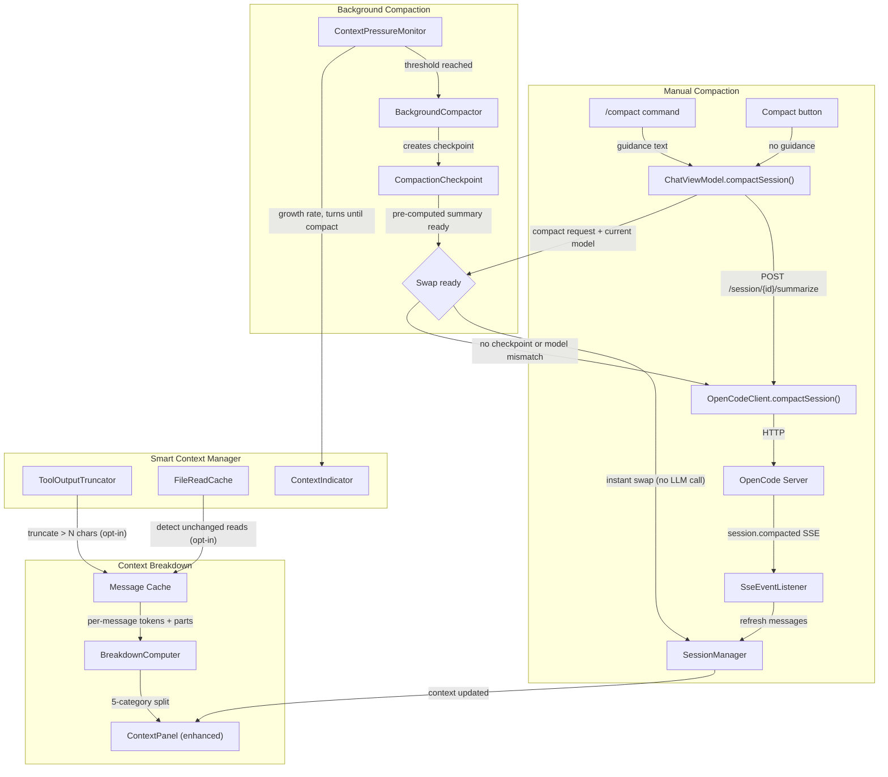
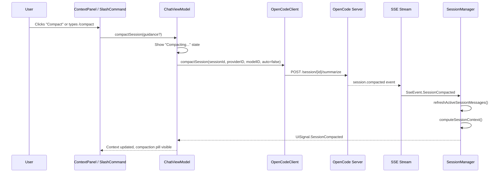
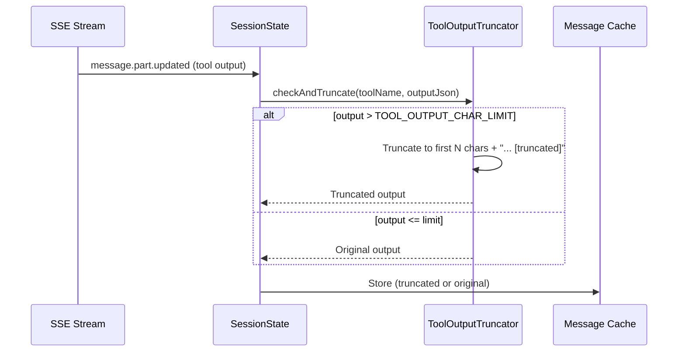
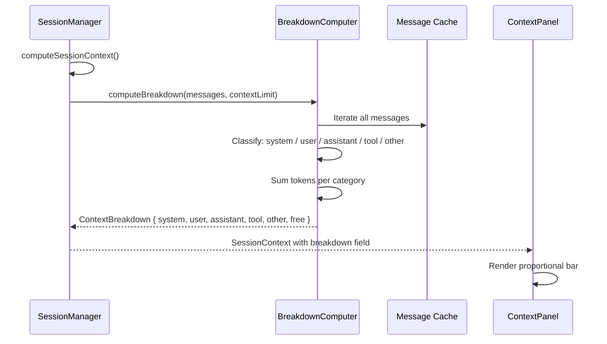

# Technical Design Document: Smart Compaction & Context Management

> **Status:** Partially implemented (guidance features dropped — server does not support `guidance` field; background compaction auto-trigger disabled — server `/summarize` performs actual compaction, not a preview)
> **Author(s):** —
> **Reviewer(s):** —
> **Last Updated:** 2026-06-27
> **Related docs:** [context-manager.md](Done/context-manager.md), [context-indicator.md](Done/context-indicator.md), [centralize-network-calls.md](Done/centralize-network-calls.md), [AGENTS.md](../../AGENTS.md)

> **Implementation note:** The TDD originally specified compaction guidance features
> (default guidance, per-compaction guidance input, `/compact <guidance>`). Librarian
> research confirmed the OpenCode server's `SummarizePayload` schema is only
> `{ providerID, modelID, auto }` — unknown fields are silently ignored. All guidance
> features were dropped from the implementation. The `/compact` command takes no
> arguments. See AGENTS.md § "Smart Compaction & Context Management" for details.

> **Background compaction deviation:** The TDD specified `enableBackgroundCompaction`
> defaulting to `true` with auto-trigger at 60% context. The implementation defaults to
> `false` and the auto-trigger is disabled (commented out in `SessionManager.kt`).
> Reason: the server's `POST /session/{id}/summarize` performs ACTUAL compaction
> (removes/summarizes messages server-side), not a preview. Auto-triggering it on
> context computation causes the session to compact immediately on load when usage
> exceeds the checkpoint threshold. There is no server API to pre-compute a summary
> without side effects. Manual compaction (`/compact` command, "Compact Now" button)
> is the correct path. The `BackgroundCompactor` class is retained as dead code in case
> a preview API is added in the future. See AGENTS.md for details.

---

## 1. TL;DR

The plugin currently has a passive context indicator (percentage + breakdown panel) but no way to manually trigger compaction, no visibility into what's consuming context, and no client-side intelligence about what can be safely pruned. This TDD introduces three interconnected systems:

1. **Context Breakdown Bar** — a 5-category visual breakdown (System, User, Assistant, Tool Calls, Other) in the Context panel tab, replacing the current flat token list with a proportional bar chart matching OpenCode Desktop's UX
2. **Manual Compaction** — a `/compact` slash command and a "Compact" button in the Context tab, wired to the existing dead-code `POST /session/{id}/summarize` endpoint, with optional guidance instructions
3. **Smart Context Manager** — a service layer that tracks per-tool-call token consumption, detects duplicate/stale file reads, computes importance scores, and exposes context pressure signals (growth rate, estimated turns until compaction)

The server owns actual compaction (summarization algorithm). The plugin provides observability, manual triggers, and client-side pre-processing (tool output truncation, duplicate detection) that reduces what the server needs to compact.

---

## 2. Context & Scope

### 2.1 Current State

**Context Indicator** (`ContextIndicator.kt`): Shows a doughnut ring with usage percentage, color-coded by pressure (green < 50%, yellow 50-75%, red > 75%). On hover: tooltip with token counts. On click: opens Context tab in sidebar.

**Context Panel** (`ContextPanel.kt`): Shows a flat list of token fields (Input, Output, Reasoning, Cache Read, Cache Write, Total) with values and a simple percentage bar. No breakdown by category, no proportional visualization, no actionable controls.

**Compaction** (`OpenCodeClient.kt:431-441`): `compactSession()` method exists as dead code — calls `POST /session/$sessionId/summarize` with `CompactSessionRequest(providerID, modelID, auto)`. Never invoked. The endpoint is live on the server.

**Token Data** (`ChatModels.kt:66-94`): Per-message token fields (`inputTokens`, `outputTokens`, `reasoningTokens`, `cacheReadTokens`, `cacheWriteTokens`, `cost`) are populated by `MessageFinalized` SSE events and REST loads. No per-part or per-tool-call tracking exists.

**Tool Call Data** (`ChatModels.kt:99-109`): `ToolCallPill` stores `toolCallId`, `toolName`, `title`, `kind`, `status`, `input: JsonObject?`, `output: List<JsonObject>?`, `metadata: JsonObject?`, `startTimeMs: Long?`. No size/token tracking per tool call.

**What's Missing:**
- No per-tool-call token consumption tracking
- No duplicate file read detection
- No file staleness tracking (mtime-based)
- No context pressure forecasting (growth rate, turns until compaction)
- No category-based context breakdown (System/User/Assistant/Tool/Other)
- No manual compaction trigger in UI
- No tool output truncation at insertion time

### 2.2 Problem Statement

Users have no visibility into *what* is consuming context (only total percentage), no way to manually compact when they know the session is getting long, and no client-side intelligence about what can be safely discarded. The server's auto-compaction is a black box — when it fires, users lose context without warning or control.

---

## 3. Goals & Non-Goals

### Goals

1. **Context breakdown visibility** — Users see a proportional bar showing System/User/Assistant/Tool Calls/Other token distribution, with per-category token counts
2. **Manual compaction control** — Users can trigger compaction via `/compact` slash command or Context tab button, with optional guidance instructions ("preserve database schema decisions")
3. **Background compaction** — When context reaches a configurable threshold, pre-compute a compaction summary in a background coroutine so the swap is instant when the user triggers manual compaction or when auto-compaction fires. **ON by default** because it provides instant compaction with no user action — the server call at 60% is lightweight (no LLM inference, just summarization) and users who prefer manual-only can disable it in Settings.
4. **Context pressure forecasting** — The context indicator shows estimated turns until compaction based on rolling growth rate
5. **Tool output truncation (opt-in)** — When enabled, tool results exceeding a configurable character limit are truncated at insertion time, preventing runaway context growth
6. **Duplicate file read suppression (opt-in)** — When enabled, repeated reads of unchanged files emit `[unchanged]` instead of re-emitting content

### Non-Goals

- **Client-side compaction algorithm** — The server owns summarization; we only trigger it, pre-cache summaries, and display results
- **Per-tool-call token counting from server** — The server doesn't expose this; we estimate from JSON byte sizes
- **Topic-aware selective compaction** — Requires message clustering (TF-IDF or embedding-based); deferred
- **System prompt compression** — The server manages system prompt assembly; we don't modify it
- **Per-image token cost tracking** — The server doesn't expose per-part token breakdowns; deferred

---

## 4. Proposed Solution

**Extend the existing context service (`SessionManager.computeSessionContext()`) with a breakdown computation layer that categorizes tokens into 5 buckets (System, User, Assistant, Tool Calls, Other), add a manual compaction trigger wired to the existing `compactSession()` dead code, introduce a `BackgroundCompactor` that pre-computes summaries at a configurable threshold for instant swap, and add a `ContextPressureMonitor` that computes growth rate and forecasts compaction timing. Client-side tool output truncation and duplicate file detection (both opt-in) reduce what enters the context in the first place.**

### 4.1 Architecture Diagram



### 4.2 Component & Module Design

| Component | Responsibility | Key Changes | Files |
|-----------|---------------|-------------|-------|
| **BreakdownComputer** | Categorizes tokens into 5 buckets from message cache | New object with `computeBreakdown()` | `ContextBreakdown.kt` (new) |
| **ContextPanel (enhanced)** | Renders proportional bar + per-category counts + compact button | Replace flat list with bar chart + breakdown | `ContextPanel.kt` |
| **ContextPressureMonitor** | Tracks growth rate, forecasts compaction timing | New class, fed by `computeSessionContext()` | `ContextPressureMonitor.kt` (new) |
| **ContextIndicator (enhanced)** | Shows pressure level + estimated turns | Add pressure badge to doughnut ring | `ContextIndicator.kt` |
| **BackgroundCompactor** | Pre-computes compaction summary at configurable threshold | New class, coroutine-based, swaps instantly | `BackgroundCompactor.kt` (new) |
| **CompactCommand** | `/compact` slash command handler | New local command in InputArea | `SlashCommandPalette.kt`, `ChatViewModel.kt` |
| **CompactButton** | Button in Context tab | New composable in ContextPanel | `ContextPanel.kt` |
| **ToolOutputTruncator** | Truncates tool results > N chars at insertion (opt-in) | New utility, called in SessionState | `ToolOutputTruncator.kt` (new) |
| **FileReadCache** | Tracks file reads by path+mtime+size (opt-in) | New session-scoped cache | `FileReadCache.kt` (new) |

### 4.3 API / Interface Design

**Existing endpoint (now wired):**

| Method | Path | Purpose | Status |
|--------|------|---------|--------|
| `POST` | `/session/{id}/summarize` | Trigger manual compaction | **Dead code → wired** |
| Body | `{ providerID, modelID, auto: false }` | `auto: false` = manual trigger | — |
| Timeout | `TimeoutProfile.LONG` | Already configured | — |

**SSE events (already handled):**

| Event | Handler | Action |
|-------|---------|--------|
| `session.compacted` | `SessionManager` → `UiSignal.SessionCompacted` | Refresh messages, recompute context |
| `message.removed` | `SessionState.removeMessageByServerId()` | Remove from cache |
| `message.part.updated (compaction)` | `SessionState` → `MessagePart.Compaction` | Show compaction pill |

No new server endpoints are needed. All data for breakdown computation comes from the local message cache.

### 4.4 Key Flows

**4.4.1 Manual Compaction Flow**



**4.4.2 Tool Output Truncation Flow**



**4.4.3 Context Breakdown Computation**



### 4.5 Technology Stack

| Layer | Technology | Notes |
|-------|-----------|-------|
| Language | Kotlin | Matches existing codebase |
| UI | Compose for Desktop (Jewel) | Matches existing UI framework |
| HTTP | Ktor Client | Already used in `OpenCodeClient` |
| State | Kotlin StateFlow | Matches existing ViewModel pattern |
| Concurrency | Kotlin Coroutines | Background truncation, pressure monitoring |

### 4.6 Migration Strategy

Three independent workstreams, each shippable independently:

**Workstream 1: Context Breakdown Bar** (no API changes, pure UI + local computation)
- Add `ContextBreakdown` data class
- Add `BreakdownComputer.computeBreakdown()` 
- Enhance `ContextPanel` with proportional bar
- Enhance `SessionContext` with breakdown field

**Workstream 2: Manual Compaction** (wire existing dead code + UI + settings)
- Wire `compactSession()` in ChatViewModel
- Add `/compact` local slash command
- Add Compact button in Context tab
- Add "Tools → Sigil → Context" settings page with all compaction options
- Handle compaction guidance setting

**Workstream 3: Smart Context Manager** (client-side preprocessing + background compaction)
- Add `ToolOutputTruncator` with configurable limit (opt-in, off by default)
- Add `FileReadCache` with mtime+size fingerprinting (opt-in, off by default)
- Add `BackgroundCompactor` with checkpoint/swap pattern (ON by default)
- Add `ContextPressureMonitor` with growth rate tracking
- Enhance `ContextIndicator` with pressure badge

### 4.7 Implementation Blueprint

#### 4.7.1 Data Models

**New types in `ChatModels.kt`:**

```kotlin
/**
 * Token breakdown by category for the active session.
 * Computed from the local message cache — the server does NOT provide per-category breakdown.
 */
data class ContextBreakdown(
    val systemPromptTokens: Long, // System prompt + tool definitions + format tokens (estimated from first-assistant inputTokens minus user message tokens — cannot separate further)
    val userTokens: Long,         // User message text content
    val assistantTokens: Long,    // Assistant text responses (not tool calls)
    val toolTokens: Long,         // Tool call inputs + outputs
    val otherTokens: Long,        // Thinking/reasoning + cache + unclassified
    val freeTokens: Long,         // contextLimit - total (can be negative when over-full)
    val totalTokens: Long,        // sum of all categories
    val toolBreakdown: Map<String, ToolCategoryBreakdown>  // per-tool-name aggregation
) {
    /**
     * Percentages for the proportional bar.
     * When freeTokens < 0 (context over-full), percentages sum to >100%.
     * The UI should cap the bar at 100% and show an overflow indicator.
     */
    val systemPromptPercent: Float get() = if (totalTokens > 0) systemPromptTokens.toFloat() / totalTokens * 100 else 0f
    val userPercent: Float get() = if (totalTokens > 0) userTokens.toFloat() / totalTokens * 100 else 0f
    val assistantPercent: Float get() = if (totalTokens > 0) assistantTokens.toFloat() / totalTokens * 100 else 0f
    val toolPercent: Float get() = if (totalTokens > 0) toolTokens.toFloat() / totalTokens * 100 else 0f
    val otherPercent: Float get() = if (totalTokens > 0) otherTokens.toFloat() / totalTokens * 100 else 0f
}

/**
 * Per-tool-name token aggregation for the tool breakdown sub-view.
 */
data class ToolCategoryBreakdown(
    val toolName: String,
    val callCount: Int,
    val estimatedTokens: Long,     // sum of input + output JSON byte sizes / 4
    val lastCallAt: Long           // epoch millis
)

/**
 * Context pressure signals computed from rolling growth rate.
 */
data class ContextPressure(
    val currentTokens: Long,
    val contextLimit: Long,
    val usagePercent: Float,
    val growthPerTurn: Double,         // average tokens added per assistant turn (rolling 20-turn window)
    val turnsUntilCompact: Int?,       // estimated turns before auto-compact fires (null = unknown)
    val burnRatePerMinute: Double,     // tokens per minute (wall-clock growth rate)
    val pressureLevel: PressureLevel
)

enum class PressureLevel {
    COMFORTABLE,   // < 50%
    ELEVATED,      // 50-70%
    HIGH,          // 70-85%
    CRITICAL       // 85%+
}

/** Extended SessionContext with breakdown and pressure */
data class SessionContext(
    // ... existing fields unchanged ...
    val breakdown: ContextBreakdown?,
    val pressure: ContextPressure?
)
```

**Modifications to existing `SessionContext`:**

```kotlin
data class SessionContext(
    // ... all existing fields (lines 303-327) preserved — verified safe:
    // all existing callers in SessionManager.kt:847-871 use named arguments,
    // so adding nullable fields with defaults at the end is backward-compatible.
    // No positional construction exists.
    val breakdown: ContextBreakdown? = null,   // NEW — null until breakdown computation is ready
    val pressure: ContextPressure? = null       // NEW — null until enough turns for growth rate
)
```

#### 4.7.2 Class & Interface Definitions

**BreakdownComputer (new file: `ContextBreakdown.kt`):**

```kotlin
/**
 * Computes a 5-category token breakdown from the local message cache.
 *
 * Classification logic:
 * - systemPromptTokens: Estimated from the first assistant message's inputTokens minus
 *   all prior user message tokens. This approximates system prompt + tool definitions +
 *   format tokens + attached files — cannot be separated further without server-side
 *   per-part token counts. The category is labeled "System + Tool Definitions" in the UI.
 *   Known limitation: cannot distinguish system prompt bloat from oversized tool definitions.
 * - userTokens: Sum of all user message text parts (estimated via char count / calibratedCharsPerToken).
 * - assistantTokens: Sum of all assistant message text parts (estimated via char count / calibratedCharsPerToken).
 * - toolTokens: Sum of all tool call + tool result parts (estimated from JSON byte size / calibratedCharsPerToken).
 * - otherTokens: reasoningTokens + cacheReadTokens + cacheWriteTokens + unclassified.
 *
 * IMPORTANT: These are estimates. The server does not expose per-part token counts.
 * We use a calibrated char-to-token ratio (default ~4 chars/token, adjusted via
 * calibrate() after each MessageFinalized SSE event) as a reasonable approximation.
 */
object BreakdownComputer {

    private const val DEFAULT_CHARS_PER_TOKEN = 4.0

    /**
     * Dynamic char-to-token ratio, calibrated from actual MessageFinalized data.
     * Updated after each assistant response when actual inputTokens is available.
     *
     * Thread safety: Uses @Volatile (not Mutex) because:
     * - Lost calibration samples from concurrent calibrate() calls are tolerable
     *   (EMA smoothly recovers from a missed data point).
     * - computeBreakdown() takes a snapshot (val charsPerToken = calibratedCharsPerToken)
     *   that doesn't require consistency with concurrent calibration writes.
     * - No read-modify-write atomicity needed: each calibrate() is an independent observation.
     *
     * IMPORTANT: Must call [resetCalibration] on session switch — different sessions
     * may use different models with different char-to-token ratios (Claude ~3.5,
     * Gemini ~3.8). Carrying calibration across sessions would produce incorrect estimates.
     */
    @Volatile
    private var calibratedCharsPerToken: Double = DEFAULT_CHARS_PER_TOKEN

    /**
     * Reset the calibrated ratio to the default. Called on session switch to prevent
     * cross-session calibration pollution when models differ between sessions.
     */
    fun resetCalibration() {
        calibratedCharsPerToken = DEFAULT_CHARS_PER_TOKEN
    }

    /**
     * Calibrate the char-to-token ratio from actual server data.
     * Called after each MessageFinalized SSE event when inputTokens is known.
     *
     * @param estimatedChars total characters in the prompt (from local message cache)
     * @param actualTokens actual inputTokens from the server
     */
    fun calibrate(estimatedChars: Long, actualTokens: Long) {
        if (actualTokens > 0 && estimatedChars > 0) {
            val observed = estimatedChars.toDouble() / actualTokens
            // Exponential moving average: 80% old + 20% new (smooth calibration)
            calibratedCharsPerToken = 0.8 * calibratedCharsPerToken + 0.2 * observed
        }
    }

    fun computeBreakdown(
        messages: Map<String, ChatMessage>,
        contextLimit: Long
    ): ContextBreakdown {
        val charsPerToken = calibratedCharsPerToken
        // ... use charsPerToken for all char-to-token conversions ...
    }
}

/**
 * Tracks context pressure via rolling growth rate.
 * Uses Welford's algorithm for online variance computation.
 *
 * Thread safety: All mutable state is guarded by a [Mutex]. Both recordTurn()
 * and computePressure() acquire the lock to prevent concurrent modification of
 * growthHistory. Since recordTurn() is called from computeSessionContext()
 * (coroutine dispatcher) and computePressure() may be called from the UI thread,
 * the mutex prevents ConcurrentModificationException and data corruption.
 */
class ContextPressureMonitor(
    private val clock: () -> Long = System::currentTimeMillis  // injectable for testing
) {
    private val mutex = Mutex()
    private val growthHistory = mutableListOf<Double>()  // rolling window of per-turn growth
    private var lastInputTokens: Long = 0
    private var lastTimestampMs: Long = 0

    companion object {
        const val WINDOW_SIZE = 20           // rolling window of last 20 turns
        // NOTE: Pressure thresholds are defined in CompactionConstants (§4.7.5) as the
        // single source of truth. Use CompactionConstants.PRESSURE_*_THRESHOLD here,
        // NOT local constants. The PressureLevel enum maps to CompactionConstants values.
    }

    /**
     * Record a new cumulative input token count after an assistant response completes.
     *
     * @param inputTokens CUMULATIVE prompt size from the last assistant message's
     *   inputTokens field (total tokens in the full context window at this point).
     *   NOT incremental — the delta is computed internally by subtracting the
     *   previous recording.
     * @param timestampMs Wall-clock time in epoch millis for burn-rate computation.
     */
    suspend fun recordTurn(inputTokens: Long, timestampMs: Long): Unit = mutex.withLock {
        // ... compute delta from lastInputTokens, add to growthHistory, trim to WINDOW_SIZE ...
    }

    /**
     * Reset growth history after a compaction event. When the server compacts,
     * inputTokens drops significantly (e.g., 150K → 40K), which would produce a
     * large negative delta that corrupts the rolling average. Calling this after
     * compaction resets the monitor to start fresh from the new context state.
     *
     * Called from SessionManager when handling session.compacted SSE events.
     */
    suspend fun onCompaction(): Unit = mutex.withLock {
        growthHistory.clear()
        lastInputTokens = 0
        lastTimestampMs = 0
    }

    /**
     * Compute current context pressure from accumulated growth data.
     * Returns null if not enough data points (< 3 turns).
     */
    suspend fun computePressure(currentTokens: Long, contextLimit: Long): ContextPressure? = mutex.withLock {
        // ... compute rolling average, growth rate, burn rate, turns until compact ...
    }

    /** Reset on session switch */
    suspend fun reset(): Unit = mutex.withLock {
        growthHistory.clear()
        lastInputTokens = 0
        lastTimestampMs = 0
    }
}

/**
 * Truncates tool outputs exceeding a character limit.
 * Called by SessionState when processing tool result parts.
 * Only active when settings.truncateToolOutput is true.
 */
object ToolOutputTruncator {
    /**
     * Truncate tool output JSON if it exceeds the character limit.
     *
     * JSON-safe truncation: Instead of cutting at an arbitrary character boundary
     * (which would produce invalid JSON), this method:
     * 1. Serializes each JsonObject to a string and checks total length.
     * 2. If under limit, returns the original list unchanged.
     * 3. If over limit, collects complete JSON objects until adding the next
     *    would exceed the limit, then returns the truncated list with a
     *    marker object: {"_truncated": true, "originalCount": N}.
     *
     * This ensures the output remains valid JSON that the server can parse
     * during compaction.
     */
    fun truncateIfNeeded(
        toolName: String,
        output: List<JsonObject>,
        charLimit: Int
    ): List<JsonObject> { ... }
}

/**
 * Session-scoped cache for detecting duplicate file reads.
 * Only active when settings.detectDuplicateReads is true.
 * Tracks (path, mtime, size) tuples to identify unchanged files.
 *
 * On duplicate read: emits a short placeholder instead of re-emitting full content.
 * On file write/edit: invalidates the cache entry (forces re-read).
 *
 * Thread safety: Uses ConcurrentHashMap with compute() for atomic check-and-record.
 * The isDuplicateRead() + recordRead() two-call pattern is NOT atomic (TOCTOU) —
 * use checkAndRecord() for atomic operation. The TOCTOU window is small and the
 * worst case (serving stale content once) is acceptable for an opt-in cache.
 *
 * Size bound: [MAX_ENTRIES] limits cache growth. When exceeded, the oldest entry
 * (by lastReadAtMs) is evicted. Prevents unbounded growth from tools that read
 * many unique temp files or paths with varying normalization.
 */
class FileReadCache {
    data class FileRecord(
        val path: String,
        val mtimeMs: Long,
        val sizeBytes: Long,
        val readCount: Int = 1,
        val lastReadAtMs: Long = System.currentTimeMillis()
    )

    private val cache = ConcurrentHashMap<String, FileRecord>()

    companion object {
        /** Maximum cache entries before LRU eviction kicks in. */
        const val MAX_ENTRIES = 500
    }

    /** Atomic check-and-record: returns true if duplicate, records the read atomically. */
    fun checkAndRecord(path: String, mtimeMs: Long, sizeBytes: Long): Boolean { ... }

    fun isDuplicateRead(path: String, mtimeMs: Long, sizeBytes: Long): Boolean { ... }
    fun recordRead(path: String, mtimeMs: Long, sizeBytes: Long) { ... }
    fun invalidate(path: String) { ... }
    fun clear() { ... }
}

/**
 * Pre-computes compaction summaries in the background.
 *
 * When context usage exceeds [BackgroundCompactorSettings.checkpointThresholdPercent],
 * a background coroutine snapshots the current message history and requests a
 * compaction summary from the server. The summary is stored and ready for instant
 * swap when the user triggers manual compaction or when auto-compaction fires.
 *
 * If no checkpoint is available at swap time (e.g., context grew too fast),
 * falls back to live compaction (standard POST /session/{id}/summarize).
 *
 * Thread safety:
 * - [checkpointSummary] is @Volatile — reads are lock-free
 * - [isCheckpointInProgress] is AtomicBoolean — prevents concurrent checkpoints
 * - Compaction operates on a SHALLOW COPY of the message map (reference copy),
 *   not a deep copy. ChatMessage is a data class, so individual messages are
 *   immutable once created. The map copy prevents concurrent modification of
 *   the map structure while iterating, and data class immutability ensures
 *   individual message contents can't change mid-iteration.
 *
 * Coroutine lifecycle:
 * - The background coroutine is launched in a [CoroutineScope] tied to the
 *   session lifecycle. On session switch, [clearCheckpoint] cancels the
 *   in-progress Job AND clears the checkpoint, preventing stale writes.
 *   The coroutine also checks the session ID at completion and discards
 *   results if the session changed.
 * - [maxCheckpointAgeMs] provides a safety net: even if cancellation is delayed,
 *   checkpoints older than the threshold are discarded on read.
 */
class BackgroundCompactor(
    private val client: OpenCodeClient,
    private val settings: BackgroundCompactorSettings,
    private val scope: CoroutineScope  // Scoped to the active session lifecycle
) {
    @Volatile
    private var checkpointSummary: CompactionCheckpoint? = null

    private val isCheckpointInProgress = AtomicBoolean(false)

    /** Track the in-progress checkpoint coroutine for cancellation on session switch. */
    @Volatile
    private var checkpointJob: Job? = null

    data class CompactionCheckpoint(
        val sessionId: String,
        val providerID: String,       // model at checkpoint time — validated at swap
        val modelID: String,          // model at checkpoint time — validated at swap
        val summary: String,
        val messageCountAtCheckpoint: Int,  // total message count for staleness display
        val tokensAtCheckpoint: Long,
        val createdAtMs: Long
    )

    /**
     * Called after each assistant response completes.
     * If context usage exceeds the checkpoint threshold and no checkpoint is in progress,
     * launches a background coroutine to pre-compute the compaction summary.
     *
     * Messages are shallow-copied (reference copy of the map) — safe because
     * ChatMessage is an immutable data class.
     */
    fun maybeCheckpoint(
        sessionId: String,
        messages: Map<String, ChatMessage>,  // shallow-copied by caller
        contextLimit: Long,
        providerID: String,
        modelID: String
    ) {
        // ... check threshold, acquire AtomicBoolean, launch in scope ...
        // Store Job: checkpointJob = scope.launch { ... }
        // On completion: check sessionId matches _activeSessionId before writing
    }

    /**
     * Returns the pre-computed checkpoint if available, for the correct session,
     * and for the current model. Returns null if:
     * - No checkpoint exists
     * - Session ID doesn't match (session was switched)
     * - Model changed since checkpoint was created (model mismatch guard)
     * - Checkpoint is older than [BackgroundCompactorSettings.maxCheckpointAgeMs]
     */
    fun getCheckpoint(sessionId: String, currentProviderID: String, currentModelID: String): CompactionCheckpoint? {
        val cp = checkpointSummary ?: return null
        if (cp.sessionId != sessionId) return null
        if (cp.providerID != currentProviderID || cp.modelID != currentModelID) return null
        if (System.currentTimeMillis() - cp.createdAtMs > settings.maxCheckpointAgeMs) return null
        return cp
    }

    /**
     * Clears the checkpoint and cancels any in-progress background coroutine.
     * Called on session switch, after successful swap, on error, and after
     * server-side compaction (session.compacted SSE event) to discard stale data.
     */
    fun clearCheckpoint() {
        checkpointJob?.cancel()
        checkpointJob = null
        checkpointSummary = null
        isCheckpointInProgress.set(false)
    }
}

/**
 * Settings for background compaction behavior.
 * Stored in OpenCodeSettingsState, exposed in Tools → Sigil → Context.
 * Default: ON — background compaction provides instant swap with no user action.
 */
data class BackgroundCompactorSettings(
    val enabled: Boolean = true,   // ON by default
    val checkpointThresholdPercent: Float = 60f,  // start background work at 60%
    val swapThresholdPercent: Float = 80f,         // use pre-computed summary at 80%
    val maxCheckpointAgeMs: Long = 300_000L        // discard checkpoints older than 5 min
)
```

#### 4.7.3 Function Signatures

**ChatViewModel — manual compaction:**

```kotlin
/**
 * Trigger manual compaction for the active session.
 * Calls POST /session/{id}/summarize with auto=false.
 *
 * @param guidance optional user instructions for what to preserve during compaction
 *                 (e.g., "preserve database schema decisions and API contracts")
 *                 If null, uses empty string (server default compaction behavior).
 */
fun compactSession(guidance: String? = null) {
    // 1. Guard: must have active session, client must be connected
    // 2. Set _compactionState.value = CompactionState.InProgress
    // 3. Launch coroutine:
    //    a. Get current model/provider from controlState
    //    b. Call client.compactSession(sessionId, providerID, modelID, auto=false)
    //    c. On success: _compactionState.value = CompactionState.Idle
    //       (SSE session.compacted event handles message refresh)
    //    d. On HttpRequestTimeoutException / TimeoutCancellationException:
    //       _compactionState.value = CompactionState.Error(CompactionError.Timeout)
    //    e. On other exceptions:
    //       _compactionState.value = CompactionState.Error(CompactionError.ServerError(e.message))
    //    f. On false return:
    //       _compactionState.value = CompactionState.Error(CompactionError.ServerError("Compaction failed"))
}
```

**SessionManager — enhanced context computation:**

```kotlin
/**
 * Enhanced computeSessionContext that includes breakdown and pressure.
 * Modifies [SessionManager.computeSessionContextInternal] (the private method at
 * SessionManager.kt:765) — NOT the public wrapper at line 708.
 *
 * Adds:
 * - BreakdownComputer.computeBreakdown() for 5-category split
 * - ContextPressureMonitor.recordTurn() for growth tracking
 * - ContextPressureMonitor.computePressure() for forecasting
 *
 * Also call pressureMonitor.onCompaction() from the session.compacted SSE event
 * handler (SessionManager.kt:450-456) to reset growth history after compaction.
 */
internal suspend fun computeSessionContext(
    controlState: ControlBarState? = null
): SessionContextState {
    // ... existing logic for token accumulation (SessionManager.kt:765-882) ...

    // NEW: Compute breakdown
    val breakdown = BreakdownComputer.computeBreakdown(messages, contextLimit)

    // NEW: Record turn for pressure monitoring (pass cumulative inputTokens)
    pressureMonitor.recordTurn(inputTokens, pressureMonitor.clock())

    // NEW: Compute pressure (returns null if < 3 data points)
    val pressure = pressureMonitor.computePressure(totalTokens, contextLimit)

    // Build SessionContext with breakdown and pressure
    return SessionContextState.Loaded(
        context = SessionContext(
            // ... existing fields ...
            breakdown = breakdown,
            pressure = pressure
        )
    )
}
```

**OpenCodeClient — wire existing compactSession():**

```kotlin
// Existing method (OpenCodeClient.kt:431-441) — already correct, just needs callers
suspend fun compactSession(
    sessionId: String,
    providerID: String,
    modelID: String,
    auto: Boolean
): Boolean {
    return postSuccess(
        "$baseUrl/session/$sessionId/summarize",
        CompactSessionRequest(providerID, modelID, auto),
        TimeoutProfile.LONG
    )
}
```

#### 4.7.4 Component Mapping

| Component | Responsibility | Data Model(s) | API Endpoint(s) | Key Files |
|-----------|---------------|---------------|------------------|-----------|
| BreakdownComputer | 5-category token split | `ContextBreakdown`, `ToolCategoryBreakdown` | — | `ContextBreakdown.kt` (new) |
| ContextPanel (enhanced) | Proportional bar + breakdown + compact button | `ContextBreakdown` | — | `ContextPanel.kt` |
| ContextPressureMonitor | Growth rate + forecasting | `ContextPressure`, `PressureLevel` | — | `ContextPressureMonitor.kt` (new) |
| ContextIndicator (enhanced) | Pressure badge | `ContextPressure` | — | `ContextIndicator.kt` |
| BackgroundCompactor | Pre-compute summaries at threshold | `CompactionCheckpoint` | `POST /session/{id}/summarize` | `BackgroundCompactor.kt` (new) |
| ChatViewModel | Manual compaction trigger | `CompactionState` | `POST /session/{id}/summarize` | `ChatViewModel.kt` |
| ToolOutputTruncator | Truncate large tool outputs (opt-in) | — | — | `ToolOutputTruncator.kt` (new) |
| FileReadCache | Duplicate file read detection (opt-in) | `FileRecord` | — | `FileReadCache.kt` (new) |
| SlashCommandPalette | `/compact` command | — | — | `SlashCommandPalette.kt`, `ChatViewModel.kt` |

#### 4.7.5 Enums, Constants & Configuration

```kotlin
object CompactionConstants {
    // ── Tool Output Truncation (opt-in, off by default) ──
    /** Default maximum characters for a single tool output when truncation is enabled. ~12.5K tokens. */
    const val DEFAULT_TOOL_OUTPUT_CHAR_LIMIT = 50_000

    // ── Context Pressure ──
    /** Rolling window size for growth rate computation (last N turns). */
    const val PRESSURE_WINDOW_SIZE = 20

    /** Minimum data points before pressure forecast is shown. */
    const val PRESSURE_MIN_TURNS = 3

    /**
     * Thresholds for pressure level color coding.
     * Single source of truth — do NOT duplicate in ContextPressureMonitor.companion.
     */
    const val PRESSURE_CRITICAL_THRESHOLD = 0.85
    const val PRESSURE_HIGH_THRESHOLD = 0.70
    const val PRESSURE_ELEVATED_THRESHOLD = 0.50

    // ── Background Compaction (ON by default) ──
    /** Default checkpoint threshold — start background work at 60% context. */
    const val DEFAULT_CHECKPOINT_THRESHOLD_PERCENT = 60f

    /** Default swap threshold — use pre-computed summary at 80% context. */
    const val DEFAULT_SWAP_THRESHOLD_PERCENT = 80f

    /** Maximum age for a checkpoint before it's discarded (5 minutes). */
    const val MAX_CHECKPOINT_AGE_MS = 300_000L

    // ── Compact Command ──
    /** Timeout for manual compaction HTTP call. */
    const val COMPACT_TIMEOUT_MS = 120_000L  // 2 minutes
}

enum class CompactionState {
    Idle,
    InProgress,
    Error(val error: CompactionError)  // carries typed error for UI message mapping
}
```

#### 4.7.6 Error Types

```kotlin
sealed interface CompactionError {
    data object NoActiveSession : CompactionError
    data object NotConnected : CompactionError
    data class ServerError(val message: String) : CompactionError
    data object Timeout : CompactionError
}
```

#### 4.8 User-Facing Options

All context/compaction settings live under **Settings → Tools → Sigil → Context** (new child configurable under the existing Sigil settings, following the MCP and Follow Agent pattern in `plugin.xml`).

**4.8.1 Settings Panel (Persistent, Global)**

Registered in `plugin.xml` as a new `applicationConfigurable` with `parentId="com.opencode.acp.settings.OpenCodeSettingsConfigurable"`.

| Setting | Type | Default | Range | What It Controls |
|---------|------|---------|-------|-----------------|
| **Truncate tool output** | Checkbox | Off | — | When on, tool results exceeding the char limit are truncated at insertion time |
| **Tool output char limit** | Number field | 50,000 | 10,000–200,000 | Max chars per tool output before truncation (only visible when "Truncate tool output" is on) |
| **Detect duplicate file reads** | Checkbox | Off | — | When on, repeated reads of unchanged files emit `[unchanged]` instead of re-emitting content |
| **Enable background compaction** | Checkbox | On | — | When on, pre-computes compaction summaries in the background for instant swap. Tooltip: "Pre-computes compaction summaries at 60% context so manual compaction is instant. Disable if you prefer manual-only compaction." |
| **Checkpoint threshold** | Number field | 60% | 40–80% | Context usage % at which background checkpointing starts (only visible when background compaction is on) |
| **Swap threshold** | Number field | 80% | 60–95% | Context usage % at which pre-computed summary is ready for instant swap (only visible when background compaction is on) |
| **Default compaction guidance** | Text field (multiline) | Empty | — | Persistent guidance injected into every manual `/compact` call (e.g., "preserve database schema decisions") |
| **Show context breakdown** | Checkbox | On | — | Show the 5-category proportional bar in Context tab |
| **Pressure notification** | Dropdown | HIGH (70%) | NEVER / ELEVATED (50%) / HIGH (70%) / CRITICAL (85%) | When to show pressure warnings on the context indicator |
| **Compact confirmation** | Checkbox | On | — | Ask for confirmation before triggering manual compaction |

**4.8.2 Context Tab Controls (Session-Scoped, Visible)**

These are always visible in the Context panel tab — no settings needed:

| Control | Type | What It Does |
|---------|------|-------------|
| **Compact Now button** | Button | Triggers manual compaction. Shows guidance input if "Compact confirmation" is on. Disabled when compaction is in progress. |
| **Guidance input** | Text field (inline, collapsible) | Optional per-compaction guidance. Placeholder: "What to preserve? (optional)". Pre-filled with default guidance from settings if set. |
| **Tool breakdown expandable** | Expandable section | Shows per-tool-name token aggregation (bash: 42K, grep: 18K, etc.). Only shown when breakdown data is available. |
| **Compaction state indicator** | Badge | Shows "Compacting..." during manual compaction, "Ready" when background checkpoint is available. |

**4.8.3 Slash Command (Ephemeral, Per-Invocation)**

| Command | Syntax | What It Does |
|---------|--------|-------------|
| `/compact` | `/compact` | Compact with default guidance (from settings) |
| `/compact` | `/compact <guidance>` | Compact with custom guidance text |

**4.8.4 Settings UI Layout**

```
Settings → Tools → Sigil → Context
├── Context Display
│   ├── [x] Show context breakdown bar
│   └── Pressure notification: [HIGH (70%) ▼]
├── Tool Output Management
│   ├── [ ] Truncate tool output
│   │   └── Tool output char limit: [50000] (visible when checked)
│   └── [ ] Detect duplicate file reads
├── Background Compaction
│   ├── [x] Enable background compaction
│   │   ├── Checkpoint threshold: [60%] (visible when checked)
│   │   └── Swap threshold: [80%] (visible when checked)
│   └── (tooltip: "Pre-computes compaction summaries at 60% context so manual compaction is instant")
├── Manual Compaction
│   ├── [x] Compact confirmation
│   └── Default guidance: [________________] (multiline)
```

**4.8.5 Settings State (OpenCodeSettingsState additions)**

All numeric settings include clamping/validation in the setter or on settings Apply to prevent corrupt values from XStream deserialization or direct manipulation:

```kotlin
// Context & Compaction settings (Tools → Sigil → Context)
var truncateToolOutput: Boolean = false
var toolOutputCharLimit: Int = 50_000        // clamped to 10_000..200_000 on set
var detectDuplicateReads: Boolean = false
var enableBackgroundCompaction: Boolean = true  // ON by default — instant swap with no user action
var checkpointThresholdPercent: Float = 60f     // clamped to 40f..80f on set
var swapThresholdPercent: Float = 80f           // clamped to 60f..95f on set
var defaultCompactionGuidance: String = ""
var showContextBreakdown: Boolean = true
var pressureNotificationThreshold: String = "HIGH"  // NEVER / ELEVATED / HIGH / CRITICAL
var compactConfirmation: Boolean = true
```

---

## 5. Assumptions & Dependencies

### Assumptions

1. **Server compaction endpoint is stable** — `POST /session/{id}/summarize` accepts `{ providerID, modelID, auto }`. The endpoint is synchronous: it blocks until compaction completes and returns success/failure. The response is NOT streamed via SSE — the `session.compacted` SSE event fires as a side effect after the HTTP response. The `BackgroundCompactor` relies on this synchronous behavior: the summary is ready when `compactSession()` returns. If the server changes to async behavior, the BackgroundCompactor must be updated to wait for the SSE event instead. The endpoint is documented in the OpenAPI spec at `127.0.0.1:4096/doc`.
2. **Server SSE events are reliable** — `session.compacted` and `message.removed` events fire after compaction completes. The plugin's existing event handling is sufficient.
3. **Token data from `MessageFinalized` is accurate** — Per-message `inputTokens`, `outputTokens`, `reasoningTokens` fields are populated correctly by the server.
4. **Char-to-token ratio is approximately 4** — Used for breakdown estimation. Actual ratio varies by model (Claude ~3.5, Gemini ~3.8) but 4 is a reasonable default.
5. **Tool output JSON byte size correlates with token count** — A rough heuristic. Not exact, but sufficient for breakdown visualization.

### Dependencies

- **OpenCode Server** — `POST /session/{id}/summarize` endpoint (already exists, confirmed live)
- **Existing `OpenCodeClient.compactSession()`** — Dead code at `OpenCodeClient.kt:431-441`, already wired with correct timeout profile
- **Existing SSE event handling** — `session.compacted`, `message.removed`, compaction parts already parsed and handled
- **Existing `computeSessionContext()`** — Enhancement target in `SessionManager.kt:765-882`
- **Existing `ContextPanel.kt`** — Enhancement target for proportional bar UI

---

## 6. Alternatives Considered

### Alternative: Client-Side Compaction (LLM Summarization)

*What it is:* Use a cheap model (e.g., GPT-4o-mini) to summarize conversation history client-side, replacing old messages with a compressed summary.

*Why plausible:* Full control over summarization prompt, no dependency on server compaction endpoint, can be customized per user.

*Why rejected:* The server already handles compaction with its own model and algorithm. Client-side compaction would race with server auto-compaction. The server's compaction is transparent and tested — reimplementing it client-side adds complexity with no quality benefit.

**Note on AGENTS.md §1:** AGENTS.md historically warned against client-side overflow detection and a `/compact` command. The project owner has decided to override this guidance because OpenCode's server-side compaction lacks sufficient user control and observability. The TDD's approach (manual `/compact` trigger, background pre-checkpointing, pressure monitoring) is fundamentally different from client-side LLM summarization — it triggers and enhances the *server's existing compaction*, not a competing client-side implementation. AGENTS.md §1 should be updated to reflect this decision.

### Alternative: Per-Part Token Tracking via Server API

*What it is:* Request the server to expose per-part token counts (text tokens, tool tokens, thinking tokens) in SSE events or REST responses.

*Why plausible:* Exact breakdown instead of estimation. No char-to-token ratio approximation needed.

*Why rejected:* Requires server-side changes (OpenCode server is a separate project). The estimation approach is sufficient for visualization. The 5-category breakdown is approximate by nature — exact numbers would give false precision.

### Alternative: Background Pre-Compaction Checkpointing (Double-Buffer)

*What it is:* Checkpoint at 60% context capacity, pre-compute summary in background, swap at 80% for instant compaction with no UI freeze.

*Why plausible:* Eliminates stop-the-world compaction latency. The model has full attention at 60% capacity, producing higher-quality summaries.

*Why included (not rejected):* This is a core part of the design — the `BackgroundCompactor` implements exactly this pattern. The server's existing compaction is already fast, but background checkpointing means manual compaction is instant (no waiting for the server to summarize). The double-buffer pattern is ON by default for all users, providing instant swap with no user action. Users who prefer manual-only compaction can disable it in Settings → Tools → Sigil → Context.

---

## 7. Cross-Cutting Concerns

### 7.1 Performance

**Tool output truncation** adds O(n) per tool result where n = output JSON size. For typical tool outputs (< 10KB), this is negligible. For pathological cases (bash output with 100K+ lines), truncation prevents sending megabytes to the server.

**Breakdown computation** iterates all messages in the cache. For sessions with 500+ messages, this is ~500 iterations of lightweight classification. No performance concern.

**FileReadCache** uses `ConcurrentHashMap` with path as key. O(1) lookup. Memory overhead is proportional to number of unique files read (typically < 100 per session).

### 7.2 Observability

All new components log via `KotlinLogging` with `[ACP]` prefix:
- `BreakdownComputer`: `logger.debug { "[ACP] Breakdown: system=${...} user=${...} tool=${...}" }`
- `ContextPressureMonitor`: `logger.debug { "[ACP] Pressure: ${pressure.pressureLevel} growth=${pressure.growthPerTurn}" }`
- `ToolOutputTruncator`: `logger.info { "[ACP] Truncated ${toolName} output from ${originalSize} to ${truncatedSize} chars" }`
- `FileReadCache`: `logger.debug { "[ACP] Duplicate read detected: $path (read ${record.readCount} times)" }`
- Manual compaction: `logger.info { "[ACP] Manual compaction triggered for session $sessionId" }`

### 7.3 Security

No new security concerns. Manual compaction calls the same authenticated endpoint as auto-compaction. Tool output truncation is a local operation with no external data flow.

---

## 8. Testing Strategy

### 8.1 Test Infrastructure

| Concern | Approach |
|---------|----------|
| **Unit test framework** | JUnit 5 + kotlinx-coroutines-test for coroutine testing |
| **Mocking** | `OpenCodeClient` is already an interface — mock via `io.mockk` or similar. `SessionManager` can be tested with a fake client that returns canned SSE events. |
| **SSE event testing** | Use a fake `SseEventListener` that accepts pre-built event strings. Feed events through the same parsing pipeline to test `SseEvent` → `SessionState` transitions. |
| **Compose UI testing** | `compose-ui-test-junit4` for ContextPanel rendering. Test that the proportional bar renders correct widths given a `ContextBreakdown`. |
| **Coroutine testing** | Use `runTest` + `TestCoroutineDispatcher` for ContextPressureMonitor and BackgroundCompactor timing logic. Advance virtual time to test rolling windows and checkpoint staleness. ContextPressureMonitor accepts an injectable `clock: () -> Long` parameter — use a controllable clock in tests instead of `System.currentTimeMillis()` for deterministic burn-rate testing. |
| **Settings testing** | Test `OpenCodeSettingsState` serialization round-trip with corrupt/out-of-range values to verify clamping behavior. |

### 8.2 Key Scenarios

**Context Breakdown:**
1. Empty session → all zeros, no breakdown bar shown
2. Session with 10 user messages + 10 assistant responses → User ~20%, Assistant ~30%, System ~50%
3. Session with heavy tool use (bash, grep) → Tool Calls > 50% of breakdown
4. Session after compaction → breakdown reflects compacted state

**Manual Compaction:**
1. `/compact` with no active session → error message
2. `/compact` with active session → calls `POST /session/{id}/summarize`, shows "Compacting..." state
3. `/compact` with guidance text → guidance passed in request body
4. `/compact` with default guidance from settings → guidance injected automatically
5. Compaction timeout → error message with retry option
6. Compaction success → SSE `session.compacted` fires, messages refreshed, context updated
7. Compact confirmation off → compaction triggers immediately without dialog
8. Compact confirmation on → shows guidance input before triggering

**Background Compaction:**
1. Background compaction enabled (default) → checkpoint created at threshold
2. Background compaction disabled → no checkpoint created
3. Context < checkpoint threshold (60%) → no checkpoint created
4. Context >= checkpoint threshold (60%) → background checkpoint created
5. Context >= swap threshold (80%) with checkpoint → instant swap available
6. Context >= swap threshold (80%) without checkpoint → fallback to live compaction
7. Checkpoint older than 5 minutes → discarded, new checkpoint created
8. Session switch → checkpoint cleared (Job cancelled)
9. `session.compacted` SSE event → checkpoint cleared (stale, server auto-compacted)
10. Concurrent checkpoint attempts → AtomicBoolean prevents duplicate work
11. Model changed between checkpoint creation and swap → getCheckpoint() returns null, fallback to live

**Tool Output Truncation (opt-in):**
1. Truncation disabled → tool outputs passed through unmodified
2. Truncation enabled, output < limit → no truncation
3. Truncation enabled, output > limit → truncated at JSON object boundary + marker object
4. Truncation enabled, output exactly at limit → no truncation (boundary)
5. Custom limit in settings → respected by ToolOutputTruncator
6. Truncated output is valid JSON (server can parse during compaction)

**File Read Cache (opt-in):**
1. Cache disabled → all file reads pass through
2. Cache enabled, first read → cache miss, content emitted, cache updated
3. Cache enabled, second read (unchanged mtime) → cache hit, `[unchanged]` emitted
4. Cache enabled, read after external edit (mtime changed) → cache miss, content emitted
5. Cache enabled, read after plugin edit → cache invalidated, content emitted
6. Cache at MAX_ENTRIES → oldest entry evicted, new entry added
7. Atomic checkAndRecord() → concurrent reads don't serve stale content

**Context Pressure:**
1. < 3 turns → pressure is null (not enough data)
2. Steady growth (5K tokens/turn) → turnsUntilCompact computed correctly
3. Session switch → pressure monitor reset
4. After compaction → onCompaction() resets growth history, negative deltas avoided
5. Context > 85% → pressureLevel = CRITICAL
6. Pressure notification set to NEVER → no badge shown
7. Pressure notification set to ELEVATED → badge shown at 50%

---

## 9. Deployment & Rollout Plan

> **Omitted** per Mini TDD guidelines. This feature is additive and behind no feature flags — it ships as part of the normal plugin release cycle.

---

## 10. Open Questions — Resolved

1. **Background compaction on by default?** → **Yes, ON by default.** Background compaction provides instant swap with no user action needed. Users who don't want it can disable it in Settings → Tools → Sigil → Context.

2. **Guidance storage** → **No, per-compaction guidance is ephemeral only.** The default guidance from settings is persistent, but per-invocation guidance (typed into the inline input) is not persisted in command history.

3. **Breakdown estimation accuracy** → **Yes, calibrate from actual token data.** After each `MessageFinalized` SSE event, compare the estimated breakdown against the actual `inputTokens` and adjust the char-to-token ratio dynamically. This improves accuracy over time.

4. **Compact button placement** → **Context tab only for v1.** Toolbar button deferred to v2 if demand exists.

5. **FileReadCache scope** → **Per-session only.** Cache is cleared on session switch. Different sessions may operate on different file versions.

6. **Background checkpoint staleness** → **Yes, clear checkpoint on `session.compacted`.** When the server auto-compacts, the checkpoint is stale. The `BackgroundCompactor` listens for `session.compacted` SSE events and clears the checkpoint.

7. **Tool output truncation and server-side pruning** → **Yes, 50K default, configurable up to 200K.** The server prunes beyond `PRUNE_PROTECT` (500 chars) during compaction. Client-side truncation at 50K avoids sending large outputs to the server in the first place. The limit is configurable to accommodate different workflows.

8. **Background compaction and server auto-compaction interaction** → **We don't control the server.** The `BackgroundCompactor` handles staleness client-side: clear checkpoint on `session.compacted` SSE event, and on session switch. If the server auto-compacts before the user triggers manual compaction, the checkpoint is discarded and manual compaction falls back to live server-side compaction.

9. **Settings visibility** → **Yes, conditional visibility.** "Tool output char limit" visible only when "Truncate tool output" is checked. "Checkpoint threshold" and "Swap threshold" visible only when "Enable background compaction" is checked. Cleaner UI with less noise.

---

## 11. Risks & Mitigations

| Risk | Impact | Likelihood | Mitigation |
|------|--------|------------|------------|
| Breakdown estimation is inaccurate (char/token ratio varies by model) | Medium — visual misleading | Medium | Calibrate from actual `MessageFinalized` token counts; show "estimated" label |
| Manual compaction races with server auto-compaction | Low — duplicate compaction | Low | Server handles concurrency; `auto=false` flag distinguishes manual from auto |
| Tool output truncation drops important context | Medium — agent loses info | Low | Truncation is conservative (50K chars); JSON-safe truncation at object boundaries; limit is configurable |
| FileReadCache false positives (mtime same but content changed) | Low — stale content shown | Very Low | mtime+size tuple is robust for local filesystem; atomic checkAndRecord() prevents TOCTOU races |
| ContextPressureMonitor shows misleading forecast after compaction | Medium — incorrect turns estimate | Medium | onCompaction() resets growth history; only show after 3+ turns; injectable Clock for testing |
| BackgroundCompactor model mismatch | Low — compaction with wrong model | Low | getCheckpoint() validates providerID/modelID at swap time; discards on mismatch |
| BackgroundCompactor stale write after clearCheckpoint | Low — stale checkpoint used | Low | clearCheckpoint() cancels the background Job; volatile write prevents stale reads |

---

## 12. Document History

| Date | Author | Change |
|------|--------|--------|
| 2026-06-26 | — | Initial draft |
| 2026-06-26 | — | Iteration: settings location → Tools → Sigil → Context; tool truncation as opt-in toggle; added BackgroundCompactor with checkpoint/swap pattern; added full user-facing options taxonomy (§4.8); updated all defaults and test scenarios |
| 2026-06-26 | — | Resolved open questions: background compaction ON by default; per-compaction guidance ephemeral; calibrate char-to-token from actual data; context tab only for compact button; per-session FileReadCache; clear checkpoint on session.compacted; 50K-200K configurable tool limit; conditional settings visibility |
| 2026-06-26 | ai-review | Adversarial review fixes: removed duplicate systemPromptTokens KDoc; documented @Volatile sufficiency for BreakdownComputer; removed duplicate pressure constants from ContextPressureMonitor.companion; added Job tracking to BackgroundCompactor.clearCheckpoint(); added model mismatch guard to getCheckpoint(); added onCompaction() to ContextPressureMonitor; added size bound + atomic checkAndRecord() to FileReadCache; fixed ToolOutputTruncator for JSON-safe truncation; enhanced CompactionState.Error to carry CompactionError; documented server endpoint sync/async behavior; fixed architecture diagram self-reference; added injectable Clock for testability; updated test scenarios for compaction handling and model mismatch |
